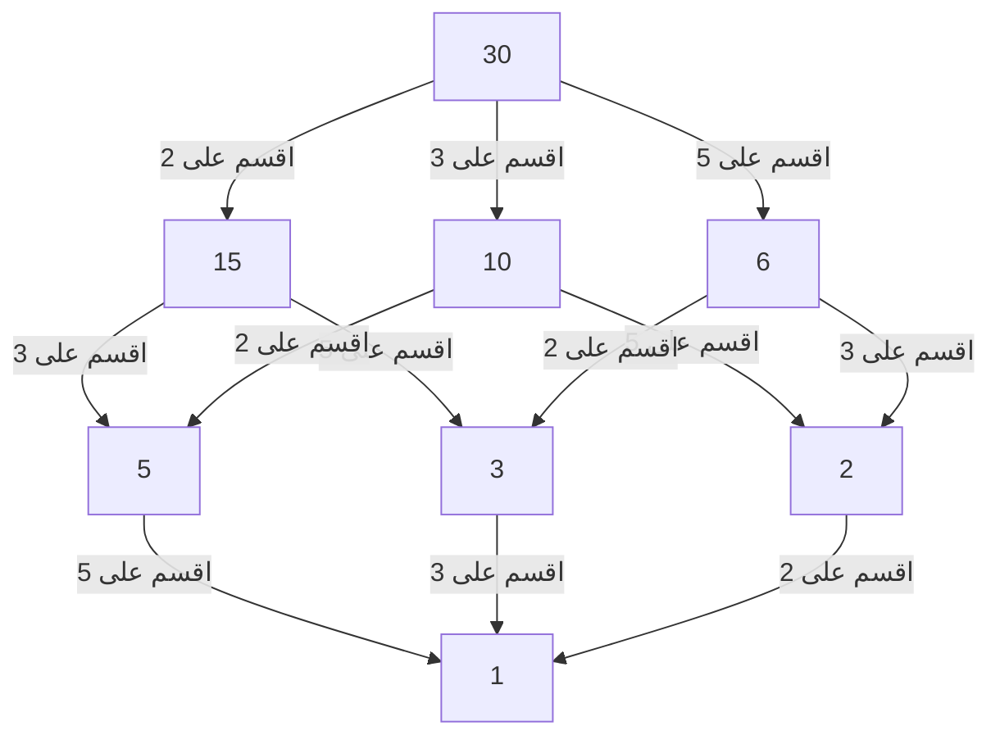

## 1. مقدمة: الجسر بين المحلي والعالمي

في عالم الرياضيات، وخاصة في نظرية الأعداد، ربما يكون الكثير من القراء قد سمعوا بمصطلح "المبدأ المحلي-العالمي". الشخصية المركزية التي أسست هذا المفهوم العميق وقادت ببراعة نظرية الأعداد الجبرية في القرن العشرين كان عالم الرياضيات الألماني **هيلهوت هاسه** (Helmut Hasse، 1898–1979). لقد ارتقى بنظرية الأعداد العادية (p-adic)، التي ابتكرها مرشده كورت هنسل، إلى أداة قوية، وبنى أطراً حاسمة في الرياضيات الحديثة.

في هذا المقال، سنتعمق في تفاصيل حياة هاسه المضطربة وإنجازاته الرياضية الرائعة. لقد أصبح **مبدأ هاسه** الذي دافع عنه مفهوماً لا غنى عنه في الرياضيات الحديثة، وما زال يلهم العديد من علماء الرياضيات حتى اليوم.

## 2. الخلفية والنشأة: من كاسل إلى البحرية

ولد هيلموت هاسه في 25 أغسطس 1898، في مدينة كاسل بالإمبراطورية الألمانية. كان والده قاضيًا، ونشأ في بيئة فكرية صارمة. على الرغم من أن هاسه أظهر موهبة استثنائية في الرياضيات منذ سن مبكرة، إلا أن شبابه تأثر بشدة باندلاع الحرب العالمية الأولى.

في عام 1915، بينما كان لا يزال مراهقًا، انضم هاسه إلى البحرية الإمبراطورية الألمانية وخدم على متن سفينة حربية. حتى في الحياة العسكرية القاسية والممزقة بالحرب، لم يبرد شغفه بالرياضيات أبدًا. يُقال إنه كان يقرأ كتب الرياضيات بنهم خلال كل إجازة ويعمل بشكل مستقل على الحسابات، محافظًا على تعطش لا يرتوي للتعلم.

## 3. غوتينغن وماربورغ: لقاء مع كورت هنسل

بعد انتهاء الحرب في عام 1918، التحق هاسه رسميًا بجامعة غوتينغن. في ذلك الوقت، كانت غوتينغن قمة الرياضيات في العالم، وموطنًا لعمالقة مثل ديفيد هيلبرت، وإدموند لاندو، وإيمي نويثر. هناك، التقى هاسه بأنفاس الرياضيات المتطورة، مما سمح لمواهبه بالازدهار أكثر.

في وقت لاحق، انتقل هاسه إلى جامعة ماربورغ، حيث كان له لقاء مصيري مع **كورت هنسل**، الذي أصبح مرشده مدى الحياة. كان هنسل مكتشف نظام أعداد جديد تمامًا: الأعداد p-adic. في حين نظر العديد من علماء الرياضيات في ذلك الوقت إلى الأعداد p-adic على أنها مجرد فضول رياضي، أدرك هاسه على الفور الإمكانات الهائلة لهذا المفهوم الجديد وصقله ليكون سلاحًا قويًا لأبحاثه الخاصة.

## 4. ما هي الأعداد p-adic: نظام أعداد جديد

لفهم إنجازات هاسه، لا يمكن للمرء تجنب مفهوم الأعداد p-adic. يتم الحصول على الأعداد الحقيقية التي نستخدمها يوميًا من خلال إكمال الأعداد النسبية (الكسور) بناءً على مفهوم "الحجم (القيمة المطلقة)" - وهي عملية أخذ النهايات لسد الفجوات.

ومع ذلك، قدم هنسل مفهومًا مختلفًا تمامًا عن "المسافة". بتثبيت عدد أولي $p$، يتم تعريف عددين نسبيين على أنهما "قريبان" إذا كان من الممكن تقسيم الفرق بينهما على $p$ عدة مرات. إكمال الأعداد النسبية بناءً على هذه المسافة الغريبة يعطي حقل الأعداد p-adic $\mathbb{Q}_p$. في عالم الأعداد p-adic، يمكن للسلاسل اللانهائية التي قد تتباعد في العالم الحقيقي أن تتقارب، مما يجعل من الممكن معالجة مشاكل التطابق باستخدام الطرق التحليلية.

## 5. إنشاء مبدأ هاسه (المبدأ المحلي-العالمي)

تتمثل إحدى أعظم مساهمات هاسه في إنشاء **المبدأ المحلي-العالمي** باستخدام هذه الأعداد p-adic. هذه فلسفة رياضية عظيمة تنص على أن "الشرط الضروري والكافي لمعادلة لكي يكون لها حل على حقل الأعداد النسبية (العالمي) هو أن يكون لها حلول على جميع الحقول p-adic وحقل الأعداد الحقيقية (المحلي)".

يتم اختزال تحديد وجود حلول في الحقول الحقيقية أو p-adic إلى التحقق من علامات الأعداد الحقيقية أو حساب التطابقات في الحقول المنتهية، على التوالي، وهو أمر سهل نسبيًا. بمعنى آخر، فإنه يوضح الحقيقة المذهلة المتمثلة في أنه من خلال جمع جميع المعلومات "المحلية"، يتم تحديد المعلومات "العالمية" بالكامل.

## 6. نظرية هاسه-مينكوفسكي: التطبيق على الأشكال التربيعية

أجمل مثال على هذا المبدأ المحلي-العالمي في العمل هو **نظرية هاسه-مينكوفسكي** للأشكال التربيعية.

لنفترض أننا نريد تحديد ما إذا كانت المعادلة $Q(x_1, x_2, \dots, x_n) = 0$، المحددة بواسطة شكل تربيعي $Q$ بمعاملات نسبية، لها حل نسبي غير بديهي (حل حيث لا تكون جميع المتغيرات صفراً). في هذه الحالة، تنطبق النظرية التالية:

$$
\text{المعادلة } Q(x) = 0 \text{ لها حل غير بديهي على } \mathbb{Q} \iff \text{لها حلول على } \mathbb{Q}_p \text{ لكل عدد أولي } p \text{ وعلى } \mathbb{R}
$$

بفضل هذه النظرية، تم حل مشكلة تحديد وجود حلول نسبية للأشكال التربيعية بالكامل. هذا النجاح الساحق جعل اسم هاسه يتردد صداه في جميع أنحاء عالم الرياضيات في سن مبكرة.

## 7. مخطط هاسه: تصور هياكل الترتيب والجبر

اسم هاسه موجود أيضًا في **مخطط هاسه**، والذي يستخدم كثيرًا في الجبر المجرد والرياضيات المتقطعة. إنه رسم بياني لتمثيل المجموعات المرتبة جزئيًا بشكل مرئي. على الرغم من أن هاسه نفسه لم يكن المخترع الأصلي لهذا المخطط، فقد ارتبط اسمه به لأنه استخدمه بفعالية كبيرة لفهم الهياكل الجبرية.

فيما يلي مثال لمخطط هاسه يقدم ترتيب "القابلية للقسمة" لمجموعة قواسم العدد 30.

وبهذه الطريقة، كان هاسه ماهرًا بشكل استثنائي في فهم المفاهيم المجردة بشكل حدسي وبصري.

## 8. نظرية هاسه-فايل: النقاط النسبية على المنحنيات الإهليلجية

مساهمة أخرى مهمة للغاية لهاسه هي **نظرية هاسه حول المنحنيات الإهليلجية** على الحقول المنتهية. كانت هذه نتيجة تاريخية، واعتبرت الخطوة الأولى نحو "نظير لفرضية ريمان" للتنوعات الجبرية على الحقول المنتهية.

ليكن $N$ هو عدد النقاط النسبية على منحنى إهليلجي $E$ معرف على حقل منتهٍ $\mathbb{F}_q$ (حقل به $q$ من العناصر). أثبت هاسه أن عدد النقاط النسبية $N$ قريب من $q + 1$ (عدد النقاط على الخط الإسقاطي)، والخطأ مقيد على النحو التالي:

$$
|N - (q + 1)| \le 2\sqrt{q}
$$

امتد هذا التباين الجميل لاحقًا إلى المنحنيات الجبرية العامة بواسطة تلميذه أندريه فايل (تخمينات فايل) وتم حله أخيرًا بواسطة بيير ديلين، مما يمثل نقطة انطلاق حاسمة في تاريخ عظيم للرياضيات.

## 9. المساهمة في نظرية حقل الفصل: نظرية حقل الفصل المحلي ومعاملة أرتين بالمثل

عند مناقشة إنجازات هاسه، فإن مساهمته الهائلة في **نظرية حقل الفصل** لا غنى عنها. نظرية حقل الفصل هي نظرية تحاول وصف الامتدادات الأبيلية (الامتدادات حيث تكون زمرة جالوا تبادلية) لحقل أعداد جبري (امتداد منتهٍ للأعداد النسبية) بشكل كامل باستخدام معلومات داخلية من الحقل الأساسي نفسه.

في إثبات "قانون المعاملة بالمثل" الذي اقترحه إميل أرتين، لعب هاسه دورًا بالغ الأهمية. باستخدام الأساليب التحليلية ونظرية الأعداد p-adic، قدم هاسه نصائح حاسمة لأرتين، مما ساهم بشكل كبير في إكمال الإثبات. لعب هاسه نفسه أيضًا دورًا محوريًا في بناء نظرية حقل الفصل المحلي، وإعادة بناء نظرية حقل الفصل العالمي من منظور الحقول المحلية.

## 10. التفاعل مع إيمي نويثر ومعاصريها

شخصية بارزة بشكل خاص في تفاعلات هاسه الأكاديمية هي **إيمي نويثر**، والتي غالبًا ما يطلق عليها أم الجبر المجرد. كان هاسه يتردد صدى عميقًا مع نهج نويثر المجرد والهيكلي، حيث قام بدمج إطار الجبر غير التبادلي الخاص بها بنشاط في أبحاث نظرية الأعداد الخاصة به.

ونتيجة لهذا التعاون، فإن **نظرية ألبرت-براور-هاسه-نويثر**، التي أثبتها هاسه ونويثر وريتشارد براور وأ. أ. ألبرت، تقف كإنجاز ضخم في نظرية الجبر. وهذا أيضًا مثال جميل للمبدأ المحلي-العالمي.

## 11. التحفة "نظرية الأعداد" والأنشطة التعليمية

لم يكن هاسه باحثًا متميزًا فحسب، بل كان أيضًا معلمًا شغوفًا وممتازًا للغاية. اعتبر كتابه المدرسي **"نظرية الأعداد"** (Zahlentheorie) لسنوات عديدة كمرجع للطلاب الذين يدرسون نظرية الأعداد الجبرية. في هذا الكتاب، شرح بعناية المفاهيم المجردة والصعبة باستخدام أمثلة ملموسة وبديهية. كان لموقفه المتمثل في تقييم قابلية الحساب تأثير عميق على العديد من طلابه.

## 12. الأوقات المضطربة: الحرب العالمية الثانية وإعادة البناء بعد الحرب

تأثرت مسيرة هاسه الأكاديمية بشكل كبير بأمواج عصره العاتية. في ثلاثينيات القرن العشرين، عمل كمدير لمعهد الرياضيات كأستاذ في جامعة غوتينغن، لكن المعهد عانى بشدة مع صعود النظام النازي. على الرغم من إجباره على تنازلات سياسية، كافح هاسه نفسه لحماية تقاليد الرياضيات في ألمانيا.

بعد الحرب العالمية الثانية، عانى من صعوبة إيقافه مؤقتًا عن التدريس بسبب تحقيقات حول تورطه مع النازيين. ومع ذلك، لم تفقد موهبته الرياضية وشغفه أبدًا. في عام 1949، انتقل إلى جامعة برلين ثم إلى جامعة هامبورغ، مكرسًا نفسه مرة أخرى للبحث ورعاية الجيل القادم.

## 13. تحرير مجلة كريل والسنوات الأخيرة

كما سكب هاسه شغفه في تحرير المجلة الرياضية المتخصصة **"مجلة كريل"** (Journal für die reine und angewandte Mathematik)، حيث عمل كرئيس تحرير. واصل توفير منصة لتقديم المواهب للعالم من خلال نشر أوراق واعدة لعلماء رياضيات شباب بنشاط. حتى في فوضى ما بعد الحرب، كانت جهوده نحو إعادة بناء مجتمع الرياضيات الألماني واستئناف التبادلات الدولية لا تقدر بثمن.

## 14. الخاتمة: إرث للرياضيات الحديثة

أنهى هيلموت هاسه حياته في عام 1979. حقيقة أنه قام دائمًا بدمج المفاهيم المتعارضة المتمثلة في "الملموس والمجرد" و"المحلي والعالمي" ببراعة تتضح من النظريات العديدة التي تركها وراءه.

وسع نهجه p-adic ومبدأ هاسه تطبيقاتها عبر مجموعة واسعة من المجالات، بما في ذلك الهندسة الحسابية الحديثة والتشفير. شخصية الباحث الذي استمر في السعي وراء الحقيقة أثناء النجاة من حقبة مضطربة، والنظريات الرياضية الجميلة التي نسجها، ستظل بالتأكيد نورًا هاديًا لأولئك الذين يطمحون إلى دراسة الرياضيات لفترة طويلة.
