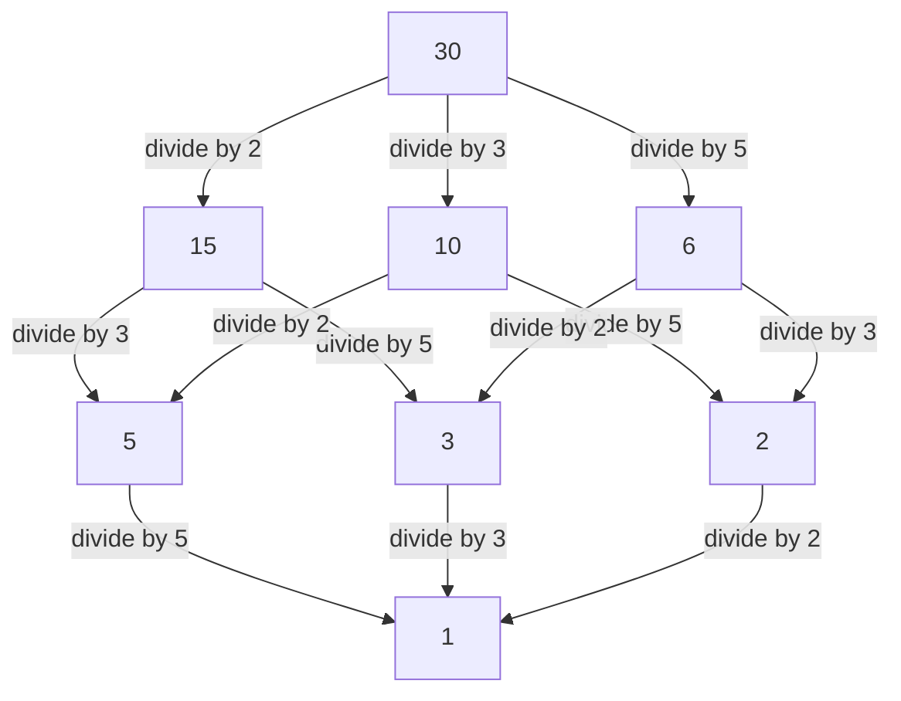

## 1. Introduction: Bridging the Local and the Global

In the world of mathematics, particularly in number theory, many readers may have heard the term "local-global principle." The central figure who established this profound concept and powerfully led 20th-century algebraic number theory was the German mathematician **[Helmut Hasse](https://kenji.blog/en/p/hasse/)** (1898–1979). He elevated the theory of p-adic numbers, pioneered by his mentor [Kurt Hensel](https://kenji.blog/en/p/hensel/), into a powerful tool, building crucial frameworks in modern mathematics.

In this article, we will delve into the episodes of Hasse's turbulent life and his brilliant mathematical achievements in detail. The **Hasse Principle** he advocated has become an indispensable concept in modern mathematics, continuing to inspire many mathematicians today.

## 2. Background and Early Life: From Kassel to the Navy

[Helmut Hasse](https://kenji.blog/en/p/hasse/) was born on August 25, 1898, in the city of Kassel, German Empire. His father was a judge, and he was raised in a strict, intellectual environment. Although Hasse showed an extraordinary talent for mathematics from a young age, his youth was deeply affected by the outbreak of World War I.

In 1915, while still a teenager, Hasse joined the Imperial German Navy and served aboard a warship. Even in the harsh and unceasingly war-torn military life, his passion for mathematics never cooled. It is said that during every leave, he avidly read mathematical textbooks and independently worked on calculations, maintaining an unquenchable thirst for learning.

## 3. Göttingen and Marburg: Meeting [Kurt Hensel](https://kenji.blog/en/p/hensel/)

After the war ended in 1918, Hasse officially enrolled at the University of Göttingen. At the time, Göttingen was the world's pinnacle of mathematics, home to giants like [David Hilbert](https://kenji.blog/en/p/hilbert/), Edmund Landau, and [Emmy Noether](https://kenji.blog/en/p/noether/). There, Hasse encountered the breath of cutting-edge mathematics, allowing his talents to blossom further.

Later, Hasse transferred to the University of Marburg, where he had a fateful encounter with **[Kurt Hensel](https://kenji.blog/en/p/hensel/)**, who would become his lifelong mentor. [Hensel](https://kenji.blog/en/p/hensel/) was the discoverer of an entirely new number system: the p-adic numbers. While many mathematicians at the time viewed p-adic numbers as mere mathematical curiosities, Hasse immediately recognized the immense potential of this new concept and refined it into a powerful weapon for his own research.

## 4. What are p-adic Numbers: A New Number System

To understand Hasse's achievements, one cannot avoid the concept of p-adic numbers. The real numbers we use daily are obtained by completing the rational numbers (fractions) based on the concept of "size (absolute value)"—a process of taking limits to fill in the gaps.

However, [Hensel](https://kenji.blog/en/p/hensel/) introduced a completely different concept of "distance." Fixing a prime number $p$, two rational numbers are defined as "close" if their difference can be divided by $p$ many times. Completing the rational numbers based on this strange distance yields the field of p-adic numbers $\mathbb{Q}_p$. In the world of p-adic numbers, infinite series that would diverge in the real world can converge, making it possible to treat congruence problems using analytical methods.

## 5. Establishment of the Hasse Principle (Local-Global Principle)

One of Hasse's greatest contributions is the establishment of the **Local-Global Principle** using these p-adic numbers. This is a grand mathematical philosophy stating that "a necessary and sufficient condition for an equation to have a solution over the field of rational numbers (the global world) is that it has solutions over all p-adic fields and the field of real numbers (the local worlds)."

Determining the existence of solutions in real or p-adic fields reduces to checking the signs of real numbers or computing congruences in finite fields, respectively, which is relatively easy. In other words, it demonstrates the astonishing fact that by gathering all the "local" information, the "global" information is completely determined.

## 6. The Hasse-Minkowski Theorem: Application to Quadratic Forms

The most beautiful example of this local-global principle at work is the **Hasse-Minkowski Theorem** for quadratic forms.

Suppose we want to determine whether an equation $Q(x_1, x_2, \dots, x_n) = 0$, defined by a quadratic form $Q$ with rational coefficients, has a non-trivial rational solution (a solution where not all variables are zero). In this case, the following theorem holds:

$$
\text{The equation } Q(x) = 0 \text{ has a non-trivial solution over the rational field } \mathbb{Q} \iff \text{It has solutions over } \mathbb{Q}_p \text{ for all primes } p, \text{ and over the real field } \mathbb{R}
$$

Thanks to this theorem, the problem of determining the existence of rational solutions for quadratic forms was completely solved. This overwhelming success made Hasse's name resound throughout the mathematical world at a young age.

## 7. Hasse Diagram: Visualizing Order Structures and Algebra

Hasse's name also survives in the **Hasse Diagram**, frequently used in abstract algebra and discrete mathematics. This is a graph for visually representing partially ordered sets. Although Hasse himself was not the original inventor of this diagram, his name became attached to it because he used it so effectively to understand algebraic structures.

Below is an example of a Hasse diagram introducing the order of "divisibility" to the set of divisors of 30.

In this way, Hasse was exceptionally skilled at intuitively and visually grasping abstract concepts.

## 8. Hasse-Weil Theorem: Rational Points on Elliptic Curves

Another extremely important contribution by Hasse is **Hasse's Theorem on Elliptic Curves** over finite fields. This was an epoch-making result, considered the first step toward an "analog of the [Riemann](https://kenji.blog/en/p/riemann/) Hypothesis" for algebraic varieties over finite fields.

Let $N$ be the number of rational points on an elliptic curve $E$ defined over a finite field $\mathbb{F}_q$ (a field with $q$ elements). Hasse proved that the number of rational points $N$ is close to $q + 1$ (the number of points on the projective line), and the error is bounded as follows:

$$
|N - (q + 1)| \le 2\sqrt{q}
$$

This beautiful inequality was later extended to general algebraic curves by his own student [André Weil](https://kenji.blog/en/p/weil/) (the Weil Conjectures) and finally resolved by Pierre Deligne, marking a crucial starting point in a grand history of mathematics.

## 9. Contribution to Class Field Theory: Local Class Field Theory and Artin Reciprocity

When discussing Hasse's achievements, his massive contribution to **Class Field Theory** is indispensable. Class field theory is a theory that attempts to completely describe the abelian extensions (extensions where the [Galois](https://kenji.blog/en/p/galois/) group is commutative) of an algebraic number field (a finite extension of the rational numbers) using internal information from the base field itself.

In the proof of the "Reciprocity Law" proposed by Emil Artin, Hasse played a vitally important role. Utilizing analytical methods and the theory of p-adic numbers, Hasse offered crucial advice to Artin, greatly contributing to the completion of the proof. Hasse himself also played a central role in constructing Local Class Field Theory, reconstructing global class field theory from the perspective of local fields.

## 10. Interaction with [Emmy Noether](https://kenji.blog/en/p/noether/) and Contemporaries

A particularly notable figure in Hasse's academic interactions is **[Emmy Noether](https://kenji.blog/en/p/noether/)**, often called the mother of abstract algebra. Hasse deeply resonated with Noether's abstract and structural approach, actively incorporating her framework of non-commutative algebra into his own number-theoretic research.

As a result of this collaboration, the **Albert-Brauer-Hasse-Noether Theorem**, proven by Hasse, Noether, Richard Brauer, and A. A. Albert, stands as a monumental achievement in the theory of algebras. This is also a beautiful example of the local-global principle.

## 11. The Masterpiece "Number Theory" and Educational Activities

Hasse was not only an outstanding researcher but also a very passionate and excellent educator. His textbook **"Number Theory"** (Zahlentheorie) was regarded for many years as a bible for students studying algebraic number theory. In this book, he carefully explained abstract and difficult concepts using concrete and intuitive examples. His attitude of valuing computability had a profound influence on many of his students.

## 12. Turbulent Times: World War II and Post-War Reconstruction

Hasse's academic career was greatly tossed about by the rough waves of his era. In the 1930s, he served as the director of the Mathematical Institute as a professor at the University of Göttingen, but the institute suffered severely with the rise of the Nazi regime. While forced into political compromises, Hasse himself struggled to protect the tradition of mathematics in Germany.

After World War II, he suffered the hardship of being temporarily dismissed from teaching due to inquiries into his involvement with the Nazis. However, his mathematical talent and passion were never lost; in 1949, he moved to the University of Berlin and later to the University of Hamburg, dedicating himself once again to research and fostering the next generation.

## 13. Editing Crelle's Journal and Later Years

Hasse also poured his passion into editing the specialized mathematics journal **"Crelle's Journal"** (Journal für die reine und angewandte Mathematik), where he served as chief editor. He continuously provided a platform to introduce talent to the world by actively publishing promising papers by young mathematicians. Even in the post-war chaos, his efforts toward the reconstruction of the German mathematical community and the resumption of international exchanges were immeasurable.

## 14. Conclusion: Legacy to Modern Mathematics

[Helmut Hasse](https://kenji.blog/en/p/hasse/) closed his life in 1979. The fact that he always masterfully integrated the opposing concepts of "concrete and abstract" and "local and global" is proven by the numerous theorems he left behind.

His p-adic approach and the Hasse Principle have expanded their applications across a wide range of fields, including modern arithmetic geometry and cryptography. The figure of a scholar who continued to pursue truth while surviving a turbulent era, and the beautiful mathematical theories he wove, will surely remain a guiding light for those who aspire to study mathematics for a long time to come.
