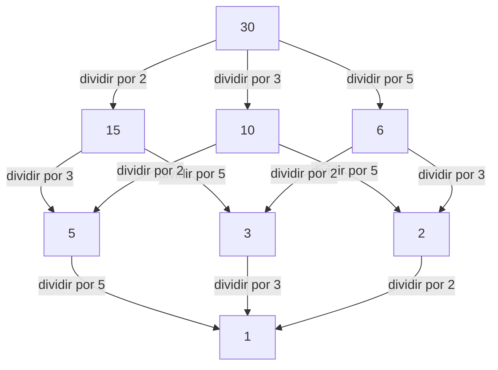

## 1. Introducción: Conectando lo local y lo global

En el mundo de las matemáticas, particularmente en la teoría de números, muchos lectores pueden haber oído hablar del "principio local-global". La figura central que estableció este profundo concepto y lideró poderosamente la teoría algebraica de números del siglo XX fue el matemático alemán **[Helmut Hasse](https://kenji.blog/es/p/hasse/)** (1898–1979). Él elevó la teoría de los números p-ádicos, iniciada por su mentor [Kurt Hensel](https://kenji.blog/es/p/hensel/), a una poderosa herramienta, construyendo marcos cruciales en las matemáticas modernas.

En este artículo, profundizaremos en los episodios de la turbulenta vida de Hasse y sus brillantes logros matemáticos. El **Principio de Hasse** que él defendió se ha convertido en un concepto indispensable en las matemáticas modernas, continuando inspirando a muchos matemáticos en la actualidad.

## 2. Antecedentes y primeros años: De Kassel a la Marina

[Helmut Hasse](https://kenji.blog/es/p/hasse/) nació el 25 de agosto de 1898 en la ciudad de Kassel, en el Imperio Alemán. Su padre era juez, y creció en un ambiente intelectual y estricto. Aunque Hasse mostró un talento extraordinario para las matemáticas desde una edad temprana, su juventud se vio profundamente afectada por el estallido de la Primera Guerra Mundial.

En 1915, siendo aún un adolescente, Hasse se unió a la Marina Imperial Alemana y sirvió a bordo de un buque de guerra. Incluso en la dura e incesante vida militar desgarrada por la guerra, su pasión por las matemáticas nunca se enfrió. Se dice que durante cada permiso, leía ávidamente libros de matemáticas y trabajaba de forma independiente en cálculos, manteniendo una sed inagotable de aprendizaje.

## 3. Gotinga y Marburgo: Encuentro con [Kurt Hensel](https://kenji.blog/es/p/hensel/)

Después de que terminó la guerra en 1918, Hasse se matriculó oficialmente en la Universidad de Gotinga. En ese momento, Gotinga era la cúspide mundial de las matemáticas, hogar de gigantes como [David Hilbert](https://kenji.blog/es/p/hilbert/), Edmund Landau y [Emmy Noether](https://kenji.blog/es/p/noether/). Allí, Hasse se encontró con el aliento de las matemáticas de vanguardia, lo que permitió que sus talentos florecieran aún más.

Más tarde, Hasse se trasladó a la Universidad de Marburgo, donde tuvo un encuentro fatídico con **[Kurt Hensel](https://kenji.blog/es/p/hensel/)**, quien se convertiría en su mentor de por vida. [Hensel](https://kenji.blog/es/p/hensel/) era el descubridor de un sistema numérico completamente nuevo: los números p-ádicos. Mientras que muchos matemáticos de la época veían los números p-ádicos como meras curiosidades matemáticas, Hasse reconoció de inmediato el inmenso potencial de este nuevo concepto y lo refinó para convertirlo en una poderosa arma para su propia investigación.

## 4. ¿Qué son los números p-ádicos? Un nuevo sistema numérico

Para comprender los logros de Hasse, no se puede evitar el concepto de los números p-ádicos. Los números reales que usamos a diario se obtienen al completar los números racionales (fracciones) basándose en el concepto de "tamaño (valor absoluto)", un proceso de tomar límites para llenar los vacíos.

Sin embargo, [Hensel](https://kenji.blog/es/p/hensel/) introdujo un concepto de "distancia" completamente diferente. Fijando un número primo $p$, dos números racionales se definen como "cercanos" si su diferencia se puede dividir por $p$ muchas veces. Completar los números racionales basándose en esta extraña distancia produce el cuerpo de los números p-ádicos $\mathbb{Q}_p$. En el mundo de los números p-ádicos, series infinitas que divergirían en el mundo real pueden converger, lo que hace posible tratar problemas de congruencia utilizando métodos analíticos.

## 5. Establecimiento del Principio de Hasse (Principio local-global)

Una de las mayores contribuciones de Hasse es el establecimiento del **Principio local-global** utilizando estos números p-ádicos. Se trata de una gran filosofía matemática que establece que "una condición necesaria y suficiente para que una ecuación tenga una solución sobre el cuerpo de los números racionales (el mundo global) es que tenga soluciones sobre todos los cuerpos p-ádicos y el cuerpo de los números reales (los mundos locales)".

Determinar la existencia de soluciones en cuerpos reales o p-ádicos se reduce a verificar los signos de los números reales o calcular congruencias en cuerpos finitos, respectivamente, lo cual es relativamente fácil. En otras palabras, demuestra el hecho asombroso de que al recopilar toda la información "local", la información "global" se determina por completo.

## 6. El Teorema de Hasse-Minkowski: Aplicación a las formas cuadráticas

El ejemplo más hermoso de este principio local-global en acción es el **Teorema de Hasse-Minkowski** para formas cuadráticas.

Supongamos que queremos determinar si una ecuación $Q(x_1, x_2, \dots, x_n) = 0$, definida por una forma cuadrática $Q$ con coeficientes racionales, tiene una solución racional no trivial (una solución donde no todas las variables son cero). En este caso, se cumple el siguiente teorema:

$$
\text{La ecuación } Q(x) = 0 \text{ tiene una solución no trivial sobre } \mathbb{Q} \iff \text{Tiene soluciones sobre } \mathbb{Q}_p \text{ para todo primo } p \text{ y sobre } \mathbb{R}
$$

Gracias a este teorema, el problema de determinar la existencia de soluciones racionales para formas cuadráticas se resolvió por completo. Este éxito abrumador hizo que el nombre de Hasse resonara en todo el mundo matemático a una edad temprana.

## 7. Diagrama de Hasse: Visualizando estructuras de orden y álgebra

El nombre de Hasse también sobrevive en el **Diagrama de Hasse**, que se usa con frecuencia en el álgebra abstracta y las matemáticas discretas. Es un gráfico para representar visualmente conjuntos parcialmente ordenados. Aunque Hasse mismo no fue el inventor original de este diagrama, su nombre se le atribuyó porque lo usó de manera muy efectiva para comprender estructuras algebraicas.

A continuación se muestra un ejemplo de un diagrama de Hasse que introduce el orden de "divisibilidad" al conjunto de divisores de 30.

De esta manera, Hasse fue excepcionalmente hábil para captar de manera intuitiva y visual conceptos abstractos.

## 8. Teorema de Hasse-Weil: Puntos racionales en curvas elípticas

Otra contribución sumamente importante de Hasse es el **Teorema de Hasse sobre curvas elípticas** sobre cuerpos finitos. Este fue un resultado histórico, considerado el primer paso hacia un "análogo de la Hipótesis de [Riemann](https://kenji.blog/es/p/riemann/)" para variedades algebraicas sobre cuerpos finitos.

Sea $N$ el número de puntos racionales en una curva elíptica $E$ definida sobre un cuerpo finito $\mathbb{F}_q$ (un cuerpo con $q$ elementos). Hasse demostró que el número de puntos racionales $N$ está cerca de $q + 1$ (el número de puntos en la línea proyectiva), y el error está acotado de la siguiente manera:

$$
|N - (q + 1)| \le 2\sqrt{q}
$$

Esta hermosa desigualdad fue luego extendida a curvas algebraicas generales por su propio alumno [André Weil](https://kenji.blog/es/p/weil/) (las Conjeturas de Weil) y finalmente resuelta por Pierre Deligne, marcando un punto de partida crucial en una gran historia de las matemáticas.

## 9. Contribución a la Teoría de Cuerpos de Clases: Teoría Local y Reciprocidad de Artin

Al discutir los logros de Hasse, su contribución masiva a la **Teoría de Cuerpos de Clases** es indispensable. La teoría de cuerpos de clases es una teoría que intenta describir completamente las extensiones abelianas (extensiones donde el grupo de [Galois](https://kenji.blog/es/p/galois/) es conmutativo) de un cuerpo de números algebraicos (una extensión finita de los números racionales) utilizando información interna del propio cuerpo base.

En la demostración de la "Ley de Reciprocidad" propuesta por Emil Artin, Hasse jugó un papel de vital importancia. Utilizando métodos analíticos y la teoría de los números p-ádicos, Hasse ofreció un consejo crucial a Artin, contribuyendo en gran medida a la finalización de la demostración. El propio Hasse también jugó un papel central en la construcción de la Teoría Local de Cuerpos de Clases, reconstruyendo la teoría global de cuerpos de clases desde la perspectiva de los cuerpos locales.

## 10. Interacción con [Emmy Noether](https://kenji.blog/es/p/noether/) y sus contemporáneos

Una figura particularmente notable en las interacciones académicas de Hasse es **[Emmy Noether](https://kenji.blog/es/p/noether/)**, a menudo llamada la madre del álgebra abstracta. Hasse resonó profundamente con el enfoque abstracto y estructural de Noether, incorporando activamente su marco de álgebra no conmutativa en su propia investigación teórica de números.

Como resultado de esta colaboración, el **Teorema de Albert-Brauer-Hasse-Noether**, demostrado por Hasse, Noether, Richard Brauer y A. A. Albert, se erige como un logro monumental en la teoría de álgebras. Este también es un hermoso ejemplo del principio local-global.

## 11. La obra maestra "Teoría de números" y actividades educativas

Hasse no solo fue un investigador destacado sino también un educador muy apasionado y excelente. Su libro de texto **"Teoría de números"** (Zahlentheorie) fue considerado durante muchos años como una biblia para los estudiantes de teoría algebraica de números. En este libro, explicó cuidadosamente conceptos abstractos y difíciles utilizando ejemplos concretos e intuitivos. Su actitud de valorar la calculabilidad tuvo una profunda influencia en muchos de sus estudiantes.

## 12. Tiempos turbulentos: Segunda Guerra Mundial y reconstrucción de la posguerra

La carrera académica de Hasse se vio muy sacudida por las agitadas olas de su época. En la década de 1930, se desempeñó como director del Instituto de Matemáticas como profesor en la Universidad de Gotinga, pero el instituto sufrió gravemente con el ascenso del régimen nazi. Aunque obligado a hacer compromisos políticos, el propio Hasse luchó por proteger la tradición de las matemáticas en Alemania.

Después de la Segunda Guerra Mundial, sufrió las dificultades de ser suspendido temporalmente de la enseñanza debido a investigaciones sobre su participación con los nazis. Sin embargo, su talento matemático y su pasión nunca se perdieron; en 1949, se trasladó a la Universidad de Berlín y más tarde a la Universidad de Hamburgo, dedicándose una vez más a la investigación y a fomentar a la próxima generación.

## 13. Edición del Journal de Crelle y últimos años

Hasse también volcó su pasión en la edición de la revista especializada en matemáticas **"Journal de Crelle"** (Journal für die reine und angewandte Mathematik), donde se desempeñó como editor en jefe. Continuamente proporcionó una plataforma para presentar talento al mundo al publicar activamente artículos prometedores de jóvenes matemáticos. Incluso en el caos de la posguerra, sus esfuerzos hacia la reconstrucción de la comunidad matemática alemana y la reanudación de los intercambios internacionales fueron inconmensurables.

## 14. Conclusión: Legado para las matemáticas modernas

[Helmut Hasse](https://kenji.blog/es/p/hasse/) puso fin a su vida en 1979. El hecho de que siempre integrara magistralmente los conceptos opuestos de "concreto y abstracto" y "local y global" queda demostrado por los numerosos teoremas que dejó atrás.

Su enfoque p-ádico y el Principio de Hasse han ampliado sus aplicaciones en una amplia gama de campos, incluida la geometría aritmética moderna y la criptografía. La figura de un erudito que continuó persiguiendo la verdad mientras sobrevivía a una era turbulenta, y las hermosas teorías matemáticas que tejió, seguramente seguirán siendo una luz guía para aquellos que aspiran a estudiar matemáticas durante mucho tiempo.
