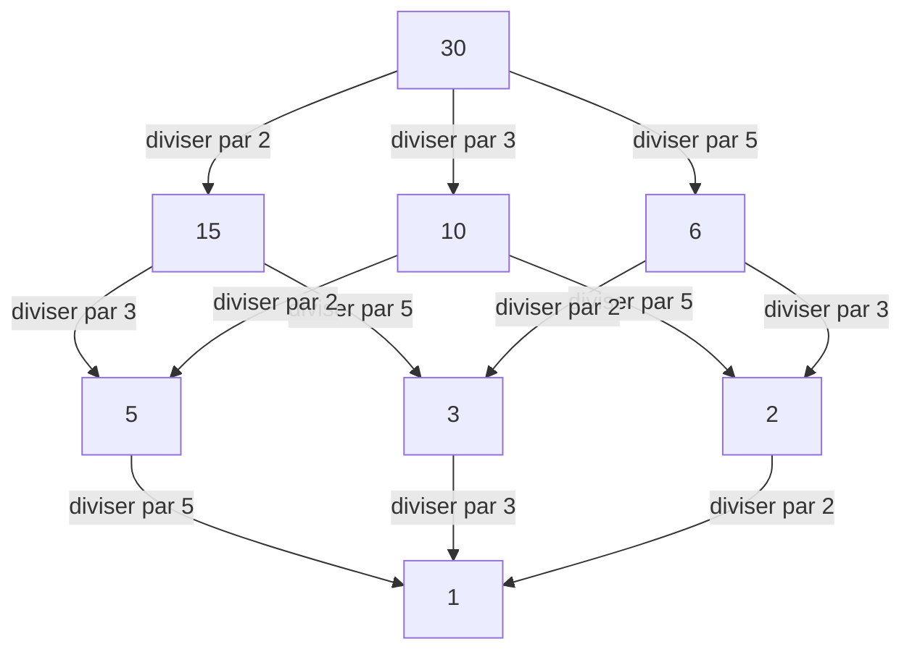

## 1. Introduction : Relier le local et le global

Dans le monde des mathématiques, en particulier dans la théorie des nombres, de nombreux lecteurs ont peut-être entendu parler du "principe local-global". La figure centrale qui a établi ce concept profond et a puissamment dirigé la théorie algébrique des nombres du 20e siècle était le mathématicien allemand **[Helmut Hasse](https://kenji.blog/p/hasse/)** (1898–1979). Il a élevé la théorie des nombres p-adiques, initiée par son mentor [Kurt Hensel](https://kenji.blog/p/hensel/), au rang d'outil puissant, construisant des cadres cruciaux dans les mathématiques modernes.

Dans cet article, nous plongerons en détail dans les épisodes de la vie tumultueuse de Hasse et ses brillantes réalisations mathématiques. Le **principe de Hasse** qu'il a défendu est devenu un concept indispensable dans les mathématiques modernes, continuant d'inspirer de nombreux mathématiciens aujourd'hui.

## 2. Contexte et début de vie : De Kassel à la Marine

[Helmut Hasse](https://kenji.blog/p/hasse/) est né le 25 août 1898 dans la ville de Kassel, dans l'Empire allemand. Son père était juge, et il a grandi dans un environnement strict et intellectuel. Bien que Hasse ait montré un talent extraordinaire pour les mathématiques dès son plus jeune âge, sa jeunesse a été profondément affectée par le déclenchement de la Première Guerre mondiale.

En 1915, alors qu'il n'était qu'un adolescent, Hasse s'est engagé dans la Marine impériale allemande et a servi à bord d'un navire de guerre. Même dans la vie militaire dure et incessamment déchirée par la guerre, sa passion pour les mathématiques ne s'est jamais refroidie. On dit que lors de chaque permission, il lisait avidement des manuels de mathématiques et travaillait de manière indépendante sur des calculs, conservant une soif inépuisable d'apprentissage.

## 3. Göttingen et Marbourg : Rencontre avec [Kurt Hensel](https://kenji.blog/p/hensel/)

Après la fin de la guerre en 1918, Hasse s'est officiellement inscrit à l'Université de Göttingen. À l'époque, Göttingen était le summum mondial des mathématiques, abritant des géants comme [David Hilbert](https://kenji.blog/p/hilbert/), Edmund Landau et [Emmy Noether](https://kenji.blog/p/noether/). Là, Hasse a rencontré le souffle des mathématiques de pointe, permettant à ses talents de s'épanouir davantage.

Plus tard, Hasse a été transféré à l'Université de Marbourg, où il a fait une rencontre fatidique avec **[Kurt Hensel](https://kenji.blog/p/hensel/)**, qui allait devenir son mentor pour la vie. Hensel était le découvreur d'un système de nombres entièrement nouveau : les nombres p-adiques. Alors que de nombreux mathématiciens de l'époque considéraient les nombres p-adiques comme de simples curiosités mathématiques, Hasse a immédiatement reconnu l'immense potentiel de ce nouveau concept et l'a raffiné en une arme puissante pour ses propres recherches.

## 4. Que sont les nombres p-adiques : Un nouveau système de nombres

Pour comprendre les réalisations de Hasse, on ne peut éviter le concept des nombres p-adiques. Les nombres réels que nous utilisons quotidiennement sont obtenus en complétant les nombres rationnels (fractions) sur la base du concept de "taille (valeur absolue)" — un processus de prise de limites pour combler les lacunes.

Cependant, Hensel a introduit un concept de "distance" complètement différent. En fixant un nombre premier $p$, deux nombres rationnels sont définis comme "proches" si leur différence peut être divisée par $p$ de nombreuses fois. Compléter les nombres rationnels sur la base de cette étrange distance donne le corps des nombres p-adiques $\mathbb{Q}_p$. Dans le monde des nombres p-adiques, des séries infinies qui divergeraient dans le monde réel peuvent converger, ce qui permet de traiter les problèmes de congruence à l'aide de méthodes analytiques.

## 5. Établissement du principe de Hasse (principe local-global)

L'une des plus grandes contributions de Hasse est l'établissement du **principe local-global** à l'aide de ces nombres p-adiques. Il s'agit d'une grande philosophie mathématique stipulant qu'"une condition nécessaire et suffisante pour qu'une équation ait une solution sur le corps des nombres rationnels (le monde global) est qu'elle ait des solutions sur tous les corps p-adiques et le corps des nombres réels (les mondes locaux)."

Déterminer l'existence de solutions dans des corps réels ou p-adiques se réduit à vérifier les signes des nombres réels ou à calculer des congruences dans des corps finis, respectivement, ce qui est relativement facile. En d'autres termes, cela démontre le fait étonnant qu'en rassemblant toutes les informations "locales", l'information "globale" est complètement déterminée.

## 6. Le théorème de Hasse-Minkowski : Application aux formes quadratiques

L'exemple le plus beau de ce principe local-global en action est le **théorème de Hasse-Minkowski** pour les formes quadratiques.

Supposons que nous voulions déterminer si une équation $Q(x_1, x_2, \dots, x_n) = 0$, définie par une forme quadratique $Q$ à coefficients rationnels, a une solution rationnelle non triviale (une solution où toutes les variables ne sont pas nulles). Dans ce cas, le théorème suivant s'applique :

$$
\text{L'équation } Q(x) = 0 \text{ a une solution non triviale sur } \mathbb{Q} \iff \text{Elle a des solutions sur } \mathbb{Q}_p \text{ pour tout premier } p \text{ et sur } \mathbb{R}
$$

Grâce à ce théorème, le problème de la détermination de l'existence de solutions rationnelles pour les formes quadratiques a été complètement résolu. Ce succès écrasant a fait résonner le nom de Hasse dans tout le monde mathématique dès son plus jeune âge.

## 7. Diagramme de Hasse : Visualiser les structures d'ordre et l'algèbre

Le nom de Hasse survit également dans le **diagramme de Hasse**, fréquemment utilisé en algèbre abstraite et en mathématiques discrètes. C'est un graphe permettant de représenter visuellement des ensembles partiellement ordonnés. Bien que Hasse lui-même ne soit pas l'inventeur original de ce diagramme, son nom y a été attaché car il l'a utilisé de manière très efficace pour comprendre les structures algébriques.

Voici ci-dessous un exemple de diagramme de Hasse introduisant l'ordre de "divisibilité" dans l'ensemble des diviseurs de 30.

De cette façon, Hasse était exceptionnellement doué pour saisir intuitivement et visuellement les concepts abstraits.

## 8. Théorème de Hasse-Weil : Points rationnels sur les courbes elliptiques

Une autre contribution extrêmement importante de Hasse est le **théorème de Hasse sur les courbes elliptiques** sur les corps finis. Ce fut un résultat marquant, considéré comme le premier pas vers un "analogue de l'hypothèse de Riemann" pour les variétés algébriques sur les corps finis.

Soit $N$ le nombre de points rationnels sur une courbe elliptique $E$ définie sur un corps fini $\mathbb{F}_q$ (un corps avec $q$ éléments). Hasse a prouvé que le nombre de points rationnels $N$ est proche de $q + 1$ (le nombre de points sur la droite projective), et l'erreur est limitée comme suit :

$$
|N - (q + 1)| \le 2\sqrt{q}
$$

Cette belle inégalité a ensuite été étendue aux courbes algébriques générales par son propre élève [André Weil](https://kenji.blog/p/weil/) (les conjectures de Weil) et finalement résolue par Pierre Deligne, marquant un point de départ crucial dans une grande histoire des mathématiques.

## 9. Contribution à la théorie du corps de classes : Théorie locale et réciprocité d'Artin

Lorsqu'on discute des réalisations de Hasse, sa contribution massive à la **théorie du corps de classes** est indispensable. La théorie du corps de classes est une théorie qui tente de décrire complètement les extensions abéliennes (extensions où le groupe de Galois est commutatif) d'un corps de nombres algébriques (une extension finie des nombres rationnels) en utilisant les informations internes du corps de base lui-même.

Dans la démonstration de la "loi de réciprocité" proposée par Emil Artin, Hasse a joué un rôle d'une importance vitale. Utilisant des méthodes analytiques et la théorie des nombres p-adiques, Hasse a offert des conseils cruciaux à Artin, contribuant grandement à l'achèvement de la preuve. Hasse a également joué un rôle central dans la construction de la théorie locale du corps de classes, reconstruisant la théorie globale du corps de classes du point de vue des corps locaux.

## 10. Interaction avec [Emmy Noether](https://kenji.blog/p/noether/) et ses contemporains

Une figure particulièrement notable dans les interactions académiques de Hasse est **[Emmy Noether](https://kenji.blog/p/noether/)**, souvent appelée la mère de l'algèbre abstraite. Hasse résonnait profondément avec l'approche abstraite et structurelle de Noether, intégrant activement son cadre d'algèbre non commutative dans ses propres recherches en théorie des nombres.

À la suite de cette collaboration, le **théorème d'Albert-Brauer-Hasse-Noether**, prouvé par Hasse, Noether, Richard Brauer et A. A. Albert, se dresse comme une réalisation monumentale dans la théorie des algèbres. C'est également un bel exemple du principe local-global.

## 11. Le chef-d'œuvre "Théorie des nombres" et activités éducatives

Hasse n'était pas seulement un chercheur exceptionnel, mais aussi un éducateur très passionné et excellent. Son manuel **"Théorie des nombres"** (Zahlentheorie) a été considéré pendant de nombreuses années comme une bible pour les étudiants étudiant la théorie algébrique des nombres. Dans ce livre, il a soigneusement expliqué des concepts abstraits et difficiles en utilisant des exemples concrets et intuitifs. Son attitude consistant à valoriser la calculabilité a eu une profonde influence sur nombre de ses étudiants.

## 12. Époques turbulentes : Seconde Guerre mondiale et reconstruction d'après-guerre

La carrière universitaire de Hasse a été grandement ballottée par les vagues difficiles de son époque. Dans les années 1930, il a occupé le poste de directeur de l'Institut de mathématiques en tant que professeur à l'Université de Göttingen, mais l'institut a gravement souffert avec la montée du régime nazi. Bien que contraint à des compromis politiques, Hasse a lutté pour protéger la tradition des mathématiques en Allemagne.

Après la Seconde Guerre mondiale, il a subi la difficulté d'être temporairement démis de ses fonctions d'enseignant en raison d'enquêtes sur son implication avec les nazis. Cependant, son talent et sa passion pour les mathématiques n'ont jamais été perdus ; en 1949, il a rejoint l'Université de Berlin et plus tard l'Université de Hambourg, se consacrant à nouveau à la recherche et à la formation de la prochaine génération.

## 13. Édition du Journal de Crelle et dernières années

Hasse a également versé sa passion dans l'édition de la revue spécialisée en mathématiques **"Journal de Crelle"** (Journal für die reine und angewandte Mathematik), où il a occupé le poste de rédacteur en chef. Il a continuellement offert une plateforme pour présenter des talents au monde en publiant activement des articles prometteurs de jeunes mathématiciens. Même dans le chaos de l'après-guerre, ses efforts pour la reconstruction de la communauté mathématique allemande et la reprise des échanges internationaux ont été incommensurables.

## 14. Conclusion : Héritage pour les mathématiques modernes

[Helmut Hasse](https://kenji.blog/p/hasse/) a mis fin à ses jours en 1979. Le fait qu'il ait toujours magistralement intégré les concepts opposés de "concret et abstrait" et de "local et global" est prouvé par les nombreux théorèmes qu'il a laissés derrière lui.

Son approche p-adique et le principe de Hasse ont étendu leurs applications à un large éventail de domaines, y compris la géométrie arithmétique moderne et la cryptographie. La figure d'un savant qui a continué à poursuivre la vérité tout en survivant à une époque turbulente, et les belles théories mathématiques qu'il a tissées, resteront sûrement un fil conducteur pour ceux qui aspirent à étudier les mathématiques pendant longtemps encore.
