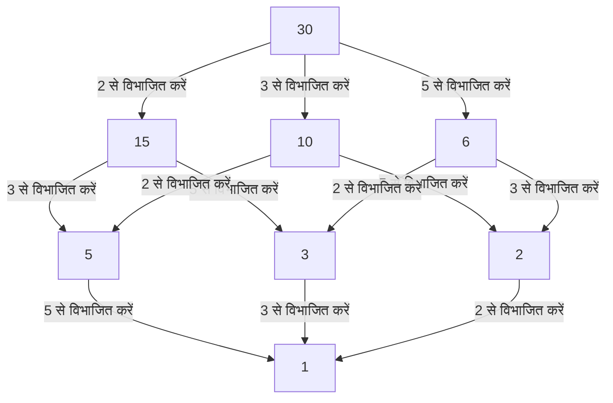

## 1. परिचय: स्थानीय और वैश्विक को जोड़ना

गणित की दुनिया में, विशेष रूप से संख्या सिद्धांत में, कई पाठकों ने "स्थानीय-वैश्विक सिद्धांत" (Local-Global Principle) शब्द सुना होगा। जिस केंद्रीय व्यक्ति ने इस गहन अवधारणा को स्थापित किया और 20वीं सदी के बीजगणितीय संख्या सिद्धांत का शक्तिशाली रूप से नेतृत्व किया, वे जर्मन गणितज्ञ **[हेल्मुट हस्से](https://kenji.blog/hi/p/hasse/)** ([Helmut Hasse](https://kenji.blog/hi/p/hasse/), 1898–1979) थे। उन्होंने अपने गुरु कर्ट हेंसल द्वारा शुरू किए गए पी-एडिक (p-adic) संख्याओं के सिद्धांत को एक शक्तिशाली उपकरण के रूप में उन्नत किया, जिससे आधुनिक गणित में महत्वपूर्ण ढांचे का निर्माण हुआ।

इस लेख में, हम हस्से के अशांत जीवन के प्रसंगों और उनकी शानदार गणितीय उपलब्धियों के बारे में विस्तार से जानेंगे। उनके द्वारा प्रतिपादित **हस्से सिद्धांत** आधुनिक गणित में एक अनिवार्य अवधारणा बन गया है, जो आज भी कई गणितज्ञों को प्रेरित कर रहा है।

## 2. पृष्ठभूमि और प्रारंभिक जीवन: कैसल से नौसेना तक

[हेल्मुट हस्से](https://kenji.blog/hi/p/hasse/) का जन्म 25 अगस्त 1898 को जर्मन साम्राज्य के कैसल शहर में हुआ था। उनके पिता एक न्यायाधीश थे, और उनका पालन-पोषण एक सख्त, बौद्धिक वातावरण में हुआ। यद्यपि हस्से ने कम उम्र से ही गणित के लिए असाधारण प्रतिभा दिखाई, लेकिन प्रथम विश्व युद्ध के प्रकोप से उनका युवावस्था गहराई से प्रभावित हुआ।

1915 में, जब वे अभी किशोर ही थे, हस्से शाही जर्मन नौसेना में शामिल हो गए और एक युद्धपोत पर सेवा की। कठोर और युद्ध से घिरे सैन्य जीवन में भी, गणित के प्रति उनका जुनून कभी कम नहीं हुआ। कहा जाता है कि हर छुट्टी के दौरान, वे गणित की पाठ्यपुस्तकें चाव से पढ़ते थे और स्वतंत्र रूप से गणना करते थे, जिससे सीखने की अदम्य प्यास बनी रहती थी।

## 3. गौटिंगेन और मारबर्ग: कर्ट हेंसल से मुलाकात

1918 में युद्ध समाप्त होने के बाद, हस्से ने आधिकारिक तौर पर गौटिंगेन विश्वविद्यालय में दाखिला लिया। उस समय, गौटिंगेन गणित का विश्व शिखर था, जो [डेविड हिल्बर्ट](https://kenji.blog/hi/p/hilbert/), एडमंड लैंडौ और एमी नोथेर जैसे दिग्गजों का घर था। वहां, हस्से का अत्याधुनिक गणित से सामना हुआ, जिससे उनकी प्रतिभा और अधिक निखरने लगी।

बाद में, हस्से मारबर्ग विश्वविद्यालय चले गए, जहां उनकी एक भाग्यपूर्ण मुलाकात **कर्ट हेंसल** से हुई, जो जीवन भर उनके गुरु बने रहे। हेंसल एक पूरी तरह से नई संख्या प्रणाली: पी-एडिक संख्याओं के खोजकर्ता थे। जबकि उस समय के कई गणितज्ञ पी-एडिक संख्याओं को मात्र गणितीय जिज्ञासा के रूप में देखते थे, हस्से ने तुरंत इस नई अवधारणा की अपार संभावनाओं को पहचाना और इसे अपने स्वयं के शोध के लिए एक शक्तिशाली हथियार में परिष्कृत किया।

## 4. पी-एडिक संख्याएँ क्या हैं: एक नई संख्या प्रणाली

हस्से की उपलब्धियों को समझने के लिए, पी-एडिक संख्याओं की अवधारणा को नजरअंदाज नहीं किया जा सकता है। हम जिन वास्तविक संख्याओं का प्रतिदिन उपयोग करते हैं, वे "आकार (निरपेक्ष मान)" की अवधारणा के आधार पर परिमेय संख्याओं (भिन्नों) को पूरा करके प्राप्त की जाती हैं - जो अंतराल को भरने के लिए सीमाएँ लेने की एक प्रक्रिया है।

हालाँकि, हेंसल ने "दूरी" की एक पूरी तरह से अलग अवधारणा पेश की। एक अभाज्य संख्या $p$ को स्थिर करते हुए, दो परिमेय संख्याओं को "करीब" के रूप में परिभाषित किया जाता है यदि उनके अंतर को $p$ से कई बार विभाजित किया जा सकता है। इस अजीब दूरी के आधार पर परिमेय संख्याओं को पूरा करने से पी-एडिक संख्याओं का क्षेत्र $\mathbb{Q}_p$ प्राप्त होता है। पी-एडिक संख्याओं की दुनिया में, वास्तविक दुनिया में अलग होने वाली अनंत श्रृंखलाएं अभिसरण कर सकती हैं, जिससे विश्लेषणात्मक तरीकों का उपयोग करके सर्वांगसम समस्याओं का इलाज करना संभव हो जाता है।

## 5. हस्से सिद्धांत की स्थापना (स्थानीय-वैश्विक सिद्धांत)

इन पी-एडिक संख्याओं का उपयोग करके **स्थानीय-वैश्विक सिद्धांत** की स्थापना हस्से के सबसे बड़े योगदानों में से एक है। यह एक भव्य गणितीय दर्शन है जिसमें कहा गया है कि "एक समीकरण के परिमेय संख्याओं के क्षेत्र (वैश्विक दुनिया) पर समाधान होने के लिए एक आवश्यक और पर्याप्त शर्त यह है कि इसमें सभी पी-एडिक क्षेत्रों और वास्तविक संख्याओं के क्षेत्र (स्थानीय दुनिया) पर समाधान हैं।"

वास्तविक या पी-एडिक क्षेत्रों में समाधानों के अस्तित्व का निर्धारण क्रमशः वास्तविक संख्याओं के संकेतों की जाँच करने या परिमित क्षेत्रों में सर्वांगसमता की गणना करने के लिए कम हो जाता है, जो अपेक्षाकृत आसान है। दूसरे शब्दों में, यह इस आश्चर्यजनक तथ्य को प्रदर्शित करता है कि सभी "स्थानीय" जानकारी एकत्र करने से "वैश्विक" जानकारी पूरी तरह से निर्धारित हो जाती है।

## 6. हस्से-मिनकोव्स्की प्रमेय: द्विघात रूपों में अनुप्रयोग

कार्रवाई में इस स्थानीय-वैश्विक सिद्धांत का सबसे सुंदर उदाहरण द्विघात रूपों के लिए **हस्से-मिनकोव्स्की प्रमेय** है।

मान लीजिए कि हम यह निर्धारित करना चाहते हैं कि परिमेय गुणांक वाले द्विघात रूप $Q$ द्वारा परिभाषित समीकरण $Q(x_1, x_2, \dots, x_n) = 0$ में गैर-तुच्छ परिमेय समाधान (ऐसा समाधान जहां सभी चर शून्य नहीं हैं) है या नहीं। इस स्थिति में, निम्नलिखित प्रमेय लागू होता है:

$$
\text{समीकरण } Q(x) = 0 \text{ का } \mathbb{Q} \text{ पर एक गैर-तुच्छ समाधान है } \iff \text{इसके सभी अभाज्य } p \text{ के लिए } \mathbb{Q}_p \text{ पर और } \mathbb{R} \text{ पर समाधान हैं}
$$

इस प्रमेय के लिए धन्यवाद, द्विघात रूपों के लिए परिमेय समाधानों के अस्तित्व को निर्धारित करने की समस्या पूरी तरह से हल हो गई थी। इस भारी सफलता ने हस्से के नाम को कम उम्र में ही पूरी गणितीय दुनिया में गूंजने लगा।

## 7. हस्से आरेख: क्रम संरचनाओं और बीजगणित की कल्पना करना

हस्से का नाम **हस्से आरेख** में भी जीवित है, जिसका उपयोग अक्सर अमूर्त बीजगणित और असतत गणित में किया जाता है। आंशिक रूप से क्रमबद्ध सेटों को दृष्टिगत रूप से दर्शाने के लिए यह एक ग्राफ है। यद्यपि हस्से स्वयं इस आरेख के मूल आविष्कारक नहीं थे, फिर भी उनका नाम इसके साथ जुड़ गया क्योंकि उन्होंने बीजगणितीय संरचनाओं को समझने के लिए इसका बहुत प्रभावी ढंग से उपयोग किया था।

नीचे हस्से आरेख का एक उदाहरण दिया गया है जो 30 के भाजक के सेट में "विभाज्यता" के क्रम का परिचय देता है।

इस तरह, हस्से अमूर्त अवधारणाओं को सहजता से और दृष्टिगत रूप से समझने में असाधारण रूप से कुशल थे।

## 8. हस्से-वेइल प्रमेय: अण्डाकार वक्रों पर परिमेय बिंदु

हस्से का एक और अत्यंत महत्वपूर्ण योगदान परिमित क्षेत्रों पर **अण्डाकार वक्रों पर हस्से का प्रमेय** है। यह एक युगांतरकारी परिणाम था, जिसे परिमित क्षेत्रों पर बीजगणितीय किस्मों के लिए "रीमैन परिकल्पना के एनालॉग" की दिशा में पहला कदम माना जाता था।

मान लें कि $N$ परिमित क्षेत्र $\mathbb{F}_q$ ( $q$ तत्वों वाला क्षेत्र) पर परिभाषित अण्डाकार वक्र $E$ पर परिमेय बिंदुओं की संख्या है। हस्से ने साबित किया कि परिमेय बिंदुओं $N$ की संख्या $q + 1$ (प्रोजेक्टिव लाइन पर बिंदुओं की संख्या) के करीब है, और त्रुटि निम्नलिखित रूप से बाध्य है:

$$
|N - (q + 1)| \le 2\sqrt{q}
$$

इस खूबसूरत असमानता को बाद में उनके अपने छात्र [आंद्रे वेइल](https://kenji.blog/hi/p/weil/) (वेइल अनुमान) द्वारा सामान्य बीजगणितीय वक्रों तक विस्तारित किया गया और अंततः पियरे डेलिग्ने द्वारा हल किया गया, जो गणित के एक महान इतिहास में एक महत्वपूर्ण प्रारंभिक बिंदु को चिह्नित करता है।

## 9. वर्ग क्षेत्र सिद्धांत में योगदान: स्थानीय क्षेत्र सिद्धांत और आर्टिन पारस्परिकता

हस्से की उपलब्धियों पर चर्चा करते समय, **वर्ग क्षेत्र सिद्धांत** में उनका व्यापक योगदान अनिवार्य है। वर्ग क्षेत्र सिद्धांत एक ऐसा सिद्धांत है जो आधार क्षेत्र से ही आंतरिक जानकारी का उपयोग करके बीजगणितीय संख्या क्षेत्र (परिमेय संख्याओं का परिमित विस्तार) के एबेलियन एक्सटेंशन (विस्तार जहां गैलोइस समूह कम्यूटेटिव है) का पूरी तरह से वर्णन करने का प्रयास करता है।

एमिल आर्टिन द्वारा प्रस्तावित "पारस्परिकता के नियम" के प्रमाण में, हस्से ने अत्यंत महत्वपूर्ण भूमिका निभाई। विश्लेषणात्मक तरीकों और पी-एडिक संख्याओं के सिद्धांत का उपयोग करते हुए, हस्से ने आर्टिन को महत्वपूर्ण सलाह दी, जिससे प्रमाण को पूरा करने में बहुत योगदान मिला। हस्से ने स्वयं स्थानीय वर्ग क्षेत्र सिद्धांत के निर्माण में भी केंद्रीय भूमिका निभाई, स्थानीय क्षेत्रों के परिप्रेक्ष्य से वैश्विक वर्ग क्षेत्र सिद्धांत का पुनर्निर्माण किया।

## 10. एमी नोथेर और समकालीनों के साथ बातचीत

हस्से की शैक्षणिक बातचीत में विशेष रूप से उल्लेखनीय व्यक्ति **एमी नोथेर** हैं, जिन्हें अक्सर अमूर्त बीजगणित की माँ कहा जाता है। हस्से नोथेर के अमूर्त और संरचनात्मक दृष्टिकोण के साथ गहराई से गूंजते थे, उन्होंने गैर-विनिमेय बीजगणित के अपने ढांचे को अपने स्वयं के संख्या-सैद्धांतिक अनुसंधान में सक्रिय रूप से शामिल किया।

इस सहयोग के परिणामस्वरूप, हस्से, नोथेर, रिचर्ड ब्रौर और ए.ए. अल्बर्ट द्वारा सिद्ध **अल्बर्ट-ब्रौर-हस्से-नोथेर प्रमेय**, बीजगणित के सिद्धांत में एक स्मारकीय उपलब्धि के रूप में खड़ा है। यह भी स्थानीय-वैश्विक सिद्धांत का एक सुंदर उदाहरण है।

## 11. उत्कृष्ट कृति "संख्या सिद्धांत" और शैक्षिक गतिविधियां

हस्से न केवल एक उत्कृष्ट शोधकर्ता थे बल्कि एक बहुत ही भावुक और उत्कृष्ट शिक्षक भी थे। उनकी पाठ्यपुस्तक **"संख्या सिद्धांत"** (Zahlentheorie) को कई वर्षों तक बीजगणितीय संख्या सिद्धांत का अध्ययन करने वाले छात्रों के लिए बाइबिल माना जाता था। इस पुस्तक में, उन्होंने मूर्त और सहज उदाहरणों का उपयोग करके अमूर्त और कठिन अवधारणाओं को ध्यान से समझाया। गणनात्मकता को महत्व देने के उनके रवैये का उनके कई छात्रों पर गहरा प्रभाव पड़ा।

## 12. अशांत समय: द्वितीय विश्व युद्ध और युद्ध के बाद का पुनर्निर्माण

हस्से का शैक्षणिक कैरियर उनके युग की उबड़-खाबड़ लहरों द्वारा बहुत उछाला गया था। 1930 के दशक में, उन्होंने गौटिंगेन विश्वविद्यालय में एक प्रोफेसर के रूप में गणितीय संस्थान के निदेशक के रूप में कार्य किया, लेकिन नाजी शासन के उदय के साथ संस्थान को गंभीर नुकसान हुआ। राजनीतिक समझौते के लिए मजबूर होने के बावजूद, हस्से ने जर्मनी में गणित की परंपरा की रक्षा के लिए संघर्ष किया।

द्वितीय विश्व युद्ध के बाद, नाजियों के साथ उनकी भागीदारी की पूछताछ के कारण उन्हें अस्थायी रूप से शिक्षण से बर्खास्त किए जाने की कठिनाई का सामना करना पड़ा। हालाँकि, उनकी गणितीय प्रतिभा और जुनून कभी नहीं खोया; 1949 में वे बर्लिन विश्वविद्यालय और बाद में हैम्बर्ग विश्वविद्यालय चले गए, और एक बार फिर खुद को शोध और अगली पीढ़ी को बढ़ावा देने के लिए समर्पित कर दिया।

## 13. क्रेल की पत्रिका का संपादन और बाद के वर्ष

हस्से ने अपना जुनून विशेष गणित पत्रिका **"क्रेल की पत्रिका"** (Journal für die reine und angewandte Mathematik) के संपादन में भी डाला, जहां उन्होंने मुख्य संपादक के रूप में कार्य किया। उन्होंने युवा गणितज्ञों के आशाजनक पत्रों को सक्रिय रूप से प्रकाशित करके दुनिया के सामने प्रतिभा पेश करने के लिए लगातार एक मंच प्रदान किया। युद्ध के बाद की अराजकता में भी, जर्मन गणितीय समुदाय के पुनर्निर्माण और अंतर्राष्ट्रीय आदान-प्रदान को फिर से शुरू करने की दिशा में उनके प्रयास अथाह थे।

## 14. निष्कर्ष: आधुनिक गणित के लिए विरासत

[हेल्मुट हस्से](https://kenji.blog/hi/p/hasse/) का 1979 में निधन हो गया। यह तथ्य कि उन्होंने हमेशा "मूर्त और अमूर्त" तथा "स्थानीय और वैश्विक" की विरोधी अवधारणाओं को उत्कृष्ट रूप से एकीकृत किया, उनके द्वारा छोड़े गए कई प्रमेयों से सिद्ध होता है।

उनके पी-एडिक दृष्टिकोण और हस्से सिद्धांत ने आधुनिक अंकगणितीय ज्यामिति और क्रिप्टोग्राफी सहित क्षेत्रों की एक विस्तृत श्रृंखला में अपने अनुप्रयोगों का विस्तार किया है। एक विद्वान का आंकड़ा जिसने अशांत युग से बचे रहते हुए सत्य की खोज करना जारी रखा, और उनके द्वारा बुने गए सुंदर गणितीय सिद्धांत, निश्चित रूप से उन लोगों के लिए एक मार्गदर्शक प्रकाश बने रहेंगे जो लंबे समय तक गणित का अध्ययन करने की इच्छा रखते हैं।
