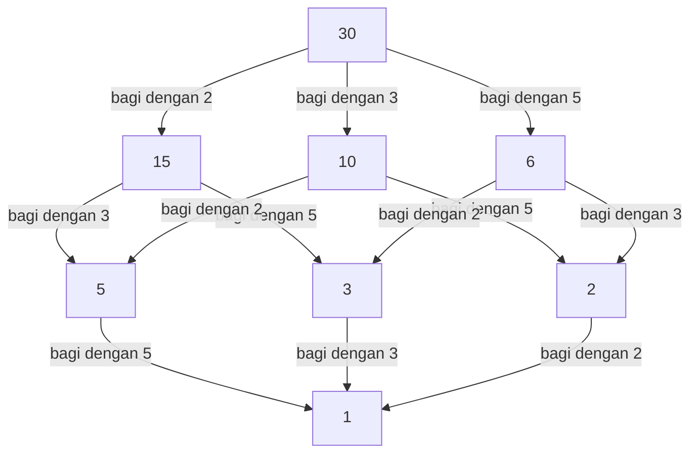

## 1. Pendahuluan: Menjembatani yang Lokal dan yang Global

Dalam dunia matematika, khususnya dalam teori bilangan, banyak pembaca mungkin pernah mendengar istilah "prinsip lokal-global". Tokoh sentral yang membangun konsep mendalam ini dan dengan kuat memimpin teori bilangan aljabar abad ke-20 adalah matematikawan Jerman **[Helmut Hasse](https://kenji.blog/p/hasse/)** (1898–1979). Ia mengangkat teori bilangan p-adic, yang dirintis oleh mentornya [Kurt Hensel](https://kenji.blog/p/hensel/), menjadi alat yang ampuh, membangun kerangka kerja krusial dalam matematika modern.

Dalam artikel ini, kita akan mendalami episode kehidupan Hasse yang penuh gejolak dan pencapaian matematisnya yang brilian secara mendetail. **Prinsip Hasse** yang ia advokasi telah menjadi konsep yang sangat diperlukan dalam matematika modern, terus menginspirasi banyak matematikawan saat ini.

## 2. Latar Belakang dan Kehidupan Awal: Dari Kassel hingga Angkatan Laut

[Helmut Hasse](https://kenji.blog/p/hasse/) lahir pada tanggal 25 Agustus 1898, di kota Kassel, Kekaisaran Jerman. Ayahnya adalah seorang hakim, dan ia dibesarkan dalam lingkungan intelektual yang ketat. Meskipun Hasse menunjukkan bakat luar biasa dalam matematika sejak usia muda, masa mudanya sangat dipengaruhi oleh pecahnya Perang Dunia I.

Pada tahun 1915, saat masih remaja, Hasse bergabung dengan Angkatan Laut Kekaisaran Jerman dan bertugas di kapal perang. Bahkan dalam kehidupan militer yang keras dan tak henti-hentinya dilanda perang, hasratnya terhadap matematika tidak pernah surut. Dikatakan bahwa selama setiap cuti, ia rajin membaca buku teks matematika dan secara mandiri mengerjakan perhitungan, mempertahankan kehausan yang tak terpadamkan untuk belajar.

## 3. Göttingen dan Marburg: Pertemuan dengan [Kurt Hensel](https://kenji.blog/p/hensel/)

Setelah perang berakhir pada tahun 1918, Hasse resmi mendaftar di Universitas Göttingen. Pada saat itu, Göttingen adalah puncak matematika dunia, rumah bagi para raksasa seperti [David Hilbert](https://kenji.blog/p/hilbert/), Edmund Landau, dan [Emmy Noether](https://kenji.blog/p/noether/). Di sana, Hasse menjumpai napas matematika mutakhir, yang memungkinkan bakatnya semakin berkembang.

Kemudian, Hasse pindah ke Universitas Marburg, di mana ia mengalami pertemuan yang menentukan dengan **[Kurt Hensel](https://kenji.blog/p/hensel/)**, yang akan menjadi mentor seumur hidupnya. Hensel adalah penemu sistem bilangan yang sama sekali baru: bilangan p-adic. Sementara banyak matematikawan pada saat itu memandang bilangan p-adic sebagai sekadar keingintahuan matematis, Hasse segera mengenali potensi besar dari konsep baru ini dan menyempurnakannya menjadi senjata ampuh untuk penelitiannya sendiri.

## 4. Apa itu Bilangan p-adic: Sistem Bilangan Baru

Untuk memahami pencapaian Hasse, seseorang tidak dapat menghindari konsep bilangan p-adic. Bilangan real yang kita gunakan sehari-hari diperoleh dengan melengkapi bilangan rasional (pecahan) berdasarkan konsep "ukuran (nilai mutlak)"—sebuah proses mengambil limit untuk mengisi celah.

Namun, Hensel memperkenalkan konsep "jarak" yang sama sekali berbeda. Menetapkan sebuah bilangan prima $p$, dua bilangan rasional didefinisikan sebagai "dekat" jika selisihnya dapat dibagi $p$ berkali-kali. Melengkapi bilangan rasional berdasarkan jarak aneh ini menghasilkan lapangan bilangan p-adic $\mathbb{Q}_p$. Dalam dunia bilangan p-adic, deret tak terhingga yang akan divergen di dunia nyata dapat konvergen, sehingga memungkinkan untuk menangani masalah kekongruenan menggunakan metode analitik.

## 5. Penetapan Prinsip Hasse (Prinsip Lokal-Global)

Salah satu kontribusi terbesar Hasse adalah penetapan **Prinsip Lokal-Global** dengan menggunakan bilangan p-adic ini. Ini adalah filosofi matematika agung yang menyatakan bahwa "syarat perlu dan cukup agar suatu persamaan memiliki solusi atas lapangan bilangan rasional (dunia global) adalah bahwa ia memiliki solusi atas semua lapangan p-adic dan lapangan bilangan real (dunia lokal)."

Menentukan keberadaan solusi dalam lapangan real atau p-adic direduksi menjadi memeriksa tanda bilangan real atau menghitung kekongruenan dalam lapangan hingga, berturut-turut, yang relatif mudah. Dengan kata lain, ini menunjukkan fakta mencengangkan bahwa dengan mengumpulkan semua informasi "lokal", informasi "global" dapat ditentukan sepenuhnya.

## 6. Teorema Hasse-Minkowski: Aplikasi pada Bentuk Kuadrat

Contoh paling indah dari penerapan prinsip lokal-global ini adalah **Teorema Hasse-Minkowski** untuk bentuk kuadrat.

Misalkan kita ingin menentukan apakah suatu persamaan $Q(x_1, x_2, \dots, x_n) = 0$, yang didefinisikan oleh bentuk kuadrat $Q$ dengan koefisien rasional, memiliki solusi rasional non-trivial (solusi di mana tidak semua variabel bernilai nol). Dalam kasus ini, teorema berikut berlaku:

$$
\text{Persamaan } Q(x) = 0 \text{ memiliki solusi non-trivial atas } \mathbb{Q} \iff \text{Ia memiliki solusi atas } \mathbb{Q}_p \text{ untuk semua prima } p \text{ dan atas } \mathbb{R}
$$

Berkat teorema ini, masalah penentuan keberadaan solusi rasional untuk bentuk kuadrat telah diselesaikan sepenuhnya. Keberhasilan luar biasa ini membuat nama Hasse bergema di seluruh dunia matematika pada usia muda.

## 7. Diagram Hasse: Memvisualisasikan Struktur Urutan dan Aljabar

Nama Hasse juga bertahan dalam **Diagram Hasse**, yang sering digunakan dalam aljabar abstrak dan matematika diskrit. Ini adalah grafik untuk merepresentasikan himpunan terurut parsial secara visual. Walaupun Hasse sendiri bukanlah penemu asli diagram ini, namanya dikaitkan dengannya karena ia menggunakannya secara sangat efektif untuk memahami struktur aljabar.

Di bawah ini adalah contoh diagram Hasse yang memperkenalkan urutan "keterbagian" ke himpunan pembagi dari 30.

Dengan cara ini, Hasse sangat terampil dalam memahami konsep abstrak secara intuitif dan visual.

## 8. Teorema Hasse-Weil: Titik Rasional pada Kurva Eliptik

Kontribusi lain yang sangat penting dari Hasse adalah **Teorema Hasse tentang Kurva Eliptik** atas lapangan hingga. Ini merupakan hasil penting, yang dianggap sebagai langkah pertama menuju "analog dari Hipotesis Riemann" untuk varietas aljabar atas lapangan hingga.

Misalkan $N$ adalah jumlah titik rasional pada kurva eliptik $E$ yang didefinisikan atas lapangan hingga $\mathbb{F}_q$ (lapangan dengan elemen $q$). Hasse membuktikan bahwa jumlah titik rasional $N$ mendekati $q + 1$ (jumlah titik pada garis proyektif), dan kesalahannya dibatasi sebagai berikut:

$$
|N - (q + 1)| \le 2\sqrt{q}
$$

Ketidaksamaan yang indah ini kemudian diperluas ke kurva aljabar umum oleh muridnya sendiri [André Weil](https://kenji.blog/p/weil/) (Konjektur Weil) dan akhirnya diselesaikan oleh Pierre Deligne, menandai titik awal yang krusial dalam sejarah agung matematika.

## 9. Kontribusi pada Teori Medan Kelas: Teori Medan Kelas Lokal dan Timbal Balik Artin

Saat mendiskusikan pencapaian Hasse, kontribusinya yang masif terhadap **Teori Medan Kelas** sangatlah penting. Teori medan kelas adalah teori yang mencoba mendeskripsikan secara utuh perluasan abelian (perluasan di mana grup Galois komutatif) dari suatu medan bilangan aljabar (perluasan hingga dari bilangan rasional) menggunakan informasi internal dari medan dasarnya sendiri.

Dalam pembuktian "Hukum Timbal Balik" yang diajukan oleh Emil Artin, Hasse memainkan peran yang sangat penting. Memanfaatkan metode analitik dan teori bilangan p-adic, Hasse menawarkan nasihat krusial kepada Artin, yang sangat berkontribusi pada penyelesaian pembuktian. Hasse sendiri juga memainkan peran sentral dalam membangun Teori Medan Kelas Lokal, merekonstruksi teori medan kelas global dari perspektif medan lokal.

## 10. Interaksi dengan [Emmy Noether](https://kenji.blog/p/noether/) dan Sezaman

Tokoh yang sangat menonjol dalam interaksi akademik Hasse adalah **[Emmy Noether](https://kenji.blog/p/noether/)**, yang sering disebut ibu aljabar abstrak. Hasse sangat beresonansi dengan pendekatan abstrak dan struktural Noether, secara aktif menggabungkan kerangka kerja aljabar non-komutatifnya ke dalam penelitian teori bilangannya sendiri.

Sebagai hasil dari kolaborasi ini, **Teorema Albert-Brauer-Hasse-Noether**, yang dibuktikan oleh Hasse, Noether, Richard Brauer, dan A. A. Albert, berdiri sebagai pencapaian monumental dalam teori aljabar. Ini juga merupakan contoh indah dari prinsip lokal-global.

## 11. Mahakarya "Teori Bilangan" dan Kegiatan Edukasi

Hasse bukan hanya seorang peneliti terkemuka tetapi juga pendidik yang sangat bersemangat dan unggul. Buku teksnya **"Teori Bilangan"** (Zahlentheorie) selama bertahun-tahun dianggap sebagai kitab suci bagi siswa yang mempelajari teori bilangan aljabar. Dalam buku ini, ia dengan cermat menjelaskan konsep abstrak dan sulit menggunakan contoh-contoh konkret dan intuitif. Sikapnya yang menghargai komputabilitas memiliki pengaruh yang mendalam pada banyak siswanya.

## 12. Masa Penuh Gejolak: Perang Dunia II dan Rekonstruksi Pasca Perang

Karir akademik Hasse sangat diombang-ambingkan oleh gelombang kasar di zamannya. Pada tahun 1930-an, ia menjabat sebagai direktur Institut Matematika sebagai profesor di Universitas Göttingen, namun institut tersebut sangat menderita akibat kebangkitan rezim Nazi. Meskipun dipaksa melakukan kompromi politik, Hasse sendiri berjuang untuk melindungi tradisi matematika di Jerman.

Setelah Perang Dunia II, ia menderita kesulitan diberhentikan sementara dari mengajar karena penyelidikan atas keterlibatannya dengan Nazi. Akan tetapi, bakat dan hasratnya terhadap matematika tidak pernah hilang; pada tahun 1949, ia pindah ke Universitas Berlin dan kemudian ke Universitas Hamburg, mengabdikan dirinya sekali lagi untuk penelitian dan membina generasi penerus.

## 13. Mengedit Jurnal Crelle dan Tahun-tahun Terakhir

Hasse juga mencurahkan hasratnya dalam mengedit jurnal spesialisasi matematika **"Jurnal Crelle"** (Journal für die reine und angewandte Mathematik), di mana ia menjabat sebagai pemimpin redaksi. Ia terus menyediakan platform untuk memperkenalkan bakat kepada dunia dengan secara aktif menerbitkan makalah-makalah menjanjikan dari para matematikawan muda. Bahkan di tengah kekacauan pascaperang, upayanya untuk membangun kembali komunitas matematika Jerman dan dimulainya kembali pertukaran internasional sungguh tak terukur.

## 14. Kesimpulan: Warisan untuk Matematika Modern

[Helmut Hasse](https://kenji.blog/p/hasse/) menutup usianya pada tahun 1979. Fakta bahwa ia selalu secara ahli mengintegrasikan konsep berlawanan antara "konkret dan abstrak" serta "lokal dan global" dibuktikan oleh berbagai teorema yang ia tinggalkan.

Pendekatan p-adic-nya dan Prinsip Hasse telah memperluas aplikasinya di berbagai bidang, termasuk geometri aritmatika modern dan kriptografi. Sosok cendekiawan yang terus mengejar kebenaran sambil bertahan hidup di era yang penuh gejolak, dan teori matematika indah yang ia rangkai, pastinya akan tetap menjadi cahaya penuntun bagi mereka yang bercita-cita mempelajari matematika dalam waktu yang lama.
