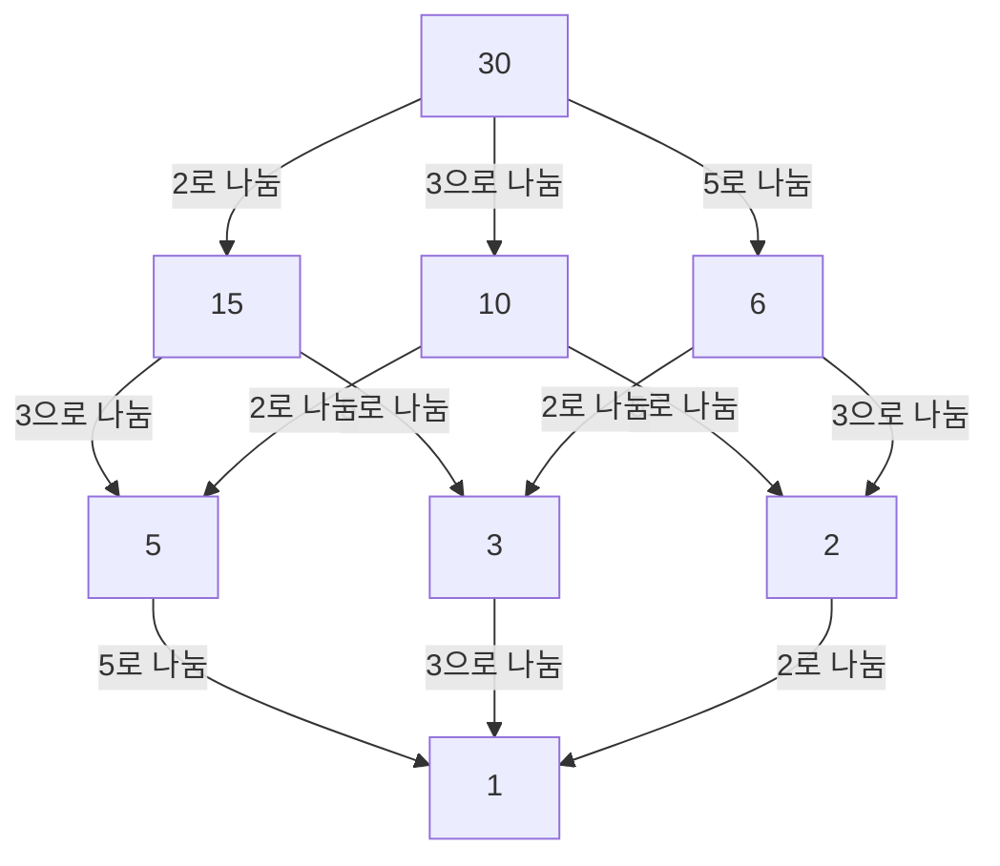

## 1. 머리말: 국소와 대역을 잇는 시선

수학, 특히 정수론의 세계에서 '국소-대역 원리'라는 말을 들어본 독자가 많을 것입니다. 이 심오한 개념을 확립하고 20세기 대수적 정수론을 강력하게 견인한 중심인물이 바로 독일의 수학자 **[헬무트 하세](https://kenji.blog/ko/p/hasse/)** (Helmut Hasse, 1898–1979)입니다. 그는 은사인 [쿠르트 헨젤](https://kenji.blog/ko/p/hensel/)이 창시한 $p$ 진수 이론을 강력한 도구로 승화시켜 현대 수학에 있어 극히 중요한 틀을 구축했습니다.

본 기사에서는 하세의 파란만장한 생애의 에피소드부터 그가 남긴 빛나는 수학적 업적들에 이르기까지 자세히 해설합니다. 그가 제창한 **하세의 원리** (Hasse Principle)는 현대 수학에서 불가결한 개념이 되었으며, 오늘날에도 많은 수학자들에게 영감을 계속 주고 있습니다.

## 2. 시대 배경과 생애: 카셀에서 해군으로

[헬무트 하세](https://kenji.blog/ko/p/hasse/)는 1898년 8월 25일 독일 제국의 카셀이라는 도시에서 태어났습니다. 그의 아버지는 판사였으며, 엄격하고 지적인 가정환경 속에서 자랐습니다. 유년기부터 수학에 대해 남다른 재능을 보였던 하세였지만, 그의 청춘 시절은 제1차 세계 대전의 발발로 인해 큰 영향을 받게 됩니다.

1915년, 아직 10대였던 하세는 독일 제국 해군에 입대하여 군함에 승선하여 종군하게 되었습니다. 전화가 끊이지 않는 가혹한 군대 생활 속에서도 그의 수학을 향한 열정은 식지 않았습니다. 그는 휴가 때마다 수학 전문 서적을 탐독하고 독자적으로 계산을 진행하는 등, 학문에 대한 갈망을 계속 지녔다고 전해집니다.

## 3. 괴팅겐과 마르부르크: [쿠르트 헨젤](https://kenji.blog/ko/p/hensel/)과의 만남

종전 후인 1918년, 하세는 마침내 괴팅겐 대학교에 입학합니다. 당시의 괴팅겐은 [다비트 힐베르트](https://kenji.blog/ko/p/hilbert/)나 에드문트 란다우, 그리고 [에미 뇌터](https://kenji.blog/ko/p/noether/)와 같은 거성들이 모인 세계 최고봉의 수학 중심지였습니다. 하세는 그곳에서 최첨단 수학의 숨결을 접하며 자신의 재능을 더욱 꽃피우게 됩니다.

그 후 하세는 마르부르크 대학교로 옮겨, 그곳에서 그의 평생 스승이 되는 **[쿠르트 헨젤](https://kenji.blog/ko/p/hensel/)** ([Kurt Hensel](https://kenji.blog/ko/p/hensel/))과 운명적인 만남을 갖게 됩니다. 헨젤은 전혀 새로운 수의 체계인 $p$ 진수 ( $p$-adic numbers)의 발견자였습니다. 당시 많은 수학자들이 $p$ 진수를 단순한 기묘한 개념으로 취급했던 반면, 하세는 이 새로운 개념이 가진 끝을 알 수 없는 가능성을 즉시 깨닫고 그것을 자신의 연구의 강력한 무기로 다듬어 나가게 됩니다.

## 4. $p$ 진수란 무엇인가: 새로운 수의 체계

하세의 업적을 이해하기 위해서는 $p$ 진수의 개념을 피하고 지나갈 수 없습니다. 우리가 일상적으로 사용하는 실수는 유리수(분수)를 '크기(절댓값)'의 개념에 기초하여 완비화(극한을 취해 빈틈을 메우는 조작)함으로써 얻어집니다.

그러나 헨젤은 전혀 다른 '거리'의 개념을 도입했습니다. 소수 $p$ 를 고정했을 때, 두 유리수의 차이가 $p$ 로 여러 번 나누어떨어질수록 그 두 수는 '가깝다'고 정의하는 것입니다. 이 기묘한 거리에 기초하여 유리수를 완비화하여 얻어지는 것이 $p$ 진수체 $\mathbb{Q}_p$ 입니다. $p$ 진수의 세계에서는 실수 세계에서는 발산해 버리는 무한급수가 수렴하는 경우가 있어, 정수의 합동식에 관한 문제를 해석적인 수법으로 다루는 것이 가능해집니다.

## 5. 하세의 원리(국소-대역 원리)의 확립

하세의 가장 큰 업적 중 하나는 이 $p$ 진수를 이용한 **국소-대역 원리** (Local-Global Principle)의 확립입니다. 이는 '어떤 방정식이 유리수체(대역적인 세계) 위에서 해를 가지기 위한 필요충분조건은 그것이 모든 $p$ 진수체 및 실수체(국소적인 세계) 위에서 해를 가지는 것이다'라는 장대한 수학적 철학입니다.

실수체나 $p$ 진수체에서의 해의 존재는 각각 실수의 부호 판정이나 유한체의 합동식 계산으로 귀착될 수 있으므로 판정이 비교적 용이합니다. 즉, '국소적 (Local)'인 정보를 모두 모으면 '대역적 (Global)'인 정보가 완전히 결정된다는 놀라운 사실을 보여주는 것입니다.

## 6. 하세-민코프스키의 정리: 이차 형식에의 응용

이 국소-대역 원리가 가장 아름답게 기능하는 예가 이차 형식에 관한 **하세-민코프스키의 정리** (Hasse-Minkowski Theorem)입니다.

어떤 계수가 유리수인 이차 형식 $Q(x_1, x_2, \dots, x_n)$ 에 대하여 방정식 $Q(x_1, x_2, \dots, x_n) = 0$ 이 비자명한 유리수 해(모든 변수가 0이 아닌 해)를 가지는지를 판정하고 싶다고 합시다. 이때 다음 정리가 성립합니다.

$$
\text{방정식 } Q(x) = 0 \text{ 이 } \mathbb{Q} \text{ 위에서 비자명한 해를 갖는다} \iff \text{모든 소수 } p \text{ 에 대해 } \mathbb{Q}_p \text{ 위에서 해를 갖고, } \mathbb{R} \text{ 위에서 해를 갖는다}
$$

이 정리에 의해 이차 형식에서의 유리수 해의 존재 판정 문제는 완전히 해결되었습니다. 이 압도적인 성공으로 인해 하세의 이름은 젊은 나이에 수학계에 널리 알려지게 됩니다.

## 7. 하세 다이어그램: 순서 구조의 시각화와 대수학

하세의 이름은 추상 대수학이나 이산 수학에서 빈번하게 사용되는 **하세 다이어그램** (Hasse Diagram)에도 남아있습니다. 이는 반순서 집합을 시각적으로 표현하기 위한 그래프입니다. 하세 자신이 이 그림의 최초 고안자는 아니지만, 그가 대수적인 구조를 이해하기 위해 효과적으로 사용했기 때문에 그 이름이 붙게 되었습니다.

다음은 30의 약수 집합에 '정제 관계 (Divisibility)'의 순서를 넣은 하세 다이어그램의 예입니다.

이처럼 하세는 추상적인 개념을 직관적이고 시각적으로 파악하는 데에도 매우 능했습니다.

## 8. 하세-베유의 정리: 타원 곡선의 유리점

하세의 또 다른 극히 중요한 공헌은 유한체 위 타원 곡선에 관한 **하세의 정리** (Hasse's Theorem on Elliptic Curves)입니다. 이는 유한체 위의 대수 다양체에 대한 '리만 가설의 유사'의 첫걸음이라고도 할 수 있는 획기적인 결과였습니다.

유한체 $\mathbb{F}_q$ (원소 수가 $q$ 인 체) 위에서 정의된 타원 곡선 $E$ 의 유리점의 수를 $N$ 이라 합시다. 이때 유리점의 수 $N$ 은 $q + 1$ (사영 직선 위의 점의 수)에 가깝고 그 오차는 다음과 같이 억제된다고 하세는 증명했습니다.

$$
|N - (q + 1)| \le 2\sqrt{q}
$$

이 아름다운 부등식은 훗날 그 자신의 제자인 [앙드레 베유](https://kenji.blog/ko/p/weil/) ([André Weil](https://kenji.blog/ko/p/weil/))에 의해 일반 대수 곡선으로 확장되고(베유 추측), 나아가 피에르 들리뉴 (Pierre Deligne)에 의해 최종적인 해결에 이르는, 장대한 수학 역사의 중요한 출발점이 되었습니다.

## 9. 유체론에 대한 공헌: 국소 유체론과 아르틴 상호 법칙

하세의 업적을 말할 때 빼놓을 수 없는 것이 **유체론** (Class Field Theory)에 대한 다대한 공헌입니다. 유체론이란 대수체(유리수의 유한 차수 확대체)의 아벨 확대(갈루아 군이 가환이 되는 확대)를 기초체 자신의 내부적인 정보로부터 완전히 기술하려는 이론입니다.

에밀 아르틴 (Emil Artin)이 제창한 '상호 법칙 (Reciprocity Law)'의 증명에 있어서 하세는 극히 중요한 역할을 완수했습니다. 하세는 해석적인 수법과 $p$ 진수 이론을 구사함으로써 아르틴에게 중요한 조언을 제공하고 증명 완성에 크게 기여했습니다. 또한 하세 자신도 국소 유체론 (Local Class Field Theory) 구축에 있어서 중심적인 역할을 담당하여, 대역적인 유체론을 국소체의 시점에서 재구축했습니다.

## 10. [에미 뇌터](https://kenji.blog/ko/p/noether/) 및 동시대인들과의 교류

하세의 학문적 교류 중에서 특기할 만한 인물이 추상 대수학의 어머니라고도 불리는 **[에미 뇌터](https://kenji.blog/ko/p/noether/)** ([Emmy Noether](https://kenji.blog/ko/p/noether/))입니다. 하세는 뇌터의 추상적·구조적 접근에 깊이 공명하여 그녀가 구축한 비가환 대수의 틀을 자신의 정수론적 연구에 적극적으로 도입했습니다.

이 공동 작업의 결과로서 하세, 뇌터, 리하르트 브라우어 (Richard Brauer), 알베르트 (A. A. Albert) 등에 의해 증명된 **알베르트-브라우어-하세-뇌터의 정리** (Albert-Brauer-Hasse-Noether Theorem)는 다원환 이론에 있어서 금자탑이 되어 있습니다. 이 또한 국소-대역 원리의 아름다운 일례입니다.

## 11. 명저 '정수론'과 교육 활동

하세는 단지 탁월한 연구자였을 뿐만 아니라 매우 열성적이고 훌륭한 교육자이기도 했습니다. 그가 집필한 교과서 **'정수론'** (Zahlentheorie)은 대수적 정수론을 배우는 학생들에게 오랜 세월 동안 바이블로 여겨져 왔습니다. 이 책 속에서 그는 추상적이고 난해한 개념을 구체적이고 직관적인 예를 사용하여 정중하게 해설하고 있습니다. 계산 가능성을 중요시하는 그의 자세는 많은 제자들에게 지대한 영향을 주었습니다.

## 12. 격동의 시대: 제2차 세계 대전과 전후의 부흥

하세의 학문적 커리어는 시대의 거친 파도에 크게 농락당했습니다. 1930년대 그는 괴팅겐 대학교의 교수로서 수학 연구소의 소장을 지냈지만 나치 정권의 대두로 인해 연구소는 심각한 타격을 받았습니다. 하세 자신은 정치적인 타협을 강요당하면서도 독일에서의 수학의 전통을 지키기 위해 분주히 노력했습니다.

제2차 세계 대전 후, 그는 나치와의 관련성을 추궁받아 일시적으로 교직에서 추방당하는 고난을 맛보았습니다. 하지만 그의 수학적 재능과 열정은 잃지 않았고, 1949년에 베를린 대학교로, 그리고 나중에 함부르크 대학교로 옮겨 다시 연구와 후진 양성에 진력했습니다.

## 13. 크렐지 편집과 만년

하세는 자신이 주필을 맡은 수학 전문지 **'크렐 논문지'** (Journal für die reine und angewandte Mathematik) 편집에도 열정을 쏟았습니다. 그는 젊은 수학자들의 유망한 논문을 적극적으로 채록하여 재능을 세상에 내보내기 위한 플랫폼을 계속 제공했습니다. 전후의 혼란기 속에서도 독일 수학계의 부흥과 국제적인 교류 재개를 향해 진력한 그의 공적은 헤아릴 수 없습니다.

## 14. 맺음말: 현대 수학에의 유산

[헬무트 하세](https://kenji.blog/ko/p/hasse/)는 1979년에 그 생애를 마감했습니다. 그가 항상 '구체와 추상', '국소와 대역'이라는 대극에 있는 개념을 훌륭하게 통합해 왔다는 것은 그가 남긴 수많은 정리가 증명하고 있습니다.

그가 만들어낸 $p$ 진수에 의한 접근이나 하세의 원리는 현대의 수론 기하학, 암호 이론 등 광범위한 분야로 그 응용을 넓히고 있습니다. 파란의 시대를 살아남으면서도 진리를 계속 탐구한 한 학자의 모습과 그가 자아낸 아름다운 수학적 이론은 앞으로도 오래도록 수학을 뜻하는 자들의 이정표가 될 것입니다.
