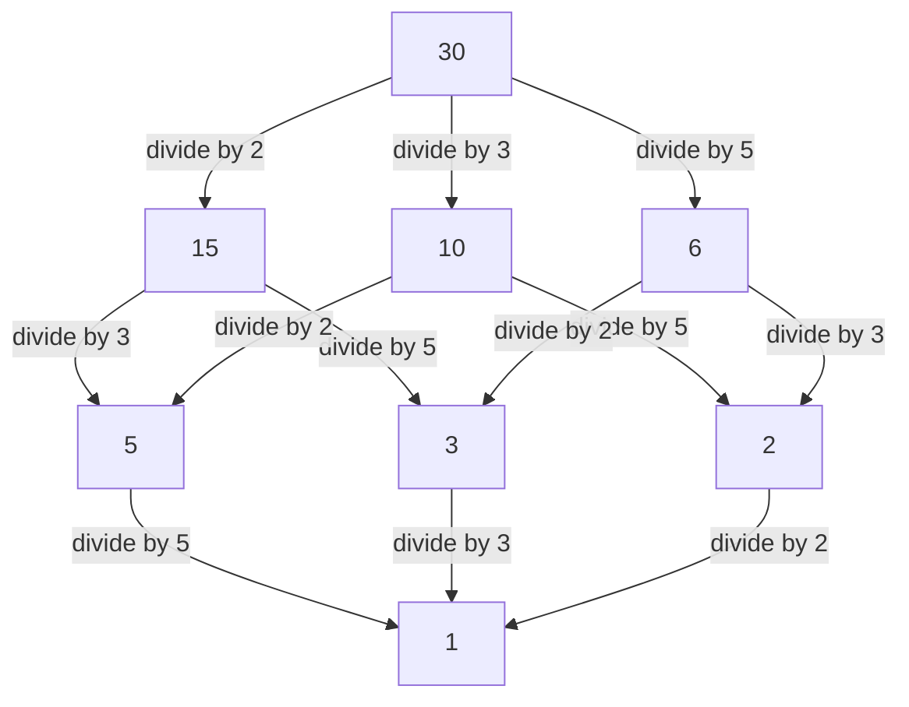

## 1. はじめに：局所と大域を結ぶ視点

数学、特に数論の世界において「局所・大域原理」という言葉を耳にしたことがある読者は多いでしょう。この深遠なる概念を確立し、20世紀の代数的整数論を強力に牽引した中心人物こそ、ドイツの数学者 **ヘルムート・[ハッセ](https://kenji.blog/p/hasse/)** ([Helmut Hasse](https://kenji.blog/p/hasse/), 1898–1979) です。彼は、恩師である[クルト・ヘンゼル](https://kenji.blog/p/hensel/)が創始した $p$ 進数の理論を強力な道具として昇華させ、現代数学における極めて重要な枠組みを築き上げました。

本記事では、[ハッセ](https://kenji.blog/p/hasse/)の波乱に満ちた生涯のエピソードから、彼が残した輝かしい数学的業績の数々までを詳細に解説します。彼が提唱した **[ハッセ](https://kenji.blog/p/hasse/)の原理** (Hasse Principle) は、現代数学において不可欠な概念となっており、今日でも多くの数学者にインスピレーションを与え続けています。

## 2. 時代背景と生い立ち：カッセルから海軍へ

ヘルムート・[ハッセ](https://kenji.blog/p/hasse/)は1898年8月25日、ドイツ帝国のカッセルという街で生まれました。彼の父親は判事であり、厳格かつ知的な家庭環境の中で育ちました。幼少期から数学に対して並外れた才能を示していた[ハッセ](https://kenji.blog/p/hasse/)ですが、彼の青春時代は第一次世界大戦の勃発によって大きな影響を受けます。

1915年、まだ10代であった[ハッセ](https://kenji.blog/p/hasse/)はドイツ帝国海軍に入隊し、軍艦に乗り組んで従軍することになりました。戦火の絶えない過酷な軍隊生活の中にあっても、彼の数学への情熱が冷めることはありませんでした。彼は休暇のたびに数学の専門書を読み漁り、独自に計算を進めるなど、学問への渇望を持ち続けていたと言われています。

## 3. ゲッティンゲンとマールブルク：[クルト・ヘンゼル](https://kenji.blog/p/hensel/)との出会い

終戦後の1918年、[ハッセ](https://kenji.blog/p/hasse/)は晴れてゲッティンゲン大学に入学します。当時のゲッティンゲンは、[ダフィット・ヒルベルト](https://kenji.blog/p/hilbert/)やエドムント・ランダウ、そして[エミー・ネーター](https://kenji.blog/p/noether/)といった巨星たちが集う、世界最高峰の数学の中心地でした。[ハッセ](https://kenji.blog/p/hasse/)はそこで最先端の数学の息吹に触れ、自身の才能をさらに開花させていきます。

その後、[ハッセ](https://kenji.blog/p/hasse/)はマールブルク大学へと移り、そこで彼の生涯の師となる **[クルト・ヘンゼル](https://kenji.blog/p/hensel/)** ([Kurt Hensel](https://kenji.blog/p/hensel/)) と運命的な出会いを果たします。ヘンゼルは全く新しい数の体系である $p$ 進数 ( $p$-adic numbers) の発見者でした。当時の多くの数学者が $p$ 進数を単なる奇妙な概念として捉えていたのに対し、[ハッセ](https://kenji.blog/p/hasse/)はこの新しい概念の持つ底知れぬ可能性に即座に気づき、それを自身の研究の強力な武器として磨き上げていくことになります。

## 4. $p$ 進数とは何か：新しい数の体系

[ハッセ](https://kenji.blog/p/hasse/)の業績を理解するためには、 $p$ 進数の概念を避けて通ることはできません。私たちが日常的に使用している実数は、有理数（分数）を「大きさ（絶対値）」の概念に基づいて完備化（極限を取って隙間を埋める操作）することで得られます。

しかし、ヘンゼルは全く異なる「距離」の概念を導入しました。素数 $p$ を固定したとき、二つの有理数の差が $p$ で何度も割り切れるほど、その二つの数は「近い」と定義するのです。この奇妙な距離に基づいて有理数を完備化して得られるのが $p$ 進数体 $\mathbb{Q}_p$ です。 $p$ 進数の世界では、実数の世界では発散してしまうような無限級数が収束することがあり、整数の合同式に関する問題を解析的な手法で扱うことが可能になります。

## 5. [ハッセ](https://kenji.blog/p/hasse/)の原理（局所・大域原理）の確立

[ハッセ](https://kenji.blog/p/hasse/)の最大の功績の一つは、この $p$ 進数を用いた **局所・大域原理** (Local-Global Principle) の確立です。これは、「ある方程式が有理数体（大域的な世界）上で解を持つための必要十分条件は、それがすべての $p$ 進数体および実数体（局所的な世界）上で解を持つことである」という壮大な数学的哲学です。

実数体や $p$ 進数体における解の存在は、それぞれ実数の符号の判定や、有限体の合同式の計算に帰着できるため、判定が比較的容易です。つまり、「局所的 (Local)」な情報をすべて集めれば、「大域的 (Global)」な情報が完全に決定されるという驚くべき事実を示しているのです。

## 6. [ハッセ](https://kenji.blog/p/hasse/)・ミンコフスキーの定理：二次形式への応用

この局所・大域原理が最も美しく機能する例が、二次形式に関する **[ハッセ](https://kenji.blog/p/hasse/)・ミンコフスキーの定理** (Hasse-Minkowski Theorem) です。

ある係数が有理数である二次形式 $Q(x_1, x_2, \dots, x_n)$ について、方程式 $Q(x_1, x_2, \dots, x_n) = 0$ が非自明な有理数解（すべての変数が0ではない解）を持つかどうかを判定したいとします。このとき、次の定理が成り立ちます。

$$
\text{方程式 } Q(x) = 0 \text{ が有理数体 } \mathbb{Q} \text{ 上で非自明な解を持つ} \iff \text{すべての素数 } p \text{ について } \mathbb{Q}_p \text{ 上で解を持ち、かつ実数体 } \mathbb{R} \text{ 上で解を持つ}
$$

この定理により、二次形式における有理数解の存在判定問題は完全に解決されました。この圧倒的な成功により、[ハッセ](https://kenji.blog/p/hasse/)の名は若くして数学界に轟くことになります。

## 7. [ハッセ](https://kenji.blog/p/hasse/)図：順序構造の視覚化と代数学

[ハッセ](https://kenji.blog/p/hasse/)の名前は、抽象代数学や離散数学で頻繁に用いられる **[ハッセ](https://kenji.blog/p/hasse/)図** (Hasse Diagram) にも残されています。これは、半順序集合を視覚的に表現するためのグラフです。[ハッセ](https://kenji.blog/p/hasse/)自身がこの図の最初の考案者というわけではありませんが、彼が代数的な構造を理解するために効果的に用いたことから、その名が冠されるようになりました。

以下は、30の約数の集合に「整除関係 (Divisibility)」の順序を入れた[ハッセ](https://kenji.blog/p/hasse/)図の例です。

このように、[ハッセ](https://kenji.blog/p/hasse/)は抽象的な概念を直感的かつ視覚的に捉えることにも非常に長けていました。

## 8. [ハッセ](https://kenji.blog/p/hasse/)・[ヴェイユ](https://kenji.blog/p/weil/)の定理：楕円曲線の有理点

[ハッセ](https://kenji.blog/p/hasse/)のもう一つの極めて重要な貢献は、有限体上の楕円曲線における **[ハッセ](https://kenji.blog/p/hasse/)の定理** (Hasse's Theorem on Elliptic Curves) です。これは、有限体上の代数多様体に対する「[リーマン予想](https://kenji.blog/p/riemann-hypothesis/)の類似」の最初の一歩とも言える画期的な結果でした。

有限体 $\mathbb{F}_q$ （要素数が $q$ の体）上で定義された楕円曲線 $E$ の有理点の数を $N$ とします。このとき、有理点の数 $N$ は $q + 1$ （射影直線上の点の数）に近く、その誤差は次のように抑えられると[ハッセ](https://kenji.blog/p/hasse/)は証明しました。

$$
|N - (q + 1)| \le 2\sqrt{q}
$$

この美しい不等式は、後に彼自身の教え子であるアンドレ・[ヴェイユ](https://kenji.blog/p/weil/) ([André Weil](https://kenji.blog/p/weil/)) によって一般の代数曲線へと拡張され（[ヴェイユ](https://kenji.blog/p/weil/)予想）、さらにピエール・ドリーニュ (Pierre Deligne) によって最終的な解決へと至る、壮大な数学の歴史の重要な出発点となりました。

## 9. 類体論への貢献：局所類体論とアルティン相互法則

[ハッセ](https://kenji.blog/p/hasse/)の業績を語る上で欠かせないのが、 **類体論** (Class Field Theory) への多大なる貢献です。類体論とは、代数体（有理数の有限次拡大体）のアーベル拡大（ガロア群が可換となるような拡大）を、基礎体自身の内部的な情報から完全に記述しようとする理論です。

エミール・アルティン (Emil Artin) が提唱した「相互法則 (Reciprocity Law)」の証明において、[ハッセ](https://kenji.blog/p/hasse/)は極めて重要な役割を果たしました。[ハッセ](https://kenji.blog/p/hasse/)は解析的な手法や $p$ 進数の理論を駆使することで、アルティンに重要な助言を与え、証明の完成に大きく貢献しました。また、[ハッセ](https://kenji.blog/p/hasse/)自身も局所類体論 (Local Class Field Theory) の構築において中心的な役割を担い、大域的な類体論を局所体の視点から再構築しました。

## 10. [エミー・ネーター](https://kenji.blog/p/noether/)や同時代人との交流

[ハッセ](https://kenji.blog/p/hasse/)の学問的交流の中で特筆すべき人物が、抽象代数学の母とも称される **[エミー・ネーター](https://kenji.blog/p/noether/)** ([Emmy Noether](https://kenji.blog/p/noether/)) です。[ハッセ](https://kenji.blog/p/hasse/)はネーターの抽象的・構造的なアプローチに深く共鳴し、彼女の構築した非可換代数の枠組みを自身の数論的研究に積極的に取り入れました。

この共同作業の結果として、[ハッセ](https://kenji.blog/p/hasse/)、ネーター、リヒャルト・ブラウアー (Richard Brauer)、アルベール (A. A. Albert) らによって証明された **[ハッセ](https://kenji.blog/p/hasse/)・ブラウアー・ネーター・アルベールの定理** (Albert-Brauer-Hasse-Noether Theorem) は、多元環の理論における金字塔となっています。これもまた局所・大域原理の美しい一例です。

## 11. 名著『数論』と教育活動

[ハッセ](https://kenji.blog/p/hasse/)は単に卓越した研究者であっただけでなく、非常に熱心で優れた教育者でもありました。彼が執筆した教科書 **『数論』** (Zahlentheorie) は、代数的整数論を学ぶ学生にとって長年にわたりバイブルとされてきました。この本の中で彼は、抽象的で難解な概念を、具体的かつ直感的な例を用いて丁寧に解説しています。計算可能性を重んじる彼の姿勢は、多くの教え子に多大な影響を与えました。

## 12. 激動の時代：第二次世界大戦と戦後の復興

[ハッセ](https://kenji.blog/p/hasse/)の学問的キャリアは、時代の荒波に大きく翻弄されました。1930年代、彼はゲッティンゲン大学の教授として数学研究所の所長を務めましたが、ナチス政権の台頭により研究所は深刻な打撃を受けました。[ハッセ](https://kenji.blog/p/hasse/)自身は政治的な妥協を強いられつつも、ドイツにおける数学の伝統を守るために奔走しました。

第二次世界大戦後、彼はナチスとの関わりを問われ、一時的に教職から追放されるという苦難を味わいました。しかし、彼の数学的才能と情熱は失われることなく、1949年にベルリン大学へ、そして後にハンブルク大学へ移り、再び研究と後進の育成に尽力しました。

## 13. クレレ誌の編集と晩年

[ハッセ](https://kenji.blog/p/hasse/)は、自身が主筆を務めた数学専門誌 **『クレレ論文誌』** (Journal für die reine und angewandte Mathematik) の編集にも情熱を注ぎました。彼は、若手数学者の有望な論文を積極的に採録し、才能を世に送り出すためのプラットフォームを提供し続けました。戦後の混乱期にあっても、ドイツ数学界の復興と国際的な交流の再開に向けて尽力した彼の功績は計り知れません。

## 14. おわりに：現代数学への遺産

ヘルムート・[ハッセ](https://kenji.blog/p/hasse/)は、1979年にその生涯を閉じました。彼が常に「具体と抽象」、「局所と大域」という対極にある概念を見事に統合してきたことは、彼の残した数々の定理が証明しています。

彼が生み出した $p$ 進数によるアプローチや[ハッセ](https://kenji.blog/p/hasse/)の原理は、現代の数論幾何学、暗号理論など、広範な分野にその応用を広げています。波乱の時代を生き抜きながらも真理を探求し続けた一人の学者の姿と、彼が紡ぎ出した美しい数学的理論は、これからも長く数学を志す者たちの道標となることでしょう。
