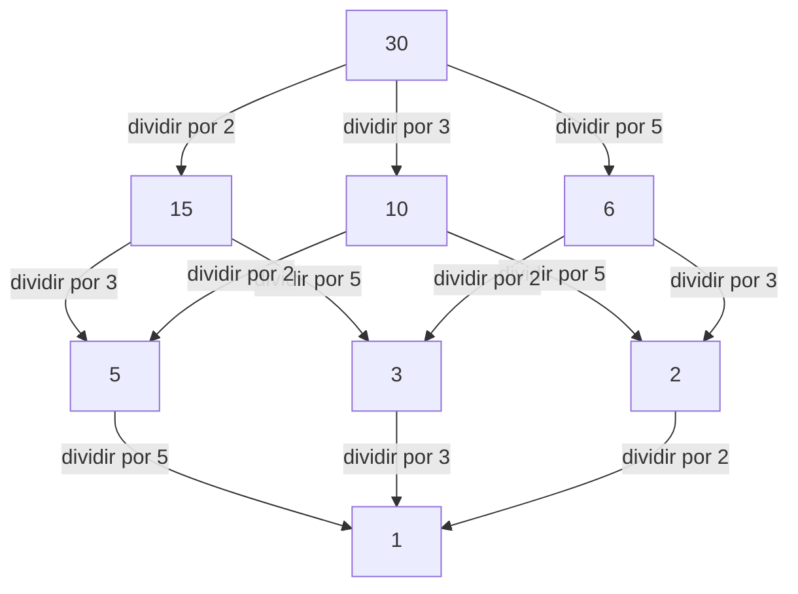

## 1. Introdução: Conectando o local e o global

No mundo da matemática, particularmente na teoria dos números, muitos leitores podem ter ouvido falar do "princípio local-global". A figura central que estabeleceu este conceito profundo e liderou poderosamente a teoria algébrica dos números do século XX foi o matemático alemão **[Helmut Hasse](https://kenji.blog/pt/p/hasse/)** (1898–1979). Ele elevou a teoria dos números p-ádicos, iniciada por seu mentor [Kurt Hensel](https://kenji.blog/pt/p/hensel/), a uma ferramenta poderosa, construindo estruturas cruciais na matemática moderna.

Neste artigo, aprofundaremos os episódios da vida turbulenta de Hasse e suas brilhantes realizações matemáticas. O **Princípio de Hasse** que ele defendeu tornou-se um conceito indispensável na matemática moderna, continuando a inspirar muitos matemáticos até hoje.

## 2. Antecedentes e primeiros anos: De Kassel à Marinha

[Helmut Hasse](https://kenji.blog/pt/p/hasse/) nasceu em 25 de agosto de 1898 na cidade de Kassel, no Império Alemão. O seu pai era juiz, e ele cresceu num ambiente intelectual e rigoroso. Embora Hasse tenha demonstrado um talento extraordinário para a matemática desde tenra idade, a sua juventude foi profundamente afetada pela eclosão da Primeira Guerra Mundial.

Em 1915, ainda adolescente, Hasse ingressou na Marinha Imperial Alemã e serviu a bordo de um navio de guerra. Mesmo na vida militar dura e incessantemente dilacerada pela guerra, a sua paixão pela matemática nunca arrefeceu. Diz-se que durante cada licença, lia avidamente livros de matemática e trabalhava de forma independente em cálculos, mantendo uma sede inesgotável de aprendizagem.

## 3. Göttingen e Marburgo: Encontro com [Kurt Hensel](https://kenji.blog/pt/p/hensel/)

Após o fim da guerra em 1918, Hasse matriculou-se oficialmente na Universidade de Göttingen. Naquela época, Göttingen era o ápice mundial da matemática, lar de gigantes como [David Hilbert](https://kenji.blog/pt/p/hilbert/), Edmund Landau e [Emmy Noether](https://kenji.blog/pt/p/noether/). Lá, Hasse encontrou o sopro da matemática de vanguarda, permitindo que seus talentos florescessem ainda mais.

Mais tarde, Hasse transferiu-se para a Universidade de Marburgo, onde teve um encontro fatídico com **[Kurt Hensel](https://kenji.blog/pt/p/hensel/)**, que se tornaria o seu mentor para toda a vida. [Hensel](https://kenji.blog/pt/p/hensel/) foi o descobridor de um sistema numérico completamente novo: os números p-ádicos. Enquanto muitos matemáticos da época viam os números p-ádicos como meras curiosidades matemáticas, Hasse reconheceu imediatamente o imenso potencial deste novo conceito e o refinou para transformá-lo numa arma poderosa para a sua própria investigação.

## 4. O que são os números p-ádicos? Um novo sistema numérico

Para compreender as realizações de Hasse, não se pode evitar o conceito dos números p-ádicos. Os números reais que usamos diariamente são obtidos ao completar os números racionais (frações) com base no conceito de "tamanho (valor absoluto)", um processo de tomada de limites para preencher as lacunas.

No entanto, [Hensel](https://kenji.blog/pt/p/hensel/) introduziu um conceito de "distância" completamente diferente. Fixando um número primo $p$, dois números racionais são definidos como "próximos" se a sua diferença puder ser dividida por $p$ muitas vezes. Completar os números racionais com base nesta distância estranha produz o corpo dos números p-ádicos $\mathbb{Q}_p$. No mundo dos números p-ádicos, séries infinitas que divergiriam no mundo real podem convergir, tornando possível tratar problemas de congruência usando métodos analíticos.

## 5. Estabelecimento do Princípio de Hasse (Princípio local-global)

Uma das maiores contribuições de Hasse é o estabelecimento do **Princípio local-global** utilizando estes números p-ádicos. Trata-se de uma grande filosofia matemática que estabelece que "uma condição necessária e suficiente para que uma equação tenha uma solução sobre o corpo dos números racionais (o mundo global) é que tenha soluções sobre todos os corpos p-ádicos e o corpo dos números reais (os mundos locais)".

Determinar a existência de soluções em corpos reais ou p-ádicos reduz-se a verificar os sinais dos números reais ou calcular congruências em corpos finitos, respetivamente, o que é relativamente fácil. Por outras palavras, demonstra o facto surpreendente de que ao reunir toda a informação "local", a informação "global" é completamente determinada.

## 6. O Teorema de Hasse-Minkowski: Aplicação a formas quadráticas

O exemplo mais belo deste princípio local-global em ação é o **Teorema de Hasse-Minkowski** para formas quadráticas.

Suponhamos que queremos determinar se uma equação $Q(x_1, x_2, \dots, x_n) = 0$, definida por uma forma quadrática $Q$ com coeficientes racionais, tem uma solução racional não trivial (uma solução onde nem todas as variáveis são zero). Neste caso, aplica-se o seguinte teorema:

$$
\text{A equação } Q(x) = 0 \text{ tem uma solução não trivial sobre } \mathbb{Q} \iff \text{Tem soluções sobre } \mathbb{Q}_p \text{ para todo o primo } p \text{ e sobre } \mathbb{R}
$$

Graças a este teorema, o problema de determinar a existência de soluções racionais para formas quadráticas foi completamente resolvido. Este sucesso esmagador fez com que o nome de Hasse ressoasse em todo o mundo matemático desde tenra idade.

## 7. Diagrama de Hasse: Visualizando estruturas de ordem e álgebra

O nome de Hasse também sobrevive no **Diagrama de Hasse**, frequentemente utilizado na álgebra abstrata e na matemática discreta. É um gráfico para representar visualmente conjuntos parcialmente ordenados. Embora o próprio Hasse não tenha sido o inventor original deste diagrama, o seu nome foi-lhe atribuído porque ele o utilizou de forma muito eficaz para compreender estruturas algébricas.

Abaixo está um exemplo de um diagrama de Hasse introduzindo a ordem de "divisibilidade" no conjunto de divisores de 30.

Desta forma, Hasse foi excecionalmente hábil a captar de forma intuitiva e visual conceitos abstratos.

## 8. Teorema de Hasse-Weil: Pontos racionais em curvas elípticas

Outra contribuição extremamente importante de Hasse é o **Teorema de Hasse sobre curvas elípticas** sobre corpos finitos. Este foi um resultado marcante, considerado o primeiro passo em direção a um "análogo da Hipótese de [Riemann](https://kenji.blog/pt/p/riemann/)" para variedades algébricas sobre corpos finitos.

Seja $N$ o número de pontos racionais numa curva elíptica $E$ definida sobre um corpo finito $\mathbb{F}_q$ (um corpo com $q$ elementos). Hasse provou que o número de pontos racionais $N$ está próximo de $q + 1$ (o número de pontos na reta projetiva), e o erro é limitado da seguinte forma:

$$
|N - (q + 1)| \le 2\sqrt{q}
$$

Esta bela desigualdade foi mais tarde estendida a curvas algébricas gerais pelo seu próprio aluno [André Weil](https://kenji.blog/pt/p/weil/) (as Conjeturas de Weil) e finalmente resolvida por Pierre Deligne, marcando um ponto de partida crucial numa grande história da matemática.

## 9. Contribuição para a Teoria dos Corpos de Classes: Teoria Local e Reciprocidade de Artin

Ao discutir as realizações de Hasse, a sua enorme contribuição para a **Teoria dos Corpos de Classes** é indispensável. A teoria dos corpos de classes é uma teoria que tenta descrever completamente as extensões abelianas (extensões onde o grupo de [Galois](https://kenji.blog/pt/p/galois/) é comutativo) de um corpo de números algébricos (uma extensão finita dos números racionais) utilizando informação interna do próprio corpo base.

Na demonstração da "Lei de Reciprocidade" proposta por Emil Artin, Hasse desempenhou um papel de vital importância. Utilizando métodos analíticos e a teoria dos números p-ádicos, Hasse ofereceu conselhos cruciais a Artin, contribuindo grandemente para a conclusão da demonstração. O próprio Hasse também desempenhou um papel central na construção da Teoria Local dos Corpos de Classes, reconstruindo a teoria global dos corpos de classes a partir da perspetiva dos corpos locais.

## 10. Interação com [Emmy Noether](https://kenji.blog/pt/p/noether/) e contemporâneos

Uma figura particularmente notável nas interações académicas de Hasse é **[Emmy Noether](https://kenji.blog/pt/p/noether/)**, frequentemente chamada a mãe da álgebra abstrata. Hasse ressoou profundamente com a abordagem abstrata e estrutural de Noether, incorporando ativamente o seu quadro de álgebra não comutativa na sua própria investigação na teoria dos números.

Como resultado desta colaboração, o **Teorema de Albert-Brauer-Hasse-Noether**, provado por Hasse, Noether, Richard Brauer e A. A. Albert, ergue-se como uma realização monumental na teoria das álgebras. Este é também um belo exemplo do princípio local-global.

## 11. A obra-prima "Teoria dos números" e atividades educativas

Hasse não foi apenas um investigador excecional, mas também um educador muito apaixonado e excelente. O seu manual **"Teoria dos Números"** (Zahlentheorie) foi considerado durante muitos anos como uma bíblia para os estudantes de teoria algébrica dos números. Neste livro, explicou cuidadosamente conceitos abstratos e difíceis utilizando exemplos concretos e intuitivos. A sua atitude de valorizar a calculabilidade teve uma influência profunda em muitos dos seus alunos.

## 12. Tempos turbulentos: Segunda Guerra Mundial e reconstrução no pós-guerra

A carreira académica de Hasse foi fortemente abalada pelas ondas agitadas da sua época. Na década de 1930, serviu como diretor do Instituto de Matemática como professor na Universidade de Göttingen, mas o instituto sofreu gravemente com a ascensão do regime nazi. Embora forçado a compromissos políticos, o próprio Hasse lutou para proteger a tradição da matemática na Alemanha.

Após a Segunda Guerra Mundial, sofreu a dificuldade de ser temporariamente suspenso do ensino devido a investigações sobre o seu envolvimento com os nazis. No entanto, o seu talento e paixão pela matemática nunca se perderam; em 1949, transferiu-se para a Universidade de Berlim e, mais tarde, para a Universidade de Hamburgo, dedicando-se mais uma vez à investigação e à formação da geração seguinte.

## 13. Edição do Journal de Crelle e últimos anos

Hasse também depositou a sua paixão na edição da revista especializada em matemática **"Journal de Crelle"** (Journal für die reine und angewandte Mathematik), onde atuou como editor-chefe. Ele proporcionou continuamente uma plataforma para apresentar talentos ao mundo, publicando ativamente artigos promissores de jovens matemáticos. Mesmo no caos do pós-guerra, os seus esforços em prol da reconstrução da comunidade matemática alemã e do reatamento dos intercâmbios internacionais foram incomensuráveis.

## 14. Conclusão: Legado para a matemática moderna

[Helmut Hasse](https://kenji.blog/pt/p/hasse/) pôs fim à sua vida em 1979. O facto de ele ter sempre integrado magistralmente os conceitos opostos de "concreto e abstrato" e "local e global" é comprovado pelos numerosos teoremas que deixou para trás.

A sua abordagem p-ádica e o Princípio de Hasse expandiram as suas aplicações numa vasta gama de áreas, incluindo a geometria aritmética moderna e a criptografia. A figura de um académico que continuou a procurar a verdade enquanto sobrevivia a uma época turbulenta, e as belas teorias matemáticas que ele teceu, continuarão certamente a ser um guia para aqueles que aspiram a estudar matemática por muito tempo.
