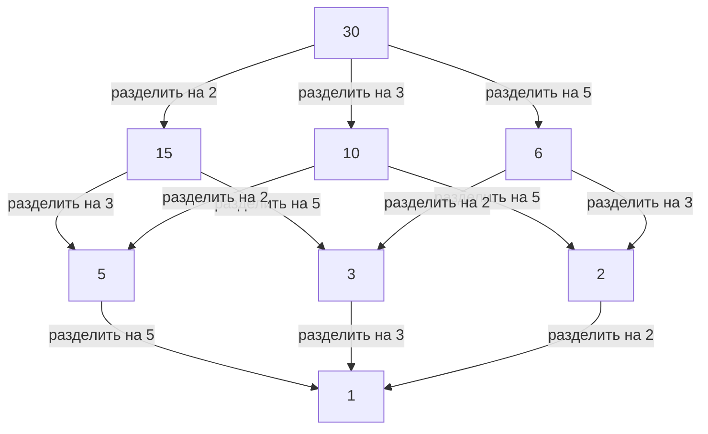

## 1. Введение: Связующее звено между локальным и глобальным

В мире математики, особенно в теории чисел, многие читатели, возможно, слышали термин "локально-глобальный принцип". Центральной фигурой, которая утвердила эту глубокую концепцию и мощно продвинула алгебраическую теорию чисел 20-го века, был немецкий математик **[Гельмут Хассе](https://kenji.blog/p/hasse/)** ([Helmut Hasse](https://kenji.blog/p/hasse/), 1898–1979). Он возвел теорию p-адических чисел, основанную его наставником Куртом Гензелем, в ранг мощного инструмента, создав важнейшие основы современной математики.

В этой статье мы подробно рассмотрим эпизоды бурной жизни Хассе и его блестящие математические достижения. Защищаемый им **Принцип Хассе** стал неотъемлемой концепцией в современной математике и продолжает вдохновлять многих математиков и сегодня.

## 2. Происхождение и ранние годы: От Касселя до флота

[Гельмут Хассе](https://kenji.blog/p/hasse/) родился 25 августа 1898 года в городе Кассель, в Германской империи. Его отец был судьей, и он вырос в строгой, интеллектуальной среде. Хотя Хассе с ранних лет проявлял необычайный талант к математике, его молодость была глубоко затронута началом Первой мировой войны.

В 1915 году, будучи еще подростком, Хассе вступил в ряды Императорских военно-морских сил Германии и служил на военном корабле. Даже в суровой и разрушенной войной военной жизни его страсть к математике никогда не угасала. Говорят, что во время каждого отпуска он жадно читал математические учебники и самостоятельно производил расчеты, сохраняя неутолимую жажду знаний.

## 3. Гёттинген и Марбург: Встреча с Куртом Гензелем

После окончания войны в 1918 году Хассе официально поступил в Гёттингенский университет. В то время Гёттинген был мировой вершиной математики, домом для таких гигантов, как [Давид Гильберт](https://kenji.blog/p/hilbert/), Эдмунд Ландау и [Эмми Нётер](https://kenji.blog/p/noether/). Там Хассе соприкоснулся с дыханием передовой математики, что позволило его талантам еще больше расцвести.

Позже Хассе перевелся в Марбургский университет, где у него произошла судьбоносная встреча с **Куртом Гензелем**, который стал его наставником на всю жизнь. Гензель был первооткрывателем совершенно новой системы счисления: p-адических чисел. В то время как многие математики того времени рассматривали p-адические числа как простые математические курьезы, Хассе сразу же распознал огромный потенциал этой новой концепции и превратил ее в мощное оружие для своих собственных исследований.

## 4. Что такое p-адические числа: Новая система счисления

Чтобы понять достижения Хассе, нельзя обойти стороной концепцию p-адических чисел. Вещественные числа, которые мы используем ежедневно, получаются путем пополнения рациональных чисел (дробей) на основе концепции "размера (абсолютной величины)" — процесса вычисления пределов для заполнения пробелов.

Однако Гензель ввел совершенно иную концепцию "расстояния". Зафиксировав простое число $p$, два рациональных числа определяются как "близкие", если их разность можно многократно разделить на $p$. Пополнение рациональных чисел на основе этого странного расстояния дает поле p-адических чисел $\mathbb{Q}_p$. В мире p-адических чисел бесконечные ряды, которые расходились бы в реальном мире, могут сходиться, что позволяет решать проблемы сравнений с помощью аналитических методов.

## 5. Утверждение принципа Хассе (Локально-глобальный принцип)

Одним из величайших вкладов Хассе является утверждение **локально-глобального принципа** с использованием этих p-адических чисел. Это грандиозная математическая философия, утверждающая, что "необходимым и достаточным условием для того, чтобы уравнение имело решение над полем рациональных чисел (глобальный мир), является наличие у него решений над всеми p-адическими полями и полем вещественных чисел (локальные миры)".

Определение существования решений в вещественных или p-адических полях сводится к проверке знаков вещественных чисел или вычислению сравнений в конечных полях соответственно, что относительно легко. Другими словами, это демонстрирует поразительный факт, что при сборе всей "локальной" информации "глобальная" информация определяется полностью.

## 6. Теорема Хассе-Минковского: Применение к квадратичным формам

Самым красивым примером действия этого локально-глобального принципа является **Теорема Хассе-Минковского** для квадратичных форм.

Предположим, мы хотим определить, имеет ли уравнение $Q(x_1, x_2, \dots, x_n) = 0$, определяемое квадратичной формой $Q$ с рациональными коэффициентами, нетривиальное рациональное решение (решение, в котором не все переменные равны нулю). В этом случае справедлива следующая теорема:

$$
\text{Уравнение } Q(x) = 0 \text{ имеет нетривиальное решение над } \mathbb{Q} \iff \text{Оно имеет решения над } \mathbb{Q}_p \text{ для всех простых } p \text{ и над } \mathbb{R}
$$

Благодаря этой теореме проблема определения существования рациональных решений для квадратичных форм была полностью решена. Этот ошеломляющий успех заставил имя Хассе в юном возрасте звучать на весь математический мир.

## 7. Диаграмма Хассе: Визуализация структур порядка и алгебра

Имя Хассе также сохранилось в **диаграмме Хассе**, часто используемой в абстрактной алгебре и дискретной математике. Это граф для визуального представления частично упорядоченных множеств. Хотя сам Хассе не был первоначальным изобретателем этой диаграммы, его имя было прикреплено к ней, поскольку он очень эффективно использовал ее для понимания алгебраических структур.

Ниже приведен пример диаграммы Хассе, вводящей порядок "делимости" в множество делителей 30.

Таким образом, Хассе был исключительно искусен в интуитивном и визуальном восприятии абстрактных концепций.

## 8. Теорема Хассе-Вейля: Рациональные точки на эллиптических кривых

Еще один чрезвычайно важный вклад Хассе — это **Теорема Хассе об эллиптических кривых** над конечными полями. Это был эпохальный результат, который считается первым шагом к "аналогу гипотезы Римана" для алгебраических многообразий над конечными полями.

Пусть $N$ — число рациональных точек на эллиптической кривой $E$, определенной над конечным полем $\mathbb{F}_q$ (поле из $q$ элементов). Хассе доказал, что число рациональных точек $N$ близко к $q + 1$ (числу точек на проективной прямой), а ошибка ограничена следующим образом:

$$
|N - (q + 1)| \le 2\sqrt{q}
$$

Это прекрасное неравенство позже было расширено на общие алгебраические кривые его собственным учеником Андре Вейлем (гипотезы Вейля) и, наконец, разрешено Пьером Делинем, отметив важнейшую отправную точку в великой истории математики.

## 9. Вклад в теорию полей классов: Локальная теория полей классов и закон взаимности Артина

При обсуждении достижений Хассе его масштабный вклад в **теорию полей классов** является обязательным. Теория полей классов — это теория, которая пытается полностью описать абелевы расширения (расширения, где группа Галуа коммутативна) алгебраического числового поля (конечного расширения рациональных чисел), используя внутреннюю информацию из самого базового поля.

В доказательстве "закона взаимности", предложенного Эмилем Артином, Хассе сыграл жизненно важную роль. Используя аналитические методы и теорию p-адических чисел, Хассе дал важнейшие советы Артину, во многом способствуя завершению доказательства. Сам Хассе также сыграл центральную роль в построении локальной теории полей классов, реконструируя глобальную теорию полей классов с точки зрения локальных полей.

## 10. Взаимодействие с [Эмми Нётер](https://kenji.blog/p/noether/) и современниками

Особенно примечательной фигурой в академических взаимодействиях Хассе является **[Эмми Нётер](https://kenji.blog/p/noether/)**, которую часто называют матерью абстрактной алгебры. Хассе глубоко резонировал с абстрактным и структурным подходом Нётер, активно включая ее структуру некоммутативной алгебры в свои собственные исследования по теории чисел.

В результате этого сотрудничества **Теорема Альберта-Брауэра-Хассе-Нётер**, доказанная Хассе, Нётер, Рихардом Брауэром и А. А. Альбертом, стоит как монументальное достижение в теории алгебр. Это также прекрасный пример локально-глобального принципа.

## 11. Шедевр "Теория чисел" и образовательная деятельность

Хассе был не только выдающимся исследователем, но и очень страстным и превосходным педагогом. Его учебник **"Теория чисел"** (Zahlentheorie) долгие годы считался библией для студентов, изучающих алгебраическую теорию чисел. В этой книге он тщательно объяснял абстрактные и сложные концепции, используя конкретные и интуитивно понятные примеры. Его позиция по оценке вычислимости оказала глубокое влияние на многих его студентов.

## 12. Бурные времена: Вторая мировая война и послевоенное восстановление

Академическая карьера Хассе сильно пострадала от бурных волн его эпохи. В 1930-х годах он работал директором Математического института в качестве профессора Гёттингенского университета, но институт сильно пострадал от подъема нацистского режима. Будучи вынужденным идти на политические компромиссы, сам Хассе боролся за защиту традиций математики в Германии.

После Второй мировой войны он пережил трудности временного отстранения от преподавания из-за расследований его связи с нацистами. Однако его математический талант и страсть никогда не были утрачены; в 1949 году он перешел в Берлинский университет, а затем в Гамбургский университет, вновь посвятив себя исследованиям и воспитанию следующего поколения.

## 13. Редактирование журнала Крелле и последние годы

Хассе также вложил свою страсть в редактирование специализированного математического журнала **"Журнал Крелле"** (Journal für die reine und angewandte Mathematik), где он был главным редактором. Он постоянно предоставлял платформу для знакомства мира с талантами, активно публикуя многообещающие статьи молодых математиков. Даже в послевоенном хаосе его усилия по восстановлению немецкого математического сообщества и возобновлению международных обменов были неизмеримы.

## 14. Заключение: Наследие для современной математики

[Гельмут Хассе](https://kenji.blog/p/hasse/) завершил свою жизнь в 1979 году. Тот факт, что он всегда мастерски интегрировал противоположные концепции "конкретного и абстрактного" и "локального и глобального", доказывается многочисленными теоремами, которые он оставил после себя.

Его p-адический подход и принцип Хассе расширили сферу своего применения на широкий спектр областей, включая современную арифметическую геометрию и криптографию. Образ ученого, который продолжал искать истину, пережив бурную эпоху, и прекрасные математические теории, которые он соткал, несомненно, останутся путеводной звездой для тех, кто стремится изучать математику в течение длительного времени.
