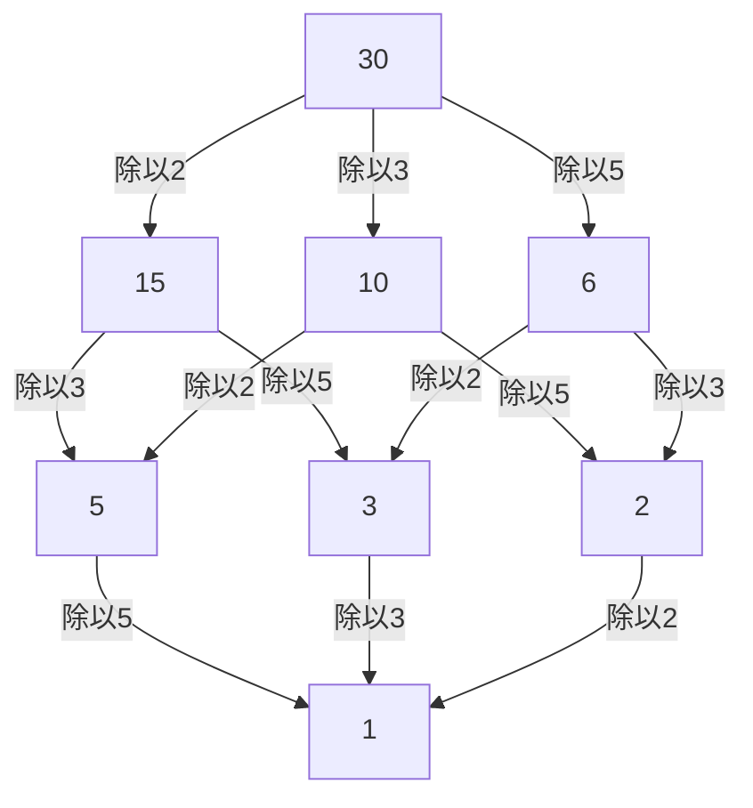

## 1. 引言：连接局部与全局的视角

在数学，尤其是数论的世界里，许多读者可能都听说过“局部-全局原理”。确立这一深奥概念并强有力地引领20世纪代数数论发展的核心人物，正是德国数学家 **[赫尔穆特·哈塞](https://kenji.blog/zh-cn/p/hasse/)** ([Helmut Hasse](https://kenji.blog/zh-cn/p/hasse/), 1898–1979)。他将恩师[库尔特·亨泽尔](https://kenji.blog/zh-cn/p/hensel/)创立的 $p$ 进数理论升华为一种强大的工具，在现代数学中构建了极其重要的框架。

在本文中，我们将详细解读哈塞波澜壮阔的一生中的轶事，以及他留下的辉煌数学成就。他所提倡的 **哈塞原理** (Hasse Principle) 已经成为现代数学中不可或缺的概念，并且至今仍在不断激发着许多数学家的灵感。

## 2. 时代背景与早年生活：从卡塞尔到海军

[赫尔穆特·哈塞](https://kenji.blog/zh-cn/p/hasse/)于1898年8月25日出生在德意志帝国的卡塞尔市。他的父亲是一名法官，哈塞在一个严谨而富有知识气息的家庭环境中长大。尽管哈塞从小就对数学表现出了非凡的天赋，但他的青春时代却受到了第一次世界大战爆发的深刻影响。

1915年，还是个十几岁少年的哈塞加入了德意志帝国海军，并登上了军舰服役。即使在战火不断、残酷的军队生活中，他对数学的热情也从未冷却。据说每次休假时，他都会如饥似渴地阅读数学专业书籍并独立进行计算，始终保持着对求知的渴望。

## 3. 哥廷根与马尔堡：与[库尔特·亨泽尔](https://kenji.blog/zh-cn/p/hensel/)的相遇

1918年战争结束后，哈塞正式考入哥廷根大学。当时的哥廷根是世界数学的最高学府，聚集了诸如[大卫·希尔伯特](https://kenji.blog/zh-cn/p/hilbert/)、埃德蒙·兰道以及[埃米·诺特](https://kenji.blog/zh-cn/p/noether/)等巨星。哈塞在那里接触到了最前沿的数学气息，使自己的才华得到了进一步的绽放。

后来，哈塞转学到了马尔堡大学，并在那里与他一生的导师 **[库尔特·亨泽尔](https://kenji.blog/zh-cn/p/hensel/)** ([Kurt Hensel](https://kenji.blog/zh-cn/p/hensel/)) 发生了命运般的相遇。亨泽尔是全新数系—— $p$ 进数 ( $p$-adic numbers) 的发现者。当当时许多数学家仅仅将 $p$ 进数视为一种奇妙的数学概念时，哈塞却立刻意识到了这一新概念所具有的无限潜力，并将其打磨成自己研究的强大武器。

## 4. 什么是 $p$ 进数：新的数系

要理解哈塞的成就，就无法避开 $p$ 进数的概念。我们日常使用的实数，是基于“大小（绝对值）”的概念，对有理数（分数）进行完备化（通过取极限来填补空隙的操作）而得到的。

然而，亨泽尔引入了一种完全不同的“距离”概念。固定一个素数 $p$ ，如果两个有理数之差能被 $p$ 多次整除，那么这两个数就被定义为“接近”。基于这种奇妙的距离对有理数进行完备化，就得到了 $p$ 进数域 $\mathbb{Q}_p$ 。在 $p$ 进数的世界中，现实世界中发散的无穷级数有可能会收敛，这使得利用解析方法来处理整数的同余式问题成为可能。

## 5. 哈塞原理（局部-全局原理）的确立

哈塞最伟大的贡献之一，就是利用这种 $p$ 进数确立了 **局部-全局原理** (Local-Global Principle)。这是一个宏大的数学哲学，它指出“一个方程在有理数域（全局世界）上有解的充要条件是，它在所有的 $p$ 进数域以及实数域（局部世界）上都有解”。

在实数域或 $p$ 进数域中是否存在解，可以分别归结为判断实数的符号或计算有限域的同余式，因此判断起来相对容易。也就是说，它揭示了一个令人惊叹的事实：只要收集所有的“局部 (Local)”信息，就可以完全决定“全局 (Global)”信息。

## 6. 哈塞-闵可夫斯基定理：在二次型中的应用

这一局部-全局原理发挥得最完美的例子，就是关于二次型的 **哈塞-闵可夫斯基定理** (Hasse-Minkowski Theorem)。

假设我们想要判断由系数为有理数的二次型 $Q(x_1, x_2, \dots, x_n)$ 定义的方程 $Q(x_1, x_2, \dots, x_n) = 0$ 是否存在非平凡的有理数解（并非所有变量都为0的解）。此时，以下定理成立：

$$
\text{方程 } Q(x) = 0 \text{ 在 } \mathbb{Q} \text{ 上有非平凡解} \iff \text{对于所有素数 } p \text{ 在 } \mathbb{Q}_p \text{ 上有解，并且在 } \mathbb{R} \text{ 上有解}
$$

借助这一定理，二次型中有理数解的存在性判定问题得到了彻底的解决。这一压倒性的成功，使得哈塞的名字在很年轻的时候就响彻了数学界。

## 7. 哈塞图：偏序结构的图示化与代数学

哈塞的名字也留存至今在抽象代数和离散数学中频繁使用的 **哈塞图** (Hasse Diagram) 中。这是一种为了直观地表示偏序集合而设计的图形。虽然哈塞本人并非这种图的最初发明者，但由于他为了理解代数结构而非常有效地使用了它，因此便冠以了他的名字。

以下是给30的约数集合加上“整除关系 (Divisibility)”顺序的哈塞图示例。

像这样，哈塞在直观和视觉上把握抽象概念方面也极其擅长。

## 8. 哈塞-韦伊定理：椭圆曲线上的有理点

哈塞的另一项极其重要的贡献是有限域上椭圆曲线的 **哈塞定理** (Hasse's Theorem on Elliptic Curves)。这是一个划时代的结果，可以说是迈向有限域上代数簇的“黎曼猜想类似物”的第一步。

假设 $N$ 是定义在有限域 $\mathbb{F}_q$ （元素个数为 $q$ 的域）上的椭圆曲线 $E$ 上的有理点数量。此时，哈塞证明了有理点的数量 $N$ 接近于 $q + 1$ （射影直线上的点的数量），其误差被限制如下：

$$
|N - (q + 1)| \le 2\sqrt{q}
$$

这个优美的不等式，后来由他自己的学生[安德烈·韦伊](https://kenji.blog/zh-cn/p/weil/) ([André Weil](https://kenji.blog/zh-cn/p/weil/)) 推广到了更一般的代数曲线（韦伊猜想），并最终由皮埃尔·德利涅 (Pierre Deligne) 彻底解决，成为了宏大数学历史上的一个重要起点。

## 9. 对类域论的贡献：局部类域论与阿廷互反律

在谈论哈塞的成就时，绝对不能忽略他对 **类域论** (Class Field Theory) 的巨大贡献。类域论是一门试图仅利用基础域内部的信息，来完全描述代数数域（有理数的有限扩张域）的阿贝尔扩张（伽罗瓦群为交换群的扩张）的理论。

在埃米尔·阿廷 (Emil Artin) 提出的“互反律 (Reciprocity Law)”的证明过程中，哈塞发挥了极其重要的作用。哈塞通过运用解析方法和 $p$ 进数理论，向阿廷提供了关键的建议，为证明的完成做出了巨大贡献。此外，哈塞自己也在构建局部类域论 (Local Class Field Theory) 中发挥了核心作用，从局部域的视角重新构建了全局的类域论。

## 10. 与[埃米·诺特](https://kenji.blog/zh-cn/p/noether/)及同时代人的交流

在哈塞的学术交流中，特别值得一提的人物是被誉为抽象代数之母的 **[埃米·诺特](https://kenji.blog/zh-cn/p/noether/)** ([Emmy Noether](https://kenji.blog/zh-cn/p/noether/))。哈塞对诺特抽象而结构化的方法产生了深刻的共鸣，并积极将她构建的非交换代数框架引入到自己的数论研究中。

作为这种合作的结果，由哈塞、诺特、理查德·布饶尔 (Richard Brauer) 和 A. A. 阿尔伯特 (A. A. Albert) 等人共同证明的 **阿尔伯特-布饶尔-哈塞-诺特定理** (Albert-Brauer-Hasse-Noether Theorem)，成为了代数理论中的一座丰碑。这也是局部-全局原理的一个优美范例。

## 11. 名著《数论》与教育活动

哈塞不仅是一位卓越的研究者，也是一位非常热忱和优秀的教育家。他撰写的教科书 **《数论》** (Zahlentheorie) 在很长一段时间里都被学习代数数论的学生奉为圣经。在这本书中，他使用了具体而直观的例子，细致地讲解了抽象而难懂的概念。他重视可计算性的态度，对他的许多学生产生了深远的影响。

## 12. 动荡的时代：第二次世界大战与战后复兴

哈塞的学术生涯被时代的惊涛骇浪极大地左右。20世纪30年代，他作为哥廷根大学的教授兼任数学研究所所长，但随着纳粹政权的抬头，研究所遭受了严重的打击。尽管被迫在政治上妥协，哈塞自己仍在为保护德国的数学传统而奔走。

第二次世界大战后，他因为与纳粹的牵连而受到追究，一度遭受了被解除教职的苦难。然而，他的数学才华和热情并未丧失；1949年他转至柏林大学，随后又到了汉堡大学，再次致力于研究和培养后进。

## 13. 《克雷勒杂志》的主编与晚年

哈塞还将他的热情倾注于他担任主编的数学专业期刊 **《克雷勒杂志》** (Journal für die reine und angewandte Mathematik) 的编辑工作中。他积极收录年轻数学家有潜力的论文，持续为向世界输送人才提供平台。即使在战后的混乱时期，他为了复兴德国数学界和恢复国际交流所付出的努力也是不可估量的。

## 14. 结语：给现代数学的遗产

[赫尔穆特·哈塞](https://kenji.blog/zh-cn/p/hasse/)于1979年结束了他的一生。他留下的众多定理证明了，他始终精妙地将“具体与抽象”、“局部与全局”这些截然相反的概念融合在一起。

他所开创的基于 $p$ 进数的方法和哈塞原理，已经将其应用扩展到了现代算术几何、密码学等广泛的领域。这位在动荡时代幸存下来却不断探求真理的学者的身姿，以及他所编织的优美数学理论，必定会长期成为那些立志学习数学之人的指路明灯。
