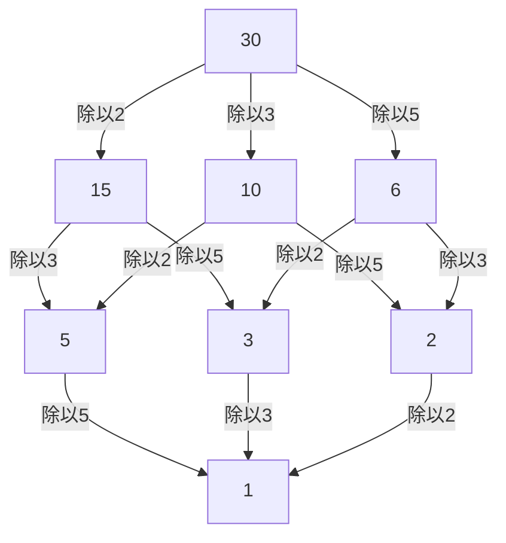

## 1. 引言：連結局部與全局的視角

在數學，尤其是數論的世界裡，許多讀者可能都聽說過「局部-全局原理」。確立這一深奧概念並強而有力地引領20世紀代數數論發展的核心人物，正是德國數學家 **[赫爾穆特·哈塞](https://kenji.blog/zh-tw/p/hasse/)** (Helmut Hasse, 1898–1979)。他將恩師[庫爾特·亨澤爾](https://kenji.blog/zh-tw/p/hensel/)創立的 $p$ 進數理論昇華為一種強大的工具，在現代數學中構建了極其重要的框架。

在本文中，我們將詳細解讀哈塞波瀾壯闊的一生中的軼事，以及他留下的輝煌數學成就。他所提倡的 **哈塞原理** (Hasse Principle) 已經成為現代數學中不可或缺的概念，並且至今仍在不斷激發著許多數學家的靈感。

## 2. 時代背景與早年生活：從卡塞爾到海軍

[赫爾穆特·哈塞](https://kenji.blog/zh-tw/p/hasse/)於1898年8月25日出生在德意志帝國的卡塞爾市。他的父親是一名法官，哈塞在一個嚴謹而富有知識氣息的家庭環境中長大。儘管哈塞從小就對數學表現出了非凡的天賦，但他的青春時代卻受到了第一次世界大戰爆發的深刻影響。

1915年，還是個十幾歲少年的哈塞加入了德意志帝國海軍，並登上了軍艦服役。即使在戰火不斷、殘酷的軍隊生活中，他對數學的熱情也從未冷卻。據說每次休假時，他都會如飢似渴地閱讀數學專業書籍並獨立進行計算，始終保持著對求知的渴望。

## 3. 哥廷根與馬爾堡：與[庫爾特·亨澤爾](https://kenji.blog/zh-tw/p/hensel/)的相遇

1918年戰爭結束後，哈塞正式考入哥廷根大學。當時的哥廷根是世界數學的最高學府，聚集了諸如[大衛·希爾伯特](https://kenji.blog/zh-tw/p/hilbert/)、埃德蒙·蘭道以及[埃米·諾特](https://kenji.blog/zh-tw/p/noether/)等巨星。哈塞在那裡接觸到了最前沿的數學氣息，使自己的才華得到了進一步的綻放。

後來，哈塞轉學到了馬爾堡大學，並在那裡與他一生的導師 **[庫爾特·亨澤爾](https://kenji.blog/zh-tw/p/hensel/)** ([Kurt Hensel](https://kenji.blog/zh-tw/p/hensel/)) 發生了命運般的相遇。亨澤爾是全新數系—— $p$ 進數 ( $p$-adic numbers) 的發現者。當當時許多數學家僅僅將 $p$ 進數視為一種奇妙的數學概念時，哈塞卻立刻意識到了這一新概念所具有的無限潛力，並將其打磨成自己研究的強大武器。

## 4. 什麼是 $p$ 進數：新的數系

要理解哈塞的成就，就無法避開 $p$ 進數的概念。我們日常使用的實數，是基於「大小（絕對值）」的概念，對有理數（分數）進行完備化（透過取極限來填補空隙的操作）而得到的。

然而，亨澤爾引入了一種完全不同的「距離」概念。固定一個質數 $p$ ，如果兩個有理數之差能被 $p$ 多次整除，那麼這兩個數就被定義為「接近」。基於這種奇妙的距離對有理數進行完備化，就得到了 $p$ 進數體 $\mathbb{Q}_p$ 。在 $p$ 進數的世界中，現實世界中發散的無窮級數有可能會收斂，這使得利用解析方法來處理整數的同餘式問題成為可能。

## 5. 哈塞原理（局部-全局原理）的確立

哈塞最偉大的貢獻之一，就是利用這種 $p$ 進數確立了 **局部-全局原理** (Local-Global Principle)。這是一個宏大的數學哲學，它指出「一個方程式在有理數體（全局世界）上有解的充要條件是，它在所有的 $p$ 進數體以及實數體（局部世界）上都有解」。

在實數體或 $p$ 進數體中是否存在解，可以分別歸結為判斷實數的符號或計算有限體的同餘式，因此判斷起來相對容易。也就是說，它揭示了一個令人驚嘆的事實：只要收集所有的「局部 (Local)」資訊，就可以完全決定「全局 (Global)」資訊。

## 6. 哈塞-閔可夫斯基定理：在二次型中的應用

這一局部-全局原理發揮得最完美的例子，就是關於二次型的 **哈塞-閔可夫斯基定理** (Hasse-Minkowski Theorem)。

假設我們想要判斷由係數為有理數的二次型 $Q(x_1, x_2, \dots, x_n)$ 定義的方程式 $Q(x_1, x_2, \dots, x_n) = 0$ 是否存在非平凡的有理數解（並非所有變數都為0的解）。此時，以下定理成立：

$$
\text{方程式 } Q(x) = 0 \text{ 在 } \mathbb{Q} \text{ 上有非平凡解} \iff \text{對於所有質數 } p \text{ 在 } \mathbb{Q}_p \text{ 上有解，並且在 } \mathbb{R} \text{ 上有解}
$$

藉助這一定理，二次型中有理數解的存在性判定問題得到了徹底的解決。這一壓倒性的成功，使得哈塞的名字在很年輕的時候就響徹了數學界。

## 7. 哈塞圖：偏序結構的圖示化與代數學

哈塞的名字也留存至今在抽象代數和離散數學中頻繁使用的 **哈塞圖** (Hasse Diagram) 中。這是一種為了直觀地表示偏序集合而設計的圖形。雖然哈塞本人並非這種圖的最初發明者，但由於他為了理解代數結構而非常有效地使用了它，因此便冠以了他的名字。

以下是給30的因數集合加上「整除關係 (Divisibility)」順序的哈塞圖範例。

像這樣，哈塞在直觀和視覺上把握抽象概念方面也極其擅長。

## 8. 哈塞-韋伊定理：橢圓曲線上的有理點

哈塞的另一項極其重要的貢獻是有限體上橢圓曲線的 **哈塞定理** (Hasse's Theorem on Elliptic Curves)。這是一個劃時代的結果，可以說是邁向有限體上代數簇的「黎曼猜想類似物」的第一步。

假設 $N$ 是定義在有限體 $\mathbb{F}_q$ （元素個數為 $q$ 的體）上的橢圓曲線 $E$ 上的有理點數量。此時，哈塞證明了有理點的數量 $N$ 接近於 $q + 1$ （射影直線上的點的數量），其誤差被限制如下：

$$
|N - (q + 1)| \le 2\sqrt{q}
$$

這個優美的不等式，後來由他自己的學生[安德烈·韋伊](https://kenji.blog/zh-tw/p/weil/) ([André Weil](https://kenji.blog/zh-tw/p/weil/)) 推廣到了更一般的代數曲線（韋伊猜想），並最終由皮埃爾·德利涅 (Pierre Deligne) 徹底解決，成為了宏大數學歷史上的一個重要起點。

## 9. 對類體論的貢獻：局部類體論與阿廷互反律

在談論哈塞的成就時，絕對不能忽略他對 **類體論** (Class Field Theory) 的巨大貢獻。類體論是一門試圖僅利用基礎體內部的資訊，來完全描述代數數體（有理數的有限擴張體）的阿貝爾擴張（伽羅瓦群為交換群的擴張）的理論。

在埃米爾·阿廷 (Emil Artin) 提出的「互反律 (Reciprocity Law)」的證明過程中，哈塞發揮了極其重要的作用。哈塞透過運用解析方法和 $p$ 進數理論，向阿廷提供了關鍵的建議，為證明的完成做出了巨大貢獻。此外，哈塞自己也在構建局部類體論 (Local Class Field Theory) 中發揮了核心作用，從局部體的視角重新構建了全局的類體論。

## 10. 與[埃米·諾特](https://kenji.blog/zh-tw/p/noether/)及同時代人的交流

在哈塞的學術交流中，特別值得一提的人物是被譽為抽象代數之母的 **[埃米·諾特](https://kenji.blog/zh-tw/p/noether/)** ([Emmy Noether](https://kenji.blog/zh-tw/p/noether/))。哈塞對諾特抽象而結構化的方法產生了深刻的共鳴，並積極將她構建的非交換代數框架引入到自己的數論研究中。

作為這種合作的結果，由哈塞、諾特、理查德·布饒爾 (Richard Brauer) 和 A. A. 阿爾伯特 (A. A. Albert) 等人共同證明的 **阿爾伯特-布饒爾-哈塞-諾特定理** (Albert-Brauer-Hasse-Noether Theorem)，成為了代數理論中的一座豐碑。這也是局部-全局原理的一個優美範例。

## 11. 名著《數論》與教育活動

哈塞不僅是一位卓越的研究者，也是一位非常熱忱和優秀的教育家。他撰寫的教科書 **《數論》** (Zahlentheorie) 在很長一段時間裡都被學習代數數論的學生奉為聖經。在這本書中，他使用了具體而直觀的例子，細緻地講解了抽象而難懂的概念。他重視可計算性的態度，對他的許多學生產生了深遠的影響。

## 12. 動盪的時代：第二次世界大戰與戰後復興

哈塞的學術生涯被時代的驚濤駭浪極大地左右。20世紀30年代，他作為哥廷根大學的教授兼任數學研究所所長，但隨著納粹政權的抬頭，研究所遭受了嚴重的打擊。儘管被迫在政治上妥協，哈塞自己仍在為保護德國的數學傳統而奔走。

第二次世界大戰後，他因為與納粹的牽連而受到追究，一度遭受了被解除教職的苦難。然而，他的數學才華和熱情並未喪失；1949年他轉至柏林大學，隨後又到了漢堡大學，再次致力於研究和培養後進。

## 13. 《克雷勒雜誌》的主編與晚年

哈塞還將他的熱情傾注於他擔任主編的數學專業期刊 **《克雷勒雜誌》** (Journal für die reine und angewandte Mathematik) 的編輯工作中。他積極收錄年輕數學家有潛力的論文，持續為向世界輸送人才提供平台。即使在戰後的混亂時期，他為了復興德國數學界和恢復國際交流所付出的努力也是不可估量的。

## 14. 結語：給現代數學的遺產

[赫爾穆特·哈塞](https://kenji.blog/zh-tw/p/hasse/)於1979年結束了他的一生。他留下的眾多定理證明了，他始終精妙地將「具體與抽象」、「局部與全局」這些截然相反的概念融合在一起。

他所開創的基於 $p$ 進數的方法和哈塞原理，已經將其應用擴展到了現代算術幾何、密碼學等廣泛的領域。這位在動盪時代倖存下來卻不斷探求真理的學者的身姿，以及他所編織的優美數學理論，必定會長期成為那些立志學習數學之人的指路明燈。
