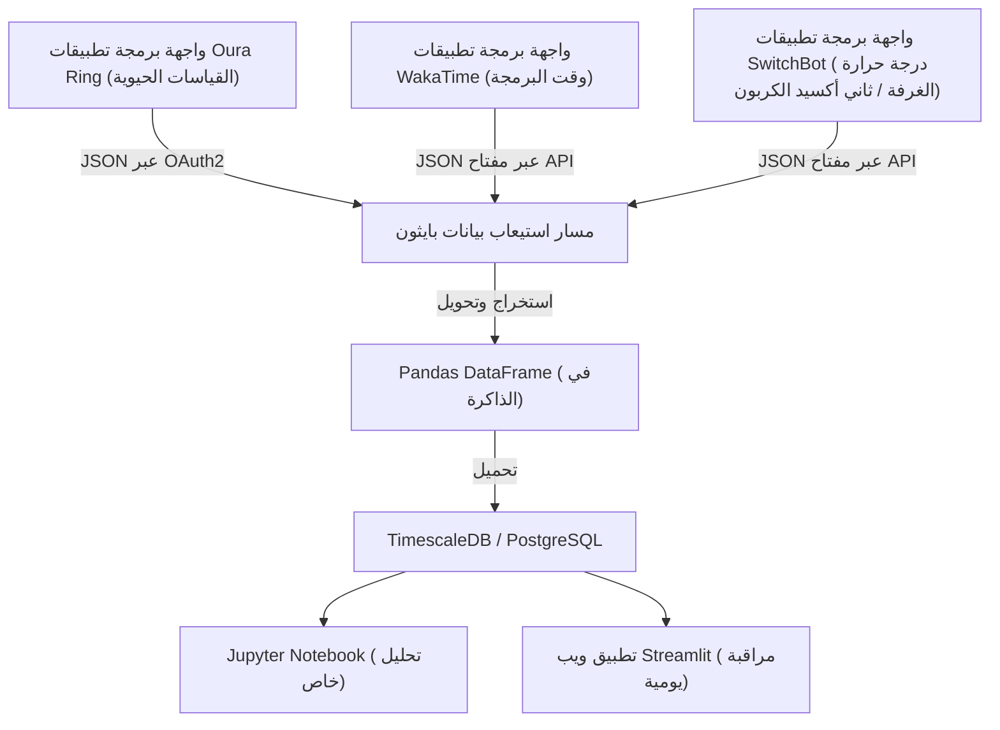
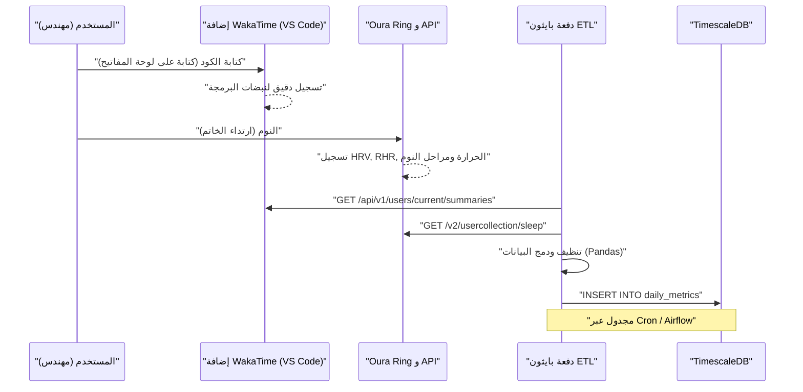
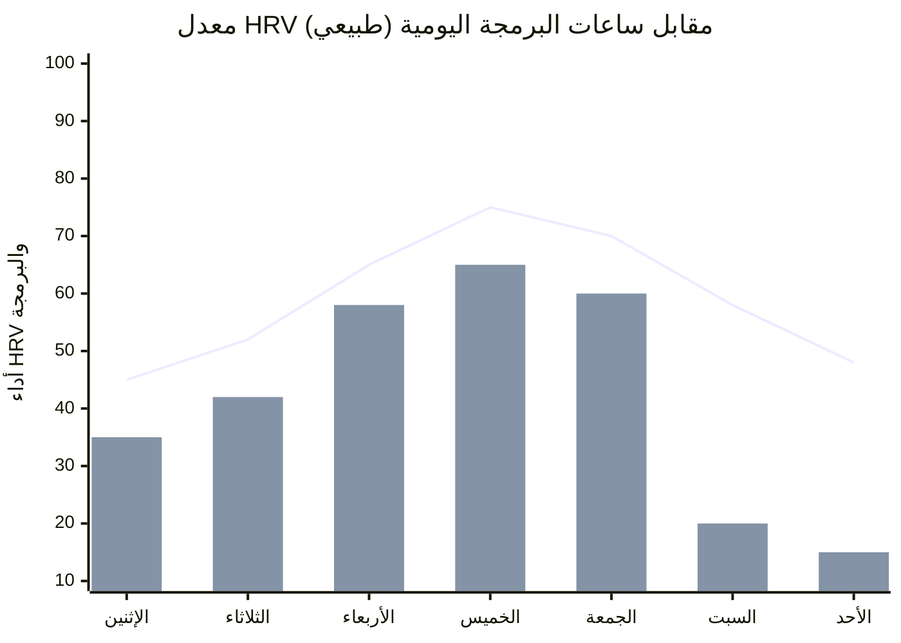

## 1. مقدمة: نقطة التقاء هندسة البرمجيات مع الاختراق الحيوي (Biohacking)

هندسة البرمجيات الحديثة هي عمل فكري شاق يرافقه عبء إدراكي شديد ونمط حياة مستقر (كثير الجلوس). بين المواكبة المستمرة للتقنيات المتغيرة، والبحث عن الأخطاء (Bug hunt) في الأنظمة الموزعة المعقدة، وضغط المواعيد النهائية. لتجاوز كل ذلك، لا يكفي الاعتماد على "الحماس" أو "قوة الإرادة" فحسب؛ بل من الضروري التعامل مع جسدك كأنه جهاز (Hardware) يحتاج إلى ضبط (Tuning) تمامًا كما تصلح أخطاء الأنظمة (Debugging). هذا النهج يُعرف بـ "الاختراق الحيوي" (Biohacking).

في الماضي، كنا نعتمد على الإحساس الشخصي (الاستدلال) للقول "أشعر أن صحتي جيدة أو سيئة اليوم". أما في العصر الحالي، ومع انتشار الأجهزة القابلة للارتداء عالية الأداء مثل Oura Ring، Apple Watch، وGarmin، أصبح بإمكاننا جمع البيانات الحيوية على مدار 24 ساعة، طوال أيام السنة، وبشكل غير تداخلي.
في هذا المقال، سنشرح كيفية استخراج البيانات الحيوية (HRV، RHR، وهيكل النوم) وبيانات الإنتاجية (مقاييس البرمجة من خلال WakaTime وغيرها) عبر واجهة برمجة التطبيقات (API)، وإجراء تحليل ارتباط باستخدام نهج علوم البيانات عبر Python وPandas.
كما سنسلط الضوء بتفصيل دقيق على الاختراقات الصحية للمهندسين والمبنية على أساس علمي، مثل النموذج الرياضي للإيقاع اليومي (السيركادي)، وتحديد التوقيت الأمثل لتناول القهوة بناءً على فترة عمر النصف لاستقلاب الكافيين.

## 2. ما لا يمكن قياسه لا يمكن إدارته: أجهزة جمع البيانات الحيوية

كل جهاز استشعار (أجهزة قابلة للارتداء) مخصص لجمع البيانات الحيوية يتميز في مجالات معينة. في إدارة الصحة المبنية على البيانات، الخطوة الأولى هي اختيار الجهاز الأنسب بناءً على هدفك.

### 2.1 Oura Ring (الجيل 3 / 4)
نظرًا لأنه يجمع البيانات مباشرة من شرايين الإصبع، فإنه يتميز بدقة عالية جدًا في قياس معدل ضربات القلب أثناء النوم، وتقلب معدل ضربات القلب (HRV)، والتغيرات في درجة حرارة سطح الجلد مقارنة بالساعات الذكية التي تُرتدى على المعصم. الإصبع غني بالشعيرات الدموية، مما يتيح جمع البيانات بأقل قدر من التشويش باستخدام المستشعر البصري لمعدل ضربات القلب (PPG). بالإضافة إلى ذلك، توفر واجهة REST API الخاصة به سهولة في تصدير البيانات الخام بصيغة JSON عبر OAuth2.0، مما يجعله الجهاز الأكثر قابلية للبرمجة (Hackable) للمهندسين.

### 2.2 Apple Watch (الإصدارات Series / Ultra)
يتفوق في تتبع الأنشطة، وقياس نسبة تشبع الأكسجين في الدم (SpO2)، وتخطيط كهربية القلب (ECG). يُعد الجهاز الأقوى لقياس مستوى النشاط أثناء النهار، وقياس HRV عند الطلب من خلال تطبيق اليقظة الذهنية (تطبيق التنفس). ومع ذلك، لتصدير البيانات، ستحتاج إلى المرور عبر HealthKit، مما يعني أنه لا يمكن الوصول المباشر من خلال Python، بل يتطلب ذلك خطوة إضافية مثل تصدير CSV عبر تطبيقات iOS (مثل AutoSleep أو HealthFit).

### 2.3 Garmin (Fenix / Forerunner)
بالإضافة إلى دقة تتبع GPS، يتميز بمؤشر رائع خاص به لمستوى الطاقة المتبقية يُسمى "Body Battery" (بطارية الجسم)، والذي يتم حسابه بناءً على HRV ومستويات التوتر. يمكن الحصول على بيانات Garmin من خلال Garmin Connect API، ولكن بسبب القيود المفروضة على واجهة برمجة التطبيقات للشركات، سيحتاج المطورون الأفراد إلى استخدام مكتبات مفتوحة المصدر أو أدوات استخراج البيانات (Scraping tools) التي يطورها المتطوعون.

في هذا المقال، سنركز بشكل أساسي على تحليل البيانات المستخرجة من **Oura Ring**، والذي يمثل القمة في تتبع النوم والتعافي مع سهولة استخراج البيانات من واجهة برمجة التطبيقات الخاصة به، إلى جانب بيانات **WakaTime**، والتي تسجل أوقات البرمجة كإضافة (Plugin) لبيئات التطوير المتكاملة (IDE) مثل VS Code وIntelliJ.

## 3. النظرية الأساسية للبيانات الحيوية: علم بيانات HRV و RHR

من وجهة نظر علم البيانات، لا يقتصر الأمر ببساطة على أن "النوم لساعات أطول يعني صحة أفضل". بدلاً من ذلك، هناك مؤشران يعملان كمقاييس رئيسية للتعافي (Recovery):

### 3.1 تقلب معدل ضربات القلب (HRV) ونمذجة الجهاز العصبي اللاإرادي
القلب لا ينبض بإيقاع ثابت كالبندول. حتى إذا كان معدل ضربات القلب 60 نبضة في الدقيقة، فإن الفاصل الزمني بين كل نبضة وأخرى (فاصل R-R) يتغير باستمرار مثل "0.92 ثانية" و "1.05 ثانية" و "0.98 ثانية". مقدار هذا التذبذب المُمثَّل رقميًا هو الـ HRV (تقلب معدل ضربات القلب).

يعكس HRV بشكل مباشر توازن الجهاز العصبي اللاإرادي؛ أي "الجهاز العصبي الودي (المحفز أو الدواسة)" و"الجهاز العصبي اللاودي (المهدئ أو الفرامل)". في حالات التوتر، أو الإرهاق الشديد، أو بعد تناول الكحول، يصبح الجهاز الودي هو المسيطر، وتقترب نبضات القلب من الثبات مما يؤدي إلى انخفاض HRV. على العكس، عندما يكون الشخص مرتاحًا تمامًا وفي مرحلة التعافي، يسيطر الجهاز اللاودي (العصب المبهم)، ويتغير معدل ضربات القلب بشكل ديناميكي مع التنفس، مما يجعل HRV مرتفعًا.

توجد طريقتان لحساب HRV: في المجال الزمني (Time-domain) والمجال الترددي (Frequency-domain). الطريقة الأكثر شيوعًا في تحليل المجال الزمني، والتي تُستخدم في Oura Ring وApple Watch، هي **RMSSD (الجذر التربيعي لمتوسط مربعات الفروق المتتالية)**. وهي تحسب الجذر التربيعي لمتوسط مربعات الفروق بين فترات النبض المتتالية (فترات RR).

بالتعبير الرياضي الدقيق، تُكتب كالتالي:

$$ RMSSD = \sqrt{\frac{1}{N-1} \sum_{i=1}^{N-1} (RR_{i+1} - RR_i)^2} $$

حيث:
- $N$ هو إجمالي عدد ضربات القلب المقاسة
- $RR_i$ هو فاصل RR رقم $i$ (بالميللي ثانية)

بالنسبة للمهندس، إذا كان HRV (أو RMSSD) عند الاستيقاظ في الصباح أقل بكثير من خط الأساس الشخصي (المتوسط المتحرك لعدة أسابيع ماضية)، فيمكن اتخاذ قرار مبني على البيانات: "اليوم يجب تجنب المهام ذات العبء الإدراكي العالي مثل تصميم البنية المعمارية أو النشر في بيئة الإنتاج، والتركيز بدلاً من ذلك على تعزيز رموز الاختبار (Test code) وكتابة الوثائق".

### 3.2 معدل ضربات القلب أثناء الراحة (RHR) كإشارة للتعافي
معدل RHR هو عدد ضربات القلب في الدقيقة عندما يكون الجسم في حالة استرخاء تام (عادة أثناء النوم). بعد تناول الكحول، أو الإفراط في الأكل في أوقات متأخرة، أو كعرض أولي لمرض (مثل العدوى)، سيرتفع معدل RHR عن خط الأساس بعدة نبضات إلى أكثر من عشر نبضات، حيث يقوم الجسم باستهلاك الطاقة في عمليات الأيض الداخلية أو الاستجابة المناعية.

كلما انخفض معدل RHR، فهذا يعني أن عضلة القلب تستطيع ضخ كمية أكبر من الدم في النبضة الواحدة (حجم النبضة أكبر)، مما يعكس كفاءة عالية للقلب والأوعية الدموية ومدى التعافي من الإرهاق. من الناحية المثالية، يعتبر الوصول إلى أدنى قيمة لـ RHR في النصف الأول من النوم، مشكلاً منحنى على هيئة "أرجوحة شبكية"، مؤشراً على تحقيق أعلى جودة للتعافي.

## 4. التحليل التفصيلي لهيكل النوم (Sleep Architecture)

ما يحدد أداء العقل للمهندس ليس فقط "كمية" النوم، بل "جودته" أو ما يُسمى بـ هيكل النوم (Sleep Architecture). ليلة النوم النموذجية تتكون من دورات تستغرق من 90 إلى 110 دقيقة، وتتكرر من 4 إلى 5 مرات.

### 4.1 نوم NREM (حركة العين غير السريعة) المراحل 1-2 (النوم الخفيف / Light Sleep)
هذه هي المرحلة التحضيرية حيث تبدأ موجات الدماغ بالتباطؤ ويبدأ الجسم في الاسترخاء. تشكل حوالي 50% من إجمالي النوم. رغم أن مساهمتها في التعافي الإدراكي قليلة، إلا أنها جسر مهم للانتقال إلى مراحل النوم العميق التالية.

### 4.2 نوم NREM المرحلة 3 (النوم العميق / Deep Sleep / Slow Wave Sleep: SWS)
تظهر موجات دلتا (تردد منخفض 0.5-2 هرتز) في تخطيط الدماغ، وهي الفترة الأساسية للتعافي الجسدي الفعلي. يتم إفراز كميات كبيرة من هرمون النمو وتتم عملية إصلاح الخلايا. كما أنها حيوية لتقوية الجهاز المناعي. لا يقتصر دورها على تعافي العضلات للرياضيين فحسب، بل تمتد لتخفيف إجهاد العينين وإصلاح عضلات الرقبة والكتفين للمهندسين. يتركز النوم العميق عادة في الدورات الأولى من النصف الأول من النوم.

### 4.3 نوم REM (حركة العين السريعة)
تكون موجات الدماغ نشطة تقريباً كما هي في حالة اليقظة، لكن عضلات الجسم في حالة شلل. نوم REM مهم للغاية للمهندسين، حيث يعمل على ترتيب وتنظيم المفاهيم الجديدة التي تم تعلمها خلال اليوم، مثل صياغة لغات البرمجة الجديدة أو المفاهيم المعقدة للخوارزميات، ويقوم بدمجها في الذاكرة طويلة المدى (Memory Consolidation). إنه يعزز اللدونة العصبية (Neuroplasticity)، ويقوي القدرة على حل المشكلات بشكل إبداعي (مثل لحظات الإلهام المفاجئة لحل مشكلة ما أثناء الاستحمام). يميل نوم REM إلى أن يصبح أطول في النصف الثاني من النوم (نحو الفجر).

بمعنى آخر، "الاستيقاظ مبكرًا بالقوة باستخدام المنبه وتقليل وقت النوم" يعني قطعًا محددًا وحادًا في نوم REM المسؤول عن ترسيخ الذاكرة والإبداع، وهو فعل يماثل إضافة خلل (Bug) خطير يؤدي إلى انخفاض كبير في أداء المهندس.

## 5. القياس المستمر للجلوكوز (CGM) والوقاية من الارتفاع المفاجئ (Spikes)

أصبح استخدام أدوات القياس المستمر للجلوكوز (CGM) ضرورة حتمية بين المخترقين الحيويين (Biohackers) مؤخراً. من الأجهزة المعروفة FreeStyle Libre و Dexcom.
عند تناول الطعام (وخاصة الكربوهيدرات والسكريات)، يرتفع تركيز الجلوكوز في الدم فجأة (Blood Sugar Spike)، ويتبعه هبوط حاد (Crash) نتيجة الإفراز الكثيف للأنسولين. يتسبب هذا الهبوط الحاد في نعاس شديد (Brain Fog) وانخفاض في التركيز. النعاس في "الساعة الثانية بعد الظهر المشؤومة" ليس مجرد نتيجة للساعة البيولوجية، بل هو على الأرجح نتيجة للارتفاع المفاجئ في سكر الدم بسبب تناول كميات زائدة من الكربوهيدرات المكررة كالمعكرونة أو الأرز الأبيض.

يمكن تمثيل منحنى استجابة السكر في الدم $G(t)$ كنموذج تذبذب متضائل، وهو الفرق بين سرعة امتصاص السكريات المتناولة ومعدل إزالتها بواسطة الأنسولين:

$$ G(t) = G_{base} + \Delta G \cdot e^{-\alpha t} \sin(\beta t) $$

حيث:
- $G_{base}$: مستوى سكر الدم أثناء الصيام (خط الأساس)
- $\Delta G$: سعة الارتفاع في سكر الدم بسبب الوجبة
- $\alpha$: معامل التضاؤل المعتمد على حساسية الأنسولين وسرعة الأيض
- $\beta$: المكون الترددي للتذبذب
- $t$: الوقت المنقضي منذ تناول الطعام

للحفاظ على أداء المهندس، من المهم تقليل سعة الارتفاع $\Delta G$ إلى الحد الأدنى. يمكن تحقيق ذلك بأساليب عملية، مثل "تناول الخضروات (الألياف) أولاً"، "تجنب الكربوهيدرات المكررة"، و"المشي الخفيف لمدة 15 دقيقة بعد تناول الطعام (لتنشيط نواقل GLUT4 وإدخال الجلوكوز إلى العضلات دون الاعتماد على الأنسولين)".

## 6. تصميم البنية المعمارية: بناء مسار بيانات محلي (Local Data Pipeline)

سنقوم ببناء مسار بيانات محلي لدمج وتحليل البيانات الحيوية مع بيانات الإنتاجية.
يوضح مخطط Mermaid التالي التدفق من استخراج البيانات عبر واجهات برمجة التطبيقات (APIs) إلى تصورها في لوحة تحكم (Dashboard).



هذه البنية تتيح المراقبة التلقائية اليومية للعلاقة بين حالتك الصحية (المدخلات) وأداء البرمجة (المخرجات).

لنفحص بعمق التسلسل بين هذه الأنظمة:



## 7. استيعاب البيانات باستخدام Python و Pandas

دعونا نلقي نظرة على نص برمجي بلغة Python يستخدم لجلب البيانات من واجهات Oura Ring و WakaTime ودمجها كإطار بيانات (DataFrame) باستخدام Pandas. سنبني رمزًا قويًا يمكن استخدامه في التشغيل الفعلي.

```python
import requests
import pandas as pd
from datetime import datetime, timedelta
import os

# Environment Variables
OURA_TOKEN = os.getenv("OURA_ACCESS_TOKEN")
WAKATIME_API_KEY = os.getenv("WAKATIME_API_KEY")

def fetch_oura_sleep_data(start_date: str, end_date: str) -> pd.DataFrame:
    """Fetch daily sleep summary from Oura Ring API v2."""
    url = "https://api.ouraring.com/v2/usercollection/sleep"
    params = {"start_date": start_date, "end_date": end_date}
    headers = {"Authorization": f"Bearer {OURA_TOKEN}"}
    
    response = requests.get(url, headers=headers, params=params)
    response.raise_for_status() # Raise exception for 4xx/5xx errors
    data = response.json().get("data", [])
    
    if not data:
        return pd.DataFrame()
        
    df = pd.json_normalize(data)
    # Extract deeply nested values or select essential columns
    df = df[['day', 'score', 'time_in_bed', 'total_sleep_duration', 
             'average_hrv', 'lowest_heart_rate', 
             'deep_sleep_duration', 'rem_sleep_duration']]
             
    # Convert dates to datetime objects and set as index
    df['day'] = pd.to_datetime(df['day'])
    df.set_index('day', inplace=True)
    return df

def fetch_wakatime_data(start_date: str, end_date: str) -> pd.DataFrame:
    """Fetch coding duration summaries from WakaTime API."""
    url = "https://wakatime.com/api/v1/users/current/summaries"
    params = {"start": start_date, "end": end_date, "api_key": WAKATIME_API_KEY}
    
    response = requests.get(url, params=params)
    response.raise_for_status()
    data = response.json().get("data", [])
    
    records = []
    for day_data in data:
        date_str = day_data['range']['date']
        # Extract total seconds spent coding
        total_seconds = day_data['grand_total']['total_seconds']
        records.append({'day': date_str, 'coding_hours': total_seconds / 3600.0})
        
    df = pd.DataFrame(records)
    if not df.empty:
        df['day'] = pd.to_datetime(df['day'])
        df.set_index('day', inplace=True)
    return df

if __name__ == "__main__":
    # Fetch data for the last 60 days
    end = datetime.now().strftime("%Y-%m-%d")
    start = (datetime.now() - timedelta(days=60)).strftime("%Y-%m-%d")
    
    oura_df = fetch_oura_sleep_data(start, end)
    waka_df = fetch_wakatime_data(start, end)
    
    # Merge datasets on 'day' index using inner join
    merged_df = pd.merge(oura_df, waka_df, left_index=True, right_index=True, how='inner')
    
    # Save raw data to CSV/DB
    merged_df.to_csv("health_productivity_raw.csv")
    print(f"Ingested {len(merged_df)} days of data.")
```

## 8. المعالجة المسبقة للبيانات وهندسة الميزات (Feature Engineering)

من الخطير تمرير البيانات الخام المستخرجة مباشرة للتحليل. يجب التعامل مع القيم المفقودة (Missing Values) الناتجة عن نسيان شحن الأجهزة، وكذلك توليد مؤشرات جديدة ذات مغزى (هندسة الميزات).

```python
def engineer_features(df: pd.DataFrame) -> pd.DataFrame:
    """Apply feature engineering and cleaning to the merged dataframe."""
    df = df.copy()
    
    # 1. Handle missing values (e.g., forward fill)
    df.fillna(method='ffill', inplace=True)
    
    # 2. Calculate Sleep Efficiency
    # Formula: (Total Sleep Time / Time in Bed) * 100
    df['sleep_efficiency_pct'] = (df['total_sleep_duration'] / df['time_in_bed']) * 100
    
    # 3. Calculate Sleep Stage Ratios
    df['rem_ratio'] = df['rem_sleep_duration'] / df['total_sleep_duration']
    df['deep_ratio'] = df['deep_sleep_duration'] / df['total_sleep_duration']
    
    # 4. Calculate 7-day Moving Averages (Rolling Mean) to smooth out daily noise
    df['hrv_7d_ma'] = df['average_hrv'].rolling(window=7).mean()
    df['rhr_7d_ma'] = df['lowest_heart_rate'].rolling(window=7).mean()
    
    # 5. Calculate daily deviation from baseline
    df['hrv_deviation'] = df['average_hrv'] - df['hrv_7d_ma']
    
    # 6. Normalize targets for Machine Learning (Optional)
    from sklearn.preprocessing import MinMaxScaler
    scaler = MinMaxScaler()
    df[['hrv_scaled', 'coding_scaled']] = scaler.fit_transform(df[['average_hrv', 'coding_hours']])
    
    # Drop rows with NaN generated by rolling window
    df.dropna(inplace=True)
    
    return df

processed_df = engineer_features(merged_df)
```

## 9. تحليل الارتباط: تقاطع الإنتاجية مع المقاييس الصحية

بناءً على البيانات المعالجة، نقوم بتحليل العلاقة بين المؤشرات الصحية وإنتاجية البرمجة. تتمثل الفرضية في أن "الأيام التي يكون فيها الـ HRV مرتفعًا (الجهاز العصبي مستقر والجسم في حالة تعافٍ)، تدوم مستويات التركيز لفترة أطول وتزداد ساعات البرمجة، أو يكون الشخص قادراً على أداء مهام أكثر تعقيدًا".


*(ملاحظة: يمثل الرسم البياني الخطي الانحراف عن خط الأساس الموحد لـ HRV، في حين يمثل الرسم البياني الشريطي أوقات البرمجة المسجلة عبر WakaTime. يمكن ملاحظة وجود ارتباط قوي لزيادة إنتاجية البرمجة من يوم الأربعاء وحتى الجمعة، حيث يحصل الجسم على قسط كافٍ من التعافي).*

سنقوم بحساب معامل الارتباط (معامل ارتباط بيرسون $r$) باستخدام Pandas، واختبار الأهمية الإحصائية (p-value) باستخدام مكتبة SciPy.

```python
import scipy.stats as stats

# Select numerical columns for correlation matrix
cols_of_interest = ['average_hrv', 'score', 'deep_sleep_duration', 'rem_sleep_duration', 'coding_hours']
correlation_matrix = processed_df[cols_of_interest].corr()

print("Correlation with Coding Hours:")
print(correlation_matrix['coding_hours'].sort_values(ascending=False))

# Calculate Pearson correlation coefficient and p-value for REM sleep and Coding Hours
r, p_value = stats.pearsonr(processed_df['rem_sleep_duration'], processed_df['coding_hours'])
print(f"REM Sleep vs Coding Hours: r = {r:.3f}, p-value = {p_value:.4f}")
```

في كثير من الأحيان، يُلاحظ وجود ارتباط إيجابي دال إحصائيًا ($p < 0.05$) بين `average_hrv` أو `rem_sleep_duration` وساعات البرمجة `coding_hours`. بصفة خاصة، تفيد تقارير مجتمع "التتبع الذاتي" (Quantified Self) بأن مدة نوم REM في الليلة السابقة تؤثر بشدة على "الوقت المستغرق لحل الأخطاء البرمجية (Debugging)" و "الإنتاجية" في اليوم التالي.

## 10. النموذج الرياضي للإيقاع اليومي (السيركادي) وتحسين ذروة الأداء الإدراكي

يمتلك البشر ساعة بيولوجية داخلية دورية مدتها 24 ساعة تقريبًا تُعرف باسم الإيقاع اليومي أو السيركادي (Circadian Rhythm). تتحكم هذه الإيقاعات في تقلبات درجة حرارة الجسم، إفراز الهرمونات (مثل زيادة الكورتيزول في الصباح والميلاتونين في المساء)، والقدرات الإدراكية.

غالبًا ما يتم تمثيل التغيرات في الإيقاع السيركادي بنموذج رياضي يستند إلى منحنى جيب التمام (نموذج Cosinor)، حيث يمكن صياغة التغير في المؤشرات الحيوية بالمعادلة التالية:

$$ y(t) = M + A \cos\left(\frac{2\pi}{24}(t - \phi)\right) + e(t) $$

- $y(t)$: المؤشر الحيوي (مثل درجة الحرارة الأساسية للجسم أو مستوى اليقظة) عند الوقت $t$
- $M$: MESOR (Midline Estimating Statistic of Rhythm) - القيمة المركزية أو المتوسطة للإيقاع
- $A$: السعة (Amplitude) - حجم التغير
- $\phi$: ذروة الإيقاع (Acrophase) - الوقت الذي يصل فيه المنحنى إلى ذروته
- $e(t)$: مصطلح الخطأ (نتيجة العوامل البيئية، إلخ)

المعنى الذي تحمله هذه المعادلة للمهندس هو أن "الفترة التي يصل فيها الأداء (اليقظة) إلى ذروته ($\phi$) خلال اليوم محددة بيولوجيًا، ويجب تعيين المهام التي تتطلب عبئًا إدراكيًا عاليًا (مثل إصلاح الأخطاء المعقدة وتصميم البنيات المعمارية الجديدة) في هذا الوقت تحديدًا".

بالنسبة للأشخاص ذوي النمط الصباحي المعتاد (Morning Lark)، تأتي الذروة الإدراكية الأولى بعد 2-4 ساعات من الاستيقاظ (على سبيل المثال، من 9:00 صباحًا إلى 11:00 صباحًا). بعد ذلك، يحدث هبوط في الإيقاع السيركادي حوالي الساعة 2:00 بعد الظهر (تراجع ما بعد الغداء)، وتليها ذروة صغيرة في المساء. إن أفضل اختراق صحي هو تحديد وقت الذروة الشخصي الخاص بك ($\phi$) من خلال مراقبة مستويات نشاطك من بيانات الأجهزة القابلة للارتداء أو شعورك الشخصي بالتركيز، واستخدام "حجب الوقت" (Time blocking) في أدوات مثل Google Calendar للحفاظ على هذه الفترة. وضع اجتماعات غير مفيدة في وقت الذروة يشبه تخصيص أفضل نواة للمعالج (CPU) لعمليات فارغة أو مهملة (Idle processes).

## 11. الحركية الدوائية للكافيين والتوقيت الأمثل لتناوله

العلاقة بين المهندس والقهوة علاقة وثيقة لا تنفصل، إلا أن استهلاك الكافيين بشكل مفرط أو في أوقات متأخرة يمنع مستقبلات الأدينوزين في الدماغ، مما يدمر "النوم العميق" (Deep Sleep) ليلاً. حتى لو شعرت بأنك نائم بشكل طبيعي، بإلقاء نظرة على بيانات Oura Ring ستجد أن معدل ضربات قلبك لم ينخفض وأن نسبة النوم العميق قد انخفضت بشكل حاد.

تخضع عملية إخراج الكافيين من الجسم لـ الحركية من الدرجة الأولى (First-order kinetics). وهذا يعني أن تركيزه في الدم يتضاءل بشكل أُسي.

$$ C(t) = C_0 e^{-k t} $$

حيث:
- $C(t)$: تركيز الكافيين في الدم بعد مرور الوقت $t$
- $C_0$: التركيز المبدئي (أقصى تركيز بعد التناول مباشرة)
- $k$: ثابت سرعة الإزالة (Elimination rate constant)
- $t$: الوقت المنقضي منذ التناول (بالساعات)

ثابت سرعة الإزالة $k$ يُعبر عنه من خلال فترة عمر النصف للكافيين ($t_{1/2}$) كما يلي:

$$ k = \frac{\ln(2)}{t_{1/2}} $$

بالنسبة للبالغين الأصحاء، ورغم أن ذلك يعتمد على الجينات (تحديداً جين CYP1A2)، يُقدر عمر النصف للكافيين $t_{1/2}$ بـ **5 إلى 6 ساعات**.
على سبيل المثال، لنفترض أنك شربت كوبًا من القهوة المقطرة (يحتوي على حوالي 150 ملغ من الكافيين) في الساعة 3:00 عصرًا ($C_0 = 150$). بافتراض أن عمر النصف هو 5.5 ساعة، فإن $k \approx 0.126$.
لحساب كمية الكافيين المتبقية في الجسم عند وقت النوم في الساعة 11:00 مساءً (أي بعد 8 ساعات):

$$ C(8) = 150 \times e^{-0.126 \times 8} = 150 \times e^{-1.008} \approx 150 \times 0.365 = 54.75 \text{ mg} $$

وهذا يعني أنه في وقت النوم، لا يزال لديك 54 ملغ (ما يعادل جرعة إسبريسو قوية) من الكافيين في نظامك، وهو ما يؤثر سلبًا وبشكل مباشر على هيكل نومك.
النتيجة المبنية على البيانات المستخلصة من نموذج الحركية الدوائية هذا هي: **"لضمان الحصول على نوم عالي الجودة، يجب البدء في تناول الكافيين بعد 90 دقيقة من الاستيقاظ (بعد أن يهدأ ارتفاع الكورتيزول الصباحي)، والتوقف عنه تمامًا بحلول الساعة 2:00 بعد الظهر كحد أقصى (أي قبل 9-10 ساعات من موعد النوم)."**

## 12. اختراق متغيرات البيئة (الضوء Lux، درجة الحرارة، CO2)

ليس فقط نظام جسمك الداخلي هو المهم؛ فمن المهم أيضًا تحسين متغيرات البيئة الخارجية (Environment Variables).

### 12.1 برمجة بيئة الإضاءة (Lux)
أقوى "أداة لضبط الوقت" (Zeitgeber: مؤشر الوقت) لإعادة ضبط الإيقاع اليومي هو الضوء. في الصباح، عند دخول حوالي 100,000 لوكس (Lux) من ضوء الشمس إلى خلايا المستقبلات الضوئية (ipRGC) في الشبكية، يتوقف إفراز الميلاتونين وتُعاد ضبط الساعة البيولوجية. بالمقابل، في الليل يجب حجب الضوء الأزرق لكي لا يتم تثبيط إفراز الميلاتونين. إلى جانب استخدام برامج لتقليل درجة حرارة ألوان الشاشة مثل f.lux، من المفيد بناء نصوص برمجية (Scripts) للتحكم في الإضاءة الذكية (مثل Philips Hue) عبر API لتقليل مستوى الإضاءة ودرجة حرارة الألوان تلقائيًا مع غروب الشمس.

### 12.2 التحكم في درجة حرارة غرفة النوم ووقت الدخول في النوم (Sleep Latency)
يدخل البشر في حالة النوم عندما تنخفض درجة حرارة الجسم الأساسية (Core Body Temperature). من خلال إبقاء غرفة النوم باردة (بين 18-19 درجة مئوية)، واستغلال هبوط درجة حرارة الجسم المفاجئة الناتجة عن الاستحمام بماء دافئ قبل 90 دقيقة من النوم؛ يمكنك الدخول للسرير في اللحظة المثالية، مما يقلل بشكل كبير من وقت الدخول في النوم (Sleep Latency: الوقت من الاستلقاء حتى بداية النوم) ويعزز النوم العميق لأقصى درجة.

### 12.3 تركيز CO2 وتراجع الوظائف الإدراكية
إذا أضفت API الخاص بأجهزة مثل SwitchBot Hub أو محطات الطقس من Netatmo إلى مسار بياناتك، فستلاحظ وجود علاقة عكسية واضحة بين تركيز ثاني أكسيد الكربون (CO2) في الغرفة والإنتاجية.
كما أثبتت دراسات جامعة هارفارد وغيرها، عندما يتجاوز تركيز ثاني أكسيد الكربون 1000 جزء في المليون (ppm)، تبدأ الوظائف الإدراكية (وخاصة القدرة على اتخاذ القرارات الإستراتيجية) بالتراجع بشكل ملحوظ. وإذا تجاوز 2000 ppm، يتسبب في انخفاض شديد في الأداء. العمل عن بعد في غرفة مغلقة خلال فصل الشتاء يتسبب في خفض أدائك دون أن تدرك ذلك.

```python
# Pseudo-code for intelligent room ventilation using Home Assistant / SwitchBot API
import requests

def check_and_ventilate():
    # Get current CO2 level from Netatmo/SwitchBot API
    co2_ppm = get_sensor_data("co2_sensor_id")
    
    if co2_ppm > 1000:
        print(f"Warning: CO2 level high ({co2_ppm} ppm). Cognitive decline risk.")
        # Trigger smart plug to turn on ventilation fan
        turn_on_smart_plug("ventilation_fan_id")
        # Send notification to Slack/Discord
        send_notification("تم تشغيل مروحة التهوية. تركيز CO2 مرتفع.")
    elif co2_ppm < 600:
        turn_off_smart_plug("ventilation_fan_id")
```
من خلال جدولة هذا الكود ليعمل بشكل دوري (برمجيات الجدولة Cron)، يمكنك بناء نظام تحكم بيئي مستقل يحافظ دائمًا على مستويات الأكسجين المثلى في الغرفة.

## 13. الخلاصة: التكامل والتسليم المستمر (CI/CD) لجسم الإنسان كمنظومة

حاول التفكير في جسدك كنظام موزع (Distributed system) عالي التعقيد. الأجهزة القابلة للارتداء (Oura Ring) تعمل كمُصدّر للمقاييس لمراقبة الأداء (Prometheus)، ونصوص Python/Pandas كمسارات لتحليل السجلات (Logstash/Fluentd)، وتغيرات صحتك اليومية وأدائك تُعرض على لوحات التحكم (Grafana/Streamlit) كعلامات على صحة النظام.

العمل من خلال "تقليل ساعات النوم" يعادل دفع ميزات إضافية مع تجاهل "الديون التقنية" (Technical Debt). قد تتمكن من إطلاق المشروع في موعده على المدى القصير، لكن على المدى الطويل سيؤدي ذلك حتماً إلى تعطل النظام (الإرهاق الشديد، أضرار صحية جسيمة، أو الاكتئاب).

مراقبة الـ HRV، تتبع اتجاهات الـ RHR، وتحسين هيكل النوم، إلى جانب دراسة الارتباط بينها وبين بيانات الإنتاجية من WakaTime لضبط "المعلمات الفائقة" (Hyperparameters) بشكل يومي مثل التغذية، التمرين، النوم، والبيئة؛ ما هو إلا عملية تطبيق لـ **التكامل والتسليم المستمر (CI/CD)** على جسم الإنسان.

استفد من واجهات برمجة التطبيقات وعلوم البيانات لهندسة حالة صحية تمكنك من تحقيق أفضل أداء. فجودة الكود الذي تكتبه مرتبطة ارتباطاً مباشراً بصحة نظامك الحيوي الخاص.

---
*تنويه (Disclaimer): هذا المقال يلخص التجارب الشخصية للكاتب وتطبيق نهج علوم البيانات، ولا يقدم أي نصائح طبية. إذا كنت تعاني من مشاكل صحية مستمرة أو اضطرابات في النوم، يرجى استشارة مؤسسة طبية متخصصة.*
