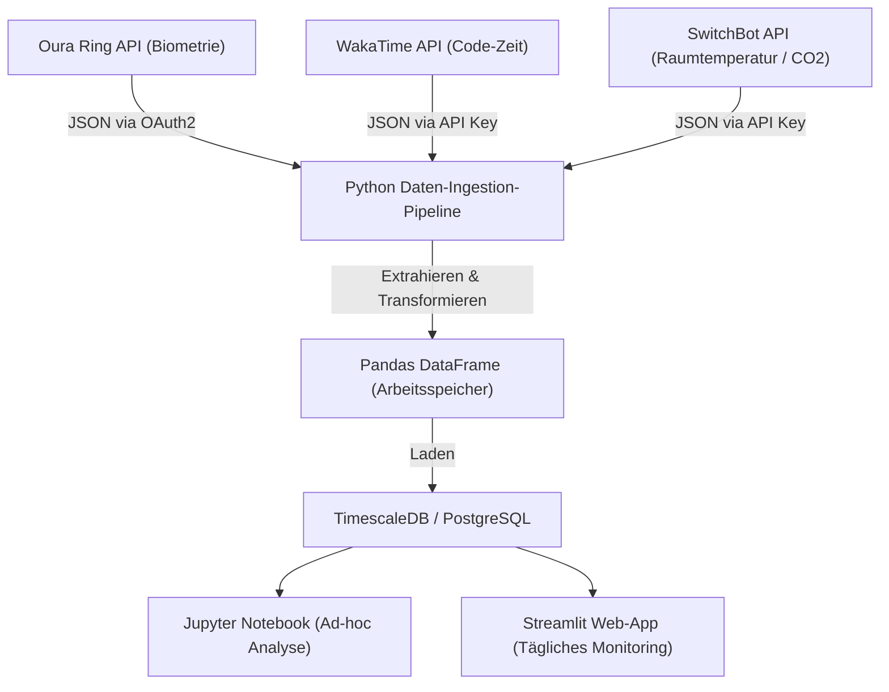
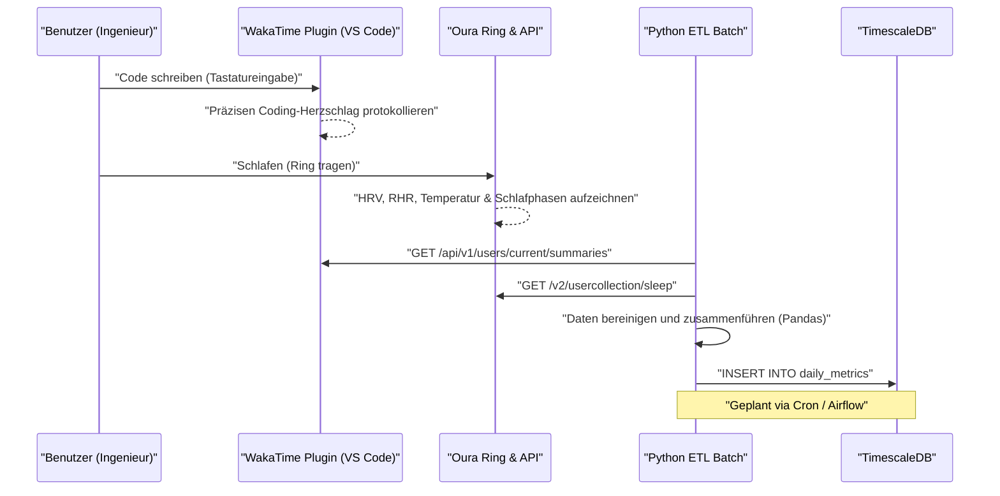
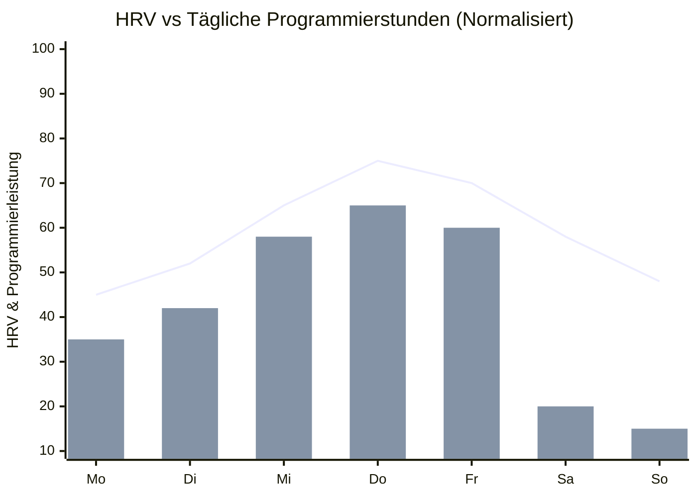

## 1. Einführung: Die Schnittstelle von Software-Engineering und Biohacking

Modernes Software-Engineering ist eine anspruchsvolle intellektuelle Arbeit, die mit extremen kognitiven Belastungen und langem Sitzen (Sedentary Lifestyle) einhergeht. Das ständige Aufholen sich ändernder Tech-Stacks, die Jagd nach Fehlern in komplexen verteilten Systemen und der Zeitdruck vor Deadlines. Um dies zu bewältigen, reicht es nicht aus, sich nur auf "Willenskraft" oder "Ausdauer" zu verlassen. Stattdessen ist ein Ansatz unerlässlich, bei dem man seinen eigenen Körper – die Hardware – wie ein System debuggt und optimiert: das sogenannte "Biohacking".

Früher verließen wir uns auf subjektive Gefühle (Heuristiken) wie "Heute fühle ich mich irgendwie gut/schlecht", aber heute, mit der Verbreitung von leistungsstarken Wearables wie Oura Ring, Apple Watch und Garmin, können biometrische Daten rund um die Uhr nicht-invasiv erfasst werden. In diesem Artikel wird erklärt, wie man biometrische Daten (HRV, RHR, Schlafarchitektur) und Produktivitätsdaten (Coding-Metriken durch WakaTime usw.) über APIs abruft und mithilfe von Python und Pandas datenwissenschaftliche Korrelationsanalysen durchführt. Darüber hinaus werden evidenzbasierte Gesundheits-Hacks für Ingenieure äußerst detailliert aufgeschlüsselt, wie z.B. mathematische Modelle des zirkadianen Rhythmus und das optimale Timing für Kaffeekonsum basierend auf der Halbwertszeit des Koffeinstoffwechsels.

## 2. Was man nicht messen kann, kann man nicht managen: Hardware zur Erfassung biometrischer Daten

Sensoren (Wearables) zur Erfassung biometrischer Daten haben jeweils ihre eigenen Stärken. Für ein datengesteuertes Gesundheitsmanagement ist die Auswahl des optimalen Geräts je nach Zweck der erste Schritt.

### 2.1 Oura Ring (Generation 3 / 4)
Da Daten direkt von den Arterien im Finger erfasst werden, ist die Genauigkeit bei der Messung von Herzfrequenz während des Schlafs, Herzfrequenzvariabilität (HRV) und Änderungen der Körperoberflächentemperatur im Vergleich zu Smartwatches, die am Handgelenk messen, sehr hoch. Finger sind reich an Kapillaren, was eine rauscharme Datenerfassung mit optischen Herzfrequenzsensoren (PPG: Photoplethysmographie) ermöglicht. Darüber hinaus ist die REST-API umfangreich und Rohdaten im JSON-Format können problemlos über OAuth2.0 exportiert werden, was ihn zum hackbarsten Gerät für Ingenieure macht.

### 2.2 Apple Watch Series / Ultra
Sie zeichnet sich beim Tracking während Aktivitäten, der Messung der Blutsauerstoffsättigung (SpO2) und des Elektrokardiogramms (EKG) aus. Es ist das beste Gerät zur Messung von HRV auf Abruf über Achtsamkeits-Apps (Atem-App) und das tägliche Aktivitätsniveau. Der Datenexport muss jedoch über HealthKit erfolgen, was einen Zwischenschritt erfordert, wie z.B. einen CSV-Export über iOS-Apps (wie AutoSleep oder HealthFit) für den direkten Zugriff mit Python etc.

### 2.3 Garmin (Fenix / Forerunner)
Zusätzlich zur Genauigkeit des GPS-Trackings ist der einzigartige Energiereserven-Indikator namens "Body Battery" hervorragend. Dieser wird basierend auf HRV und Stresslevel berechnet. Garmin-Daten können über die Garmin Connect API abgerufen werden, aber aufgrund von API-Hürden für Unternehmen müssen einzelne Entwickler Open-Source-Bibliotheken oder Scraping-Tools von Freiwilligen verwenden.

In diesem Artikel werden wir uns auf die Daten des **Oura Ring**, der beim Tracking von Schlaf und Erholung die Spitze bildet und dessen Datenextraktion über die API extrem einfach ist, sowie auf die Daten von **WakaTime**, das als Plugin für IDEs (wie VS Code oder IntelliJ) die Programmierzeit misst, konzentrieren.

## 3. Grundtheorie der biometrischen Daten: Datenwissenschaft von HRV und RHR

Anstatt eines einfachen Indikators wie "langer Schlaf ist gut", sind aus Sicht der Datenwissenschaft die folgenden zwei Indikatoren die wichtigsten Metriken für die "Erholung" (Recovery).

### 3.1 HRV (Herzfrequenzvariabilität: Heart Rate Variability) und die Modellierung des autonomen Nervensystems
Das Herz schlägt nicht in einem konstanten Rhythmus wie ein Metronom. Auch bei einer Herzfrequenz von 60 bpm schwankt das Intervall zwischen den Schlägen (R-R-Intervall) ständig, z.B. "0,92 Sekunden", "1,05 Sekunden", "0,98 Sekunden". Diese Schwankung quantifiziert man als HRV (Herzfrequenzvariabilität).

HRV spiegelt direkt das Gleichgewicht des autonomen Nervensystems wider, d.h. des "sympathischen Nervensystems (Gaspedal)" und des "parasympathischen Nervensystems (Bremse)". In Stresssituationen, bei Überarbeitung oder nach Alkoholkonsum dominiert das sympathische Nervensystem, der Herzschlag wird gleichmäßiger und die HRV sinkt. Im Gegenteil, in einem Zustand ausreichender Entspannung und Erholung dominiert das parasympathische Nervensystem (Vagusnerv), und da der Herzschlag dynamisch mit der Atmung schwankt, steigt die HRV.

Für die Berechnung der HRV gibt es zwei Ansätze: den Zeitbereich (Time-domain) und den Frequenzbereich (Frequency-domain). In der Zeitbereichsanalyse wird am häufigsten der **RMSSD (Root Mean Square of Successive Differences)** verwendet, der auch von Oura Ring und Apple Watch genutzt wird. Dies ist der quadratische Mittelwert der Differenzen aufeinanderfolgender Herzschlagintervalle (RR-Intervalle).

Streng mathematisch ausgedrückt sieht es wie folgt aus:

$$ RMSSD = \sqrt{\frac{1}{N-1} \sum_{i=1}^{N-1} (RR_{i+1} - RR_i)^2} $$

Hierbei ist:
- $N$ die Gesamtzahl der gemessenen Herzschläge
- $RR_i$ das $i$-te RR-Intervall (in Millisekunden)

Für Ingenieure ermöglicht dies datengesteuerte Entscheidungen: Wenn die HRV (RMSSD) nach dem Aufwachen signifikant unter den persönlichen Basiswert (gleitender Durchschnitt der letzten Wochen) fällt, bedeutet dies: "Heute ist ein Tag, an dem man kognitiv anspruchsvolle Architekturdesigns oder Deployments in die Produktionsumgebung vermeiden und sich stattdessen auf die Erweiterung von Testcode oder das Schreiben von Dokumentation konzentrieren sollte."

### 3.2 Ruheherzfrequenz (RHR: Resting Heart Rate) und das Signal der Erholung
Die RHR ist die Anzahl der Herzschläge pro Minute, wenn der Körper vollständig entspannt ist (normalerweise im Schlaf). Wenn der Körper Energie für den Stoffwechsel oder Immunreaktionen nach Alkoholkonsum, spätem übermäßigem Essen oder als frühes Symptom einer Krankheit (wie einer Infektion) aufwendet, steigt die RHR um einige bis über zehn bpm über den Basiswert.

Je niedriger die RHR, desto mehr Blut kann der Herzmuskel mit einem einzigen Schlag pumpen (größeres Schlagvolumen), was auf eine hohe aerobe Fitness und den Grad der Erholung von Ermüdung hinweist. Idealerweise zeichnet die RHR in der ersten Hälfte des Schlafs eine "Hängematten-Kurve" (Hammock Curve), bei der sie ihren niedrigsten Wert erreicht, was den Zustand hochwertigster Erholung darstellt.

## 4. Detaillierte Analyse der Schlafarchitektur

Was die Leistung des Gehirns eines Ingenieurs bestimmt, ist nicht nur die "Quantität", sondern auch die "Qualität" des Schlafs, also die Schlafarchitektur (Sleep Architecture). Eine Nachtruhe wiederholt normalerweise Zyklen von 90 bis 110 Minuten 4 bis 5 Mal.

### 4.1 NREM-Schlaf Phase 1-2 (Leichter Schlaf / Light Sleep)
Dies ist die Vorbereitungsphase, in der sich die Gehirnwellen verlangsamen und der Körper zu entspannen beginnt. Sie macht etwa 50 % des gesamten Schlafs aus. Obwohl der Beitrag zur kognitiven Erholung gering ist, dient sie als wichtige Brücke für den Übergang in die nächste tiefe Schlafphase.

### 4.2 NREM-Schlaf Phase 3 (Tiefer Schlaf / Deep Sleep / Slow Wave Sleep: SWS)
Dies ist die Kernzeit der körperlichen Erholung, in der Delta-Wellen (niederfrequente Wellen von 0,5 bis 2 Hz) im EEG auftreten. Wachstumshormone werden in großen Mengen ausgeschüttet und Zellen werden repariert. Es ist nicht nur für Sportler zur Erholung der Muskelermüdung unerlässlich, sondern auch für Ingenieure zur Reparatur von Augenermüdung und der Nacken-/Schultermuskulatur sowie zur Stärkung des Immunsystems. Tiefer Schlaf konzentriert sich typischerweise in den Schlafzyklen der ersten Nachthälfte.

### 4.3 REM-Schlaf (Rapid Eye Movement)
Der Zustand, in dem das Gehirn fast so aktiv ist wie im Wachzustand, aber die Muskeln des Körpers gelähmt sind. Für Ingenieure ist dieser REM-Schlaf von entscheidender Bedeutung, da er die Rolle der Gedächtniskonsolidierung (Memory Consolidation) übernimmt. Er organisiert am Tag gelernte neue Programmiersprachen-Syntaxen oder komplexe Algorithmus-Konzepte im Gehirn und verankert sie im Langzeitgedächtnis. Neuroplastizität (Neuroplasticity) wird erhöht, und kreative Problemlösungsfähigkeiten (wie das plötzliche Finden eines Workarounds unter der Dusche) werden durch den REM-Schlaf verstärkt. REM-Schlaf neigt dazu, in der zweiten Nachthälfte (gegen Morgen) länger zu werden.

Mit anderen Worten, "die Schlafzeit gewaltsam durch den Wecker zu verkürzen" bedeutet, den REM-Schlaf, der für Gedächtnis und Kreativität verantwortlich ist, drastisch zu reduzieren. Es gleicht einem schweren Fehler (Bug), der die Leistung als Ingenieur erheblich beeinträchtigt.

## 5. Kontinuierliche Glukosemessung (CGM) und die Vermeidung von Spitzen

In den letzten Jahren ist die Einführung von CGM (Continuous Glucose Monitor: kontinuierliche Glukosemessgeräte) unter Biohackern unverzichtbar geworden. Typische Geräte sind FreeStyle Libre und Dexcom.
Wenn Sie Mahlzeiten (insbesondere Kohlenhydrate und Zucker) zu sich nehmen, steigt die Glukosekonzentration im Blut stark an (Blutzuckerspitze) und fällt dann aufgrund einer massiven Insulinausschüttung rapide ab (Crash). Zum Zeitpunkt dieses "Crashs" kommt es zu starker Schläfrigkeit (Brain Fog) und einem Konzentrationsabfall. Die "dämonische Schläfrigkeit um 14 Uhr" nach dem Mittagessen ist wahrscheinlich nicht nur auf die innere Uhr zurückzuführen, sondern auf Blutzuckerspitzen durch übermäßigen Verzehr von Ramen oder weißem Reis.

Die Blutzucker-Reaktionskurve $G(t)$ kann als Differenz zwischen der Absorptionsrate der aufgenommenen Kohlenhydrate und der Clearance durch Insulin näherungsweise als folgendes gedämpftes Oszillationsmodell dargestellt werden:

$$ G(t) = G_{base} + \Delta G \cdot e^{-\alpha t} \sin(\beta t) $$

Hierbei ist:
- $G_{base}$: Nüchternblutzucker (Basiswert)
- $\Delta G$: Amplitude des Blutzuckeranstiegs durch die Mahlzeit
- $\alpha$: Dämpfungskoeffizient basierend auf Insulinsensitivität und Stoffwechselrate
- $\beta$: Frequenzkomponente der Oszillation
- $t$: Verstrichene Zeit nach dem Essen

Um die Leistung eines Ingenieurs aufrechtzuerhalten, ist es wichtig, $\Delta G$ (Amplitude) zu minimieren. Konkret sind Hacks wie "Gemüse (Ballaststoffe) zuerst essen", "raffinierte Kohlenhydrate vermeiden" und "nach dem Essen 15 Minuten leicht spazieren gehen (um GLUT4-Transporter zu aktivieren und Glukose insulinunabhängig in die Muskeln aufzunehmen)" wirksam.

## 6. Architekturdesign: Aufbau einer lokalen Datenpipeline

Wir bauen eine lokale Datenpipeline zur integrierten Analyse von biometrischen Daten und Produktivitätsdaten auf.
Das folgende Mermaid-Diagramm (Flussdiagramm) zeigt den Ablauf vom Abrufen der Daten aus den APIs bis zu deren Visualisierung in einem Dashboard.



Mit dieser Architektur können Sie die Korrelation zwischen Ihrem eigenen Gesundheitszustand (Input) und der Coding-Leistung (Output) täglich automatisiert überwachen.

Lassen Sie uns außerdem die Sequenzen zwischen den Systemen im Detail betrachten.



## 7. Daten-Ingestion mit Python und Pandas

Sehen wir uns den eigentlichen Code an, der ein Python-Skript verwendet, um Daten von den Oura Ring- und WakaTime-APIs abzurufen und sie als Pandas DataFrame zu integrieren. Wir erstellen einen robusten Code, der dem realen Betrieb standhält.

```python
import requests
import pandas as pd
from datetime import datetime, timedelta
import os

# Environment Variables
OURA_TOKEN = os.getenv("OURA_ACCESS_TOKEN")
WAKATIME_API_KEY = os.getenv("WAKATIME_API_KEY")

def fetch_oura_sleep_data(start_date: str, end_date: str) -> pd.DataFrame:
    """Fetch daily sleep summary from Oura Ring API v2."""
    url = "https://api.ouraring.com/v2/usercollection/sleep"
    params = {"start_date": start_date, "end_date": end_date}
    headers = {"Authorization": f"Bearer {OURA_TOKEN}"}
    
    response = requests.get(url, headers=headers, params=params)
    response.raise_for_status() # Raise exception for 4xx/5xx errors
    data = response.json().get("data", [])
    
    if not data:
        return pd.DataFrame()
        
    df = pd.json_normalize(data)
    # Extract deeply nested values or select essential columns
    df = df[['day', 'score', 'time_in_bed', 'total_sleep_duration', 
             'average_hrv', 'lowest_heart_rate', 
             'deep_sleep_duration', 'rem_sleep_duration']]
             
    # Convert dates to datetime objects and set as index
    df['day'] = pd.to_datetime(df['day'])
    df.set_index('day', inplace=True)
    return df

def fetch_wakatime_data(start_date: str, end_date: str) -> pd.DataFrame:
    """Fetch coding duration summaries from WakaTime API."""
    url = "https://wakatime.com/api/v1/users/current/summaries"
    params = {"start": start_date, "end": end_date, "api_key": WAKATIME_API_KEY}
    
    response = requests.get(url, params=params)
    response.raise_for_status()
    data = response.json().get("data", [])
    
    records = []
    for day_data in data:
        date_str = day_data['range']['date']
        # Extract total seconds spent coding
        total_seconds = day_data['grand_total']['total_seconds']
        records.append({'day': date_str, 'coding_hours': total_seconds / 3600.0})
        
    df = pd.DataFrame(records)
    if not df.empty:
        df['day'] = pd.to_datetime(df['day'])
        df.set_index('day', inplace=True)
    return df

if __name__ == "__main__":
    # Fetch data for the last 60 days
    end = datetime.now().strftime("%Y-%m-%d")
    start = (datetime.now() - timedelta(days=60)).strftime("%Y-%m-%d")
    
    oura_df = fetch_oura_sleep_data(start, end)
    waka_df = fetch_wakatime_data(start, end)
    
    # Merge datasets on 'day' index using inner join
    merged_df = pd.merge(oura_df, waka_df, left_index=True, right_index=True, how='inner')
    
    # Save raw data to CSV/DB
    merged_df.to_csv("health_productivity_raw.csv")
    print(f"Ingested {len(merged_df)} days of data.")
```

## 8. Datenvorverarbeitung und Feature Engineering

Es ist gefährlich, die abgerufenen Rohdaten so wie sie sind für Analysen zu verwenden. Es ist notwendig, fehlende Werte (Missing Values) aufgrund von vergessenem Aufladen der Geräte zu behandeln und neue sinnvolle Indikatoren zu generieren (Feature Engineering).

```python
def engineer_features(df: pd.DataFrame) -> pd.DataFrame:
    """Apply feature engineering and cleaning to the merged dataframe."""
    df = df.copy()
    
    # 1. Handle missing values (e.g., forward fill)
    df.fillna(method='ffill', inplace=True)
    
    # 2. Calculate Sleep Efficiency
    # Formula: (Total Sleep Time / Time in Bed) * 100
    df['sleep_efficiency_pct'] = (df['total_sleep_duration'] / df['time_in_bed']) * 100
    
    # 3. Calculate Sleep Stage Ratios
    df['rem_ratio'] = df['rem_sleep_duration'] / df['total_sleep_duration']
    df['deep_ratio'] = df['deep_sleep_duration'] / df['total_sleep_duration']
    
    # 4. Calculate 7-day Moving Averages (Rolling Mean) to smooth out daily noise
    df['hrv_7d_ma'] = df['average_hrv'].rolling(window=7).mean()
    df['rhr_7d_ma'] = df['lowest_heart_rate'].rolling(window=7).mean()
    
    # 5. Calculate daily deviation from baseline
    df['hrv_deviation'] = df['average_hrv'] - df['hrv_7d_ma']
    
    # 6. Normalize targets for Machine Learning (Optional)
    from sklearn.preprocessing import MinMaxScaler
    scaler = MinMaxScaler()
    df[['hrv_scaled', 'coding_scaled']] = scaler.fit_transform(df[['average_hrv', 'coding_hours']])
    
    # Drop rows with NaN generated by rolling window
    df.dropna(inplace=True)
    
    return df

processed_df = engineer_features(merged_df)
```

## 9. Korrelationsanalyse: Die Schnittstelle von Produktivitäts- und Gesundheitsmetriken

Basierend auf den vorverarbeiteten Daten werden wir die Beziehung zwischen Gesundheitsindikatoren und Coding-Produktivität analysieren. Als Hypothese können wir annehmen, dass "an Tagen, an denen die HRV hoch ist (das autonome Nervensystem ausgeglichen ist und der Körper erholt ist), die Konzentration länger anhält und die Coding-Zeit länger ist, oder dass man komplexere Aufgaben bewältigen kann."


*(Anmerkung: Das Liniendiagramm zeigt die normalisierte Abweichung der HRV vom Basiswert, und das Balkendiagramm zeigt die WakaTime-Coding-Zeit. Von Mittwoch bis Freitag, wo eine ausreichende Erholung erreicht wurde, ist eine Korrelation zur Maximierung des Coding-Outputs zu erkennen)*

Wir berechnen den Korrelationskoeffizienten (Pearson-Korrelationskoeffizient $r$) in Pandas und führen einen statistischen Signifikanztest (p-Wert) mit SciPy durch.

```python
import scipy.stats as stats

# Select numerical columns for correlation matrix
cols_of_interest = ['average_hrv', 'score', 'deep_sleep_duration', 'rem_sleep_duration', 'coding_hours']
correlation_matrix = processed_df[cols_of_interest].corr()

print("Correlation with Coding Hours:")
print(correlation_matrix['coding_hours'].sort_values(ascending=False))

# Calculate Pearson correlation coefficient and p-value for REM sleep and Coding Hours
r, p_value = stats.pearsonr(processed_df['rem_sleep_duration'], processed_df['coding_hours'])
print(f"REM Sleep vs Coding Hours: r = {r:.3f}, p-value = {p_value:.4f}")
```

In vielen Fällen wird eine signifikante positive Korrelation ($p < 0,05$) zwischen `average_hrv` oder `rem_sleep_duration` und `coding_hours` beobachtet. Insbesondere in vielen Quantified-Self-Communitys von Ingenieuren wird berichtet, dass die Länge des REM-Schlafs in der Vornacht stark die "Zeit zur Fehlerbehebung (Debugging)" und die "Produktivität" am selben Tag beeinflusst.

## 10. Mathematisches Modell des zirkadianen Rhythmus und Optimierung kognitiver Spitzen

Menschen haben eine innere Uhr (Circadian Rhythm) mit einem Zyklus von etwa 24 Stunden. Durch diesen Rhythmus schwanken Körpertemperatur, Hormonausschüttung (morgendliche Cortisol-Spitze und nächtliche Melatonin-Ausschüttung) und "kognitive Fähigkeiten".

Die Schwankungen des zirkadianen Rhythmus werden oft durch ein mathematisches Modell mit einer Kosinuskurve (Cosinor-Modell) angenähert. Änderungen biometrischer Indikatoren können wie folgt formuliert werden:

$$ y(t) = M + A \cos\left(\frac{2\pi}{24}(t - \phi)\right) + e(t) $$

- $y(t)$: Biometrischer Indikator zur Zeit $t$ (z.B. Körperkerntemperatur oder Wachsamkeit)
- $M$: MESOR (Midline Estimating Statistic of Rhythm) - Zentraler Wert (Durchschnittsniveau) des Rhythmus
- $A$: Amplitude - Größe der Schwankung
- $\phi$: Akrophase (Acrophase) - Phase (Zeit) des Höhepunkts
- $e(t)$: Fehlerterm durch Umweltfaktoren usw.

Was diese Gleichung im Engineering bedeutet, ist: "Die Tageszeit, zu der die Leistung (Wachsamkeit) ihren Höhepunkt erreicht ($\phi$), ist biologisch festgelegt, und man sollte die kognitiv anspruchsvollsten Aufgaben (komplexe Fehlerbehebungen, Entwerfen neuer Architekturen) auf diese Zeit legen."

Bei einem typischen Morgen-Chronotyp (Morning Lark) tritt die erste kognitive Spitze 2 bis 4 Stunden nach dem Aufwachen auf (z.B. zwischen 9 und 11 Uhr morgens). Danach folgt ein Tief im zirkadianen Rhythmus am Nachmittag gegen 14 Uhr (Post-lunch dip), und am Abend tritt eine weitere kleine Spitze auf. Seine eigene Peak-Zeit ($\phi$) anhand von Aktivitätsdaten von Wearables und subjektivem Fokus zu ermitteln und im Google Kalender zu blockieren ("Time Blocking"), ist der beste Gesundheits-Hack. Sinnlose Meetings in seiner Peak-Zeit anzusetzen ist so, als würde man den leistungsstärksten Kern einer CPU einem Idle-Prozess zuweisen.

## 11. Pharmakokinetik von Koffein und das optimale Timing der Einnahme

Ingenieure und Kaffee sind untrennbar miteinander verbunden. Übermäßiger Koffeinkonsum oder später Konsum blockiert jedoch die Adenosinrezeptoren im Gehirn und zerstört den "Tiefschlaf" (Deep Sleep) in der Nacht. Subjektiv haben Sie vielleicht das Gefühl, geschlafen zu haben, aber wenn Sie sich die Oura Ring-Daten ansehen, können Sie sehen, dass die Herzfrequenz nicht abnimmt und der Prozentsatz des Tiefschlafs drastisch sinkt.

Die Elimination von Koffein aus dem Körper folgt einer Kinetik erster Ordnung (First-order kinetics). Mit anderen Worten, die Blutkonzentration nimmt exponentiell ab.

$$ C(t) = C_0 e^{-k t} $$

Hierbei ist:
- $C(t)$: Koffeinkonzentration im Blut nach Ablauf der Zeit $t$
- $C_0$: Anfangskonzentration (Maximalkonzentration unmittelbar nach der Einnahme)
- $k$: Eliminationsratenkonstante
- $t$: Verstrichene Zeit seit der Einnahme (Stunden)

Die Eliminationsratenkonstante $k$ wird mithilfe der Halbwertszeit von Koffein ($t_{1/2}$) wie folgt ausgedrückt:

$$ k = \frac{\ln(2)}{t_{1/2}} $$

Bei gesunden Erwachsenen wird die Halbwertszeit von Koffein $t_{1/2}$ auf etwa **5 bis 6 Stunden** geschätzt, abhängig von den individuellen Genen (CYP1A2-Gen).
Angenommen, Sie trinken um 15:00 Uhr eine Tasse Filterkaffee (ca. 150 mg Koffein) ($C_0 = 150$). Bei einer Halbwertszeit von 5,5 Stunden beträgt $k \approx 0,126$.
Wenn wir die im Körper verbleibende Koffeinkonzentration zur Schlafenszeit um 23:00 Uhr (8 Stunden später) berechnen:

$$ C(8) = 150 \times e^{-0.126 \times 8} = 150 \times e^{-1.008} \approx 150 \times 0.365 = 54.75 \text{ mg} $$

Das bedeutet, dass auch zur Schlafenszeit noch 54 mg (etwas mehr als ein Espresso) Koffein im Körper verbleiben, was sich direkt negativ auf die Schlafarchitektur auswirkt.
Die datengesteuerte Schlussfolgerung aus diesem pharmakokinetischen Modell lautet: **"Um einen qualitativ hochwertigen Schlaf zu gewährleisten, sollte der Koffeinkonsum ab 90 Minuten nach dem Aufwachen (nachdem sich die Cortisol-Spitze beruhigt hat) beginnen und spätestens um 14:00 Uhr (9-10 Stunden vor dem Schlafengehen) vollständig gestoppt werden."**

## 12. Hacken von Umgebungsvariablen (Lux, Temperatur, CO2)

Es ist nicht nur wichtig, das interne System des eigenen Körpers, sondern auch externe Umgebungsvariablen (Environment Variables) zu optimieren.

### 12.1 Lichtumgebung (Lux) programmieren
Der stärkste "Zeitgeber" zum Zurücksetzen des zirkadianen Rhythmus ist das Licht. Wenn am Morgen etwa 100.000 Lux Sonnenlicht auf die Photorezeptorzellen (ipRGC) in der Netzhaut treffen, wird die Melatoninausschüttung gestoppt und der Timer zurückgesetzt. Im Gegensatz dazu ist es nachts unerlässlich, blaues Licht zu blockieren und die Melatoninausschüttung nicht zu behindern. Es ist effektiv, nicht nur die Farbtemperatur des Displays mit Software wie f.lux zu senken, sondern auch ein Skript zu schreiben, das intelligente Beleuchtung (wie Philips Hue) über eine API steuert und die Beleuchtungsstärke und Farbtemperatur des Raums nach Sonnenuntergang automatisch reduziert.

### 12.2 Temperaturkontrolle im Schlafzimmer und Einschlaflatenz (Sleep Latency)
Menschen schlafen ein, wenn ihre Körperkerntemperatur (Core Body Temperature) sinkt. Indem Sie das Schlafzimmer bei einer kühlen Temperatur von 18 bis 19 Grad halten und zu dem Zeitpunkt ins Bett gehen, an dem die Körperkerntemperatur – die Sie 90 Minuten vor dem Schlafengehen durch ein warmes Bad vorübergehend erhöht haben – rapide sinkt, können Sie die Einschlaflatenz (Sleep Latency: Zeit vom ins Bett gehen bis zum Einschlafen) drastisch verkürzen und den Tiefschlaf maximieren.

### 12.3 CO2-Konzentration und kognitiver Abbau
Wenn Sie die API des SwitchBot Hubs oder der Netatmo Wetterstation zu Ihrer Datenpipeline hinzufügen, werden Sie eine klare negative Korrelation zwischen der Kohlendioxidkonzentration (CO2) im Raum und der Produktivität feststellen.
Wie Studien der Harvard University gezeigt haben, beginnen die kognitiven Funktionen (insbesondere strategische Entscheidungsfähigkeiten) signifikant zu sinken, wenn die CO2-Konzentration 1000 ppm übersteigt. Werte über 2000 ppm führen zu ernsthaften Leistungseinbußen. Remote-Arbeit in geschlossenen Räumen im Winter verringert unbemerkt die Leistung.

```python
# Pseudo-code for intelligent room ventilation using Home Assistant / SwitchBot API
import requests

def check_and_ventilate():
    # Get current CO2 level from Netatmo/SwitchBot API
    co2_ppm = get_sensor_data("co2_sensor_id")
    
    if co2_ppm > 1000:
        print(f"Warning: CO2 level high ({co2_ppm} ppm). Cognitive decline risk.")
        # Trigger smart plug to turn on ventilation fan
        turn_on_smart_plug("ventilation_fan_id")
        # Send notification to Slack/Discord
        send_notification("Lüfter wurde gestartet. Die CO2-Konzentration ist hoch.")
    elif co2_ppm < 600:
        turn_off_smart_plug("ventilation_fan_id")
```
Durch die regelmäßige Ausführung eines solchen Skripts über Cron wird ein autonomes Umgebungskontrollsystem vervollständigt, das stets einen optimalen Sauerstoffgehalt aufrechterhält.

## 13. Fazit: CI/CD des menschlichen Körpers als System

Betrachten Sie Ihren eigenen Körper als ein komplexes, verteiltes System. Wearables (Oura Ring) sind Metrik-Exporter (Prometheus) zur Überwachung, Python-/Pandas-Skripte sind die Log-Analyse-Pipeline (Logstash/Fluentd), und die täglichen Veränderungen Ihrer körperlichen Verfassung und Leistung sind die Systemgesundheit, die auf einem Dashboard (Grafana/Streamlit) angezeigt wird.

"Schlaf kürzen, um zu arbeiten" ist das Gleiche wie das Erzwingen von Funktionserweiterungen, während man technische Schulden (Technical Debt) ignoriert. Kurzfristig mögen Sie die Deadline einhalten, aber langfristig wird es unweigerlich zu einem Systemausfall (Burnout, ernsthafte Gesundheitsprobleme, Depressionen) führen.

HRV überwachen, RHR-Trends überprüfen und die Schlafarchitektur optimieren. Und dann tägliche Feinabstimmungen der "Hyperparameter" Ernährung, Bewegung, Schlaf und Umgebung vornehmen, während man die Korrelation mit den Produktivitätsdaten von WakaTime betrachtet. Dies ist nichts anderes als der Prozess der **CI/CD (Continuous Integration / Continuous Delivery)** für den menschlichen Körper.

Nutzen Sie Data Science und APIs, um einen Gesundheitszustand zu entwickeln (Engineering), der Spitzenleistungen ermöglicht. Die Qualität des von Ihnen geschriebenen Codes ist direkt mit der Gesundheit Ihres eigenen biologischen Systems verbunden.

---
*Disclaimer: Dieser Artikel fasst die persönlichen Experimente und den datenwissenschaftlichen Ansatz des Autors zusammen und stellt keinen medizinischen Rat dar. Wenn Sie anhaltende körperliche Beschwerden oder Schlafstörungen haben, konsultieren Sie bitte einen Arzt.*
