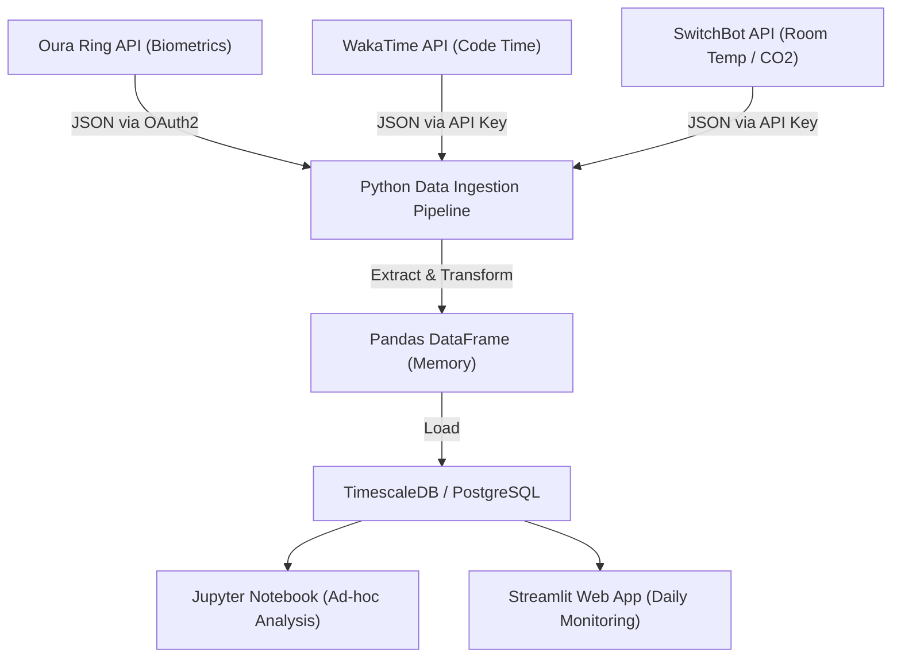
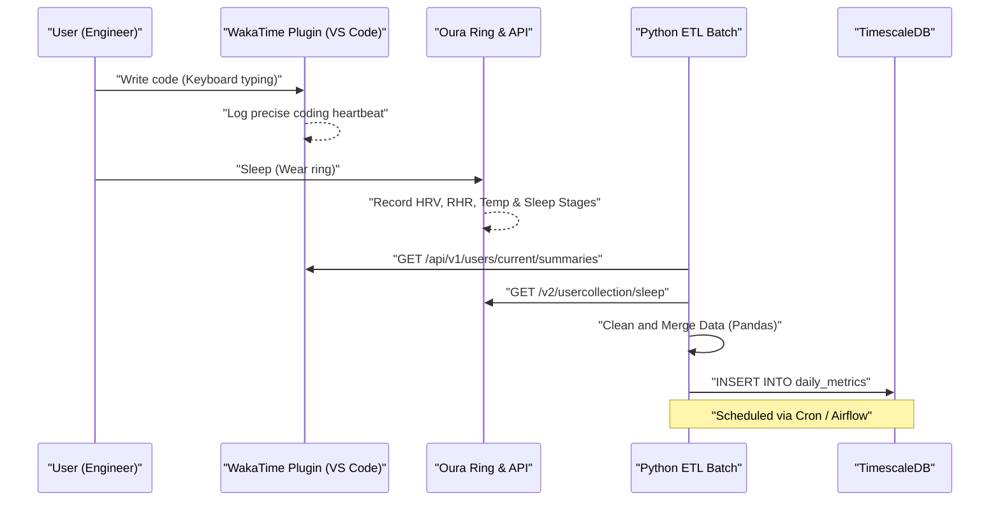
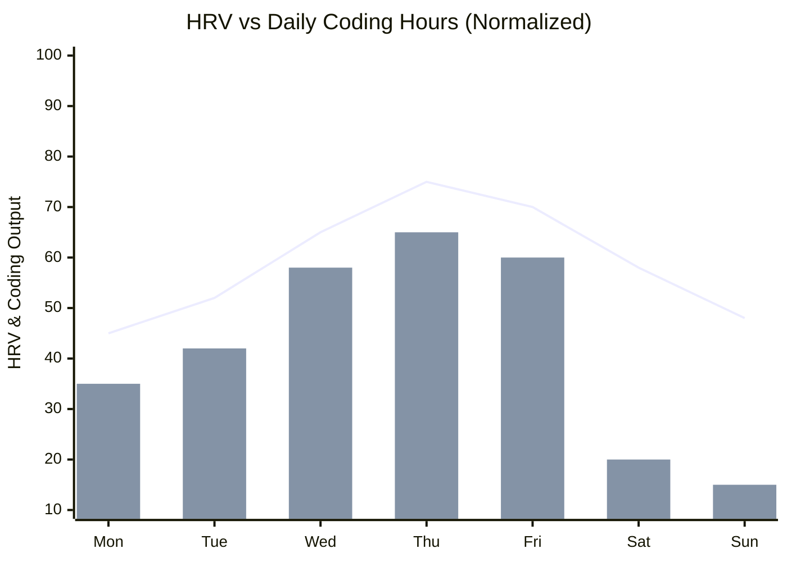

## 1. Introduction: The Intersection of Software Engineering and Biohacking

Modern software engineering is demanding intellectual labor that involves extreme cognitive load and a sedentary lifestyle. Constantly catching up with changing technology stacks, bug hunting in complex distributed systems, and pressure from deadlines. To overcome these, a data-driven approach to tune the hardware that is your own body, like debugging a system, is essential, rather than simply relying on "spirit" or "guts". This is known as "Biohacking".

In the past, we relied on the subjective feeling (heuristics) of "I feel somewhat good/bad today," but nowadays, with the spread of high-performance wearable devices like Oura Ring, Apple Watch, and Garmin, we can acquire biological data non-invasively, 24/7. In this article, I will explain how to acquire biological data (HRV, RHR, sleep architecture) and productivity data (coding metrics from WakaTime, etc.) via APIs, and perform correlation analysis using a data science approach with Python and Pandas. I will also unravel scientific evidence-based health hacks for engineers in extreme detail, such as mathematical models of circadian rhythms and optimal coffee intake timing based on caffeine metabolism half-life.

## 2. You Can't Manage What You Can't Measure: Hardware for Biological Data Acquisition

Sensors (wearable devices) for acquiring biological data each have their own areas of expertise. In data-driven health management, selecting the optimal device according to the purpose is the first step.

### 2.1 Oura Ring (Generation 3 / 4)
Because it acquires data directly from the arteries in the finger, it features extremely high accuracy in measuring heart rate, heart rate variability (HRV), and changes in body surface temperature during sleep, compared to smartwatches measured on the wrist. Capillaries are dense in the fingers, allowing for low-noise data acquisition using optical heart rate sensors (PPG: Photoplethysmography). In addition, it has a comprehensive REST API and raw data in JSON format can be easily exported via OAuth 2.0, making it the most hackable device for engineers.

### 2.2 Apple Watch Series / Ultra
It excels in tracking during activities, and measuring blood oxygen saturation (SpO2) and electrocardiograms (ECG). It is the strongest device for daytime activity tracking and on-demand HRV measurement through mindfulness apps (breathe apps). However, exporting data requires going through HealthKit, and direct access from Python or others requires an intermediate step such as CSV export via an iOS app (like AutoSleep or HealthFit).

### 2.3 Garmin (Fenix / Forerunner)
In addition to the accuracy of GPS tracking, its unique energy remainder indicator called "Body Battery" is excellent. This is calculated based on HRV and stress levels. Garmin data can be acquired through the Garmin Connect API, but due to the barrier of a corporate API, individual developers need to use open-source libraries or scraping tools created by volunteers.

In this article, we will focus on **Oura Ring**, which is the peak of sleep and recovery tracking and extremely easy to extract data from its API, and **WakaTime**, which measures coding time as a plugin for IDEs (such as VS Code and IntelliJ).

## 3. Basic Theory of Biological Data: Data Science of HRV and RHR

Rather than the simple metric of "longer sleep time is better," from a data science perspective, the following two metrics are the master metrics of "Recovery".

### 3.1 HRV (Heart Rate Variability) and Autonomic Nervous System Modeling
The heart does not beat at a constant rhythm like a metronome. For example, even if the heart rate is 60 bpm, the interval between each beat (R-R interval) is constantly fluctuating, such as "0.92 seconds", "1.05 seconds", and "0.98 seconds". The quantified magnitude of this fluctuation is HRV (Heart Rate Variability).

HRV directly reflects the autonomic nervous system, that is, the balance between the "sympathetic nervous system (accelerator)" and the "parasympathetic nervous system (brake)". In states of stress, overwork, or after alcohol consumption, the sympathetic nervous system becomes dominant, heartbeats become more constant, and HRV decreases. Conversely, in a state of sufficient relaxation and recovery, the parasympathetic nervous system (vagus nerve) becomes dominant, and the heartbeat dynamically fluctuates with breathing, leading to high HRV.

There are two approaches to calculating HRV: Time-domain and Frequency-domain. However, **RMSSD (Root Mean Square of Successive Differences)** is the most commonly used in time-domain analysis and is also adopted by Oura Ring and Apple Watch. This calculates the root mean square of successive differences between normal heartbeats (RR intervals).

Strictly expressed mathematically, it is as follows:

$$ RMSSD = \sqrt{\frac{1}{N-1} \sum_{i=1}^{N-1} (RR_{i+1} - RR_i)^2} $$

Here,
- $N$ is the total number of measured heartbeats
- $RR_i$ is the $i$-th RR interval (in milliseconds)

For engineers, if the HRV (RMSSD) upon waking up in the morning is significantly lower than their personal baseline (the moving average of the past few weeks), they can make a data-driven decision: "Today should be a day to avoid high cognitive load architecture design or deploying to the production environment, and instead focus on expanding test codes or writing documentation".

### 3.2 RHR (Resting Heart Rate) and Recovery Signals
RHR is the number of heartbeats per minute when the body is in a state of complete rest (usually during sleep). When the body is allocating energy to internal metabolism or immune responses, such as after drinking alcohol, late-night overeating, or early symptoms of illness (e.g., infections), RHR rises several to over ten bpm above the baseline.

A lower RHR means that the heart muscle can pump more blood with a single beat (higher stroke volume), indicating high aerobic capacity and the degree of recovery from fatigue. Ideally, a "hammock-shaped" curve where the RHR reaches its lowest value in the first half of sleep indicates the highest quality of recovery.

## 4. Detailed Analysis of Sleep Architecture

What determines the brain performance of an engineer is not just the "quantity" but the "quality" of sleep, namely Sleep Architecture. A night's sleep usually repeats a 90 to 110-minute cycle 4 to 5 times.

### 4.1 NREM Sleep Stage 1-2 (Light Sleep)
This is a preparatory stage where brain waves gradually slow down and the body begins to relax. It accounts for about 50% of total sleep. Although its contribution to cognitive recovery is small, it serves as an important bridge to transition to the next deep sleep stage.

### 4.2 NREM Sleep Stage 3 (Deep Sleep / Slow Wave Sleep: SWS)
This is the core time for physical body recovery, where delta waves (low frequency of 0.5-2Hz) appear in brain waves. Growth hormone is secreted in large amounts, and cell repair takes place. It is also essential for strengthening the immune system, directly relating not only to the muscle fatigue recovery of athletes but also to the repair of eye strain and neck/shoulder muscles for engineers. Deep sleep typically concentrates in the first half of the sleep cycle.

### 4.3 REM Sleep (Rapid Eye Movement)
The brain is as active as when awake, but the body's muscles are in a paralyzed state. REM sleep is extremely important for engineers, as it plays the role of organizing the syntax of new programming languages or the concepts of complex algorithms learned during the day in the brain, consolidating them into long-term memory (Memory Consolidation). It enhances neuroplasticity and strengthens creative problem-solving abilities (the inspiration like "suddenly coming up with a bug fix while taking a shower"). REM sleep tends to be longer in the latter half of sleep (early morning).

In other words, "cutting sleep time by forcing oneself to wake up early with an alarm" means locally and significantly cutting REM sleep, which is related to memory consolidation and creativity, and is an act equivalent to a critical bug that severely degrades performance as an engineer.

## 5. Continuous Glucose Monitoring (CGM) and Spike Defense

Recently, the introduction of CGM (Continuous Glucose Monitor) has become essential among biohackers. Representative devices include FreeStyle Libre and Dexcom.
When consuming food (especially carbohydrates and sugar), the glucose concentration in the blood sharply rises (blood sugar spike) and then plunges due to the massive secretion of insulin (crash). At the timing of this "crash", intense drowsiness (Brain Fog) and decreased concentration are triggered. The drowsiness of the "devil's 2 PM" after lunch is likely caused not merely by the biological clock, but by a blood sugar spike due to excessive intake of ramen or white rice.

The blood glucose response curve $G(t)$ can be approximately expressed as a damped oscillation model as the difference between the absorption rate of ingested carbohydrates and the clearance by insulin:

$$ G(t) = G_{base} + \Delta G \cdot e^{-\alpha t} \sin(\beta t) $$

Here,
- $G_{base}$: Fasting blood glucose level (baseline)
- $\Delta G$: Amplitude of blood glucose rise due to meals
- $\alpha$: Damping coefficient based on insulin sensitivity and metabolic rate
- $\beta$: Frequency component of the oscillation
- $t$: Elapsed time after the meal

To maintain engineer performance, it is crucial to minimize the amplitude $\Delta G$. Specifically, hacks like "eating vegetables (dietary fiber) first", "avoiding refined carbohydrates", and "taking a light 15-minute walk after a meal (activating GLUT4 transporters to take glucose into muscles independently of insulin)" are effective.

## 6. Architecture Design: Building a Local Data Pipeline

We will build a local data pipeline to integrate and analyze biological data and productivity data.
The following Mermaid diagram (flowchart) shows the flow from acquiring data from the API to visualizing it on a dashboard.



With this architecture, you can automatically monitor the correlation between your physical condition (input) and coding performance (output) every day.

Let's look at the sequence between systems in more detail.



## 7. Data Ingestion with Python and Pandas

Let's look at the process of actually using a Python script to acquire data from the Oura Ring and WakaTime APIs and integrate it as a Pandas DataFrame. We will build robust code capable of withstanding practical operation.

```python
import requests
import pandas as pd
from datetime import datetime, timedelta
import os

# Environment Variables
OURA_TOKEN = os.getenv("OURA_ACCESS_TOKEN")
WAKATIME_API_KEY = os.getenv("WAKATIME_API_KEY")

def fetch_oura_sleep_data(start_date: str, end_date: str) -> pd.DataFrame:
    """Fetch daily sleep summary from Oura Ring API v2."""
    url = "https://api.ouraring.com/v2/usercollection/sleep"
    params = {"start_date": start_date, "end_date": end_date}
    headers = {"Authorization": f"Bearer {OURA_TOKEN}"}
    
    response = requests.get(url, headers=headers, params=params)
    response.raise_for_status() # Raise exception for 4xx/5xx errors
    data = response.json().get("data", [])
    
    if not data:
        return pd.DataFrame()
        
    df = pd.json_normalize(data)
    # Extract deeply nested values or select essential columns
    df = df[['day', 'score', 'time_in_bed', 'total_sleep_duration', 
             'average_hrv', 'lowest_heart_rate', 
             'deep_sleep_duration', 'rem_sleep_duration']]
             
    # Convert dates to datetime objects and set as index
    df['day'] = pd.to_datetime(df['day'])
    df.set_index('day', inplace=True)
    return df

def fetch_wakatime_data(start_date: str, end_date: str) -> pd.DataFrame:
    """Fetch coding duration summaries from WakaTime API."""
    url = "https://wakatime.com/api/v1/users/current/summaries"
    params = {"start": start_date, "end": end_date, "api_key": WAKATIME_API_KEY}
    
    response = requests.get(url, params=params)
    response.raise_for_status()
    data = response.json().get("data", [])
    
    records = []
    for day_data in data:
        date_str = day_data['range']['date']
        # Extract total seconds spent coding
        total_seconds = day_data['grand_total']['total_seconds']
        records.append({'day': date_str, 'coding_hours': total_seconds / 3600.0})
        
    df = pd.DataFrame(records)
    if not df.empty:
        df['day'] = pd.to_datetime(df['day'])
        df.set_index('day', inplace=True)
    return df

if __name__ == "__main__":
    # Fetch data for the last 60 days
    end = datetime.now().strftime("%Y-%m-%d")
    start = (datetime.now() - timedelta(days=60)).strftime("%Y-%m-%d")
    
    oura_df = fetch_oura_sleep_data(start, end)
    waka_df = fetch_wakatime_data(start, end)
    
    # Merge datasets on 'day' index using inner join
    merged_df = pd.merge(oura_df, waka_df, left_index=True, right_index=True, how='inner')
    
    # Save raw data to CSV/DB
    merged_df.to_csv("health_productivity_raw.csv")
    print(f"Ingested {len(merged_df)} days of data.")
```

## 8. Data Preprocessing and Feature Engineering

It is dangerous to analyze the acquired raw data as is. It is necessary to handle missing values due to forgetting to charge the device and generate meaningful new indicators (Feature Engineering).

```python
def engineer_features(df: pd.DataFrame) -> pd.DataFrame:
    """Apply feature engineering and cleaning to the merged dataframe."""
    df = df.copy()
    
    # 1. Handle missing values (e.g., forward fill)
    df.fillna(method='ffill', inplace=True)
    
    # 2. Calculate Sleep Efficiency
    # Formula: (Total Sleep Time / Time in Bed) * 100
    df['sleep_efficiency_pct'] = (df['total_sleep_duration'] / df['time_in_bed']) * 100
    
    # 3. Calculate Sleep Stage Ratios
    df['rem_ratio'] = df['rem_sleep_duration'] / df['total_sleep_duration']
    df['deep_ratio'] = df['deep_sleep_duration'] / df['total_sleep_duration']
    
    # 4. Calculate 7-day Moving Averages (Rolling Mean) to smooth out daily noise
    df['hrv_7d_ma'] = df['average_hrv'].rolling(window=7).mean()
    df['rhr_7d_ma'] = df['lowest_heart_rate'].rolling(window=7).mean()
    
    # 5. Calculate daily deviation from baseline
    df['hrv_deviation'] = df['average_hrv'] - df['hrv_7d_ma']
    
    # 6. Normalize targets for Machine Learning (Optional)
    from sklearn.preprocessing import MinMaxScaler
    scaler = MinMaxScaler()
    df[['hrv_scaled', 'coding_scaled']] = scaler.fit_transform(df[['average_hrv', 'coding_hours']])
    
    # Drop rows with NaN generated by rolling window
    df.dropna(inplace=True)
    
    return df

processed_df = engineer_features(merged_df)
```

## 9. Correlation Analysis: The Intersection of Productivity and Health Metrics

Based on the preprocessed data, we will analyze the relationship between health metrics and coding productivity. The hypothesis is that "On days with high HRV (when the autonomic nervous system is regulated and recovered), concentration is sustained, coding time is longer, or more complex tasks can be handled".


*(Note: The line chart shows the deviation of HRV from the baseline, and the bar chart shows WakaTime coding hours. A correlation can be seen where coding output is maximized from Wednesday to Friday, when sufficient recovery is achieved)*

We will calculate the correlation coefficient (Pearson's product-moment correlation coefficient $r$) in Pandas and test for statistical significance (p-value) using SciPy.

```python
import scipy.stats as stats

# Select numerical columns for correlation matrix
cols_of_interest = ['average_hrv', 'score', 'deep_sleep_duration', 'rem_sleep_duration', 'coding_hours']
correlation_matrix = processed_df[cols_of_interest].corr()

print("Correlation with Coding Hours:")
print(correlation_matrix['coding_hours'].sort_values(ascending=False))

# Calculate Pearson correlation coefficient and p-value for REM sleep and Coding Hours
r, p_value = stats.pearsonr(processed_df['rem_sleep_duration'], processed_df['coding_hours'])
print(f"REM Sleep vs Coding Hours: r = {r:.3f}, p-value = {p_value:.4f}")
```

In many cases, a significant positive correlation ($p < 0.05$) is observed between `average_hrv` or `rem_sleep_duration` and `coding_hours`. In particular, it is heavily reported in the engineer Quantified Self community that the length of REM sleep the previous night strongly affects "time taken to resolve errors (debugging)" and "productivity" on the day.

## 10. Mathematical Model of Circadian Rhythm and Cognitive Peak Optimization

Humans are equipped with a biological clock called the Circadian Rhythm with a cycle of about 24 hours. This rhythm fluctuates body temperature, hormone secretion (morning cortisol spike and nighttime melatonin secretion), and "cognitive ability".

Fluctuations in circadian rhythm are often approximated by a mathematical model using cosine curves (Cosinor model), and changes in biometric indicators can be formulated as follows:

$$ y(t) = M + A \cos\left(\frac{2\pi}{24}(t - \phi)\right) + e(t) $$

- $y(t)$: Biometric indicator at time $t$ (e.g., core body temperature or alertness)
- $M$: MESOR (Midline Estimating Statistic of Rhythm) - The central value (average level) of the rhythm
- $A$: Amplitude - The magnitude of the fluctuation
- $\phi$: Acrophase - The phase (time) of the peak
- $e(t)$: Error term due to environmental factors, etc.

In engineering, what this equation means is that "the time of day ($\phi$) when performance (alertness) peaks is biologically determined, and the tasks with the highest cognitive load (complex bug fixes, designing new architectures) should be assigned to that time block".

In the case of a typical morning lark chronotype, the first cognitive peak arrives 2 to 4 hours after waking up (for example, 9 AM to 11 AM). After that, the trough of the circadian rhythm (post-lunch dip) arrives around 2 PM, and another small peak comes in the evening. Identifying your peak time ($\phi$) from the activity level or subjective concentration of wearable data, and protecting your schedule like Google Calendar with "time blocking" is the best health hack. Putting a meaningless meeting during peak time is like assigning the highest-performing core of a CPU to an idle process.

## 11. Caffeine Pharmacokinetics and Optimal Intake Timing

Engineers and coffee are inseparable, but excessive caffeine intake or taking it late in the day blocks adenosine receptors in the brain and destroys "Deep Sleep" at night. Subjectively, you may feel like you are sleeping, but looking at Oura Ring data confirms that the heart rate doesn't drop and the percentage of deep sleep drastically decreases.

Caffeine elimination from the body follows first-order kinetics. That is, blood concentration decays exponentially.

$$ C(t) = C_0 e^{-k t} $$

Here,
- $C(t)$: Blood caffeine concentration after time $t$
- $C_0$: Initial concentration (maximum concentration right after intake)
- $k$: Elimination rate constant
- $t$: Elapsed time since intake (hours)

The elimination rate constant $k$ is expressed using the half-life of caffeine ($t_{1/2}$) as follows:

$$ k = \frac{\ln(2)}{t_{1/2}} $$

In the case of a healthy adult, depending on individual genetics (CYP1A2 gene), the half-life of caffeine $t_{1/2}$ is considered to be approximately **5 to 6 hours**.
For example, suppose you drink a cup of drip coffee (about 150 mg of caffeine) at 3 PM ($C_0 = 150$). Assuming a half-life of 5.5 hours, $k \approx 0.126$.
Calculating the residual caffeine concentration in the body at bedtime of 11 PM (8 hours later):

$$ C(8) = 150 \times e^{-0.126 \times 8} = 150 \times e^{-1.008} \approx 150 \times 0.365 = 54.75 \text{ mg} $$

In other words, even when it's time to sleep, 54 mg (a little over one espresso shot) of caffeine still remains in the body, and this directly negatively impacts sleep architecture.
The data-driven conclusion derived from this pharmacokinetic model is that **"To ensure high-quality sleep, caffeine intake should start 90 minutes after waking up (after the cortisol spike settles), and should be completely cut off by 2 PM at the latest (9 to 10 hours before bedtime)."**

## 12. Hacking Environment Variables (Lux, Temperature, CO2)

It is important to optimize not only the internal system of one's own body but also external environment variables.

### 12.1 Programming Light Environment (Lux)
The most powerful "Zeitgeber (time cue)" to reset the circadian rhythm is light. In the morning, about 100,000 Lux of sunlight hitting the retinal photoreceptor cells (ipRGC) stops melatonin secretion and resets the timer. Conversely, at night, it is essential to block blue light and not inhibit melatonin secretion. Rather than just lowering the display color temperature with software like f.lux, it is effective to write a script to control smart lighting (like Philips Hue) via API and automatically lower the room's illuminance and color temperature according to sunset.

### 12.2 Bedroom Temperature Control and Sleep Latency
Humans enter sleep as their core body temperature drops. Keeping the bedroom at a cool 18-19 degrees Celsius (64-66°F) and getting into bed aiming for the timing when the core body temperature, temporarily raised by a warm bath 90 minutes before bedtime, plummets, can drastically shorten sleep latency (the time it takes to fall asleep after getting into bed) and maximize deep sleep.

### 12.3 CO2 Concentration and Cognitive Decline
When adding the API of a SwitchBot Hub or Netatmo weather station to the data pipeline, a clear negative correlation can be seen between indoor carbon dioxide (CO2) concentration and productivity.
As shown by studies from Harvard University and others, when the CO2 concentration exceeds 1,000 ppm, cognitive function (especially strategic decision-making ability) begins to significantly decline, and exceeding 2,000 ppm causes serious performance degradation. Remote work in a closed room during winter lowers performance without you even noticing.

```python
# Pseudo-code for intelligent room ventilation using Home Assistant / SwitchBot API
import requests

def check_and_ventilate():
    # Get current CO2 level from Netatmo/SwitchBot API
    co2_ppm = get_sensor_data("co2_sensor_id")
    
    if co2_ppm > 1000:
        print(f"Warning: CO2 level high ({co2_ppm} ppm). Cognitive decline risk.")
        # Trigger smart plug to turn on ventilation fan
        turn_on_smart_plug("ventilation_fan_id")
        # Send notification to Slack/Discord
        send_notification("Activated ventilation fan. CO2 concentration is high.")
    elif co2_ppm < 600:
        turn_off_smart_plug("ventilation_fan_id")
```
By periodically executing such a script with Cron, an autonomous environment control system that always maintains optimal oxygen concentration is completed.

## 13. Conclusion: CI/CD of the System Called the Human Body

Try viewing your own body as a complex distributed system. Wearable devices (Oura Ring) are metrics exporters for monitoring (Prometheus), Python/Pandas scripts are log analysis pipelines (Logstash/Fluentd), and daily changes in physical condition and performance are the system health displayed on the dashboard (Grafana/Streamlit).

"Working by cutting sleep time" is the same as forcing the addition of features while ignoring technical debt. You might make it for the release in the short term, but in the long term, it will inevitably cause a system down (burnout, serious health damage, depression).

Monitor HRV, check RHR trends, and optimize sleep architecture. Then, finely tune "hyperparameters" such as diet, exercise, sleep, and environment daily, looking at the correlation with WakaTime productivity data. This is exactly the **CI/CD (Continuous Integration / Continuous Delivery)** process for the human body.

Let's engineer a health condition that can perform at its best using data science and APIs. The quality of the code you write is directly linked to the health of your own biological system.

---
*Disclaimer: This article summarizes the author's personal experiments and data science approaches, and does not provide medical advice. If you have continuous poor health or sleep disorders, please consult a specialized medical institution.*
