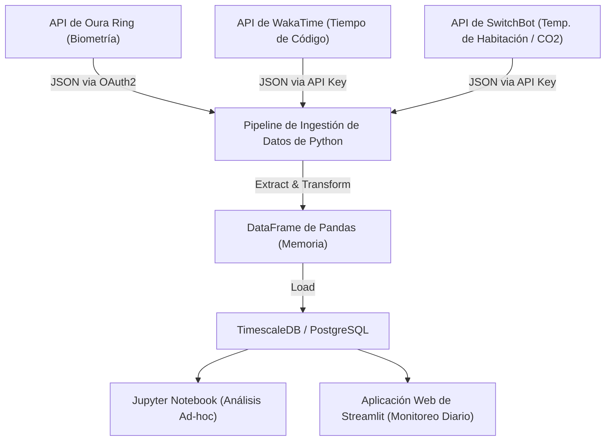
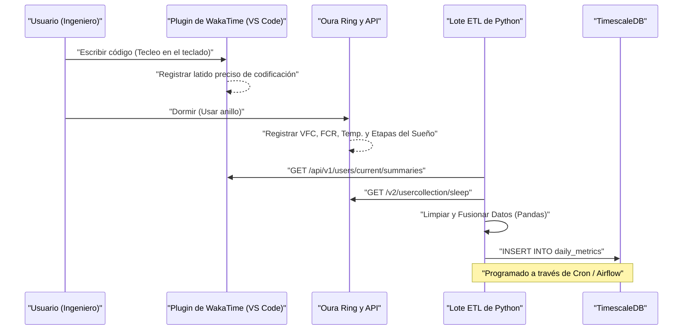
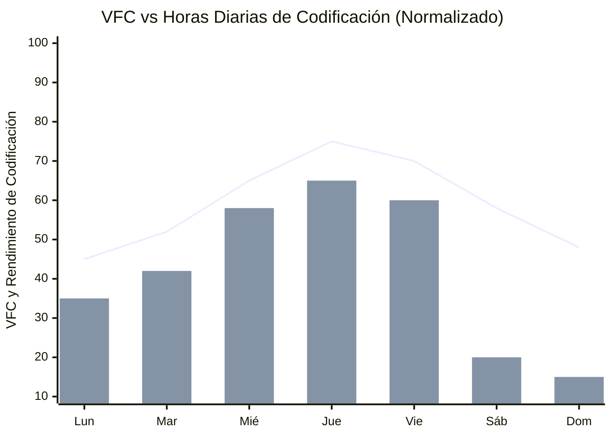

## 1. Introducción: La intersección entre la ingeniería de software y el biohacking

La ingeniería de software moderna es un trabajo intelectual agotador que implica una carga cognitiva extrema y un estilo de vida sedentario (Sedentary Lifestyle). Estar al día con la pila de tecnología en constante cambio, cazar errores en sistemas distribuidos complejos y la presión de las fechas de entrega. Para superar esto, en lugar de depender únicamente del "espíritu" y la "fuerza de voluntad", es indispensable un enfoque de ajuste del hardware que es nuestro propio cuerpo, como si estuviéramos depurando un sistema, es decir, el "Biohacking".

En el pasado, dependíamos de sentimientos subjetivos (heurísticas) como "hoy me siento más o menos bien/mal", pero en la actualidad, con la popularización de dispositivos portátiles de alto rendimiento como Oura Ring, Apple Watch y Garmin, es posible obtener datos biométricos de forma no invasiva las 24 horas del día, los 365 días del año. En este artículo, explicaremos cómo obtener datos biométricos (VFC, FCR y arquitectura del sueño) y datos de productividad (métricas de codificación mediante WakaTime, etc.) a través de una API, y realizar un análisis de correlación con un enfoque de ciencia de datos utilizando Python y Pandas. Además, desentrañaremos con gran detalle hackeos de salud para ingenieros basados en evidencia científica, como el modelo matemático del ritmo circadiano y el momento óptimo para consumir café según la vida media del metabolismo de la cafeína.

## 2. Lo que no se puede medir, no se puede gestionar: Hardware para la adquisición de datos biométricos

Los sensores (dispositivos portátiles) para obtener datos biométricos tienen sus propias áreas de especialidad. En la gestión de la salud basada en datos, el primer paso es seleccionar el dispositivo óptimo según el objetivo.

### 2.1 Oura Ring (Generación 3 / 4)
Al obtener datos directamente desde las arterias del dedo, su precisión para medir la frecuencia cardíaca durante el sueño, la variabilidad de la frecuencia cardíaca (VFC) y los cambios en la temperatura de la superficie corporal es muy alta en comparación con los relojes inteligentes que miden en la muñeca. Los dedos están densamente poblados de capilares, lo que permite la obtención de datos con menos ruido utilizando un sensor óptico de frecuencia cardíaca (PPG: Fotopletismografía). Además, cuenta con una rica API REST que permite exportar fácilmente datos sin procesar en formato JSON a través de OAuth2.0, lo que lo convierte en el dispositivo más hackeable para los ingenieros.

### 2.2 Apple Watch Series / Ultra
Destaca en el seguimiento durante la actividad y en la medición de la saturación de oxígeno en sangre (SpO2) y electrocardiogramas (ECG). Es el mejor dispositivo para medir la VFC bajo demanda a través del volumen de actividad diurna y la aplicación de atención plena (aplicación de respiración). Sin embargo, exportar los datos requiere pasar por HealthKit, por lo que el acceso directo desde Python, etc., necesita un paso intermedio, como la exportación a CSV a través de una aplicación de iOS (como AutoSleep o HealthFit).

### 2.3 Garmin (Fenix / Forerunner)
Además de la precisión de su seguimiento GPS, destaca por su exclusivo indicador de energía restante llamado "Body Battery" (Batería Corporal). Se calcula en base a la VFC y el nivel de estrés. Se puede acceder a los datos de Garmin a través de la API Garmin Connect, pero debido a la barrera de la API corporativa, los desarrolladores individuales deben utilizar bibliotecas de código abierto o herramientas de web scraping creadas por voluntarios.

En este artículo, centraremos la explicación principalmente en los datos del **Oura Ring**, que es supremo en el seguimiento del sueño y la recuperación y cuya extracción de datos de la API es extremadamente fácil, y los datos de **WakaTime**, que mide el tiempo de codificación como un complemento del IDE (VS Code, IntelliJ, etc.).

## 3. Teoría básica de los datos biométricos: Ciencia de datos de la VFC y la FCR

Desde la perspectiva de la ciencia de datos, en lugar de un indicador simple como "dormir más es mejor", los siguientes dos indicadores son las métricas maestras de la "Recuperación (Recovery)".

### 3.1 VFC (Variabilidad de la Frecuencia Cardíaca: Heart Rate Variability) y modelado del sistema nervioso autónomo
El corazón no late con un ritmo constante como un metrónomo. Por ejemplo, incluso si la frecuencia cardíaca es de 60 lpm, el intervalo entre cada latido (intervalo R-R) fluctúa constantemente, como "0.92 segundos", "1.05 segundos", "0.98 segundos". La cuantificación de la magnitud de esta fluctuación es la VFC (Variabilidad de la Frecuencia Cardíaca).

La VFC refleja directamente el equilibrio del sistema nervioso autónomo, es decir, el "sistema nervioso simpático (acelerador)" y el "sistema nervioso parasimpático (freno)". En estados de estrés, exceso de trabajo o después del consumo de alcohol, el sistema nervioso simpático se vuelve dominante, los latidos del corazón se vuelven más constantes y la VFC disminuye. Por el contrario, en un estado de relajación total y recuperación, el sistema nervioso parasimpático (nervio vago) es dominante, y la frecuencia cardíaca fluctúa dinámicamente con la respiración, por lo que la VFC es alta.

Existen dos enfoques para calcular la VFC: el dominio del tiempo (Time-domain) y el dominio de la frecuencia (Frequency-domain). En el análisis del dominio del tiempo, el más comúnmente utilizado y adoptado por Oura Ring y Apple Watch es el **RMSSD (Root Mean Square of Successive Differences, Raíz Cuadrada Media de las Diferencias Sucesivas)**. Esto calcula la raíz cuadrada media de las diferencias al cuadrado de los intervalos de latidos consecutivos (intervalos RR).

Matemáticamente, se expresa estrictamente de la siguiente manera:

$$ RMSSD = \sqrt{\frac{1}{N-1} \sum_{i=1}^{N-1} (RR_{i+1} - RR_i)^2} $$

Donde,
- $N$ es el número total de latidos cardíacos medidos
- $RR_i$ es el $i$-ésimo intervalo RR (milisegundos)

Para un ingeniero, si la VFC (RMSSD) al despertar por la mañana cae significativamente por debajo de su línea base personal (promedio móvil de las últimas semanas), le permite tomar una decisión basada en datos: "Hoy es un día en el que debo evitar el diseño de arquitectura con alta carga cognitiva y los despliegues en el entorno de producción, y dedicarme a ampliar el código de prueba y redactar documentación".

### 3.2 Frecuencia Cardíaca en Reposo (FCR: Resting Heart Rate) y las señales de recuperación
La FCR es la cantidad de latidos por minuto cuando el cuerpo está completamente relajado (generalmente durante el sueño). Cuando el cuerpo está dedicando energía a reacciones inmunológicas o metabólicas internas, como después de consumir alcohol, comer en exceso a altas horas de la noche, o como síntoma inicial de una enfermedad (como una infección), la FCR aumenta de varios a una decena de lpm por encima de la línea base.

Cuanto más baja sea la FCR, significa que el músculo cardíaco puede bombear más sangre en un solo latido (mayor volumen sistólico), lo que indica un alto nivel de capacidad aeróbica y el grado de recuperación de la fatiga. Idealmente, el estado de recuperación de mayor calidad se alcanza cuando la FCR describe una curva en "forma de hamaca", alcanzando su valor más bajo en la primera mitad del sueño.

## 4. Análisis detallado de la arquitectura del sueño

Lo que determina el rendimiento cerebral de un ingeniero no es solo la "cantidad" de sueño, sino su "calidad", es decir, la arquitectura del sueño (Sleep Architecture). Una noche de sueño suele repetir de 4 a 5 ciclos de 90 a 110 minutos.

### 4.1 Sueño NREM Etapas 1-2 (Sueño ligero / Light Sleep)
Es la etapa de preparación donde las ondas cerebrales se ralentizan gradualmente y el cuerpo comienza a relajarse. Ocupa aproximadamente el 50% del sueño total. Aunque su contribución a la recuperación cognitiva es pequeña, es un puente importante para la transición a las siguientes etapas de sueño profundo.

### 4.2 Sueño NREM Etapa 3 (Sueño profundo / Deep Sleep / Slow Wave Sleep: SWS)
Aparecen las ondas delta (baja frecuencia de 0.5 a 2Hz) en el cerebro; es el momento central para la recuperación física del cuerpo. Se segregan grandes cantidades de hormona del crecimiento y se realiza la reparación celular. Es indispensable para fortalecer el sistema inmunológico, y está directamente relacionado no solo con la recuperación de la fatiga muscular en los atletas, sino también con la fatiga ocular y la reparación de los músculos del cuello y los hombros en los ingenieros. El sueño profundo generalmente se concentra en los primeros ciclos del sueño.

### 4.3 Sueño REM (Movimiento Ocular Rápido / Rapid Eye Movement)
El cerebro está tan activo como cuando está despierto, pero los músculos del cuerpo están paralizados. Este sueño REM es extremadamente importante para los ingenieros; es responsable de organizar en el cerebro la sintaxis de un nuevo lenguaje de programación o los conceptos de un algoritmo complejo aprendidos durante el día, y consolidarlos en la memoria a largo plazo (Memory Consolidation). Aumenta la neuroplasticidad (Neuroplasticity), y las habilidades creativas para la resolución de problemas (esa "inspiración repentina para solucionar un error mientras te duchas") también se fortalecen con el sueño REM. El sueño REM tiende a ser más largo en la segunda mitad del sueño (hacia el amanecer).

En otras palabras, "despertarse a la fuerza temprano con una alarma reduciendo el tiempo de sueño" significa reducir drásticamente de forma localizada el sueño REM, que está relacionado con la consolidación de la memoria y la creatividad, lo que equivale a un error grave que reduce significativamente el rendimiento como ingeniero.

## 5. Monitorización Continua de Glucosa (MCG) y defensa contra los picos

Recientemente, la adopción de MCG (Monitores Continuos de Glucosa) se ha vuelto esencial entre los biohackers. Dispositivos representativos incluyen FreeStyle Libre y Dexcom.
Al ingerir alimentos (especialmente carbohidratos y azúcares), la concentración de glucosa en la sangre aumenta drásticamente (pico de glucosa en sangre) y luego cae en picado (choque) debido a la secreción masiva de insulina. En el momento de este "choque", se produce una fuerte somnolencia (Niebla Mental / Brain Fog) y una pérdida de concentración. La somnolencia de la "maldita hora de las 2 de la tarde" después del almuerzo tiene muchas probabilidades de ser causada por un pico de glucosa en sangre debido a la ingesta excesiva de ramen o arroz blanco, y no simplemente por la influencia del reloj biológico.

La curva de respuesta de la glucosa en sangre $G(t)$ se puede expresar aproximadamente como un modelo de oscilación amortiguada de la siguiente manera, como la diferencia entre la tasa de absorción de los carbohidratos ingeridos y la tasa de eliminación de la glucosa por la insulina.

$$ G(t) = G_{base} + \Delta G \cdot e^{-\alpha t} \sin(\beta t) $$

Donde,
- $G_{base}$: Nivel de glucosa en ayunas (línea base)
- $\Delta G$: Amplitud del aumento de la glucosa en sangre debido a las comidas
- $\alpha$: Coeficiente de atenuación basado en la sensibilidad a la insulina y la tasa metabólica
- $\beta$: Componente de frecuencia de la oscilación
- $t$: Tiempo transcurrido después de la comida

Para mantener el rendimiento del ingeniero, es importante mantener la amplitud $\Delta G$ al mínimo. Específicamente, son efectivos hackeos como "comer primero las verduras (fibra dietética)", "evitar los carbohidratos refinados" y "dar un paseo ligero de 15 minutos después de las comidas (activa los transportadores GLUT4 para absorber glucosa en los músculos independientemente de la insulina)".

## 6. Diseño de la arquitectura: Construcción del pipeline de datos local

Construiremos un pipeline de datos local para analizar de forma conjunta los datos biométricos y de productividad.
El siguiente diagrama de Mermaid (diagrama de flujo) muestra el flujo desde la obtención de datos desde las API hasta su visualización en un panel.



Con esta arquitectura, podrás monitorizar automáticamente cada día la correlación entre tu estado de salud (entrada) y el rendimiento de codificación (salida).

Además, veamos detalladamente la secuencia entre los sistemas.



## 7. Ingestión de datos con Python y Pandas

Veamos cómo obtener los datos de las API de Oura Ring y WakaTime usando un script de Python real, y combinarlos en un DataFrame de Pandas. Construiremos un código robusto adecuado para un uso práctico.

```python
import requests
import pandas as pd
from datetime import datetime, timedelta
import os

# Variables de entorno
OURA_TOKEN = os.getenv("OURA_ACCESS_TOKEN")
WAKATIME_API_KEY = os.getenv("WAKATIME_API_KEY")

def fetch_oura_sleep_data(start_date: str, end_date: str) -> pd.DataFrame:
    """Obtener resumen de sueño diario de la API v2 de Oura Ring."""
    url = "https://api.ouraring.com/v2/usercollection/sleep"
    params = {"start_date": start_date, "end_date": end_date}
    headers = {"Authorization": f"Bearer {OURA_TOKEN}"}
    
    response = requests.get(url, headers=headers, params=params)
    response.raise_for_status() # Generar excepción por errores 4xx/5xx
    data = response.json().get("data", [])
    
    if not data:
        return pd.DataFrame()
        
    df = pd.json_normalize(data)
    # Extraer valores profundamente anidados o seleccionar columnas esenciales
    df = df[['day', 'score', 'time_in_bed', 'total_sleep_duration', 
             'average_hrv', 'lowest_heart_rate', 
             'deep_sleep_duration', 'rem_sleep_duration']]
             
    # Convertir fechas a objetos datetime y establecer como índice
    df['day'] = pd.to_datetime(df['day'])
    df.set_index('day', inplace=True)
    return df

def fetch_wakatime_data(start_date: str, end_date: str) -> pd.DataFrame:
    """Obtener resúmenes de duración de codificación de la API de WakaTime."""
    url = "https://wakatime.com/api/v1/users/current/summaries"
    params = {"start": start_date, "end": end_date, "api_key": WAKATIME_API_KEY}
    
    response = requests.get(url, params=params)
    response.raise_for_status()
    data = response.json().get("data", [])
    
    records = []
    for day_data in data:
        date_str = day_data['range']['date']
        # Extraer total de segundos de codificación
        total_seconds = day_data['grand_total']['total_seconds']
        records.append({'day': date_str, 'coding_hours': total_seconds / 3600.0})
        
    df = pd.DataFrame(records)
    if not df.empty:
        df['day'] = pd.to_datetime(df['day'])
        df.set_index('day', inplace=True)
    return df

if __name__ == "__main__":
    # Obtener datos de los últimos 60 días
    end = datetime.now().strftime("%Y-%m-%d")
    start = (datetime.now() - timedelta(days=60)).strftime("%Y-%m-%d")
    
    oura_df = fetch_oura_sleep_data(start, end)
    waka_df = fetch_wakatime_data(start, end)
    
    # Fusionar conjuntos de datos en el índice 'day' usando inner join
    merged_df = pd.merge(oura_df, waka_df, left_index=True, right_index=True, how='inner')
    
    # Guardar datos sin procesar en CSV/DB
    merged_df.to_csv("health_productivity_raw.csv")
    print(f"Ingeridos {len(merged_df)} días de datos.")
```

## 8. Preprocesamiento de datos e ingeniería de características

Es peligroso introducir datos sin procesar directamente en el análisis. Es necesario procesar los valores faltantes (Missing Values) debido a descuidos al cargar dispositivos, o generar nuevos indicadores significativos (Ingeniería de Características: Feature Engineering).

```python
def engineer_features(df: pd.DataFrame) -> pd.DataFrame:
    """Aplicar ingeniería de características y limpieza al dataframe fusionado."""
    df = df.copy()
    
    # 1. Manejar valores faltantes (ej. forward fill)
    df.fillna(method='ffill', inplace=True)
    
    # 2. Calcular Eficiencia del Sueño
    # Fórmula: (Tiempo Total de Sueño / Tiempo en la Cama) * 100
    df['sleep_efficiency_pct'] = (df['total_sleep_duration'] / df['time_in_bed']) * 100
    
    # 3. Calcular Proporciones de Etapas del Sueño
    df['rem_ratio'] = df['rem_sleep_duration'] / df['total_sleep_duration']
    df['deep_ratio'] = df['deep_sleep_duration'] / df['total_sleep_duration']
    
    # 4. Calcular Promedios Móviles de 7 días para suavizar el ruido diario
    df['hrv_7d_ma'] = df['average_hrv'].rolling(window=7).mean()
    df['rhr_7d_ma'] = df['lowest_heart_rate'].rolling(window=7).mean()
    
    # 5. Calcular desviación diaria de la línea base
    df['hrv_deviation'] = df['average_hrv'] - df['hrv_7d_ma']
    
    # 6. Normalizar objetivos para Machine Learning (Opcional)
    from sklearn.preprocessing import MinMaxScaler
    scaler = MinMaxScaler()
    df[['hrv_scaled', 'coding_scaled']] = scaler.fit_transform(df[['average_hrv', 'coding_hours']])
    
    # Eliminar filas con NaN generadas por la ventana móvil
    df.dropna(inplace=True)
    
    return df

processed_df = engineer_features(merged_df)
```

## 9. Análisis de correlación: La intersección entre la productividad y las métricas de salud

A partir de los datos preprocesados, analizamos la relación entre los indicadores de salud y la productividad en la codificación. Como hipótesis, se puede pensar que "los días con una VFC más alta (el sistema nervioso autónomo está en orden y recuperado), se mantiene la concentración y el tiempo de codificación es mayor, o se pueden realizar tareas más complejas".


*(Nota: El gráfico de líneas muestra la desviación de la VFC desde su línea base normalizada, y el gráfico de barras muestra el tiempo de codificación en WakaTime. Se puede observar una correlación donde el rendimiento de codificación se maximiza desde el miércoles hasta el viernes, una vez que se ha obtenido suficiente recuperación)*

Realizamos el cálculo del coeficiente de correlación (coeficiente de correlación producto-momento de Pearson $r$) en Pandas, y una prueba de significación estadística (valor p) utilizando SciPy.

```python
import scipy.stats as stats

# Seleccionar columnas numéricas para la matriz de correlación
cols_of_interest = ['average_hrv', 'score', 'deep_sleep_duration', 'rem_sleep_duration', 'coding_hours']
correlation_matrix = processed_df[cols_of_interest].corr()

print("Correlación con Horas de Codificación:")
print(correlation_matrix['coding_hours'].sort_values(ascending=False))

# Calcular coeficiente de correlación de Pearson y valor p para Sueño REM y Horas de Codificación
r, p_value = stats.pearsonr(processed_df['rem_sleep_duration'], processed_df['coding_hours'])
print(f"Sueño REM vs Horas de Codificación: r = {r:.3f}, valor p = {p_value:.4f}")
```

En muchos casos, se observa una correlación positiva significativa ($p < 0.05$) entre `average_hrv` o `rem_sleep_duration` y `coding_hours`. En particular, se ha informado ampliamente en la comunidad de autoseguimiento (Quantified Self) de ingenieros que la duración del sueño REM de la noche anterior influye fuertemente en el "tiempo que se tarda en resolver errores (depuración)" y la "productividad" del día.

## 10. Modelo matemático del ritmo circadiano y optimización del pico cognitivo

Los humanos poseemos un reloj biológico con un ciclo de aproximadamente 24 horas, llamado ritmo circadiano (Circadian Rhythm). Este ritmo provoca fluctuaciones en la temperatura corporal, la secreción de hormonas (pico matutino de cortisol y secreción nocturna de melatonina), y la "capacidad cognitiva".

Las fluctuaciones del ritmo circadiano a menudo se aproximan y representan mediante un modelo matemático que utiliza curvas cosenoidales (modelo Cosinor), y los cambios en los indicadores biométricos pueden formularse de la siguiente manera:

$$ y(t) = M + A \cos\left(\frac{2\pi}{24}(t - \phi)\right) + e(t) $$

- $y(t)$: Indicador biométrico (ej. temperatura corporal central o nivel de alerta) en el tiempo $t$
- $M$: MESOR (Estadística de Estimación de la Línea Media del Ritmo) - Valor central del ritmo (nivel medio)
- $A$: Amplitud (Amplitude) - Magnitud de la fluctuación
- $\phi$: Acrofase (Acrophase) - Fase (hora) en la que se alcanza el pico
- $e(t)$: Término de error debido a factores ambientales, etc.

Lo que significa esta ecuación en la ingeniería es que "la franja horaria ($\phi$) en la que el rendimiento (estado de alerta) alcanza su pico en un día está determinada biológicamente, y las tareas con la mayor carga cognitiva (corrección de errores complejos, diseño de nueva arquitectura) deben asignarse en ese periodo de tiempo".

En el caso del cronotipo matutino general (Morning Lark), el primer pico cognitivo se alcanza entre 2 y 4 horas después de despertarse (por ejemplo, entre las 9 y las 11 de la mañana). Posteriormente, un valle del ritmo circadiano (depresión post-almuerzo / Post-lunch dip) ocurre alrededor de las 2 de la tarde, y otro pequeño pico llega por la tarde-noche. El mejor hackeo de salud es identificar tu tiempo pico ($\phi$) a partir del volumen de actividad de los datos portátiles y tu nivel de concentración subjetiva, y protegerlo usando "bloqueo de tiempo" (Time Blocking) en herramientas como Google Calendar. Programar reuniones sin sentido durante tu pico de tiempo es como asignar el núcleo de la CPU de mayor rendimiento a un proceso inactivo.

## 11. Farmacocinética de la cafeína y el momento óptimo de ingesta

Los ingenieros y el café tienen una relación inseparable, pero el consumo excesivo de cafeína o su ingesta a horas tardías bloquea los receptores de adenosina en el cerebro y destruye el "sueño profundo (Deep Sleep)" nocturno. Aunque subjetivamente sientas que has dormido, al observar los datos del Oura Ring, puedes confirmar que la frecuencia cardíaca no disminuyó y el porcentaje de sueño profundo cayó drásticamente.

La eliminación de la cafeína del cuerpo sigue una cinética de primer orden (First-order kinetics). Es decir, la concentración en sangre disminuye exponencialmente.

$$ C(t) = C_0 e^{-k t} $$

Donde,
- $C(t)$: Concentración de cafeína en la sangre tras transcurrir un tiempo $t$
- $C_0$: Concentración inicial (concentración máxima inmediatamente después de la ingesta)
- $k$: Constante de tasa de eliminación
- $t$: Tiempo transcurrido desde la ingesta (horas)

La constante de tasa de eliminación $k$ se puede expresar utilizando la vida media de la cafeína ($t_{1/2}$) de la siguiente manera:

$$ k = \frac{\ln(2)}{t_{1/2}} $$

Para un adulto sano, aunque depende de los genes individuales (gen CYP1A2), se considera que la vida media de la cafeína $t_{1/2}$ es de aproximadamente **5 a 6 horas**.
Por ejemplo, si se bebe una taza de café de filtro (unos 150 mg de cafeína) a las 3 de la tarde ($C_0 = 150$). Asumiendo una vida media de 5.5 horas, $k \approx 0.126$.
Al calcular la concentración de cafeína restante en el cuerpo a la hora de acostarse a las 11 de la noche (8 horas después):

$$ C(8) = 150 \times e^{-0.126 \times 8} = 150 \times e^{-1.008} \approx 150 \times 0.365 = 54.75 \text{ mg} $$

En otras palabras, a la hora de dormir, aún quedan 54 mg de cafeína (algo más de un trago de espresso) en el cuerpo, lo que afecta directamente y negativamente a la arquitectura del sueño.
La conclusión basada en datos derivada de este modelo farmacocinético es que, **"para asegurar un sueño de alta calidad, la ingesta de cafeína debe comenzar a partir de los 90 minutos después de despertarse (una vez que el pico de cortisol se haya calmado), y debe suspenderse por completo a las 2 p.m. a más tardar (de 9 a 10 horas antes de acostarse)"**.

## 12. Hackeo de variables de entorno (Lux, Temperatura, CO2)

Es importante no solo optimizar el sistema interno que es tu propio cuerpo, sino también las variables de entorno externas (Environment Variables).

### 12.1 Programación del entorno luminoso (Lux)
El "Zeitgeber (Pista para señalar la hora)" más poderoso que resetea el ritmo circadiano es la luz. Por la mañana, al entrar aproximadamente 100,000 Lux de luz solar a las células fotorreceptoras (ipRGC) de la retina, se detiene la secreción de melatonina y el temporizador se reinicia. A la inversa, por la noche es esencial bloquear la luz azul para no inhibir la secreción de melatonina. Es efectivo no solo bajar la temperatura de color de la pantalla con software como f.lux, sino también crear un script que controle la iluminación inteligente (como Philips Hue) mediante una API para reducir automáticamente la iluminancia y la temperatura de color de la habitación con la puesta de sol.

### 12.2 Control de temperatura del dormitorio y latencia de inicio del sueño (Sleep Latency)
Los seres humanos entran en el estado de sueño a medida que su temperatura corporal central (Core Body Temperature) disminuye. Manteniendo la temperatura del dormitorio fresca entre 18 y 19 grados, y dirigiéndote a la cama exactamente cuando la temperatura corporal central, elevada temporalmente por un baño caliente 90 minutos antes de acostarte, comienza a caer drásticamente, puedes acortar drásticamente la latencia del sueño (Sleep Latency: tiempo que tardas en conciliar el sueño desde que te metes en la cama) y maximizar el sueño profundo.

### 12.3 Concentración de CO2 y disminución de la función cognitiva
Si añades los datos de las API del SwitchBot Hub o de la estación meteorológica Netatmo a tu pipeline de datos, podrás observar una clara correlación negativa entre la concentración de dióxido de carbono (CO2) en la habitación y la productividad.
Como han demostrado investigaciones como las de la Universidad de Harvard, cuando la concentración de CO2 supera los 1000 ppm, la función cognitiva (especialmente la capacidad de tomar decisiones estratégicas) comienza a disminuir significativamente, y superando los 2000 ppm causa una grave caída del rendimiento. Trabajar a distancia en una habitación cerrada durante el invierno reduce el rendimiento sin que te des cuenta.

```python
# Pseudo-código para ventilación inteligente de habitaciones usando Home Assistant / API de SwitchBot
import requests

def check_and_ventilate():
    # Obtener el nivel actual de CO2 desde la API de Netatmo/SwitchBot
    co2_ppm = get_sensor_data("co2_sensor_id")
    
    if co2_ppm > 1000:
        print(f"Advertencia: Nivel alto de CO2 ({co2_ppm} ppm). Riesgo de deterioro cognitivo.")
        # Activar enchufe inteligente para encender el ventilador de ventilación
        turn_on_smart_plug("ventilation_fan_id")
        # Enviar notificación a Slack/Discord
        send_notification("He activado el ventilador de ventilación. El nivel de CO2 es alto.")
    elif co2_ppm < 600:
        turn_off_smart_plug("ventilation_fan_id")
```
Al ejecutar periódicamente un script de este tipo mediante Cron, se completa un sistema de control de entorno autónomo que mantiene siempre la concentración de oxígeno óptima.

## 13. Conclusión: CI/CD del sistema que es el cuerpo humano

Intenta considerar tu propio cuerpo como un único sistema distribuido complejo. El dispositivo portátil (Oura Ring) es el exportador de métricas (Prometheus) para la monitorización, el script de Python/Pandas es el pipeline de análisis de registros (Logstash/Fluentd), y los cambios diarios en la condición física y el rendimiento son la salud del sistema mostrada en el panel de control (Grafana/Streamlit).

"Reducir las horas de sueño para trabajar" equivale a forzar la adición de nuevas funcionalidades ignorando la deuda técnica (Technical Debt). A corto plazo, puedes llegar a tiempo para el lanzamiento, pero a largo plazo definitivamente provocará una caída del sistema (Burnout o síndrome de agotamiento, daños graves a la salud o depresión).

Monitorea la VFC, revisa las tendencias de la FCR, y optimiza la arquitectura de tu sueño. Luego, mientras observas la correlación con los datos de productividad en WakaTime, ajusta finamente los "hiperparámetros" diarios de dieta, ejercicio, sueño y entorno. Esto no es otra cosa que un proceso de **CI/CD (Integración Continua / Entrega Continua)** para el cuerpo humano.

Aprovechando la ciencia de datos y las API, diseñemos las condiciones de salud óptimas para lograr el máximo rendimiento. Porque la calidad del código que escribes está directamente ligada a la salud de tu propio sistema biológico.

---
*Aviso legal: Este artículo resume los experimentos personales y el enfoque de ciencia de datos del autor, y no tiene como objetivo proporcionar asesoramiento médico. Si experimenta problemas de salud persistentes o trastornos del sueño, consulte a una institución médica especializada.*
