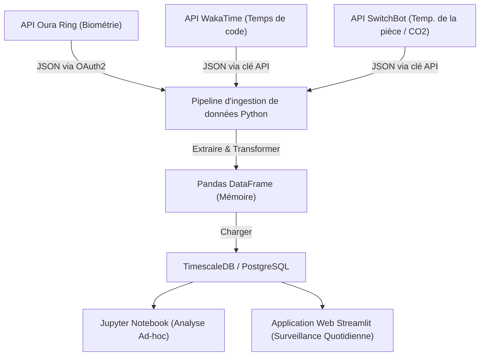
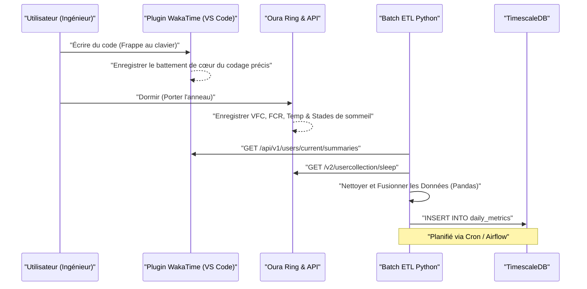
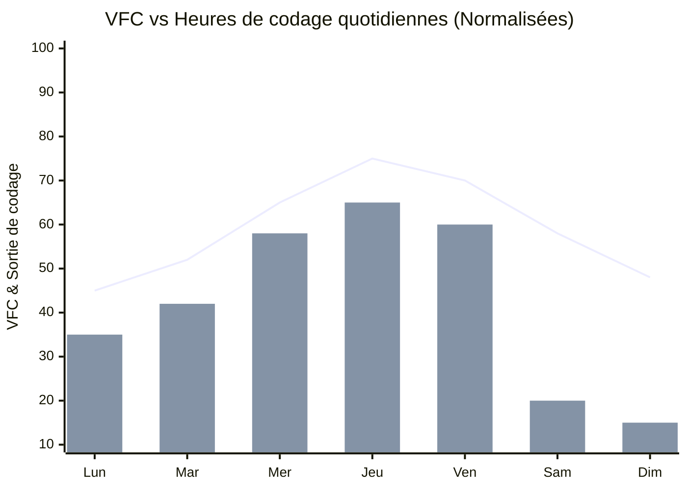

## 1. Introduction : L'intersection entre l'ingénierie logicielle et le biohacking

L'ingénierie logicielle moderne est un travail intellectuel exigeant qui implique une charge cognitive extrême et un mode de vie sédentaire (Sedentary Lifestyle). Rattraper constamment les piles technologiques en évolution, chasser les bugs dans des systèmes distribués complexes et la pression des délais. Pour surmonter tout cela, au lieu de compter simplement sur la "volonté" ou le "courage", une approche consistant à ajuster son propre corps, c'est-à-dire le matériel, comme si on déboguait un système — en d'autres termes, le "Biohacking" — est indispensable.

Autrefois, nous nous fiions à des sensations subjectives (heuristiques) du type "Aujourd'hui, je me sens plutôt bien ou mal", mais aujourd'hui, avec la popularisation de dispositifs portables performants tels que l'Oura Ring, l'Apple Watch ou Garmin, il est devenu possible d'obtenir des données biométriques 24 heures sur 24, 365 jours par an, de manière non invasive. Dans cet article, nous expliquerons comment récupérer les données biométriques (VFC, FCR, architecture du sommeil) et les données de productivité (métriques de codage via WakaTime, etc.) via des API, et effectuer une analyse de corrélation avec une approche de science des données en utilisant Python et Pandas. De plus, nous décortiquerons en détail les hacks de santé pour ingénieurs basés sur des preuves scientifiques, comme un modèle mathématique du rythme circadien et le moment optimal pour consommer du café en fonction de la demi-vie métabolique de la caféine.

## 2. On ne peut pas gérer ce qu'on ne peut pas mesurer : Matériel de collecte de données biométriques

Les capteurs (appareils portables) pour collecter les données biométriques ont chacun leurs domaines de spécialité. Dans la gestion de la santé axée sur les données, la première étape consiste à sélectionner l'appareil optimal en fonction de l'objectif.

### 2.1 Oura Ring (Generation 3 / 4)
Puisqu'il récupère les données directement depuis l'artère du doigt, par rapport aux montres connectées qui mesurent au poignet, il se caractérise par une précision extrêmement élevée de mesure de la fréquence cardiaque pendant le sommeil, de la variabilité de la fréquence cardiaque (VFC) et des changements de température corporelle en surface. Les capillaires sanguins sont denses dans les doigts, ce qui permet d'obtenir des données peu bruitées grâce à un capteur de fréquence cardiaque optique (PPG : Photoplethysmography). De plus, l'API REST est bien fournie et il est facile d'exporter des données brutes au format JSON via OAuth2.0, ce qui en fait l'appareil le plus bidouillable pour un ingénieur.

### 2.2 Apple Watch Series / Ultra
Elle excelle dans le suivi pendant l'activité, et dans la mesure de la saturation en oxygène dans le sang (SpO2) et des électrocardiogrammes (ECG). C'est l'appareil ultime pour mesurer le volume d'activité en journée et la VFC à la demande via des applications de pleine conscience (applications de respiration). Cependant, l'exportation des données nécessite de passer par HealthKit, et un accès direct depuis Python ou autre nécessitera une étape intermédiaire, comme l'exportation CSV via une application iOS (telle qu'AutoSleep ou HealthFit).

### 2.3 Garmin (Fenix / Forerunner)
En plus de la précision du suivi GPS, son indicateur unique d'énergie restante appelé "Body Battery" est excellent. Celui-ci est calculé sur la base de la VFC et du niveau de stress. Chez Garmin, on peut obtenir des données via l'API Garmin Connect, mais à cause de la barrière de l'API pour les entreprises, en tant que développeur individuel, il faut utiliser des bibliothèques open source ou des outils de web scraping créés par des bénévoles.

Dans cet article, nous concentrerons nos explications sur les données de l'**Oura Ring**, qui est le summum en matière de suivi du sommeil et de la récupération, et dont l'extraction de données via l'API est extrêmement facile, ainsi que sur les données de **WakaTime**, un plugin d'IDE (tel que VS Code ou IntelliJ) qui mesure le temps de codage.

## 3. Théorie de base des données biométriques : Science des données de la VFC et de la FCR

Plutôt qu'un simple indicateur tel que "c'est bien parce que le temps de sommeil est long", du point de vue de la science des données, les deux indicateurs suivants deviennent les métriques maîtresses de la "Récupération (Recovery)".

### 3.1 VFC (Variabilité de la Fréquence Cardiaque : Heart Rate Variability) et modélisation du système nerveux autonome
Le cœur ne bat pas à un rythme constant comme un métronome. Par exemple, même si la fréquence cardiaque est de 60 bpm, l'intervalle entre chaque battement (intervalle R-R) fluctue constamment, comme "0,92 seconde", "1,05 seconde", "0,98 seconde". Cette ampleur de fluctuation quantifiée est la VFC (variabilité de la fréquence cardiaque).

La VFC reflète directement l'équilibre du système nerveux autonome, c'est-à-dire le système "sympathique (accélérateur)" et le système "parasympathique (frein)". En cas de stress, de surmenage, ou après la consommation d'alcool, le système nerveux sympathique devient dominant, les battements du cœur se rapprochent de la constance et la VFC diminue. Inversement, dans un état suffisamment détendu et en cours de récupération, le système nerveux parasympathique (nerf vague) devient dominant, et le cœur fluctue de manière dynamique avec la respiration, ce qui augmente la VFC.

Il existe deux approches pour calculer la VFC : le domaine temporel (Time-domain) et le domaine fréquentiel (Frequency-domain). Dans l'analyse du domaine temporel, la méthode la plus couramment utilisée, adoptée par l'Oura Ring et l'Apple Watch, est le **RMSSD (Root Mean Square of Successive Differences)**. Il calcule la moyenne quadratique des différences successives entre les intervalles de battement cardiaque consécutifs (intervalles RR).

Exprimé strictement par une formule mathématique, cela donne :

$$ RMSSD = \sqrt{\frac{1}{N-1} \sum_{i=1}^{N-1} (RR_{i+1} - RR_i)^2} $$

Où,
- $N$ est le nombre total de battements cardiaques mesurés
- $RR_i$ est le $i$-ème intervalle RR (en millisecondes)

Pour un ingénieur, si la VFC (RMSSD) au réveil le matin est significativement inférieure à sa ligne de base personnelle (moyenne mobile des dernières semaines), il est possible de prendre une décision basée sur les données : "Aujourd'hui est un jour où je devrais éviter les conceptions d'architecture à forte charge cognitive ou les déploiements en environnement de production, et me consacrer plutôt à l'enrichissement du code de test et à la rédaction de documentation."

### 3.2 Fréquence Cardiaque au Repos (FCR : Resting Heart Rate) et signaux de récupération
La FCR est le nombre de battements de cœur par minute lorsque le corps est dans un état de relaxation complète (généralement pendant le sommeil). Après la consommation d'alcool, une suralimentation tardive, ou en tant que premier symptôme d'une maladie (comme une infection), lorsque le corps alloue de l'énergie à son métabolisme interne ou à des réactions immunitaires, la FCR augmente de quelques bpm à plus d'une dizaine de bpm par rapport à la ligne de base.

Plus la FCR est basse, plus cela signifie que le muscle cardiaque peut pomper beaucoup de sang à chaque battement (volume d'éjection systolique important), ce qui indique une grande capacité aérobie et le degré de récupération de la fatigue. Idéalement, une courbe en forme de "hamac" où la FCR atteint sa valeur minimale pendant la première moitié du sommeil est l'état dans lequel s'effectue la récupération de la meilleure qualité.

## 4. Analyse détaillée de l'architecture du sommeil

Ce qui détermine les performances du cerveau d'un ingénieur, ce n'est pas seulement la "quantité" de sommeil, mais sa "qualité", c'est-à-dire l'architecture du sommeil (Sleep Architecture). Une nuit de sommeil répète généralement 4 à 5 fois un cycle de 90 à 110 minutes.

### 4.1 Sommeil NREM Stades 1 à 2 (Sommeil léger / Light Sleep)
C'est la phase de préparation où les ondes cérébrales ralentissent progressivement et où le corps commence à se détendre. Il représente environ 50 % de l'ensemble du sommeil. Bien que sa contribution à la récupération cognitive soit faible, il sert de pont important pour passer au stade suivant de sommeil profond.

### 4.2 Sommeil NREM Stade 3 (Sommeil profond / Deep Sleep / Slow Wave Sleep : SWS)
L'apparition d'ondes delta (basses fréquences de 0,5 à 2 Hz) sur l'électroencéphalogramme caractérise cette période qui est le cœur de la récupération physique et corporelle. Une grande quantité d'hormone de croissance est sécrétée et la réparation cellulaire a lieu. C'est également essentiel pour renforcer le système immunitaire, et cela est directement lié non seulement à la récupération de la fatigue musculaire des athlètes, mais aussi à la fatigue oculaire et à la réparation des muscles du cou et des épaules des ingénieurs. Le sommeil profond est généralement concentré dans les cycles de la première moitié du sommeil.

### 4.3 Sommeil REM (Rapid Eye Movement)
Le cerveau est aussi actif que pendant l'éveil, mais les muscles du corps sont paralysés. Ce sommeil REM est extrêmement important pour les ingénieurs ; il a pour rôle d'organiser dans le cerveau la syntaxe des nouveaux langages de programmation ou les concepts des algorithmes complexes appris pendant la journée, et de les fixer sous forme de mémoire à long terme (Memory Consolidation). Il augmente la neuroplasticité (Neuroplasticity), et la capacité de résolution créative de problèmes (comme l'inspiration soudaine d'une solution à un bug en prenant une douche) est également renforcée par le sommeil REM. Le sommeil REM a tendance à s'allonger dans la seconde moitié du sommeil (vers l'aube).

En d'autres termes, "se forcer à se réveiller tôt avec une alarme et réduire son temps de sommeil" signifie réduire de manière drastique et localisée le sommeil REM impliqué dans la consolidation de la mémoire et la créativité, ce qui équivaut à un bug majeur dégradant considérablement les performances en tant qu'ingénieur.

## 5. Mesure continue du glucose (CGM) et défense contre les pics

Ces dernières années, l'introduction d'un CGM (Continuous Glucose Monitor : lecteur de glycémie en continu) est devenue incontournable parmi les biohackers. Les dispositifs représentatifs incluent FreeStyle Libre et Dexcom.
Lorsqu'on consomme de la nourriture (en particulier des glucides ou des sucres), la concentration de glucose dans le sang augmente rapidement (pic de glycémie), puis chute brutalement (crash) à cause d'une sécrétion massive d'insuline. C'est lors de ce "crash" qu'une somnolence intense (Brain Fog) et une baisse de concentration sont provoquées. La somnolence de la "démoniaque 14 heures" après le déjeuner n'est probablement pas seulement l'effet de l'horloge biologique, mais a de fortes chances d'être causée par un pic de glycémie dû à une consommation excessive de ramen ou de riz blanc.

La courbe de réponse de la glycémie $G(t)$ peut être représentée de manière approximative comme un modèle d'oscillation amortie, traduisant la différence entre la vitesse d'absorption des glucides ingérés et la clairance par l'insuline, comme suit :

$$ G(t) = G_{base} + \Delta G \cdot e^{-\alpha t} \sin(\beta t) $$

Où,
- $G_{base}$ : Glycémie à jeun (ligne de base)
- $\Delta G$ : Amplitude de l'augmentation de la glycémie due au repas
- $\alpha$ : Coefficient d'atténuation basé sur la sensibilité à l'insuline et le taux métabolique
- $\beta$ : Composante fréquentielle de l'oscillation
- $t$ : Temps écoulé après le repas

Pour maintenir les performances d'un ingénieur, il est important de minimiser l'amplitude $\Delta G$. Concrètement, des hacks comme "manger d'abord les légumes (fibres alimentaires)", "éviter les glucides raffinés", et "faire une légère promenade de 15 minutes après le repas (pour activer les transporteurs GLUT4 et absorber le glucose dans les muscles indépendamment de l'insuline)" sont efficaces.

## 6. Conception de l'architecture : Construction d'un pipeline de données local

Nous allons construire un pipeline de données local pour analyser conjointement les données biométriques et les données de productivité.
Le diagramme Mermaid suivant (organigramme) montre le flux depuis la récupération des données via l'API jusqu'à leur visualisation sur un tableau de bord.



Grâce à cette architecture, on pourra surveiller automatiquement et quotidiennement la corrélation entre sa propre condition physique (input) et ses performances de codage (output).

De plus, examinons en détail la séquence entre les systèmes.



## 7. Ingestion de données avec Python et Pandas

Regardons comment récupérer les données depuis les API Oura Ring et WakaTime en utilisant un script Python, et comment les intégrer en tant que DataFrame Pandas. Nous construirons un code robuste capable de supporter une utilisation en production.

```python
import requests
import pandas as pd
from datetime import datetime, timedelta
import os

# Environment Variables
OURA_TOKEN = os.getenv("OURA_ACCESS_TOKEN")
WAKATIME_API_KEY = os.getenv("WAKATIME_API_KEY")

def fetch_oura_sleep_data(start_date: str, end_date: str) -> pd.DataFrame:
    """Fetch daily sleep summary from Oura Ring API v2."""
    url = "https://api.ouraring.com/v2/usercollection/sleep"
    params = {"start_date": start_date, "end_date": end_date}
    headers = {"Authorization": f"Bearer {OURA_TOKEN}"}
    
    response = requests.get(url, headers=headers, params=params)
    response.raise_for_status() # Raise exception for 4xx/5xx errors
    data = response.json().get("data", [])
    
    if not data:
        return pd.DataFrame()
        
    df = pd.json_normalize(data)
    # Extract deeply nested values or select essential columns
    df = df[['day', 'score', 'time_in_bed', 'total_sleep_duration', 
             'average_hrv', 'lowest_heart_rate', 
             'deep_sleep_duration', 'rem_sleep_duration']]
             
    # Convert dates to datetime objects and set as index
    df['day'] = pd.to_datetime(df['day'])
    df.set_index('day', inplace=True)
    return df

def fetch_wakatime_data(start_date: str, end_date: str) -> pd.DataFrame:
    """Fetch coding duration summaries from WakaTime API."""
    url = "https://wakatime.com/api/v1/users/current/summaries"
    params = {"start": start_date, "end": end_date, "api_key": WAKATIME_API_KEY}
    
    response = requests.get(url, params=params)
    response.raise_for_status()
    data = response.json().get("data", [])
    
    records = []
    for day_data in data:
        date_str = day_data['range']['date']
        # Extract total seconds spent coding
        total_seconds = day_data['grand_total']['total_seconds']
        records.append({'day': date_str, 'coding_hours': total_seconds / 3600.0})
        
    df = pd.DataFrame(records)
    if not df.empty:
        df['day'] = pd.to_datetime(df['day'])
        df.set_index('day', inplace=True)
    return df

if __name__ == "__main__":
    # Fetch data for the last 60 days
    end = datetime.now().strftime("%Y-%m-%d")
    start = (datetime.now() - timedelta(days=60)).strftime("%Y-%m-%d")
    
    oura_df = fetch_oura_sleep_data(start, end)
    waka_df = fetch_wakatime_data(start, end)
    
    # Merge datasets on 'day' index using inner join
    merged_df = pd.merge(oura_df, waka_df, left_index=True, right_index=True, how='inner')
    
    # Save raw data to CSV/DB
    merged_df.to_csv("health_productivity_raw.csv")
    print(f"Ingested {len(merged_df)} days of data.")
```

## 8. Prétraitement des données et Ingénierie des caractéristiques

Il est dangereux de soumettre directement les données brutes acquises à une analyse. Il est nécessaire de traiter les valeurs manquantes (Missing Values) dues à l'oubli de la recharge des appareils, et de générer de nouveaux indicateurs pertinents (Ingénierie des caractéristiques : Feature Engineering).

```python
def engineer_features(df: pd.DataFrame) -> pd.DataFrame:
    """Apply feature engineering and cleaning to the merged dataframe."""
    df = df.copy()
    
    # 1. Handle missing values (e.g., forward fill)
    df.fillna(method='ffill', inplace=True)
    
    # 2. Calculate Sleep Efficiency
    # Formula: (Total Sleep Time / Time in Bed) * 100
    df['sleep_efficiency_pct'] = (df['total_sleep_duration'] / df['time_in_bed']) * 100
    
    # 3. Calculate Sleep Stage Ratios
    df['rem_ratio'] = df['rem_sleep_duration'] / df['total_sleep_duration']
    df['deep_ratio'] = df['deep_sleep_duration'] / df['total_sleep_duration']
    
    # 4. Calculate 7-day Moving Averages (Rolling Mean) to smooth out daily noise
    df['hrv_7d_ma'] = df['average_hrv'].rolling(window=7).mean()
    df['rhr_7d_ma'] = df['lowest_heart_rate'].rolling(window=7).mean()
    
    # 5. Calculate daily deviation from baseline
    df['hrv_deviation'] = df['average_hrv'] - df['hrv_7d_ma']
    
    # 6. Normalize targets for Machine Learning (Optional)
    from sklearn.preprocessing import MinMaxScaler
    scaler = MinMaxScaler()
    df[['hrv_scaled', 'coding_scaled']] = scaler.fit_transform(df[['average_hrv', 'coding_hours']])
    
    # Drop rows with NaN generated by rolling window
    df.dropna(inplace=True)
    
    return df

processed_df = engineer_features(merged_df)
```

## 9. Analyse de corrélation : L'intersection entre la productivité et les métriques de santé

À partir des données prétraitées, nous analysons la relation entre les indicateurs de santé et la productivité du codage. En tant qu'hypothèse, on peut penser que "plus la VFC est élevée (le système nerveux autonome est équilibré et on a récupéré) un jour donné, plus la concentration dure, ce qui allonge le temps de codage ou permet de traiter des tâches plus complexes".


*(Remarque : le graphique en courbes montre l'écart par rapport à la ligne de base de la VFC normalisée, et le graphique en barres montre le temps de codage de WakaTime. On peut observer une corrélation où les résultats de codage sont maximisés de mercredi à vendredi, lorsqu'une récupération suffisante est obtenue)*

Nous calculons le coefficient de corrélation (coefficient de corrélation de Pearson $r$) avec Pandas, et effectuons un test de signification statistique (valeur p) en utilisant SciPy.

```python
import scipy.stats as stats

# Select numerical columns for correlation matrix
cols_of_interest = ['average_hrv', 'score', 'deep_sleep_duration', 'rem_sleep_duration', 'coding_hours']
correlation_matrix = processed_df[cols_of_interest].corr()

print("Correlation with Coding Hours:")
print(correlation_matrix['coding_hours'].sort_values(ascending=False))

# Calculate Pearson correlation coefficient and p-value for REM sleep and Coding Hours
r, p_value = stats.pearsonr(processed_df['rem_sleep_duration'], processed_df['coding_hours'])
print(f"REM Sleep vs Coding Hours: r = {r:.3f}, p-value = {p_value:.4f}")
```

Dans de nombreux cas, une corrélation positive significative ($p < 0.05$) est observée entre `average_hrv` ou `rem_sleep_duration` et `coding_hours`. En particulier, il est rapporté dans de nombreuses communautés de quantification de soi (Quantified Self) d'ingénieurs que la durée du sommeil REM de la nuit précédente influence fortement "le temps passé à résoudre les erreurs (débogage)" et "la productivité" du jour en cours.

## 10. Modèle mathématique du rythme circadien et optimisation du pic cognitif

L'être humain est doté d'une horloge biologique d'une période d'environ 24 heures appelée rythme circadien (Circadian Rhythm). En fonction de ce rythme, la température corporelle, la sécrétion hormonale (pic de cortisol le matin et sécrétion de mélatonine la nuit), ainsi que "les capacités cognitives" fluctuent.

La fluctuation du rythme circadien est souvent modélisée mathématiquement à l'aide d'une courbe cosinusoïdale (modèle Cosinor), et la variation d'un indicateur biométrique peut être formulée de la manière suivante :

$$ y(t) = M + A \cos\left(\frac{2\pi}{24}(t - \phi)\right) + e(t) $$

- $y(t)$ : Indicateur biométrique à l'instant $t$ (ex. : température corporelle centrale ou niveau d'éveil)
- $M$ : MESOR (Midline Estimating Statistic of Rhythm) - Valeur centrale du rythme (niveau moyen)
- $A$ : Amplitude (Amplitude) - Ampleur de la fluctuation
- $\phi$ : Acrophase (Acrophase) - Phase du pic (heure)
- $e(t)$ : Terme d'erreur dû aux facteurs environnementaux, etc.

Dans le domaine de l'ingénierie, cette équation signifie que "la plage horaire où la performance (le niveau d'éveil) atteint son maximum dans une journée ($\phi$) est biologiquement déterminée, et c'est dans cette plage horaire qu'il faut allouer les tâches ayant la plus forte charge cognitive (correction de bugs complexes, conception de nouvelle architecture)".

Dans le cas d'un chronotype matinal typique (Morning Lark), le premier pic cognitif survient 2 à 4 heures après le réveil (par exemple de 9 h à 11 h). Ensuite, vers 14 h survient un creux du rythme circadien (Post-lunch dip), et un autre petit pic survient le soir. Le meilleur hack de santé consiste à identifier son temps de pic personnel ($\phi$) à partir des niveaux d'activité de ses appareils portables ou de son niveau de concentration subjectif, et à bloquer ce temps ("time blocking") sur Google Calendar, par exemple, pour le protéger. Placer une réunion insignifiante pendant son heure de pointe revient à allouer le cœur de CPU le plus performant à un processus inactif.

## 11. Pharmacocinétique de la caféine et moment optimal de consommation

Les ingénieurs et le café sont indissociables, mais la surconsommation de caféine ou une consommation tardive bloque les récepteurs d'adénosine dans le cerveau et détruit le "sommeil profond (Deep Sleep)" la nuit. Même si vous avez subjectivement l'impression de bien dormir, en regardant les données de l'Oura Ring, vous pouvez constater que votre fréquence cardiaque ne baisse pas et que le pourcentage de sommeil profond a chuté drastiquement.

L'élimination de la caféine de l'organisme suit une cinétique de premier ordre (First-order kinetics). En d'autres termes, la concentration sanguine diminue de manière exponentielle.

$$ C(t) = C_0 e^{-k t} $$

Où,
- $C(t)$ : Concentration sanguine de caféine après un temps écoulé $t$
- $C_0$ : Concentration initiale (concentration maximale immédiatement après l'ingestion)
- $k$ : Constante de vitesse d'élimination
- $t$ : Temps écoulé depuis l'ingestion (heures)

La constante de vitesse d'élimination $k$ s'exprime de la manière suivante en utilisant la demi-vie de la caféine ($t_{1/2}$) :

$$ k = \frac{\ln(2)}{t_{1/2}} $$

Pour un adulte en bonne santé, bien que cela dépende de la génétique de chacun (gène CYP1A2), la demi-vie de la caféine $t_{1/2}$ est considérée comme étant d'environ **5 à 6 heures**.
Supposons, par exemple, que vous buviez 1 tasse de café filtre (environ 150 mg de caféine) à 15 heures ($C_0 = 150$). En supposant une demi-vie de 5,5 heures, $k \approx 0,126$.
Si nous calculons la concentration de caféine résiduelle dans le corps à l'heure du coucher, disons 23 heures (8 heures plus tard) :

$$ C(8) = 150 \times e^{-0.126 \times 8} = 150 \times e^{-1.008} \approx 150 \times 0.365 = 54.75 \text{ mg} $$

Autrement dit, même à l'heure du coucher, il reste encore 54 mg de caféine (un peu plus d'un espresso) dans votre corps, ce qui affecte directement et négativement votre architecture du sommeil.
La conclusion basée sur les données qui découle de ce modèle pharmacocinétique est la suivante : **"Pour assurer un sommeil de haute qualité, la consommation de caféine devrait commencer au moins 90 minutes après le réveil (une fois que le pic de cortisol s'est calmé), et devrait être complètement arrêtée au plus tard à 14 heures (9 à 10 heures avant le coucher)."**

## 12. Hacking des variables d'environnement (Lux, Température, CO2)

Il est important d'optimiser non seulement le système interne de son propre corps, mais aussi les variables de l'environnement extérieur (Environment Variables).

### 12.1 Programmation de l'environnement lumineux (Lux)
Le "Zeitgeber (indice qui donne l'heure)" le plus puissant pour réinitialiser le rythme circadien est la lumière. Le matin, lorsqu'environ 100 000 Lux de lumière solaire pénètrent dans les cellules réceptrices de lumière de la rétine (ipRGC), la sécrétion de mélatonine s'arrête et le minuteur est réinitialisé. Inversement, la nuit, il est impératif de bloquer la lumière bleue et de ne pas inhiber la sécrétion de mélatonine. Il est efficace non seulement de réduire la température de couleur de l'écran avec un logiciel comme f.lux, mais aussi de contrôler les lumières intelligentes (comme Philips Hue) via API, en créant un script pour baisser automatiquement l'éclairement et la température de couleur de la pièce à la tombée de la nuit.

### 12.2 Contrôle de la température de la chambre et Latence d'endormissement (Sleep Latency)
L'être humain s'endort lorsque sa température corporelle centrale (Core Body Temperature) baisse. En gardant la chambre à coucher fraîche à 18-19 degrés et en se glissant sous les couvertures au moment où la température corporelle centrale (que l'on a temporairement élevée en prenant un bain chaud 90 minutes avant le coucher) chute rapidement, on peut raccourcir de manière drastique la latence d'endormissement (Sleep Latency : temps écoulé entre le moment où l'on se met au lit et celui où l'on s'endort) et maximiser le sommeil profond.

### 12.3 Concentration de CO2 et déclin des fonctions cognitives
Si l'on ajoute l'API d'un hub SwitchBot ou d'une station météo Netatmo au pipeline de données, on constate une corrélation négative claire entre la concentration de dioxyde de carbone (CO2) à l'intérieur et la productivité.
Comme le montrent des études de l'Université de Harvard, etc., lorsque la concentration de CO2 dépasse 1000 ppm, les fonctions cognitives (en particulier la capacité de prise de décision stratégique) commencent à diminuer de manière significative, et au-delà de 2000 ppm, cela entraîne une baisse de performance sévère. Le travail à distance dans une pièce fermée en hiver fait baisser vos performances sans que vous vous en rendiez compte.

```python
# Pseudo-code for intelligent room ventilation using Home Assistant / SwitchBot API
import requests

def check_and_ventilate():
    # Get current CO2 level from Netatmo/SwitchBot API
    co2_ppm = get_sensor_data("co2_sensor_id")
    
    if co2_ppm > 1000:
        print(f"Warning: CO2 level high ({co2_ppm} ppm). Cognitive decline risk.")
        # Trigger smart plug to turn on ventilation fan
        turn_on_smart_plug("ventilation_fan_id")
        # Send notification to Slack/Discord
        send_notification("Le ventilateur de ventilation a été démarré. La concentration en CO2 est élevée.")
    elif co2_ppm < 600:
        turn_off_smart_plug("ventilation_fan_id")
```
En exécutant régulièrement un tel script avec Cron, on complète un système de contrôle de l'environnement autonome qui maintient constamment une concentration optimale en oxygène.

## 13. Conclusion : CI/CD pour le système du corps humain

Essayez de considérer votre propre corps comme un système distribué complexe. L'appareil portable (Oura Ring) est l'exportateur de métriques pour la surveillance (Prometheus), les scripts Python/Pandas sont le pipeline d'analyse des logs (Logstash/Fluentd), et les changements quotidiens de l'état physique ou des performances représentent la santé du système affichée sur un tableau de bord (Grafana/Streamlit).

"Travailler en réduisant son temps de sommeil" équivaut à forcer l'ajout de fonctionnalités en ignorant la dette technique (Technical Debt). Cela peut permettre de respecter une date de livraison à court terme, mais à long terme, cela provoquera inévitablement une panne du système (burn-out, graves problèmes de santé, dépression).

Surveiller la VFC, vérifier les tendances de la FCR, et optimiser l'architecture du sommeil. Et peaufiner quotidiennement les "hyperparamètres" que sont l'alimentation, l'exercice, le sommeil et l'environnement tout en observant la corrélation avec les données de productivité de WakaTime. Cela n'est rien d'autre qu'un processus de **CI/CD (Intégration Continue / Déploiement Continu)** appliqué au corps humain.

En tirant parti de la science des données et des API, concevons un état de santé capable de libérer nos meilleures performances. Car la qualité du code que vous écrivez est directement liée à la santé de votre propre système biologique.

---
*Avertissement : Cet article compile les expériences personnelles de l'auteur et son approche en science des données, et ne fournit pas de conseils médicaux. En cas de mauvaise santé persistante ou de troubles du sommeil, veuillez consulter une institution médicale spécialisée.*
