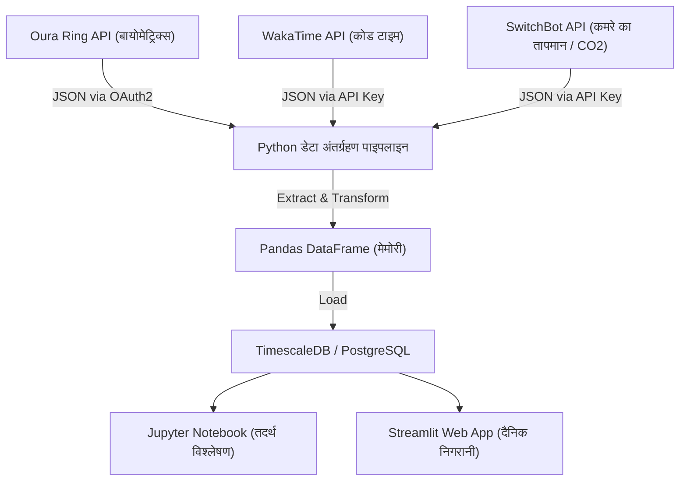
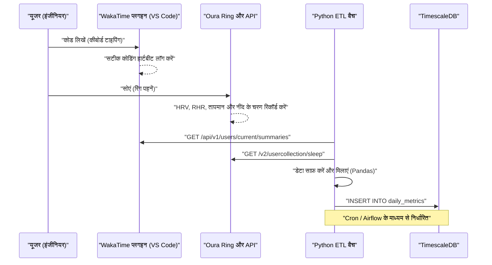
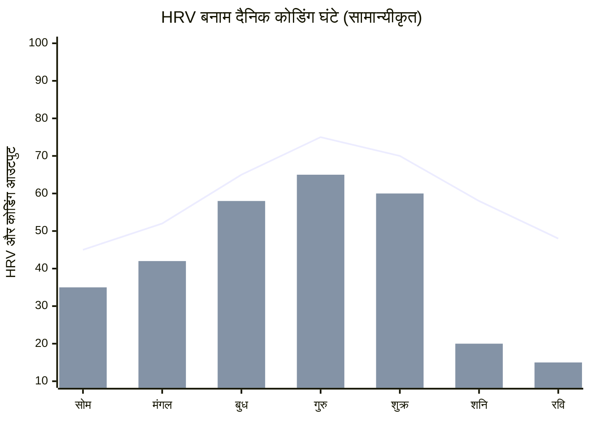

## 1. प्रस्तावना: सॉफ्टवेयर इंजीनियर और बायोहैकिंग का संगम

आधुनिक सॉफ्टवेयर इंजीनियरिंग अत्यधिक संज्ञानात्मक भार (cognitive load) और लंबे समय तक बैठकर काम करने (Sedentary Lifestyle) वाला एक कठोर बौद्धिक कार्य है। लगातार बदलते टेक्नोलॉजी स्टैक को सीखना, जटिल डिस्ट्रीब्यूटेड सिस्टम में बग खोजना, और डेडलाइन का दबाव। इन सब से पार पाने के लिए केवल "जुनून" या "इच्छाशक्ति" पर निर्भर रहने के बजाय, अपने शरीर रूपी हार्डवेयर को वैसे ही ट्यून करने का दृष्टिकोण आवश्यक है जैसे हम किसी सिस्टम को डीबग करते हैं, जिसे "बायोहैकिंग (Biohacking)" कहा जाता है।

पहले हम "आज मेरी तबीयत कुछ ठीक/खराब लग रही है" जैसी व्यक्तिपरक भावनाओं (heuristics) पर निर्भर रहते थे, लेकिन आज Oura Ring, Apple Watch, Garmin जैसे उच्च-प्रदर्शन वाले वेयरेबल उपकरणों की लोकप्रियता के कारण, हम बिना किसी शारीरिक परेशानी (non-invasive) के 24 घंटे, साल के 365 दिन बायोमेट्रिक डेटा प्राप्त कर सकते हैं। इस लेख में, हम बायोमेट्रिक डेटा (HRV, RHR, नींद के आर्किटेक्चर) और उत्पादकता डेटा (WakaTime आदि से कोडिंग मेट्रिक्स) को API के माध्यम से प्राप्त करने और Python या Pandas का उपयोग करके डेटा साइंस दृष्टिकोण से सहसंबंध विश्लेषण (correlation analysis) करने का तरीका बताएंगे। इसके अलावा, हम सर्केडियन रिदम (Circadian Rhythm) के गणितीय मॉडल और कैफीन चयापचय (metabolism) के अर्ध-आयु (half-life) के आधार पर कॉफी पीने के इष्टतम समय जैसे वैज्ञानिक प्रमाणों पर आधारित इंजीनियरों के लिए स्वास्थ्य हैक्स के बारे में भी बहुत विस्तार से चर्चा करेंगे।

## 2. जिसे मापा नहीं जा सकता, उसे प्रबंधित नहीं किया जा सकता: बायोमेट्रिक डेटा प्राप्त करने वाले हार्डवेयर

बायोमेट्रिक डेटा प्राप्त करने वाले सेंसर (वेयरेबल डिवाइस) में से प्रत्येक की अपनी-अपनी विशेषज्ञता होती है। डेटा-संचालित स्वास्थ्य प्रबंधन में, उद्देश्य के अनुसार सबसे उपयुक्त डिवाइस का चयन करना पहला कदम है।

### 2.1 Oura Ring (Generation 3 / 4)
क्योंकि यह सीधे उंगली की धमनी से डेटा प्राप्त करता है, इसलिए कलाई पर मापने वाली स्मार्टवॉच की तुलना में, यह नींद के दौरान हृदय गति, हृदय गति परिवर्तनशीलता (HRV), और शरीर की सतह के तापमान में बदलाव को बहुत उच्च सटीकता के साथ मापता है। उंगलियों में केशिकाएं (capillaries) घनी होती हैं, इसलिए ऑप्टिकल हार्ट रेट सेंसर (PPG: Photoplethysmography) द्वारा कम शोर (noise) के साथ डेटा प्राप्त करना संभव है। इसके अतिरिक्त, इसका REST API बहुत समृद्ध है, और OAuth 2.0 के माध्यम से JSON प्रारूप में कच्चा डेटा आसानी से निर्यात किया जा सकता है, जो इसे इंजीनियरों के लिए सबसे अधिक हैक करने योग्य (hackable) डिवाइस बनाता है।

### 2.2 Apple Watch Series / Ultra
गतिविधियों के दौरान ट्रैकिंग, रक्त ऑक्सीजन संतृप्ति (SpO2), और इलेक्ट्रोकार्डियोग्राम (ECG) को मापने में यह उत्कृष्ट है। यह दिन के दौरान शारीरिक गतिविधि की मात्रा को मापने और माइंडफुलनेस ऐप (ब्रीद ऐप) के माध्यम से ऑन-डिमांड HRV माप के लिए सबसे शक्तिशाली डिवाइस है। हालाँकि, डेटा निर्यात करने के लिए HealthKit के माध्यम से जाना पड़ता है, और Python आदि से सीधे एक्सेस के लिए iOS ऐप्स (जैसे AutoSleep या HealthFit) के माध्यम से CSV निर्यात करने जैसे एक अतिरिक्त कदम की आवश्यकता होती है।

### 2.3 Garmin (Fenix / Forerunner)
GPS ट्रैकिंग सटीकता के अलावा, इसका 'Body Battery (बॉडी बैटरी)' नामक विशिष्ट ऊर्जा शेष संकेतक उत्कृष्ट है। इसकी गणना HRV और तनाव के स्तर के आधार पर की जाती है। Garmin का डेटा Garmin Connect API के माध्यम से प्राप्त किया जा सकता है, लेकिन क्योंकि कॉर्पोरेट API के लिए बाधाएं हैं, व्यक्तिगत डेवलपर्स को ओपन-सोर्स लाइब्रेरी का उपयोग करना पड़ता है या स्वयंसेवकों द्वारा बनाए गए स्क्रैपिंग टूल का उपयोग करना पड़ता है।

इस लेख में, हम **Oura Ring** के डेटा, जो नींद और रिकवरी को ट्रैक करने में सर्वश्रेष्ठ है और जिससे API के माध्यम से डेटा निकालना बहुत आसान है, और **WakaTime** के डेटा, जो IDE (जैसे VS Code या IntelliJ) प्लगइन के रूप में कोडिंग समय को मापता है, को मुख्य आधार मानकर अपनी व्याख्या आगे बढ़ाएंगे।

## 3. बायोमेट्रिक डेटा का मूल सिद्धांत: HRV और RHR का डेटा साइंस

केवल "लंबे समय तक सोना अच्छा है" जैसे सरल संकेतक के बजाय, डेटा साइंस के दृष्टिकोण से निम्नलिखित दो संकेतक "पुनर्प्राप्ति (Recovery)" के मुख्य मेट्रिक्स हैं।

### 3.1 HRV (हृदय गति परिवर्तनशीलता: Heart Rate Variability) और स्वायत्त तंत्रिका तंत्र (Autonomic Nervous System) की मॉडलिंग
हृदय किसी मेट्रोनोम (metronome) की तरह एक निश्चित लय में नहीं धड़कता है। उदाहरण के लिए, भले ही हृदय गति 60 bpm हो, प्रत्येक धड़कन के बीच का अंतराल (R-R अंतराल) हमेशा घटता-बढ़ता रहता है, जैसे "0.92 सेकंड", "1.05 सेकंड", और "0.98 सेकंड"। इस उतार-चढ़ाव की मात्रा को संख्यात्मक रूप में मापना ही HRV (हृदय गति परिवर्तनशीलता) कहलाता है।

HRV सीधे स्वायत्त तंत्रिका तंत्र, अर्थात् "सिम्पैथेटिक नर्वस सिस्टम (एक्सेलेरेटर)" और "पैरासिम्पैथेटिक नर्वस सिस्टम (ब्रेक)" के संतुलन को दर्शाता है। तनाव, थकान, या शराब पीने के बाद की स्थिति में सिम्पैथेटिक नर्वस सिस्टम हावी हो जाता है, जिससे हृदय की धड़कन अधिक नियमित हो जाती है और HRV कम हो जाता है। इसके विपरीत, पूरी तरह से आराम और रिकवरी की स्थिति में, पैरासिम्पैथेटिक नर्वस सिस्टम (वेगस नर्व) हावी हो जाता है, और क्योंकि हृदय गति श्वास के साथ गतिशील रूप से उतार-चढ़ाव करती है, HRV अधिक होता है।

HRV की गणना करने के लिए दो दृष्टिकोण हैं: टाइम-डोमेन (Time-domain) और फ्रीक्वेंसी-डोमेन (Frequency-domain)। टाइम-डोमेन विश्लेषण में सबसे अधिक इस्तेमाल किया जाने वाला, और जो Oura Ring और Apple Watch में भी उपयोग किया जाता है, वह **RMSSD (Root Mean Square of Successive Differences)** है। यह लगातार दिल की धड़कन के अंतरालों (RR अंतराल) के बीच के अंतर के वर्गों के माध्य का वर्गमूल (Root Mean Square) ज्ञात करता है।

यदि इसे गणितीय सूत्र के रूप में स्पष्ट रूप से व्यक्त किया जाए, तो यह इस प्रकार होगा:

$$ RMSSD = \sqrt{\frac{1}{N-1} \sum_{i=1}^{N-1} (RR_{i+1} - RR_i)^2} $$

यहाँ,
- $N$ मापी गई कुल हृदय धड़कनों की संख्या है
- $RR_i$, $i$-वाँ RR अंतराल (मिलीसेकंड में) है

इंजीनियरों के लिए, यदि सुबह उठते समय HRV (RMSSD) उनके व्यक्तिगत बेसलाइन (पिछले कुछ हफ्तों के मूविंग एवरेज) से काफी कम हो गया है, तो यह डेटा-संचालित निर्णय लेना संभव हो जाता है कि "आज उच्च संज्ञानात्मक भार वाले आर्किटेक्चर डिज़ाइन या प्रोडक्शन वातावरण में डिप्लॉयमेंट से बचना चाहिए, और यह दिन टेस्ट कोड बढ़ाने या डॉक्यूमेंटेशन बनाने के लिए समर्पित होना चाहिए।"

### 3.2 रेस्टिंग हार्ट रेट (RHR: Resting Heart Rate) और रिकवरी का संकेत
RHR एक मिनट में धड़कनों की संख्या है जब शरीर पूरी तरह से आराम की स्थिति में (आमतौर पर नींद के दौरान) होता है। शराब पीने के बाद, देर रात अधिक खाना खाने के बाद, या बीमारी (संक्रमण आदि) के शुरुआती लक्षणों के रूप में, जब शरीर अपना ऊर्जा चयापचय (metabolism) या प्रतिरक्षा प्रतिक्रियाओं में खर्च कर रहा होता है, तो RHR बेसलाइन की तुलना में कुछ bpm से लेकर दर्जन भर bpm तक बढ़ जाता है।

RHR जितना कम होता है, इसका मतलब है कि हृदय की मांसपेशियां एक ही धड़कन में अधिक रक्त पंप करने में सक्षम हैं (स्ट्रोक वॉल्यूम अधिक है), जो उच्च एरोबिक क्षमता और थकान से रिकवरी की डिग्री को दर्शाता है। आदर्श रूप से, नींद के पहले भाग (शुरुआती आधे) के दौरान RHR के अपने न्यूनतम स्तर तक पहुंचने वाला एक "हैमॉक-आकार (झूला-आकार)" का वक्र खींचना, यह दर्शाता है कि उच्चतम गुणवत्ता वाली रिकवरी हो रही है।

## 4. स्लीप आर्किटेक्चर का विस्तृत विश्लेषण

इंजीनियरों के मस्तिष्क के प्रदर्शन को निर्धारित करने वाली केवल नींद की "मात्रा" नहीं बल्कि "गुणवत्ता" है, यानी कि स्लीप आर्किटेक्चर (Sleep Architecture)। एक रात की नींद आमतौर पर 90 से 110 मिनट के चक्र को 4 से 5 बार दोहराती है।

### 4.1 NREM नींद स्टेज 1 से 2 (हल्की नींद / Light Sleep)
यह तैयारी का चरण है जहां मस्तिष्क की तरंगें धीरे-धीरे धीमी हो जाती हैं और शरीर आराम करना शुरू कर देता है। यह कुल नींद का लगभग 50% हिस्सा होता है। हालांकि यह संज्ञानात्मक रिकवरी में कम योगदान देता है, यह अगली गहरी नींद के चरण में जाने के लिए एक महत्वपूर्ण पुल के रूप में कार्य करता है।

### 4.2 NREM नींद स्टेज 3 (गहरी नींद / Deep Sleep / Slow Wave Sleep: SWS)
यह वह समय है যখন मस्तिष्क की तरंगों में डेल्टा तरंगें (0.5 से 2Hz की कम आवृत्ति) दिखाई देती हैं, जो भौतिक शरीर की रिकवरी का मुख्य समय होता है। बड़ी मात्रा में विकास हार्मोन (growth hormone) का स्राव होता है, और कोशिकाओं की मरम्मत की जाती है। यह प्रतिरक्षा प्रणाली को मजबूत करने के लिए भी आवश्यक है, और सीधे एथलीटों की मांसपेशियों की थकान से रिकवरी से ही नहीं, बल्कि इंजीनियरों की आंखों के तनाव और गर्दन/कंधे की मांसपेशियों की मरम्मत से भी जुड़ा हुआ है। गहरी नींद आमतौर पर नींद के पहले आधे चक्रों में केंद्रित होती है।

### 4.3 REM नींद (Rapid Eye Movement)
मस्तिष्क जागने की स्थिति की तरह ही सक्रिय रूप से काम कर रहा होता है, लेकिन शरीर की मांसपेशियां लकवाग्रस्त स्थिति में होती हैं। इंजीनियरों के लिए यह REM नींद अत्यंत महत्वपूर्ण है; यह दिन के दौरान सीखी गई नई प्रोग्रामिंग भाषा के सिंटैक्स या जटिल एल्गोरिदम की अवधारणाओं को मस्तिष्क में व्यवस्थित करने, और उन्हें दीर्घकालिक स्मृति (Memory Consolidation) के रूप में स्थापित करने की भूमिका निभाती है। यह न्यूरोप्लास्टिसिटी (Neuroplasticity) को बढ़ाती है, और रचनात्मक समस्या-समाधान क्षमता (जैसे "शॉवर लेते समय अचानक बग का समाधान सूझ जाना") को भी REM नींद द्वारा सुदृढ़ किया जाता है। REM नींद नींद के बाद वाले हिस्से (सुबह के समय) में लंबी होने की प्रवृत्ति रखती है।

अर्थात, "अलार्म लगाकर जबरदस्ती जल्दी उठकर अपनी नींद कम करना" का मतलब है स्मृति स्थापना और रचनात्मकता से जुड़ी REM नींद को बड़े पैमाने पर कम करना, जो एक गंभीर बग (bug) के समान कार्य है जो एक इंजीनियर के रूप में आपके प्रदर्शन को काफी हद तक कम कर देता है।

## 5. निरंतर ग्लूकोज मॉनिटरिंग (CGM) और स्पाइक्स से बचाव

हाल के वर्षों में, बायोहैकर्स के बीच CGM (Continuous Glucose Monitor: निरंतर ग्लूकोज मॉनिटर) को अपनाना आवश्यक हो गया है। इसके प्रमुख उपकरणों में FreeStyle Libre और Dexcom शामिल हैं।
जब आप खाना खाते हैं (विशेषकर कार्बोहाइड्रेट और चीनी), तो रक्त में ग्लूकोज का स्तर तेजी से बढ़ता है (ब्लड शुगर स्पाइक), और उसके बाद इंसुलिन के भारी स्राव के कारण तेजी से गिरता है (क्रैश)। इस "क्रैश" के समय, तीव्र उनींदापन (Brain Fog) और एकाग्रता में कमी आ जाती है। दोपहर के भोजन के बाद "दोपहर 2 बजे का शैतानी समय" में नींद आने का कारण केवल शरीर की आंतरिक घड़ी का प्रभाव नहीं है, बल्कि रामेन या सफेद चावल के अधिक सेवन के कारण होने वाला ब्लड शुगर स्पाइक होने की भी अत्यधिक संभावना है।

ब्लड शुगर रिस्पांस वक्र $G(t)$ को सेवन किए गए कार्बोहाइड्रेट के अवशोषण की दर और इंसुलिन द्वारा निकासी (clearance) के बीच के अंतर के रूप में, निम्नलिखित डैम्प्ड ऑसिलेशन (damped oscillation) मॉडल द्वारा अनुमानित रूप से व्यक्त किया जा सकता है।

$$ G(t) = G_{base} + \Delta G \cdot e^{-\alpha t} \sin(\beta t) $$

यहाँ,
- $G_{base}$: खाली पेट ब्लड शुगर का स्तर (बेसलाइन)
- $\Delta G$: भोजन के कारण ब्लड शुगर में वृद्धि का आयाम (amplitude)
- $\alpha$: इंसुलिन संवेदनशीलता (sensitivity) और चयापचय (metabolic) दर के आधार पर क्षीणन गुणांक (damping coefficient)
- $\beta$: दोलन (oscillation) का आवृत्ति घटक (frequency component)
- $t$: भोजन के बाद का समय

इंजीनियर के प्रदर्शन को बनाए रखने के लिए, $\Delta G$ (आयाम) को न्यूनतम करना महत्वपूर्ण है। विशेष रूप से, "सब्जियां (आहारीय फाइबर) पहले खाना", "रिफाइंड कार्बोहाइड्रेट से बचना", "भोजन के बाद 15 मिनट की हल्की सैर करना (GLUT4 ट्रांसपोर्टर को सक्रिय करके इंसुलिन के बिना ब्लड शुगर को मांसपेशियों में खींचना)" जैसे हैक्स प्रभावी हैं।

## 6. आर्किटेक्चर डिज़ाइन: लोकल डेटा पाइपलाइन का निर्माण

बायोमेट्रिक डेटा और उत्पादकता डेटा का एकीकृत विश्लेषण करने के लिए हम एक लोकल डेटा पाइपलाइन बनाएंगे।
नीचे दिया गया Mermaid डायग्राम (फ़्लोचार्ट) API से डेटा प्राप्त करने और उसे डैशबोर्ड पर प्रदर्शित (visualize) करने तक के प्रवाह को दर्शाता है।



इस आर्किटेक्चर के माध्यम से, आप हर दिन स्वचालित रूप से अपनी शारीरिक स्थिति (इनपुट) और कोडिंग प्रदर्शन (आउटपुट) के बीच सहसंबंध (correlation) की निगरानी करने में सक्षम होंगे।

आइए सिस्टम के बीच अनुक्रम (sequence) को और अधिक विस्तार से देखें।



## 7. Python और Pandas का उपयोग करके डेटा अंतर्ग्रहण (Data Ingestion)

आइए वास्तव में Python स्क्रिप्ट का उपयोग करके, Oura Ring और WakaTime के API से डेटा प्राप्त करने और इसे Pandas DataFrame के रूप में एकीकृत करने की प्रक्रिया को देखें। हम व्यावहारिक उपयोग के अनुकूल एक मजबूत (robust) कोड तैयार करेंगे।

```python
import requests
import pandas as pd
from datetime import datetime, timedelta
import os

# Environment Variables
OURA_TOKEN = os.getenv("OURA_ACCESS_TOKEN")
WAKATIME_API_KEY = os.getenv("WAKATIME_API_KEY")

def fetch_oura_sleep_data(start_date: str, end_date: str) -> pd.DataFrame:
    """Fetch daily sleep summary from Oura Ring API v2."""
    url = "https://api.ouraring.com/v2/usercollection/sleep"
    params = {"start_date": start_date, "end_date": end_date}
    headers = {"Authorization": f"Bearer {OURA_TOKEN}"}
    
    response = requests.get(url, headers=headers, params=params)
    response.raise_for_status() # Raise exception for 4xx/5xx errors
    data = response.json().get("data", [])
    
    if not data:
        return pd.DataFrame()
        
    df = pd.json_normalize(data)
    # Extract deeply nested values or select essential columns
    df = df[['day', 'score', 'time_in_bed', 'total_sleep_duration', 
             'average_hrv', 'lowest_heart_rate', 
             'deep_sleep_duration', 'rem_sleep_duration']]
             
    # Convert dates to datetime objects and set as index
    df['day'] = pd.to_datetime(df['day'])
    df.set_index('day', inplace=True)
    return df

def fetch_wakatime_data(start_date: str, end_date: str) -> pd.DataFrame:
    """Fetch coding duration summaries from WakaTime API."""
    url = "https://wakatime.com/api/v1/users/current/summaries"
    params = {"start": start_date, "end": end_date, "api_key": WAKATIME_API_KEY}
    
    response = requests.get(url, params=params)
    response.raise_for_status()
    data = response.json().get("data", [])
    
    records = []
    for day_data in data:
        date_str = day_data['range']['date']
        # Extract total seconds spent coding
        total_seconds = day_data['grand_total']['total_seconds']
        records.append({'day': date_str, 'coding_hours': total_seconds / 3600.0})
        
    df = pd.DataFrame(records)
    if not df.empty:
        df['day'] = pd.to_datetime(df['day'])
        df.set_index('day', inplace=True)
    return df

if __name__ == "__main__":
    # Fetch data for the last 60 days
    end = datetime.now().strftime("%Y-%m-%d")
    start = (datetime.now() - timedelta(days=60)).strftime("%Y-%m-%d")
    
    oura_df = fetch_oura_sleep_data(start, end)
    waka_df = fetch_wakatime_data(start, end)
    
    # Merge datasets on 'day' index using inner join
    merged_df = pd.merge(oura_df, waka_df, left_index=True, right_index=True, how='inner')
    
    # Save raw data to CSV/DB
    merged_df.to_csv("health_productivity_raw.csv")
    print(f"Ingested {len(merged_df)} days of data.")
```

## 8. डेटा प्रीप्रोसेसिंग और फीचर इंजीनियरिंग

प्राप्त कच्चे डेटा का सीधे विश्लेषण करना जोखिम भरा हो सकता है। डिवाइस को चार्ज करना भूलने के कारण छूटे हुए मूल्यों (Missing Values) को संभालना और सार्थक नए संकेतक उत्पन्न करना (फीचर इंजीनियरिंग: Feature Engineering) आवश्यक है।

```python
def engineer_features(df: pd.DataFrame) -> pd.DataFrame:
    """Apply feature engineering and cleaning to the merged dataframe."""
    df = df.copy()
    
    # 1. Handle missing values (e.g., forward fill)
    df.fillna(method='ffill', inplace=True)
    
    # 2. Calculate Sleep Efficiency
    # Formula: (Total Sleep Time / Time in Bed) * 100
    df['sleep_efficiency_pct'] = (df['total_sleep_duration'] / df['time_in_bed']) * 100
    
    # 3. Calculate Sleep Stage Ratios
    df['rem_ratio'] = df['rem_sleep_duration'] / df['total_sleep_duration']
    df['deep_ratio'] = df['deep_sleep_duration'] / df['total_sleep_duration']
    
    # 4. Calculate 7-day Moving Averages (Rolling Mean) to smooth out daily noise
    df['hrv_7d_ma'] = df['average_hrv'].rolling(window=7).mean()
    df['rhr_7d_ma'] = df['lowest_heart_rate'].rolling(window=7).mean()
    
    # 5. Calculate daily deviation from baseline
    df['hrv_deviation'] = df['average_hrv'] - df['hrv_7d_ma']
    
    # 6. Normalize targets for Machine Learning (Optional)
    from sklearn.preprocessing import MinMaxScaler
    scaler = MinMaxScaler()
    df[['hrv_scaled', 'coding_scaled']] = scaler.fit_transform(df[['average_hrv', 'coding_hours']])
    
    # Drop rows with NaN generated by rolling window
    df.dropna(inplace=True)
    
    return df

processed_df = engineer_features(merged_df)
```

## 9. सहसंबंध विश्लेषण (Correlation Analysis): उत्पादकता और स्वास्थ्य मेट्रिक्स का संगम

प्रीप्रोसेस्ड डेटा के आधार पर, हम स्वास्थ्य संकेतकों और कोडिंग उत्पादकता के बीच संबंध का विश्लेषण करेंगे। एक परिकल्पना (hypothesis) के रूप में, यह माना जा सकता है कि "जिस दिन HRV अधिक होता है (स्वायत्त तंत्रिका तंत्र संतुलित है और रिकवरी हो रही है), उस दिन एकाग्रता बनी रहती है, कोडिंग का समय लंबा होता है, या अधिक जटिल कार्यों को संभाला जा सकता है।"


*(नोट: लाइन ग्राफ सामान्यीकृत HRV बेसलाइन से विचलन (deviation) को दर्शाता है, और बार ग्राफ WakaTime के कोडिंग समय को दर्शाता है। यह देखा जा सकता है कि बुधवार से शुक्रवार तक, जब पर्याप्त रिकवरी प्राप्त होती है, कोडिंग आउटपुट को अधिकतम किया जाता है, जो एक सहसंबंध दिखाता है)*

हम Pandas का उपयोग करके सहसंबंध गुणांक (correlation coefficient) (पियर्सन का उत्पाद-आघूर्ण सहसंबंध गुणांक $r$) की गणना करेंगे, और SciPy का उपयोग करके सांख्यिकीय महत्व (p-value) का परीक्षण करेंगे।

```python
import scipy.stats as stats

# Select numerical columns for correlation matrix
cols_of_interest = ['average_hrv', 'score', 'deep_sleep_duration', 'rem_sleep_duration', 'coding_hours']
correlation_matrix = processed_df[cols_of_interest].corr()

print("Correlation with Coding Hours:")
print(correlation_matrix['coding_hours'].sort_values(ascending=False))

# Calculate Pearson correlation coefficient and p-value for REM sleep and Coding Hours
r, p_value = stats.pearsonr(processed_df['rem_sleep_duration'], processed_df['coding_hours'])
print(f"REM Sleep vs Coding Hours: r = {r:.3f}, p-value = {p_value:.4f}")
```

ज्यादातर मामलों में, `average_hrv` और `rem_sleep_duration` का `coding_hours` के साथ एक महत्वपूर्ण सकारात्मक सहसंबंध ($p < 0.05$) देखा जाता है। विशेष रूप से, पिछले दिन की REM नींद की अवधि अगले दिन के "त्रुटि समाधान (डिबगिंग) में लगने वाले समय" और "उत्पादकता" को मजबूती से प्रभावित करती है, जैसा कि कई इंजीनियरों के स्वयं-ट्रैकिंग (Quantified Self) समुदायों में रिपोर्ट किया गया है।

## 10. सर्केडियन रिदम का गणितीय मॉडल और संज्ञानात्मक पीक का अनुकूलन

मनुष्यों में लगभग 24 घंटे के चक्र वाली एक आंतरिक शरीर घड़ी होती है जिसे सर्केडियन रिदम (Circadian Rhythm) कहा जाता है। इस लय के कारण, शरीर का तापमान, हार्मोन स्राव (सुबह कोर्टिसोल का बढ़ना और रात में मेलाटोनिन का स्राव), और "संज्ञानात्मक क्षमता (cognitive ability)" में उतार-चढ़ाव होता है।

सर्केडियन रिदम के उतार-चढ़ाव को अक्सर कोसाइन वक्र का उपयोग करके गणितीय मॉडल (Cosinor मॉडल) द्वारा अनुमानित रूप से व्यक्त किया जाता है, और बायोमेट्रिक संकेतकों में परिवर्तन को निम्नानुसार सूत्रबद्ध किया जा सकता है:

$$ y(t) = M + A \cos\left(\frac{2\pi}{24}(t - \phi)\right) + e(t) $$

- $y(t)$: समय $t$ पर बायोमेट्रिक संकेतक (उदाहरण: कोर शरीर का तापमान या सतर्कता स्तर)
- $M$: MESOR (Midline Estimating Statistic of Rhythm) - लय का मध्य मान (औसत स्तर)
- $A$: आयाम (Amplitude) - उतार-चढ़ाव की मात्रा
- $\phi$: एक्रोफ़ेज़ (Acrophase) - वह चरण (समय) जब पीक पर होता है
- $e(t)$: पर्यावरणीय कारकों आदि के कारण त्रुटि शब्द (Error term)

इंजीनियरिंग में इस समीकरण का अर्थ यह है कि "दिन के दौरान वह समय ($\phi$) जब आपका प्रदर्शन (सतर्कता) अपने चरम (peak) पर होता है, जैविक रूप से निर्धारित होता है, और सबसे अधिक संज्ञानात्मक भार वाले कार्य (जैसे जटिल बग ठीक करना या नए आर्किटेक्चर डिज़ाइन करना) उसी समय के लिए आवंटित किए जाने चाहिए।"

सामान्य मॉर्निंग-टाइप (Morning Lark) क्रोनोटाइप के मामले में, उठने के 2 से 4 घंटे बाद (उदाहरण के लिए सुबह 9 बजे से 11 बजे के बीच) पहला संज्ञानात्मक पीक आता है। उसके बाद, दोपहर 2 बजे के आसपास सर्केडियन रिदम का सबसे निचला स्तर (Post-lunch dip) आता है, और शाम को एक और छोटा पीक आता है। वेयरेबल डेटा गतिविधि और व्यक्तिपरक एकाग्रता स्तरों से अपने स्वयं के पीक टाइम ($\phi$) की पहचान करना और Google Calendar जैसे शेड्यूल में "टाइम-ब्लॉकिंग" करके इसकी रक्षा करना सबसे अच्छा स्वास्थ्य हैक है। अपने पीक टाइम के दौरान व्यर्थ की मीटिंग्स रखना, CPU के सबसे अच्छा प्रदर्शन करने वाले कोर को आइडल (idle) प्रोसेस के लिए आवंटित करने जैसा है।

## 11. कैफीन की फार्माकोकाइनेटिक्स (Pharmacokinetics) और इसके सेवन का सही समय

इंजीनियरों और कॉफी का अटूट रिश्ता होता है, लेकिन बहुत अधिक कैफीन का सेवन या देर से सेवन करने से मस्तिष्क में एडेनोसिन रिसेप्टर्स ब्लॉक हो जाते हैं और रात की "गहरी नींद (Deep Sleep)" नष्ट हो जाती है। भले ही आपको लग रहा हो कि आप सो रहे हैं, Oura Ring का डेटा यह स्पष्ट दिखा सकता है कि हृदय गति कम नहीं हो रही है और गहरी नींद का अनुपात काफी घट गया है।

शरीर से कैफीन का निष्कासन प्रथम-कोटि गतिकी (First-order kinetics) का पालन करता है। यानी, रक्त में इसकी सांद्रता घातीय रूप (exponentially) से कम होती है।

$$ C(t) = C_0 e^{-k t} $$

यहाँ,
- $C(t)$: समय $t$ बीतने के बाद रक्त में कैफीन की सांद्रता
- $C_0$: प्रारंभिक सांद्रता (सेवन के तुरंत बाद अधिकतम सांद्रता)
- $k$: उन्मूलन दर स्थिरांक (Elimination rate constant)
- $t$: सेवन के बाद से बीता हुआ समय (घंटों में)

उन्मूलन दर स्थिरांक $k$ को कैफीन के अर्ध-आयु (half-life) ($t_{1/2}$) का उपयोग करके इस प्रकार व्यक्त किया जा सकता है:

$$ k = \frac{\ln(2)}{t_{1/2}} $$

स्वस्थ वयस्कों के मामले में, व्यक्ति के जीन (CYP1A2 जीन) के आधार पर कैफीन का अर्ध-आयु $t_{1/2}$ लगभग **5 से 6 घंटे** माना जाता है।
मान लीजिए, आप दोपहर 3 बजे एक कप ड्रिप कॉफी (लगभग 150 mg कैफीन) पीते हैं ($C_0 = 150$)। यदि हम अर्ध-आयु 5.5 घंटे मानते हैं, तो $k \approx 0.126$ होगा।
रात 11 बजे सोते समय (8 घंटे बाद) शरीर में बचे कैफीन की सांद्रता की गणना करने पर:

$$ C(8) = 150 \times e^{-0.126 \times 8} = 150 \times e^{-1.008} \approx 150 \times 0.365 = 54.75 \text{ mg} $$

अर्थात, सोने के समय भी आपके शरीर में 54 mg (एक एस्प्रेसो से थोड़ा अधिक) कैफीन बचा रहता है, जो स्लीप आर्किटेक्चर पर सीधा नकारात्मक प्रभाव डालता है।
इस फार्माकोकाइनेटिक मॉडल से निकाला गया डेटा-संचालित निष्कर्ष यह है कि **"उच्च गुणवत्ता वाली नींद सुनिश्चित करने के लिए, कैफीन का सेवन जागने के 90 मिनट बाद (कोर्टिसोल स्पाइक शांत होने के बाद) शुरू करना चाहिए, और दोपहर 2 बजे तक (सोने से 9-10 घंटे पहले) इसका सेवन पूरी तरह से बंद कर देना चाहिए।"**

## 12. पर्यावरण चर (Environmental Variables) की हैकिंग (Lux, तापमान, CO2)

केवल अपने शरीर रूपी आंतरिक सिस्टम को ही नहीं, बल्कि बाहरी पर्यावरण चर (Environment Variables) को भी अनुकूलित करना महत्वपूर्ण है।

### 12.1 प्रकाश वातावरण (Lux) की प्रोग्रामिंग
सर्केडियन रिदम को रीसेट करने वाला सबसे शक्तिशाली "ज़िटगेबर (Zeitgeber: समय का संकेत)" प्रकाश है। सुबह रेटिना के प्रकाश-रिसेप्टर कोशिकाओं (ipRGC) में प्रवेश करने वाले लगभग 100,000 Lux सूरज की रोशनी मेलाटोनिन के स्राव को रोकती है और टाइमर को रीसेट कर देती है। इसके विपरीत, रात में नीली रोशनी (blue light) को रोकना आवश्यक है ताकि मेलाटोनिन स्राव बाधित न हो। न केवल f.lux जैसे सॉफ़्टवेयर के साथ डिस्प्ले का रंग तापमान (color temperature) कम करना, बल्कि स्मार्ट लाइटिंग (जैसे Philips Hue) को API के माध्यम से नियंत्रित करना और सूर्यास्त के अनुसार कमरे की रोशनी और रंग तापमान को स्वचालित रूप से कम करने वाली एक स्क्रिप्ट लिखना बहुत प्रभावी है।

### 12.2 बेडरूम का तापमान नियंत्रण और स्लीप लेटेंसी (Sleep Latency)
मनुष्य के कोर शरीर का तापमान (Core Body Temperature) कम होने पर उन्हें नींद आती है। बेडरूम का तापमान 18 से 19 डिग्री के ठंडे स्तर पर बनाए रखना, और सोने से 90 मिनट पहले गर्म स्नान करके कोर शरीर के तापमान को अस्थायी रूप से बढ़ाना, और फिर तापमान में तेजी से गिरावट के समय बिस्तर पर जाना, स्लीप लेटेंसी (बिस्तर पर जाने से लेकर नींद आने तक का समय) को काफी कम कर सकता है और गहरी नींद को अधिकतम कर सकता है।

### 12.3 CO2 की सांद्रता और संज्ञानात्मक कार्य में गिरावट
जब आप अपनी डेटा पाइपलाइन में SwitchBot Hub या Netatmo वेदर स्टेशन API जोड़ते हैं, तो इनडोर कार्बन डाइऑक्साइड (CO2) सांद्रता और उत्पादकता के बीच एक स्पष्ट नकारात्मक सहसंबंध देखा जा सकता है।
जैसा कि हार्वर्ड विश्वविद्यालय और अन्य शोधों में दिखाया गया है, जब CO2 सांद्रता 1000ppm से अधिक हो जाती है, तो संज्ञानात्मक कार्य (विशेष रूप से रणनीतिक निर्णय लेने की क्षमता) में काफी गिरावट आने लगती है, और 2000ppm से अधिक होने पर प्रदर्शन में गंभीर गिरावट आती है। सर्दियों के दौरान बंद कमरों में दूर से काम करने (remote work) से अनजाने में आपका प्रदर्शन कम हो रहा होता है।

```python
# Pseudo-code for intelligent room ventilation using Home Assistant / SwitchBot API
import requests

def check_and_ventilate():
    # Get current CO2 level from Netatmo/SwitchBot API
    co2_ppm = get_sensor_data("co2_sensor_id")
    
    if co2_ppm > 1000:
        print(f"Warning: CO2 level high ({co2_ppm} ppm). Cognitive decline risk.")
        # Trigger smart plug to turn on ventilation fan
        turn_on_smart_plug("ventilation_fan_id")
        # Send notification to Slack/Discord
        send_notification("वेंटिलेशन फैन चालू कर दिया गया है। CO2 का स्तर उच्च है।")
    elif co2_ppm < 600:
        turn_off_smart_plug("ventilation_fan_id")
```
Cron के साथ ऐसी स्क्रिप्ट को नियमित रूप से चलाने से, एक स्वायत्त पर्यावरण नियंत्रण प्रणाली (autonomous environmental control system) तैयार हो जाती है जो हमेशा इष्टतम ऑक्सीजन सांद्रता बनाए रखती है।

## 13. निष्कर्ष: मानव शरीर रूपी प्रणाली का CI/CD

अपने शरीर को एक जटिल डिस्ट्रीब्यूटेड सिस्टम के रूप में सोचें। वेयरेबल डिवाइस (Oura Ring) निगरानी के लिए मेट्रिक्स एक्सपोर्टर (Prometheus) है, Python/Pandas स्क्रिप्ट लॉग विश्लेषण पाइपलाइन (Logstash/Fluentd) हैं, और दिन-प्रतिदिन के स्वास्थ्य में परिवर्तन और प्रदर्शन, डैशबोर्ड (Grafana/Streamlit) पर प्रदर्शित होने वाली सिस्टम की सेहत (system health) हैं।

"नींद के समय में कटौती करके काम करना" तकनीकी ऋण (Technical Debt) को नज़रअंदाज़ करते हुए जबरदस्ती नए फीचर्स जोड़ने के समान है। अल्पावधि (short-term) में, यह आपको रिलीज़ के समय तक पहुँचने में मदद कर सकता है, लेकिन दीर्घावधि (long-term) में, यह निश्चित रूप से सिस्टम डाउन (बर्नआउट, गंभीर स्वास्थ्य समस्याएं, या डिप्रेशन) का कारण बनेगा।

HRV की निगरानी करना, RHR के रुझानों की जांच करना और स्लीप आर्किटेक्चर को अनुकूलित करना। फिर WakaTime के उत्पादकता डेटा के साथ सहसंबंध को देखते हुए, आहार, व्यायाम, नींद और पर्यावरण जैसे "हाइपरपैरामीटर्स" को प्रतिदिन थोड़ा-थोड़ा ठीक करना। यह वास्तव में, मानव शरीर के लिए **CI/CD (Continuous Integration / Continuous Delivery)** की प्रक्रिया से कम नहीं है।

डेटा साइंस और API का पूरा उपयोग करें और उच्च प्रदर्शन देने के लिए अपने स्वास्थ्य की इंजीनियरिंग करें। क्योंकि आपके द्वारा लिखे गए कोड की गुणवत्ता, सीधे आपके अपने जैविक सिस्टम के स्वास्थ्य से जुड़ी हुई है।

---
*अस्वीकरण: यह लेख लेखक के व्यक्तिगत प्रयोगों और डेटा साइंस दृष्टिकोण का एक सारांश है, और कोई चिकित्सीय सलाह प्रदानচেতনा करता है। यदि आपको लगातार स्वास्थ्य संबंधी समस्याएं या नींद की बीमारियां हैं, तो कृपया किसी विशेषज्ञ चिकित्सा संस्थान से परामर्श लें।*
