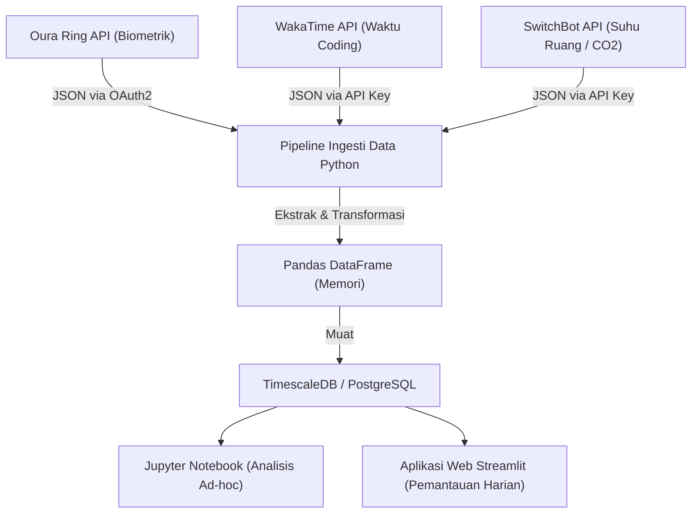
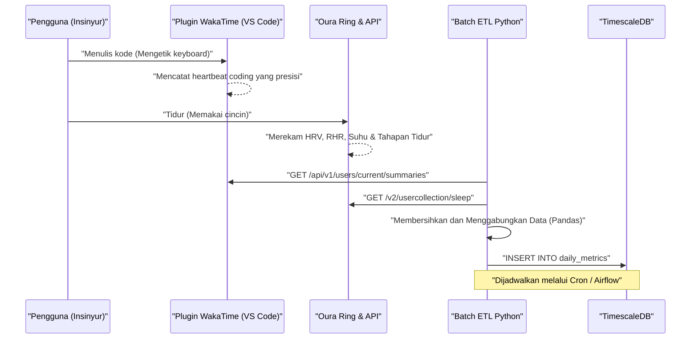
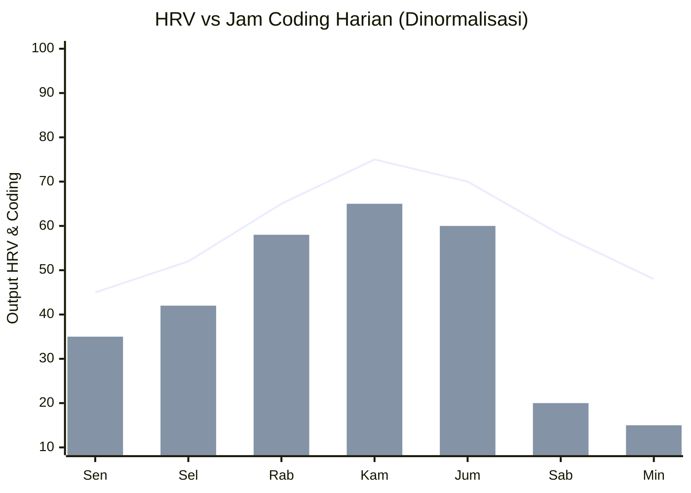

## 1. Pendahuluan: Titik Temu antara Rekayasa Perangkat Lunak dan Biohacking

Rekayasa perangkat lunak modern adalah kerja intelektual yang berat dengan beban kognitif yang ekstrem dan jam kerja yang panjang dengan posisi duduk (Sedentary Lifestyle). Mengejar tumpukan teknologi yang selalu berubah, berburu bug di sistem terdistribusi yang kompleks, dan tekanan tenggat waktu. Untuk mengatasi hal ini, sekadar mengandalkan "semangat" atau "tekad" saja tidak cukup. Diperlukan pendekatan untuk menyetel perangkat keras berupa tubuh kita sendiri layaknya melakukan debugging pada sistem, yaitu "Biohacking".

Dulu kita mungkin mengandalkan perasaan subjektif (heuristik) seperti "hari ini entah kenapa merasa baik/buruk", tetapi saat ini berkat meluasnya perangkat wearable berkinerja tinggi seperti Oura Ring, Apple Watch, dan Garmin, kita dapat memperoleh data biometrik selama 24 jam sehari, 365 hari setahun, secara non-invasif. Artikel ini akan menjelaskan cara memperoleh data biometrik (HRV, RHR, arsitektur tidur) dan data produktivitas (metrik coding dari WakaTime dll.) melalui API, serta menganalisis korelasinya menggunakan pendekatan ilmu data dengan Python dan Pandas. Selain itu, artikel ini juga akan mengupas secara sangat rinci berbagai tips kesehatan (health hack) untuk para insinyur yang didasarkan pada bukti ilmiah, seperti model matematis ritme sirkadian dan waktu optimal konsumsi kopi berdasarkan waktu paruh metabolisme kafein.

## 2. Yang Tidak Bisa Diukur Tidak Bisa Dikelola: Perangkat Keras Pengambil Data Biometrik

Sensor (perangkat wearable) untuk mengambil data biometrik memiliki kelebihannya masing-masing. Dalam manajemen kesehatan berbasis data, langkah pertama adalah memilih perangkat yang paling optimal sesuai dengan tujuannya.

### 2.1 Oura Ring (Generation 3 / 4)
Karena mengambil data langsung dari arteri jari, perangkat ini memiliki fitur akurasi pengukuran yang sangat tinggi untuk detak jantung saat tidur, variabilitas detak jantung (HRV), dan perubahan suhu permukaan tubuh dibandingkan dengan jam tangan pintar yang mengukur di pergelangan tangan. Jari memiliki jaringan kapiler yang padat, sehingga memungkinkan pengambilan data minim noise menggunakan sensor detak jantung optik (PPG: Photoplethysmography). Selain itu, karena REST API yang disediakan sangat lengkap sehingga memungkinkan ekspor data mentah dalam format JSON dengan mudah melalui OAuth2.0, perangkat ini dapat dikatakan sebagai perangkat yang paling "hackable" bagi para insinyur.

### 2.2 Apple Watch Series / Ultra
Unggul dalam pelacakan selama beraktivitas, serta pengukuran saturasi oksigen darah (SpO2) dan elektrokardiogram (ECG). Ini adalah perangkat paling kuat untuk memonitor tingkat aktivitas di siang hari dan untuk pengukuran HRV sesuai permintaan (on-demand) melalui aplikasi mindfulness (aplikasi pernapasan). Namun, ekspor data memerlukan perantara HealthKit, sehingga akses langsung dari Python dll. memerlukan langkah tambahan seperti ekspor CSV melalui aplikasi iOS (seperti AutoSleep atau HealthFit).

### 2.3 Garmin (Fenix / Forerunner)
Selain akurasi pelacakan GPS, indikator sisa energi eksklusif yang disebut "Body Battery" sangatlah baik. Indikator ini dihitung berdasarkan HRV dan tingkat stres. Data Garmin dapat diperoleh melalui Garmin Connect API, tetapi karena adanya batasan API yang ditujukan untuk perusahaan, pengembang perorangan perlu menggunakan pustaka open source atau memanfaatkan alat scraping yang dibuat oleh para sukarelawan.

Dalam artikel ini, penjelasan akan difokuskan pada data dari **Oura Ring**, yang merupakan puncak tertinggi dalam pelacakan tidur dan pemulihan serta sangat mudah diekstrak datanya melalui API, dan data dari **WakaTime**, yang mengukur waktu coding sebagai plugin untuk IDE (seperti VS Code dan IntelliJ).

## 3. Teori Dasar Data Biometrik: Ilmu Data tentang HRV dan RHR

Bukan sekadar indikator sederhana seperti "waktu tidur yang lama itu bagus", melainkan dari perspektif ilmu data, dua indikator berikut merupakan metrik utama dari "Pemulihan (Recovery)".

### 3.1 HRV (Variabilitas Detak Jantung) dan Pemodelan Saraf Otonom
Jantung tidak berdetak dalam ritme yang konstan layaknya metronom. Sebagai contoh, meskipun detak jantung adalah 60bpm, interval antara setiap detaknya (interval R-R) selalu berfluktuasi, misalnya "0,92 detik", "1,05 detik", atau "0,98 detik". Besarnya fluktuasi inilah yang dikuantifikasi menjadi HRV (Heart Rate Variability / Variabilitas Detak Jantung).

HRV secara langsung mencerminkan sistem saraf otonom, yaitu keseimbangan antara "saraf simpatik (gas)" dan "saraf parasimpatik (rem)". Saat dalam kondisi stres, kelelahan, atau setelah mengonsumsi alkohol, saraf simpatik akan mendominasi sehingga detak jantung menjadi lebih konstan dan HRV menurun. Sebaliknya, saat tubuh cukup rileks dan pulih, saraf parasimpatik (saraf vagus) menjadi dominan, dan karena detak jantung berfluktuasi secara dinamis seiring dengan pernapasan, maka HRV akan meningkat.

Ada dua pendekatan untuk menghitung HRV, yaitu domain waktu (Time-domain) dan domain frekuensi (Frequency-domain). Namun yang paling umum digunakan dalam analisis domain waktu dan juga diadopsi oleh Oura Ring dan Apple Watch adalah **RMSSD (Root Mean Square of Successive Differences)**. Ini adalah perhitungan akar kuadrat rata-rata dari selisih interval detak jantung yang berurutan (interval RR).

Jika diekspresikan secara ketat dengan rumus matematika, maka akan menjadi sebagai berikut.

$$ RMSSD = \sqrt{\frac{1}{N-1} \sum_{i=1}^{N-1} (RR_{i+1} - RR_i)^2} $$

Di mana,
- $N$ adalah total detak jantung yang diukur
- $RR_i$ adalah interval RR ke-$i$ (dalam milidetik)

Bagi seorang insinyur, jika HRV (RMSSD) saat bangun di pagi hari menurun drastis dibandingkan dengan baseline pribadi (rata-rata bergerak beberapa minggu terakhir), maka memungkinkan untuk membuat keputusan berbasis data seperti: "Hari ini sebaiknya menghindari desain arsitektur dengan beban kognitif tinggi atau deployment ke lingkungan produksi, dan mengalokasikan waktu untuk pengembangan kode tes atau pembuatan dokumentasi".

### 3.2 Detak Jantung Istirahat (RHR: Resting Heart Rate) dan Sinyal Pemulihan
RHR adalah jumlah detak jantung per menit saat tubuh berada dalam keadaan rileks sepenuhnya (biasanya saat tidur). Setelah mengonsumsi alkohol, makan berlebihan di larut malam, atau sebagai gejala awal suatu penyakit (seperti infeksi), ketika tubuh mengalokasikan energi untuk metabolisme internal atau respons kekebalan, RHR akan meningkat beberapa hingga belasan bpm di atas baseline.

Semakin rendah RHR, berarti otot jantung dapat memompa lebih banyak darah dalam satu denyut (volume sekuncup yang besar), yang menunjukkan tingginya kapasitas aerobik atau tingkat pemulihan dari kelelahan. Idealnya, bentuk kurva "seperti tempat tidur gantung (hammock)", di mana RHR mencapai nilai terendah pada paruh pertama tidur (bagian awal), adalah kondisi di mana terjadi pemulihan dengan kualitas terbaik.

## 4. Analisis Rinci Arsitektur Tidur

Yang menentukan performa otak seorang insinyur bukan hanya "kuantitas" tidur, melainkan juga "kualitasnya", yaitu arsitektur tidur (Sleep Architecture). Tidur dalam semalam biasanya mengulangi siklus 90-110 menit sebanyak 4-5 kali.

### 4.1 Tidur NREM Tahap 1-2 (Tidur Ringan / Light Sleep)
Ini adalah tahap persiapan di mana gelombang otak secara bertahap melambat dan tubuh mulai rileks. Tahap ini mencakup sekitar 50% dari total waktu tidur. Meskipun kontribusinya terhadap pemulihan kognitif tergolong kecil, namun ini menjadi jembatan penting untuk transisi ke tahap tidur dalam (deep sleep) berikutnya.

### 4.2 Tidur NREM Tahap 3 (Tidur Dalam / Deep Sleep / Slow Wave Sleep: SWS)
Gelombang delta (frekuensi rendah 0,5-2Hz) muncul dalam gelombang otak, dan ini adalah periode inti untuk pemulihan fisik tubuh. Hormon pertumbuhan disekresikan dalam jumlah besar, dan perbaikan sel berlangsung. Tahap ini sangat penting untuk memperkuat sistem kekebalan tubuh, dan berhubungan langsung tidak hanya dengan pemulihan kelelahan otot para atlet, tetapi juga perbaikan kelelahan mata serta otot leher dan bahu pada insinyur. Tidur dalam biasanya terkonsentrasi pada siklus paruh pertama tidur.

### 4.3 Tidur REM (Rapid Eye Movement)
Ini adalah kondisi di mana otak sama aktifnya seperti saat terjaga, tetapi otot-otot tubuh berada dalam keadaan lumpuh. Tidur REM ini sangat penting bagi para insinyur karena berperan dalam menyusun sintaks bahasa pemrograman baru atau konsep algoritma kompleks yang dipelajari di siang hari, serta mengonsolidasikannya ke dalam ingatan jangka panjang (Memory Consolidation). Tidur REM meningkatkan plastisitas saraf (Neuroplasticity), dan kemampuan pemecahan masalah yang kreatif (seperti kilasan "tiba-tiba menemukan solusi bug saat mandi") juga diperkuat oleh tidur REM. Tidur REM cenderung lebih panjang pada paruh kedua tidur (menjelang pagi).

Singkatnya, "memaksa diri bangun pagi dengan alarm dan mengurangi waktu tidur" berarti memangkas secara signifikan porsi tidur REM yang terkait dengan konsolidasi memori dan kreativitas, dan ini setara dengan "bug" fatal yang akan menurunkan performa secara drastis sebagai seorang insinyur.

## 5. Pemantauan Glukosa Berkelanjutan (CGM) dan Pertahanan terhadap Lonjakan (Spike)

Dalam beberapa tahun terakhir, penggunaan CGM (Continuous Glucose Monitor / Pemantau Glukosa Berkelanjutan) telah menjadi suatu keharusan di kalangan biohacker. Perangkat yang representatif antara lain FreeStyle Libre dan Dexcom.
Saat Anda mengonsumsi makanan (terutama karbohidrat dan gula), kadar glukosa dalam darah akan meningkat drastis (lonjakan gula darah / spike), dan kemudian anjlok (crash) akibat sekresi insulin dalam jumlah besar. Pada saat terjadi "crash" inilah timbul rasa kantuk yang parah (Brain Fog) dan penurunan konsentrasi. Rasa kantuk pada "jam 2 siang yang mematikan" setelah makan siang, kemungkinan besar bukan hanya karena pengaruh jam biologis, melainkan karena lonjakan gula darah akibat konsumsi berlebihan ramen atau nasi putih.

Kurva respons gula darah $G(t)$ dapat didekati sebagai model osilasi teredam berikut ini, yang merupakan selisih antara laju penyerapan karbohidrat yang dikonsumsi dan klirens oleh insulin.

$$ G(t) = G_{base} + \Delta G \cdot e^{-\alpha t} \sin(\beta t) $$

Di mana,
- $G_{base}$: Gula darah puasa (baseline)
- $\Delta G$: Amplitudo peningkatan gula darah akibat makanan
- $\alpha$: Koefisien redaman berdasarkan sensitivitas insulin dan laju metabolisme
- $\beta$: Komponen frekuensi dari osilasi
- $t$: Waktu yang berlalu setelah makan

Untuk mempertahankan performa insinyur, meminimalkan $\Delta G$ (amplitudo) sangatlah penting. Secara konkret, beberapa "hack" yang efektif antara lain "makan sayur (serat) terlebih dahulu", "menghindari karbohidrat olahan", dan "berjalan santai selama 15 menit setelah makan (mengaktifkan transporter GLUT4 untuk menyerap glukosa darah ke dalam otot tanpa bergantung pada insulin)".

## 6. Desain Arsitektur: Membangun Pipa Data Lokal (Local Data Pipeline)

Kita akan membangun sebuah pipa data lokal untuk menganalisis dan mengintegrasikan data biometrik dengan data produktivitas.
Diagram Mermaid (diagram alir) di bawah ini menunjukkan alur mulai dari pengambilan data dari API hingga visualisasinya di dasbor.



Dengan arsitektur ini, Anda akan dapat memantau korelasi antara kondisi fisik (input) dan performa coding (output) Anda sendiri secara otomatis setiap hari.

Selanjutnya, mari kita lihat urutan (sekuens) antar sistem secara lebih detail.



## 7. Ingesti Data menggunakan Python dan Pandas

Mari kita lihat proses aktual untuk mengambil data dari API Oura Ring dan WakaTime menggunakan skrip Python, dan mengintegrasikannya sebagai Pandas DataFrame. Kita akan membangun kode yang tangguh dan siap untuk penggunaan nyata.

```python
import requests
import pandas as pd
from datetime import datetime, timedelta
import os

# Variabel Lingkungan
OURA_TOKEN = os.getenv("OURA_ACCESS_TOKEN")
WAKATIME_API_KEY = os.getenv("WAKATIME_API_KEY")

def fetch_oura_sleep_data(start_date: str, end_date: str) -> pd.DataFrame:
    """Mengambil ringkasan tidur harian dari Oura Ring API v2."""
    url = "https://api.ouraring.com/v2/usercollection/sleep"
    params = {"start_date": start_date, "end_date": end_date}
    headers = {"Authorization": f"Bearer {OURA_TOKEN}"}
    
    response = requests.get(url, headers=headers, params=params)
    response.raise_for_status() # Menimbulkan pengecualian untuk error 4xx/5xx
    data = response.json().get("data", [])
    
    if not data:
        return pd.DataFrame()
        
    df = pd.json_normalize(data)
    # Mengekstrak nilai yang bersarang dalam atau memilih kolom penting
    df = df[['day', 'score', 'time_in_bed', 'total_sleep_duration', 
             'average_hrv', 'lowest_heart_rate', 
             'deep_sleep_duration', 'rem_sleep_duration']]
             
    # Mengonversi tanggal ke objek datetime dan mengaturnya sebagai indeks
    df['day'] = pd.to_datetime(df['day'])
    df.set_index('day', inplace=True)
    return df

def fetch_wakatime_data(start_date: str, end_date: str) -> pd.DataFrame:
    """Mengambil ringkasan durasi coding dari WakaTime API."""
    url = "https://wakatime.com/api/v1/users/current/summaries"
    params = {"start": start_date, "end": end_date, "api_key": WAKATIME_API_KEY}
    
    response = requests.get(url, params=params)
    response.raise_for_status()
    data = response.json().get("data", [])
    
    records = []
    for day_data in data:
        date_str = day_data['range']['date']
        # Mengekstrak total detik yang dihabiskan untuk coding
        total_seconds = day_data['grand_total']['total_seconds']
        records.append({'day': date_str, 'coding_hours': total_seconds / 3600.0})
        
    df = pd.DataFrame(records)
    if not df.empty:
        df['day'] = pd.to_datetime(df['day'])
        df.set_index('day', inplace=True)
    return df

if __name__ == "__main__":
    # Mengambil data untuk 60 hari terakhir
    end = datetime.now().strftime("%Y-%m-%d")
    start = (datetime.now() - timedelta(days=60)).strftime("%Y-%m-%d")
    
    oura_df = fetch_oura_sleep_data(start, end)
    waka_df = fetch_wakatime_data(start, end)
    
    # Menggabungkan dataset pada indeks 'day' menggunakan inner join
    merged_df = pd.merge(oura_df, waka_df, left_index=True, right_index=True, how='inner')
    
    # Menyimpan data mentah ke CSV/DB
    merged_df.to_csv("health_productivity_raw.csv")
    print(f"Ingested {len(merged_df)} days of data.")
```

## 8. Pra-pemrosesan Data dan Rekayasa Fitur (Feature Engineering)

Sangat berisiko jika data mentah yang diperoleh langsung digunakan untuk analisis. Perlu dilakukan penanganan nilai yang hilang (Missing Values) karena lupa mengisi daya perangkat, serta pembuatan indikator baru yang bermakna (Rekayasa Fitur / Feature Engineering).

```python
def engineer_features(df: pd.DataFrame) -> pd.DataFrame:
    """Menerapkan rekayasa fitur dan pembersihan pada dataframe yang digabung."""
    df = df.copy()
    
    # 1. Menangani nilai yang hilang (misalnya, forward fill)
    df.fillna(method='ffill', inplace=True)
    
    # 2. Menghitung Efisiensi Tidur
    # Rumus: (Total Waktu Tidur / Waktu di Tempat Tidur) * 100
    df['sleep_efficiency_pct'] = (df['total_sleep_duration'] / df['time_in_bed']) * 100
    
    # 3. Menghitung Rasio Tahap Tidur
    df['rem_ratio'] = df['rem_sleep_duration'] / df['total_sleep_duration']
    df['deep_ratio'] = df['deep_sleep_duration'] / df['total_sleep_duration']
    
    # 4. Menghitung Rata-rata Bergerak 7 Hari (Rolling Mean) untuk menghaluskan noise harian
    df['hrv_7d_ma'] = df['average_hrv'].rolling(window=7).mean()
    df['rhr_7d_ma'] = df['lowest_heart_rate'].rolling(window=7).mean()
    
    # 5. Menghitung deviasi harian dari baseline
    df['hrv_deviation'] = df['average_hrv'] - df['hrv_7d_ma']
    
    # 6. Normalisasi target untuk Machine Learning (Opsional)
    from sklearn.preprocessing import MinMaxScaler
    scaler = MinMaxScaler()
    df[['hrv_scaled', 'coding_scaled']] = scaler.fit_transform(df[['average_hrv', 'coding_hours']])
    
    # Menghapus baris dengan NaN yang dihasilkan oleh rolling window
    df.dropna(inplace=True)
    
    return df

processed_df = engineer_features(merged_df)
```

## 9. Analisis Korelasi: Titik Temu antara Produktivitas dan Metrik Kesehatan

Berdasarkan data yang telah diproses sebelumnya, kita akan menganalisis hubungan antara indikator kesehatan dan produktivitas coding. Sebagai hipotesis, dapat dibayangkan bahwa "semakin tinggi HRV (hari di mana saraf otonom seimbang dan tubuh pulih), semakin lama konsentrasi bertahan dan waktu coding menjadi lebih panjang, atau lebih mampu menyelesaikan tugas-tugas yang lebih kompleks."


*(Catatan: Grafik garis menunjukkan deviasi dari baseline HRV yang dinormalisasi, sedangkan grafik batang menunjukkan waktu coding dari WakaTime. Terlihat adanya korelasi di mana output coding dimaksimalkan pada hari Rabu hingga Jumat, saat pemulihan yang cukup telah tercapai)*

Kita akan melakukan perhitungan koefisien korelasi (Koefisien Korelasi Product-Moment Pearson $r$) menggunakan Pandas, dan uji signifikansi statistik (nilai p) menggunakan SciPy.

```python
import scipy.stats as stats

# Memilih kolom numerik untuk matriks korelasi
cols_of_interest = ['average_hrv', 'score', 'deep_sleep_duration', 'rem_sleep_duration', 'coding_hours']
correlation_matrix = processed_df[cols_of_interest].corr()

print("Correlation with Coding Hours:")
print(correlation_matrix['coding_hours'].sort_values(ascending=False))

# Menghitung koefisien korelasi Pearson dan nilai p untuk Tidur REM dan Jam Coding
r, p_value = stats.pearsonr(processed_df['rem_sleep_duration'], processed_df['coding_hours'])
print(f"REM Sleep vs Coding Hours: r = {r:.3f}, p-value = {p_value:.4f}")
```

Dalam banyak kasus, terdapat korelasi positif yang signifikan ($p < 0.05$) antara `average_hrv` atau `rem_sleep_duration` dengan `coding_hours`. Secara khusus, lamanya tidur REM pada malam sebelumnya dilaporkan berdampak kuat terhadap "waktu yang dibutuhkan untuk memecahkan error (debugging)" dan "produktivitas" pada hari tersebut, seperti yang dilaporkan dalam banyak komunitas pelacakan diri (Quantified Self) para insinyur.

## 10. Model Matematis Ritme Sirkadian dan Optimalisasi Puncak Kognitif

Manusia dilengkapi dengan jam biologis siklus sekitar 24 jam yang disebut ritme sirkadian (Circadian Rhythm). Ritme inilah yang membuat fluktuasi pada suhu tubuh, sekresi hormon (lonjakan kortisol di pagi hari dan sekresi melatonin di malam hari), serta "kemampuan kognitif".

Fluktuasi ritme sirkadian sering kali direpresentasikan secara pendekatan dengan menggunakan model matematis berupa kurva kosinus (Model Cosinor), dan perubahan metrik biologis ini dapat dirumuskan sebagai berikut:

$$ y(t) = M + A \cos\left(\frac{2\pi}{24}(t - \phi)\right) + e(t) $$

- $y(t)$: Indikator biometrik pada waktu $t$ (contoh: suhu inti tubuh atau tingkat kewaspadaan)
- $M$: MESOR (Midline Estimating Statistic of Rhythm) - Nilai tengah ritme (tingkat rata-rata)
- $A$: Amplitudo (Amplitude) - Besaran fluktuasi
- $\phi$: Acrophase - Fase saat mencapai puncak (waktu)
- $e(t)$: Suku kesalahan akibat faktor lingkungan dll.

Dalam dunia rekayasa (engineering), arti dari persamaan ini adalah "Waktu di mana performa (tingkat kewaspadaan) mencapai puncaknya dalam sehari ($\phi$) telah ditentukan secara biologis, dan pada waktu tersebut Anda harus mengalokasikan tugas-tugas dengan beban kognitif tertinggi (memperbaiki bug yang rumit, mendesain arsitektur baru)".

Bagi penganut kronotipe pagi (Morning Lark) pada umumnya, puncak kognitif pertama akan muncul 2-4 jam setelah bangun tidur (misalnya jam 9-11 pagi). Setelah itu, sekitar jam 2 siang akan terjadi lembah ritme sirkadian (Post-lunch dip), lalu puncak kecil lainnya akan datang di sore hari. Mengidentifikasi waktu puncak Anda ($\phi$) dari tingkat aktivitas data wearable atau tingkat konsentrasi subjektif, serta melindungi waktu tersebut dengan metode "time blocking" di jadwal seperti Google Calendar, merupakan health hack yang paling luar biasa. Memasukkan meeting tak penting di waktu puncak ibarat mengalokasikan core CPU dengan kinerja terbaik untuk idle process.

## 11. Farmakokinetik Kafein dan Waktu Konsumsi yang Optimal

Insinyur dan kopi memiliki hubungan yang tak terpisahkan, tetapi konsumsi kafein yang berlebihan atau pada waktu yang terlalu larut akan memblokir reseptor adenosin di otak dan merusak "Tidur Dalam (Deep Sleep)" di malam hari. Walaupun secara subjektif merasa sudah tidur, saat melihat data dari Oura Ring dapat terlihat bahwa detak jantung tidak menurun dan persentase tidur dalam turun drastis.

Pembuangan kafein dari dalam tubuh mengikuti kinetika orde pertama (First-order kinetics). Dengan kata lain, konsentrasi dalam darah akan meluruh secara eksponensial.

$$ C(t) = C_0 e^{-k t} $$

Di mana,
- $C(t)$: Konsentrasi kafein dalam darah setelah waktu $t$ berlalu
- $C_0$: Konsentrasi awal (konsentrasi maksimum sesaat setelah dikonsumsi)
- $k$: Konstanta laju eliminasi
- $t$: Waktu yang berlalu sejak konsumsi (jam)

Konstanta laju eliminasi $k$ diekspresikan menggunakan waktu paruh kafein ($t_{1/2}$) sebagai berikut:

$$ k = \frac{\ln(2)}{t_{1/2}} $$

Untuk orang dewasa yang sehat, meskipun bergantung pada genetika individu (gen CYP1A2), waktu paruh kafein $t_{1/2}$ diperkirakan sekitar **5-6 jam**.
Sebagai contoh, misalkan Anda meminum secangkir kopi tetes (sekitar 150mg kafein) pada jam 3 sore ($C_0 = 150$). Dengan asumsi waktu paruh adalah 5,5 jam, maka $k \approx 0.126$.
Jika kita menghitung konsentrasi kafein yang tersisa dalam tubuh pada waktu tidur yaitu jam 11 malam (8 jam kemudian):

$$ C(8) = 150 \times e^{-0.126 \times 8} = 150 \times e^{-1.008} \approx 150 \times 0.365 = 54.75 \text{ mg} $$

Artinya, pada saat waktu tidur tiba, masih tersisa 54mg kafein (sedikit lebih dari 1 shot espresso) di dalam tubuh Anda, dan ini akan berdampak buruk secara langsung pada arsitektur tidur.
Kesimpulan berbasis data yang ditarik dari model farmakokinetik ini adalah: **"Untuk memastikan tidur yang berkualitas tinggi, konsumsi kafein harus dimulai paling cepat 90 menit setelah bangun tidur (setelah lonjakan kortisol mereda), dan harus dihentikan sepenuhnya selambat-lambatnya jam 2 siang (9-10 jam sebelum waktu tidur)".**

## 12. Hacking Variabel Lingkungan (Lux, Suhu, CO2)

Selain sistem internal berupa tubuh sendiri, mengoptimalkan variabel lingkungan eksternal (Environment Variables) juga tak kalah penting.

### 12.1 Memprogram Lingkungan Cahaya (Lux)
Cahaya adalah "Zeitgeber" (pemberi isyarat waktu) terkuat yang mereset ritme sirkadian. Di pagi hari, saat cahaya matahari sebesar sekitar 100.000 Lux masuk ke sel fotoreseptor (ipRGC) di retina, sekresi melatonin akan berhenti dan timer akan direset. Sebaliknya, di malam hari sangat penting untuk memblokir cahaya biru (blue light) agar tidak menghambat sekresi melatonin. Selain menurunkan suhu warna layar monitor menggunakan perangkat lunak seperti f.lux, sangat efektif untuk membuat skrip yang mengendalikan pencahayaan pintar (seperti Philips Hue) melalui API guna mengurangi kecerahan dan suhu warna ruangan secara otomatis seiring dengan terbenamnya matahari.

### 12.2 Pengendalian Suhu Kamar Tidur dan Latensi Tidur (Sleep Latency)
Manusia mulai tertidur ketika suhu inti tubuhnya (Core Body Temperature) turun. Dengan menjaga suhu kamar tidur dalam kondisi sejuk pada 18-19 derajat Celcius, serta mandi air hangat 90 menit sebelum tidur untuk menaikkan suhu inti tubuh sementara waktu, lalu masuk ke tempat tidur pada saat suhu tersebut turun drastis, latensi tidur (Sleep Latency: waktu yang dibutuhkan sejak berbaring di tempat tidur hingga tertidur) dapat dipersingkat secara dramatis dan tidur dalam dapat dimaksimalkan.

### 12.3 Konsentrasi CO2 dan Penurunan Fungsi Kognitif
Saat menambahkan API Hub SwitchBot atau Weather Station Netatmo ke dalam pipa data, dapat terlihat adanya korelasi negatif yang jelas antara konsentrasi karbon dioksida (CO2) di dalam ruangan dan produktivitas.
Seperti yang ditunjukkan oleh penelitian dari Universitas Harvard dan lainnya, ketika konsentrasi CO2 melebihi 1000ppm, fungsi kognitif (terutama kemampuan pengambilan keputusan strategis) mulai menurun secara signifikan, dan ketika melebihi 2000ppm, hal itu menyebabkan penurunan performa yang parah. Bekerja jarak jauh (remote work) di ruangan yang tertutup rapat selama musim dingin akan menurunkan performa Anda tanpa disadari.

```python
# Pseudo-code untuk ventilasi ruang cerdas menggunakan Home Assistant / SwitchBot API
import requests

def check_and_ventilate():
    # Mendapatkan tingkat CO2 saat ini dari API Netatmo/SwitchBot
    co2_ppm = get_sensor_data("co2_sensor_id")
    
    if co2_ppm > 1000:
        print(f"Peringatan: Tingkat CO2 tinggi ({co2_ppm} ppm). Risiko penurunan kognitif.")
        # Memicu smart plug untuk menyalakan kipas ventilasi
        turn_on_smart_plug("ventilation_fan_id")
        # Mengirim notifikasi ke Slack/Discord
        send_notification("Kipas ventilasi telah dinyalakan. Konsentrasi CO2 tinggi.")
    elif co2_ppm < 600:
        turn_off_smart_plug("ventilation_fan_id")
```
Dengan mengeksekusi skrip semacam ini secara berkala menggunakan Cron, sebuah sistem pengendalian lingkungan otonom yang selalu menjaga konsentrasi oksigen optimal pun akan terbentuk.

## 13. Kesimpulan: CI/CD pada Sistem Tubuh Manusia

Cobalah untuk menganggap tubuh Anda sendiri sebagai sebuah sistem terdistribusi yang kompleks. Perangkat wearable (Oura Ring) adalah metrics exporter (Prometheus) untuk pemantauan, skrip Python/Pandas adalah pipa analisis log (Logstash/Fluentd), dan perubahan kondisi fisik serta performa sehari-hari adalah kesehatan sistem yang ditampilkan di dasbor (Grafana/Streamlit).

"Bekerja dengan memotong waktu tidur" sama halnya dengan memaksakan penambahan fitur tanpa menghiraukan utang teknis (Technical Debt). Dalam jangka pendek, mungkin Anda bisa mengejar waktu rilis, tetapi dalam jangka panjang, hal itu pasti akan menyebabkan kerusakan sistem (burnout, masalah kesehatan serius, dan depresi).

Memantau HRV, memeriksa tren RHR, dan mengoptimalkan arsitektur tidur. Lalu, sembari melihat korelasinya dengan data produktivitas dari WakaTime, Anda melakukan fine-tuning (penyetelan halus) pada "hyperparameter" seperti diet (makanan), olahraga, tidur, dan lingkungan dari hari ke hari. Ini tidak lain adalah proses **CI/CD (Continuous Integration / Continuous Delivery)** pada tubuh manusia.

Mari manfaatkan ilmu data dan API secara maksimal untuk merekayasa kondisi kesehatan yang mampu memberikan performa terbaik. Karena, kualitas kode yang Anda tulis berhubungan langsung dengan seberapa sehat sistem biometrik Anda sendiri.

---
*Sangkalan (Disclaimer): Artikel ini merangkum eksperimen pribadi dan pendekatan ilmu data dari penulis, dan tidak ditujukan untuk memberikan nasihat medis. Jika Anda mengalami kondisi kesehatan yang buruk atau gangguan tidur yang berkelanjutan, harap konsultasikan dengan institusi medis profesional.*
