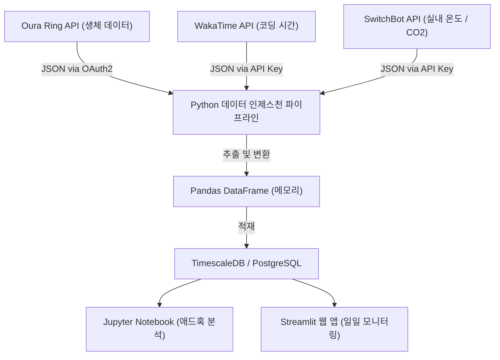
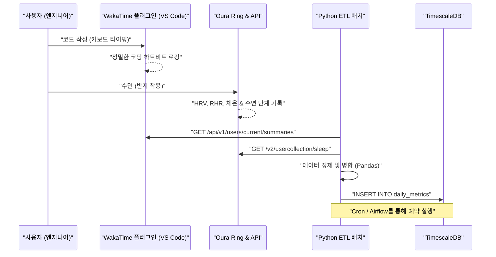
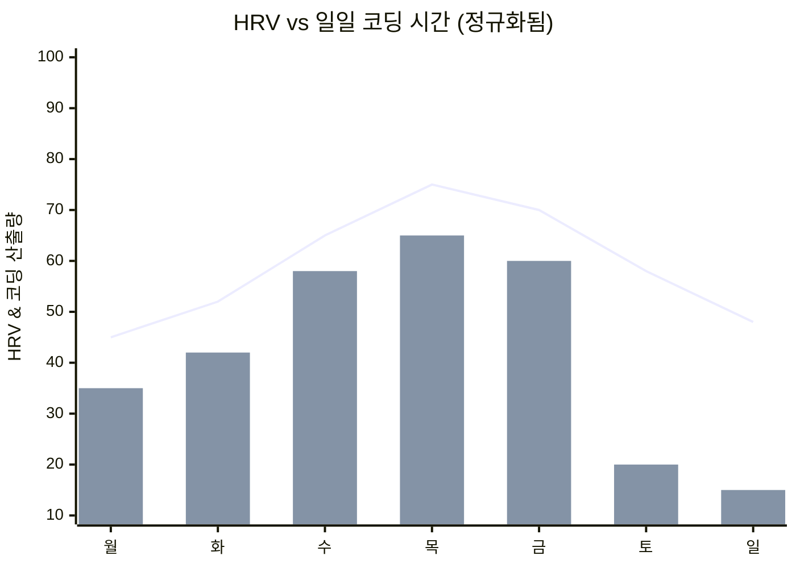

## 1. 서론: 소프트웨어 엔지니어링과 바이오해킹의 교차점

현대의 소프트웨어 엔지니어링은 극도의 인지적 부하와 장시간의 좌식 생활(Sedentary Lifestyle)을 동반하는 가혹한 지식 노동입니다. 끊임없이 변화하는 기술 스택을 따라잡고, 복잡한 분산 시스템의 버그를 추적하며, 마감 기한의 압박에 시달립니다. 이를 극복하기 위해서는 단순히 '기합'이나 '근성'으로 버티는 것이 아니라, 시스템을 디버깅하듯 자신의 신체라는 하드웨어를 튜닝하는 접근법, 즉 '바이오해킹(Biohacking)'이 필수적입니다.

과거에는 '오늘은 왠지 컨디션이 좋다/나쁘다'와 같은 주관적인 감각(휴리스틱)에 의존했지만, 현대에는 Oura Ring, Apple Watch, Garmin 등 고성능 웨어러블 기기가 보급되면서 생체 데이터를 24시간 365일 비침습적으로 수집할 수 있게 되었습니다. 본 기사에서는 생체 데이터(HRV, RHR, 수면 아키텍처)와 생산성 데이터(WakaTime 등을 통한 코딩 메트릭스)를 API를 통해 가져와 Python과 Pandas를 사용하여 데이터 과학적 접근으로 상관 분석을 수행하는 방법을 설명합니다. 또한, 일주기 리듬(Circadian Rhythm)의 수리 모델이나 카페인 대사의 반감기에 기반한 최적의 커피 섭취 타이밍 등 과학적 근거에 바탕을 둔 엔지니어를 위한 건강 핵을 매우 상세히 파헤쳐 봅니다.

## 2. 측정할 수 없는 것은 관리할 수 없다: 생체 데이터 수집 하드웨어

생체 데이터를 수집하기 위한 센서(웨어러블 기기)는 각각 특화된 영역이 있습니다. 데이터 주도적인 건강 관리에서는 목적에 따라 최적의 기기를 선택하는 것이 첫걸음입니다.

### 2.1 Oura Ring (Generation 3 / 4)
손가락 동맥에서 직접 데이터를 수집하기 때문에, 손목에서 측정하는 스마트워치에 비해 수면 중 심박수나 심박 변이도(HRV), 체표온 변화의 측정 정확도가 매우 높은 것이 특징입니다. 손가락에는 모세혈관이 밀집해 있어 광학식 심박 센서(PPG: Photoplethysmography)를 통해 노이즈가 적은 데이터를 얻을 수 있습니다. 또한 REST API가 잘 갖춰져 있어 OAuth 2.0을 통해 JSON 형식의 원시 데이터를 쉽게 내보낼 수 있으므로, 엔지니어에게 있어 가장 해킹하기 좋은(Hackable) 기기라고 할 수 있습니다.

### 2.2 Apple Watch Series / Ultra
활동 중 트래킹이나 혈중 산소 포화도(SpO2), 심전도(ECG) 측정에 뛰어납니다. 낮 동안의 활동량이나 마음챙김 앱(심호흡 앱)을 통한 온디맨드 HRV 측정에 있어서는 최강의 기기입니다. 단, 데이터 내보내기는 HealthKit을 거쳐야 하며, Python 등에서 직접 접근하려면 iOS 앱(AutoSleep이나 HealthFit 등)을 통해 CSV로 내보내는 등 한 단계의 쿠션이 필요합니다.

### 2.3 Garmin (Fenix / Forerunner)
GPS 트래킹의 정확도에 더해 '바디 배터리(Body Battery)'라고 불리는 독자적인 에너지 잔량 지표가 우수합니다. 이는 HRV와 스트레스 수준을 기반으로 산출됩니다. Garmin은 Garmin Connect API를 통해 데이터를 가져올 수 있지만, 기업용 API의 장벽이 있어 개인 개발자로서는 오픈소스 라이브러리를 사용하거나 커뮤니티가 만든 스크래핑 도구를 활용해야 합니다.

본 기사에서는 수면 및 회복 트래킹에서 최고 수준이며 API를 통한 데이터 추출이 매우 쉬운 **Oura Ring**의 데이터와, IDE(VS Code나 IntelliJ 등)의 플러그인으로서 코딩 시간을 측정하는 **WakaTime**의 데이터를 중심으로 설명을 진행합니다.

## 3. 생체 데이터의 기초 이론: HRV와 RHR의 데이터 과학

단순히 '수면 시간이 길어서 좋다'는 식의 단순한 지표가 아니라, 데이터 과학 관점에서는 다음 두 가지 지표가 '회복(Recovery)'의 핵심 메트릭스(Master Metrics)가 됩니다.

### 3.1 HRV(심박 변이도: Heart Rate Variability)와 자율신경 모델링
심장은 메트로놈처럼 일정한 리듬으로 뛰지 않습니다. 예를 들어 심박수가 60bpm이더라도 1박 1박의 간격(R-R 간격)은 '0.92초', '1.05초', '0.98초'와 같이 항상 요동치고 있습니다. 이 요동의 크기를 수치화한 것이 HRV(심박 변이도)입니다.

HRV는 자율신경계, 즉 '교감신경(액셀)'과 '부교감신경(브레이크)'의 균형을 직접적으로 반영합니다. 스트레스 상태, 과로, 혹은 음주 후 등에는 교감신경이 우위가 되어 심장 박동이 일정해지고 HRV는 저하됩니다. 반대로 충분히 휴식하고 회복하는 상태에서는 부교감신경(미주신경)이 우위가 되어 호흡에 맞춰 심박이 역동적으로 변동하므로 HRV가 높아집니다.

HRV 계산에는 시간 영역(Time-domain)과 주파수 영역(Frequency-domain) 두 가지 접근법이 있는데, 시간 영역 분석에서 가장 일반적으로 사용되며 Oura Ring이나 Apple Watch에서도 채택하고 있는 것이 **RMSSD (Root Mean Square of Successive Differences)** 입니다. 이는 연속하는 심박 간격(RR 간격) 차이의 제곱평균제곱근을 구하는 것입니다.

수식으로 엄밀하게 나타내면 다음과 같습니다.

$$ RMSSD = \sqrt{\frac{1}{N-1} \sum_{i=1}^{N-1} (RR_{i+1} - RR_i)^2} $$

여기서,
- $N$ 은 측정된 총 심박수
- $RR_i$ 는 $i$ 번째 RR 간격(밀리초)

엔지니어 입장에서는 아침에 일어났을 때의 HRV(RMSSD)가 개인의 기준선(최근 몇 주간의 이동 평균)보다 크게 떨어져 있는 경우, "오늘은 인지적 부하가 높은 아키텍처 설계나 운영 환경 배포는 피하고, 테스트 코드 확충이나 문서 작성에 시간을 할애해야 하는 날이다"라는 데이터 주도적인 의사결정이 가능해집니다.

### 3.2 안정 시 심박수(RHR: Resting Heart Rate)와 회복의 신호
RHR은 신체가 완전히 이완된 상태(보통 수면 중)의 1분당 심박수입니다. 음주 후나 늦은 시간의 과식, 혹은 질병(감염증 등)의 초기 증상으로 신체가 체내 대사나 면역 반응에 에너지를 할애하고 있을 때 RHR은 기준선보다 몇 bpm에서 십여 bpm 상승합니다.

RHR이 낮을수록 심근이 한 번의 박동으로 많은 혈액을 내보낼 수 있음(1회 심박출량이 많음)을 의미하며, 유산소 운동 능력의 높음이나 피로로부터의 회복 정도를 나타냅니다. 이상적으로는 수면의 첫 절반(전반부)에 RHR이 최저치에 도달하는 '해먹(Hammock)형' 곡선을 그리는 것이 가장 질 높은 회복이 이루어지고 있는 상태입니다.

## 4. 수면 아키텍처의 상세 분석

엔지니어의 두뇌 퍼포먼스를 결정짓는 것은 수면의 '양'뿐만 아니라 '질', 즉 수면 아키텍처(Sleep Architecture)입니다. 하룻밤의 수면은 보통 90~110분의 주기를 4~5회 반복합니다.

### 4.1 NREM 수면 1~2단계 (얕은 수면 / Light Sleep)
뇌파가 점차 느려지고 신체가 이완되기 시작하는 준비 단계입니다. 전체 수면의 약 50%를 차지합니다. 인지적 회복에 기여하는 바는 적지만, 다음 깊은 수면 단계로 넘어가기 위한 중요한 다리 역할을 합니다.

### 4.2 NREM 수면 3단계 (깊은 수면 / Deep Sleep / Slow Wave Sleep: SWS)
뇌파에 델타파(0.5~2Hz의 저주파)가 나타나는, 물리적인 육체 회복의 핵심이 되는 시간대입니다. 성장 호르몬이 대량으로 분비되어 세포 복구가 이루어집니다. 면역 체계 강화에도 필수적이며, 운동선수의 근육 피로 회복뿐만 아니라 엔지니어의 눈의 피로나 목, 어깨 근육의 회복에도 직결됩니다. 깊은 수면은 보통 수면 전반부 주기에 집중됩니다.

### 4.3 REM 수면 (Rapid Eye Movement)
뇌가 깨어 있을 때와 거의 비슷할 정도로 활발하게 움직이는 상태이지만, 신체의 근육은 마비 상태에 있습니다. 엔지니어에게 극히 중요한 것이 이 REM 수면으로, 낮 동안 배운 새로운 프로그래밍 언어의 문법이나 복잡한 알고리즘 개념을 뇌 속에서 정리하여 장기 기억으로 정착(Memory Consolidation)시키는 역할을 담당합니다. 신경 가소성(Neuroplasticity)을 높이고, 창의적인 문제 해결 능력("샤워를 하던 중 갑자기 버그의 해결책이 떠오르는" 것과 같은 영감)도 REM 수면을 통해 강화됩니다. REM 수면은 수면 후반부(새벽)에 길어지는 경향이 있습니다.

즉, "알람으로 억지로 일찍 일어나 수면 시간을 줄이는" 것은 기억 정착과 창의성에 관여하는 REM 수면을 국소적으로 크게 깎아내는 것을 의미하며, 엔지니어로서의 퍼포먼스를 현저히 저하시키는 치명적인 버그와 같은 행위입니다.

## 5. 연속 혈당 측정(CGM)과 스파이크 방어

최근 바이오해커들 사이에서 필수로 여겨지는 것이 CGM(Continuous Glucose Monitor: 연속 혈당 측정기)의 도입입니다. 대표적인 기기로 FreeStyle Libre와 Dexcom이 있습니다.
식사(특히 탄수화물이나 당분)를 섭취하면 혈중 포도당 농도가 급격히 상승(혈당 스파이크)하고, 그 후 인슐린의 대량 분비로 인해 급강하(크래시)합니다. 이 '크래시' 타이밍에 강렬한 졸음(Brain Fog)이나 집중력 저하가 유발됩니다. 점심 식사 후의 "마의 오후 2시" 졸음은 단순한 생체 시계의 영향뿐만 아니라 라면이나 흰쌀밥 과다 섭취로 인한 혈당 스파이크가 원인일 가능성이 높습니다.

혈당의 반응 곡선 $G(t)$ 는 섭취한 당질의 흡수 속도와 인슐린에 의한 클리어런스의 차이로서 다음과 같은 감쇠 진동 모델로 근사적으로 표현할 수 있습니다.

$$ G(t) = G_{base} + \Delta G \cdot e^{-\alpha t} \sin(\beta t) $$

여기서,
- $G_{base}$: 공복 혈당치(기준선)
- $\Delta G$: 식사에 의한 혈당 상승의 진폭
- $\alpha$: 인슐린 민감도나 대사 속도에 기반한 감쇠 계수
- $\beta$: 진동의 주파수 성분
- $t$: 식후 경과 시간

엔지니어의 퍼포먼스를 유지하기 위해서는 $\Delta G$(진폭)를 최소한으로 억제하는 것이 중요합니다. 구체적으로는 "채소(식이섬유)를 먼저 먹는다", "정제된 탄수화물을 피한다", "식후에 15분 정도 가볍게 산책한다(GLUT4 수송체를 활성화시켜 인슐린 비의존적으로 혈당을 근육으로 흡수시킨다)"와 같은 방법(Hack)이 유효합니다.

## 6. 아키텍처 설계: 로컬 데이터 파이프라인 구축

생체 데이터와 생산성 데이터를 통합 분석하기 위한 로컬 데이터 파이프라인을 구축합니다.
아래의 Mermaid 다이어그램(플로차트)은 API에서 데이터를 가져와 대시보드에 시각화하기까지의 흐름을 보여줍니다.



이 아키텍처를 통해 매일 자동으로 자신의 컨디션(인풋)과 코딩 퍼포먼스(아웃풋)의 상관관계를 모니터링할 수 있게 됩니다.

또한, 시스템 간의 시퀀스를 자세히 살펴보겠습니다.



## 7. Python과 Pandas를 이용한 데이터 인제스트

실제로 Python 스크립트를 사용하여 Oura Ring과 WakaTime의 API에서 데이터를 가져와 Pandas DataFrame으로 통합하는 과정을 살펴보겠습니다. 실제 운영 환경을 견딜 수 있는 견고한 코드를 작성합니다.

```python
import requests
import pandas as pd
from datetime import datetime, timedelta
import os

# Environment Variables
OURA_TOKEN = os.getenv("OURA_ACCESS_TOKEN")
WAKATIME_API_KEY = os.getenv("WAKATIME_API_KEY")

def fetch_oura_sleep_data(start_date: str, end_date: str) -> pd.DataFrame:
    """Fetch daily sleep summary from Oura Ring API v2."""
    url = "https://api.ouraring.com/v2/usercollection/sleep"
    params = {"start_date": start_date, "end_date": end_date}
    headers = {"Authorization": f"Bearer {OURA_TOKEN}"}
    
    response = requests.get(url, headers=headers, params=params)
    response.raise_for_status() # Raise exception for 4xx/5xx errors
    data = response.json().get("data", [])
    
    if not data:
        return pd.DataFrame()
        
    df = pd.json_normalize(data)
    # Extract deeply nested values or select essential columns
    df = df[['day', 'score', 'time_in_bed', 'total_sleep_duration', 
             'average_hrv', 'lowest_heart_rate', 
             'deep_sleep_duration', 'rem_sleep_duration']]
             
    # Convert dates to datetime objects and set as index
    df['day'] = pd.to_datetime(df['day'])
    df.set_index('day', inplace=True)
    return df

def fetch_wakatime_data(start_date: str, end_date: str) -> pd.DataFrame:
    """Fetch coding duration summaries from WakaTime API."""
    url = "https://wakatime.com/api/v1/users/current/summaries"
    params = {"start": start_date, "end": end_date, "api_key": WAKATIME_API_KEY}
    
    response = requests.get(url, params=params)
    response.raise_for_status()
    data = response.json().get("data", [])
    
    records = []
    for day_data in data:
        date_str = day_data['range']['date']
        # Extract total seconds spent coding
        total_seconds = day_data['grand_total']['total_seconds']
        records.append({'day': date_str, 'coding_hours': total_seconds / 3600.0})
        
    df = pd.DataFrame(records)
    if not df.empty:
        df['day'] = pd.to_datetime(df['day'])
        df.set_index('day', inplace=True)
    return df

if __name__ == "__main__":
    # Fetch data for the last 60 days
    end = datetime.now().strftime("%Y-%m-%d")
    start = (datetime.now() - timedelta(days=60)).strftime("%Y-%m-%d")
    
    oura_df = fetch_oura_sleep_data(start, end)
    waka_df = fetch_wakatime_data(start, end)
    
    # Merge datasets on 'day' index using inner join
    merged_df = pd.merge(oura_df, waka_df, left_index=True, right_index=True, how='inner')
    
    # Save raw data to CSV/DB
    merged_df.to_csv("health_productivity_raw.csv")
    print(f"Ingested {len(merged_df)} days of data.")
```

## 8. 데이터 전처리와 피처 엔지니어링

수집한 원시 데이터를 그대로 분석에 사용하는 것은 위험합니다. 기기 충전을 잊어서 생긴 결측치(Missing Values) 처리나 의미 있는 새로운 지표(피처 엔지니어링: Feature Engineering)를 생성해야 합니다.

```python
def engineer_features(df: pd.DataFrame) -> pd.DataFrame:
    """Apply feature engineering and cleaning to the merged dataframe."""
    df = df.copy()
    
    # 1. Handle missing values (e.g., forward fill)
    df.fillna(method='ffill', inplace=True)
    
    # 2. Calculate Sleep Efficiency
    # Formula: (Total Sleep Time / Time in Bed) * 100
    df['sleep_efficiency_pct'] = (df['total_sleep_duration'] / df['time_in_bed']) * 100
    
    # 3. Calculate Sleep Stage Ratios
    df['rem_ratio'] = df['rem_sleep_duration'] / df['total_sleep_duration']
    df['deep_ratio'] = df['deep_sleep_duration'] / df['total_sleep_duration']
    
    # 4. Calculate 7-day Moving Averages (Rolling Mean) to smooth out daily noise
    df['hrv_7d_ma'] = df['average_hrv'].rolling(window=7).mean()
    df['rhr_7d_ma'] = df['lowest_heart_rate'].rolling(window=7).mean()
    
    # 5. Calculate daily deviation from baseline
    df['hrv_deviation'] = df['average_hrv'] - df['hrv_7d_ma']
    
    # 6. Normalize targets for Machine Learning (Optional)
    from sklearn.preprocessing import MinMaxScaler
    scaler = MinMaxScaler()
    df[['hrv_scaled', 'coding_scaled']] = scaler.fit_transform(df[['average_hrv', 'coding_hours']])
    
    # Drop rows with NaN generated by rolling window
    df.dropna(inplace=True)
    
    return df

processed_df = engineer_features(merged_df)
```

## 9. 상관 분석: 생산성과 건강 메트릭스의 교차점

전처리한 데이터를 바탕으로 건강 지표와 코딩 생산성의 관계를 분석합니다. 가설로서 "HRV가 높은(자율신경이 안정되고 회복된) 날일수록 집중력이 유지되어 코딩 시간이 길어지거나 더 복잡한 작업을 처리할 수 있다"는 것을 생각해 볼 수 있습니다.


*(참고: 꺾은선 그래프는 정규화된 HRV 기준선에서의 편차를, 막대그래프는 WakaTime의 코딩 시간을 나타냅니다. 충분한 회복을 얻은 수요일부터 금요일에 걸쳐 코딩 아웃풋이 극대화되는 상관관계를 볼 수 있습니다)*

Pandas를 사용한 상관계수(피어슨 상관계수 $r$) 산출과 SciPy를 사용한 통계적 유의성(p-value) 검정을 수행합니다.

```python
import scipy.stats as stats

# Select numerical columns for correlation matrix
cols_of_interest = ['average_hrv', 'score', 'deep_sleep_duration', 'rem_sleep_duration', 'coding_hours']
correlation_matrix = processed_df[cols_of_interest].corr()

print("Correlation with Coding Hours:")
print(correlation_matrix['coding_hours'].sort_values(ascending=False))

# Calculate Pearson correlation coefficient and p-value for REM sleep and Coding Hours
r, p_value = stats.pearsonr(processed_df['rem_sleep_duration'], processed_df['coding_hours'])
print(f"REM Sleep vs Coding Hours: r = {r:.3f}, p-value = {p_value:.4f}")
```

대부분의 경우 `average_hrv`나 `rem_sleep_duration`과 `coding_hours` 사이에 유의미한 양의 상관관계($p < 0.05$)가 관찰됩니다. 특히 전날 밤 REM 수면의 길이가 당일의 "에러 해결(디버깅)에 걸리는 시간"이나 "생산성"에 강력한 영향을 미친다는 사실이 많은 엔지니어의 자가 측정(Quantified Self) 커뮤니티에서 보고되고 있습니다.

## 10. 일주기 리듬의 수리 모델과 인지 최고점 최적화

인간에게는 일주기 리듬(Circadian Rhythm)이라고 불리는 약 24시간 주기의 생체 시계가 내재되어 있습니다. 이 리듬에 의해 체온, 호르몬 분비(아침의 코르티솔 스파이크나 밤의 멜라토닌 분비), 그리고 '인지 능력'이 변동합니다.

일주기 리듬의 변동은 코사인 곡선을 이용한 수리 모델(Cosinor 모델)로 근사 표현되는 경우가 많으며, 생체 지표의 변화를 다음과 같이 공식화할 수 있습니다.

$$ y(t) = M + A \cos\left(\frac{2\pi}{24}(t - \phi)\right) + e(t) $$

- $y(t)$: 시각 $t$ 에서의 생체 지표 (예: 심부 체온이나 각성도)
- $M$: MESOR (Midline Estimating Statistic of Rhythm) - 리듬의 중심값 (평균 수준)
- $A$: 진폭 (Amplitude) - 변동의 크기
- $\phi$: 아크로페이즈 (Acrophase) - 최고점이 되는 위상 (시간)
- $e(t)$: 환경 요인 등에 의한 오차항

엔지니어링에 있어 이 수식이 의미하는 바는, "하루 중 퍼포먼스(각성도)가 정점에 달하는 시간대($\phi$)는 생물학적으로 정해져 있으며, 그 시간대에 가장 인지적 부하가 높은 작업(난해한 버그 수정, 새로운 아키텍처 설계)을 할당해야 한다"는 것입니다.

일반적인 아침형 인간(Morning Lark) 크로노타입의 경우, 기상 후 2~4시간(예를 들어 오전 9시~11시)에 첫 번째 인지적 정점이 찾아옵니다. 그 후 오후 2시경에 일주기 리듬의 골짜기(Post-lunch dip)가 찾아오고, 저녁 무렵에 다시 한번 작은 정점이 옵니다. 자신의 피크 타임($\phi$)을 웨어러블 데이터의 활동량이나 주관적 집중도로 파악하고, Google Calendar 등의 일정을 '타임 블로킹(Time Blocking)'하여 지키는 것이 최고의 건강 핵(Hack)입니다. 피크 타임에 무의미한 회의를 잡는 것은 CPU의 가장 성능 좋은 코어를 유휴 프로세스에 할당하는 것과 같습니다.

## 11. 카페인의 약동학 및 최적의 섭취 타이밍

엔지니어와 커피는 떼려야 뗄 수 없는 관계지만, 카페인의 과다 섭취나 늦은 시간의 섭취는 뇌의 아데노신 수용체를 차단하여 야간의 '깊은 수면(Deep Sleep)'을 파괴합니다. 주관적으로는 잘 잤다고 생각하더라도 Oura Ring 데이터를 보면 심박수가 떨어지지 않고 깊은 수면의 비율이 급격히 감소한 것을 확인할 수 있습니다.

체내에서 카페인이 배출되는 것은 1차 반응(First-order kinetics)을 따릅니다. 즉, 혈중 농도는 지수함수적으로 감소합니다.

$$ C(t) = C_0 e^{-k t} $$

여기서,
- $C(t)$: 시간 $t$ 경과 후의 혈중 카페인 농도
- $C_0$: 초기 농도 (섭취 직후의 최대 농도)
- $k$: 소실 속도 상수
- $t$: 섭취 후 경과 시간 (시간)

소실 속도 상수 $k$ 는 카페인의 반감기($t_{1/2}$)를 이용하여 다음과 같이 나타납니다.

$$ k = \frac{\ln(2)}{t_{1/2}} $$

건강한 성인의 경우, 개인의 유전자(CYP1A2 유전자)에 따라 다르지만 카페인의 반감기 $t_{1/2}$ 는 대략 **5~6시간**으로 알려져 있습니다.
예를 들어 오후 3시에 드립 커피 1잔(카페인 약 150mg)을 마셨다고 가정합시다($C_0 = 150$). 반감기를 5.5시간으로 하면 $k \approx 0.126$ 이 됩니다.
취침 시간인 밤 11시(8시간 후)의 체내 잔류 카페인 농도를 계산하면:

$$ C(8) = 150 \times e^{-0.126 \times 8} = 150 \times e^{-1.008} \approx 150 \times 0.365 = 54.75 \text{ mg} $$

즉, 잠자리에 들 시간이 되어도 체내에 아직 54mg(에스프레소 1잔 이상)의 카페인이 잔류해 있다는 뜻이며, 이는 수면 아키텍처에 직접적인 악영향을 미칩니다.
이 약동학 모델에서 도출되는 데이터 주도적 결론은, **"질 높은 수면을 확보하기 위해서는 카페인 섭취를 기상 후 90분 이후(코르티솔 스파이크가 가라앉은 후)에 시작하고, 늦어도 오후 2시(취침 9~10시간 전)에는 완전히 중단해야 한다"**는 것입니다.

## 12. 환경 변수 해킹 (Lux, 온도, CO2)

자신의 신체라는 내부 시스템뿐만 아니라, 외부의 환경 변수(Environment Variables)를 최적화하는 것도 중요합니다.

### 12.1 빛 환경(Lux) 프로그래밍
일주기 리듬을 리셋하는 가장 강력한 '자이트게버(Zeitgeber: 시간을 알려주는 단서)'는 빛입니다. 아침에 망막의 광수용 세포(ipRGC)에 약 100,000 Lux의 햇빛이 들어오면 멜라토닌 분비가 멈추고 타이머가 리셋됩니다. 반대로 야간에는 블루라이트를 차단하여 멜라토닌 분비를 방해하지 않는 것이 필수적입니다. f.lux 등의 소프트웨어로 디스플레이 색온도를 낮출 뿐만 아니라, 스마트 조명(Philips Hue 등)을 API로 제어하여 일몰에 맞춰 방의 조도와 색온도를 자동으로 낮추는 스크립트를 작성하는 것이 효과적입니다.

### 12.2 침실 온도 제어와 수면 잠복기(Sleep Latency)
인간은 심부 체온(Core Body Temperature)이 내려가면서 수면에 듭니다. 침실 온도를 18~19도의 서늘한 상태로 유지하고, 취침 90분 전에 따뜻한 목욕으로 일시적으로 올렸던 심부 체온이 급강하하는 타이밍을 노려 이불 속에 들어감으로써, 수면 잠복기(Sleep Latency: 잠자리에 누워 잠들기까지 걸리는 시간)를 극적으로 단축하고 깊은 수면을 극대화할 수 있습니다.

### 12.3 CO2 농도와 인지 기능 저하
SwitchBot 허브나 Netatmo 기상 관측소의 API를 데이터 파이프라인에 추가하면 실내 이산화탄소(CO2) 농도와 생산성 간에 명확한 음의 상관관계를 볼 수 있습니다.
하버드 대학교의 연구 등에서도 나타나듯, CO2 농도가 1000ppm을 초과하면 인지 기능(특히 전략적 의사결정 능력)이 유의미하게 떨어지기 시작하고, 2000ppm을 초과하면 심각한 퍼포먼스 저하를 일으킵니다. 겨울철 창문을 닫아둔 방에서의 원격 근무는 알게 모르게 퍼포먼스를 떨어뜨리고 있습니다.

```python
# Pseudo-code for intelligent room ventilation using Home Assistant / SwitchBot API
import requests

def check_and_ventilate():
    # Get current CO2 level from Netatmo/SwitchBot API
    co2_ppm = get_sensor_data("co2_sensor_id")
    
    if co2_ppm > 1000:
        print(f"Warning: CO2 level high ({co2_ppm} ppm). Cognitive decline risk.")
        # Trigger smart plug to turn on ventilation fan
        turn_on_smart_plug("ventilation_fan_id")
        # Send notification to Slack/Discord
        send_notification("환기 팬을 가동했습니다. CO2 농도가 높습니다.")
    elif co2_ppm < 600:
        turn_off_smart_plug("ventilation_fan_id")
```
이러한 스크립트를 Cron으로 정기적으로 실행하면 항상 최적의 산소 농도를 유지하는 자율형 환경 제어 시스템이 완성됩니다.

## 13. 결론: 인체라는 시스템의 CI/CD

자신의 몸을 하나의 복잡한 분산 시스템으로 간주해 보십시오. 웨어러블 기기(Oura Ring)는 모니터링용 메트릭스 익스포터(Prometheus), Python/Pandas 스크립트는 로그 분석 파이프라인(Logstash/Fluentd), 그리고 매일의 컨디션 변화와 퍼포먼스는 대시보드(Grafana/Streamlit)에 표시되는 시스템의 건전성입니다.

'수면 시간을 줄여가며 일하는' 것은 기술 부채(Technical Debt)를 무시하고 기능 추가를 강행하는 것과 같습니다. 단기적으로는 릴리스 일정에 맞출 수 있을지 모르지만, 장기적으로는 반드시 시스템 다운(번아웃이나 심각한 건강 악화, 우울증)을 초래합니다.

HRV를 모니터링하고, RHR 트렌드를 체크하며, 수면 아키텍처를 최적화합니다. 그리고 WakaTime의 생산성 데이터와의 상관관계를 보면서 식사, 운동, 수면, 환경이라는 '하이퍼파라미터'를 매일 미세 조정해 나갑니다. 이는 곧 인체에 대한 **CI/CD(지속적 통합·지속적 배포)** 프로세스와 다름없습니다.

데이터 과학과 API를 활용하여 최고의 퍼포먼스를 발휘할 수 있는 건강 상태를 엔지니어링합시다. 당신이 작성하는 코드의 품질은 당신의 생체 시스템 건전성에 직결되어 있으니까요.

---
*Disclaimer: 본 기사는 필자의 개인적인 실험과 데이터 과학적 접근을 정리한 것으로, 의학적인 조언을 제공하는 것이 아닙니다. 지속적인 컨디션 불량이나 수면 장애가 있을 경우 전문 의료 기관과 상담하시기 바랍니다.*
