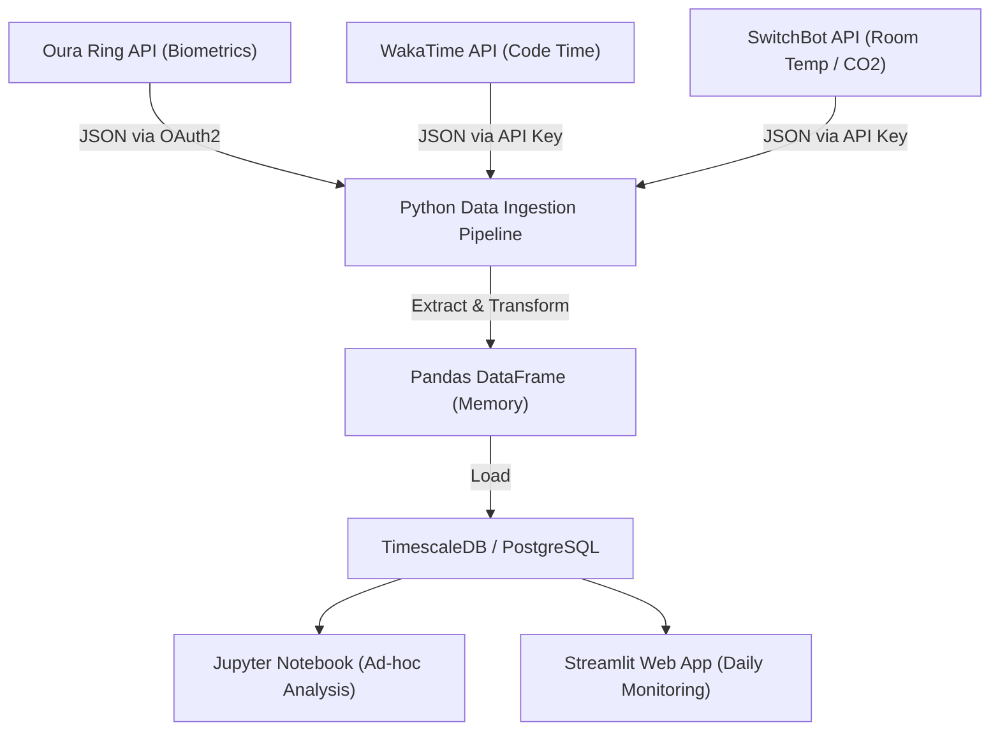
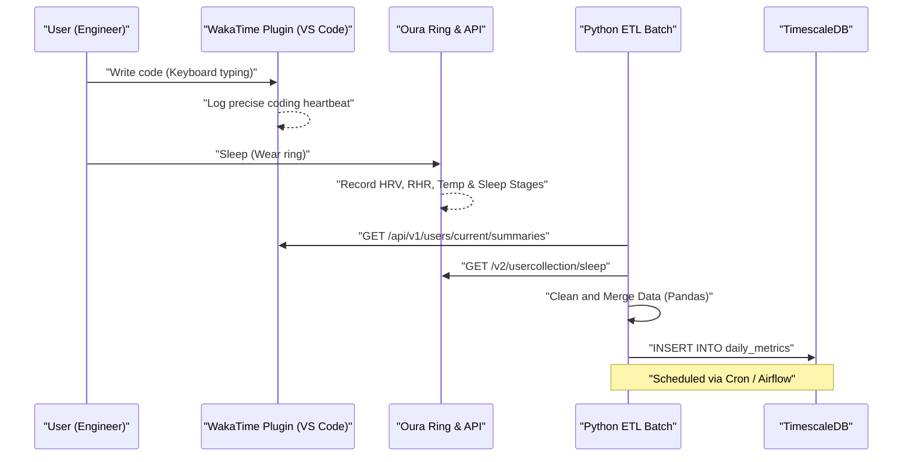
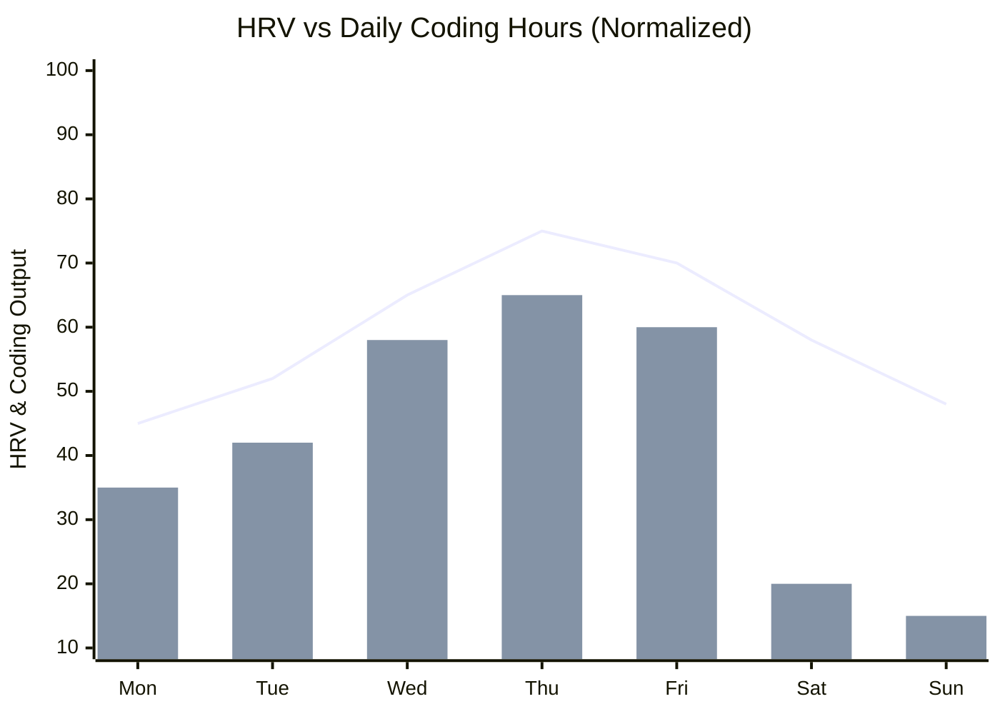

## 1. はじめに：ソフトウェアエンジニアとバイオハッキングの交差点

現代のソフトウェアエンジニアリングは、極度の認知的負荷と長時間の座り仕事（Sedentary Lifestyle）を伴う過酷な知的労働です。常に変化する技術スタックのキャッチアップ、複雑な分散システムのバグハント、そして納期へのプレッシャー。これらを乗り越えるためには、単に「気合」や「根性」で乗り切るのではなく、システムをデバッグするように自らの身体というハードウェアをチューニングするアプローチ、すなわち「バイオハッキング（Biohacking）」が必要不可欠です。

かつては「今日はなんとなく体調が良い・悪い」という主観的な感覚（ヒューリスティクス）に頼っていましたが、現代ではOura Ring、Apple Watch、Garminなどの高性能なウェアラブルデバイスの普及により、生体データを24時間365日、非侵襲で取得できるようになりました。本記事では、生体データ（HRV、RHR、睡眠アーキテクチャ）と生産性データ（WakaTime等によるコーディングメトリクス）をAPI経由で取得し、PythonやPandasを用いてデータサイエンスのアプローチで相関分析を行う方法を解説します。また、サーカディアンリズムの数理モデルや、カフェイン代謝の半減期に基づく最適なコーヒー摂取のタイミングなど、科学的根拠に基づいたエンジニア向けの健康ハックを極めて詳細に紐解きます。

## 2. 測定できないものは管理できない：生体データ取得のハードウェア

生体データを取得するためのセンサー（ウェアラブルデバイス）には、それぞれ得意とする領域があります。データドリブンな健康管理においては、目的に応じて最適なデバイスを選定することが第一歩となります。

### 2.1 Oura Ring (Generation 3 / 4)
指の動脈から直接データを取得するため、手首で計測するスマートウォッチと比較して、睡眠時の心拍数や心拍変動（HRV）、体表温の変化の計測精度が非常に高いのが特徴です。指には毛細血管が密集しており、光学式心拍センサー（PPG: Photoplethysmography）によるノイズの少ないデータ取得が可能です。また、REST APIが充実しており、OAuth2.0経由でJSON形式の生データを容易にエクスポートできるため、エンジニアにとって最もハッカブルなデバイスと言えます。

### 2.2 Apple Watch Series / Ultra
アクティビティ中のトラッキングや、血中酸素飽和度（SpO2）、心電図（ECG）の計測に優れています。日中の活動量や、マインドフルネスアプリ（呼吸アプリ）を通じたオンデマンドのHRV計測においては最強のデバイスです。ただし、データのエクスポートにはHealthKitを経由する必要があり、Pythonなどからの直接アクセスにはiOSアプリ（AutoSleepやHealthFitなど）を介したCSVエクスポートなど、ワンクッションが必要になります。

### 2.3 Garmin (Fenix / Forerunner)
GPSトラッキングの精度に加えて、「Body Battery（ボディバッテリー）」と呼ばれる独自のエネルギー残量指標が優秀です。これはHRVとストレスレベルを基に算出されます。GarminはGarmin Connect APIを通じて取得可能ですが、法人向けAPIの壁があるため、個人開発者としてはオープンソースのライブラリを使用するか、有志によるスクレイピングツールを活用する必要があります。

本記事では、睡眠と回復のトラッキングにおいて最高峰であり、APIからのデータ抽出が極めて容易な **Oura Ring** のデータと、IDE（VS CodeやIntelliJなど）のプラグインとしてコーディング時間を計測する **WakaTime** のデータを主軸に解説を進めます。

## 3. 生体データの基礎理論：HRVとRHRのデータサイエンス

単に「睡眠時間が長いから良い」という単純な指標ではなく、データサイエンスの観点からは以下の2つの指標が「回復（Recovery）」のマスターメトリクスとなります。

### 3.1 HRV（心拍変動：Heart Rate Variability）と自律神経のモデリング
心臓はメトロノームのように一定のリズムで打っているわけではありません。例えば心拍数が60bpmであっても、1拍1拍の間隔（R-R間隔）は「0.92秒」「1.05秒」「0.98秒」のように常に揺らいでいます。この揺らぎの大きさを数値化したものがHRV（心拍変動）です。

HRVは自律神経系、すなわち「交感神経（アクセル）」と「副交感神経（ブレーキ）」のバランスを直接的に反映しています。ストレス状態、過労、あるいはアルコール摂取後などでは交感神経が優位になり、心臓の拍動は一定に近づきHRVは低下します。逆に十分にリラックスし回復している状態では、副交感神経（迷走神経）が優位になり、呼吸に合わせて心拍がダイナミックに変動するため、HRVは高くなります。

HRVの計算には時間領域（Time-domain）と周波数領域（Frequency-domain）の2つのアプローチがありますが、時間領域分析において最も一般的に用いられ、Oura RingやApple Watchでも採用されているのが **RMSSD (Root Mean Square of Successive Differences)** です。これは連続する心拍間隔（RR間隔）の差の二乗平均平方根を求めるものです。

数式で厳密に表すと以下のようになります。

$$ RMSSD = \sqrt{\frac{1}{N-1} \sum_{i=1}^{N-1} (RR_{i+1} - RR_i)^2} $$

ここで、
- $N$ は計測された総心拍数
- $RR_i$ は $i$ 番目のRR間隔（ミリ秒）

エンジニアにとって、朝起きた時のHRV（RMSSD）が個人のベースライン（過去数週間の移動平均）よりも大きく低下している場合、「今日は認知的負荷の高いアーキテクチャ設計や、本番環境へのデプロイは避けて、テストコードの拡充やドキュメント作成に充てるべき日である」というデータドリブンな意思決定が可能になります。

### 3.2 安静時心拍数（RHR：Resting Heart Rate）と回復のシグナル
RHRは、身体が完全にリラックスしている状態（通常は睡眠中）の1分間あたりの心拍数です。アルコール摂取後や、遅い時間の過食、あるいは病気（感染症など）の初期症状として、身体が体内の代謝や免疫反応にエネルギーを割いている時、RHRはベースラインよりも数bpm〜十数bpm上昇します。

RHRが低いほど、心筋が一度の拍動で多くの血液を送り出せている（1回拍出量が多い）ことを意味し、有酸素運動能力の高さや疲労からの回復度合いを示します。理想的には、睡眠の最初の半分（前半）でRHRが最低値に達する「ハンモック型」のカーブを描くのが、最も質の高い回復ができている状態です。

## 4. 睡眠アーキテクチャの詳細解析

エンジニアの頭脳のパフォーマンスを決定づけるのは、睡眠の「量」だけでなく「質」、すなわち睡眠アーキテクチャ（Sleep Architecture）です。一晩の睡眠は通常、90〜110分のサイクルを4〜5回繰り返します。

### 4.1 NREM睡眠 ステージ1〜2（浅い睡眠 / Light Sleep）
脳波が次第に遅くなり、身体がリラックスし始める準備段階です。睡眠全体の約50%を占めます。認知的な回復への寄与は少ないものの、次の深い睡眠ステージへ移行するための重要な橋渡しとなります。

### 4.2 NREM睡眠 ステージ3（深い睡眠 / Deep Sleep / Slow Wave Sleep: SWS）
脳波にデルタ波（0.5〜2Hzの低周波）が現れる、物理的な肉体の回復のコアとなる時間帯です。成長ホルモンが大量に分泌され、細胞の修復が行われます。免疫系の強化にも不可欠であり、アスリートの筋疲労回復だけでなく、エンジニアの眼精疲労や首・肩の筋肉の修復にも直結します。深い睡眠は通常、睡眠の前半のサイクルに集中します。

### 4.3 REM睡眠（Rapid Eye Movement）
脳が覚醒時と同じくらい活発に動いている状態ですが、身体の筋肉は麻痺状態にあります。エンジニアにとって極めて重要なのがこのREM睡眠で、日中に学んだ新しいプログラミング言語の構文や、複雑なアルゴリズムの概念を脳内で整理し、長期記憶として定着（Memory Consolidation）させる役割を担います。神経可塑性（Neuroplasticity）を高め、創造的な問題解決能力（「シャワーを浴びている時に突然バグの解決策を閃く」ようなひらめき）もREM睡眠によって強化されます。REM睡眠は睡眠の後半（明け方）に長くなる傾向があります。

つまり、「アラームで無理やり早く起きて睡眠時間を削る」ことは、記憶定着と創造性に関わるREM睡眠を局所的に大きく削ることを意味し、エンジニアとしてのパフォーマンスを著しく低下させる重大なバグに等しい行為です。

## 5. 連続血糖測定（CGM）とスパイクの防御

近年、バイオハッカーの間で必須となっているのがCGM（Continuous Glucose Monitor：連続血糖測定器）の導入です。代表的なデバイスにFreeStyle LibreやDexcomがあります。
食事（特に炭水化物や糖分）を摂取すると、血中のグルコース濃度が急激に上昇（血糖値スパイク）し、その後インスリンの大量分泌によって急降下（クラッシュ）します。この「クラッシュ」のタイミングで、強烈な眠気（Brain Fog）や集中力の低下が引き起こされます。昼食後の「魔の午後2時」の眠気は、単なる体内時計の影響だけでなく、ラーメンや白米の過剰摂取による血糖値スパイクが原因である可能性が高いのです。

血糖値の応答曲線 $G(t)$ は、摂取した糖質の吸収速度とインスリンによるクリアランスの差分として、以下のような減衰振動モデルとして近似的に表すことができます。

$$ G(t) = G_{base} + \Delta G \cdot e^{-\alpha t} \sin(\beta t) $$

ここで、
- $G_{base}$: 空腹時血糖値（ベースライン）
- $\Delta G$: 食事による血糖値上昇の振幅
- $\alpha$: インスリン感受性や代謝速度に基づく減衰係数
- $\beta$: 振動の周波数成分
- $t$: 食後の経過時間

エンジニアのパフォーマンスを維持するためには、$\Delta G$（振幅）を最小限に抑えることが重要です。具体的には、「野菜（食物繊維）を先に食べる」「精製された炭水化物を避ける」「食後に15分の軽い散歩をする（GLUT4トランスポーターを活性化させ、インスリン非依存的に血糖を筋肉に取り込む）」といったハックが有効です。

## 6. アーキテクチャ設計：ローカルデータパイプラインの構築

生体データと生産性データを統合分析するためのローカルデータパイプラインを構築します。
以下のMermaidダイアグラム（フローチャート）は、APIからデータを取得し、ダッシュボードで可視化するまでのフローを示しています。



このアーキテクチャにより、毎日自動で自身の体調（インプット）とコーディングパフォーマンス（アウトプット）の相関関係をモニタリングできるようになります。

さらに、システム間でのシーケンスを詳細に見てみましょう。



## 7. PythonとPandasによるデータインジェスト

実際にPythonスクリプトを用いて、Oura RingとWakaTimeのAPIからデータを取得し、Pandas DataFrameとして統合する処理を見てみましょう。実運用に耐えうる堅牢なコードを構築します。

```python
import requests
import pandas as pd
from datetime import datetime, timedelta
import os

# Environment Variables
OURA_TOKEN = os.getenv("OURA_ACCESS_TOKEN")
WAKATIME_API_KEY = os.getenv("WAKATIME_API_KEY")

def fetch_oura_sleep_data(start_date: str, end_date: str) -> pd.DataFrame:
    """Fetch daily sleep summary from Oura Ring API v2."""
    url = "https://api.ouraring.com/v2/usercollection/sleep"
    params = {"start_date": start_date, "end_date": end_date}
    headers = {"Authorization": f"Bearer {OURA_TOKEN}"}
    
    response = requests.get(url, headers=headers, params=params)
    response.raise_for_status() # Raise exception for 4xx/5xx errors
    data = response.json().get("data", [])
    
    if not data:
        return pd.DataFrame()
        
    df = pd.json_normalize(data)
    # Extract deeply nested values or select essential columns
    df = df[['day', 'score', 'time_in_bed', 'total_sleep_duration', 
             'average_hrv', 'lowest_heart_rate', 
             'deep_sleep_duration', 'rem_sleep_duration']]
             
    # Convert dates to datetime objects and set as index
    df['day'] = pd.to_datetime(df['day'])
    df.set_index('day', inplace=True)
    return df

def fetch_wakatime_data(start_date: str, end_date: str) -> pd.DataFrame:
    """Fetch coding duration summaries from WakaTime API."""
    url = "https://wakatime.com/api/v1/users/current/summaries"
    params = {"start": start_date, "end": end_date, "api_key": WAKATIME_API_KEY}
    
    response = requests.get(url, params=params)
    response.raise_for_status()
    data = response.json().get("data", [])
    
    records = []
    for day_data in data:
        date_str = day_data['range']['date']
        # Extract total seconds spent coding
        total_seconds = day_data['grand_total']['total_seconds']
        records.append({'day': date_str, 'coding_hours': total_seconds / 3600.0})
        
    df = pd.DataFrame(records)
    if not df.empty:
        df['day'] = pd.to_datetime(df['day'])
        df.set_index('day', inplace=True)
    return df

if __name__ == "__main__":
    # Fetch data for the last 60 days
    end = datetime.now().strftime("%Y-%m-%d")
    start = (datetime.now() - timedelta(days=60)).strftime("%Y-%m-%d")
    
    oura_df = fetch_oura_sleep_data(start, end)
    waka_df = fetch_wakatime_data(start, end)
    
    # Merge datasets on 'day' index using inner join
    merged_df = pd.merge(oura_df, waka_df, left_index=True, right_index=True, how='inner')
    
    # Save raw data to CSV/DB
    merged_df.to_csv("health_productivity_raw.csv")
    print(f"Ingested {len(merged_df)} days of data.")
```

## 8. データ前処理と特徴量エンジニアリング

取得した生データをそのまま分析にかけるのは危険です。デバイスの充電忘れによる欠損値（Missing Values）の処理や、意味のある新たな指標（特徴量エンジニアリング：Feature Engineering）を生成する必要があります。

```python
def engineer_features(df: pd.DataFrame) -> pd.DataFrame:
    """Apply feature engineering and cleaning to the merged dataframe."""
    df = df.copy()
    
    # 1. Handle missing values (e.g., forward fill)
    df.fillna(method='ffill', inplace=True)
    
    # 2. Calculate Sleep Efficiency
    # Formula: (Total Sleep Time / Time in Bed) * 100
    df['sleep_efficiency_pct'] = (df['total_sleep_duration'] / df['time_in_bed']) * 100
    
    # 3. Calculate Sleep Stage Ratios
    df['rem_ratio'] = df['rem_sleep_duration'] / df['total_sleep_duration']
    df['deep_ratio'] = df['deep_sleep_duration'] / df['total_sleep_duration']
    
    # 4. Calculate 7-day Moving Averages (Rolling Mean) to smooth out daily noise
    df['hrv_7d_ma'] = df['average_hrv'].rolling(window=7).mean()
    df['rhr_7d_ma'] = df['lowest_heart_rate'].rolling(window=7).mean()
    
    # 5. Calculate daily deviation from baseline
    df['hrv_deviation'] = df['average_hrv'] - df['hrv_7d_ma']
    
    # 6. Normalize targets for Machine Learning (Optional)
    from sklearn.preprocessing import MinMaxScaler
    scaler = MinMaxScaler()
    df[['hrv_scaled', 'coding_scaled']] = scaler.fit_transform(df[['average_hrv', 'coding_hours']])
    
    # Drop rows with NaN generated by rolling window
    df.dropna(inplace=True)
    
    return df

processed_df = engineer_features(merged_df)
```

## 9. 相関分析：生産性と健康メトリクスの交差点

前処理したデータを元に、健康指標とコーディング生産性の関係を分析します。仮説として、「HRVが高い（自律神経が整い回復している）日ほど、集中力が持続しコーディング時間が長くなる、あるいはより複雑なタスクをこなせる」ということが考えられます。


*(注: 折れ線グラフが正規化されたHRVベースラインからの乖離、棒グラフがWakaTimeのコーディング時間を示します。十分な回復が得られている水曜日から金曜日にかけて、コーディングのアウトプットが最大化されている相関が見て取れます)*

Pandasでの相関係数（ピアソンの積率相関係数 $r$）の算出と、SciPyを用いた統計的有意性（p値）の検定を行います。

```python
import scipy.stats as stats

# Select numerical columns for correlation matrix
cols_of_interest = ['average_hrv', 'score', 'deep_sleep_duration', 'rem_sleep_duration', 'coding_hours']
correlation_matrix = processed_df[cols_of_interest].corr()

print("Correlation with Coding Hours:")
print(correlation_matrix['coding_hours'].sort_values(ascending=False))

# Calculate Pearson correlation coefficient and p-value for REM sleep and Coding Hours
r, p_value = stats.pearsonr(processed_df['rem_sleep_duration'], processed_df['coding_hours'])
print(f"REM Sleep vs Coding Hours: r = {r:.3f}, p-value = {p_value:.4f}")
```

多くの場合、`average_hrv` や `rem_sleep_duration` と `coding_hours` の間に有意な正の相関（$p < 0.05$）が観察されます。特に、前日のREM睡眠の長さが、当日の「エラー解決（デバッグ）にかかる時間」や「生産性」に強く影響を与えることが、多くのエンジニアの自己追跡（Quantified Self）コミュニティで報告されています。

## 10. サーカディアンリズムの数理モデルと認知ピークの最適化

人間には概日リズム（Circadian Rhythm）と呼ばれる約24時間周期の体内時計が備わっています。このリズムによって、体温、ホルモン分泌（朝方のコルチゾールスパイクや夜間のメラトニン分泌）、そして「認知能力」が変動します。

サーカディアンリズムの変動は、コサイン曲線を用いた数理モデル（Cosinorモデル）で近似表現されることが多く、生体指標の変化を次のように定式化できます。

$$ y(t) = M + A \cos\left(\frac{2\pi}{24}(t - \phi)\right) + e(t) $$

- $y(t)$: 時刻 $t$ における生体指標（例：深部体温や覚醒度）
- $M$: MESOR (Midline Estimating Statistic of Rhythm) - リズムの中心値（平均レベル）
- $A$: 振幅（Amplitude） - 変動の大きさ
- $\phi$: アクロフェーズ（Acrophase） - ピークとなる位相（時間）
- $e(t)$: 環境要因などによる誤差項

エンジニアリングにおいてこの式が意味するのは、「1日の中でパフォーマンス（覚醒度）がピークになる時間帯（$\phi$）は生物学的に決まっており、その時間帯に最も認知的負荷の高いタスク（難解なバグ修正、新しいアーキテクチャの設計）を割り当てるべきである」ということです。

一般的な朝型（Morning Lark）クロノタイプの場合、起床後2〜4時間（例えば午前9時〜11時）に最初の認知ピークが訪れます。その後、午後2時頃に概日リズムの谷間（Post-lunch dip）が訪れ、夕方にもう一度小さなピークが来ます。自分のピークタイム（$\phi$）をウェアラブルデータの活動量や主観的集中度から特定し、Google Calendar等のスケジュールを「タイムブロッキング」して守ることが、最高の健康ハックです。ピークタイムに無意味なミーティングを入れることは、CPUの一番性能が良いコアをアイドルプロセスに割り当てるようなものです。

## 11. カフェインの薬物動態学と最適な摂取タイミング

エンジニアとコーヒーは切っても切れない関係にありますが、カフェインの過剰摂取や遅い時間の摂取は、脳内のアデノシン受容体をブロックし、夜間の「深い睡眠（Deep Sleep）」を破壊します。主観的には眠れているつもりでも、Oura Ringのデータを見ると心拍数が下がらず、深い睡眠の割合が激減していることが確認できます。

カフェインの体内からの排出は、一次反応（First-order kinetics）に従います。つまり、血中濃度は指数関数的に減衰します。

$$ C(t) = C_0 e^{-k t} $$

ここで、
- $C(t)$: 時間 $t$ 経過後の血中カフェイン濃度
- $C_0$: 初期濃度（摂取直後の最大濃度）
- $k$: 消失速度定数
- $t$: 摂取からの経過時間（時間）

消失速度定数 $k$ は、カフェインの半減期（$t_{1/2}$）を用いて次のように表されます。

$$ k = \frac{\ln(2)}{t_{1/2}} $$

健康な成人の場合、個人の遺伝子（CYP1A2遺伝子）にもよりますが、カフェインの半減期 $t_{1/2}$ はおよそ **5〜6時間** とされています。
例えば、午後3時にドリップコーヒーを1杯（カフェイン約150mg）飲んだとします（$C_0 = 150$）。半減期を5.5時間とすると、$k \approx 0.126$ となります。
就寝時間の午後11時（8時間後）における体内残留カフェイン濃度を計算すると：

$$ C(8) = 150 \times e^{-0.126 \times 8} = 150 \times e^{-1.008} \approx 150 \times 0.365 = 54.75 \text{ mg} $$

つまり、寝る時間になっても体内にまだ54mg（エスプレッソ1杯強）のカフェインが残留していることになり、これが睡眠アーキテクチャにダイレクトに悪影響を及ぼします。
この薬物動態モデルから導き出されるデータドリブンな結論は、**「質の高い睡眠を確保するためには、カフェイン摂取は起床後90分以降（コルチゾールスパイクが落ち着いた後）に開始し、遅くとも午後2時（就寝の9〜10時間前）には完全にカットオフすべきである」** ということです。

## 12. 環境変数のハッキング（Lux, 温度, CO2）

自己の身体という内部システムだけでなく、外部の環境変数（Environment Variables）を最適化することも重要です。

### 12.1 光環境（Lux）のプログラミング
サーカディアンリズムをリセットする最も強力な「ツァイトゲーバー（Zeitgeber：時間を知らせる手がかり）」は光です。朝、網膜の光受容細胞（ipRGC）に約100,000 Luxの太陽光が入ることでメラトニンの分泌が止まり、タイマーがリセットされます。逆に夜間はブルーライトを遮断し、メラトニン分泌を阻害しないことが必須です。f.luxなどのソフトウェアでディスプレイの色温度を下げるだけでなく、スマート照明（Philips Hueなど）をAPIで制御し、日没に合わせて部屋の照度と色温度を自動で落とすスクリプトを組むのが有効です。

### 12.2 寝室の温度制御と入眠潜時（Sleep Latency）
人間は深部体温（Core Body Temperature）が下がることで睡眠に入ります。寝室の温度を18〜19度という涼しい状態に保ち、就寝の90分前に温かい入浴で一時的に上げた深部体温が急降下するタイミングを狙って布団に入ることで、入眠潜時（Sleep Latency：布団に入ってから眠りにつくまでの時間）を劇的に短縮し、深い睡眠を最大化できます。

### 12.3 CO2濃度と認知機能の低下
SwitchBotハブやNetatmoのウェザーステーションのAPIをデータパイプラインに追加すると、室内の二酸化炭素（CO2）濃度と生産性に明確な負の相関が見られます。
ハーバード大学の研究などでも示されている通り、CO2濃度が1000ppmを超えると認知機能（特に戦略的意思決定能力）が有意に低下し始め、2000ppmを超えると深刻なパフォーマンス低下を引き起こします。冬場の締め切った部屋でのリモートワークは、知らず知らずのうちにパフォーマンスを下げています。

```python
# Pseudo-code for intelligent room ventilation using Home Assistant / SwitchBot API
import requests

def check_and_ventilate():
    # Get current CO2 level from Netatmo/SwitchBot API
    co2_ppm = get_sensor_data("co2_sensor_id")
    
    if co2_ppm > 1000:
        print(f"Warning: CO2 level high ({co2_ppm} ppm). Cognitive decline risk.")
        # Trigger smart plug to turn on ventilation fan
        turn_on_smart_plug("ventilation_fan_id")
        # Send notification to Slack/Discord
        send_notification("換気ファンを起動しました。CO2濃度が高いです。")
    elif co2_ppm < 600:
        turn_off_smart_plug("ventilation_fan_id")
```
このようなスクリプトをCronで定期実行することで、常に最適な酸素濃度を維持する自律型環境制御システムが完成します。

## 13. 結論：人体というシステムのCI/CD

自身の身体を一つの複雑な分散システムとして捉えてみてください。ウェアラブルデバイス（Oura Ring）は監視用のメトリクスエクスポーター（Prometheus）、Python/Pandasのスクリプトはログ解析パイプライン（Logstash/Fluentd）、そして日々の体調の変化やパフォーマンスはダッシュボード（Grafana/Streamlit）に表示されるシステムの健全性です。

「睡眠時間を削って働く」ことは、技術的負債（Technical Debt）を無視して機能追加を強行することと同じです。短期的にはリリースに間に合うかもしれませんが、長期的には必ずシステムダウン（バーンアウトや深刻な健康被害、うつ病）を引き起こします。

HRVをモニタリングし、RHRのトレンドをチェックし、睡眠アーキテクチャを最適化する。そしてWakaTimeの生産性データとの相関を見ながら、食事、運動、睡眠、環境という「ハイパーパラメータ」を日々微調整していく。これはまさに、人体に対する **CI/CD（継続的インテグレーション・継続的デリバリー）** のプロセスに他なりません。

データサイエンスとAPIを駆使して、最高のパフォーマンスを発揮できる健康状態をエンジニアリングしましょう。あなたの書くコードの質は、あなた自身の生体システムの健全性に直結しているのですから。

---
*Disclaimer: 本記事は筆者の個人的な実験とデータサイエンスのアプローチをまとめたものであり、医療的なアドバイスを提供するものではありません。継続的な体調不良や睡眠障害がある場合は、専門の医療機関にご相談ください。*
