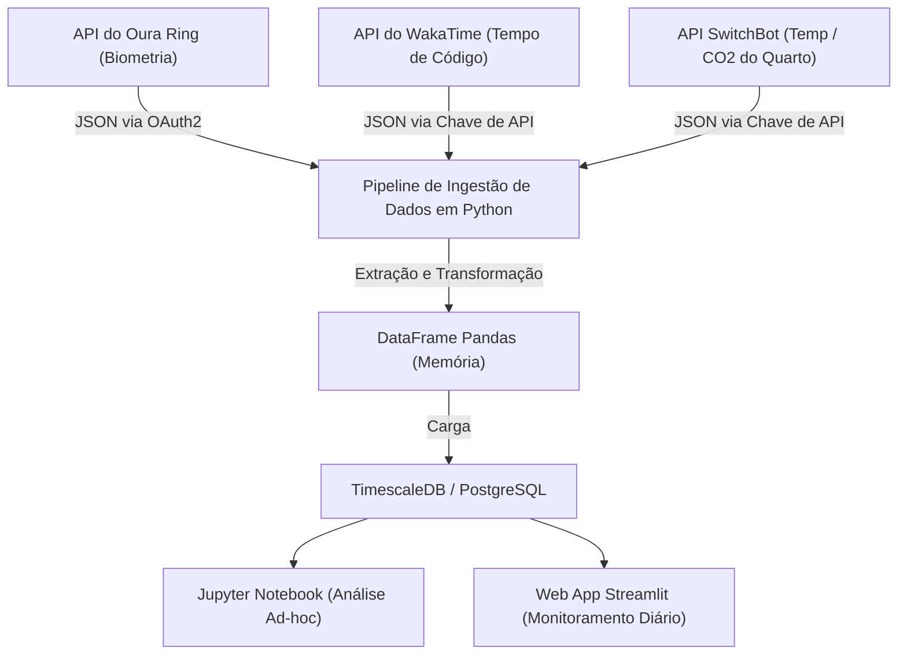
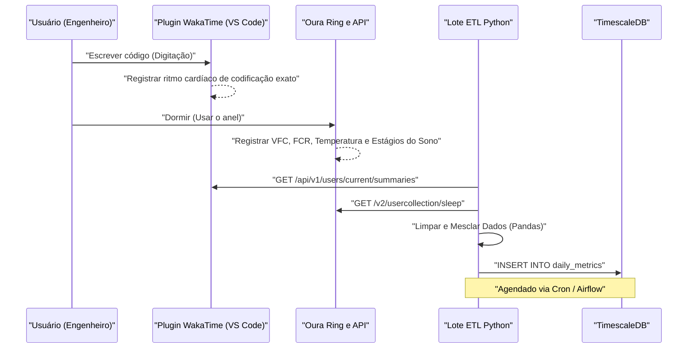
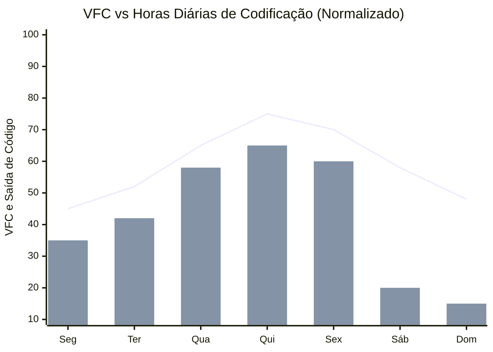

## 1. Introdução: A Interseção entre Engenharia de Software e Biohacking

A engenharia de software moderna é um trabalho intelectual rigoroso que envolve extrema carga cognitiva e longas horas de estilo de vida sedentário (Sedentary Lifestyle). Acompanhar as pilhas de tecnologia em constante mudança, caçar bugs em sistemas distribuídos complexos e a pressão dos prazos. Para superar isso, não basta simplesmente usar "força de vontade" ou "determinação"; é indispensável uma abordagem de ajustar o próprio corpo - o seu hardware - da mesma forma como se depura um sistema, ou seja, o "Biohacking".

No passado, dependíamos de sentimentos subjetivos (heurísticas) como "Hoje, de alguma forma, me sinto bem/mal", mas hoje, com a popularização de dispositivos vestíveis de alto desempenho, como Oura Ring, Apple Watch e Garmin, podemos obter dados biométricos de forma não invasiva 24 horas por dia, 365 dias por ano. Neste artigo, explicarei como obter dados biométricos (VFC, FCR, arquitetura do sono) e dados de produtividade (métricas de codificação por meio do WakaTime, etc.) via API, e analisá-los correlacionalmente através de uma abordagem de ciência de dados usando Python e Pandas. Além disso, irei desvendar com muitos detalhes os hacks de saúde para engenheiros baseados em evidências científicas, como o modelo matemático dos ritmos circadianos e o momento ideal para a ingestão de café com base na meia-vida do metabolismo da cafeína.

## 2. O que não se pode medir, não se pode gerenciar: Hardware para Aquisição de Dados Biométricos

Os sensores (dispositivos vestíveis) para adquirir dados biométricos têm suas próprias áreas de especialização. No gerenciamento de saúde orientado por dados, o primeiro passo é selecionar o dispositivo ideal de acordo com os objetivos.

### 2.1 Oura Ring (Generation 3 / 4)
Por adquirir dados diretamente da artéria do dedo, a precisão da medição da frequência cardíaca durante o sono, variabilidade da frequência cardíaca (VFC) e mudanças na temperatura da pele é extremamente alta em comparação com os smartwatches de pulso. O dedo é rico em capilares, permitindo aquisição de dados com baixo ruído usando sensores ópticos de frequência cardíaca (PPG: Fotopletismografia). Além disso, a API REST é abrangente, tornando fácil exportar os dados brutos no formato JSON via OAuth2.0, sendo este o dispositivo mais "hackeável" para engenheiros.

### 2.2 Apple Watch Series / Ultra
É excelente no rastreamento durante atividades e na medição da saturação de oxigênio no sangue (SpO2) e eletrocardiogramas (ECG). É o melhor dispositivo para medir a quantidade de atividade diária e medição de VFC sob demanda através do aplicativo Mindfulness (aplicativo de respiração). No entanto, para exportar dados, é necessário passar pelo HealthKit, exigindo uma etapa intermediária para o acesso direto via Python, como exportação de CSV por meio de um aplicativo iOS (como AutoSleep ou HealthFit).

### 2.3 Garmin (Fenix / Forerunner)
Além da precisão do rastreamento GPS, o indicador exclusivo de energia restante chamado "Body Battery" é excelente. Isso é calculado com base na VFC e no nível de estresse. Os dados do Garmin podem ser obtidos pela Garmin Connect API, mas devido à barreira da API corporativa, os desenvolvedores individuais precisam usar bibliotecas de código aberto ou ferramentas de extração de dados (scraping) criadas por voluntários.

Neste artigo, nossa discussão será conduzida tendo como foco os dados do **Oura Ring**, o auge do rastreamento de sono e recuperação, do qual extrair dados de sua API é extremamente fácil, e do **WakaTime**, que mede o tempo de programação como um plugin para IDEs (como VS Code ou IntelliJ).

## 3. Teoria Básica dos Dados Biométricos: A Ciência de Dados de VFC e FCR

Em vez de uma métrica simples como "Dormir mais tempo é bom", sob a ótica da ciência de dados, os dois indicadores a seguir são as métricas mestras de "Recuperação" (Recovery).

### 3.1 VFC (Variabilidade da Frequência Cardíaca: Heart Rate Variability) e a Modelagem do Sistema Nervoso Autônomo
O coração não bate em um ritmo constante como um metrônomo. Por exemplo, mesmo que a frequência cardíaca seja de 60 bpm, o intervalo entre cada batimento (intervalo R-R) flutua constantemente, como "0,92 segundos", "1,05 segundos", "0,98 segundos". A grandeza dessa flutuação quantificada é a VFC (Variabilidade da Frequência Cardíaca).

A VFC reflete diretamente o equilíbrio do sistema nervoso autônomo, ou seja, o "sistema nervoso simpático (acelerador)" e o "sistema nervoso parassimpático (freio)". Sob estresse, fadiga extrema ou após ingestão de álcool, o sistema nervoso simpático torna-se dominante, o batimento cardíaco se torna mais constante e a VFC diminui. Por outro lado, em um estado de total relaxamento e recuperação, o sistema nervoso parassimpático (nervo vago) domina e a VFC aumenta porque a frequência cardíaca flutua dinamicamente de acordo com a respiração.

Existem duas abordagens para o cálculo da VFC: o domínio do tempo (Time-domain) e o domínio da frequência (Frequency-domain). Na análise de domínio do tempo, o mais utilizado e também adotado pelo Oura Ring e Apple Watch é o **RMSSD (Root Mean Square of Successive Differences)**. Esta é a raiz quadrada da média dos quadrados das diferenças entre intervalos de batimentos sucessivos (intervalos RR).

Em termos estritamente matemáticos, isso é expresso da seguinte forma:

$$ RMSSD = \sqrt{\frac{1}{N-1} \sum_{i=1}^{N-1} (RR_{i+1} - RR_i)^2} $$

Onde,
- $N$ é o número total de batimentos medidos
- $RR_i$ é o $i$-ésimo intervalo RR (em milissegundos)

Para os engenheiros, quando a VFC matinal (RMSSD) apresenta uma queda drástica abaixo da sua linha de base (a média móvel das semanas anteriores), é possível tomar uma decisão baseada em dados: "Hoje, o design de arquitetura com alta carga cognitiva ou a implantação em produção devem ser evitados; em vez disso, o dia deve ser dedicado a expandir testes de código ou criar documentação".

### 3.2 Frequência Cardíaca em Repouso (FCR: Resting Heart Rate) e os Sinais de Recuperação
A FCR é o número de batimentos por minuto quando o corpo está completamente relaxado (geralmente enquanto dorme). Depois de ingerir bebidas alcoólicas, comer demais tarde da noite, ou nos estágios iniciais de doenças (como infecções), quando o corpo destina energia às respostas imunológicas ou ao metabolismo, a FCR sobe de alguns bpm até mais de dez bpm acima da linha de base.

Uma FCR mais baixa indica que o músculo cardíaco é capaz de enviar mais sangue em um único batimento (alto volume sistólico), demonstrando uma forte aptidão aeróbica e o grau de recuperação da fadiga. Idealmente, desenhar uma curva em forma de "rede de descanso" (hammock curve), em que a FCR atinge seu valor mais baixo na primeira metade do sono, significa que a recuperação de maior qualidade está ocorrendo.

## 4. Análise Detalhada da Arquitetura do Sono

O que determina o desempenho mental de um engenheiro não é apenas a "quantidade" do sono, mas a sua "qualidade" ou seja, a Arquitetura do Sono (Sleep Architecture). Uma noite de sono geralmente repete o ciclo de 90 a 110 minutos de 4 a 5 vezes.

### 4.1 Sono NREM Estágios 1–2 (Sono Leve / Light Sleep)
Este é o estágio preparatório no qual as ondas cerebrais ficam gradualmente mais lentas e o corpo começa a relaxar. Corresponde a cerca de 50% do sono total. Embora a sua contribuição para a recuperação cognitiva seja pequena, serve como uma ponte essencial para o próximo estágio profundo do sono.

### 4.2 Sono NREM Estágio 3 (Sono Profundo / Deep Sleep / Slow Wave Sleep: SWS)
As ondas delta (baixa frequência 0,5~2 Hz) aparecem nas ondas cerebrais, sendo este o período central para a recuperação física. Uma quantidade maciça do hormônio de crescimento é secretada e as células são reparadas. É fundamental para o fortalecimento do sistema imunológico, não estando diretamente ligado apenas à recuperação muscular nos atletas, mas também à fadiga ocular e reparo dos músculos do pescoço e ombros nos engenheiros. O sono profundo geralmente se concentra na primeira metade da noite de sono.

### 4.3 Sono REM (Rapid Eye Movement)
Um estado em que o cérebro está tão ativo quanto quando acordado, porém os músculos do corpo estão paralisados. O sono REM é extremamente importante para o engenheiro e assume o papel de organizar no cérebro os conceitos algorítmicos complexos e as sintaxes da nova linguagem de programação estudadas no decorrer do dia, para fixá-las (Memory Consolidation) como memória de longo prazo. A capacidade criativa para resolver problemas (como a inspiração repentina para resolver um bug enquanto se toma banho) e o aumento da neuroplasticidade são fortificados também por esse sono REM. O sono REM tem uma tendência a se prolongar na parte final do sono (madrugada).

Em outras palavras, "forçar-se a acordar mais cedo com o alarme, cortando o tempo de sono" significa cortar severamente e localmente o sono REM, essencial para a consolidação da memória e criatividade. É um ato equivalente a introduzir um bug crítico que reduz consideravelmente o seu desempenho como engenheiro.

## 5. Monitoramento Contínuo de Glicose (CGM) e Defesa Contra Picos

Nos últimos anos, tornou-se indispensável entre os biohackers a introdução de Monitores Contínuos de Glicose (CGM: Continuous Glucose Monitor). Os dispositivos representativos incluem o FreeStyle Libre e o Dexcom.
Ao se ingerir alimentos (especialmente carboidratos e açúcares), a concentração de glicose no sangue sobe de forma acentuada (pico de glicose), e logo após, devido a uma secreção maciça de insulina, ocorre uma queda aguda (crash). É durante esse "crash" que se manifestam a letargia severa (Brain Fog - névoa mental) e a queda de concentração. A sonolência "demoníaca das 2 horas da tarde" após o almoço muito provavelmente não é apenas um efeito do relógio biológico, mas decorre do pico de glicose gerado pela ingestão excessiva de lámen (ramen) ou arroz branco.

A curva de resposta da glicose no sangue $G(t)$ pode ser expressa aproximadamente como um modelo de oscilação amortecida que reflete a diferença entre a taxa de absorção dos carboidratos ingeridos e a remoção causada pela insulina, da seguinte forma:

$$ G(t) = G_{base} + \Delta G \cdot e^{-\alpha t} \sin(\beta t) $$

Onde,
- $G_{base}$: Nível de glicose no sangue em jejum (linha de base)
- $\Delta G$: A amplitude da elevação da glicose pela refeição
- $\alpha$: Coeficiente de amortecimento com base na velocidade metabólica ou sensibilidade à insulina
- $\beta$: O componente de frequência da oscilação
- $t$: Tempo decorrido após a refeição

Para manter a performance de um engenheiro, é essencial minimizar a amplitude $\Delta G$. Especificamente, hacks como "comer vegetais (fibras) primeiro", "evitar carboidratos refinados", e "fazer uma caminhada leve de 15 minutos após as refeições (para ativar os transportadores GLUT4 e levar glicose aos músculos independentemente da insulina)" são muito eficazes.

## 6. Design da Arquitetura: Construindo um Pipeline de Dados Local

Vamos construir um pipeline de dados local para integrar e analisar dados biométricos e dados de produtividade.
O fluxograma (diagrama Mermaid) abaixo ilustra o fluxo de obtenção de dados de APIs até a visualização em um painel (dashboard).



Com essa arquitetura, você poderá monitorar de forma automática, todos os dias, a correlação entre sua condição física (input) e seu desempenho de programação (output).

Além disso, vejamos em detalhes a sequência entre os sistemas.



## 7. Ingestão de Dados com Python e Pandas

Vamos ver como usar um script Python para buscar dados nas APIs do Oura Ring e do WakaTime e consolidá-los num Pandas DataFrame. Construiremos um código robusto que seja capaz de suportar um ambiente de produção.

```python
import requests
import pandas as pd
from datetime import datetime, timedelta
import os

# Variáveis de Ambiente
OURA_TOKEN = os.getenv("OURA_ACCESS_TOKEN")
WAKATIME_API_KEY = os.getenv("WAKATIME_API_KEY")

def fetch_oura_sleep_data(start_date: str, end_date: str) -> pd.DataFrame:
    """Buscar o resumo diário do sono da API v2 do Oura Ring."""
    url = "https://api.ouraring.com/v2/usercollection/sleep"
    params = {"start_date": start_date, "end_date": end_date}
    headers = {"Authorization": f"Bearer {OURA_TOKEN}"}
    
    response = requests.get(url, headers=headers, params=params)
    response.raise_for_status() # Lança exceção para erros 4xx/5xx
    data = response.json().get("data", [])
    
    if not data:
        return pd.DataFrame()
        
    df = pd.json_normalize(data)
    # Extrair valores aninhados ou selecionar colunas essenciais
    df = df[['day', 'score', 'time_in_bed', 'total_sleep_duration', 
             'average_hrv', 'lowest_heart_rate', 
             'deep_sleep_duration', 'rem_sleep_duration']]
             
    # Converter as datas em objetos datetime e definir como índice
    df['day'] = pd.to_datetime(df['day'])
    df.set_index('day', inplace=True)
    return df

def fetch_wakatime_data(start_date: str, end_date: str) -> pd.DataFrame:
    """Buscar os resumos de duração de codificação da API do WakaTime."""
    url = "https://wakatime.com/api/v1/users/current/summaries"
    params = {"start": start_date, "end": end_date, "api_key": WAKATIME_API_KEY}
    
    response = requests.get(url, params=params)
    response.raise_for_status()
    data = response.json().get("data", [])
    
    records = []
    for day_data in data:
        date_str = day_data['range']['date']
        # Extrair o total de segundos gastos programando
        total_seconds = day_data['grand_total']['total_seconds']
        records.append({'day': date_str, 'coding_hours': total_seconds / 3600.0})
        
    df = pd.DataFrame(records)
    if not df.empty:
        df['day'] = pd.to_datetime(df['day'])
        df.set_index('day', inplace=True)
    return df

if __name__ == "__main__":
    # Buscar dados dos últimos 60 dias
    end = datetime.now().strftime("%Y-%m-%d")
    start = (datetime.now() - timedelta(days=60)).strftime("%Y-%m-%d")
    
    oura_df = fetch_oura_sleep_data(start, end)
    waka_df = fetch_wakatime_data(start, end)
    
    # Mesclar conjuntos de dados no índice 'day' usando inner join
    merged_df = pd.merge(oura_df, waka_df, left_index=True, right_index=True, how='inner')
    
    # Salvar dados brutos em CSV/DB
    merged_df.to_csv("health_productivity_raw.csv")
    print(f"Ingerido {len(merged_df)} dias de dados.")
```

## 8. Pré-processamento de Dados e Engenharia de Recursos

É perigoso passar e aplicar processos de análise diretamente aos dados brutos obtidos. É preciso realizar o tratamento de valores ausentes (Missing Values) gerados pelo esquecimento de carregar o dispositivo, e criar novas métricas significativas (Engenharia de Recursos: Feature Engineering).

```python
def engineer_features(df: pd.DataFrame) -> pd.DataFrame:
    """Aplicar feature engineering e limpeza ao dataframe combinado."""
    df = df.copy()
    
    # 1. Lidar com os valores ausentes (ex: preenchimento progressivo / forward fill)
    df.fillna(method='ffill', inplace=True)
    
    # 2. Calcular a Eficiência do Sono
    # Fórmula: (Tempo Total de Sono / Tempo na Cama) * 100
    df['sleep_efficiency_pct'] = (df['total_sleep_duration'] / df['time_in_bed']) * 100
    
    # 3. Calcular a Proporção dos Estágios do Sono
    df['rem_ratio'] = df['rem_sleep_duration'] / df['total_sleep_duration']
    df['deep_ratio'] = df['deep_sleep_duration'] / df['total_sleep_duration']
    
    # 4. Calcular a Média Móvel de 7 dias (Rolling Mean) para suavizar o ruído diário
    df['hrv_7d_ma'] = df['average_hrv'].rolling(window=7).mean()
    df['rhr_7d_ma'] = df['lowest_heart_rate'].rolling(window=7).mean()
    
    # 5. Calcular o desvio diário a partir da linha de base
    df['hrv_deviation'] = df['average_hrv'] - df['hrv_7d_ma']
    
    # 6. Normalizar alvos para Aprendizado de Máquina (Opcional)
    from sklearn.preprocessing import MinMaxScaler
    scaler = MinMaxScaler()
    df[['hrv_scaled', 'coding_scaled']] = scaler.fit_transform(df[['average_hrv', 'coding_hours']])
    
    # Eliminar as linhas com NaN geradas pela janela móvel
    df.dropna(inplace=True)
    
    return df

processed_df = engineer_features(merged_df)
```

## 9. Análise de Correlação: A Interseção de Produtividade e Métricas de Saúde

Com base nos dados pré-processados, vamos analisar a relação entre os indicadores de saúde e a produtividade de codificação. Como hipótese, pode-se postular que "nos dias em que a VFC é mais alta (o sistema nervoso autônomo está bem regulado e o corpo recuperado), a concentração é mantida e as horas de programação aumentam, ou é possível lidar com tarefas mais complexas".


*(Nota: O gráfico de linha indica o desvio normalizado da VFC a partir da linha de base, e o gráfico de barras indica o tempo de codificação medido pelo WakaTime. Pode-se observar uma correlação clara de que o output de código é maximizado de quarta a sexta-feira, período onde uma recuperação suficiente é alcançada)*

O cálculo do coeficiente de correlação (coeficiente de correlação de Pearson $r$) usando Pandas e o teste de significância estatística (valor-p) usando SciPy são demonstrados abaixo.

```python
import scipy.stats as stats

# Selecionar colunas numéricas para a matriz de correlação
cols_of_interest = ['average_hrv', 'score', 'deep_sleep_duration', 'rem_sleep_duration', 'coding_hours']
correlation_matrix = processed_df[cols_of_interest].corr()

print("Correlação com Horas de Codificação:")
print(correlation_matrix['coding_hours'].sort_values(ascending=False))

# Calcular coeficiente de correlação de Pearson e valor-p para Sono REM e Horas de Codificação
r, p_value = stats.pearsonr(processed_df['rem_sleep_duration'], processed_df['coding_hours'])
print(f"Sono REM vs Horas de Codificação: r = {r:.3f}, valor-p = {p_value:.4f}")
```

Em geral, nota-se uma forte correlação positiva significativa ($p < 0.05$) relacionando `average_hrv` ou `rem_sleep_duration` e `coding_hours`. Em especial, a comunidade de entusiastas de auto-rastreamento (Quantified Self) entre os engenheiros relata que o tempo do Sono REM do dia anterior gera impactos vitais no "tempo despendido em resoluções para debug" ou a "produtividade geral de código" no dia atual.

## 10. O Modelo Matemático dos Ritmos Circadianos e a Otimização dos Picos Cognitivos

Os seres humanos possuem um relógio biológico com um ciclo de aproximadamente 24 horas conhecido como Ritmo Circadiano (Circadian Rhythm). Graças a este ritmo, flutuam a temperatura corporal, a secreção hormonal (o pico de cortisol pela manhã e a secreção noturna de melatonina), e também a "capacidade cognitiva".

A variação no ritmo circadiano é frequentemente descrita de maneira aproximada através de modelos matemáticos utilizando curvas de cosseno (Modelo Cosinor). As mudanças num marcador biométrico podem ser formuladas como se segue:

$$ y(t) = M + A \cos\left(\frac{2\pi}{24}(t - \phi)\right) + e(t) $$

- $y(t)$: Indicador biométrico no tempo $t$ (ex: temperatura central do corpo ou nível de vigília)
- $M$: MESOR (Midline Estimating Statistic of Rhythm) - Valor central estimado do ritmo (nível médio)
- $A$: Amplitude - A magnitude da flutuação
- $\phi$: Acrofase (Acrophase) - O momento (fase) em que o pico ocorre
- $e(t)$: Termo de erro causado por fatores ambientais

Em termos de engenharia, esta equação significa que: "O período ($\phi$) no qual a performance (nível de alerta) alcança seu ápice biológico no dia está pré-determinado, e neste período devemos alocar as tarefas cognitivas de maior exigência (ex: resolução de bugs severos, design de novas arquiteturas)".

Para o cronotipo padrão "matutino" (Morning Lark), o primeiro pico cognitivo chega 2 a 4 horas após acordar (por exemplo, entre as 9h e 11h). Em seguida, vem a queda do ritmo circadiano após o almoço (Post-lunch dip) por volta das 14h, com um pequeno segundo pico retornando à noite. Identificar o seu próprio pico ($\phi$) baseando-se na atividade dos vestíveis e nível de concentração percebida, para, a partir daí, resguardá-lo usando o Time Blocking em um Calendário, perfaz um hack de saúde essencial e poderoso. Agendar reuniões sem propósito em sua janela de pico temporal, é, analogamente falando, similar a destinar a alocação de seu núcleo de CPU mais poderoso a processos ociosos (idle processes).

## 11. A Farmacocinética da Cafeína e o Momento Ideal de Consumo

Engenheiros e o café partilham uma relação indivisível; no entanto, a ingestão excessiva de cafeína, ou em horários demasiadamente tardios, bloqueia os receptores de adenosina do cérebro, destruindo o "Sono Profundo" (Deep Sleep) durante a noite. Subjetivamente você pode sentir que dormiu bem, contudo, os dados do seu Oura Ring confirmarão que sua frequência cardíaca não desacelerou, evidenciando uma queda vertiginosa da proporção de sono profundo real.

A remoção de cafeína pelo corpo segue um processo de cinética de primeira ordem (First-order kinetics). Ou seja, a sua concentração no sangue reduz-se de forma exponencial.

$$ C(t) = C_0 e^{-k t} $$

Onde,
- $C(t)$: Concentração de cafeína no sangue no tempo transcorrido $t$
- $C_0$: Concentração inicial (concentração máxima exata logo após a ingestão)
- $k$: Constante da taxa de eliminação
- $t$: Tempo transcorrido desde a ingestão (em horas)

A constante da taxa de eliminação $k$ é expressa usando a meia-vida da cafeína ($t_{1/2}$) da seguinte forma:

$$ k = \frac{\ln(2)}{t_{1/2}} $$

Para adultos saudáveis, isso também depende dos genes individuais da pessoa (gene CYP1A2), porém estima-se que a meia-vida da cafeína $t_{1/2}$ seja de cerca de **5 a 6 horas**.
Por exemplo, se às 15:00 ingerirmos um copo de café filtrado (contendo aprox. 150 mg de cafeína) ($C_0 = 150$). Levando em conta que sua meia-vida é de 5,5 horas, $k \approx 0.126$.
Calculando o volume residual dessa cafeína às 23:00 (momento de ir para a cama, 8 horas depois):

$$ C(8) = 150 \times e^{-0.126 \times 8} = 150 \times e^{-1.008} \approx 150 \times 0.365 = 54.75 \text{ mg} $$

Isso sugere, fundamentalmente, que se 54 mg de cafeína circulando (cerca de um espresso concentrado) restarem em seu corpo no instante em que você for adormecer, isto será suficiente para degradar severamente e exercer influência brutal direta e negativa em sua arquitetura do sono.
A dedução suportada e originada pelos dados e a partir deste modelo farmacocinético expõe que: **"para se proteger e obter um repouso da mais alta qualidade, a introdução e o consumo base da cafeína precisam começar apenas em prazos superiores a 90 minutos após o despertar (após a mitigação da sua elevação nos picos do cortisol ter se acalmado), com o seu corte definitivo e de cancelamento absoluto até, sem falta, às 14:00 (dentro de uma janela com antecedência das 9 a 10 horas anteriores ao seu horário de se deitar)"**.

## 12. "Hackeando" Variáveis de Ambiente (Lux, Temperatura, CO2)

Não é apenas sobre otimizar o sistema interno (fisiologia) do corpo; a otimização de Variáveis do Meio Externo e Ambientais (Environment Variables) também é uma parte fundamental.

### 12.1 A Programação do Ambiente Luminoso (Lux)
O estímulo indutor perante a regulagem que causa o realinhamento e reinicia o Relógio Circadiano ("Zeitgeber: pista temporal") mais potente baseia-se na luz. Ao período matutino, um montante de luminosidade natural equivalente a 100.000 Lux permeando e adentrando seus receptores retinianos fotossensíveis ao espectro luminoso (ipRGCs) anula a produção biológica relativa à secreção melatonínica orgânica, reiniciando ativamente seus temporizadores corporais diários. Inversamente, obstruir durante a parte da noite as passagens nos espectros nocivos da luminosidade azul a fim e visando salvaguardar vias à formação e liberação de sua melatonina noturna prova-se imprescindível. Sobre monitores e dispositivos, apoiar-se no uso limitante relativo da calibragem e matiz atinente às colorações pelo f.lux apenas sobre a via do display per se é frágil; contudo, engendrar ativamente um script ativando bases ligadas sob integrações e comandos via APIs e hardwares acoplados nas redes Inteligentes "Smart-Lighting (como a Philips Hue e afins)" calibradas no sentido e direção atrelados perante o Pôr-do-sol a fim e focadas a diminuir o foco com o vigor global à luminosidade nos ambientes de sua casa representa tática aplicável sumamente notável.

### 12.2 Controle de Temperatura do Quarto e a Latência para Adormecer (Sleep Latency)
O organismo aciona vias indutivas provocando os inícios do sono através por uma baixa aguda referida na sua Temperatura Central (Core Body Temperature). Assim, preservar e modular o grau num limite ambiente fixado aos arredores refrescantes nos dezoito aos dezenove graus Celsius; acompanhado de estímulo momentâneo na termorregulação com usos prévios no banho em águas mornas a fim voltado sob estímulos e incitação provisória numa alta de sua curva para após isso providenciar em noventa minutos pós banho num mergulho de forma acentuada do grau rumo a deitar-se em seu colchão providenciarão na medição associada no decurso referente o mergulho absoluto reduzindo imensamente tempos na transição do fechar os olhos rumo ao cair profundo de seu sono (Sleep Latency: Instante transcorrido no espaço em que fechamos nossos olhos cobertos perante as camas partindo às vias adormecidas). Elevando dessa ótica via maximizações notáveis à proporção com a expansão total e prolongada focado atrelada e na base relativas a totalidade obtida de todo seu repouso profundo em máxima eficiência.

### 12.3 Concentração de CO2 e a Queda na Função Cognitiva
Mediante envios no rastreio da pipeline na ingestão relativas ao atuar de processamentos perante a requisições amparadas e recebimentos conectando dados usando APIs integrados em sistemas "Hub SwitchBot ou aos ecossistemas climáticos das estações provindos do amparo via a Netatmo", constataram e trouxeram visões onde expressivamente uma fortíssima e evidente taxa de correlação inversa manifestou referida evidência ligada nas conexões pautadas e associadas da área/concentração atinente às marcas por Dióxido de Carbonos contidos isolados na sala vs produtividades de trabalho criativo de programação do indivíduo lá isolado.
À semelhança sobre indicativos contidos em achados a publicações provindas referidas da escola em Harvard demonstram de bases inequívocas provando, os níveis a marcas sob ultrapassagens em rompimentos por quantidades concentrativas relativas nos totais provindos à concentrações que perpassem volumes limites referidos aos 1000 ppm estipulam e promovem de pronto baixas no decurso referentes às performances e à Capacidade na Função Cognitiva orgânica global da matriz do indivíduo e capacidades associadas sobre o pilar Estratégico ligadas a atuações em processos via decisões com vieses analíticos; enquanto a rompimentos sobre a marca além nos 2000 ppm acarretam drásticos déficits provindo falências nocivas em desempenhos vitais nas realizações de rotinas diárias e do labor/código global produtivo do profissional programador sem equívocos a nível sistêmicos nas devastações cognitivas. Um isolacionismo com o passar dos invernos herméticos fechados por via em execuções sob o viés base perante um remoto trabalho doméstico/home office, degradam por decurso associados sem percepção ou percepção ativa biológica em falhas cognitivas invisíveis suas taxas de eficiências e limites do uso diário, continuamente minando e erodindo sob sua performance em silêncio.

```python
# Pseudo-código para ventilação inteligente do quarto usando Home Assistant / API do SwitchBot
import requests

def check_and_ventilate():
    # Obter o nível atual de CO2 da API da Netatmo/SwitchBot
    co2_ppm = get_sensor_data("co2_sensor_id")
    
    if co2_ppm > 1000:
        print(f"Aviso: Nível alto de CO2 ({co2_ppm} ppm). Risco de declínio cognitivo.")
        # Acionar o plug inteligente para ligar o exaustor de ventilação
        turn_on_smart_plug("ventilation_fan_id")
        # Enviar notificação para o Slack/Discord
        send_notification("Iniciou o ventilador de ventilação. A concentração de CO2 está alta.")
    elif co2_ppm < 600:
        turn_off_smart_plug("ventilation_fan_id")
```
Se executarmos uma sequência cronológica em lote rodando via Cron e definirmos rotinas periódicas de execução sobre as lógicas desta estrutura de código perante temporizações programadas diárias, obteremos com toda certeza a implementação e formato base à via sistêmica focada em regulagem ambiental inteligente de escopo total autônomo. Isto proporcionará contínuos mantenimentos de sua moradia e habitação atinente às marcas otimizadas em saturações gasosas vinculadas a taxa na concentração perfeita e essencial do oxigênio interno sem a ocorrência indevida sob esquecimentos contidos no decurso ou passagem ao tempo; isto é, sua sala de ofício atuante sem prejuízo oxigenado em qualquer ponto do dia.

## 13. Conclusão: O CI/CD do Sistema do Corpo Humano

Imagine tentar vislumbrar e considerar perante suas próprias e vitais complexidades sistêmicas corporais orgânicas sob a perspectiva na concepção equivalente referida a uma imensa matriz provida das formatações associadas com o viés num "Complexo Sistema Operacional e Sistêmico de Processamentos Distribuídos". Adotando a analogia para com os aparelhos biomédicos vestíveis atuando, em figurativo, relativas base com envios em referências ligadas à papéis relativos de instâncias (Metrics Exporters sob vias do tipo do Prometheus para coleta de logs/telemetria no Oura Ring), juntamente às ferramentas com roteiros com scripts a análises com via de suporte de formatação e base sob ecossistemas de tubos ligadas em linguagem Python aliada nas vias Pandas; assumindo referidas via nas tubulações da engenharia via Logs para destilar as avaliações no papel provindo emulados a instâncias tipo vias referentes Logstash/Fluentd e por remate base à conclusão culminam na formação sob o formato de resultados com os apurados diários a visualizarem em Dashboards análogos e focados nas formatações pautadas referentes as vias atuantes no papel de vias amparadas relativas à vias com exibições a la referidas do viés nas demonstrações analíticas de um (Grafana / e base no Streamlit) atestando sob relatórios expressos a referidas bases sobre a base em atestar perante toda a real saúde (integridade e a vitalidade sistêmica referida e atestada da total sua e inteira sistêmica vital Integridade Sistêmica orgânica perante o Escopo).

Os preceitos em forçamentos e nas aceitações em sacrifícios de reduções de carga via recortes a base nas restrições no seu tempo da dormida para se destinar referida porção e de cota extirpada à trabalhos nas extensões do código acarreta na correspondência em igualdades irretocáveis comparativas pautadas na aceitação perante perigos e danos via ignorar e fechar a óptica base para a rejeição associada atreladas as dívidas (Passivos Técnicos e falhas de vias ligadas do "Technical Debt / Dívidas Técnicas") e seguir impondo vias às bases de forçar "Deploys" empurrados rumo aos acrescentamentos atinentes relativas base e funções inéditas. Tal ato perante curtas análises do horizonte de visões imediatistas em prazo reduzido com os prazos imediatos podem surtir uma ótica no "Êxito" com os cronogramas aos sucessos perante prazos cumpridos em suas submissões de envios atrelados ao código nas (Releases/Lançamentos), mas, não restam escapatórias e quaisquer e margens atenuantes no fato comprovado, em panoramas focados em escopos nas mensurações relativas em previsões transcorrendo e focadas perante percursos voltados para instâncias pautadas relativas as médias até transcursos sob os Longos prazos com visões ligadas aos encerramentos base: resultará inevitavelmente, acarretando colapsos plenos, destruição, paralisação orgânicas fatais provocados através no que a linguagem refere perante as paralisações gerais de "System Down" em bases fatais com destruições irrecuperáveis devido distúrbios crônicos mentais acarretados pela severa síndrome do estresse laboral com exaustão base a gravíssimos desfechos psiquiátricos/corporais tais referidos do tipo Burnout e a desastres pautadas relativas sob instâncias do viés de distúrbio com quadros atreladas às graves instâncias relativas por quadros mentais das mais severas de caráter a viés contido em gravíssimos casos perante a base relativa associadas em quadros a vias nas Depressões patológicas.

Acompanhe os andamentos efetuando monitorias via métricas na VFC com atuações de cruzar tendências com bases das FCRs ligadas sob as vias voltadas à otimizações de sua respectiva base arquitetural associada atinente à base de sono orgânico vital referida. Em via das interseções conectadas relativas a análises das marcações obtidas resultantes com uso por parte provida sob números e métricas estipuladas ao WakaTime em código no cruzamento; atue continuamente no sentido provido em calibrações dia a dia realizando ajustes e na sintonização fina pautados nas adequações nos referidos via ("Hiperparâmetros") atrelados atinentes à porção ligadas em nutrição, aos treinamentos via a atividades desportivas, e adequação ligada na otimização de seu sono, por meio nas conformidades estipuladas às ambientais reguladas para com as atmosferas circundantes. Isso figura inegavelmente e reluz a representação máxima efetiva traduzindo a exatidão à base perante à Integração e nas entregas sistêmicas com total a nível humano ligadas nas estritas amarrações atinentes sob atuações referidas pelas bases do (**CI / CD / Continua Integração / Continua Entrega**) voltados nos processos corporais do próprio Ser e Indivíduo Humano a base de instâncias orgânica pautadas perante seu próprio Corpo integral no amparo provido.

Use e aplique com exatidão a precisão vinculadas atreladas providas pelas bases no âmbito da Ciência de Dados na formatação focada unindo suas amarrações ao manejo instrumental das integrações sob APIs com foco no escopo voltado aos desenvolvimentos formidáveis. O que no desfecho aponta à confirmações base que englobam atuações que refletem: As marcações associadas às avaliações da referida base a no que toca o nível em excelência perante todas suas formatações das bases via atreladas e referentes nas estruturas relativas aos níveis gerados nas emissões de código; estarão eternamente unidas refletindo a pureza nas comprovações inseparáveis conectadas diretamente aos patamares atinentes em atestar com referida precisão inquestionável as via focadas referidas à integridade e saúde do seu ecossistema base e perante seu corpo biológico.

---
*Aviso (Disclaimer): O artigo referido acima constitui um relatório estritamente baseado com fundamentos compilados originários perante uso exclusivo de atuações experimentais práticas num escopo metodológico da Ciência de Dados realizados pelo autor no âmbito pessoal. Este não se presta em figurar como, de maneira nenhuma, atuação médica ligada em aconselhamentos de saúde. Perante episódios onde você testemunhe anomalias contínuas acompanhadas com distúrbios prolongados atrelados com mal-estar em bases das perdas na saúde, ou atestem que sofrem decorrentes base nas atuações relativas nas rupturas base em distúrbios persistentes associados ao sono: Recomendamos que agende e busque auxílio em consultas ligadas com amparo via orientações de Profissionais da Saúde competentes de Especialidade através de Clínicas e Instituições Médicas Especializadas.*
