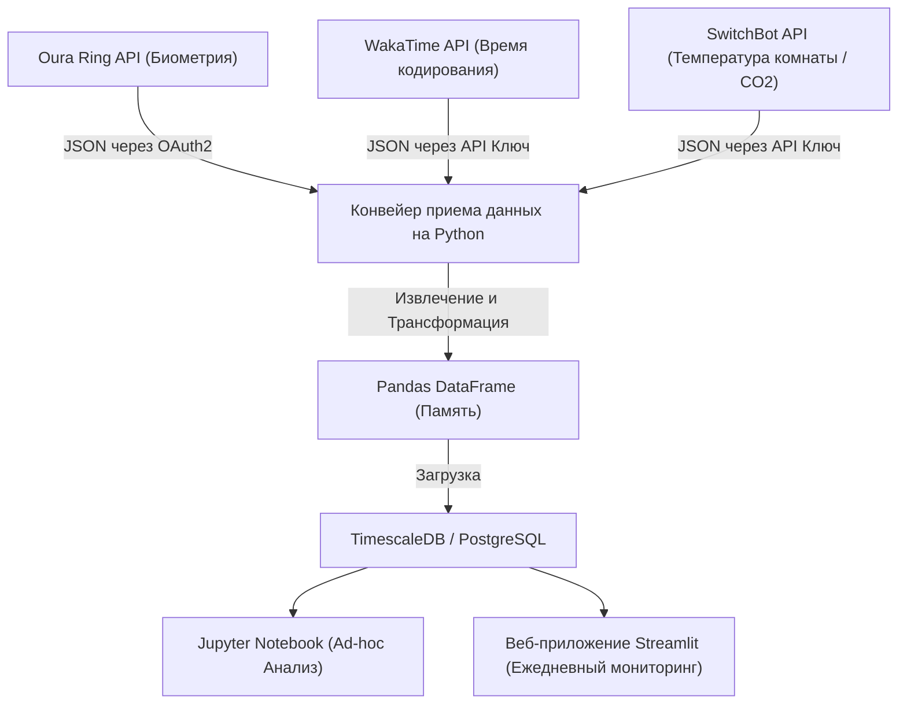
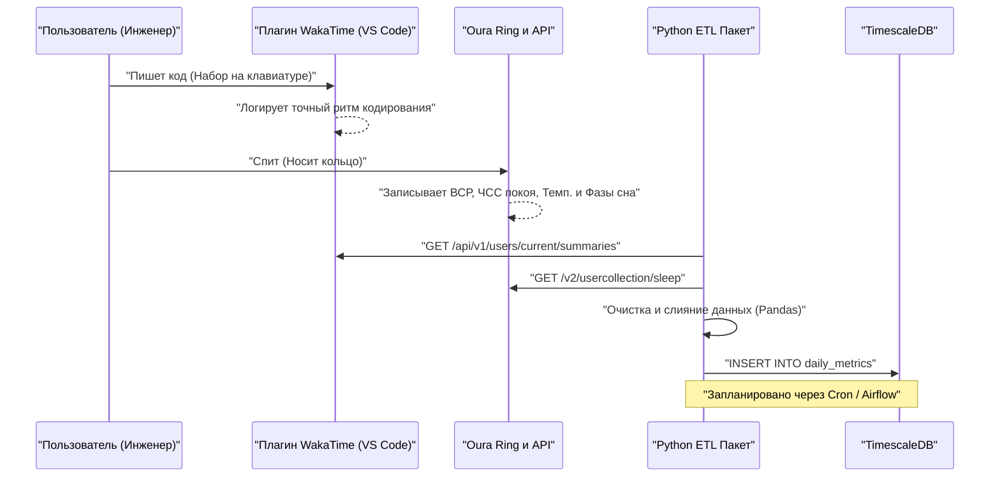
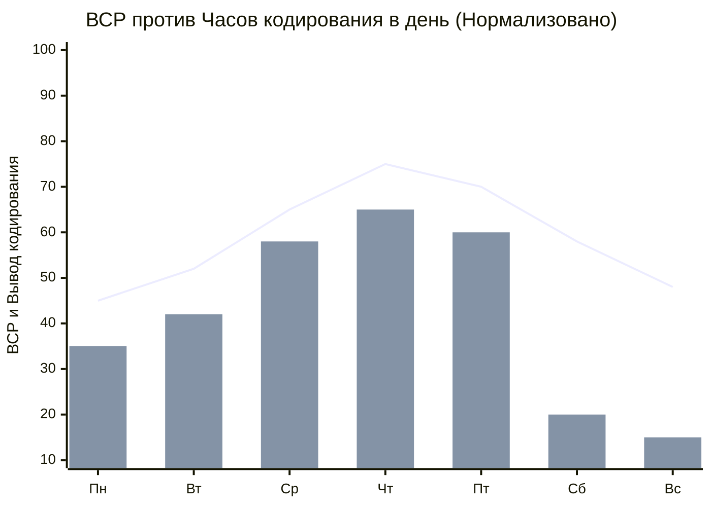

## 1. Введение: На стыке программной инженерии и биохакинга

Современная программная инженерия — это изнурительный интеллектуальный труд, связанный с экстремальными когнитивными нагрузками и длительным сидячим образом жизни (Sedentary Lifestyle). Постоянное изучение меняющихся технологических стеков, поиск багов в сложных распределенных системах и давление дедлайнов. Чтобы преодолеть всё это, недостаточно просто полагаться на "силу воли" или "упорство". Необходим подход, при котором вы настраиваете свое тело как аппаратное обеспечение, подобно отладке системы — то есть "биохакинг" (Biohacking).

В прошлом мы полагались на субъективные ощущения (эвристику) вроде "сегодня я чувствую себя хорошо или плохо", но сегодня, благодаря распространению высокопроизводительных носимых устройств, таких как Oura Ring, Apple Watch и Garmin, мы можем неинвазивно получать биометрические данные 24 часа в сутки, 365 дней в году. В этой статье объясняется, как получать биометрические данные (ВСР, ЧСС покоя, архитектура сна) и данные о производительности (метрики кодирования с помощью WakaTime и т.д.) через API, и проводить корреляционный анализ с использованием подходов науки о данных с помощью Python и Pandas. Мы также очень подробно разберем научно обоснованные лайфхаки для здоровья инженеров, такие как математические модели циркадных ритмов и оптимальное время приема кофе на основе периода полувыведения кофеина.

## 2. То, что нельзя измерить, нельзя контролировать: Оборудование для получения биометрических данных

Каждый сенсор (носимое устройство) для получения биометрических данных имеет свои сильные стороны. Первым шагом в управлении здоровьем на основе данных является выбор оптимального устройства в соответствии с вашими целями.

### 2.1 Oura Ring (Generation 3 / 4)
Поскольку данные собираются непосредственно с артерий пальца, оно отличается очень высокой точностью измерения частоты сердечных сокращений во время сна, вариабельности сердечного ритма (ВСР) и изменения температуры поверхности тела по сравнению с умными часами на запястье. На пальцах густая сеть капилляров, что позволяет оптическому датчику пульса (PPG: фотоплетизмография) получать данные с низким уровнем шума. Кроме того, устройство обладает богатым REST API, позволяющим легко экспортировать необработанные данные в формате JSON через OAuth2.0, что делает его самым удобным для "хакинга" устройством для инженеров.

### 2.2 Apple Watch Series / Ultra
Отлично подходит для отслеживания активности, измерения насыщения крови кислородом (SpO2) и электрокардиограммы (ЭКГ). Это лучшее устройство для отслеживания уровня активности в течение дня и измерения ВСР по требованию через приложения для осознанности (приложение "Дыхание"). Однако экспорт данных требует использования HealthKit, и для прямого доступа из Python и т.д. потребуется промежуточный шаг, например, экспорт в CSV через приложения iOS (такие как AutoSleep или HealthFit).

### 2.3 Garmin (Fenix / Forerunner)
Помимо точности GPS-трекинга, уникальный показатель остатка энергии под названием "Body Battery" является превосходным. Он рассчитывается на основе ВСР и уровня стресса. Данные Garmin можно получить через API Garmin Connect, но поскольку существует барьер в виде корпоративного API, индивидуальным разработчикам необходимо использовать библиотеки с открытым исходным кодом или инструменты для парсинга, созданные энтузиастами.

В этой статье основное внимание будет уделено данным с **Oura Ring**, которое является вершиной в отслеживании сна и восстановления, и из которого чрезвычайно легко извлекать данные через API, а также данным с **WakaTime**, который измеряет время кодирования в качестве плагина для IDE (таких как VS Code и IntelliJ).

## 3. Базовая теория биометрических данных: Наука о данных ВСР и ЧСС покоя

С точки зрения науки о данных "восстановление" (Recovery) определяется не просто таким показателем, как "долго спал — значит хорошо", а двумя следующими главными метриками.

### 3.1 ВСР (Вариабельность сердечного ритма: Heart Rate Variability) и моделирование вегетативной нервной системы
Сердце не бьется в постоянном ритме, как метроном. Например, даже если частота сердечных сокращений составляет 60 ударов в минуту, интервал между каждым ударом (интервал R-R) всегда колеблется, например, "0,92 секунды", "1,05 секунды", "0,98 секунды". Количественное выражение величины этого колебания — это ВСР (вариабельность сердечного ритма).

ВСР напрямую отражает баланс вегетативной нервной системы, то есть "симпатической нервной системы (газ)" и "парасимпатической нервной системы (тормоз)". В состоянии стресса, переутомления или после употребления алкоголя симпатическая нервная система доминирует, биение сердца становится более равномерным, а ВСР снижается. Наоборот, в состоянии полного расслабления и восстановления доминирует парасимпатическая (блуждающий нерв) нервная система, пульс динамически колеблется в такт дыханию, и ВСР повышается.

Существуют два подхода к расчету ВСР: во временной области (Time-domain) и в частотной области (Frequency-domain). Наиболее часто используемым в анализе во временной области и применяемым в Oura Ring и Apple Watch является **RMSSD (Root Mean Square of Successive Differences)**. Это среднеквадратичное значение разности между последовательными межкардиоинтервалами (RR-интервалами).

Строго математически это выражается следующим образом:

$$ RMSSD = \sqrt{\frac{1}{N-1} \sum_{i=1}^{N-1} (RR_{i+1} - RR_i)^2} $$

Где,
- $N$ — общее количество измеренных сердечных сокращений
- $RR_i$ — $i$-й RR-интервал (в миллисекундах)

Для инженера, если ВСР (RMSSD) при пробуждении утром значительно ниже индивидуального базового уровня (скользящее среднее за последние несколько недель), это позволяет принять решение на основе данных: "Сегодня следует избегать проектирования архитектуры с высокой когнитивной нагрузкой или деплоя в продакшен, а вместо этого посвятить день расширению тестового покрытия или написанию документации".

### 3.2 Частота сердечных сокращений в покое (ЧСС покоя - RHR: Resting Heart Rate) и сигналы восстановления
RHR (ЧСС покоя) — это количество ударов сердца в минуту, когда тело полностью расслаблено (обычно во время сна). После употребления алкоголя, переедания в позднее время или в качестве раннего симптома болезни (например, инфекции), когда организм тратит энергию на внутренний метаболизм или иммунную реакцию, RHR поднимается на несколько или даже более десяти ударов в минуту выше базового уровня.

Чем ниже RHR, тем больше крови сердечная мышца может перекачать за один удар (высокий ударный объем), что указывает на высокую аэробную способность и степень восстановления после усталости. В идеале кривая RHR должна иметь форму "гамака", достигая наименьшего значения в первой половине сна, что свидетельствует о наиболее качественном восстановлении.

## 4. Детальный анализ архитектуры сна

Производительность мозга инженера определяется не только "количеством" сна, но и его "качеством", то есть архитектурой сна (Sleep Architecture). Ночной сон обычно состоит из 4-5 циклов по 90-110 минут.

### 4.1 NREM-сон Стадии 1-2 (Легкий сон / Light Sleep)
Это подготовительная стадия, когда мозговые волны постепенно замедляются, и тело начинает расслабляться. Составляет около 50% всего сна. Хотя вклад в когнитивное восстановление невелик, это важный мост для перехода к следующей стадии глубокого сна.

### 4.2 NREM-сон Стадия 3 (Глубокий сон / Deep Sleep / Slow Wave Sleep: SWS)
В мозговых волнах появляются дельта-волны (низкие частоты 0,5-2 Гц), это основное время для физического восстановления тела. Секретируется большое количество гормона роста, и происходит восстановление клеток. Это также необходимо для укрепления иммунной системы, и напрямую связано не только с восстановлением мышечной усталости у спортсменов, но и со снятием зрительного напряжения и восстановлением мышц шеи и плеч у инженеров. Глубокий сон обычно концентрируется в циклах первой половины сна.

### 4.3 REM-сон (Быстрый сон / Rapid Eye Movement)
Мозг так же активен, как и во время бодрствования, но мышцы тела парализованы. Для инженеров этот REM-сон чрезвычайно важен; он играет роль в систематизации в мозгу синтаксиса новых языков программирования или сложных концепций алгоритмов, изученных в течение дня, и их закреплении в долговременной памяти (Memory Consolidation). Нейропластичность (Neuroplasticity) повышается, и способность к творческому решению проблем ("внезапно придумал, как исправить баг, принимая душ") также усиливается благодаря REM-сну. REM-сон имеет тенденцию удлиняться во второй половине сна (ближе к утру).

Другими словами, "сокращение времени сна путем принудительного раннего пробуждения по будильнику" означает локальное и значительное сокращение REM-сна, связанного с закреплением памяти и креативностью, что равносильно критическому багу, который существенно снижает вашу производительность как инженера.

## 5. Непрерывный мониторинг уровня глюкозы (CGM) и защита от спайков

В последние годы внедрение CGM (Continuous Glucose Monitor: устройство для непрерывного мониторинга уровня глюкозы) стало обязательным среди биохакеров. Типичными устройствами являются FreeStyle Libre и Dexcom.
При употреблении пищи (особенно углеводов и сахара) концентрация глюкозы в крови резко возрастает (спайк уровня сахара в крови), а затем резко падает (краш) из-за массовой секреции инсулина. Во время этого "краша" возникает сильная сонливость (Brain Fog) и снижение концентрации. Сонливость "проклятых 2 часов дня" после обеда, скорее всего, вызвана не только биологическими часами, но и скачком уровня сахара в крови из-за чрезмерного потребления рамена или белого риса.

Кривую реакции уровня глюкозы в крови $G(t)$ можно приблизительно выразить с помощью следующей модели затухающих колебаний как разницу между скоростью всасывания потребленных углеводов и клиренсом под действием инсулина:

$$ G(t) = G_{base} + \Delta G \cdot e^{-\alpha t} \sin(\beta t) $$

Где,
- $G_{base}$: Уровень глюкозы натощак (базовый уровень)
- $\Delta G$: Амплитуда повышения уровня глюкозы после еды
- $\alpha$: Коэффициент затухания, основанный на чувствительности к инсулину и скорости метаболизма
- $\beta$: Частотная составляющая колебаний
- $t$: Время, прошедшее после еды

Чтобы поддерживать производительность инженера, важно минимизировать $\Delta G$ (амплитуду). В частности, эффективны такие лайфхаки, как "сначала есть овощи (клетчатку)", "избегать рафинированных углеводов" и "совершать 15-минутную легкую прогулку после еды (активирует транспортер GLUT4 и поглощает глюкозу в мышцы независимо от инсулина)".

## 6. Проектирование архитектуры: Построение локального конвейера данных

Построим локальный конвейер данных для интегрированного анализа биометрических данных и данных о производительности.
Следующая диаграмма Mermaid (блок-схема) показывает процесс от получения данных из API до их визуализации на дашборде.



Благодаря этой архитектуре мы сможем автоматически ежедневно отслеживать корреляцию между нашим физическим состоянием (ввод) и производительностью кодирования (вывод).

Давайте рассмотрим последовательность взаимодействия между системами более подробно.



## 7. Прием данных с помощью Python и Pandas

Давайте посмотрим, как использовать скрипт Python для фактического получения данных из API Oura Ring и WakaTime и их интеграции в виде Pandas DataFrame. Мы создадим надежный код, который выдержит практическое применение.

```python
import requests
import pandas as pd
from datetime import datetime, timedelta
import os

# Environment Variables
OURA_TOKEN = os.getenv("OURA_ACCESS_TOKEN")
WAKATIME_API_KEY = os.getenv("WAKATIME_API_KEY")

def fetch_oura_sleep_data(start_date: str, end_date: str) -> pd.DataFrame:
    """Fetch daily sleep summary from Oura Ring API v2."""
    url = "https://api.ouraring.com/v2/usercollection/sleep"
    params = {"start_date": start_date, "end_date": end_date}
    headers = {"Authorization": f"Bearer {OURA_TOKEN}"}
    
    response = requests.get(url, headers=headers, params=params)
    response.raise_for_status() # Raise exception for 4xx/5xx errors
    data = response.json().get("data", [])
    
    if not data:
        return pd.DataFrame()
        
    df = pd.json_normalize(data)
    # Extract deeply nested values or select essential columns
    df = df[['day', 'score', 'time_in_bed', 'total_sleep_duration', 
             'average_hrv', 'lowest_heart_rate', 
             'deep_sleep_duration', 'rem_sleep_duration']]
             
    # Convert dates to datetime objects and set as index
    df['day'] = pd.to_datetime(df['day'])
    df.set_index('day', inplace=True)
    return df

def fetch_wakatime_data(start_date: str, end_date: str) -> pd.DataFrame:
    """Fetch coding duration summaries from WakaTime API."""
    url = "https://wakatime.com/api/v1/users/current/summaries"
    params = {"start": start_date, "end": end_date, "api_key": WAKATIME_API_KEY}
    
    response = requests.get(url, params=params)
    response.raise_for_status()
    data = response.json().get("data", [])
    
    records = []
    for day_data in data:
        date_str = day_data['range']['date']
        # Extract total seconds spent coding
        total_seconds = day_data['grand_total']['total_seconds']
        records.append({'day': date_str, 'coding_hours': total_seconds / 3600.0})
        
    df = pd.DataFrame(records)
    if not df.empty:
        df['day'] = pd.to_datetime(df['day'])
        df.set_index('day', inplace=True)
    return df

if __name__ == "__main__":
    # Fetch data for the last 60 days
    end = datetime.now().strftime("%Y-%m-%d")
    start = (datetime.now() - timedelta(days=60)).strftime("%Y-%m-%d")
    
    oura_df = fetch_oura_sleep_data(start, end)
    waka_df = fetch_wakatime_data(start, end)
    
    # Merge datasets on 'day' index using inner join
    merged_df = pd.merge(oura_df, waka_df, left_index=True, right_index=True, how='inner')
    
    # Save raw data to CSV/DB
    merged_df.to_csv("health_productivity_raw.csv")
    print(f"Ingested {len(merged_df)} days of data.")
```

## 8. Предобработка данных и разработка признаков (Feature Engineering)

Опасно использовать полученные необработанные данные напрямую для анализа. Необходимо обработать пропущенные значения (Missing Values) из-за забытой зарядки устройств и сгенерировать новые значимые показатели (разработка признаков: Feature Engineering).

```python
def engineer_features(df: pd.DataFrame) -> pd.DataFrame:
    """Apply feature engineering and cleaning to the merged dataframe."""
    df = df.copy()
    
    # 1. Handle missing values (e.g., forward fill)
    df.fillna(method='ffill', inplace=True)
    
    # 2. Calculate Sleep Efficiency
    # Formula: (Total Sleep Time / Time in Bed) * 100
    df['sleep_efficiency_pct'] = (df['total_sleep_duration'] / df['time_in_bed']) * 100
    
    # 3. Calculate Sleep Stage Ratios
    df['rem_ratio'] = df['rem_sleep_duration'] / df['total_sleep_duration']
    df['deep_ratio'] = df['deep_sleep_duration'] / df['total_sleep_duration']
    
    # 4. Calculate 7-day Moving Averages (Rolling Mean) to smooth out daily noise
    df['hrv_7d_ma'] = df['average_hrv'].rolling(window=7).mean()
    df['rhr_7d_ma'] = df['lowest_heart_rate'].rolling(window=7).mean()
    
    # 5. Calculate daily deviation from baseline
    df['hrv_deviation'] = df['average_hrv'] - df['hrv_7d_ma']
    
    # 6. Normalize targets for Machine Learning (Optional)
    from sklearn.preprocessing import MinMaxScaler
    scaler = MinMaxScaler()
    df[['hrv_scaled', 'coding_scaled']] = scaler.fit_transform(df[['average_hrv', 'coding_hours']])
    
    # Drop rows with NaN generated by rolling window
    df.dropna(inplace=True)
    
    return df

processed_df = engineer_features(merged_df)
```

## 9. Корреляционный анализ: Пересечение производительности и показателей здоровья

На основе предварительно обработанных данных мы проанализируем взаимосвязь между показателями здоровья и производительностью кодирования. Гипотеза заключается в том, что "в дни с высокой ВСР (когда вегетативная нервная система сбалансирована и восстановлена), концентрация сохраняется дольше, время кодирования увеличивается, или можно выполнять более сложные задачи".


*(Примечание: Линейный график показывает отклонение от нормализованного базового уровня ВСР, а гистограмма показывает время кодирования WakaTime. Можно увидеть корреляцию, при которой вывод кодирования максимизируется со среды по пятницу, когда достигается достаточное восстановление)*

Мы рассчитаем коэффициент корреляции (коэффициент корреляции Пирсона $r$) с помощью Pandas и проверим статистическую значимость (p-значение) с помощью SciPy.

```python
import scipy.stats as stats

# Select numerical columns for correlation matrix
cols_of_interest = ['average_hrv', 'score', 'deep_sleep_duration', 'rem_sleep_duration', 'coding_hours']
correlation_matrix = processed_df[cols_of_interest].corr()

print("Correlation with Coding Hours:")
print(correlation_matrix['coding_hours'].sort_values(ascending=False))

# Calculate Pearson correlation coefficient and p-value for REM sleep and Coding Hours
r, p_value = stats.pearsonr(processed_df['rem_sleep_duration'], processed_df['coding_hours'])
print(f"REM Sleep vs Coding Hours: r = {r:.3f}, p-value = {p_value:.4f}")
```

Во многих случаях наблюдается значимая положительная корреляция ($p < 0.05$) между `average_hrv` или `rem_sleep_duration` и `coding_hours`. В частности, в сообществе инженеров, занимающихся "количественным измерением себя" (Quantified Self), часто сообщается, что продолжительность REM-сна в предыдущую ночь сильно влияет на "время, необходимое для устранения ошибок (отладки)" и "производительность" в текущий день.

## 10. Математическая модель циркадных ритмов и оптимизация когнитивных пиков

У людей есть биологические часы с циклом около 24 часов, называемые циркадным ритмом (Circadian Rhythm). В зависимости от этого ритма колеблются температура тела, секреция гормонов (утренний спайк кортизола и ночная секреция мелатонина) и "когнитивные способности".

Колебания циркадного ритма часто аппроксимируются с помощью математической модели, использующей косинусоиду (модель Cosinor), и изменения биометрических показателей можно сформулировать следующим образом:

$$ y(t) = M + A \cos\left(\frac{2\pi}{24}(t - \phi)\right) + e(t) $$

- $y(t)$: Биометрический показатель в момент времени $t$ (например, температура кора тела или уровень бдительности)
- $M$: MESOR (Midline Estimating Statistic of Rhythm) - центральное значение ритма (средний уровень)
- $A$: Амплитуда (Amplitude) - величина колебаний
- $\phi$: Акрофаза (Acrophase) - фаза (время) пика
- $e(t)$: Член ошибки из-за факторов окружающей среды и т.д.

В контексте инженерии эта формула означает, что "время суток ($\phi$), когда производительность (уровень бдительности) достигает пика, биологически детерминировано, и в это время следует назначать задачи с наибольшей когнитивной нагрузкой (исправление сложных багов, проектирование новой архитектуры)".

В случае типичного утреннего хронотипа (Morning Lark) первый когнитивный пик наступает через 2-4 часа после пробуждения (например, с 9:00 до 11:00). Затем, около 14:00, наступает спад циркадного ритма (Post-lunch dip), и еще один небольшой пик приходится на вечер. Выявление вашего пикового времени ($\phi$) по уровню активности из данных носимых устройств и субъективному уровню концентрации, а затем защита этого времени с помощью "блокировки времени" в Google Календаре и т.д. — это лучший лайфхак для здоровья. Назначать бессмысленные встречи на пиковое время — все равно что выделять самое производительное ядро процессора для процесса ожидания.

## 11. Фармакокинетика кофеина и оптимальное время приема

Инженеры и кофе неразделимы, но чрезмерное употребление кофеина или употребление в позднее время блокирует аденозиновые рецепторы в мозге и разрушает "глубокий сон" (Deep Sleep) ночью. Субъективно вам может казаться, что вы спите хорошо, но посмотрев на данные Oura Ring, вы можете увидеть, что ваш пульс не падает, а доля глубокого сна резко снижается.

Выведение кофеина из организма подчиняется кинетике первого порядка (First-order kinetics). Другими словами, концентрация в крови снижается экспоненциально.

$$ C(t) = C_0 e^{-k t} $$

Где,
- $C(t)$: Концентрация кофеина в крови по прошествии времени $t$
- $C_0$: Начальная концентрация (максимальная концентрация сразу после приема)
- $k$: Константа скорости элиминации (выведения)
- $t$: Время, прошедшее с момента приема (в часах)

Константа скорости элиминации $k$ выражается через период полувыведения кофеина ($t_{1/2}$) следующим образом:

$$ k = \frac{\ln(2)}{t_{1/2}} $$

Для здорового взрослого человека период полувыведения кофеина $t_{1/2}$ составляет около **5-6 часов**, хотя это зависит от индивидуальной генетики (ген CYP1A2).
Например, предположим, что вы выпили 1 чашку капельного кофе (около 150 мг кофеина) в 15:00 ($C_0 = 150$). Если период полувыведения составляет 5,5 часов, то $k \approx 0.126$.
Рассчитав концентрацию остаточного кофеина в организме ко времени отхода ко сну в 23:00 (через 8 часов):

$$ C(8) = 150 \times e^{-0.126 \times 8} = 150 \times e^{-1.008} \approx 150 \times 0.365 = 54.75 \text{ мг} $$

Другими словами, ко времени сна в организме все еще остается 54 мг кофеина (немного больше, чем в 1 чашке эспрессо), что напрямую негативно влияет на архитектуру сна.
Вывод на основе данных, полученный из этой фармакокинетической модели, заключается в том, что **"для обеспечения качественного сна прием кофеина следует начинать через 90 минут после пробуждения (после того как уляжется спайк кортизола), и полностью прекращать не позднее 14:00 (за 9-10 часов до сна)"**.

## 12. Взлом переменных среды (Lux, Температура, CO2)

Важно оптимизировать не только внутреннюю систему собственного тела, но и внешние переменные среды (Environment Variables).

### 12.1 Программирование световой среды (Lux)
Самый мощный "Zeitgeber (синхронизатор: сигнал, указывающий время)" для сброса циркадных ритмов — это свет. Утром, когда около 100 000 люкс солнечного света попадает на фоторецепторные клетки сетчатки (ipRGC), секреция мелатонина прекращается, и таймер сбрасывается. И наоборот, ночью необходимо блокировать синий свет, чтобы не препятствовать секреции мелатонина. Эффективно не только снижать цветовую температуру дисплея с помощью такого программного обеспечения, как f.lux, но и управлять умным освещением (например, Philips Hue) через API, написав скрипт, который автоматически снижает освещенность и цветовую температуру в комнате после захода солнца.

### 12.2 Контроль температуры в спальне и латентность сна (Sleep Latency)
Люди засыпают при снижении температуры кора тела (Core Body Temperature). Поддерживая в спальне прохладную температуру 18-19 градусов и ложась в постель точно в момент резкого падения температуры кора тела, которая была временно повышена теплой ванной за 90 минут до сна, можно кардинально сократить латентность сна (Sleep Latency: время от момента укладывания в постель до засыпания) и максимизировать глубокий сон.

### 12.3 Концентрация CO2 и снижение когнитивных функций
Если вы добавите API концентратора SwitchBot или метеостанции Netatmo в свой конвейер данных, вы увидите четкую отрицательную корреляцию между концентрацией углекислого газа (CO2) в помещении и производительностью.
Как показывают исследования Гарвардского университета и другие, когда концентрация CO2 превышает 1000 ppm, когнитивные функции (особенно способность принимать стратегические решения) начинают значительно снижаться, а превышение 2000 ppm вызывает серьезное падение производительности. Удаленная работа в закрытом помещении зимой незаметно снижает вашу производительность.

```python
# Pseudo-code for intelligent room ventilation using Home Assistant / SwitchBot API
import requests

def check_and_ventilate():
    # Get current CO2 level from Netatmo/SwitchBot API
    co2_ppm = get_sensor_data("co2_sensor_id")
    
    if co2_ppm > 1000:
        print(f"Warning: CO2 level high ({co2_ppm} ppm). Cognitive decline risk.")
        # Trigger smart plug to turn on ventilation fan
        turn_on_smart_plug("ventilation_fan_id")
        # Send notification to Slack/Discord
        send_notification("Вентилятор включен. Уровень CO2 высокий.")
    elif co2_ppm < 600:
        turn_off_smart_plug("ventilation_fan_id")
```
Регулярно выполняя такой скрипт с помощью Cron, вы создадите автономную систему контроля среды, которая всегда поддерживает оптимальную концентрацию кислорода.

## 13. Заключение: CI/CD системы человеческого тела

Попробуйте рассматривать собственное тело как единую сложную распределенную систему. Носимые устройства (Oura Ring) — это экспортеры метрик для мониторинга (Prometheus), скрипты Python/Pandas — это конвейер анализа логов (Logstash/Fluentd), а ежедневные изменения физического состояния и производительности — это здоровье системы, отображаемое на дашборде (Grafana/Streamlit).

"Работа в ущерб времени сна" — это то же самое, что и форсированное добавление функций, игнорируя технический долг (Technical Debt). В краткосрочной перспективе вы можете успеть к релизу, но в долгосрочной перспективе это обязательно приведет к сбою системы (выгоранию, серьезным проблемам со здоровьем, депрессии).

Мониторинг ВСР, проверка трендов ЧСС покоя, оптимизация архитектуры сна. И ежедневная тонкая настройка "гиперпараметров", таких как питание, упражнения, сон и окружающая среда, с одновременным анализом корреляции с данными о производительности WakaTime. Это не что иное, как процесс **CI/CD (непрерывная интеграция и непрерывная доставка)** для человеческого тела.

Давайте использовать науку о данных и API для инжиниринга такого состояния здоровья, которое позволит вам достичь максимальной производительности. Ведь качество кода, который вы пишете, напрямую зависит от здоровья вашей собственной биологической системы.

---
*Отказ от ответственности (Disclaimer): Эта статья суммирует личные эксперименты автора и подходы науки о данных, и не содержит медицинских советов. Если у вас наблюдается постоянное плохое самочувствие или нарушения сна, пожалуйста, проконсультируйтесь со специализированным медицинским учреждением.*
