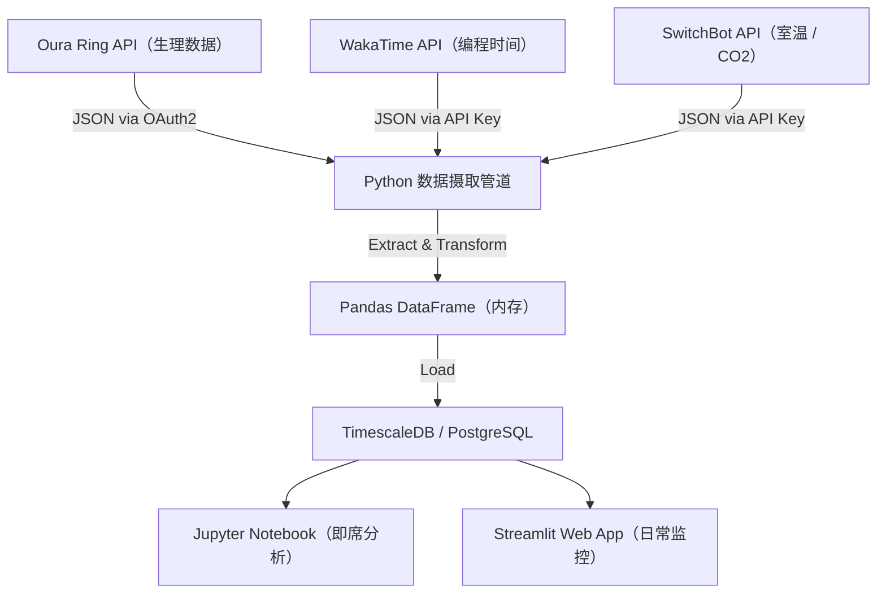
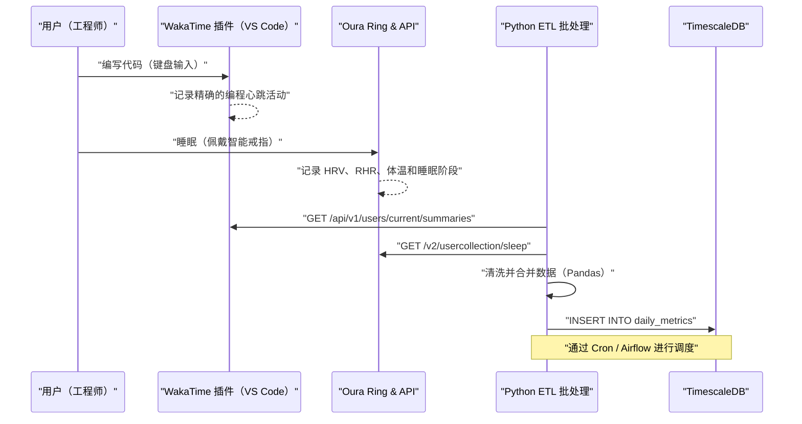
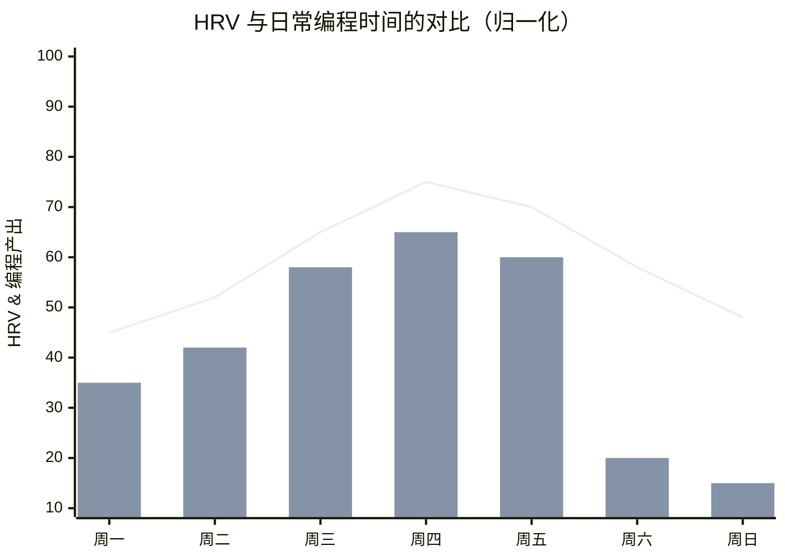

## 1. 简介：软件工程师与生物黑客（Biohacking）的交汇点

现代的软件工程是一项伴随着极度认知负荷和长时间久坐（Sedentary Lifestyle）的严酷智力劳动。我们需要不断跟进不断变化的技术栈，在复杂的分布式系统中寻找Bug，以及承受交付期限的压力。为了克服这些困难，仅仅依靠“干劲”和“毅力”是行不通的，我们必须像调试系统一样去调试自己的身体这个“硬件”，这种方法即“生物黑客（Biohacking）”，是必不可少的。

过去，我们依赖于“今天感觉状态好/不好”这种主观感觉（启发式判断）；而在现代，得益于Oura Ring、Apple Watch、Garmin等高性能可穿戴设备的普及，我们能够24小时365天无创地获取生理数据。本文将详细讲解如何通过API获取生理数据（HRV、RHR、睡眠架构）与生产力数据（通过WakaTime等获取的编程指标），并利用Python和Pandas以数据科学的方法进行相关性分析。此外，本文还将极具细节地探讨基于科学依据的工程师健康黑客技术，如昼夜节律（Circadian Rhythm）的数学模型、基于咖啡因代谢半衰期的最佳咖啡摄入时机等。

## 2. 无法测量就无法管理：获取生理数据的硬件

用于获取生理数据的传感器（可穿戴设备）各有其擅长的领域。在数据驱动的健康管理中，根据目标选择最合适的设备是第一步。

### 2.1 Oura Ring (Generation 3 / 4)
因为直接从手指动脉获取数据，与在手腕处进行测量的智能手表相比，其睡眠时的心率、心率变异性（HRV）以及体表温度变化的测量精度非常高，这是它的特点。手指上密布毛细血管，通过光学心率传感器（PPG: Photoplethysmography）可以获取低噪声的数据。此外，其REST API非常完善，能够通过OAuth2.0轻松导出JSON格式的原始数据，可以说是对工程师而言最具“黑客友好度（Hackable）”的设备。

### 2.2 Apple Watch Series / Ultra
它在活动追踪、血氧饱和度（SpO2）以及心电图（ECG）的测量方面表现出色。在白天的活动量记录以及通过正念App（呼吸App）进行按需HRV测量方面，它是最强的设备。然而，在导出数据时必须经过HealthKit，若想用Python等进行直接访问，则需要通过iOS App（如AutoSleep或HealthFit）导出CSV，中间多了一个步骤。

### 2.3 Garmin (Fenix / Forerunner)
除了GPS追踪的精度外，被称为“身体电量（Body Battery）”的独家剩余能量指标也非常优秀。该指标是基于HRV和压力水平计算得出的。Garmin的数据可以通过Garmin Connect API获取，但因为存在面向企业的API壁垒，对于个人开发者来说，需要使用开源库或者利用爱好者编写的爬虫工具。

本文将以在睡眠与恢复追踪方面达到顶峰、并且极易通过API提取数据的 **Oura Ring** 数据，以及作为IDE（VS Code或IntelliJ等）插件用于测量编程时间的 **WakaTime** 数据为主线进行讲解。

## 3. 生理数据的基础理论：HRV与RHR的数据科学

我们不能简单地使用“睡眠时间长就好”这种粗糙的指标。从数据科学的角度来看，以下两个指标才是“恢复（Recovery）”的核心指标。

### 3.1 HRV（心率变异性：Heart Rate Variability）与自主神经建模
心脏并不是像节拍器那样以固定的节奏跳动的。例如，即便心率为60bpm，每一次心跳之间的间隔（R-R间期）也是不断波动的，比如“0.92秒”、“1.05秒”、“0.98秒”。将这种波动的大小数值化后，即为HRV（心率变异性）。

HRV直接反映了自主神经系统，即“交感神经（油门）”和“副交感神经（刹车）”之间的平衡。在压力状态、过度疲劳或饮酒后，交感神经处于优势状态，心脏的跳动趋于规律，HRV会下降。相反，在充分放松并恢复的状态下，副交感神经（迷走神经）处于优势，心跳会随着呼吸进行动态变化，HRV则会升高。

HRV的计算分为时域（Time-domain）和频域（Frequency-domain）两种方法。在时域分析中最常使用的、并且被Oura Ring和Apple Watch采用的是 **RMSSD (Root Mean Square of Successive Differences)**。它用于计算相邻心跳间隔（RR间期）差值的均方根。

用数学公式严格表示如下：

$$ RMSSD = \sqrt{\frac{1}{N-1} \sum_{i=1}^{N-1} (RR_{i+1} - RR_i)^2} $$

其中，
- $N$ 为测量到的总心跳数
- $RR_i$ 为第 $i$ 个RR间期（毫秒）

对于工程师来说，如果早晨醒来时的HRV（RMSSD）相较于个人基线（过去几周的移动平均值）出现了大幅下降，就可以做出数据驱动的决策：“今天应该避免进行高认知负荷的架构设计或是向生产环境部署，而应把时间用在扩充测试代码和编写文档上”。

### 3.2 静态心率（RHR：Resting Heart Rate）与恢复信号
RHR是指身体处于完全放松状态（通常是睡眠期间）下每分钟的心跳次数。在饮酒后、深夜暴食或疾病（如感染症）的初期阶段，由于身体正在将能量分配给体内代谢或免疫反应，RHR会比基线升高几bpm到十几bpm。

RHR越低，意味着心肌在一次跳动中能泵出更多的血液（每搏输出量大），这表明有氧运动能力较强或疲劳恢复程度较好。理想情况下，如果在睡眠的前半段RHR达到最低值，呈现出一个“吊床型（Hammock）”曲线，说明你获得了最高质量的恢复。

## 4. 睡眠架构详细解析

决定工程师大脑表现的不仅是睡眠的“量”，更重要的是“质”，即睡眠架构（Sleep Architecture）。一晚的睡眠通常会重复4到5次周期，每个周期为90到110分钟。

### 4.1 非快速眼动睡眠 阶段1〜2（浅睡 / Light Sleep）
脑电波逐渐变慢，是身体开始放松的准备阶段。它占整体睡眠的50%左右。虽然对认知恢复的贡献较小，但它是向下一个深度睡眠阶段过渡的重要桥梁。

### 4.2 非快速眼动睡眠 阶段3（深睡 / Deep Sleep / Slow Wave Sleep: SWS）
脑电波中出现德尔塔波（0.5〜2Hz的低频波），是身体进行物理恢复的核心时间段。此时会分泌大量生长激素，进行细胞修复。它对于强化免疫系统也是不可或缺的，不仅关系到运动员的肌肉疲劳恢复，也直接关系到工程师的视疲劳以及颈肩肌肉的修复。深度睡眠通常集中在睡眠周期的前半段。

### 4.3 快速眼动睡眠（REM睡眠：Rapid Eye Movement）
大脑的活动与清醒时一样活跃，但身体肌肉处于麻痹状态。对工程师来说，极其重要的是这种REM睡眠，它负责在脑内整理白天学到的新编程语言语法或复杂算法概念，并将其巩固为长期记忆（Memory Consolidation）。REM睡眠能够提高神经可塑性（Neuroplasticity），并增强创造性解决问题的能力（例如“在洗澡时突然灵光一闪找到Bug的解决办法”）。REM睡眠通常在睡眠的后半段（清晨）变得更长。

也就是说，“用闹钟强行早起从而削减睡眠时间”，意味着大幅削减了与记忆巩固和创造力相关的REM睡眠，这无异于引入了一个会显著降低工程师表现的严重Bug。

## 5. 连续血糖监测（CGM）与血糖峰值防御

近年来，在生物黑客圈子中，引入CGM（Continuous Glucose Monitor：连续动态血糖监测仪）已成为必备项。代表性的设备有FreeStyle Libre和Dexcom。
进食（特别是碳水化合物或糖分）后，血液中的葡萄糖浓度会急剧上升（血糖峰值），随后因为大量分泌胰岛素而出现急剧下降（崩溃）。在“崩溃”的阶段，会引发强烈的困意（脑雾，Brain Fog）以及注意力下降。午餐后“魔鬼般的下午2点”所产生的困意，很可能不仅仅是因为生物钟的影响，更可能是由于过量摄入拉面或白米饭导致的血糖峰值。

血糖值的响应曲线 $G(t)$ 可以近似表示为以下阻尼振荡模型，即摄入糖分的吸收速度与胰岛素清除作用之间的差值：

$$ G(t) = G_{base} + \Delta G \cdot e^{-\alpha t} \sin(\beta t) $$

其中，
- $G_{base}$: 空腹血糖值（基线）
- $\Delta G$: 进食引起的血糖上升幅度
- $\alpha$: 基于胰岛素敏感性和代谢速度的衰减系数
- $\beta$: 振荡频率成分
- $t$: 餐后经过的时间

为了保持工程师的表现，将 $\Delta G$（振幅）降至最低是非常重要的。具体来说，诸如“先吃蔬菜（膳食纤维）”、“避免精制碳水化合物”、“饭后进行15分钟的散步（以激活GLUT4转运蛋白，使肌肉以非胰岛素依赖的方式摄取血糖）”等黑客技巧非常有效。

## 6. 架构设计：构建本地数据流管道

我们将构建一个本地数据流管道，以综合分析生理数据和生产力数据。
以下的Mermaid图表（流程图）展示了从通过API获取数据到在仪表盘上可视化的完整流程。



通过这种架构，我们可以每天自动监控自身身体状况（输入）与编程表现（输出）之间的相关性。

此外，让我们详细看看系统之间的时序。



## 7. 使用Python和Pandas进行数据摄取

让我们实际看看如何使用Python脚本从Oura Ring和WakaTime的API中获取数据，并将其集成为Pandas DataFrame的过程。我们将构建能够承受实际生产环境运行的健壮代码。

```python
import requests
import pandas as pd
from datetime import datetime, timedelta
import os

# 环境变量
OURA_TOKEN = os.getenv("OURA_ACCESS_TOKEN")
WAKATIME_API_KEY = os.getenv("WAKATIME_API_KEY")

def fetch_oura_sleep_data(start_date: str, end_date: str) -> pd.DataFrame:
    """从 Oura Ring API v2 获取每日睡眠摘要。"""
    url = "https://api.ouraring.com/v2/usercollection/sleep"
    params = {"start_date": start_date, "end_date": end_date}
    headers = {"Authorization": f"Bearer {OURA_TOKEN}"}
    
    response = requests.get(url, headers=headers, params=params)
    response.raise_for_status() # 对 4xx/5xx 错误抛出异常
    data = response.json().get("data", [])
    
    if not data:
        return pd.DataFrame()
        
    df = pd.json_normalize(data)
    # 提取深度嵌套的值或选择必要的列
    df = df[['day', 'score', 'time_in_bed', 'total_sleep_duration', 
             'average_hrv', 'lowest_heart_rate', 
             'deep_sleep_duration', 'rem_sleep_duration']]
             
    # 将日期转换为 datetime 对象并设为索引
    df['day'] = pd.to_datetime(df['day'])
    df.set_index('day', inplace=True)
    return df

def fetch_wakatime_data(start_date: str, end_date: str) -> pd.DataFrame:
    """从 WakaTime API 获取编程时间摘要。"""
    url = "https://wakatime.com/api/v1/users/current/summaries"
    params = {"start": start_date, "end": end_date, "api_key": WAKATIME_API_KEY}
    
    response = requests.get(url, params=params)
    response.raise_for_status()
    data = response.json().get("data", [])
    
    records = []
    for day_data in data:
        date_str = day_data['range']['date']
        # 提取编程花费的总秒数
        total_seconds = day_data['grand_total']['total_seconds']
        records.append({'day': date_str, 'coding_hours': total_seconds / 3600.0})
        
    df = pd.DataFrame(records)
    if not df.empty:
        df['day'] = pd.to_datetime(df['day'])
        df.set_index('day', inplace=True)
    return df

if __name__ == "__main__":
    # 获取过去 60 天的数据
    end = datetime.now().strftime("%Y-%m-%d")
    start = (datetime.now() - timedelta(days=60)).strftime("%Y-%m-%d")
    
    oura_df = fetch_oura_sleep_data(start, end)
    waka_df = fetch_wakatime_data(start, end)
    
    # 使用 inner join 在 'day' 索引上合并数据集
    merged_df = pd.merge(oura_df, waka_df, left_index=True, right_index=True, how='inner')
    
    # 将原始数据保存为 CSV/DB
    merged_df.to_csv("health_productivity_raw.csv")
    print(f"Ingested {len(merged_df)} days of data.")
```

## 8. 数据预处理与特征工程

将获取到的原始数据直接用于分析是危险的。我们需要处理因设备忘记充电而导致的缺失值（Missing Values），并生成有意义的新指标（特征工程：Feature Engineering）。

```python
def engineer_features(df: pd.DataFrame) -> pd.DataFrame:
    """对合并后的 dataframe 应用特征工程和数据清理。"""
    df = df.copy()
    
    # 1. 处理缺失值（例如向前填充）
    df.fillna(method='ffill', inplace=True)
    
    # 2. 计算睡眠效率
    # 公式：(Total Sleep Time / Time in Bed) * 100
    df['sleep_efficiency_pct'] = (df['total_sleep_duration'] / df['time_in_bed']) * 100
    
    # 3. 计算睡眠阶段比例
    df['rem_ratio'] = df['rem_sleep_duration'] / df['total_sleep_duration']
    df['deep_ratio'] = df['deep_sleep_duration'] / df['total_sleep_duration']
    
    # 4. 计算 7 天移动平均（Rolling Mean）以平滑日常噪声
    df['hrv_7d_ma'] = df['average_hrv'].rolling(window=7).mean()
    df['rhr_7d_ma'] = df['lowest_heart_rate'].rolling(window=7).mean()
    
    # 5. 计算每天偏离基线的程度
    df['hrv_deviation'] = df['average_hrv'] - df['hrv_7d_ma']
    
    # 6. 为机器学习归一化目标变量（可选）
    from sklearn.preprocessing import MinMaxScaler
    scaler = MinMaxScaler()
    df[['hrv_scaled', 'coding_scaled']] = scaler.fit_transform(df[['average_hrv', 'coding_hours']])
    
    # 删除由滑动窗口生成的包含 NaN 的行
    df.dropna(inplace=True)
    
    return df

processed_df = engineer_features(merged_df)
```

## 9. 相关性分析：生产力与健康指标的交汇点

基于预处理后的数据，我们将分析健康指标与编程生产力之间的关系。作为一个假设，我们可以认为“HRV越高（自主神经平衡且恢复良好）的日子，注意力持续的时间就越长，编程时间也会增加，或者能够处理更加复杂的任务”。


*(注：折线图表示的是归一化后HRV偏离基线的程度，柱状图表示的是WakaTime记录的编程时间。可以看出，在得到充分恢复的周三至周五期间，编程产出被最大化的相关性十分明显)*

我们使用Pandas计算相关系数（皮尔逊积矩相关系数 $r$），并利用SciPy进行统计显著性（p值）检验。

```python
import scipy.stats as stats

# 为相关性矩阵选择数值列
cols_of_interest = ['average_hrv', 'score', 'deep_sleep_duration', 'rem_sleep_duration', 'coding_hours']
correlation_matrix = processed_df[cols_of_interest].corr()

print("Correlation with Coding Hours:")
print(correlation_matrix['coding_hours'].sort_values(ascending=False))

# 计算快速眼动（REM）睡眠和编程时间的皮尔逊相关系数和 p 值
r, p_value = stats.pearsonr(processed_df['rem_sleep_duration'], processed_df['coding_hours'])
print(f"REM Sleep vs Coding Hours: r = {r:.3f}, p-value = {p_value:.4f}")
```

在许多情况下，可以观察到 `average_hrv` 或 `rem_sleep_duration` 与 `coding_hours` 之间存在显著的正相关（$p < 0.05$）。特别是在许多工程师的量化自我（Quantified Self）社区中，也有报告指出，前一天的REM睡眠时长会强烈影响当天的“解决错误（调试）所需时间”和“生产力”。

## 10. 昼夜节律的数学模型与认知高峰优化

人类拥有一种被称为昼夜节律（Circadian Rhythm）的、周期约为24小时的生物钟。受这一节律的影响，体温、激素分泌（如早晨的皮质醇激增和夜间的褪黑素分泌）以及“认知能力”都会产生波动。

昼夜节律的波动通常用基于余弦曲线的数学模型（Cosinor模型）来近似表达，生理指标的变化可以公式化为：

$$ y(t) = M + A \cos\left(\frac{2\pi}{24}(t - \phi)\right) + e(t) $$

- $y(t)$: 在时间 $t$ 时的生理指标（例如：核心体温或清醒度）
- $M$: MESOR (Midline Estimating Statistic of Rhythm) - 节律的中心值（平均水平）
- $A$: 振幅（Amplitude） - 波动的大小
- $\phi$: 相位（Acrophase） - 达到高峰的相位（时间）
- $e(t)$: 由环境等因素引起的误差项

在工程实践中，这个公式意味着：“一天中表现（清醒度）达到高峰的时间段（$\phi$）是由生物学决定的，我们应该把认知负荷最高的工作（如棘手的Bug修复、新架构设计）分配在那个时间段”。

对于一般的早睡早起型（Morning Lark）作息模式，起床后2到4小时（例如上午9点至11点）会迎来第一个认知高峰。随后，在下午2点左右会出现昼夜节律的低谷（餐后困倦，Post-lunch dip），到了傍晚会再次出现一个小高峰。通过可穿戴设备的数据或主观专注度来确定自己的高峰时间（$\phi$），并使用Google日历等工具通过“时间块（Time Blocking）”来保护这段时间，是绝佳的健康黑客技巧。如果在高峰时间安排毫无意义的会议，就如同将性能最好的CPU核心分配给空闲进程一样。

## 11. 咖啡因的药代动力学与最佳摄入时机

工程师和咖啡之间有着密不可分的关系，但咖啡因过量摄入或在太晚的时间摄入，会阻断大脑中的腺苷受体，破坏夜间的“深度睡眠（Deep Sleep）”。即使主观上觉得自己睡着了，但查看Oura Ring的数据就会发现心率并未下降，而且深度睡眠的比例急剧减少。

咖啡因从体内的排出遵循一级反应动力学（First-order kinetics）。也就是说，其血液浓度呈指数级衰减。

$$ C(t) = C_0 e^{-k t} $$

其中，
- $C(t)$: 经过时间 $t$ 后的血液咖啡因浓度
- $C_0$: 初始浓度（摄入后的最大浓度）
- $k$: 消除速率常数
- $t$: 距离摄入后经过的时间（小时）

消除速率常数 $k$ 可以使用咖啡因的半衰期（$t_{1/2}$）表示如下：

$$ k = \frac{\ln(2)}{t_{1/2}} $$

对于健康的成年人，虽然也会因个人基因（CYP1A2基因）而异，但咖啡因的半衰期 $t_{1/2}$ 大约在 **5到6小时** 之间。
例如，假设在下午3点喝了一杯滴漏咖啡（约含150mg咖啡因）（即 $C_0 = 150$）。假设半衰期为5.5小时，则 $k \approx 0.126$。
计算在就寝时间晚上11点（8小时后）时体内的残留咖啡因浓度：

$$ C(8) = 150 \times e^{-0.126 \times 8} = 150 \times e^{-1.008} \approx 150 \times 0.365 = 54.75 \text{ mg} $$

也就是说，到了睡觉的时间，体内仍然残留有54mg（相当于略多于1杯意式浓缩咖啡）的咖啡因，这将直接对睡眠架构产生不良影响。
从这个药代动力学模型推导出的数据驱动结论是：**“为了确保高质量的睡眠，咖啡因的摄入应在起床90分钟后（皮质醇激增平息后）开始，并且最迟在下午2点（睡前9到10小时）之前彻底停止摄入。”**

## 12. 环境变量的黑客技术（Lux、温度、CO2）

不仅要优化我们身体这个内部系统，优化外部的环境变量（Environment Variables）同样重要。

### 12.1 光照环境（Lux）的编程化
能够重置昼夜节律的最强大的“授时因子（Zeitgeber：提示时间的线索）”是光。早晨，当大约100,000 Lux（勒克斯）的阳光进入视网膜的光感受器细胞（ipRGC）时，褪黑素的分泌就会停止，从而重置生物钟计时器。相反，在夜间必须屏蔽蓝光，以免阻碍褪黑素的分泌。除了使用f.lux等软件降低显示器的色温，更有效的方法是通过API控制智能照明（如Philips Hue等），编写脚本使其在日落时自动降低房间的照度和色温。

### 12.2 卧室温度控制与入睡潜伏期（Sleep Latency）
人类是通过核心体温（Core Body Temperature）下降来进入睡眠的。将卧室的温度保持在18到19度这种凉爽的状态，并在睡前90分钟洗个热水澡，短暂提高核心体温；然后算准核心体温急剧下降的时机钻进被窝，这样可以大幅缩短入睡潜伏期（Sleep Latency：从躺下到睡着的时间），并最大限度地增加深度睡眠。

### 12.3 CO2浓度与认知能力下降
如果将SwitchBot Hub或Netatmo气象站的API添加到数据管道中，我们会发现室内的二氧化碳（CO2）浓度与生产力之间存在明显的负相关。
正如哈佛大学等机构的研究所示，当CO2浓度超过1000ppm时，认知能力（特别是战略决策能力）开始显著下降；一旦超过2000ppm，就会引起严重的性能衰减。在冬天门窗紧闭的房间里进行远程办公，会在不知不觉中降低你的工作表现。

```python
# 使用 Home Assistant / SwitchBot API 进行智能房间通风的伪代码
import requests

def check_and_ventilate():
    # 从 Netatmo/SwitchBot API 获取当前的 CO2 水平
    co2_ppm = get_sensor_data("co2_sensor_id")
    
    if co2_ppm > 1000:
        print(f"Warning: CO2 level high ({co2_ppm} ppm). Cognitive decline risk.")
        # 触发智能插座开启排气扇
        turn_on_smart_plug("ventilation_fan_id")
        # 发送通知到 Slack/Discord
        send_notification("已启动排气扇。当前 CO2 浓度偏高。")
    elif co2_ppm < 600:
        turn_off_smart_plug("ventilation_fan_id")
```
通过使用Cron定期执行这样的脚本，就可以打造一个始终维持最佳氧气浓度的自主环境控制系统。

## 13. 结论：人体系统的CI/CD

请试着将你自己的身体视为一个复杂的分布式系统。可穿戴设备（Oura Ring）是用于监控的指标导出器（Prometheus），Python/Pandas脚本是日志分析管道（Logstash/Fluentd），而每天身体状态的变化和表现则是展示在仪表盘（Grafana/Streamlit）上的系统健康度。

“削减睡眠时间来工作”就像是无视技术债务（Technical Debt）强行增加新功能。短期内或许能赶上发布，但长期来看，必定会导致系统崩溃（职业倦怠、严重的健康损害或抑郁症）。

监控HRV、检查RHR趋势，并优化睡眠架构。同时结合WakaTime生产力数据的相关性，每天微调饮食、运动、睡眠、环境等“超参数（Hyperparameters）”。这正是一个针对人体的 **CI/CD（持续集成·持续交付）** 过程。

让我们充分利用数据科学和API，运用工程化的思维来打造能发挥出最高性能的健康状态吧。因为你写出的代码质量，与你自己生理系统的健康程度是直接相关的。

---
*Disclaimer: 本文是对作者个人实验和数据科学方法的总结，不提供医疗建议。如果持续出现身体不适或睡眠障碍，请咨询专业医疗机构。*
