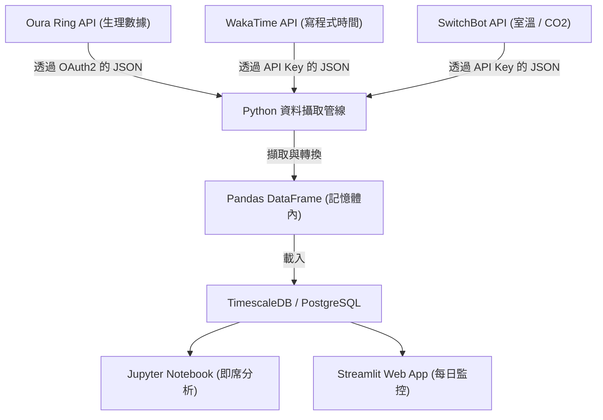
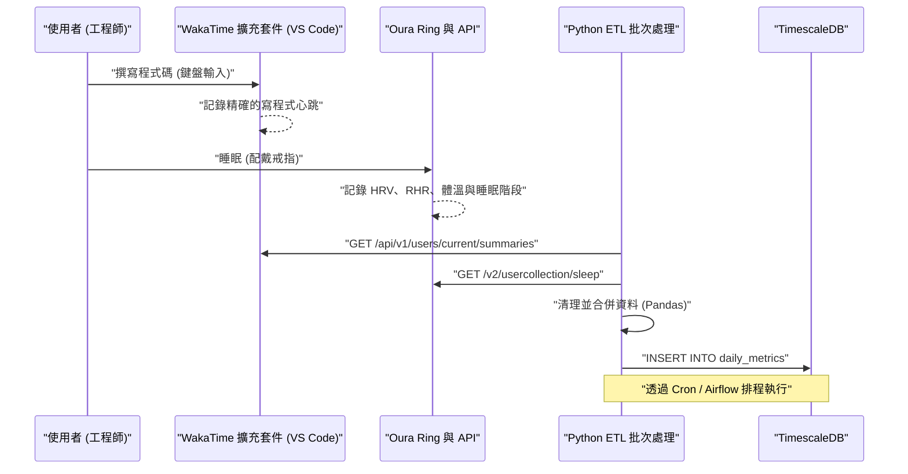
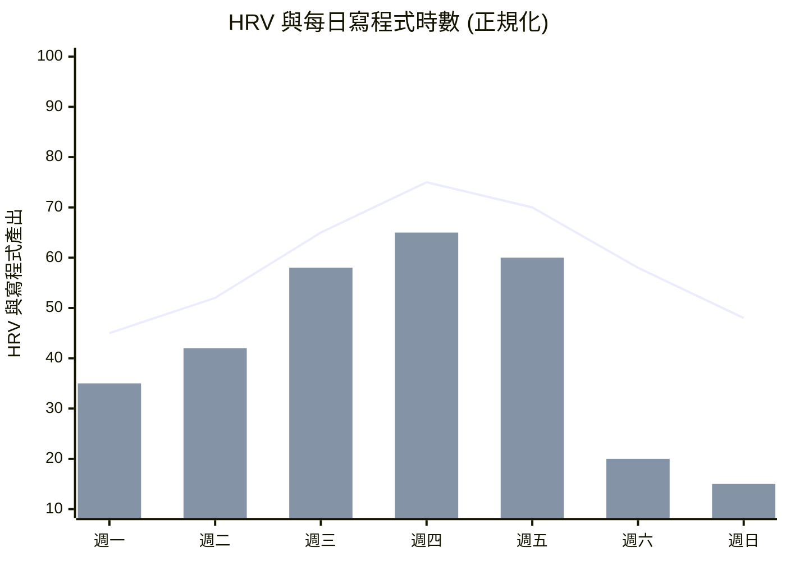

## 1. 前言：軟體工程師與生物駭客的交會點

現代的軟體工程是一項伴隨著極度認知負荷與長時間久坐（Sedentary Lifestyle）的嚴酷知識型勞動。隨時都要跟上不斷變化的技術堆疊、在複雜的分散式系統中尋找 Bug，以及面對交期的壓力。為了克服這些挑戰，不能單靠「氣魄」或「毅力」硬撐，而是必須採用像對系統進行除錯一樣，對自身身體這個硬體進行調校的方法，也就是所謂的「生物駭客（Biohacking）」。

過去我們只能依賴「今天總覺得身體狀況不錯或不好」這種主觀感覺（捷思法），但在現代，隨著 Oura Ring、Apple Watch、Garmin 等高效能穿戴式裝置的普及，我們已經能夠 24 小時 365 天以非侵入式的方法取得生理數據。本文將解說如何透過 API 取得生理數據（HRV、RHR、睡眠結構）與生產力數據（透過 WakaTime 等取得的寫程式指標），並利用 Python 與 Pandas 以資料科學的方法進行相關性分析。此外，也將基於生理時鐘的數學模型，以及根據咖啡因代謝半衰期找出最佳喝咖啡時機等科學根據，為工程師極其詳細地剖析健康駭客技巧。

## 2. 無法測量的東西就無法管理：獲取生理數據的硬體設備

用來獲取生理數據的感測器（穿戴式裝置）各有其擅長的領域。在數據驅動的健康管理中，根據目的選擇最適合的裝置是第一步。

### 2.1 Oura Ring (Generation 3 / 4)
由於是直接從手指的動脈獲取數據，與在手腕上測量的智慧手錶相比，它在測量睡眠時的心率、心率變異度（HRV）以及體表溫度變化方面的精確度非常高。手指上微血管密集，透過光學心率感測器（PPG: Photoplethysmography）能夠取得雜訊較少的數據。此外，其 REST API 功能完善，能透過 OAuth 2.0 輕鬆匯出 JSON 格式的原始數據，可以說是對工程師而言最具「駭客」潛力的裝置。

### 2.2 Apple Watch Series / Ultra
在活動期間的追蹤、血氧飽和度（SpO2）與心電圖（ECG）的測量上表現優異。在日間活動量以及透過正念 App（呼吸 App）進行隨選 HRV 測量方面，它是最強大的裝置。不過，匯出數據必須經過 HealthKit，若要從 Python 等直接存取，則需要透過 iOS App（如 AutoSleep 或 HealthFit 等）匯出 CSV 等方式做為緩衝。

### 2.3 Garmin (Fenix / Forerunner)
除了 GPS 追蹤的精確度之外，名為「Body Battery（身體能量指數）」的獨特剩餘能量指標也非常優秀。這是根據 HRV 與壓力等級計算出來的。Garmin 的數據可透過 Garmin Connect API 取得，但由於存在企業級 API 的門檻，個人開發者必須使用開源的函式庫，或是善用社群志願者開發的爬蟲工具。

本文將以在追蹤睡眠與恢復方面達到頂峰，且極易從 API 提取數據的 **Oura Ring**，以及作為 IDE（VS Code 或 IntelliJ 等）擴充套件來測量寫程式時間的 **WakaTime** 兩者的數據為主軸進行解說。

## 3. 生理數據的基礎理論：HRV 與 RHR 的資料科學

單純以「睡眠時間長就是好」作為指標太過簡單，從資料科學的觀點來看，以下兩個指標才是衡量「恢復（Recovery）」的關鍵核心指標（Master Metrics）。

### 3.1 HRV（心率變異度：Heart Rate Variability）與自律神經模型化
心臟並不是像節拍器那樣以固定的節奏跳動。舉例來說，即使心率是 60 bpm，每一次心跳之間的間隔（R-R 間隔）也總是呈現「0.92秒」、「1.05秒」、「0.98秒」這樣的波動。將這種波動的大小數值化後就是 HRV（心率變異度）。

HRV 直接反映了自律神經系統，也就是「交感神經（油門）」與「副交感神經（煞車）」的平衡。在處於壓力狀態、過勞或飲酒後，交感神經會佔優勢，心臟的跳動會趨於固定，HRV 便會下降。相反地，在充分放鬆且正在恢復的狀態下，副交感神經（迷走神經）會佔優勢，心跳會隨著呼吸產生動態變化，因此 HRV 就會升高。

計算 HRV 有時間域（Time-domain）與頻率域（Frequency-domain）兩種方法，而在時間域分析中最常被使用，也是 Oura Ring 和 Apple Watch 所採用的指標是 **RMSSD (Root Mean Square of Successive Differences)**。這是求取連續心跳間隔（RR間隔）差值的均方根。

用數學公式嚴格表示如下：

$$ RMSSD = \sqrt{\frac{1}{N-1} \sum_{i=1}^{N-1} (RR_{i+1} - RR_i)^2} $$

在這裡，
- $N$ 是測得的總心跳數
- $RR_i$ 是第 $i$ 個 RR 間隔（毫秒）

對於工程師而言，如果早上起床時的 HRV（RMSSD）比個人的基準線（過去幾週的移動平均）大幅下降，就可以做出數據驅動的決策：「今天應該避免進行認知負荷高的架構設計或部署到正式環境，而是應該將時間分配給擴充測試程式碼或撰寫技術文件。」

### 3.2 靜止心率（RHR：Resting Heart Rate）與恢復訊號
RHR 是身體在完全放鬆的狀態下（通常是睡眠中）每分鐘的心跳次數。在飲酒後、深夜暴飲暴食，或是作為生病（如感染等）的初期症狀時，當身體將能量分配給體內的代謝或免疫反應時，RHR 就會比基準線上升幾次甚至十幾次 bpm。

RHR 越低，代表心肌在一次跳動中能送出較多血液（心搏出量大），顯示有氧運動能力較高以及從疲勞中恢復的程度越好。最理想的情況是，在睡眠的前半段，RHR 達到最低值，呈現「吊床型」的曲線，這代表正在進行最高品質的恢復。

## 4. 睡眠結構的詳細解析

決定工程師大腦表現的，不僅是睡眠的「量」，更重要的是「質」，也就是睡眠結構（Sleep Architecture）。一晚的睡眠通常會經歷 4 到 5 次 90 至 110 分鐘的週期。

### 4.1 NREM 睡眠 階段 1〜2（淺眠 / Light Sleep）
腦波逐漸變慢，是身體準備開始放鬆的階段。約佔整體睡眠的 50%。雖然對認知恢復的貢獻較小，但卻是過渡到下一個深層睡眠階段的重要橋樑。

### 4.2 NREM 睡眠 階段 3（深層睡眠 / Deep Sleep / Slow Wave Sleep: SWS）
腦波中出現 Delta 波（0.5〜2Hz的低頻），是實體肉體恢復的核心時段。會大量分泌生長激素，進行細胞修復。對強化免疫系統也是不可或缺的，這不僅與運動員的肌肉疲勞恢復有關，也直接影響到工程師的眼睛疲勞與肩頸肌肉的修復。深層睡眠通常集中在睡眠前半段的週期。

### 4.3 REM 睡眠（Rapid Eye Movement）
大腦處於與清醒時幾乎一樣活躍的狀態，但身體的肌肉則處於麻痺狀態。對於工程師而言極為重要的就是這個 REM 睡眠，它負責在腦中整理白天學到的新程式語言語法或複雜演算法的概念，並將其轉化為長期記憶（Memory Consolidation）。提升神經可塑性（Neuroplasticity），以及創造性的解決問題能力（例如「洗澡時突然想到 Bug 的解決方案」這類的靈光一閃）也會透過 REM 睡眠得到強化。REM 睡眠傾向在睡眠後半段（清晨）變得較長。

換句話說，「用鬧鐘強迫自己早起而削減睡眠時間」，意味著會局部性地大幅削減與記憶鞏固和創造力相關的 REM 睡眠，這無異於會顯著降低身為工程師表現的重大 Bug。

## 5. 連續血糖監測（CGM）與尖峰防禦

近年來，導入 CGM（Continuous Glucose Monitor：連續血糖監測儀）已成為生物駭客們的必備工具。代表性的裝置有 FreeStyle Libre 與 Dexcom。
進食（特別是碳水化合物與糖分）後，血液中的葡萄糖濃度會急遽上升（血糖飆升 / 血糖尖峰），接著會因為大量分泌胰島素而急遽下降（崩潰）。在這個「崩潰」的時機，會引發強烈的睡意（腦霧，Brain Fog）與注意力下降。午餐後「魔鬼的下午兩點」的睡意，很可能不單純是生理時鐘的影響，而是過量攝取拉麵或白飯導致的血糖飆升所引起的。

血糖值的反應曲線 $G(t)$，可作為攝取的醣類吸收速度與胰島素清除作用之間的差值，近似地用以下衰減震盪模型來表示：

$$ G(t) = G_{base} + \Delta G \cdot e^{-\alpha t} \sin(\beta t) $$

在這裡，
- $G_{base}$: 空腹時的血糖值（基準線）
- $\Delta G$: 因進食導致的血糖值上升振幅
- $\alpha$: 基於胰島素敏感度與代謝速度的衰減係數
- $\beta$: 震盪的頻率成分
- $t$: 飯後經過的時間

為了維持工程師的表現，將 $\Delta G$（振幅）抑制在最小限度是很重要的。具體來說，「先吃蔬菜（膳食纖維）」、「避免精緻碳水化合物」、「飯後進行 15 分鐘的輕鬆散步（活化 GLUT4 轉運蛋白，以非依賴胰島素的方式將血糖吸收到肌肉中）」等駭客技巧都非常有效。

## 6. 架構設計：建構本地資料管線

我們將建構一個用於整合分析生理數據與生產力數據的本地資料管線。
以下的 Mermaid 圖表（流程圖）展示了從 API 取得數據到在儀表板上進行視覺化的流程。



透過這個架構，就能每天自動監控自身的體能狀況（輸入）與寫程式表現（輸出）之間的關聯性。

進一步來看系統間的詳細時序：



## 7. 使用 Python 與 Pandas 進行資料攝取

接下來讓我們來看看實際使用 Python 腳本從 Oura Ring 與 WakaTime API 取得數據，並整合為 Pandas DataFrame 的處理過程。我們將建構能承受實際運作的穩健程式碼。

```python
import requests
import pandas as pd
from datetime import datetime, timedelta
import os

# 環境變數
OURA_TOKEN = os.getenv("OURA_ACCESS_TOKEN")
WAKATIME_API_KEY = os.getenv("WAKATIME_API_KEY")

def fetch_oura_sleep_data(start_date: str, end_date: str) -> pd.DataFrame:
    """從 Oura Ring API v2 獲取每日睡眠摘要。"""
    url = "https://api.ouraring.com/v2/usercollection/sleep"
    params = {"start_date": start_date, "end_date": end_date}
    headers = {"Authorization": f"Bearer {OURA_TOKEN}"}
    
    response = requests.get(url, headers=headers, params=params)
    response.raise_for_status() # 若發生 4xx/5xx 錯誤則拋出例外
    data = response.json().get("data", [])
    
    if not data:
        return pd.DataFrame()
        
    df = pd.json_normalize(data)
    # 提取深層嵌套的值或選擇基本欄位
    df = df[['day', 'score', 'time_in_bed', 'total_sleep_duration', 
             'average_hrv', 'lowest_heart_rate', 
             'deep_sleep_duration', 'rem_sleep_duration']]
             
    # 將日期轉換為 datetime 物件並設定為索引
    df['day'] = pd.to_datetime(df['day'])
    df.set_index('day', inplace=True)
    return df

def fetch_wakatime_data(start_date: str, end_date: str) -> pd.DataFrame:
    """從 WakaTime API 獲取寫程式時數摘要。"""
    url = "https://wakatime.com/api/v1/users/current/summaries"
    params = {"start": start_date, "end": end_date, "api_key": WAKATIME_API_KEY}
    
    response = requests.get(url, params=params)
    response.raise_for_status()
    data = response.json().get("data", [])
    
    records = []
    for day_data in data:
        date_str = day_data['range']['date']
        # 提取花費在寫程式的總秒數
        total_seconds = day_data['grand_total']['total_seconds']
        records.append({'day': date_str, 'coding_hours': total_seconds / 3600.0})
        
    df = pd.DataFrame(records)
    if not df.empty:
        df['day'] = pd.to_datetime(df['day'])
        df.set_index('day', inplace=True)
    return df

if __name__ == "__main__":
    # 獲取過去 60 天的數據
    end = datetime.now().strftime("%Y-%m-%d")
    start = (datetime.now() - timedelta(days=60)).strftime("%Y-%m-%d")
    
    oura_df = fetch_oura_sleep_data(start, end)
    waka_df = fetch_wakatime_data(start, end)
    
    # 使用 inner join 將資料集依 'day' 索引合併
    merged_df = pd.merge(oura_df, waka_df, left_index=True, right_index=True, how='inner')
    
    # 將原始資料儲存為 CSV/DB
    merged_df.to_csv("health_productivity_raw.csv")
    print(f"已攝取 {len(merged_df)} 天的數據。")
```

## 8. 資料前處理與特徵工程

將取得的原始資料直接進行分析是很危險的。我們必須處理因忘記為裝置充電而產生的缺失值（Missing Values），並產生有意義的新指標（特徵工程：Feature Engineering）。

```python
def engineer_features(df: pd.DataFrame) -> pd.DataFrame:
    """對合併後的 DataFrame 應用特徵工程與資料清理。"""
    df = df.copy()
    
    # 1. 處理缺失值（例如向後填補）
    df.fillna(method='ffill', inplace=True)
    
    # 2. 計算睡眠效率
    # 公式：(總睡眠時間 / 躺在床上的時間) * 100
    df['sleep_efficiency_pct'] = (df['total_sleep_duration'] / df['time_in_bed']) * 100
    
    # 3. 計算睡眠階段比例
    df['rem_ratio'] = df['rem_sleep_duration'] / df['total_sleep_duration']
    df['deep_ratio'] = df['deep_sleep_duration'] / df['total_sleep_duration']
    
    # 4. 計算 7 天移動平均（Rolling Mean）以平滑日常雜訊
    df['hrv_7d_ma'] = df['average_hrv'].rolling(window=7).mean()
    df['rhr_7d_ma'] = df['lowest_heart_rate'].rolling(window=7).mean()
    
    # 5. 計算每日偏離基準線的程度
    df['hrv_deviation'] = df['average_hrv'] - df['hrv_7d_ma']
    
    # 6. 為機器學習正規化目標值（選擇性）
    from sklearn.preprocessing import MinMaxScaler
    scaler = MinMaxScaler()
    df[['hrv_scaled', 'coding_scaled']] = scaler.fit_transform(df[['average_hrv', 'coding_hours']])
    
    # 丟棄由移動窗口產生包含 NaN 的資料列
    df.dropna(inplace=True)
    
    return df

processed_df = engineer_features(merged_df)
```

## 9. 相關性分析：生產力與健康指標的交會點

基於預先處理好的資料，分析健康指標與寫程式生產力的關係。我們提出一個假說：「HRV 越高的日子（自律神經平穩且恢復良好的狀態），注意力越能持久，寫程式的時間越長，或者能夠處理更複雜的任務。」


*(註: 折線圖表示與正規化後 HRV 基準線的偏差，長條圖則顯示 WakaTime 的寫程式時間。可以看出在獲得充分恢復的週三到週五期間，寫程式的產出有著達到最大化的相關性)*

使用 Pandas 計算相關係數（皮爾森積動差相關係數 $r$），並使用 SciPy 進行統計顯著性（p 值）檢定。

```python
import scipy.stats as stats

# 選擇用於相關矩陣的數值欄位
cols_of_interest = ['average_hrv', 'score', 'deep_sleep_duration', 'rem_sleep_duration', 'coding_hours']
correlation_matrix = processed_df[cols_of_interest].corr()

print("與寫程式時數的相關性：")
print(correlation_matrix['coding_hours'].sort_values(ascending=False))

# 計算 REM 睡眠與寫程式時數的皮爾森相關係數及 p 值
r, p_value = stats.pearsonr(processed_df['rem_sleep_duration'], processed_df['coding_hours'])
print(f"REM 睡眠與寫程式時數: r = {r:.3f}, p-value = {p_value:.4f}")
```

在多數情況下，可以觀察到 `average_hrv` 或 `rem_sleep_duration` 與 `coding_hours` 之間存在顯著的正相關（$p < 0.05$）。特別是，前一天的 REM 睡眠長度，會強烈影響當天的「解決錯誤（除錯）所需時間」與「生產力」，這點在許多工程師的量化自我（Quantified Self）社群中都有被報告。

## 10. 生理時鐘的數學模型與認知巔峰的最佳化

人類具備大約 24 小時為一個週期的體內時鐘，稱為生理時鐘（Circadian Rhythm）。根據這個節奏，體溫、荷爾蒙分泌（早晨的皮質醇飆升與夜間的褪黑激素分泌）以及「認知能力」都會產生變動。

生理時鐘的變動通常會用餘弦曲線構成的數學模型（Cosinor 模型）來近似表示，生理指標的變化可以用以下的數學式來定義：

$$ y(t) = M + A \cos\left(\frac{2\pi}{24}(t - \phi)\right) + e(t) $$

- $y(t)$: 時刻 $t$ 的生理指標（例如：核心體溫或清醒度）
- $M$: MESOR (Midline Estimating Statistic of Rhythm) - 節奏的中心值（平均水準）
- $A$: 振幅（Amplitude） - 變動的大小
- $\phi$: 頂相（Acrophase） - 達到巔峰的相位（時間）
- $e(t)$: 環境因素等造成的誤差項

在工程領域中，這個公式的意義在於：「在一天之中，表現（清醒度）達到巔峰的時段（$\phi$）是由生物學決定的，我們應該將認知負荷最高的工作（解決困難的 Bug、設計新的架構）安排在那個時段。」

以一般的晨型人（Morning Lark）作息為例，在起床後 2〜4 小時（例如上午 9 點到 11 點）會迎來第一個認知巔峰。隨後，大約在下午 2 點左右會進入生理時鐘的低谷（Post-lunch dip），然後傍晚會再出現一個小巔峰。從穿戴式裝置的活動量數據或主觀的專注度中，找出自己的巔峰時間（$\phi$），並透過 Google Calendar 等工具將行程進行「時間分塊（Time Blocking）」來堅守，這就是最棒的健康駭客技巧。把毫無意義的會議安排在巔峰時段，就好比將效能最強的 CPU 核心分配給閒置處理程序（Idle Process）一樣。

## 11. 咖啡因的藥物動力學與最佳攝取時機

工程師與咖啡之間有著密不可分的關係，但過量攝取咖啡因或在太晚的時間飲用，會阻斷大腦內的腺苷受體，破壞夜間的「深層睡眠（Deep Sleep）」。即使主觀上覺得自己睡得很好，但只要查看 Oura Ring 的數據，就會發現心率沒有降下來，深層睡眠的比例也會大幅減少。

咖啡因從體內的排出遵循一階反應（First-order kinetics）。也就是說，血液中的濃度會呈指數衰減。

$$ C(t) = C_0 e^{-k t} $$

在這裡，
- $C(t)$: 經過時間 $t$ 後血液中的咖啡因濃度
- $C_0$: 初始濃度（剛攝取後的最高濃度）
- $k$: 消除速率常數
- $t$: 攝取後經過的時間（小時）

消除速率常數 $k$ 可以使用咖啡因的半衰期（$t_{1/2}$）來表示：

$$ k = \frac{\ln(2)}{t_{1/2}} $$

對於健康的成年人而言，雖然取決於個人的基因（CYP1A2 基因），但咖啡因的半衰期 $t_{1/2}$ 通常約為 **5〜6 小時**。
例如，假設下午 3 點喝了一杯手沖咖啡（咖啡因約 150mg）（$C_0 = 150$）。如果半衰期為 5.5 小時，那麼 $k \approx 0.126$。
計算就寢時間晚上 11 點（8 小時後）體內殘留的咖啡因濃度：

$$ C(8) = 150 \times e^{-0.126 \times 8} = 150 \times e^{-1.008} \approx 150 \times 0.365 = 54.75 \text{ mg} $$

這意味著，到了該睡覺的時間，體內依然殘留了 54mg（超過一杯濃縮咖啡）的咖啡因，這將對睡眠結構帶來直接的負面影響。
從這個藥物動力學模型推導出來的數據驅動結論是：**「為了確保高品質的睡眠，應在起床後 90 分鐘之後（待皮質醇飆升平息後）才開始攝取咖啡因，且最晚在下午 2 點（就寢前 9〜10 小時）就應該完全停止攝取。」**

## 12. 環境變數的駭客技巧（照度, 溫度, CO2）

不僅是自己身體這個內部系統，對外部的環境變數（Environment Variables）進行最佳化也同樣重要。

### 12.1 光環境（照度）的程式化
用來重置生理時鐘的最強大「授時因子（Zeitgeber：提示時間的線索）」就是光。早晨，視網膜的感光細胞（ipRGC）接收到約 100,000 Lux 的太陽光後，褪黑激素的分泌就會停止，並重置計時器。相反地，夜間必須阻擋藍光，以免阻礙褪黑激素的分泌。除了使用 f.lux 等軟體降低螢幕的色溫外，透過 API 控制智慧照明（如 Philips Hue），撰寫腳本讓房間的照度與色溫配合日落自動調降也非常有效。

### 12.2 臥室的溫度控制與入睡潛伏期（Sleep Latency）
人類是藉由核心體溫（Core Body Temperature）的下降來進入睡眠的。將臥室的溫度保持在 18〜19 度的涼爽狀態，並在睡前 90 分鐘透過泡熱水澡短暫提升核心體溫，趁著體溫急遽下降的時間點躲進被窩，這能戲劇性地縮短入睡潛伏期（Sleep Latency：從躺進被窩到睡著的時間），並使深層睡眠最大化。

### 12.3 CO2 濃度與認知功能的下降
如果將 SwitchBot Hub 或 Netatmo 氣象站的 API 加入資料管線中，就會發現室內的二氧化碳（CO2）濃度與生產力之間存在明顯的負相關。
如同哈佛大學等研究所示，當 CO2 濃度超過 1000 ppm 時，認知功能（特別是策略性決策能力）會開始顯著下降；若超過 2000 ppm，更會造成嚴重的表現下滑。冬天在門窗緊閉的房間內遠距工作，往往會在不知不覺中降低工作表現。

```python
# 使用 Home Assistant / SwitchBot API 進行智慧室內換氣的偽代碼 (Pseudo-code)
import requests

def check_and_ventilate():
    # 從 Netatmo/SwitchBot API 獲取目前的 CO2 濃度
    co2_ppm = get_sensor_data("co2_sensor_id")
    
    if co2_ppm > 1000:
        print(f"警告：CO2 濃度偏高 ({co2_ppm} ppm)。有認知功能下降的風險。")
        # 觸發智慧插座開啟換氣扇
        turn_on_smart_plug("ventilation_fan_id")
        # 發送通知到 Slack/Discord
        send_notification("已啟動換氣扇。CO2 濃度過高。")
    elif co2_ppm < 600:
        turn_off_smart_plug("ventilation_fan_id")
```
透過 Cron 定期執行這樣的腳本，就能完成一個隨時維持最佳氧氣濃度的自主環境控制系統。

## 13. 結論：將人體視為系統的 CI/CD

試著將自己的身體視為一個複雜的分散式系統。穿戴式裝置（Oura Ring）是用於監控的指標匯出器（Prometheus）；Python/Pandas 腳本是日誌分析管線（Logstash/Fluentd）；而每天的身體變化與表現，就是顯示在儀表板（Grafana/Streamlit）上的系統健康狀態。

「削減睡眠時間來工作」，就像是無視技術債（Technical Debt）強行追加功能一樣。短期內或許趕得上發布期限，但長期下來必定會導致系統停機（職業倦怠、嚴重的健康損害或憂鬱症）。

監控 HRV、檢查 RHR 的趨勢，並最佳化睡眠結構。然後一邊觀察與 WakaTime 生產力數據的相關性，一邊每天微調飲食、運動、睡眠、環境等「超參數（Hyperparameters）」。這無疑就是針對人體進行的 **CI/CD（持續整合與持續交付）** 流程。

善用資料科學與 API，來設計出能發揮最佳表現的健康狀態吧。因為你所寫的程式碼品質，直接取決於你自身生理系統的健康程度。

---
*Disclaimer: 本文為筆者個人實驗與資料科學方法的總結，並不提供醫療建議。若有持續性的身體不適或睡眠障礙，請諮詢專業的醫療機構。*
