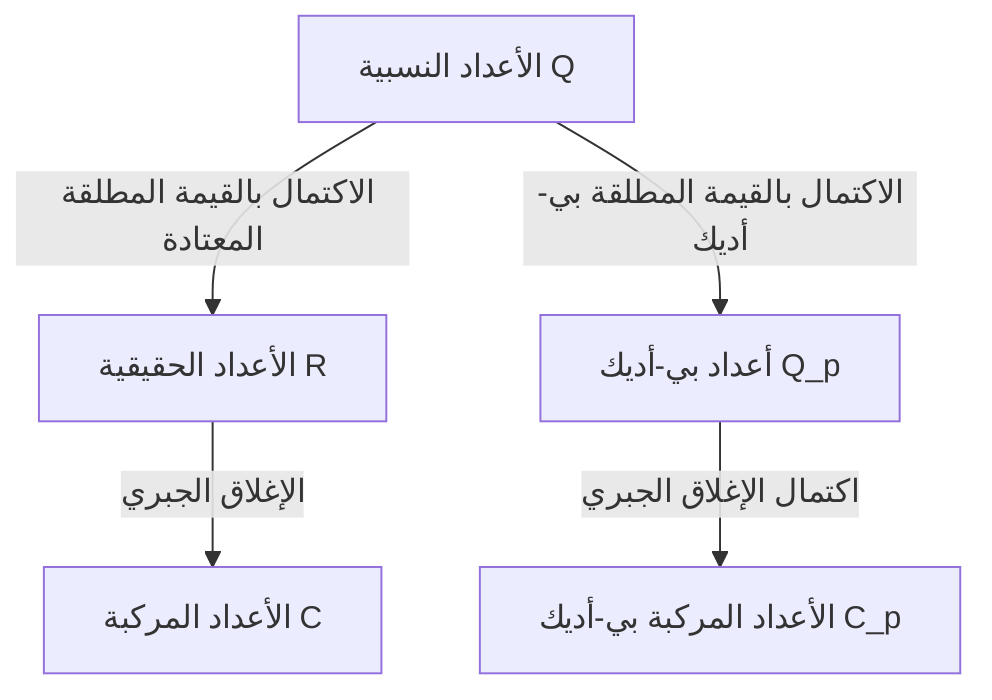

## 1. مقدمة

في نظرية الأعداد الحديثة، وخاصة نظرية الأعداد الجبرية والهندسة الحسابية، تعتبر **أعداد بي-أديك** أداة لا غنى عنها. تم تقديم هذا المفهوم الثوري في نهاية القرن التاسع عشر من قبل عالم الرياضيات الألماني **كورت هينزيل** (1861-1941).

كان اكتشافه بمثابة جسر يربط بين وجهات النظر "المحلية" و"العالمية" في الرياضيات، مما أحدث تحولًا جذريًا في رياضيات القرن العشرين. يقدم هذا المقال استكشافًا تفصيليًا لحياة كورت هينزيل، وأعظم إنجازاته — اكتشاف **أعداد بي-أديك** —، وأسسها الرياضية، والتأثير العميق الذي أحدثته على الرياضيات الحديثة.

## 2. نسب ملحوظ وحياة مبكرة

ولد كورت هينزيل في 29 ديسمبر 1861 في كونيغسبرغ، بروسيا الشرقية (الآن كالينينغراد، روسيا). تحتل عائلته مكانة مهمة للغاية في التاريخ الفكري والفني لألمانيا.

كان جده الرسام الشهير **فيلهلم هينزيل**، وكانت جدته عازفة البيانو والملحنة البارزة **فاني مندلسون** (شقيقة الملحن الشهير فيليكس مندلسون). وبالعودة إلى الوراء، كان جد جده الفيلسوف الممثل لعصر التنوير، **موسى مندلسون**. يمكن القول إن هذه البيئة العائلية الغنية ثقافيًا وفكريًا عززت التفكير الحر والإبداعي لكورت هينزيل.

عندما كان صغيراً، انتقلت عائلته إلى برلين، حيث تلقى تعليماً ابتدائياً وثانوياً عالي الجودة. ازدهرت موهبته في الرياضيات مبكراً، مما قاده بشكل طبيعي إلى طريق البحث الرياضي في الجامعة.

## 3. أيام الجامعة وتأثير كرونيكر

درس هينزيل الرياضيات في جامعتي بون وبرلين. في ذلك الوقت، كانت جامعة برلين واحدة من المراكز العالمية للبحث الرياضي، حيث قام عمالقة مثل **كارل فايرشتراس** و **ليوبولد كرونيكر** بالتدريس هناك.

من بينهم، كان لكرونيكر التأثير الأعمق على هينزيل. كما هو معروف من اقتباسه الشهير: "الله صنع الأعداد الصحيحة، وكل ما عدا ذلك هو من صنع الإنسان"، كان كرونيكر يعتقد اعتقادًا راسخًا أنه يجب إعادة بناء جميع الرياضيات بدقة بناءً على الأعداد الصحيحة. تحت توجيه كرونيكر، كرس هينزيل نفسه بعمق للجبر ونظرية الأعداد.

في عام 1884، حصل هينزيل على درجة الدكتوراه من جامعة برلين. كان موضوع أطروحة الدكتوراه الخاصة به حول الخصائص الحسابية للدوال الجبرية، والتي ستكون بمثابة تمهيد مهم لاكتشافه اللاحق لـ **أعداد بي-أديك**.

## 4. القياس بين الدوال والأعداد

جاء أعظم إلهام لهينزيل من القياس العميق بين "الأعداد" (الأعداد الصحيحة الجبرية) و"الدوال" (الدوال الجبرية).

في أواخر القرن التاسع عشر، أظهر **ريتشارد ديديكايند** و **هاينريش ويبر** أن هناك تشابهاً هيكلياً مذهلاً بين حقول الأعداد الجبرية وحقول الدوال الجبرية. يمكن تمثيل الدالة على المستوى المركب محليًا حول كل نقطة كمتسلسلة قوى، مثل مفكوك تايلور أو لوران.

سأل هينزيل نفسه: "إذا كان يمكن دراسة دالة محليًا كمتسلسلة قوى حول كل نقطة، ألا يمكن أيضًا تمثيل الأعداد النسبية والأعداد الصحيحة الجبرية كمتسلسلة قوى حول نوع من 'النقاط'؟"

كان المعادل لـ "نقطة" في الأعداد هو **العدد الأولي $p$**. توصل هينزيل إلى الفكرة المبتكرة للتعبير عن أي عدد نسبي كمتسلسلة مع وجود عدد أولي $p$ كأساس لها.

## 5. اكتشاف أعداد بي-أديك والأسس الرياضية

في عام 1897، نشر هينزيل ورقة بحثية رائدة قدمت مفهوم **أعداد بي-أديك** للعالم لأول مرة.

### 5.1 التقييم بي-أديك والقيمة المطلقة

عادةً، ينتج عن اكتمال حقل الأعداد النسبية $\mathbb{Q}$ حقل الأعداد الحقيقية $\mathbb{R}$. هذا اكتمال كمساحة مترية بناءً على "القيمة المطلقة" التي نستخدمها يوميًا. ومع ذلك، قدم هينزيل طريقة مختلفة تمامًا لقياس المسافة تركز على عدد أولي $p$.

يمكن تحليل أي عدد نسبي غير صفري $x$ بشكل فريد باستخدام عدد أولي معين $p$ على النحو التالي:

$$
x = p^v \frac{a}{b}
$$

هنا، $a$ و $b$ هي أعداد صحيحة أولية نسبياً مع $p$، و $v$ هو عدد صحيح. يُطلق على هذا $v$ اسم **التقييم بي-أديك** لـ $x$، ويُشار إليه بـ $v_p(x) = v$. علاوة على ذلك، يتم تعريف **القيمة المطلقة بي-أديك** $|x|_p$ لـ $x$ على النحو التالي:

$$
|x|_p = p^{-v_p(x)} \quad \text{حيث } |0|_p = 0
$$

هذه القيمة المطلقة الجديدة، على عكس المعتادة، تفي بمتراجحة المثلث القوية (الخاصية غير الأرخميدية):

$$
|x + y|_p \le \max(|x|_p, |y|_p)
$$

### 5.2 الاكتمال من الأعداد النسبية إلى بي-أديك

باستخدام المسافة $d(x, y) = |x - y|_p$ المحددة بواسطة هذه القيمة المطلقة بي-أديك، فإن نظام الأعداد الجديد الذي تم الحصول عليه عن طريق تطبيق اكتمال متتالية كوشي على حقل الأعداد النسبية $\mathbb{Q}$ هو **حقل أعداد بي-أديك** $\mathbb{Q}_p$.

يوضح الرسم البياني أدناه كيف تتفرع وتتوسع أنظمة الأعداد.

### 5.3 مثال محدد لمفكوك بي-أديك

يمكن التعبير عن كل عدد صحيح بي-أديك (المجموعة $\mathbb{Z}_p$ من العناصر التي تكون قيمتها المطلقة بي-أديك أقل من أو تساوي $1$) كمتسلسلة لا نهائية على النحو التالي:

$$
x = a_0 + a_1 p + a_2 p^2 + a_3 p^3 + \dots = \sum_{i=0}^{\infty} a_i p^i
$$

(حيث $0 \le a_i \le p-1$)

كمثال، دعونا نحسب مفكوك $\frac{1}{3}$ في $\mathbb{Z}_5$ ($p=5$).
لنفترض أن $\frac{1}{3} = a_0 + a_1 \cdot 5 + a_2 \cdot 5^2 + \dots$
إزالة المقام يعطي $1 = 3(a_0 + a_1 \cdot 5 + a_2 \cdot 5^2 + \dots)$.

أولاً، بالنظر إلى المقياس (modulo) $5$:
من $3 a_0 \equiv 1 \pmod 5$، نحصل على $a_0 = 2$.
بالتعويض بهذا والاستمرار في الحساب:
$1 = 3(2 + 5x) \implies 1 = 6 + 15x \implies 15x = -5 \implies 3x = -1$.
هنا $x = a_1 + a_2 \cdot 5 + \dots$
بالنظر إلى المقياس $5$ مرة أخرى:
من $3 a_1 \equiv -1 \equiv 4 \pmod 5$، نحصل على $a_1 = 3$.
بالتعويض بشكل مشابه:
$3(3 + 5y) = -1 \implies 9 + 15y = -1 \implies 15y = -10 \implies 3y = -2$.
من $3 a_2 \equiv -2 \equiv 3 \pmod 5$، نحصل على $a_2 = 1$.
بالمضي قدما:
$3(1 + 5z) = -2 \implies 3 + 15z = -2 \implies 15z = -5 \implies 3z = -1$.
نظرًا لأن هذا يعود إلى نفس الشكل مثل $3x = -1$، فإن التسلسل $3, 1$ يتكرر بعد ذلك.

بعبارة أخرى، فإن المفكوك في الأعداد 5-أديك هو كما يلي:
$$
\frac{1}{3} = 2 + 3 \cdot 5 + 1 \cdot 5^2 + 3 \cdot 5^3 + 1 \cdot 5^4 + \dots
$$
هذا المجموع اللانهائي يتباعد بالمعنى المعتاد، ولكن في عالم القيم المطلقة بي-أديك، تصبح الحدود أصغر مع تقدمها، مما يعني أنها تتقارب تمامًا دون تناقض.

## 6. تمهيدية هينزيل (Hensel's Lemma)

واحدة من أقوى الأدوات التي قدمها هينزيل هي **تمهيدية هينزيل**. هذه نظرية توفر الشروط اللازمة لمعادلة متعددة الحدود للحصول على جذور داخل حقل أعداد بي-أديك، ويمكن وصفها بأنها النسخة بي-أديك من "طريقة نيوتن" في التحليل الحقيقي.

تأكيد النظرية هو كما يلي.
لنفترض أن لدينا متعددة حدود $f(x)$ بمعاملات صحيحة وعدد أولي $p$. إذا كان هناك عدد صحيح $a$ يمثل جذرًا تقريبيًا بالمقياس $p$، ومشتقته ليست $0$، أي

$$
f(a) \equiv 0 \pmod p \quad \text{و} \quad f'(a) \not\equiv 0 \pmod p
$$

صحيحة، فيمكننا بناء جذر حقيقي بدءًا من $a$، ويوجد بشكل فريد $\alpha \in \mathbb{Z}_p$ يفي بـ

$$
f(\alpha) = 0 \quad \text{و} \quad \alpha \equiv a \pmod p
$$

جعلت هذه التمهيدية من الممكن العثور على حلول دقيقة كأعداد بي-أديك عن طريق "رفع" (lifting) حلول معادلات التطابق بشكل متتالي.

## 7. نظرية أوستروفسكي والمبدأ المحلي-العالمي

تم تحسين مفاهيم هينزيل بشكل أكبر بواسطة علماء رياضيات آخرين.

في عام 1916، أثبت ألكسندر أوستروفسكي **نظرية أوستروفسكي**. هذه هي الحقيقة المفاجئة المتمثلة في أن "كل قيمة مطلقة غير تافهة في حقل الأعداد النسبية تعادل إما القيمة المطلقة المعتادة أو القيمة المطلقة بي-أديك لعدد أولي معين $p$". وبالتالي، فإن جمع الأعداد الحقيقية وجميع أعداد بي-أديك "يغطي بشكل شامل" جميع احتمالات إكمال الأعداد النسبية.

علاوة على ذلك، أسس طالب هينزيل، **هيلموت هاس**، **المبدأ المحلي-العالمي** (مبدأ هاس). هذه نظرية جميلة تنص على أن "الشرط الضروري والكافي لمعادلة للحصول على حل على الأعداد النسبية (عالميًا) هو أن يكون لها حل على الأعداد الحقيقية وأعداد بي-أديك لجميع الأعداد الأولية $p$ (محليًا)." مع هذا، أمنت أعداد بي-أديك مكانة لا تتزعزع كأدوات أساسية في نظرية الأعداد.

## 8. مساهمات كمعلم ومحرر، والإرث

قدم هينزيل مساهمات هائلة ليس فقط كباحث ولكن أيضًا كمربي ومحرر. من عام 1901 لسنوات عديدة، شغل منصب رئيس تحرير "مجلة كريل" (رسميًا: Journal für die reine und angewandte Mathematik)، وهي واحدة من أقدم مجلات الرياضيات في العالم، مما دعم نشر الأبحاث الرياضية المتطورة في عصره.

كانت محاضراته واضحة وعاطفية، حيث قامت برعاية الجيل القادم من علماء الرياضيات اللامعين، بمن فيهم هيلموت هاس.

اليوم، يتم تطبيق أعداد بي-أديك في مجموعة واسعة من المجالات خارج نظرية الأعداد الجبرية، بما في ذلك **التحليل بي-أديك**، **نظرية هودج بي-أديك**، وحتى **ميكانيكا الكم بي-أديك** في الفيزياء النظرية. كان الإثبات التاريخي لـ "مبرهنة فيرما الأخيرة" بواسطة أندرو وايلز مستحيلاً بدون نظرية أعداد بي-أديك.

## 9. خاتمة

انطلاقاً من القياس الجميل بين الدوال والأعداد، جلب كورت هينزيل بعداً جديداً تماماً لعالم الرياضيات من خلال **أعداد بي-أديك**. أصبح نهجه المتمثل في "فهم العالمي من خلال النظر محليًا" أحد الفلسفات الأساسية للرياضيات من القرن العشرين فصاعدًا.

تستمر أفكاره الغنية والأصلية في إلهام علماء الرياضيات في جميع أنحاء العالم الذين يسعون اليوم لمعرفة حقائق الأرقام والعالم الطبيعي.
