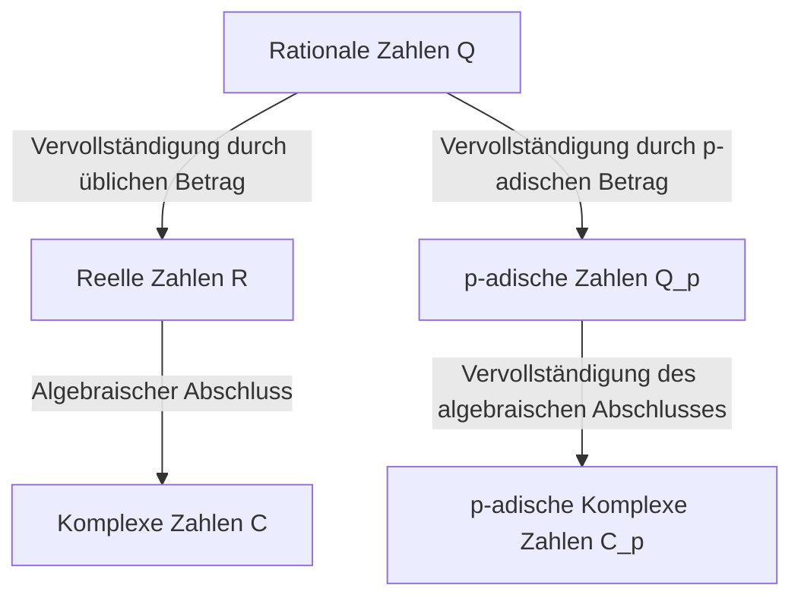

## 1. Einleitung

In der modernen Zahlentheorie, insbesondere in der algebraischen Zahlentheorie und der arithmetischen Geometrie, sind **p-adische Zahlen** ein unverzichtbares Werkzeug. Dieses revolutionäre Konzept wurde Ende des 19. Jahrhunderts vom deutschen Mathematiker **[Kurt Hensel](https://kenji.blog/de/p/hensel/)** (1861–1941) eingeführt.

Seine Entdeckung diente als Brücke, die „lokale“ und „globale“ Perspektiven in der Mathematik verband und im 20. Jahrhundert einen Paradigmenwechsel herbeiführte. Dieser Artikel bietet eine detaillierte Untersuchung von [Kurt Hensel](https://kenji.blog/de/p/hensel/)s Leben, seiner größten Errungenschaft – der Entdeckung der **p-adischen Zahlen** –, ihren mathematischen Grundlagen und ihrem tiefgreifenden Einfluss auf die moderne Mathematik.

## 2. Bemerkenswerte Abstammung und frühes Leben

[Kurt Hensel](https://kenji.blog/de/p/hensel/) wurde am 29. Dezember 1861 in Königsberg, Ostpreußen (heute Kaliningrad, Russland), geboren. Seine Familie nimmt in der intellektuellen und künstlerischen Geschichte Deutschlands einen äußerst bedeutenden Platz ein.

Sein Großvater war der berühmte Maler **Wilhelm [Hensel](https://kenji.blog/de/p/hensel/)**, und seine Großmutter war die herausragende Pianistin und Komponistin **Fanny Mendelssohn** (die Schwester des berühmten Komponisten Felix Mendelssohn). Weiter zurückreichend war sein Urgroßvater der repräsentative Philosoph der Aufklärung, **Moses Mendelssohn**. Man kann sagen, dass dieses kulturell und intellektuell reiche familiäre Umfeld [Kurt Hensel](https://kenji.blog/de/p/hensel/)s freies und kreatives Denken förderte.

In seiner Jugend zog die Familie nach Berlin, wo er eine hochwertige Grund- und Sekundarschulbildung erhielt. Sein Talent für Mathematik erblühte früh und führte ihn ganz natürlich auf den Weg der mathematischen Forschung an der Universität.

## 3. Universitätszeit und [Kronecker](https://kenji.blog/de/p/kronecker/)s Einfluss

[Hensel](https://kenji.blog/de/p/hensel/) studierte Mathematik an den Universitäten Bonn und Berlin. Damals war die Universität Berlin eines der weltweiten Zentren für mathematische Forschung, an dem Größen wie **[Karl Weierstraß](https://kenji.blog/de/p/weierstrass/)** und **Leopold [Kronecker](https://kenji.blog/de/p/kronecker/)** lehrten.

Unter ihnen hatte [Kronecker](https://kenji.blog/de/p/kronecker/) den stärksten Einfluss auf [Hensel](https://kenji.blog/de/p/hensel/). Wie sein berühmtes Zitat „Die ganzen Zahlen hat der liebe Gott gemacht, alles andere ist Menschenwerk“ zeigt, war [Kronecker](https://kenji.blog/de/p/kronecker/) fest davon überzeugt, dass die gesamte Mathematik streng auf der Grundlage ganzer Zahlen rekonstruiert werden sollte. Unter [Kronecker](https://kenji.blog/de/p/kronecker/)s Anleitung widmete sich [Hensel](https://kenji.blog/de/p/hensel/) tief der Algebra und Zahlentheorie.

1884 promovierte [Hensel](https://kenji.blog/de/p/hensel/) an der Universität Berlin. Das Thema seiner Dissertation befasste sich mit den arithmetischen Eigenschaften algebraischer Funktionen, was als wichtiger Vorbote für seine spätere Entdeckung der **p-adischen Zahlen** dienen sollte.

## 4. Analogie zwischen Funktionen und Zahlen

[Hensel](https://kenji.blog/de/p/hensel/)s größte Inspiration stammte aus der tiefen Analogie zwischen „Zahlen“ (algebraischen ganzen Zahlen) und „Funktionen“ (algebraischen Funktionen).

Im späten 19. Jahrhundert hatten **Richard Dedekind** und **Heinrich Weber** gezeigt, dass es eine erstaunliche strukturelle Ähnlichkeit zwischen algebraischen Zahlkörpern und algebraischen Funktionenkörpern gab. Eine Funktion in der komplexen Ebene kann lokal um jeden Punkt als Potenzreihe dargestellt werden, wie etwa durch eine Taylor- oder Laurent-Reihe.

[Hensel](https://kenji.blog/de/p/hensel/) fragte sich: „Wenn eine Funktion lokal als Potenzreihe um jeden Punkt untersucht werden kann, könnten dann rationale Zahlen und algebraische ganze Zahlen nicht auch als Potenzreihen um eine Art ‚Punkt‘ dargestellt werden?“

Das Äquivalent eines „Punktes“ bei Zahlen war eine **Primzahl $p$**. [Hensel](https://kenji.blog/de/p/hensel/) gelangte zu der innovativen Idee, jede rationale Zahl als Reihe mit einer Primzahl $p$ als Basis auszudrücken.

## 5. Entdeckung der p-adischen Zahlen und mathematische Grundlagen

1897 veröffentlichte [Hensel](https://kenji.blog/de/p/hensel/) eine bahnbrechende Arbeit, die das Konzept der **p-adischen Zahlen** erstmals der Welt vorstellte.

### 5.1 p-adische Bewertung und Absolutbetrag

Normalerweise ergibt die Vervollständigung des Körpers der rationalen Zahlen $\mathbb{Q}$ den Körper der reellen Zahlen $\mathbb{R}$. Dies ist eine Vervollständigung als metrischer Raum basierend auf dem „Absolutbetrag“, den wir täglich verwenden. [Hensel](https://kenji.blog/de/p/hensel/) führte jedoch eine völlig andere Methode zur Entfernungsmessung ein, die sich auf eine Primzahl $p$ konzentrierte.

Jede von null verschiedene rationale Zahl $x$ kann unter Verwendung einer gegebenen Primzahl $p$ eindeutig wie folgt zerlegt werden:

$$
x = p^v \frac{a}{b}
$$

Hierbei sind $a$ und $b$ zu $p$ teilerfremde ganze Zahlen, und $v$ ist eine ganze Zahl. Dieses $v$ wird als **p-adische Bewertung** von $x$ bezeichnet und als $v_p(x) = v$ notiert. Weiterhin wird der **p-adische Absolutbetrag** $|x|_p$ von $x$ wie folgt definiert:

$$
|x|_p = p^{-v_p(x)} \quad \text{wobei } |0|_p = 0
$$

Dieser neue Absolutbetrag erfüllt im Gegensatz zum üblichen die strenge Dreiecksungleichung (nicht-archimedische Eigenschaft):

$$
|x + y|_p \le \max(|x|_p, |y|_p)
$$

### 5.2 Vervollständigung von rationalen zu p-adischen Zahlen

Unter Verwendung des durch diesen p-adischen Absolutbetrag definierten Abstands $d(x, y) = |x - y|_p$ ist das neue Zahlensystem, das man durch Anwendung der [Cauchy](https://kenji.blog/de/p/cauchy/)-Folgen-Vervollständigung auf den Körper der rationalen Zahlen $\mathbb{Q}$ erhält, der **Körper der p-adischen Zahlen** $\mathbb{Q}_p$.

Das folgende Diagramm veranschaulicht, wie sich Zahlensysteme verzweigen und erweitern.

### 5.3 Konkretes Beispiel einer p-adischen Entwicklung

Jede p-adische ganze Zahl (die Menge $\mathbb{Z}_p$ der Elemente, deren p-adischer Absolutbetrag kleiner oder gleich $1$ ist) kann als unendliche Reihe wie folgt ausgedrückt werden:

$$
x = a_0 + a_1 p + a_2 p^2 + a_3 p^3 + \dots = \sum_{i=0}^{\infty} a_i p^i
$$

(wobei $0 \le a_i \le p-1$)

Als Beispiel wollen wir die Entwicklung von $\frac{1}{3}$ in $\mathbb{Z}_5$ ($p=5$) berechnen.
Sei $\frac{1}{3} = a_0 + a_1 \cdot 5 + a_2 \cdot 5^2 + \dots$
Durch Multiplikation mit dem Nenner ergibt sich $1 = 3(a_0 + a_1 \cdot 5 + a_2 \cdot 5^2 + \dots)$.

Zunächst betrachten wir Modulo $5$:
Aus $3 a_0 \equiv 1 \pmod 5$ erhalten wir $a_0 = 2$.
Setzen wir dies ein und führen die Berechnung fort:
$1 = 3(2 + 5x) \implies 1 = 6 + 15x \implies 15x = -5 \implies 3x = -1$.
Hierbei ist $x = a_1 + a_2 \cdot 5 + \dots$.
Betrachten wir erneut Modulo $5$:
Aus $3 a_1 \equiv -1 \equiv 4 \pmod 5$ erhalten wir $a_1 = 3$.
Ähnlich eingesetzt:
$3(3 + 5y) = -1 \implies 9 + 15y = -1 \implies 15y = -10 \implies 3y = -2$.
Aus $3 a_2 \equiv -2 \equiv 3 \pmod 5$ erhalten wir $a_2 = 1$.
Weiterführend:
$3(1 + 5z) = -2 \implies 3 + 15z = -2 \implies 15z = -5 \implies 3z = -1$.
Da dies auf dieselbe Form wie $3x = -1$ zurückführt, wiederholt sich fortan die Sequenz $3, 1$.

Mit anderen Worten, die Entwicklung in 5-adischen Zahlen sieht wie folgt aus:
$$
\frac{1}{3} = 2 + 3 \cdot 5 + 1 \cdot 5^2 + 3 \cdot 5^3 + 1 \cdot 5^4 + \dots
$$
Diese unendliche Summe divergiert im üblichen Sinne, aber in der Welt der p-adischen Absolutbeträge werden die Terme mit ihrem Fortschreiten kleiner, was bedeutet, dass sie ohne Widerspruch perfekt konvergiert.

## 6. [Hensel](https://kenji.blog/de/p/hensel/)sches Lemma

Eines der mächtigsten Werkzeuge, die [Hensel](https://kenji.blog/de/p/hensel/) vorstellte, ist das **[Hensel](https://kenji.blog/de/p/hensel/)sche Lemma**. Dies ist ein Satz, der die Bedingungen dafür liefert, dass eine Polynomgleichung Wurzeln im Körper der p-adischen Zahlen hat, und es kann als p-adische Version des „Newton-Verfahrens“ in der reellen Analysis beschrieben werden.

Die Behauptung des Satzes lautet wie folgt.
Angenommen, wir haben ein Polynom $f(x)$ mit ganzzahligen Koeffizienten und eine Primzahl $p$. Wenn eine ganze Zahl $a$ existiert, die eine Näherungswurzel Modulo $p$ ist und deren Ableitung nicht $0$ ist, das heißt,

$$
f(a) \equiv 0 \pmod p \quad \text{und} \quad f'(a) \not\equiv 0 \pmod p
$$

gilt, dann können wir ausgehend von $a$ eine echte Wurzel konstruieren, und es existiert eindeutig ein $\alpha \in \mathbb{Z}_p$, das

$$
f(\alpha) = 0 \quad \text{und} \quad \alpha \equiv a \pmod p
$$

erfüllt.
Dieses Lemma machte es möglich, exakte Lösungen als p-adische Zahlen zu finden, indem man Lösungen von Kongruenzgleichungen sukzessive „anhob“ (lifting).

## 7. Satz von Ostrowski und Lokal-Global-Prinzip

[Hensel](https://kenji.blog/de/p/hensel/)s Konzepte wurden von anderen Mathematikern weiter verfeinert.

1916 bewies Alexander Ostrowski den **Satz von Ostrowski**. Dies ist die überraschende Tatsache, dass „jeder nicht-triviale Absolutbetrag auf dem Körper der rationalen Zahlen entweder dem üblichen Absolutbetrag oder dem p-adischen Absolutbetrag für eine Primzahl $p$ äquivalent ist“. Somit deckt die Zusammenfassung der reellen Zahlen und aller p-adischen Zahlen alle Möglichkeiten der Vervollständigung der rationalen Zahlen „vollständig“ ab.

Darüber hinaus etablierte [Hensel](https://kenji.blog/de/p/hensel/)s Student **[Helmut Hasse](https://kenji.blog/de/p/hasse/)** das **Lokal-Global-Prinzip** (Hasse-Prinzip). Dies ist ein wunderbarer Satz, der besagt: „Eine notwendige und hinreichende Bedingung dafür, dass eine Gleichung über den rationalen Zahlen (global) eine Lösung hat, ist, dass sie über den reellen Zahlen und den p-adischen Zahlen für alle Primzahlen $p$ (lokal) eine Lösung hat.“ Damit sicherten sich p-adische Zahlen eine unerschütterliche Position als unverzichtbare Werkzeuge in der Zahlentheorie.

## 8. Beiträge als Pädagoge und Herausgeber sowie Vermächtnis

[Hensel](https://kenji.blog/de/p/hensel/) leistete nicht nur als Forscher enorme Beiträge, sondern auch als Pädagoge und Herausgeber. Ab 1901 war er viele Jahre lang Chefredakteur des „Crelle-Journals“ (offiziell: Journal für die reine und angewandte Mathematik), einer der ältesten mathematischen Fachzeitschriften der Welt, und unterstützte die Verbreitung der Spitzenforschung in der Mathematik seiner Zeit.

Seine Vorlesungen waren klar und leidenschaftlich und förderten die nächste Generation brillanter Mathematiker, darunter [Helmut Hasse](https://kenji.blog/de/p/hasse/).

Heute finden p-adische Zahlen in einem weiten Bereich Anwendung über die algebraische Zahlentheorie hinaus, einschließlich der **p-adischen Analysis**, der **p-adischen Hodge-Theorie** und sogar der **p-adischen Quantenmechanik** in der theoretischen Physik. [Andrew Wiles](https://kenji.blog/de/p/wiles/)' historischer Beweis von „[Fermat](https://kenji.blog/de/p/fermat/)s letztem Satz“ wäre ohne die Theorie der p-adischen Zahlen unmöglich gewesen.

## 9. Fazit

Ausgehend von der schönen Analogie zwischen Funktionen und Zahlen brachte [Kurt Hensel](https://kenji.blog/de/p/hensel/) mit den **p-adischen Zahlen** eine völlig neue Dimension in die Welt der Mathematik. Sein Ansatz, „das Globale durch das Betrachten des Lokalen zu verstehen“, wurde zu einer der grundlegenden Philosophien der Mathematik ab dem 20. Jahrhundert.

Seine reichen und originellen Ideen inspirieren auch heute noch Mathematiker weltweit, die nach den Wahrheiten der Zahlen und der Natur suchen.
