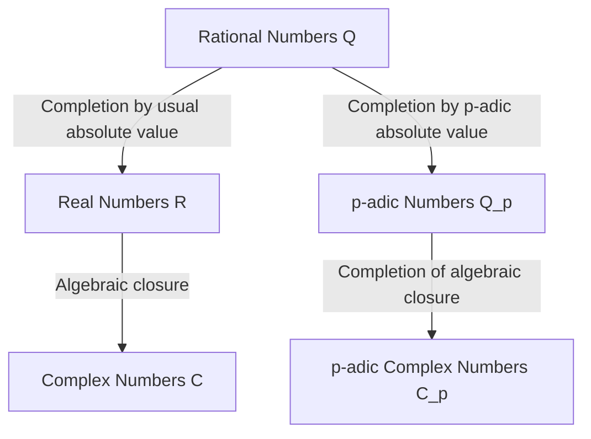

## 1. Introduction

In modern number theory, particularly algebraic number theory and arithmetic geometry, **p-adic numbers** are an indispensable tool. This revolutionary concept was introduced at the end of the 19th century by the German mathematician **[Kurt Hensel](https://kenji.blog/en/p/hensel/)** (1861–1941).

His discovery served as a bridge connecting the "local" and "global" perspectives in mathematics, bringing about a paradigm shift in 20th-century mathematics. This article provides a detailed exploration of [Kurt Hensel](https://kenji.blog/en/p/hensel/)'s life, his greatest achievement—the discovery of **p-adic numbers**—their mathematical foundations, and the profound impact they have had on modern mathematics.

## 2. Remarkable Lineage and Early Life

[Kurt Hensel](https://kenji.blog/en/p/hensel/) was born on December 29, 1861, in Königsberg, East Prussia (now Kaliningrad, Russia). His family holds a highly significant place in the intellectual and artistic history of Germany.

His grandfather was the famous painter **Wilhelm [Hensel](https://kenji.blog/en/p/hensel/)**, and his grandmother was the outstanding pianist and composer **Fanny Mendelssohn** (the sister of the famous composer Felix Mendelssohn). Going back further, his great-grandfather was the representative philosopher of the Enlightenment, **Moses Mendelssohn**. It can be said that this culturally and intellectually rich family environment fostered [Kurt Hensel](https://kenji.blog/en/p/hensel/)'s free and creative thinking.

When he was young, his family moved to Berlin, where he received high-quality primary and secondary education. His talent for mathematics blossomed early, leading him naturally to the path of mathematical research at the university level.

## 3. University Days and [Kronecker](https://kenji.blog/en/p/kronecker/)'s Influence

[Hensel](https://kenji.blog/en/p/hensel/) studied mathematics at the Universities of Bonn and Berlin. At the time, the University of Berlin was one of the world's centers for mathematical research, with giants such as **Karl Weierstrass** and **Leopold [Kronecker](https://kenji.blog/en/p/kronecker/)** teaching there.

Among them, [Kronecker](https://kenji.blog/en/p/kronecker/) had the deepest influence on Hensel. As known from his famous quote, "God made the integers, all else is the work of man," Kronecker held a strong belief that all mathematics should be rigorously reconstructed based on integers. Under Kronecker's guidance, [Hensel](https://kenji.blog/en/p/hensel/) devoted himself deeply to algebra and number theory.

In 1884, [Hensel](https://kenji.blog/en/p/hensel/) obtained his doctorate from the University of Berlin. The theme of his doctoral dissertation was on the arithmetic properties of algebraic functions, which would serve as an important foreshadowing for his later discovery of **p-adic numbers**.

## 4. Analogy Between Functions and Numbers

[Hensel](https://kenji.blog/en/p/hensel/)'s greatest inspiration came from the deep analogy between "numbers" (algebraic integers) and "functions" (algebraic functions).

In the late 19th century, **Richard Dedekind** and **Heinrich Weber** had shown that there was an astonishing structural similarity between algebraic number fields and algebraic function fields. A function on the complex plane can be represented locally around each point as a power series, such as a Taylor or Laurent expansion.

[Hensel](https://kenji.blog/en/p/hensel/) asked himself: "If a function can be studied locally as a power series around each point, could rational numbers and algebraic integers also be represented as power series around some kind of 'point'?"

The equivalent of a "point" in numbers was a **prime number $p$**. [Hensel](https://kenji.blog/en/p/hensel/) arrived at the innovative idea of expressing any rational number as a series with a prime number $p$ as its base.

## 5. Discovery of p-adic Numbers and Mathematical Foundations

In 1897, [Hensel](https://kenji.blog/en/p/hensel/) published a groundbreaking paper introducing the concept of **p-adic numbers** to the world for the first time.

### 5.1 p-adic Valuation and Absolute Value

Normally, the completion of the field of rational numbers $\mathbb{Q}$ yields the field of real numbers $\mathbb{R}$. This is a completion as a metric space based on the "absolute value" we use daily. However, [Hensel](https://kenji.blog/en/p/hensel/) introduced an entirely different way of measuring distance focused on a prime number $p$.

Any non-zero rational number $x$ can be uniquely decomposed using a given prime number $p$ as follows:

$$
x = p^v \frac{a}{b}
$$

Here, $a$ and $b$ are integers coprime to $p$, and $v$ is an integer. This $v$ is called the **p-adic valuation** of $x$, denoted as $v_p(x) = v$. Furthermore, the **p-adic absolute value** $|x|_p$ of $x$ is defined as follows:

$$
|x|_p = p^{-v_p(x)} \quad \text{where } |0|_p = 0
$$

This new absolute value, unlike the usual one, satisfies the strong triangle inequality (non-Archimedean property):

$$
|x + y|_p \le \max(|x|_p, |y|_p)
$$

### 5.2 Completion from Rational to p-adic Numbers

Using the distance $d(x, y) = |x - y|_p$ defined by this p-adic absolute value, the new number system obtained by applying [Cauchy](https://kenji.blog/en/p/cauchy/) sequence completion to the field of rational numbers $\mathbb{Q}$ is the **field of p-adic numbers** $\mathbb{Q}_p$.

The diagram below illustrates how number systems branch and expand.

### 5.3 Specific Example of p-adic Expansion

Every p-adic integer (the set $\mathbb{Z}_p$ of elements whose p-adic absolute value is less than or equal to $1$) can be expressed as an infinite series as follows:

$$
x = a_0 + a_1 p + a_2 p^2 + a_3 p^3 + \dots = \sum_{i=0}^{\infty} a_i p^i
$$

(where $0 \le a_i \le p-1$)

As an example, let's calculate the expansion of $\frac{1}{3}$ in $\mathbb{Z}_5$ ($p=5$).
Let $\frac{1}{3} = a_0 + a_1 \cdot 5 + a_2 \cdot 5^2 + \dots$.
Clearing the denominator gives $1 = 3(a_0 + a_1 \cdot 5 + a_2 \cdot 5^2 + \dots)$.

First, considering modulo $5$:
From $3 a_0 \equiv 1 \pmod 5$, we get $a_0 = 2$.
Substituting this and continuing the calculation:
$1 = 3(2 + 5x) \implies 1 = 6 + 15x \implies 15x = -5 \implies 3x = -1$.
Here $x = a_1 + a_2 \cdot 5 + \dots$.
Considering modulo $5$ again:
From $3 a_1 \equiv -1 \equiv 4 \pmod 5$, we get $a_1 = 3$.
Substituting similarly:
$3(3 + 5y) = -1 \implies 9 + 15y = -1 \implies 15y = -10 \implies 3y = -2$.
From $3 a_2 \equiv -2 \equiv 3 \pmod 5$, we get $a_2 = 1$.
Proceeding further:
$3(1 + 5z) = -2 \implies 3 + 15z = -2 \implies 15z = -5 \implies 3z = -1$.
Since this returns to the same form as $3x = -1$, the sequence $3, 1$ repeats thereafter.

In other words, the expansion in 5-adic numbers is as follows:
$$
\frac{1}{3} = 2 + 3 \cdot 5 + 1 \cdot 5^2 + 3 \cdot 5^3 + 1 \cdot 5^4 + \dots
$$
This infinite sum diverges in the usual sense, but in the world of p-adic absolute values, the terms become smaller as they progress, meaning it converges perfectly without contradiction.

## 6. [Hensel](https://kenji.blog/en/p/hensel/)'s Lemma

One of the most powerful tools presented by [Hensel](https://kenji.blog/en/p/hensel/) is **[Hensel](https://kenji.blog/en/p/hensel/)'s Lemma**. This is a theorem that provides the conditions for a polynomial equation to have roots within the field of p-adic numbers, and it can be described as the p-adic version of "Newton's method" in real analysis.

The assertion of the theorem is as follows.
Suppose we have a polynomial $f(x)$ with integer coefficients and a prime number $p$. If there exists an integer $a$ that is an approximate root modulo $p$, and its derivative is not $0$, that is,

$$
f(a) \equiv 0 \pmod p \quad \text{and} \quad f'(a) \not\equiv 0 \pmod p
$$

holds true, then we can construct a true root starting from $a$, and there uniquely exists $\alpha \in \mathbb{Z}_p$ satisfying

$$
f(\alpha) = 0 \quad \text{and} \quad \alpha \equiv a \pmod p
$$

This lemma made it possible to find exact solutions as p-adic numbers by successively "lifting" solutions of congruence equations.

## 7. Ostrowski's Theorem and the Hasse Principle

[Hensel](https://kenji.blog/en/p/hensel/)'s concepts were further refined by other mathematicians.

In 1916, Alexander Ostrowski proved **Ostrowski's Theorem**. This is the surprising fact that "every non-trivial absolute value on the field of rational numbers is equivalent to either the usual absolute value or the p-adic absolute value for some prime number $p$." Thus, gathering the real numbers and all the p-adic numbers "exhaustively covers" all possibilities of completing the rational numbers.

Furthermore, [Hensel](https://kenji.blog/en/p/hensel/)'s student **[Helmut Hasse](https://kenji.blog/en/p/hasse/)** established the **Local-Global Principle** (Hasse Principle). This is a beautiful theorem stating that "a necessary and sufficient condition for an equation to have a solution over the rational numbers (globally) is that it has a solution over the real numbers and the p-adic numbers for all primes $p$ (locally)." With this, p-adic numbers secured an unshakable position as essential tools in number theory.

## 8. Contributions as an Educator and Editor, and Legacy

[Hensel](https://kenji.blog/en/p/hensel/) made tremendous contributions not only as a researcher but also as an educator and editor. From 1901 for many years, he served as the editor-in-chief of "Crelle's Journal" (officially: Journal für die reine und angewandte Mathematik), one of the world's oldest mathematics journals, supporting the dissemination of cutting-edge mathematical research of his time.

His lectures were clear and passionate, nurturing the next generation of brilliant mathematicians, including [Helmut Hasse](https://kenji.blog/en/p/hasse/).

Today, p-adic numbers are applied in a wide range of fields beyond algebraic number theory, including **p-adic analysis**, **p-adic Hodge theory**, and even **p-adic quantum mechanics** in theoretical physics. [Andrew Wiles](https://kenji.blog/en/p/wiles/)' historic proof of "[Fermat's Last Theorem](https://kenji.blog/en/p/fermats-last-theorem/)" would have been impossible without the theory of p-adic numbers.

## 9. Conclusion

Starting from the beautiful analogy between functions and numbers, [Kurt Hensel](https://kenji.blog/en/p/hensel/) brought an entirely new dimension to the world of mathematics with **p-adic numbers**. His approach of "understanding the global by looking locally" became one of the fundamental philosophies of mathematics from the 20th century onwards.

His rich and original ideas continue to inspire mathematicians worldwide who seek the truths of numbers and the natural world today.
