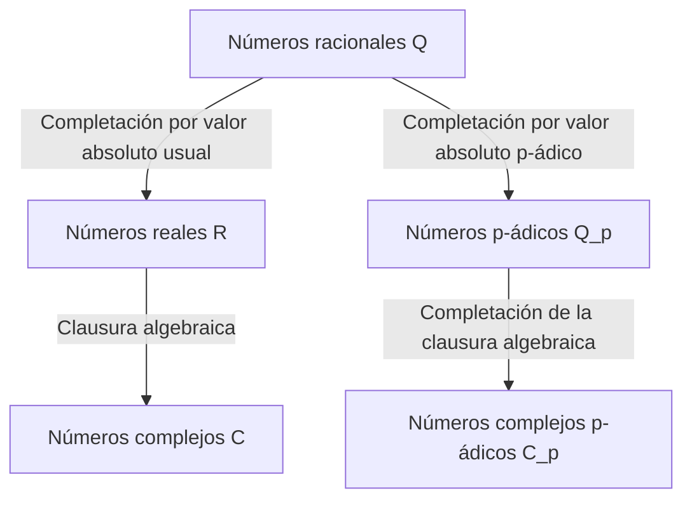

## 1. Introducción

En la teoría de números moderna, particularmente en la teoría algebraica de números y la geometría aritmética, los **números p-ádicos** son una herramienta indispensable. Este concepto revolucionario fue introducido a finales del siglo XIX por el matemático alemán **[Kurt Hensel](https://kenji.blog/p/hensel/)** (1861–1941).

Su descubrimiento sirvió como un puente que conectaba las perspectivas "local" y "global" en matemáticas, provocando un cambio de paradigma en las matemáticas del siglo XX. Este artículo ofrece una exploración detallada de la vida de [Kurt Hensel](https://kenji.blog/p/hensel/), su mayor logro —el descubrimiento de los **números p-ádicos**—, sus fundamentos matemáticos y el profundo impacto que han tenido en las matemáticas modernas.

## 2. Linaje notable y primeros años

[Kurt Hensel](https://kenji.blog/p/hensel/) nació el 29 de diciembre de 1861 en Königsberg, Prusia Oriental (hoy Kaliningrado, Rusia). Su familia ocupa un lugar muy significativo en la historia intelectual y artística de Alemania.

Su abuelo fue el famoso pintor **Wilhelm Hensel**, y su abuela fue la destacada pianista y compositora **Fanny Mendelssohn** (hermana del famoso compositor Felix Mendelssohn). Yendo más atrás, su bisabuelo fue el filósofo representativo de la Ilustración, **Moses Mendelssohn**. Se puede decir que este entorno familiar, cultural e intelectualmente rico, fomentó el pensamiento libre y creativo de [Kurt Hensel](https://kenji.blog/p/hensel/).

Cuando era joven, su familia se mudó a Berlín, donde recibió una educación primaria y secundaria de alta calidad. Su talento para las matemáticas floreció temprano, llevándolo de manera natural al camino de la investigación matemática en la universidad.

## 3. Época universitaria y la influencia de Kronecker

Hensel estudió matemáticas en las Universidades de Bonn y Berlín. En ese momento, la Universidad de Berlín era uno de los centros mundiales para la investigación matemática, con gigantes como **[Karl Weierstrass](https://kenji.blog/p/weierstrass/)** y **Leopold Kronecker** enseñando allí.

Entre ellos, Kronecker tuvo la influencia más profunda en Hensel. Como se sabe por su famosa cita: "Dios hizo los números enteros, todo lo demás es obra del hombre", Kronecker sostenía una firme creencia de que todas las matemáticas debían reconstruirse rigurosamente sobre la base de los números enteros. Bajo la guía de Kronecker, Hensel se dedicó profundamente al álgebra y a la teoría de números.

En 1884, Hensel obtuvo su doctorado de la Universidad de Berlín. El tema de su tesis doctoral trataba sobre las propiedades aritméticas de las funciones algebraicas, lo que serviría como un presagio importante para su posterior descubrimiento de los **números p-ádicos**.

## 4. Analogía entre funciones y números

La mayor inspiración de Hensel provino de la profunda analogía entre "números" (enteros algebraicos) y "funciones" (funciones algebraicas).

A finales del siglo XIX, **Richard Dedekind** y **Heinrich Weber** habían demostrado que existía una sorprendente similitud estructural entre los cuerpos de números algebraicos y los cuerpos de funciones algebraicas. Una función en el plano complejo puede representarse localmente alrededor de cada punto como una serie de potencias, tal como un desarrollo de Taylor o de Laurent.

Hensel se preguntó a sí mismo: "Si una función puede ser estudiada localmente como una serie de potencias alrededor de cada punto, ¿no podrían también los números racionales y los enteros algebraicos representarse como series de potencias alrededor de algún tipo de 'punto'?"

El equivalente de un "punto" en los números era un **número primo $p$**. Hensel llegó a la innovadora idea de expresar cualquier número racional como una serie con un número primo $p$ como base.

## 5. Descubrimiento de los números p-ádicos y fundamentos matemáticos

En 1897, Hensel publicó un artículo innovador introduciendo el concepto de los **números p-ádicos** al mundo por primera vez.

### 5.1 Valuación p-ádica y valor absoluto

Normalmente, la completación del cuerpo de los números racionales $\mathbb{Q}$ da lugar al cuerpo de los números reales $\mathbb{R}$. Esta es una completación como espacio métrico basada en el "valor absoluto" que utilizamos a diario. Sin embargo, Hensel introdujo una forma completamente diferente de medir distancias centrada en un número primo $p$.

Cualquier número racional distinto de cero $x$ puede descomponerse de manera única utilizando un número primo $p$ dado de la siguiente manera:

$$
x = p^v \frac{a}{b}
$$

Aquí, $a$ y $b$ son enteros coprimos con $p$, y $v$ es un entero. A este $v$ se le llama la **valuación p-ádica** de $x$, denotada como $v_p(x) = v$. Además, el **valor absoluto p-ádico** $|x|_p$ de $x$ se define de la siguiente manera:

$$
|x|_p = p^{-v_p(x)} \quad \text{donde } |0|_p = 0
$$

Este nuevo valor absoluto, a diferencia del habitual, satisface la fuerte desigualdad triangular (propiedad no arquimediana):

$$
|x + y|_p \le \max(|x|_p, |y|_p)
$$

### 5.2 Completación de los números racionales a los p-ádicos

Utilizando la distancia $d(x, y) = |x - y|_p$ definida por este valor absoluto p-ádico, el nuevo sistema numérico obtenido al aplicar la completación de secuencias de Cauchy al cuerpo de los números racionales $\mathbb{Q}$ es el **cuerpo de los números p-ádicos** $\mathbb{Q}_p$.

El diagrama a continuación ilustra cómo los sistemas numéricos se ramifican y se expanden.

### 5.3 Ejemplo concreto de desarrollo p-ádico

Todo entero p-ádico (el conjunto $\mathbb{Z}_p$ de elementos cuyo valor absoluto p-ádico es menor o igual a $1$) puede expresarse como una serie infinita de la siguiente manera:

$$
x = a_0 + a_1 p + a_2 p^2 + a_3 p^3 + \dots = \sum_{i=0}^{\infty} a_i p^i
$$

(donde $0 \le a_i \le p-1$)

Como ejemplo, calculemos la expansión de $\frac{1}{3}$ en $\mathbb{Z}_5$ ($p=5$).
Sea $\frac{1}{3} = a_0 + a_1 \cdot 5 + a_2 \cdot 5^2 + \dots$
Multiplicando por el denominador se obtiene $1 = 3(a_0 + a_1 \cdot 5 + a_2 \cdot 5^2 + \dots)$.

Primero, considerando módulo $5$:
De $3 a_0 \equiv 1 \pmod 5$, obtenemos $a_0 = 2$.
Sustituyendo esto y continuando con el cálculo:
$1 = 3(2 + 5x) \implies 1 = 6 + 15x \implies 15x = -5 \implies 3x = -1$.
Aquí $x = a_1 + a_2 \cdot 5 + \dots$
Considerando módulo $5$ de nuevo:
De $3 a_1 \equiv -1 \equiv 4 \pmod 5$, obtenemos $a_1 = 3$.
Sustituyendo de manera similar:
$3(3 + 5y) = -1 \implies 9 + 15y = -1 \implies 15y = -10 \implies 3y = -2$.
De $3 a_2 \equiv -2 \equiv 3 \pmod 5$, obtenemos $a_2 = 1$.
Procediendo más allá:
$3(1 + 5z) = -2 \implies 3 + 15z = -2 \implies 15z = -5 \implies 3z = -1$.
Dado que esto vuelve a la misma forma que $3x = -1$, la secuencia $3, 1$ se repite a partir de ahí.

En otras palabras, la expansión en números 5-ádicos es la siguiente:
$$
\frac{1}{3} = 2 + 3 \cdot 5 + 1 \cdot 5^2 + 3 \cdot 5^3 + 1 \cdot 5^4 + \dots
$$
Esta suma infinita diverge en el sentido habitual, pero en el mundo de los valores absolutos p-ádicos, los términos se vuelven más pequeños a medida que avanzan, lo que significa que converge perfectamente sin contradicción.

## 6. Lema de Hensel

Una de las herramientas más poderosas presentadas por Hensel es el **Lema de Hensel**. Este es un teorema que proporciona las condiciones para que una ecuación polinómica tenga raíces dentro del cuerpo de los números p-ádicos, y puede ser descrito como la versión p-ádica del "método de Newton" en el análisis real.

La afirmación del teorema es la siguiente.
Supongamos que tenemos un polinomio $f(x)$ con coeficientes enteros y un número primo $p$. Si existe un entero $a$ que es una raíz aproximada módulo $p$, y su derivada no es $0$, es decir,

$$
f(a) \equiv 0 \pmod p \quad \text{y} \quad f'(a) \not\equiv 0 \pmod p
$$

son ciertos, entonces podemos construir una raíz verdadera a partir de $a$, y existe de manera única $\alpha \in \mathbb{Z}_p$ satisfaciendo

$$
f(\alpha) = 0 \quad \text{y} \quad \alpha \equiv a \pmod p
$$

Este lema hizo posible encontrar soluciones exactas como números p-ádicos al ir "levantando" (lifting) sucesivamente las soluciones de las ecuaciones de congruencia.

## 7. Teorema de Ostrowski y el Principio Local-Global

Los conceptos de Hensel fueron refinados aún más por otros matemáticos.

En 1916, Alexander Ostrowski probó el **Teorema de Ostrowski**. Este es el hecho sorprendente de que "todo valor absoluto no trivial en el cuerpo de los números racionales es equivalente ya sea al valor absoluto usual o al valor absoluto p-ádico para algún número primo $p$". Así, reuniendo los números reales y todos los números p-ádicos, se cubren "exhaustivamente" todas las posibilidades de completar los números racionales.

Además, el estudiante de Hensel, **[Helmut Hasse](https://kenji.blog/p/hasse/)**, estableció el **Principio Local-Global** (Principio de Hasse). Este es un hermoso teorema que establece que "una condición necesaria y suficiente para que una ecuación tenga una solución sobre los números racionales (globalmente) es que tenga una solución sobre los números reales y los números p-ádicos para todos los números primos $p$ (localmente)". Con esto, los números p-ádicos aseguraron una posición inquebrantable como herramientas esenciales en la teoría de números.

## 8. Contribuciones como educador y editor, y legado

Hensel hizo enormes contribuciones no solo como investigador sino también como educador y editor. Desde 1901 y durante muchos años, se desempeñó como redactor jefe del "Crelle's Journal" (oficialmente: Journal für die reine und angewandte Mathematik), una de las revistas de matemáticas más antiguas del mundo, apoyando la difusión de investigaciones matemáticas de vanguardia de su tiempo.

Sus clases eran claras y apasionadas, nutriendo a la próxima generación de brillantes matemáticos, incluyendo a [Helmut Hasse](https://kenji.blog/p/hasse/).

Hoy en día, los números p-ádicos se aplican en una amplia gama de campos más allá de la teoría algebraica de números, incluyendo el **análisis p-ádico**, la **teoría de Hodge p-ádica**, e incluso la **mecánica cuántica p-ádica** en física teórica. La histórica demostración del "Último Teorema de Fermat" por [Andrew Wiles](https://kenji.blog/p/wiles/) hubiera sido imposible sin la teoría de los números p-ádicos.

## 9. Conclusión

A partir de la hermosa analogía entre funciones y números, [Kurt Hensel](https://kenji.blog/p/hensel/) aportó una dimensión completamente nueva al mundo de las matemáticas con los **números p-ádicos**. Su enfoque de "entender lo global observando lo local" se convirtió en una de las filosofías fundamentales de las matemáticas desde el siglo XX en adelante.

Sus ricas y originales ideas continúan inspirando a los matemáticos de todo el mundo que hoy en día buscan las verdades de los números y del mundo natural.
