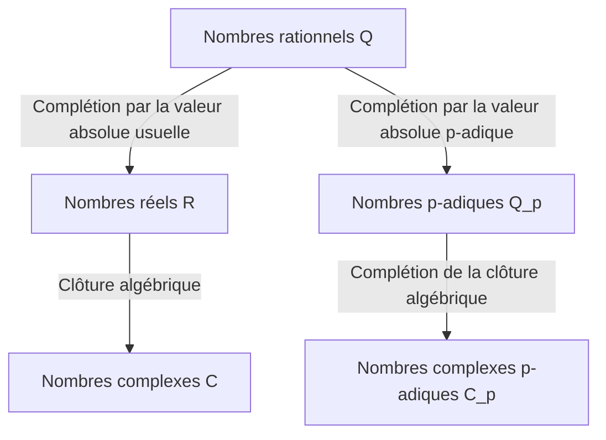

## 1. Introduction

Dans la théorie moderne des nombres, en particulier la théorie algébrique des nombres et la géométrie arithmétique, les **nombres p-adiques** sont un outil indispensable. Ce concept révolutionnaire a été introduit à la fin du 19e siècle par le mathématicien allemand **[Kurt Hensel](https://kenji.blog/fr/p/hensel/)** (1861–1941).

Sa découverte a servi de pont reliant les perspectives « locale » et « globale » en mathématiques, provoquant un changement de paradigme dans les mathématiques du 20e siècle. Cet article propose une exploration détaillée de la vie de [Kurt Hensel](https://kenji.blog/fr/p/hensel/), de sa plus grande réalisation — la découverte des **nombres p-adiques** —, de leurs fondements mathématiques et du profond impact qu'ils ont eu sur les mathématiques modernes.

## 2. Lignée remarquable et débuts

[Kurt Hensel](https://kenji.blog/fr/p/hensel/) est né le 29 décembre 1861 à Königsberg, en Prusse-Orientale (aujourd'hui Kaliningrad, en Russie). Sa famille occupe une place très importante dans l'histoire intellectuelle et artistique de l'Allemagne.

Son grand-père était le célèbre peintre **Wilhelm Hensel**, et sa grand-mère était la pianiste et compositrice exceptionnelle **Fanny Mendelssohn** (la sœur du célèbre compositeur Felix Mendelssohn). En remontant plus loin, son arrière-grand-père était le philosophe représentatif des Lumières, **Moses Mendelssohn**. On peut dire que cet environnement familial, culturellement et intellectuellement riche, a favorisé la pensée libre et créative de [Kurt Hensel](https://kenji.blog/fr/p/hensel/).

Dans sa jeunesse, sa famille a déménagé à Berlin, où il a reçu un enseignement primaire et secondaire de grande qualité. Son talent pour les mathématiques s'est révélé très tôt, le conduisant naturellement sur la voie de la recherche mathématique à l'université.

## 3. Années d'université et l'influence de Kronecker

Hensel a étudié les mathématiques aux universités de Bonn et de Berlin. À l'époque, l'Université de Berlin était l'un des centres mondiaux de la recherche mathématique, avec des géants tels que **[Karl Weierstrass](https://kenji.blog/fr/p/weierstrass/)** et **Leopold Kronecker** qui y enseignaient.

Parmi eux, Kronecker a eu l'influence la plus profonde sur Hensel. Comme le montre sa célèbre citation : « Dieu a fait les nombres entiers, tout le reste est l'œuvre de l'homme », Kronecker croyait fermement que toutes les mathématiques devaient être rigoureusement reconstruites sur la base des nombres entiers. Sous la direction de Kronecker, Hensel s'est profondément consacré à l'algèbre et à la théorie des nombres.

En 1884, Hensel obtient son doctorat de l'Université de Berlin. Le thème de sa thèse de doctorat portait sur les propriétés arithmétiques des fonctions algébriques, ce qui allait servir de préfiguration importante pour sa découverte ultérieure des **nombres p-adiques**.

## 4. Analogie entre fonctions et nombres

La plus grande inspiration de Hensel est venue de la profonde analogie entre les « nombres » (entiers algébriques) et les « fonctions » (fonctions algébriques).

À la fin du 19e siècle, **Richard Dedekind** et **Heinrich Weber** avaient montré qu'il existait une ressemblance structurelle étonnante entre les corps de nombres algébriques et les corps de fonctions algébriques. Une fonction sur le plan complexe peut être représentée localement autour de chaque point comme une série entière, telle qu'un développement de Taylor ou de Laurent.

Hensel s'est demandé : « Si une fonction peut être étudiée localement comme une série entière autour de chaque point, les nombres rationnels et les entiers algébriques ne pourraient-ils pas également être représentés comme des séries entières autour d'une sorte de 'point' ? »

L'équivalent d'un « point » pour les nombres était un **nombre premier $p$**. Hensel est parvenu à l'idée novatrice d'exprimer n'importe quel nombre rationnel comme une série avec un nombre premier $p$ comme base.

## 5. Découverte des nombres p-adiques et fondements mathématiques

En 1897, Hensel publie un article novateur introduisant pour la première fois le concept de **nombres p-adiques** au monde.

### 5.1 Valuation p-adique et valeur absolue

Normalement, la complétion du corps des nombres rationnels $\mathbb{Q}$ donne le corps des nombres réels $\mathbb{R}$. Il s'agit d'une complétion en tant qu'espace métrique basée sur la « valeur absolue » que nous utilisons quotidiennement. Cependant, Hensel a introduit une façon entièrement différente de mesurer la distance, centrée sur un nombre premier $p$.

Tout nombre rationnel non nul $x$ peut être décomposé de manière unique en utilisant un nombre premier donné $p$ comme suit :

$$
x = p^v \frac{a}{b}
$$

Ici, $a$ et $b$ sont des entiers premiers avec $p$, et $v$ est un entier. Ce $v$ est appelé la **valuation p-adique** de $x$, notée $v_p(x) = v$. De plus, la **valeur absolue p-adique** $|x|_p$ de $x$ est définie comme suit :

$$
|x|_p = p^{-v_p(x)} \quad \text{où } |0|_p = 0
$$

Cette nouvelle valeur absolue, contrairement à l'habituelle, satisfait l'inégalité triangulaire forte (propriété non archimédienne) :

$$
|x + y|_p \le \max(|x|_p, |y|_p)
$$

### 5.2 Complétion des nombres rationnels aux nombres p-adiques

En utilisant la distance $d(x, y) = |x - y|_p$ définie par cette valeur absolue p-adique, le nouveau système de nombres obtenu en appliquant la complétion des suites de Cauchy au corps des nombres rationnels $\mathbb{Q}$ est le **corps des nombres p-adiques** $\mathbb{Q}_p$.

Le diagramme ci-dessous illustre comment les systèmes de nombres bifurquent et s'étendent.

### 5.3 Exemple concret de développement p-adique

Tout entier p-adique (l'ensemble $\mathbb{Z}_p$ des éléments dont la valeur absolue p-adique est inférieure ou égale à $1$) peut être exprimé comme une série infinie comme suit :

$$
x = a_0 + a_1 p + a_2 p^2 + a_3 p^3 + \dots = \sum_{i=0}^{\infty} a_i p^i
$$

(où $0 \le a_i \le p-1$)

À titre d'exemple, calculons le développement de $\frac{1}{3}$ dans $\mathbb{Z}_5$ ($p=5$).
Soit $\frac{1}{3} = a_0 + a_1 \cdot 5 + a_2 \cdot 5^2 + \dots$
En chassant le dénominateur, on obtient $1 = 3(a_0 + a_1 \cdot 5 + a_2 \cdot 5^2 + \dots)$.

Tout d'abord, en considérant modulo $5$ :
À partir de $3 a_0 \equiv 1 \pmod 5$, nous obtenons $a_0 = 2$.
En substituant cela et en poursuivant le calcul :
$1 = 3(2 + 5x) \implies 1 = 6 + 15x \implies 15x = -5 \implies 3x = -1$.
Ici, $x = a_1 + a_2 \cdot 5 + \dots$
En considérant de nouveau modulo $5$ :
À partir de $3 a_1 \equiv -1 \equiv 4 \pmod 5$, nous obtenons $a_1 = 3$.
En substituant de la même manière :
$3(3 + 5y) = -1 \implies 9 + 15y = -1 \implies 15y = -10 \implies 3y = -2$.
À partir de $3 a_2 \equiv -2 \equiv 3 \pmod 5$, nous obtenons $a_2 = 1$.
En poursuivant :
$3(1 + 5z) = -2 \implies 3 + 15z = -2 \implies 15z = -5 \implies 3z = -1$.
Puisque cela ramène à la même forme que $3x = -1$, la séquence $3, 1$ se répète par la suite.

En d'autres termes, le développement en nombres 5-adiques est le suivant :
$$
\frac{1}{3} = 2 + 3 \cdot 5 + 1 \cdot 5^2 + 3 \cdot 5^3 + 1 \cdot 5^4 + \dots
$$
Cette somme infinie diverge au sens habituel, mais dans le monde des valeurs absolues p-adiques, les termes deviennent plus petits au fur et à mesure qu'ils progressent, ce qui signifie qu'elle converge parfaitement sans contradiction.

## 6. Lemme de Hensel

L'un des outils les plus puissants présentés par Hensel est le **lemme de Hensel**. Il s'agit d'un théorème qui donne les conditions pour qu'une équation polynomiale ait des racines dans le corps des nombres p-adiques, et il peut être décrit comme la version p-adique de la « méthode de Newton » en analyse réelle.

L'affirmation du théorème est la suivante.
Supposons que nous ayons un polynôme $f(x)$ à coefficients entiers et un nombre premier $p$. S'il existe un entier $a$ qui est une racine approchée modulo $p$, et que sa dérivée n'est pas $0$, c'est-à-dire,

$$
f(a) \equiv 0 \pmod p \quad \text{et} \quad f'(a) \not\equiv 0 \pmod p
$$

sont vrais, alors nous pouvons construire une vraie racine en partant de $a$, et il existe de manière unique $\alpha \in \mathbb{Z}_p$ satisfaisant

$$
f(\alpha) = 0 \quad \text{et} \quad \alpha \equiv a \pmod p
$$

Ce lemme a permis de trouver des solutions exactes sous forme de nombres p-adiques en « relevant » (lifting) successivement les solutions d'équations de congruence.

## 7. Théorème d'Ostrowski et principe local-global

Les concepts de Hensel ont été davantage affinés par d'autres mathématiciens.

En 1916, Alexander Ostrowski a prouvé le **théorème d'Ostrowski**. Il s'agit du fait surprenant que « toute valeur absolue non triviale sur le corps des nombres rationnels est équivalente soit à la valeur absolue usuelle, soit à la valeur absolue p-adique pour un certain nombre premier $p$ ». Ainsi, le rassemblement des nombres réels et de tous les nombres p-adiques « couvre de manière exhaustive » toutes les possibilités de complétion des nombres rationnels.

De plus, l'étudiant de Hensel, **[Helmut Hasse](https://kenji.blog/fr/p/hasse/)**, a établi le **principe local-global** (principe de Hasse). C'est un théorème magnifique stipulant qu'« une condition nécessaire et suffisante pour qu'une équation ait une solution sur les nombres rationnels (globalement) est qu'elle ait une solution sur les nombres réels et les nombres p-adiques pour tous les nombres premiers $p$ (localement) ». Avec cela, les nombres p-adiques se sont assuré une position inébranlable en tant qu'outils essentiels de la théorie des nombres.

## 8. Contributions en tant qu'éducateur et éditeur, et héritage

Hensel a apporté d'énormes contributions non seulement en tant que chercheur, mais aussi en tant qu'éducateur et éditeur. À partir de 1901 et pendant de nombreuses années, il a été rédacteur en chef du « Journal de Crelle » (officiellement : Journal für die reine und angewandte Mathematik), l'une des plus anciennes revues de mathématiques au monde, soutenant la diffusion des recherches mathématiques de pointe de son temps.

Ses conférences étaient claires et passionnées, formant la prochaine génération de brillants mathématiciens, dont [Helmut Hasse](https://kenji.blog/fr/p/hasse/).

Aujourd'hui, les nombres p-adiques sont appliqués dans un large éventail de domaines au-delà de la théorie algébrique des nombres, y compris **l'analyse p-adique**, **la théorie de Hodge p-adique**, et même **la mécanique quantique p-adique** en physique théorique. La preuve historique du « dernier théorème de Fermat » par [Andrew Wiles](https://kenji.blog/fr/p/wiles/) aurait été impossible sans la théorie des nombres p-adiques.

## 9. Conclusion

Partant de la belle analogie entre fonctions et nombres, [Kurt Hensel](https://kenji.blog/fr/p/hensel/) a apporté une dimension entièrement nouvelle au monde des mathématiques avec les **nombres p-adiques**. Son approche consistant à « comprendre le global en regardant localement » est devenue l'une des philosophies fondamentales des mathématiques à partir du 20e siècle.

Ses idées riches et originales continuent d'inspirer les mathématiciens du monde entier qui cherchent aujourd'hui les vérités des nombres et du monde naturel.
