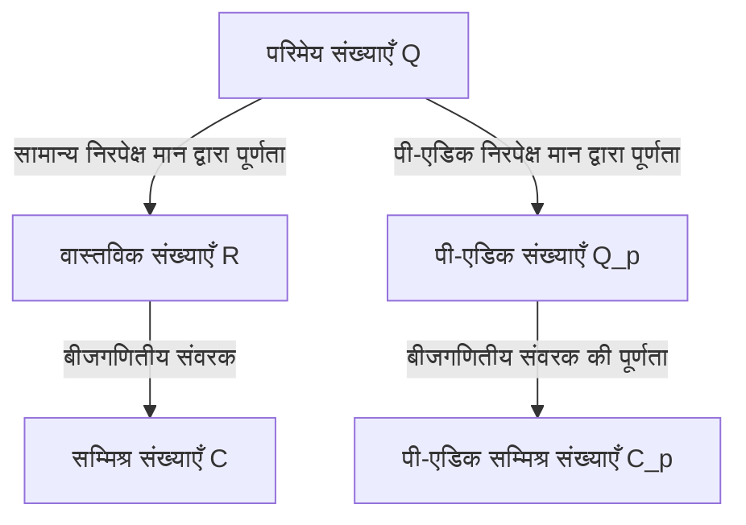

## 1. परिचय

आधुनिक संख्या सिद्धांत में, विशेष रूप से बीजगणितीय संख्या सिद्धांत और अंकगणितीय ज्यामिति में, **पी-एडिक संख्याएँ** (p-adic numbers) एक अपरिहार्य उपकरण हैं। इस क्रांतिकारी अवधारणा को 19वीं शताब्दी के अंत में जर्मन गणितज्ञ **कर्ट हेन्सेल** (Kurt Hensel, 1861–1941) द्वारा पेश किया गया था।

उनकी खोज ने गणित में "स्थानीय (local)" और "वैश्विक (global)" दृष्टिकोणों को जोड़ने वाले एक पुल के रूप में काम किया, जिसने 20वीं शताब्दी के गणित में एक प्रतिमान बदलाव ला दिया। यह लेख कर्ट हेन्सेल के जीवन, उनकी सबसे बड़ी उपलब्धि—**पी-एडिक संख्याओं** की खोज—उनके गणितीय आधार, और आधुनिक गणित पर उनके द्वारा डाले गए गहरे प्रभाव का विस्तृत अन्वेषण प्रदान करता है।

## 2. उल्लेखनीय वंश और प्रारंभिक जीवन

कर्ट हेन्सेल का जन्म 29 दिसंबर 1861 को कोनिग्सबर्ग, पूर्वी प्रशिया (अब कैलिनिनग्राद, रूस) में हुआ था। उनके परिवार का जर्मनी के बौद्धिक और कलात्मक इतिहास में एक अत्यधिक महत्वपूर्ण स्थान है।

उनके दादा प्रसिद्ध चित्रकार **विल्हेम हेन्सेल** थे, और उनकी दादी उत्कृष्ट पियानोवादक और संगीतकार **फैनी मेंडेलसोहन** (प्रसिद्ध संगीतकार फेलिक्स मेंडेलसोहन की बहन) थीं। और पीछे जाएं तो, उनके परदादा प्रबोधन काल (Enlightenment) के प्रतिनिधि दार्शनिक **मोसेस मेंडेलसोहन** थे। यह कहा जा सकता है कि इस सांस्कृतिक और बौद्धिक रूप से समृद्ध पारिवारिक वातावरण ने कर्ट हेन्सेल की स्वतंत्र और रचनात्मक सोच को बढ़ावा दिया।

जब वे छोटे थे, तब उनका परिवार बर्लिन चला गया, जहाँ उन्होंने उच्च गुणवत्ता वाली प्राथमिक और माध्यमिक शिक्षा प्राप्त की। गणित के लिए उनकी प्रतिभा जल्दी ही निखर गई, जो उन्हें स्वाभाविक रूप से विश्वविद्यालय में गणितीय शोध के मार्ग पर ले गई।

## 3. विश्वविद्यालय के दिन और क्रोनकर का प्रभाव

हेन्सेल ने बॉन और बर्लिन विश्वविद्यालयों में गणित का अध्ययन किया। उस समय, बर्लिन विश्वविद्यालय गणितीय अनुसंधान के विश्व केंद्रों में से एक था, जहाँ **कार्ल वीयरस्ट्रास** और **लियोपोल्ड क्रोनकर** जैसे दिग्गज पढ़ाते थे।

इनमें से, क्रोनकर का हेन्सेल पर सबसे गहरा प्रभाव पड़ा। जैसा कि उनके प्रसिद्ध उद्धरण से जाना जाता है: "भगवान ने पूर्णांक बनाए, बाकी सब मनुष्य का काम है," क्रोनकर का दृढ़ विश्वास था कि सभी गणित को पूर्णांकों के आधार पर कड़ाई से फिर से बनाया जाना चाहिए। क्रोनकर के मार्गदर्शन में, हेन्सेल ने खुद को बीजगणित और संख्या सिद्धांत के प्रति गहराई से समर्पित कर दिया।

1884 में, हेन्सेल ने बर्लिन विश्वविद्यालय से डॉक्टरेट की उपाधि प्राप्त की। उनके डॉक्टरेट शोध प्रबंध का विषय बीजगणितीय कार्यों के अंकगणितीय गुणों पर था, जो बाद में उनकी **पी-एडिक संख्याओं** की खोज के लिए एक महत्वपूर्ण पूर्वाभास के रूप में काम करेगा।

## 4. कार्यों और संख्याओं के बीच सादृश्यता

हेन्सेल की सबसे बड़ी प्रेरणा "संख्याओं" (बीजगणितीय पूर्णांकों) और "कार्यों" (बीजगणितीय कार्यों) के बीच गहरी सादृश्यता (analogy) से आई।

19वीं शताब्दी के अंत में, **रिचर्ड डेडेकाइंड** और **हेनरिक वेबर** ने दिखाया था कि बीजगणितीय संख्या क्षेत्रों और बीजगणितीय कार्य क्षेत्रों के बीच एक आश्चर्यजनक संरचनात्मक समानता थी। जटिल तल (complex plane) पर एक कार्य (function) को प्रत्येक बिंदु के चारों ओर स्थानीय रूप से एक पावर श्रृंखला के रूप में दर्शाया जा सकता है, जैसे कि टेलर या लॉरेंट विस्तार।

हेन्सेल ने खुद से पूछा: "यदि किसी कार्य का स्थानीय रूप से प्रत्येक बिंदु के चारों ओर एक पावर श्रृंखला के रूप में अध्ययन किया जा सकता है, तो क्या परिमेय संख्याओं और बीजगणितीय पूर्णांकों को भी किसी प्रकार के 'बिंदु' के चारों ओर पावर श्रृंखला के रूप में नहीं दर्शाया जा सकता है?"

संख्याओं में एक "बिंदु" के समतुल्य एक **अभाज्य संख्या $p$** थी। हेन्सेल किसी भी परिमेय संख्या को आधार के रूप में अभाज्य संख्या $p$ वाली एक श्रृंखला के रूप में व्यक्त करने के नवीन विचार पर पहुंचे।

## 5. पी-एडिक संख्याओं की खोज और गणितीय आधार

1897 में, हेन्सेल ने एक अभूतपूर्व शोध पत्र प्रकाशित किया जिसमें पहली बार दुनिया को **पी-एडिक संख्याओं** की अवधारणा से परिचित कराया गया।

### 5.1 पी-एडिक मूल्यांकन और निरपेक्ष मान

आमतौर पर, परिमेय संख्याओं के क्षेत्र $\mathbb{Q}$ की पूर्णता (completion) से वास्तविक संख्याओं का क्षेत्र $\mathbb{R}$ प्राप्त होता है। यह उस "निरपेक्ष मान (absolute value)" पर आधारित एक मीट्रिक स्पेस के रूप में एक पूर्णता है जिसका हम दैनिक उपयोग करते हैं। हालाँकि, हेन्सेल ने दूरी मापने का एक बिल्कुल अलग तरीका पेश किया जो एक अभाज्य संख्या $p$ पर केंद्रित था।

किसी भी गैर-शून्य परिमेय संख्या $x$ को दी गई अभाज्य संख्या $p$ का उपयोग करके विशिष्ट रूप से निम्नानुसार विघटित किया जा सकता है:

$$
x = p^v \frac{a}{b}
$$

यहाँ, $a$ और $b$, $p$ के साथ सह-अभाज्य पूर्णांक हैं, और $v$ एक पूर्णांक है। इस $v$ को $x$ का **पी-एडिक मूल्यांकन** (p-adic valuation) कहा जाता है, जिसे $v_p(x) = v$ के रूप में दर्शाया जाता है। इसके अलावा, $x$ का **पी-एडिक निरपेक्ष मान** $|x|_p$ निम्नानुसार परिभाषित किया गया है:

$$
|x|_p = p^{-v_p(x)} \quad \text{जहाँ } |0|_p = 0
$$

यह नया निरपेक्ष मान, सामान्य वाले के विपरीत, मजबूत त्रिभुज असमानता (गैर-आर्किमिडीयन संपत्ति) को संतुष्ट करता है:

$$
|x + y|_p \le \max(|x|_p, |y|_p)
$$

### 5.2 परिमेय से पी-एडिक संख्याओं तक की पूर्णता

इस पी-एडिक निरपेक्ष मान द्वारा परिभाषित दूरी $d(x, y) = |x - y|_p$ का उपयोग करते हुए, परिमेय संख्याओं के क्षेत्र $\mathbb{Q}$ में कॉची अनुक्रम (Cauchy sequence) पूर्णता लागू करने से प्राप्त नई संख्या प्रणाली **पी-एडिक संख्याओं का क्षेत्र** $\mathbb{Q}_p$ है।

नीचे दिया गया आरेख स्पष्ट करता है कि संख्या प्रणालियाँ कैसे शाखित और विस्तारित होती हैं।

### 5.3 पी-एडिक विस्तार का विशिष्ट उदाहरण

प्रत्येक पी-एडिक पूर्णांक (उन तत्वों का समुच्चय $\mathbb{Z}_p$ जिनका पी-एडिक निरपेक्ष मान $1$ से कम या उसके बराबर है) को निम्नानुसार अनंत श्रृंखला के रूप में व्यक्त किया जा सकता है:

$$
x = a_0 + a_1 p + a_2 p^2 + a_3 p^3 + \dots = \sum_{i=0}^{\infty} a_i p^i
$$

(जहाँ $0 \le a_i \le p-1$)

उदाहरण के रूप में, आइए $\mathbb{Z}_5$ ($p=5$) में $\frac{1}{3}$ के विस्तार की गणना करें।
मान लें कि $\frac{1}{3} = a_0 + a_1 \cdot 5 + a_2 \cdot 5^2 + \dots$
हर (denominator) को हटाने से $1 = 3(a_0 + a_1 \cdot 5 + a_2 \cdot 5^2 + \dots)$ प्राप्त होता है।

सबसे पहले, मॉड्यूलो $5$ पर विचार करते हुए:
$3 a_0 \equiv 1 \pmod 5$ से, हमें $a_0 = 2$ प्राप्त होता है।
इसे प्रतिस्थापित करने और गणना जारी रखने पर:
$1 = 3(2 + 5x) \implies 1 = 6 + 15x \implies 15x = -5 \implies 3x = -1$।
यहाँ $x = a_1 + a_2 \cdot 5 + \dots$ है।
फिर से मॉड्यूलो $5$ पर विचार करते हुए:
$3 a_1 \equiv -1 \equiv 4 \pmod 5$ से, हमें $a_1 = 3$ प्राप्त होता है।
इसी तरह प्रतिस्थापित करने पर:
$3(3 + 5y) = -1 \implies 9 + 15y = -1 \implies 15y = -10 \implies 3y = -2$।
$3 a_2 \equiv -2 \equiv 3 \pmod 5$ से, हमें $a_2 = 1$ प्राप्त होता है।
आगे बढ़ने पर:
$3(1 + 5z) = -2 \implies 3 + 15z = -2 \implies 15z = -5 \implies 3z = -1$।
चूँकि यह $3x = -1$ के समान रूप में वापस आ जाता है, इसलिए अनुक्रम $3, 1$ उसके बाद दोहराता है।

दूसरे शब्दों में, 5-एडिक संख्याओं में विस्तार इस प्रकार है:
$$
\frac{1}{3} = 2 + 3 \cdot 5 + 1 \cdot 5^2 + 3 \cdot 5^3 + 1 \cdot 5^4 + \dots
$$
यह अनंत योग सामान्य अर्थों में अपसारी (diverges) होता है, लेकिन पी-एडिक निरपेक्ष मानों की दुनिया में, पद आगे बढ़ने पर छोटे हो जाते हैं, जिसका अर्थ है कि यह बिना किसी विरोधाभास के पूरी तरह से अभिसारी (converges) होता है।

## 6. हेन्सेल की लेम्मा (Hensel's Lemma)

हेन्सेल द्वारा प्रस्तुत सबसे शक्तिशाली उपकरणों में से एक **हेन्सेल की लेम्मा** है। यह एक प्रमेय है जो बहुपद समीकरण को पी-एडिक संख्याओं के क्षेत्र के भीतर जड़ें (roots) रखने की शर्तें प्रदान करता है, और इसे वास्तविक विश्लेषण में "न्यूटन की विधि" के पी-एडिक संस्करण के रूप में वर्णित किया जा सकता है।

प्रमेय का दावा इस प्रकार है।
मान लीजिए कि हमारे पास पूर्णांक गुणांकों वाला एक बहुपद $f(x)$ और एक अभाज्य संख्या $p$ है। यदि कोई पूर्णांक $a$ मौजूद है जो मॉड्यूलो $p$ एक अनुमानित जड़ है, और इसका व्युत्पन्न (derivative) $0$ नहीं है, अर्थात,

$$
f(a) \equiv 0 \pmod p \quad \text{और} \quad f'(a) \not\equiv 0 \pmod p
$$

सत्य हैं, तो हम $a$ से शुरू करके एक सच्ची जड़ बना सकते हैं, और विशिष्ट रूप से $\alpha \in \mathbb{Z}_p$ मौजूद है जो संतुष्ट करता है

$$
f(\alpha) = 0 \quad \text{और} \quad \alpha \equiv a \pmod p
$$

इस लेम्मा ने सर्वांगसमता (congruence) समीकरणों के समाधानों को क्रमिक रूप से "उठाकर (lifting)" पी-एडिक संख्याओं के रूप में सटीक समाधान खोजना संभव बना दिया।

## 7. ओस्ट्रोव्स्की का प्रमेय और स्थानीय-वैश्विक सिद्धांत

हेन्सेल की अवधारणाओं को अन्य गणितज्ञों द्वारा और परिष्कृत किया गया।

1916 में, अलेक्जेंडर ओस्ट्रोव्स्की ने **ओस्ट्रोव्स्की का प्रमेय** सिद्ध किया। यह आश्चर्यजनक तथ्य है कि "परिमेय संख्याओं के क्षेत्र पर प्रत्येक गैर-तुच्छ निरपेक्ष मान या तो सामान्य निरपेक्ष मान या किसी अभाज्य संख्या $p$ के लिए पी-एडिक निरपेक्ष मान के समतुल्य है।" इस प्रकार, वास्तविक संख्याओं और सभी पी-एडिक संख्याओं को एक साथ लाना परिमेय संख्याओं को पूरा करने की सभी संभावनाओं को "व्यापक रूप से कवर" करता है।

इसके अलावा, हेन्सेल के छात्र **हेल्मुट हासे** (Helmut Hasse) ने **स्थानीय-वैश्विक सिद्धांत** (हासे सिद्धांत) स्थापित किया। यह एक सुंदर प्रमेय है जिसमें कहा गया है कि "एक समीकरण को परिमेय संख्याओं (वैश्विक रूप से) पर हल करने के लिए एक आवश्यक और पर्याप्त शर्त यह है कि इसका वास्तविक संख्याओं और पी-एडिक संख्याओं पर सभी अभाज्य $p$ (स्थानीय रूप से) के लिए एक समाधान है।" इसके साथ, पी-एडिक संख्याओं ने संख्या सिद्धांत में आवश्यक उपकरणों के रूप में एक अटूट स्थिति सुरक्षित कर ली।

## 8. एक शिक्षक और संपादक के रूप में योगदान, और विरासत

हेन्सेल ने न केवल एक शोधकर्ता के रूप में बल्कि एक शिक्षक और संपादक के रूप में भी बहुत बड़ा योगदान दिया। 1901 से कई वर्षों तक, उन्होंने दुनिया की सबसे पुरानी गणित पत्रिकाओं में से एक "क्रेल्स जर्नल" (आधिकारिक तौर पर: Journal für die reine und angewandte Mathematik) के प्रधान संपादक के रूप में कार्य किया, जो उनके समय के अत्याधुनिक गणितीय अनुसंधान के प्रसार का समर्थन करता था।

उनके व्याख्यान स्पष्ट और भावुक थे, जिन्होंने हेल्मुट हासे सहित अगली पीढ़ी के शानदार गणितज्ञों का पोषण किया।

आज, पी-एडिक संख्याओं को बीजगणितीय संख्या सिद्धांत से परे कई क्षेत्रों में लागू किया जाता है, जिसमें **पी-एडिक विश्लेषण**, **पी-एडिक हॉज सिद्धांत**, और यहां तक कि सैद्धांतिक भौतिकी में **पी-एडिक क्वांटम यांत्रिकी** भी शामिल हैं। एंड्रयू विल्स द्वारा "फर्मेट के अंतिम प्रमेय" का ऐतिहासिक प्रमाण पी-एडिक संख्याओं के सिद्धांत के बिना असंभव होता।

## 9. निष्कर्ष

कार्यों और संख्याओं के बीच सुंदर सादृश्यता से शुरू करते हुए, कर्ट हेन्सेल ने **पी-एडिक संख्याओं** के साथ गणित की दुनिया में एक बिल्कुल नया आयाम ला दिया। "स्थानीय स्तर पर देखकर वैश्विक को समझना" का उनका दृष्टिकोण 20वीं शताब्दी के बाद से गणित के मूलभूत दर्शन में से एक बन गया।

उनके समृद्ध और मूल विचार दुनिया भर के गणितज्ञों को प्रेरित करते रहते हैं जो आज संख्याओं और प्राकृतिक दुनिया की सच्चाइयों की खोज करते हैं।
