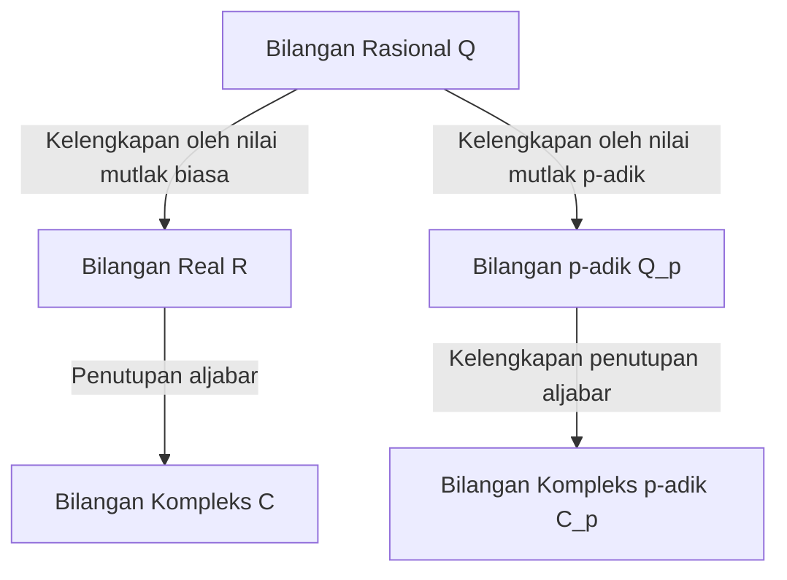

## 1. Pengantar

Dalam teori bilangan modern, khususnya teori bilangan aljabar dan geometri aritmetika, **bilangan p-adik** adalah alat yang sangat diperlukan. Konsep revolusioner ini diperkenalkan pada akhir abad ke-19 oleh matematikawan Jerman **[Kurt Hensel](https://kenji.blog/p/hensel/)** (1861–1941).

Penemuannya berfungsi sebagai jembatan yang menghubungkan perspektif "lokal" dan "global" dalam matematika, membawa pergeseran paradigma dalam matematika abad ke-20. Artikel ini memberikan eksplorasi terperinci tentang kehidupan [Kurt Hensel](https://kenji.blog/p/hensel/), pencapaian terbesarnya—penemuan **bilangan p-adik**—fondasi matematisnya, dan dampak mendalam yang telah mereka berikan pada matematika modern.

## 2. Garis Keturunan yang Luar Biasa dan Kehidupan Awal

[Kurt Hensel](https://kenji.blog/p/hensel/) lahir pada tanggal 29 Desember 1861, di Königsberg, Prusia Timur (sekarang Kaliningrad, Rusia). Keluarganya memegang tempat yang sangat penting dalam sejarah intelektual dan artistik Jerman.

Kakeknya adalah pelukis terkenal **Wilhelm Hensel**, dan neneknya adalah pianis dan komposer luar biasa **Fanny Mendelssohn** (saudara perempuan dari komposer terkenal Felix Mendelssohn). Lebih jauh ke belakang, kakek buyutnya adalah filsuf perwakilan Pencerahan, **Moses Mendelssohn**. Dapat dikatakan bahwa lingkungan keluarga yang kaya secara budaya dan intelektual ini mendorong pemikiran [Kurt Hensel](https://kenji.blog/p/hensel/) yang bebas dan kreatif.

Ketika dia masih muda, keluarganya pindah ke Berlin, di mana dia menerima pendidikan dasar dan menengah yang berkualitas tinggi. Bakatnya di bidang matematika berkembang lebih awal, secara alami membawanya ke jalur penelitian matematika di tingkat universitas.

## 3. Hari-hari Universitas dan Pengaruh Kronecker

Hensel belajar matematika di Universitas Bonn dan Berlin. Pada saat itu, Universitas Berlin adalah salah satu pusat penelitian matematika dunia, dengan tokoh-tokoh raksasa seperti **[Karl Weierstrass](https://kenji.blog/p/weierstrass/)** dan **Leopold Kronecker** mengajar di sana.

Di antara mereka, Kronecker memiliki pengaruh terdalam pada Hensel. Seperti yang diketahui dari kutipannya yang terkenal, "Tuhan menciptakan bilangan bulat, semua yang lain adalah karya manusia," Kronecker memegang keyakinan kuat bahwa semua matematika harus direkonstruksi secara ketat berdasarkan bilangan bulat. Di bawah bimbingan Kronecker, Hensel mengabdikan dirinya secara mendalam pada aljabar dan teori bilangan.

Pada tahun 1884, Hensel memperoleh gelar doktor dari Universitas Berlin. Tema disertasi doktoralnya adalah tentang sifat aritmetika fungsi aljabar, yang akan berfungsi sebagai bayangan penting untuk penemuan **bilangan p-adik**-nya di kemudian hari.

## 4. Analogi Antara Fungsi dan Bilangan

Inspirasi terbesar Hensel datang dari analogi mendalam antara "bilangan" (bilangan bulat aljabar) dan "fungsi" (fungsi aljabar).

Pada akhir abad ke-19, **Richard Dedekind** dan **Heinrich Weber** telah menunjukkan bahwa ada kesamaan struktural yang menakjubkan antara lapangan bilangan aljabar dan lapangan fungsi aljabar. Suatu fungsi pada bidang kompleks dapat direpresentasikan secara lokal di sekitar setiap titik sebagai deret pangkat, seperti ekspansi Taylor atau Laurent.

Hensel bertanya pada dirinya sendiri: "Jika suatu fungsi dapat dipelajari secara lokal sebagai deret pangkat di sekitar setiap titik, tidak bisakah bilangan rasional dan bilangan bulat aljabar juga direpresentasikan sebagai deret pangkat di sekitar semacam 'titik'?"

Ekuivalen dari sebuah "titik" dalam angka adalah sebuah **bilangan prima $p$**. Hensel tiba pada ide inovatif untuk mengekspresikan sembarang bilangan rasional sebagai deret dengan bilangan prima $p$ sebagai basisnya.

## 5. Penemuan Bilangan p-adik dan Fondasi Matematis

Pada tahun 1897, Hensel menerbitkan sebuah makalah terobosan yang memperkenalkan konsep **bilangan p-adik** kepada dunia untuk pertama kalinya.

### 5.1 Valuasi p-adik dan Nilai Mutlak

Biasanya, kelengkapan lapangan bilangan rasional $\mathbb{Q}$ menghasilkan lapangan bilangan real $\mathbb{R}$. Ini adalah kelengkapan sebagai ruang metrik berdasarkan "nilai mutlak" yang kita gunakan sehari-hari. Namun, Hensel memperkenalkan cara yang sama sekali berbeda untuk mengukur jarak yang difokuskan pada bilangan prima $p$.

Setiap bilangan rasional tidak nol $x$ dapat didekomposisi secara unik menggunakan bilangan prima $p$ yang diberikan sebagai berikut:

$$
x = p^v \frac{a}{b}
$$

Di sini, $a$ dan $b$ adalah bilangan bulat yang relatif prima dengan $p$, dan $v$ adalah bilangan bulat. $v$ ini disebut **valuasi p-adik** dari $x$, dinotasikan sebagai $v_p(x) = v$. Selanjutnya, **nilai mutlak p-adik** $|x|_p$ dari $x$ didefinisikan sebagai berikut:

$$
|x|_p = p^{-v_p(x)} \quad \text{di mana } |0|_p = 0
$$

Nilai mutlak baru ini, tidak seperti biasanya, memenuhi ketaksamaan segitiga kuat (sifat non-Archimedean):

$$
|x + y|_p \le \max(|x|_p, |y|_p)
$$

### 5.2 Kelengkapan dari Bilangan Rasional ke p-adik

Menggunakan jarak $d(x, y) = |x - y|_p$ yang didefinisikan oleh nilai mutlak p-adik ini, sistem bilangan baru yang diperoleh dengan menerapkan kelengkapan barisan Cauchy ke lapangan bilangan rasional $\mathbb{Q}$ adalah **lapangan bilangan p-adik** $\mathbb{Q}_p$.

Diagram di bawah ini mengilustrasikan bagaimana sistem bilangan bercabang dan meluas.

### 5.3 Contoh Spesifik Ekspansi p-adik

Setiap bilangan bulat p-adik (himpunan $\mathbb{Z}_p$ elemen-elemen yang nilai mutlak p-adiknya kurang dari atau sama dengan $1$) dapat diekspresikan sebagai deret tak terhingga sebagai berikut:

$$
x = a_0 + a_1 p + a_2 p^2 + a_3 p^3 + \dots = \sum_{i=0}^{\infty} a_i p^i
$$

(di mana $0 \le a_i \le p-1$)

Sebagai contoh, mari kita hitung ekspansi $\frac{1}{3}$ dalam $\mathbb{Z}_5$ ($p=5$).
Misalkan $\frac{1}{3} = a_0 + a_1 \cdot 5 + a_2 \cdot 5^2 + \dots$
Menghilangkan penyebut memberikan $1 = 3(a_0 + a_1 \cdot 5 + a_2 \cdot 5^2 + \dots)$.

Pertama, pertimbangkan modulo $5$:
Dari $3 a_0 \equiv 1 \pmod 5$, kita peroleh $a_0 = 2$.
Mensubstitusikan ini dan melanjutkan perhitungan:
$1 = 3(2 + 5x) \implies 1 = 6 + 15x \implies 15x = -5 \implies 3x = -1$.
Di sini $x = a_1 + a_2 \cdot 5 + \dots$
Pertimbangkan modulo $5$ lagi:
Dari $3 a_1 \equiv -1 \equiv 4 \pmod 5$, kita peroleh $a_1 = 3$.
Mensubstitusikan dengan cara yang sama:
$3(3 + 5y) = -1 \implies 9 + 15y = -1 \implies 15y = -10 \implies 3y = -2$.
Dari $3 a_2 \equiv -2 \equiv 3 \pmod 5$, kita peroleh $a_2 = 1$.
Melanjutkan lebih jauh:
$3(1 + 5z) = -2 \implies 3 + 15z = -2 \implies 15z = -5 \implies 3z = -1$.
Karena ini kembali ke bentuk yang sama dengan $3x = -1$, urutan $3, 1$ berulang setelahnya.

Dengan kata lain, ekspansi dalam bilangan 5-adik adalah sebagai berikut:
$$
\frac{1}{3} = 2 + 3 \cdot 5 + 1 \cdot 5^2 + 3 \cdot 5^3 + 1 \cdot 5^4 + \dots
$$
Jumlah tak terhingga ini menyimpang dalam arti biasa, tetapi dalam dunia nilai mutlak p-adik, suku-sukunya menjadi lebih kecil seiring perkembangannya, yang berarti ia konvergen secara sempurna tanpa kontradiksi.

## 6. Lemma Hensel

Salah satu alat paling kuat yang disajikan oleh Hensel adalah **Lemma Hensel**. Ini adalah teorema yang memberikan kondisi bagi persamaan polinomial untuk memiliki akar dalam lapangan bilangan p-adik, dan ini dapat digambarkan sebagai versi p-adik dari "metode Newton" dalam analisis real.

Pernyataan teorema ini adalah sebagai berikut.
Misalkan kita memiliki polinomial $f(x)$ dengan koefisien bilangan bulat dan bilangan prima $p$. Jika ada bilangan bulat $a$ yang merupakan akar perkiraan modulo $p$, dan turunannya bukan $0$, yaitu,

$$
f(a) \equiv 0 \pmod p \quad \text{dan} \quad f'(a) \not\equiv 0 \pmod p
$$

berlaku benar, maka kita dapat membangun akar sejati mulai dari $a$, dan ada $\alpha \in \mathbb{Z}_p$ secara unik yang memenuhi

$$
f(\alpha) = 0 \quad \text{dan} \quad \alpha \equiv a \pmod p
$$

Lemma ini memungkinkan untuk menemukan solusi eksak sebagai bilangan p-adik dengan secara berturut-turut "mengangkat" (lifting) solusi persamaan kongruensi.

## 7. Teorema Ostrowski dan Prinsip Lokal-Global

Konsep Hensel lebih lanjut disempurnakan oleh matematikawan lain.

Pada tahun 1916, Alexander Ostrowski membuktikan **Teorema Ostrowski**. Ini adalah fakta mengejutkan bahwa "setiap nilai mutlak non-trivial pada lapangan bilangan rasional ekuivalen dengan nilai mutlak biasa atau nilai mutlak p-adik untuk suatu bilangan prima $p$." Dengan demikian, mengumpulkan bilangan real dan semua bilangan p-adik "secara mendalam mencakup" semua kemungkinan kelengkapan bilangan rasional.

Lebih jauh, murid Hensel, **[Helmut Hasse](https://kenji.blog/p/hasse/)**, menetapkan **Prinsip Lokal-Global** (Prinsip Hasse). Ini adalah teorema yang indah yang menyatakan bahwa "syarat perlu dan cukup bagi suatu persamaan untuk memiliki solusi pada bilangan rasional (secara global) adalah ia memiliki solusi pada bilangan real dan bilangan p-adik untuk semua prima $p$ (secara lokal)." Dengan ini, bilangan p-adik mengamankan posisi yang tak tergoyahkan sebagai alat penting dalam teori bilangan.

## 8. Kontribusi sebagai Pendidik dan Editor, serta Warisan

Hensel memberikan kontribusi luar biasa tidak hanya sebagai peneliti tetapi juga sebagai pendidik dan editor. Dari tahun 1901 selama bertahun-tahun, ia menjabat sebagai pemimpin redaksi "Crelle's Journal" (secara resmi: Journal für die reine und angewandte Mathematik), salah satu jurnal matematika tertua di dunia, yang mendukung penyebaran penelitian matematika mutakhir di masanya.

Kuliahnya jelas dan penuh semangat, membina generasi berikutnya dari matematikawan brilian, termasuk [Helmut Hasse](https://kenji.blog/p/hasse/).

Saat ini, bilangan p-adik diterapkan di berbagai bidang di luar teori bilangan aljabar, termasuk **analisis p-adik**, **teori Hodge p-adik**, dan bahkan **mekanika kuantum p-adik** dalam fisika teoretis. Bukti historis "[Teorema Terakhir Fermat](https://kenji.blog/p/fermats-last-theorem/)" oleh [Andrew Wiles](https://kenji.blog/p/wiles/) tidak akan mungkin terjadi tanpa teori bilangan p-adik.

## 9. Kesimpulan

Berangkat dari analogi indah antara fungsi dan bilangan, [Kurt Hensel](https://kenji.blog/p/hensel/) membawa dimensi yang sama sekali baru ke dunia matematika dengan **bilangan p-adik**. Pendekatannya dalam "memahami global dengan melihat lokal" menjadi salah satu filosofi fundamental matematika dari abad ke-20 dan seterusnya.

Gagasannya yang kaya dan orisinal terus menginspirasi para matematikawan di seluruh dunia yang mencari kebenaran angka dan alam saat ini.
