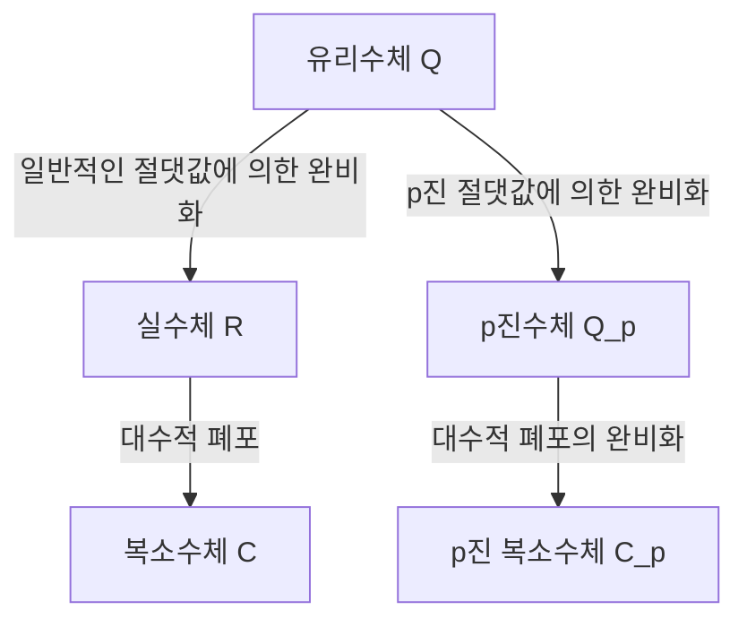

## 1. 서론

현대 정수론, 특히 대수적 정수론과 산술 기하학에서 **p진수** ( $p$-adic numbers )는 없어서는 안 될 도구입니다. 이 혁명적인 개념은 19세기 말 독일의 수학자 **[쿠르트 헨젤](https://kenji.blog/ko/p/hensel/)** ([Kurt Hensel](https://kenji.blog/ko/p/hensel/), 1861–1941)에 의해 도입되었습니다.

그의 발견은 수학에서 "국소적(local)" 관점과 "대역적(global)" 관점을 연결하는 가교 역할을 했으며, 20세기 수학에 패러다임의 전환을 가져왔습니다. 이 글에서는 [쿠르트 헨젤](https://kenji.blog/ko/p/hensel/)의 생애, 그의 가장 큰 업적인 **p진수** 의 발견, 그 수학적 기초, 그리고 현대 수학에 미친 지대한 영향에 대해 자세히 알아봅니다.

## 2. 뛰어난 가문과 초기 생애

[쿠르트 헨젤](https://kenji.blog/ko/p/hensel/)은 1861년 12월 29일 동프로이센의 쾨니히스베르크(현재 러시아 칼리닌그라드)에서 태어났습니다. 그의 가문은 독일의 지적, 예술적 역사에서 매우 중요한 위치를 차지하고 있습니다.

그의 할아버지는 유명한 화가 **빌헬름 헨젤** 이었고, 할머니는 뛰어난 피아니스트이자 작곡가인 **파니 멘델스존** (유명한 작곡가 펠릭스 멘델스존의 누나)이었습니다. 더 거슬러 올라가면 증조할아버지는 계몽주의를 대표하는 철학자 **모제스 멘델스존** 입니다. 이처럼 문화적, 지적으로 풍요로운 가정환경이 [쿠르트 헨젤](https://kenji.blog/ko/p/hensel/)의 자유롭고 창의적인 사고를 길러주었다고 할 수 있습니다.

그가 어렸을 때 가족은 베를린으로 이주했고, 그곳에서 그는 양질의 초등 및 중등 교육을 받았습니다. 수학에 대한 그의 재능은 일찍부터 꽃을 피웠고, 자연스럽게 대학에서 수학 연구의 길로 접어들게 되었습니다.

## 3. 대학 시절과 크로네커의 영향

헨젤은 본 대학과 베를린 대학에서 수학을 공부했습니다. 당시 베를린 대학은 수학 연구의 세계적인 중심지 중 하나였으며, **[카를 바이어슈트라스](https://kenji.blog/ko/p/weierstrass/)** (Karl Weierstrass)와 **[레오폴트 크로네커](/ko/p/kronecker/)** (Leopold [Kronecker](https://kenji.blog/ko/p/kronecker/))와 같은 거장들이 가르치고 있었습니다.

그 중에서도 헨젤에게 가장 깊은 영향을 미친 것은 크로네커였습니다. "신은 정수를 만들었고, 다른 모든 것은 인간이 만든 것이다"라는 그의 유명한 명언에서 알 수 있듯이, 크로네커는 모든 수학이 정수를 바탕으로 엄밀하게 재구성되어야 한다는 강한 신념을 가지고 있었습니다. 크로네커의 지도 아래 헨젤은 대수학과 정수론에 깊이 몰두했습니다.

1884년, 헨젤은 베를린 대학에서 박사 학위를 취득했습니다. 그의 박사 학위 논문 주제는 대수적 함수의 산술적 성질에 관한 것이었으며, 이는 훗날 **p진수** 발견을 위한 중요한 복선이 됩니다.

## 4. 함수와 수의 유사성

헨젤의 가장 큰 영감은 "수(대수적 정수)"와 "함수(대수적 함수)" 사이의 깊은 유사성(analogy)에서 나왔습니다.

19세기 후반, **리하르트 데데킨트** (Richard Dedekind)와 **하인리히 베버** (Heinrich Weber)는 대수적 수체와 대수적 함수체 사이에 놀라운 구조적 유사성이 있음을 보여주었습니다. 복소 평면 위의 함수는 테일러 전개나 로랑 전개와 같은 멱급수로 각 점 주위에서 국소적으로 표현될 수 있습니다.

헨젤은 스스로에게 질문했습니다. "만약 함수가 각 점 주위의 멱급수로 국소적으로 연구될 수 있다면, 유리수와 대수적 정수도 어떤 종류의 '점' 주위의 멱급수로 표현될 수 있지 않을까?"

수에서 "점"에 해당하는 것이 바로 **소수 $p$** 였습니다. 헨젤은 임의의 유리수를 소수 $p$ 를 밑으로 하는 급수로 표현한다는 혁신적인 아이디어에 도달했습니다.

## 5. p진수의 발견과 수학적 기초

1897년, 헨젤은 **p진수** ( $p$-adic numbers )의 개념을 세상에 처음으로 소개하는 획기적인 논문을 발표했습니다.

### 5.1 p진 부치와 p진 절댓값

보통 유리수체 $\mathbb{Q}$ 를 완비화하면 실수체 $\mathbb{R}$ 를 얻습니다. 이는 우리가 일상적으로 사용하는 "절댓값"에 기반한 거리 공간으로서의 완비화입니다. 그러나 헨젤은 소수 $p$ 에 초점을 맞춘 완전히 다른 거리 측정 방식을 도입했습니다.

임의의 0이 아닌 유리수 $x$ 는 주어진 소수 $p$ 를 사용하여 다음과 같이 유일하게 분해될 수 있습니다.

$$
x = p^v \frac{a}{b}
$$

여기서 $a$ 와 $b$ 는 $p$ 와 서로소인 정수이고, $v$ 는 정수입니다. 이 $v$ 를 $x$ 의 **p진 부치** 라 부르고 $v_p(x) = v$ 로 표기합니다. 또한, $x$ 의 **p진 절댓값** $|x|_p$ 은 다음과 같이 정의됩니다.

$$
|x|_p = p^{-v_p(x)} \quad \text{단, } |0|_p = 0
$$

이 새로운 절댓값은 일반적인 절댓값과 달리 강한 삼각 부등식(비아르키메데스 성질)을 만족합니다.

$$
|x + y|_p \le \max(|x|_p, |y|_p)
$$

### 5.2 유리수에서 p진수로의 완비화

이 p진 절댓값으로 정의되는 거리 $d(x, y) = |x - y|_p$ 를 사용하여 유리수체 $\mathbb{Q}$ 에 코시 수열의 완비화를 적용하여 얻은 새로운 수 체계가 바로 **p진수체** $\mathbb{Q}_p$ 입니다.

아래 다이어그램은 수 체계가 어떻게 분기하고 확장되는지를 보여줍니다.

### 5.3 p진수 전개의 구체적인 예

모든 p진 정수(p진 절댓값이 $1$ 이하인 원소들의 집합 $\mathbb{Z}_p$ )는 다음과 같이 무한 급수로 표현할 수 있습니다.

$$
x = a_0 + a_1 p + a_2 p^2 + a_3 p^3 + \dots = \sum_{i=0}^{\infty} a_i p^i
$$

(여기서 $0 \le a_i \le p-1$ )

예를 들어, $\mathbb{Z}_5$ ( $p=5$ )에서 $\frac{1}{3}$ 의 전개를 계산해 봅시다.
$\frac{1}{3} = a_0 + a_1 \cdot 5 + a_2 \cdot 5^2 + \dots$ 로 둡니다.
분모를 곱하면 $1 = 3(a_0 + a_1 \cdot 5 + a_2 \cdot 5^2 + \dots)$ 이 됩니다.

먼저 법 $5$ 에 대해 생각해보면:
$3 a_0 \equiv 1 \pmod 5$ 에서 $a_0 = 2$ 를 얻습니다.
이를 대입하고 계산을 계속하면:
$1 = 3(2 + 5x) \implies 1 = 6 + 15x \implies 15x = -5 \implies 3x = -1$ .
여기서 $x = a_1 + a_2 \cdot 5 + \dots$ 입니다.
다시 법 $5$ 에 대해 생각해보면:
$3 a_1 \equiv -1 \equiv 4 \pmod 5$ 에서 $a_1 = 3$ 을 얻습니다.
비슷하게 대입하면:
$3(3 + 5y) = -1 \implies 9 + 15y = -1 \implies 15y = -10 \implies 3y = -2$ .
$3 a_2 \equiv -2 \equiv 3 \pmod 5$ 에서 $a_2 = 1$ 을 얻습니다.
더 진행하면:
$3(1 + 5z) = -2 \implies 3 + 15z = -2 \implies 15z = -5 \implies 3z = -1$ .
이는 $3x = -1$ 과 같은 형태로 돌아가므로, 이후에는 수열 $3, 1$ 이 반복됩니다.

즉, 5진수에서의 전개는 다음과 같습니다.
$$
\frac{1}{3} = 2 + 3 \cdot 5 + 1 \cdot 5^2 + 3 \cdot 5^3 + 1 \cdot 5^4 + \dots
$$
이 무한합은 일반적인 의미에서는 발산하지만, p진 절댓값의 세계에서는 항이 진행될수록 값이 작아지기 때문에 모순 없이 완벽하게 수렴합니다.

## 6. 헨젤의 보조정리 ([Hensel](https://kenji.blog/ko/p/hensel/)'s Lemma)

헨젤이 제시한 가장 강력한 도구 중 하나는 **헨젤의 보조정리** 입니다. 이는 다항식 방정식이 p진수체 내에서 근을 가질 조건을 제공하는 정리이며, 실해석학에서의 "뉴턴 방법(Newton's method)"의 p진수 버전이라 할 수 있습니다.

정리의 내용은 다음과 같습니다.
정수 계수를 갖는 다항식 $f(x)$ 와 소수 $p$ 가 있다고 가정합시다. 만약 법 $p$ 에 대한 근삿값인 정수 $a$ 가 존재하고 그 미분값이 $0$ 이 아니라면, 즉

$$
f(a) \equiv 0 \pmod p \quad \text{그리고} \quad f'(a) \not\equiv 0 \pmod p
$$

가 성립한다면, $a$ 에서 출발하여 참된 근을 구성할 수 있으며,

$$
f(\alpha) = 0 \quad \text{그리고} \quad \alpha \equiv a \pmod p
$$

를 만족하는 $\alpha \in \mathbb{Z}_p$ 가 유일하게 존재합니다.
이 보조정리를 통해 합동 방정식의 해를 연속적으로 "들어올려(lifting)" p진수로서의 엄밀한 해를 찾는 것이 가능해졌습니다.

## 7. 오스트로프스키의 정리와 하세의 원리

헨젤의 개념은 다른 수학자들에 의해 더욱 다듬어졌습니다.

1916년, 알렉산더 오스트로프스키(Alexander Ostrowski)는 **오스트로프스키의 정리** 를 증명했습니다. 이는 "유리수체 위의 모든 자명하지 않은 절댓값은 일반적인 절댓값이거나 어떤 소수 $p$ 에 대한 p진 절댓값 중 하나와 동치이다"라는 놀라운 사실입니다. 이로써 실수와 모든 p진수를 모으면 유리수의 완비화 가능성을 "완벽하게 망라"하게 됩니다.

더 나아가 헨젤의 제자인 **[헬무트 하세](https://kenji.blog/ko/p/hasse/)** ([Helmut Hasse](https://kenji.blog/ko/p/hasse/))는 **국소-대역 원리** (하세의 원리)를 확립했습니다. 이는 "방정식이 유리수 범위에서(대역적으로) 해를 가질 필요충분조건은 그 방정식이 실수 및 모든 소수 $p$ 에 대한 p진수 범위에서(국소적으로) 해를 갖는 것이다"라는 아름다운 정리입니다. 이를 통해 p진수는 정수론에서 필수적인 도구로서 확고한 위치를 차지하게 되었습니다.

## 8. 교육자 및 편집자로서의 공헌과 유산

헨젤은 연구자로서뿐만 아니라 교육자이자 편집자로서도 엄청난 공헌을 했습니다. 1901년부터 수년 동안 그는 세계에서 가장 오래된 수학 학술지 중 하나인 '크렐레지(Crelle's Journal, 공식 명칭: 순수 및 응용 수학 잡지)'의 편집장을 역임하며 당시 최첨단 수학 연구의 확산을 지원했습니다.

그의 강의는 명쾌하고 열정적이었으며, [헬무트 하세](https://kenji.blog/ko/p/hasse/)를 비롯한 다음 세대의 뛰어난 수학자들을 길러냈습니다.

오늘날 p진수는 대수적 정수론을 넘어 **p진 해석학** , **p진 호지 이론** , 심지어 이론 물리학의 **p진 양자역학** 에 이르기까지 광범위한 분야에서 응용되고 있습니다. [앤드루 와일즈](https://kenji.blog/ko/p/wiles/)(Andrew Wiles)의 "[페르마의 마지막 정리](https://kenji.blog/ko/p/fermats-last-theorem/)"에 대한 역사적 증명 역시 p진수 이론 없이는 불가능했을 것입니다.

## 9. 결론

함수와 수 사이의 아름다운 유사성에서 출발하여 [쿠르트 헨젤](https://kenji.blog/ko/p/hensel/)은 **p진수** 를 통해 수학의 세계에 완전히 새로운 차원을 가져왔습니다. "국소적으로 살펴봄으로써 대역적인 것을 이해한다"는 그의 접근 방식은 20세기 이후 수학의 근본적인 철학 중 하나가 되었습니다.

그의 풍부하고 독창적인 아이디어는 오늘날에도 수와 자연의 진리를 탐구하는 전 세계의 수학자들에게 영감을 주고 있습니다.
