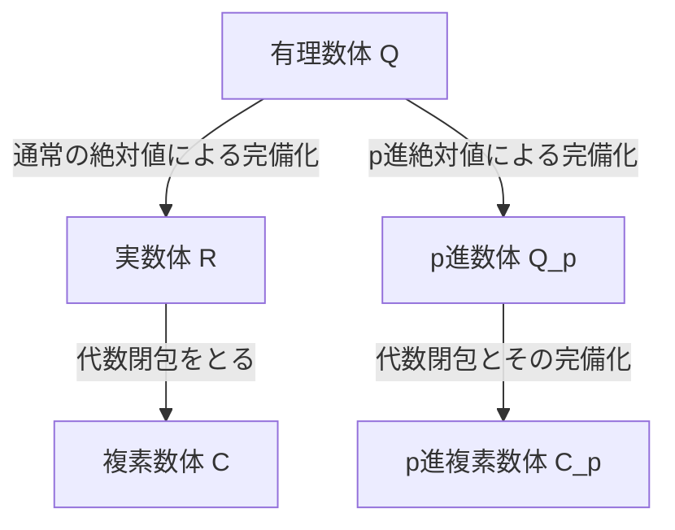

## 1. はじめに

現代の数論、特に代数的整数論や数論幾何学において **p進数** （ $p$-adic numbers ）は不可欠な道具です。この革新的な概念を19世紀末に導入したのが、ドイツの数学者 **[クルト・ヘンゼル](https://kenji.blog/p/hensel/)** （[Kurt Hensel](https://kenji.blog/p/hensel/), 1861–1941）です。

彼の発見は、数学における「局所的（local）」な視点と「大域的（global）」な視点を結びつける架け橋となり、20世紀の数学にパラダイムシフトをもたらしました。本記事では、[クルト・ヘンゼル](https://kenji.blog/p/hensel/)の生涯、彼の最大の業績である **p進数** の発見、その数学的基礎、そして現代数学に与えた多大な影響について詳細に解説します。

## 2. 類まれなる家系と生い立ち

[クルト・ヘンゼル](https://kenji.blog/p/hensel/)は1861年12月29日、東プロイセンのケーニヒスベルク（現在のロシア領カリーニングラード）で生まれました。彼の家系は、ドイツの知性と芸術の歴史において非常に重要な位置を占めています。

彼の祖父は有名な画家である **ヴィルヘルム・ヘンゼル** であり、祖母は卓越したピアニストであり作曲家でもあった **ファニー・メンデルスゾーン** （有名な作曲家フェリックス・メンデルスゾーンの姉）でした。さらに遡ると、曽祖父には啓蒙思想を代表する哲学者 **モーゼス・メンデルスゾーン** がいます。このような文化的・知的に豊かな家庭環境が、[クルト・ヘンゼル](https://kenji.blog/p/hensel/)の自由で創造的な思考を育んだと言えます。

彼が幼い頃、家族はベルリンに移り住み、そこで彼は質の高い初等・中等教育を受けました。数学に対する才能は早くから開花し、自然な流れで大学での数学研究の道へと進むことになります。

## 3. 大学時代とクロネッカーの影響

ヘンゼルはボン大学とベルリン大学で数学を学びました。当時のベルリン大学は、数学研究の世界的中心地のひとつであり、 **[カール・ワイエルシュトラス](https://kenji.blog/p/weierstrass/)** （[Karl Weierstrass](https://kenji.blog/p/weierstrass/)）や **レオポルト・クロネッカー** （Leopold Kronecker）といった巨匠たちが教鞭を執っていました。

中でもヘンゼルに最も深い影響を与えたのがクロネッカーでした。クロネッカーは「神は整数を創り給うた。その他のすべては人間の手によるものである」という名言で知られるように、すべての数学を整数を基盤として厳密に再構築すべきだという強い信念を持っていました。ヘンゼルはこのクロネッカーの指導のもと、代数学や数論に深く傾倒していきます。

1884年、ヘンゼルはベルリン大学で博士号を取得しました。彼の博士論文のテーマは代数関数の算術的性質に関するものであり、これが後の **p進数** の発見へと繋がる重要な伏線となります。

## 4. 関数と数のアナロジー

ヘンゼルの最大のインスピレーションは、「数（代数的整数）」と「関数（代数関数）」の間の深い類似性（アナロジー）から生まれました。

19世紀後半、 **リヒャルト・デデキント** （Richard Dedekind）と **ハインリヒ・ヴェーバー** （Heinrich Weber）は、代数体と代数関数体の間に驚くべき構造的類似があることを示していました。複素平面上の関数は、各点（局所）においてテイラー展開やローラン展開といったべき級数として表現できます。

ヘンゼルは次のように自問しました。「もし関数が各点周りのべき級数として局所的に調べられるのであれば、有理数や代数的整数も、ある種の『点』の周りでのべき級数として表現できないだろうか？」

数における「点」に相当するものが **素数** $p$ でした。ヘンゼルは、任意の有理数を素数 $p$ を基底とした級数として表現するという革新的なアイデアに至ったのです。

## 5. p進数の発見と数学的基礎

1897年、ヘンゼルは画期的な論文を発表し、 **p進数** （ $p$-adic numbers ）の概念を初めて世に問いました。

### 5.1 p進付値とp進絶対値

通常、有理数体 $\mathbb{Q}$ を完備化すると実数体 $\mathbb{R}$ が得られます。これは、私たちが日常的に使う「絶対値」に基づく距離空間としての完備化です。しかし、ヘンゼルは素数 $p$ に着目した全く異なる距離の測り方を導入しました。

任意のゼロでない有理数 $x$ は、与えられた素数 $p$ を用いて次のように一意に分解できます。

$$
x = p^v \frac{a}{b}
$$

ここで、 $a$ と $b$ は $p$ と互いに素な整数であり、 $v$ は整数です。この $v$ を $x$ の **p進付値** と呼び、 $v_p(x) = v$ と表します。さらに、 $x$ の **p進絶対値** $|x|_p$ を次のように定義します。

$$
|x|_p = p^{-v_p(x)} \quad \text{ただし } |0|_p = 0
$$

この新しい絶対値は、通常の絶対値とは異なり、強三角不等式（非[アルキメデス](https://kenji.blog/p/archimedes/)的性質）を満たします。

$$
|x + y|_p \le \max(|x|_p, |y|_p)
$$

### 5.2 有理数からp進数への完備化

このp進絶対値によって定義される距離 $d(x, y) = |x - y|_p$ を用いて、有理数体 $\mathbb{Q}$ にコーシー列の完備化を施して得られる新しい数体系が **p進数体** $\mathbb{Q}_p$ です。

以下の図は、数の体系がどのように分岐して拡張されるかを示しています。

### 5.3 p進数展開の具体例

すべてのp進整数（ $p$ 進絶対値が $1$ 以下の元の集合 $\mathbb{Z}_p$ ）は、以下のような無限級数として表現できます。

$$
x = a_0 + a_1 p + a_2 p^2 + a_3 p^3 + \dots = \sum_{i=0}^{\infty} a_i p^i
$$

（ここで $0 \le a_i \le p-1$ ）

例として、 $\mathbb{Z}_5$ （ $p=5$ ）における $\frac{1}{3}$ の展開を計算してみましょう。
$\frac{1}{3} = a_0 + a_1 \cdot 5 + a_2 \cdot 5^2 + \dots$ と置きます。
分母を払うと $1 = 3(a_0 + a_1 \cdot 5 + a_2 \cdot 5^2 + \dots)$ となります。

まず、法 $5$ で考えます：
$3 a_0 \equiv 1 \pmod 5$ より $a_0 = 2$ 。
これを代入して計算を進めると：
$1 = 3(2 + 5x) \implies 1 = 6 + 15x \implies 15x = -5 \implies 3x = -1$ 。
ここで $x = a_1 + a_2 \cdot 5 + \dots$ です。
再び法 $5$ で考えると：
$3 a_1 \equiv -1 \equiv 4 \pmod 5$ より $a_1 = 3$ 。
同様に代入すると：
$3(3 + 5y) = -1 \implies 9 + 15y = -1 \implies 15y = -10 \implies 3y = -2$ 。
$3 a_2 \equiv -2 \equiv 3 \pmod 5$ より $a_2 = 1$ 。
さらに進めると：
$3(1 + 5z) = -2 \implies 3 + 15z = -2 \implies 15z = -5 \implies 3z = -1$ 。
これは $3x = -1$ と同じ形に戻ったため、以降は $3, 1$ が繰り返されます。

つまり、5進数においては次のような展開になります。
$$
\frac{1}{3} = 2 + 3 \cdot 5 + 1 \cdot 5^2 + 3 \cdot 5^3 + 1 \cdot 5^4 + \dots
$$
この無限和は通常の意味では発散しますが、p進絶対値の世界では項が進むごとに値が小さくなるため、完全に収束し、矛盾なく成立します。

## 6. ヘンゼルの補題 (Hensel's Lemma)

ヘンゼルが示した最も強力なツールのひとつが **ヘンゼルの補題** です。これは、多項式の方程式がp進数体の中で根を持つための条件を与える定理であり、実解析における「[ニュートン](https://kenji.blog/p/newton/)法」のp進数版とも言えます。

定理の主張は以下の通りです。
整数を係数に持つ多項式 $f(x)$ と、素数 $p$ があるとします。もし、ある整数 $a$ が存在して、法 $p$ で近似根となり、かつ微分係数が $0$ でない、すなわち

$$
f(a) \equiv 0 \pmod p \quad \text{かつ} \quad f'(a) \not\equiv 0 \pmod p
$$

が成り立つならば、 $a$ から出発して真の根を構成でき、

$$
f(\alpha) = 0 \quad \text{かつ} \quad \alpha \equiv a \pmod p
$$

を満たす $\alpha \in \mathbb{Z}_p$ が一意に存在します。
この補題により、合同方程式の解を次々と「持ち上げて（lift）」いくことで、p進数としての厳密な解を見つけ出すことが可能になりました。

## 7. オストロフスキーの定理と[ハッセ](https://kenji.blog/p/hasse/)の原理

ヘンゼルの概念は、他の数学者たちによってさらに洗練されていきました。

1916年、アレクサンドル・オストロフスキーは **オストロフスキーの定理** を証明しました。これは、「有理数体上のすべての非自明な絶対値は、通常の絶対値か、ある素数 $p$ に対するp進絶対値のいずれかに同値である」という驚くべき事実です。これにより、実数とすべてのp進数を集めれば、有理数の完備化の可能性を「すべて網羅した」ことになります。

さらに、ヘンゼルの教え子である **ヘルムート・[ハッセ](https://kenji.blog/p/hasse/)** （[Helmut Hasse](https://kenji.blog/p/hasse/)）は、 **局所大域原理** （[ハッセ](https://kenji.blog/p/hasse/)の原理）を確立しました。これは、「ある方程式が有理数の範囲（大域的）で解を持つための必要十分条件は、それが実数およびすべての素数 $p$ についてのp進数（局所的）で解を持つことである」という美しい定理です。これにより、p進数は数論における必須の道具として不動の地位を築きました。

## 8. 教育者・編集者としての貢献と遺産

ヘンゼルは研究者としてだけでなく、教育者や編集者としても多大な貢献をしました。彼は1901年から長年にわたり、世界最古の数学専門誌のひとつである『クレレ誌（Crelle's Journal, 正式名称：純粋・応用数学雑誌）』の編集長を務め、当時の最先端の数学研究の発信を支えました。

また、彼の講義は明快で情熱的であり、ヘルムート・[ハッセ](https://kenji.blog/p/hasse/)をはじめとする次世代の優秀な数学者たちを育て上げました。

現在では、p進数は代数的整数論にとどまらず、 **p進解析** 、 **p進ホッジ理論** 、さらには理論物理学における **p進量子力学** など、広範な分野で応用されています。[アンドリュー・ワイルズ](https://kenji.blog/p/wiles/)による「[フェルマーの最終定理](https://kenji.blog/p/fermats-last-theorem/)」の歴史的証明も、p進数の理論なくしては不可能でした。

## 9. 結び

[クルト・ヘンゼル](https://kenji.blog/p/hensel/)は、関数と数の美しいアナロジーから出発し、数学の世界に **p進数** という全く新しい次元をもたらしました。彼の「局所的に見て大域を知る」というアプローチは、20世紀以降の数学の根本的な哲学の一つとなりました。

彼の豊かで独創的な発想は、今日もなお、自然界と数の真理を探求する世界中の数学者たちにインスピレーションを与え続けています。
