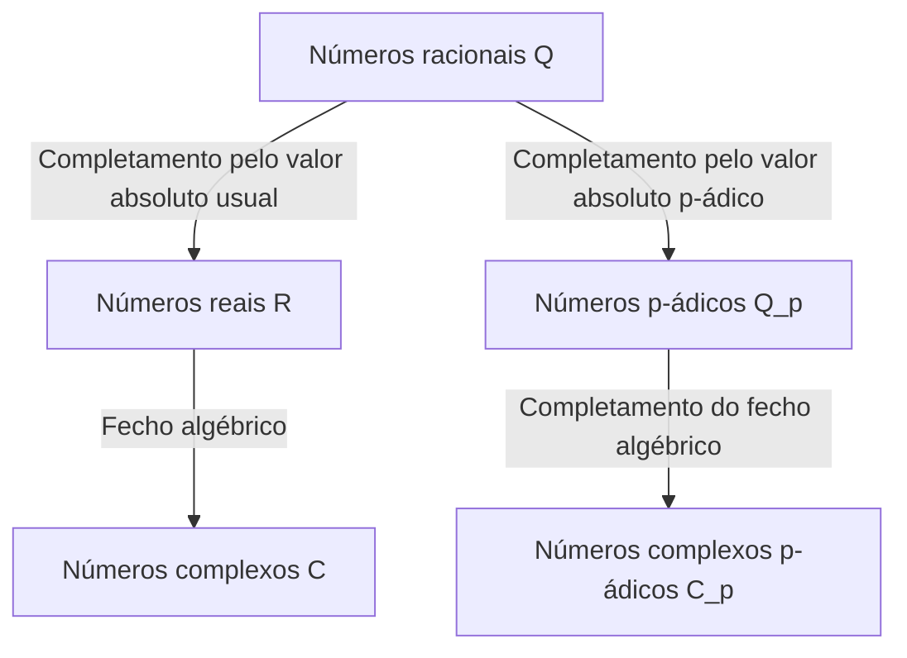

## 1. Introdução

Na teoria dos números moderna, particularmente na teoria algébrica dos números e na geometria aritmética, os **números p-ádicos** são uma ferramenta indispensável. Este conceito revolucionário foi introduzido no final do século XIX pelo matemático alemão **[Kurt Hensel](https://kenji.blog/pt/p/hensel/)** (1861–1941).

Sua descoberta serviu como uma ponte conectando as perspectivas "local" e "global" na matemática, provocando uma mudança de paradigma na matemática do século XX. Este artigo fornece uma exploração detalhada da vida de [Kurt Hensel](https://kenji.blog/pt/p/hensel/), sua maior conquista — a descoberta dos **números p-ádicos** —, seus fundamentos matemáticos e o profundo impacto que tiveram na matemática moderna.

## 2. Linhagem notável e início de vida

[Kurt Hensel](https://kenji.blog/pt/p/hensel/) nasceu em 29 de dezembro de 1861, em Königsberg, Prússia Oriental (agora Kaliningrado, Rússia). Sua família ocupa um lugar altamente significativo na história intelectual e artística da Alemanha.

Seu avô foi o famoso pintor **Wilhelm [Hensel](https://kenji.blog/pt/p/hensel/)**, e sua avó foi a excelente pianista e compositora **Fanny Mendelssohn** (irmã do famoso compositor Felix Mendelssohn). Indo mais atrás, seu bisavô foi o filósofo representativo do Iluminismo, **Moses Mendelssohn**. Pode-se dizer que esse ambiente familiar, culturalmente e intelectualmente rico, promoveu o pensamento livre e criativo de [Kurt Hensel](https://kenji.blog/pt/p/hensel/).

Quando era jovem, sua família mudou-se para Berlim, onde recebeu uma educação primária e secundária de alta qualidade. Seu talento para a matemática floresceu cedo, levando-o naturalmente ao caminho da pesquisa matemática na universidade.

## 3. Dias de universidade e a influência de [Kronecker](https://kenji.blog/pt/p/kronecker/)

[Hensel](https://kenji.blog/pt/p/hensel/) estudou matemática nas Universidades de Bonn e Berlim. Na época, a Universidade de Berlim era um dos centros mundiais de pesquisa matemática, com gigantes como **Karl Weierstrass** e **Leopold [Kronecker](https://kenji.blog/pt/p/kronecker/)** lecionando lá.

Entre eles, [Kronecker](https://kenji.blog/pt/p/kronecker/) teve a influência mais profunda sobre Hensel. Como se sabe por sua famosa citação: "Deus fez os números inteiros, tudo o mais é obra do homem", Kronecker mantinha uma forte crença de que toda a matemática deveria ser rigorosamente reconstruída com base nos números inteiros. Sob a orientação de Kronecker, [Hensel](https://kenji.blog/pt/p/hensel/) dedicou-se profundamente à álgebra e à teoria dos números.

Em 1884, [Hensel](https://kenji.blog/pt/p/hensel/) obteve seu doutorado na Universidade de Berlim. O tema de sua tese de doutorado foi sobre as propriedades aritméticas das funções algébricas, o que serviria como um importante prenúncio de sua posterior descoberta dos **números p-ádicos**.

## 4. Analogia entre funções e números

A maior inspiração de [Hensel](https://kenji.blog/pt/p/hensel/) veio da profunda analogia entre "números" (inteiros algébricos) e "funções" (funções algébricas).

No final do século XIX, **Richard Dedekind** e **Heinrich Weber** mostraram que havia uma surpreendente semelhança estrutural entre corpos de números algébricos e corpos de funções algébricas. Uma função no plano complexo pode ser representada localmente em torno de cada ponto como uma série de potências, como uma expansão de Taylor ou Laurent.

[Hensel](https://kenji.blog/pt/p/hensel/) se perguntou: "Se uma função pode ser estudada localmente como uma série de potências em torno de cada ponto, os números racionais e os inteiros algébricos não poderiam também ser representados como séries de potências em torno de algum tipo de 'ponto'?"

O equivalente de um "ponto" nos números era um **número primo $p$**. [Hensel](https://kenji.blog/pt/p/hensel/) chegou à ideia inovadora de expressar qualquer número racional como uma série com um número primo $p$ como base.

## 5. Descoberta dos números p-ádicos e fundamentos matemáticos

Em 1897, [Hensel](https://kenji.blog/pt/p/hensel/) publicou um artigo inovador introduzindo o conceito de **números p-ádicos** ao mundo pela primeira vez.

### 5.1 Valorização p-ádica e valor absoluto

Normalmente, o completamento do corpo dos números racionais $\mathbb{Q}$ produz o corpo dos números reais $\mathbb{R}$. Este é um completamento como um espaço métrico baseado no "valor absoluto" que usamos diariamente. No entanto, [Hensel](https://kenji.blog/pt/p/hensel/) introduziu uma maneira inteiramente diferente de medir a distância focada em um número primo $p$.

Qualquer número racional diferente de zero $x$ pode ser decomposto unicamente usando um dado número primo $p$ da seguinte forma:

$$
x = p^v \frac{a}{b}
$$

Aqui, $a$ e $b$ são inteiros coprimos de $p$, e $v$ é um inteiro. Este $v$ é chamado de **valorização p-ádica** de $x$, denotada como $v_p(x) = v$. Além disso, o **valor absoluto p-ádico** $|x|_p$ de $x$ é definido da seguinte forma:

$$
|x|_p = p^{-v_p(x)} \quad \text{onde } |0|_p = 0
$$

Este novo valor absoluto, diferentemente do usual, satisfaz a forte desigualdade triangular (propriedade não-arquimediana):

$$
|x + y|_p \le \max(|x|_p, |y|_p)
$$

### 5.2 Completamento dos números racionais aos números p-ádicos

Usando a distância $d(x, y) = |x - y|_p$ definida por este valor absoluto p-ádico, o novo sistema numérico obtido pela aplicação do completamento de sequência de [Cauchy](https://kenji.blog/pt/p/cauchy/) ao corpo dos números racionais $\mathbb{Q}$ é o **corpo dos números p-ádicos** $\mathbb{Q}_p$.

O diagrama abaixo ilustra como os sistemas numéricos se ramificam e se expandem.

### 5.3 Exemplo concreto de expansão p-ádica

Todo inteiro p-ádico (o conjunto $\mathbb{Z}_p$ de elementos cujo valor absoluto p-ádico é menor ou igual a $1$) pode ser expresso como uma série infinita da seguinte forma:

$$
x = a_0 + a_1 p + a_2 p^2 + a_3 p^3 + \dots = \sum_{i=0}^{\infty} a_i p^i
$$

(onde $0 \le a_i \le p-1$)

Como exemplo, vamos calcular a expansão de $\frac{1}{3}$ em $\mathbb{Z}_5$ ($p=5$).
Seja $\frac{1}{3} = a_0 + a_1 \cdot 5 + a_2 \cdot 5^2 + \dots$
Multiplicando pelo denominador dá $1 = 3(a_0 + a_1 \cdot 5 + a_2 \cdot 5^2 + \dots)$.

Primeiro, considerando o módulo $5$:
De $3 a_0 \equiv 1 \pmod 5$, obtemos $a_0 = 2$.
Substituindo isso e continuando o cálculo:
$1 = 3(2 + 5x) \implies 1 = 6 + 15x \implies 15x = -5 \implies 3x = -1$.
Aqui $x = a_1 + a_2 \cdot 5 + \dots$
Considerando o módulo $5$ novamente:
De $3 a_1 \equiv -1 \equiv 4 \pmod 5$, obtemos $a_1 = 3$.
Substituindo de forma semelhante:
$3(3 + 5y) = -1 \implies 9 + 15y = -1 \implies 15y = -10 \implies 3y = -2$.
De $3 a_2 \equiv -2 \equiv 3 \pmod 5$, obtemos $a_2 = 1$.
Prosseguindo:
$3(1 + 5z) = -2 \implies 3 + 15z = -2 \implies 15z = -5 \implies 3z = -1$.
Como isso retorna à mesma forma que $3x = -1$, a sequência $3, 1$ repete a partir daí.

Em outras palavras, a expansão em números 5-ádicos é a seguinte:
$$
\frac{1}{3} = 2 + 3 \cdot 5 + 1 \cdot 5^2 + 3 \cdot 5^3 + 1 \cdot 5^4 + \dots
$$
Esta soma infinita diverge no sentido usual, mas no mundo dos valores absolutos p-ádicos, os termos tornam-se menores à medida que progridem, o que significa que ela converge perfeitamente sem contradição.

## 6. Lema de [Hensel](https://kenji.blog/pt/p/hensel/)

Uma das ferramentas mais poderosas apresentadas por [Hensel](https://kenji.blog/pt/p/hensel/) é o **Lema de [Hensel](https://kenji.blog/pt/p/hensel/)**. Este é um teorema que fornece as condições para uma equação polinomial ter raízes no corpo dos números p-ádicos, e pode ser descrito como a versão p-ádica do "método de Newton" em análise real.

A afirmação do teorema é a seguinte.
Suponha que tenhamos um polinômio $f(x)$ com coeficientes inteiros e um número primo $p$. Se existe um inteiro $a$ que é uma raiz aproximada módulo $p$, e sua derivada não é $0$, isto é,

$$
f(a) \equiv 0 \pmod p \quad \text{e} \quad f'(a) \not\equiv 0 \pmod p
$$

são verdadeiros, então podemos construir uma verdadeira raiz começando por $a$, e existe unicamente $\alpha \in \mathbb{Z}_p$ satisfazendo

$$
f(\alpha) = 0 \quad \text{e} \quad \alpha \equiv a \pmod p
$$

Este lema possibilitou encontrar soluções exatas como números p-ádicos "elevando" (lifting) sucessivamente soluções de equações de congruência.

## 7. Teorema de Ostrowski e o Princípio Local-Global

Os conceitos de [Hensel](https://kenji.blog/pt/p/hensel/) foram ainda mais refinados por outros matemáticos.

Em 1916, Alexander Ostrowski provou o **Teorema de Ostrowski**. Este é o fato surpreendente de que "todo valor absoluto não-trivial no corpo dos números racionais é equivalente ou ao valor absoluto usual ou ao valor absoluto p-ádico para algum número primo $p$". Assim, reunir os números reais e todos os números p-ádicos "cobre exaustivamente" todas as possibilidades de completar os números racionais.

Além disso, o estudante de [Hensel](https://kenji.blog/pt/p/hensel/), **[Helmut Hasse](https://kenji.blog/pt/p/hasse/)**, estabeleceu o **Princípio Local-Global** (Princípio de Hasse). Este é um belo teorema que afirma que "uma condição necessária e suficiente para uma equação ter uma solução sobre os números racionais (globalmente) é que ela tenha uma solução sobre os números reais e os números p-ádicos para todos os primos $p$ (localmente)". Com isso, os números p-ádicos garantiram uma posição inabalável como ferramentas essenciais na teoria dos números.

## 8. Contribuições como educador e editor, e legado

[Hensel](https://kenji.blog/pt/p/hensel/) fez tremendas contribuições não apenas como pesquisador, mas também como educador e editor. A partir de 1901, por muitos anos, atuou como editor-chefe do "Crelle's Journal" (oficialmente: Journal für die reine und angewandte Mathematik), um dos jornais de matemática mais antigos do mundo, apoiando a disseminação de pesquisas matemáticas de ponta de seu tempo.

Suas palestras eram claras e apaixonadas, nutrindo a próxima geração de matemáticos brilhantes, incluindo [Helmut Hasse](https://kenji.blog/pt/p/hasse/).

Hoje, os números p-ádicos são aplicados em uma ampla gama de campos além da teoria algébrica dos números, incluindo a **análise p-ádica**, a **teoria de Hodge p-ádica**, e até a **mecânica quântica p-ádica** na física teórica. A prova histórica do "Último Teorema de [Fermat](https://kenji.blog/pt/p/fermat/)" por [Andrew Wiles](https://kenji.blog/pt/p/wiles/) teria sido impossível sem a teoria dos números p-ádicos.

## 9. Conclusão

Partindo da bela analogia entre funções e números, [Kurt Hensel](https://kenji.blog/pt/p/hensel/) trouxe uma dimensão inteiramente nova ao mundo da matemática com os **números p-ádicos**. Sua abordagem de "entender o global olhando localmente" tornou-se uma das filosofias fundamentais da matemática do século XX em diante.

Suas ideias ricas e originais continuam a inspirar matemáticos de todo o mundo que buscam hoje as verdades dos números e do mundo natural.
