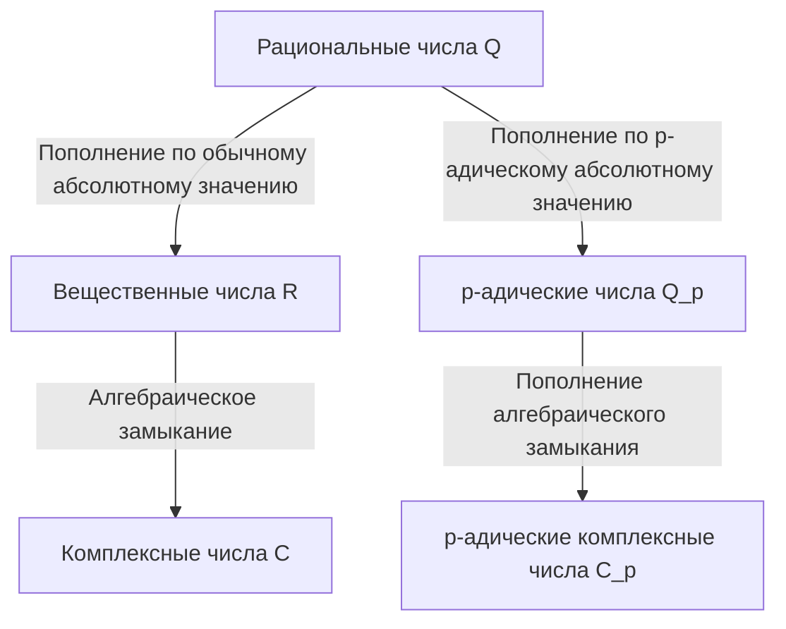

## 1. Введение

В современной теории чисел, особенно в алгебраической теории чисел и арифметической геометрии, **p-адические числа** являются незаменимым инструментом. Эта революционная концепция была введена в конце 19-го века немецким математиком **Куртом Гензелем** (1861–1941).

Его открытие послужило мостом, соединяющим «локальные» и «глобальные» перспективы в математике, вызвав смену парадигмы в математике 20-го века. Эта статья представляет собой детальное исследование жизни Курта Гензеля, его величайшего достижения — открытия **p-адических чисел**, — их математических основ и глубокого влияния, которое они оказали на современную математику.

## 2. Замечательная родословная и ранние годы

[Курт Гензель](https://kenji.blog/p/hensel/) родился 29 декабря 1861 года в Кёнигсберге, Восточная Пруссия (ныне Калининград, Россия). Его семья занимает весьма значительное место в интеллектуальной и художественной истории Германии.

Его дедом был знаменитый художник **Вильгельм Гензель**, а бабушкой — выдающаяся пианистка и композитор **Фанни Мендельсон** (сестра знаменитого композитора Феликса Мендельсона). Возвращаясь еще дальше в прошлое, его прадедом был философ-просветитель **Мозес Мендельсон**. Можно сказать, что эта культурно и интеллектуально богатая семейная среда способствовала свободному и творческому мышлению Курта Гензеля.

Когда он был молод, его семья переехала в Берлин, где он получил высококачественное начальное и среднее образование. Его талант к математике расцвел рано, естественно направив его на путь математических исследований в университете.

## 3. Университетские годы и влияние Кронекера

Гензель изучал математику в университетах Бонна и Берлина. В то время Берлинский университет был одним из мировых центров математических исследований, где преподавали такие гиганты, как **[Карл Вейерштрасс](https://kenji.blog/p/weierstrass/)** и **Леопольд Кронекер**.

Среди них именно Кронекер оказал наиболее глубокое влияние на Гензеля. Как известно из его знаменитой цитаты: «Бог создал целые числа, всё остальное — дело рук человека», Кронекер твердо верил, что вся математика должна быть строго перестроена на основе целых чисел. Под руководством Кронекера Гензель глубоко посвятил себя алгебре и теории чисел.

В 1884 году Гензель получил докторскую степень в Берлинском университете. Тема его докторской диссертации касалась арифметических свойств алгебраических функций, что послужило важным предвестником его будущего открытия **p-адических чисел**.

## 4. Аналогия между функциями и числами

Самое большое вдохновение Гензель черпал из глубокой аналогии между «числами» (алгебраическими целыми числами) и «функциями» (алгебраическими функциями).

В конце 19-го века **Рихард Дедекинд** и **Генрих Вебер** показали, что существует удивительное структурное сходство между полями алгебраических чисел и полями алгебраических функций. Функция на комплексной плоскости может быть локально представлена вокруг каждой точки в виде степенного ряда, такого как разложение Тейлора или Лорана.

Гензель задался вопросом: «Если функцию можно локально исследовать как степенной ряд вокруг каждой точки, не могут ли рациональные числа и алгебраические целые числа также быть представлены как степенные ряды вокруг некой "точки"?»

Эквивалентом «точки» в числах было **простое число $p$**. Гензель пришел к новаторской идее выразить любое рациональное число в виде ряда с простым числом $p$ в качестве основания.

## 5. Открытие p-адических чисел и математические основы

В 1897 году Гензель опубликовал новаторскую статью, впервые представив миру концепцию **p-адических чисел**.

### 5.1 p-адическое нормирование и абсолютное значение

Обычно пополнение поля рациональных чисел $\mathbb{Q}$ дает поле вещественных чисел $\mathbb{R}$. Это пополнение как метрического пространства, основанное на «абсолютном значении», которое мы используем повседневно. Однако Гензель ввел совершенно иной способ измерения расстояния, ориентированный на простое число $p$.

Любое ненулевое рациональное число $x$ можно однозначно разложить с использованием заданного простого числа $p$ следующим образом:

$$
x = p^v \frac{a}{b}
$$

Здесь $a$ и $b$ — целые числа, взаимно простые с $p$, а $v$ — целое число. Это $v$ называется **p-адическим нормированием** числа $x$, обозначаемым как $v_p(x) = v$. Кроме того, **p-адическое абсолютное значение** $|x|_p$ числа $x$ определяется следующим образом:

$$
|x|_p = p^{-v_p(x)} \quad \text{где } |0|_p = 0
$$

Это новое абсолютное значение, в отличие от обычного, удовлетворяет строгому неравенству треугольника (неархимедово свойство):

$$
|x + y|_p \le \max(|x|_p, |y|_p)
$$

### 5.2 Пополнение от рациональных к p-адическим числам

Используя расстояние $d(x, y) = |x - y|_p$, определяемое этим p-адическим абсолютным значением, новая числовая система, полученная путем применения пополнения последовательностей Коши к полю рациональных чисел $\mathbb{Q}$, является **полем p-адических чисел** $\mathbb{Q}_p$.

Диаграмма ниже иллюстрирует, как числовые системы ветвятся и расширяются.

### 5.3 Конкретный пример p-адического разложения

Любое p-адическое целое число (множество $\mathbb{Z}_p$ элементов, чье p-адическое абсолютное значение меньше или равно $1$) может быть выражено в виде бесконечного ряда следующим образом:

$$
x = a_0 + a_1 p + a_2 p^2 + a_3 p^3 + \dots = \sum_{i=0}^{\infty} a_i p^i
$$

(где $0 \le a_i \le p-1$)

В качестве примера давайте вычислим разложение $\frac{1}{3}$ в $\mathbb{Z}_5$ ($p=5$).
Пусть $\frac{1}{3} = a_0 + a_1 \cdot 5 + a_2 \cdot 5^2 + \dots$
Умножение на знаменатель дает $1 = 3(a_0 + a_1 \cdot 5 + a_2 \cdot 5^2 + \dots)$.

Сначала рассмотрим по модулю $5$:
Из $3 a_0 \equiv 1 \pmod 5$ мы получаем $a_0 = 2$.
Подставляя это и продолжая вычисления:
$1 = 3(2 + 5x) \implies 1 = 6 + 15x \implies 15x = -5 \implies 3x = -1$.
Здесь $x = a_1 + a_2 \cdot 5 + \dots$
Снова рассматривая по модулю $5$:
Из $3 a_1 \equiv -1 \equiv 4 \pmod 5$ мы получаем $a_1 = 3$.
Подставляя аналогичным образом:
$3(3 + 5y) = -1 \implies 9 + 15y = -1 \implies 15y = -10 \implies 3y = -2$.
Из $3 a_2 \equiv -2 \equiv 3 \pmod 5$ мы получаем $a_2 = 1$.
Продолжая дальше:
$3(1 + 5z) = -2 \implies 3 + 15z = -2 \implies 15z = -5 \implies 3z = -1$.
Поскольку это возвращается к той же форме, что и $3x = -1$, последовательность $3, 1$ повторяется в дальнейшем.

Другими словами, разложение в 5-адических числах выглядит следующим образом:
$$
\frac{1}{3} = 2 + 3 \cdot 5 + 1 \cdot 5^2 + 3 \cdot 5^3 + 1 \cdot 5^4 + \dots
$$
Эта бесконечная сумма расходится в обычном смысле, но в мире p-адических абсолютных значений члены становятся меньше по мере их продвижения, что означает, что она сходится идеально без противоречий.

## 6. Лемма Гензеля

Одним из самых мощных инструментов, представленных Гензелем, является **Лемма Гензеля**. Это теорема, которая обеспечивает условия для того, чтобы полиномиальное уравнение имело корни в поле p-адических чисел, и ее можно описать как p-адическую версию «метода Ньютона» в вещественном анализе.

Утверждение теоремы заключается в следующем.
Предположим, у нас есть многочлен $f(x)$ с целыми коэффициентами и простое число $p$. Если существует целое число $a$, которое является приближенным корнем по модулю $p$, и его производная не равна $0$, то есть

$$
f(a) \equiv 0 \pmod p \quad \text{и} \quad f'(a) \not\equiv 0 \pmod p
$$

выполняются, то мы можем построить истинный корень, начиная с $a$, и однозначно существует $\alpha \in \mathbb{Z}_p$, удовлетворяющее

$$
f(\alpha) = 0 \quad \text{и} \quad \alpha \equiv a \pmod p
$$

Эта лемма позволила находить точные решения в виде p-адических чисел путем последовательного «поднятия» (lifting) решений уравнений сравнения.

## 7. Теорема Островского и локально-глобальный принцип

Концепции Гензеля были в дальнейшем усовершенствованы другими математиками.

В 1916 году Александр Островский доказал **теорему Островского**. Это удивительный факт, что «каждое нетривиальное абсолютное значение на поле рациональных чисел эквивалентно либо обычному абсолютному значению, либо p-адическому абсолютному значению для некоторого простого числа $p$». Таким образом, объединение вещественных чисел и всех p-адических чисел «исчерпывающе покрывает» все возможности пополнения рациональных чисел.

Кроме того, ученик Гензеля, **[Гельмут Хассе](https://kenji.blog/p/hasse/)**, установил **локально-глобальный принцип** (принцип Хассе). Это красивая теорема, утверждающая, что «необходимым и достаточным условием для того, чтобы уравнение имело решение над рациональными числами (глобально), является наличие решения над вещественными числами и p-адическими числами для всех простых $p$ (локально)». Благодаря этому p-адические числа заняли непоколебимую позицию в качестве важнейших инструментов в теории чисел.

## 8. Вклад как преподавателя и редактора, и наследие

Гензель внес огромный вклад не только как исследователь, но и как преподаватель и редактор. С 1901 года на протяжении многих лет он служил главным редактором «Журнала Крелле» (официально: Journal für die reine und angewandte Mathematik), одного из старейших математических журналов в мире, поддерживая распространение передовых математических исследований своего времени.

Его лекции были ясными и страстными, воспитывая следующее поколение блестящих математиков, в том числе Гельмута Хассе.

Сегодня p-адические числа применяются в широком спектре областей за пределами алгебраической теории чисел, включая **p-адический анализ**, **p-адическую теорию Ходжа** и даже **p-адическую квантовую механику** в теоретической физике. Историческое доказательство «Великой теоремы Ферма» [Эндрю Уайлс](https://kenji.blog/p/wiles/)ом было бы невозможно без теории p-адических чисел.

## 9. Заключение

Исходя из красивой аналогии между функциями и числами, [Курт Гензель](https://kenji.blog/p/hensel/) привнес в мир математики совершенно новое измерение с помощью **p-адических чисел**. Его подход к «пониманию глобального через рассмотрение локального» стал одной из фундаментальных философий математики, начиная с 20-го века.

Его богатые и оригинальные идеи продолжают вдохновлять математиков всего мира, ищущих сегодня истины о числах и мире природы.
