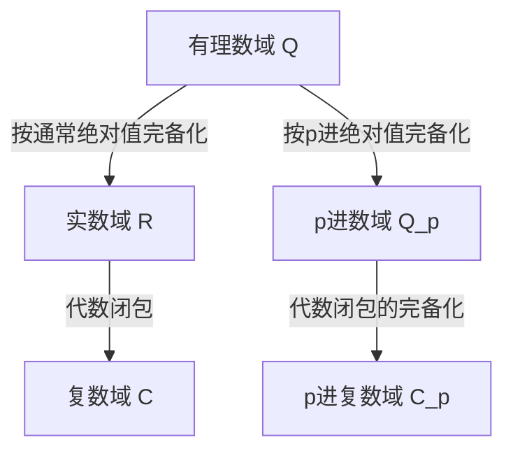

## 1. 引言

在现代数论，特别是代数数论和算术几何中， **p进数** ( $p$-adic numbers )是不可或缺的工具。这个革命性的概念是在19世纪末由德国数学家 **[库尔特·亨泽尔](https://kenji.blog/zh-cn/p/hensel/)** ([Kurt Hensel](https://kenji.blog/zh-cn/p/hensel/), 1861–1941)引入的。

他的发现犹如一座桥梁，连接了数学中“局部”(local)与“全局”(global)的观点，为20世纪的数学带来了范式转变。本文将详细探讨[库尔特·亨泽尔](https://kenji.blog/zh-cn/p/hensel/)的一生，他最伟大的成就—— **p进数** 的发现，其数学基础，以及它们对现代数学产生的深远影响。

## 2. 显赫的家族与早年生活

[库尔特·亨泽尔](https://kenji.blog/zh-cn/p/hensel/)于1861年12月29日出生在东普鲁士的柯尼斯堡（现俄罗斯加里宁格勒）。他的家族在德国的知识界和艺术史上占有极为重要的地位。

他的祖父是著名的画家 **威廉·亨泽尔** ，他的祖母是杰出的钢琴家和作曲家 **范妮·门德尔松** （著名作曲家费利克斯·门德尔松的姐姐）。再往前追溯，他的曾祖父是启蒙运动的代表性哲学家 **摩西·门德尔松** 。可以说，正是这种文化和知识底蕴深厚的家庭环境，培养了[库尔特·亨泽尔](https://kenji.blog/zh-cn/p/hensel/)自由而富有创造力的思想。

他年轻时随家人移居柏林，在那里接受了高质量的中小学教育。他在数学方面的天赋很早就展现出来，这自然而然地引领他走上了大学的数学研究之路。

## 3. 大学时代与克罗内克的影响

亨泽尔曾在波恩大学和柏林大学学习数学。当时的柏林大学是世界数学研究的中心之一，汇聚了 **[卡尔·魏尔斯特拉斯](https://kenji.blog/zh-cn/p/weierstrass/)** (Karl Weierstrass)和 **[利奥波德·克罗内克](/zh-cn/p/kronecker/)** (Leopold [Kronecker](https://kenji.blog/zh-cn/p/kronecker/))等巨匠在此任教。

在这些人中，克罗内克对亨泽尔的影响最深。正如他的一句名言所说：“上帝创造了整数，其余的都是人类的工作”，克罗内克坚信所有的数学都应该严格地建立在整数的基础上。在克罗内克的指导下，亨泽尔全身心地投入到代数和数论的研究中。

1884年，亨泽尔获得了柏林大学的博士学位。他的博士论文主题是关于代数函数的算术性质，这也为他后来发现 **p进数** 埋下了重要的伏笔。

## 4. 函数与数之间的类比

亨泽尔最大的灵感来自于“数”（代数整数）与“函数”（代数函数）之间深刻的类比(analogy)。

在19世纪后期， **理查德·戴德金** (Richard Dedekind)和 **海因里希·韦伯** (Heinrich Weber)已经证明，代数数域和代数函数域之间存在着惊人的结构相似性。复平面上的函数可以在每一点的局部展开为幂级数，例如泰勒展开或洛朗展开。

亨泽尔问自己：“如果一个函数可以在每一点附近作为幂级数进行局部研究，那么有理数和代数整数是否也可以在某种‘点’附近表示为幂级数呢？”

在数中等同于“点”的概念就是 **素数 $p$** 。亨泽尔由此提出了一个创新的想法：将任何有理数表示为以素数 $p$ 为底的级数。

## 5. p进数的发现与数学基础

1897年，亨泽尔发表了一篇开创性的论文，首次向世界介绍了 **p进数** ( $p$-adic numbers )的概念。

### 5.1 p进赋值与绝对值

通常，有理数域 $\mathbb{Q}$ 的完备化会得到实数域 $\mathbb{R}$ 。这是基于我们日常使用的“绝对值”作为度量空间的完备化。然而，亨泽尔引入了一种完全不同的测量距离的方法，这种方法以素数 $p$ 为核心。

任何非零有理数 $x$ 都可以使用给定的素数 $p$ 唯一地分解如下：

$$
x = p^v \frac{a}{b}
$$

这里， $a$ 和 $b$ 是与 $p$ 互素的整数， $v$ 是一个整数。这个 $v$ 被称为 $x$ 的 **p进赋值** ，记作 $v_p(x) = v$ 。此外， $x$ 的 **p进绝对值** $|x|_p$ 定义如下：

$$
|x|_p = p^{-v_p(x)} \quad \text{其中 } |0|_p = 0
$$

这个新的绝对值与通常的绝对值不同，它满足强三角不等式（非阿基米德性质）：

$$
|x + y|_p \le \max(|x|_p, |y|_p)
$$

### 5.2 从有理数到p进数的完备化

利用由这个p进绝对值定义的距离 $d(x, y) = |x - y|_p$ ，通过对有理数域 $\mathbb{Q}$ 应用柯西序列完备化所得到的新数系就是 **p进数域** $\mathbb{Q}_p$ 。

下图展示了数系是如何分支和扩展的。

### 5.3 p进展开的具体例子

每一个p进整数（p进绝对值小于或等于 $1$ 的元素的集合 $\mathbb{Z}_p$ ）都可以表示为如下的无穷级数：

$$
x = a_0 + a_1 p + a_2 p^2 + a_3 p^3 + \dots = \sum_{i=0}^{\infty} a_i p^i
$$

（其中 $0 \le a_i \le p-1$ ）

作为一个例子，让我们计算 $\frac{1}{3}$ 在 $\mathbb{Z}_5$ （ $p=5$ ）中的展开。
令 $\frac{1}{3} = a_0 + a_1 \cdot 5 + a_2 \cdot 5^2 + \dots$
去分母得到 $1 = 3(a_0 + a_1 \cdot 5 + a_2 \cdot 5^2 + \dots)$ 。

首先，考虑模 $5$ ：
由 $3 a_0 \equiv 1 \pmod 5$ ，我们得到 $a_0 = 2$ 。
代入此值并继续计算：
$1 = 3(2 + 5x) \implies 1 = 6 + 15x \implies 15x = -5 \implies 3x = -1$ 。
这里 $x = a_1 + a_2 \cdot 5 + \dots$
再次考虑模 $5$ ：
由 $3 a_1 \equiv -1 \equiv 4 \pmod 5$ ，我们得到 $a_1 = 3$ 。
类似地代入：
$3(3 + 5y) = -1 \implies 9 + 15y = -1 \implies 15y = -10 \implies 3y = -2$ 。
由 $3 a_2 \equiv -2 \equiv 3 \pmod 5$ ，我们得到 $a_2 = 1$ 。
进一步计算：
$3(1 + 5z) = -2 \implies 3 + 15z = -2 \implies 15z = -5 \implies 3z = -1$ 。
由于这又回到了与 $3x = -1$ 相同的形式，序列 $3, 1$ 从此开始循环。

换句话说，5进数中的展开式如下：
$$
\frac{1}{3} = 2 + 3 \cdot 5 + 1 \cdot 5^2 + 3 \cdot 5^3 + 1 \cdot 5^4 + \dots
$$
这个无穷和在通常意义上是发散的，但在p进绝对值的世界里，各项随着级数的推进变得越来越小，这意味着它完美地收敛，没有任何矛盾。

## 6. 亨泽尔引理 ([Hensel](https://kenji.blog/zh-cn/p/hensel/)'s Lemma)

亨泽尔提出的最强大的工具之一是 **亨泽尔引理** 。这个定理提供了多项式方程在p进数域内存在根的条件，它可以被描述为实分析中“牛顿法”的p进版本。

该定理的断言如下。
假设我们有一个整系数多项式 $f(x)$ 和一个素数 $p$ 。如果存在一个整数 $a$ ，它是模 $p$ 的近似根，并且它的导数不为 $0$ ，也就是说，

$$
f(a) \equiv 0 \pmod p \quad \text{且} \quad f'(a) \not\equiv 0 \pmod p
$$

成立，那么我们可以从 $a$ 出发构造一个真正的根，并且唯一存在 $\alpha \in \mathbb{Z}_p$ 满足

$$
f(\alpha) = 0 \quad \text{且} \quad \alpha \equiv a \pmod p
$$

这个引理使得通过连续地“提升(lifting)”同余方程的解来找到作为p进数的精确解成为可能。

## 7. 奥斯特洛夫斯基定理与局部-全局原则

亨泽尔的概念被其他数学家进一步完善。

1916年，亚历山大·奥斯特洛夫斯基证明了 **奥斯特洛夫斯基定理** 。这是一个令人惊讶的事实，即“有理数域上的每一个非平凡绝对值，要么等价于通常的绝对值，要么等价于某个素数 $p$ 的p进绝对值”。因此，将实数和所有的p进数聚集在一起，就“穷尽”了有理数完备化的所有可能性。

此外，亨泽尔的学生 **[赫尔穆特·哈塞](https://kenji.blog/zh-cn/p/hasse/)** ([Helmut Hasse](https://kenji.blog/zh-cn/p/hasse/))确立了 **局部-全局原则** （哈塞原则）。这是一个美丽的定理，它指出“一个方程在有理数上（全局地）有解的充分必要条件是，它在实数以及所有素数 $p$ 的p进数上（局部地）都有解。”借此，p进数确立了其作为数论中不可或缺工具的不可动摇的地位。

## 8. 作为教育家和编辑的贡献与遗产

亨泽尔不仅作为一名研究人员，而且作为一名教育家和编辑，都做出了巨大的贡献。从1901年起，他担任了世界上最古老的数学期刊之一《克雷勒杂志》（全称：纯粹与应用数学杂志）的主编长达数十年，支持了他那个时代最前沿数学研究的传播。

他的讲课清晰而充满激情，培养了包括[赫尔穆特·哈塞](https://kenji.blog/zh-cn/p/hasse/)在内的下一代杰出数学家。

如今，p进数被广泛应用于代数数论以外的领域，包括 **p进分析** 、 **p进霍奇理论** ，甚至理论物理中的 **p进量子力学** 。如果没有p进数理论，[安德鲁·怀尔斯](https://kenji.blog/zh-cn/p/wiles/)对“[费马大定理](https://kenji.blog/zh-cn/p/fermats-last-theorem/)”的历史性证明将是不可能实现的。

## 9. 结论

从函数与数之间美丽的类比出发，[库尔特·亨泽尔](https://kenji.blog/zh-cn/p/hensel/)通过 **p进数** 为数学世界带来了一个全新的维度。他那种“通过观察局部来理解全局”的方法，成为了20世纪以来数学的基本哲学之一。

他丰富而独创的思想，至今仍在不断启发着世界各地寻求数与自然界真理的数学家们。
