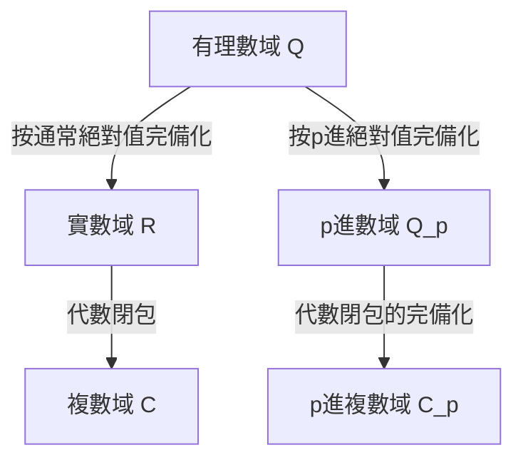

## 1. 引言

在現代數論，特別是代數數論和算術幾何中， **p進數** ( $p$-adic numbers )是不可或缺的工具。這個革命性的概念是在19世紀末由德國數學家 **[庫爾特·亨澤爾](https://kenji.blog/p/hensel/)** ([Kurt Hensel](https://kenji.blog/p/hensel/), 1861–1941)引入的。

他的發現猶如一座橋樑，連接了數學中「局部」(local)與「全局」(global)的觀點，為20世紀的數學帶來了典範轉移。本文將詳細探討[庫爾特·亨澤爾](https://kenji.blog/p/hensel/)的一生，他最偉大的成就—— **p進數** 的發現，其數學基礎，以及它們對現代數學產生的深遠影響。

## 2. 顯赫的家族與早年生活

[庫爾特·亨澤爾](https://kenji.blog/p/hensel/)於1861年12月29日出生在東普魯士的柯尼斯堡（現俄羅斯加里寧格勒）。他的家族在德國的知識界和藝術史上佔有極為重要的地位。

他的祖父是著名的畫家 **威廉·亨澤爾** ，他的祖母是傑出的鋼琴家和作曲家 **范妮·孟德爾頌** （著名作曲家費利克斯·孟德爾頌的姊姊）。再往前追溯，他的曾祖父是啟蒙運動的代表性哲學家 **摩西·孟德爾頌** 。可以說，正是這種文化和知識底蘊深厚的家庭環境，培養了[庫爾特·亨澤爾](https://kenji.blog/p/hensel/)自由而富有創造力的思想。

他年輕時隨家人移居柏林，在那裡接受了高品質的中小學教育。他在數學方面的天賦很早就展現出來，這自然而然地引領他走上了大學的數學研究之路。

## 3. 大學時代與克羅內克的影響

亨澤爾曾在波昂大學和柏林大學學習數學。當時的柏林大學是世界數學研究的中心之一，匯聚了 **[卡爾·魏爾斯特拉斯](https://kenji.blog/p/weierstrass/)** ([Karl Weierstrass](https://kenji.blog/p/weierstrass/))和 **利奧波德·克羅內克** (Leopold Kronecker)等巨匠在此任教。

在這些人中，克羅內克對亨澤爾的影響最深。正如他的一句名言所說：「上帝創造了整數，其餘的都是人類的工作」，克羅內克堅信所有的數學都應該嚴格地建立在整數的基礎上。在克羅內克的指導下，亨澤爾全身心地投入到代數和數論的研究中。

1884年，亨澤爾獲得了柏林大學的博士學位。他的博士論文主題是關於代數函數的算術性質，這也為他後來發現 **p進數** 埋下了重要的伏筆。

## 4. 函數與數之間的類比

亨澤爾最大的靈感來自於「數」（代數整數）與「函數」（代數函數）之間深刻的類比(analogy)。

在19世紀後期， **理查德·戴德金** (Richard Dedekind)和 **海因里希·韋伯** (Heinrich Weber)已經證明，代數數域和代數函數域之間存在著驚人的結構相似性。複平面上的函數可以在每一點的局部展開為冪級數，例如泰勒展開或洛朗展開。

亨澤爾問自己：「如果一個函數可以在每一點附近作為冪級數進行局部研究，那麼有理數和代數整數是否也可以在某種『點』附近表示為冪級數呢？」

在數中等同於「點」的概念就是 **質數 $p$** 。亨澤爾由此提出了一個創新的想法：將任何有理數表示為以質數 $p$ 為底的級數。

## 5. p進數的發現與數學基礎

1897年，亨澤爾發表了一篇開創性的論文，首次向世界介紹了 **p進數** ( $p$-adic numbers )的概念。

### 5.1 p進賦值與絕對值

通常，有理數域 $\mathbb{Q}$ 的完備化會得到實數域 $\mathbb{R}$ 。這是基於我們日常使用的「絕對值」作為度量空間的完備化。然而，亨澤爾引入了一種完全不同的測量距離的方法，這種方法以質數 $p$ 為核心。

任何非零有理數 $x$ 都可以使用給定的質數 $p$ 唯一地分解如下：

$$
x = p^v \frac{a}{b}
$$

這裡， $a$ 和 $b$ 是與 $p$ 互質的整數， $v$ 是一個整數。這個 $v$ 被稱為 $x$ 的 **p進賦值** ，記作 $v_p(x) = v$ 。此外， $x$ 的 **p進絕對值** $|x|_p$ 定義如下：

$$
|x|_p = p^{-v_p(x)} \quad \text{其中 } |0|_p = 0
$$

這個新的絕對值與通常的絕對值不同，它滿足強三角不等式（非阿基米德性質）：

$$
|x + y|_p \le \max(|x|_p, |y|_p)
$$

### 5.2 從有理數到p進數的完備化

利用由這個p進絕對值定義的距離 $d(x, y) = |x - y|_p$ ，透過對有理數域 $\mathbb{Q}$ 應用柯西序列完備化所得到的新數系就是 **p進數域** $\mathbb{Q}_p$ 。

下圖展示了數系是如何分支和擴展的。

### 5.3 p進展開的具體例子

每一個p進整數（p進絕對值小於或等於 $1$ 的元素的集合 $\mathbb{Z}_p$ ）都可以表示為如下的無窮級數：

$$
x = a_0 + a_1 p + a_2 p^2 + a_3 p^3 + \dots = \sum_{i=0}^{\infty} a_i p^i
$$

（其中 $0 \le a_i \le p-1$ ）

作為一個例子，讓我們計算 $\frac{1}{3}$ 在 $\mathbb{Z}_5$ （ $p=5$ ）中的展開。
令 $\frac{1}{3} = a_0 + a_1 \cdot 5 + a_2 \cdot 5^2 + \dots$
去分母得到 $1 = 3(a_0 + a_1 \cdot 5 + a_2 \cdot 5^2 + \dots)$ 。

首先，考慮模 $5$ ：
由 $3 a_0 \equiv 1 \pmod 5$ ，我們得到 $a_0 = 2$ 。
代入此值並繼續計算：
$1 = 3(2 + 5x) \implies 1 = 6 + 15x \implies 15x = -5 \implies 3x = -1$ 。
這裡 $x = a_1 + a_2 \cdot 5 + \dots$
再次考慮模 $5$ ：
由 $3 a_1 \equiv -1 \equiv 4 \pmod 5$ ，我們得到 $a_1 = 3$ 。
類似地代入：
$3(3 + 5y) = -1 \implies 9 + 15y = -1 \implies 15y = -10 \implies 3y = -2$ 。
由 $3 a_2 \equiv -2 \equiv 3 \pmod 5$ ，我們得到 $a_2 = 1$ 。
進一步計算：
$3(1 + 5z) = -2 \implies 3 + 15z = -2 \implies 15z = -5 \implies 3z = -1$ 。
由於這又回到了與 $3x = -1$ 相同的形式，序列 $3, 1$ 從此開始循環。

換句話說，5進數中的展開式如下：
$$
\frac{1}{3} = 2 + 3 \cdot 5 + 1 \cdot 5^2 + 3 \cdot 5^3 + 1 \cdot 5^4 + \dots
$$
這個無窮和在通常意義上是發散的，但在p進絕對值的世界裡，各項隨著級數的推進變得越來越小，這意味著它完美地收斂，沒有任何矛盾。

## 6. 亨澤爾引理 (Hensel's Lemma)

亨澤爾提出的最強大的工具之一是 **亨澤爾引理** 。這個定理提供了多項式方程在p進數域內存在根的條件，它可以被描述為實分析中「牛頓法」的p進版本。

該定理的斷言如下。
假設我們有一個整係數多項式 $f(x)$ 和一個質數 $p$ 。如果存在一個整數 $a$ ，它是模 $p$ 的近似根，並且它的導數不為 $0$ ，也就是說，

$$
f(a) \equiv 0 \pmod p \quad \text{且} \quad f'(a) \not\equiv 0 \pmod p
$$

成立，那麼我們可以從 $a$ 出發構造一個真正的根，並且唯一存在 $\alpha \in \mathbb{Z}_p$ 滿足

$$
f(\alpha) = 0 \quad \text{且} \quad \alpha \equiv a \pmod p
$$

這個引理使得透過連續地「提升(lifting)」同餘方程的解來找到作為p進數的精確解成為可能。

## 7. 奧斯特洛夫斯基定理與局部-全局原則

亨澤爾的概念被其他數學家進一步完善。

1916年，亞歷山大·奧斯特洛夫斯基證明了 **奧斯特洛夫斯基定理** 。這是一個令人驚訝的事實，即「有理數域上的每一個非平凡絕對值，要嘛等價於通常的絕對值，要嘛等價於某個質數 $p$ 的p進絕對值」。因此，將實數和所有的p進數聚集在一起，就「窮盡」了有理數完備化的所有可能性。

此外，亨澤爾的學生 **[赫爾穆特·哈塞](https://kenji.blog/p/hasse/)** ([Helmut Hasse](https://kenji.blog/p/hasse/))確立了 **局部-全局原則** （哈塞原則）。這是一個美麗的定理，它指出「一個方程在有理數上（全局地）有解的充分必要條件是，它在實數以及所有質數 $p$ 的p進數上（局部地）都有解。」藉此，p進數確立了其作為數論中不可或缺工具的不可動搖的地位。

## 8. 作為教育家和編輯的貢獻與遺產

亨澤爾不僅作為一名研究人員，而且作為一名教育家和編輯，都做出了巨大的貢獻。從1901年起，他擔任了世界上最古老的數學期刊之一《克雷勒雜誌》（全稱：純粹與應用數學雜誌）的主編長達數十年，支持了他那個時代最前沿數學研究的傳播。

他的講課清晰而充滿激情，培養了包括[赫爾穆特·哈塞](https://kenji.blog/p/hasse/)在內的下一代傑出數學家。

如今，p進數被廣泛應用於代數數論以外的領域，包括 **p進分析** 、 **p進霍奇理論** ，甚至理論物理中的 **p進量子力學** 。如果沒有p進數理論，[安德魯·懷爾斯](https://kenji.blog/p/wiles/)對「[費馬最後定理](https://kenji.blog/p/fermats-last-theorem/)」的歷史性證明將是不可能實現的。

## 9. 結論

從函數與數之間美麗的類比出發，[庫爾特·亨澤爾](https://kenji.blog/p/hensel/)透過 **p進數** 為數學世界帶來了一個全新的維度。他那種「透過觀察局部來理解全局」的方法，成為了20世紀以來數學的基本哲學之一。

他豐富而獨創的思想，至今仍在不斷啟發著世界各地尋求數與自然界真理的數學家們。
