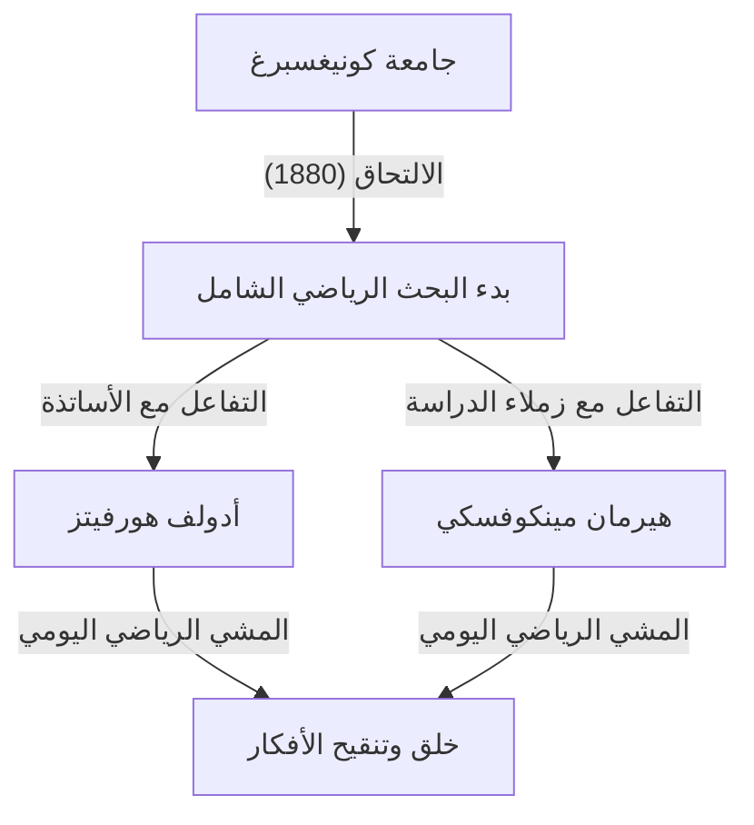
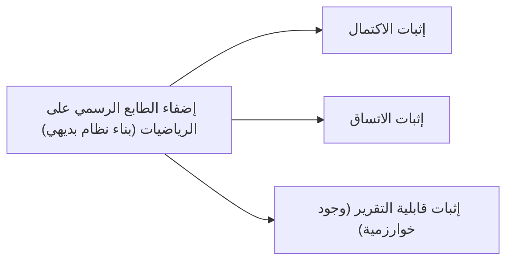

## 1. مقدمة: لماذا يُدعى أبو الرياضيات الحديثة؟

كان [ديفيد هيلبرت](https://kenji.blog/p/hilbert/) (23 يناير 1862 - 14 فبراير 1943) عالم رياضيات ألمانيًا، ويُعتبر على نطاق واسع أحد أعظم علماء الرياضيات وأكثرهم تأثيرًا في أواخر القرن التاسع عشر وأوائل القرن العشرين. غالبًا ما يُقارن هيلبرت بزميله العبقري الفرنسي [هنري بوانكاريه](https://kenji.blog/p/poincare/)، لكن بينما كان بوانكاريه يعتمد على الحدس، أكد هيلبرت على المنطق الصارم والشكلية. لقد أثر هيلبرت بشكل عميق على كل مجال تقريبًا من مجالات الرياضيات الحديثة، مما أكسبه لقب **"ملك الرياضيات"**.

تمتد إسهاماته عبر نظرية الثوابت، نظرية الأعداد الجبرية، البديهيات الهندسية، المعادلات التكاملية، التحليل الدالي (فضاءات هيلبرت)، والفيزياء النظرية (الأسس الرياضية للنسبية العامة). لا يقتصر أعظم إرث له على مجرد حل المشكلات المفتوحة المعزولة، بل يتمثل في إعادة تصور البنية والطبيعة الجوهرية للرياضيات نفسها بشكل جذري، وتأسيس النماذج الجديدة للبديهية والشكلية. في هذا المقال، نلقي نظرة عميقة ومفصلة على حلقات الحياة الدرامية لهيلبرت وإنجازاته الرائعة.

## 2. الولادة والأيام الأولى في كونيغسبرغ: الصحوة في مدينة العلم

وُلد هيلبرت في 23 يناير 1862، في فيلاو، بالقرب من كونيغسبرغ (الآن كالينينغراد، روسيا)، عاصمة مقاطعة بروسيا الشرقية في مملكة بروسيا. كان والده، أوتو هيلبرت، قاضيًا صارمًا. وكانت والدته، ماريا تيريز، امرأة متعلمة تعليماً عالياً ولديها اهتمام عميق بالفلسفة وعلم الفلك. يُقال إن هيلبرت ورث تفكيره المنطقي وتعطشه للمعرفة من والديه.

كانت كونيغسبرغ مدينة ذات جذور أكاديمية عميقة؛ فقد كانت مسقط رأس الفيلسوف العظيم إيمانويل كانط، واشتهرت بمشكلة "[جسور كونيغسبرغ السبعة](https://kenji.blog/p/seven-bridges-of-konigsberg/)" التي حلها [ليونهارد أويلر](https://kenji.blog/p/euler/). خلال أيام دراسته، كانت درجات هيلبرت عادية، لكنه امتلك حدسًا وشغفًا خاصين بالرياضيات. كان يكره الحفظ عن ظهر قلب، مفضلاً حل المشكلات عن طريق بناء المنطق من الصفر في عقله. أصبح هذا النهج - البناء من الأسس المنطقية بدلاً من الاعتماد على الحفظ - جوهر أسلوبه الرياضي اللاحق.

### "المشي الرياضي" وأصدقاء العمر

في عام 1880، التحق هيلبرت بجامعة كونيغسبرغ، حيث التقى بشخصين غيرا حياته. أحدهما كان العبقري هيرمان مينكوفسكي، الذي فاز بجائزة الرياضيات من أكاديمية العلوم بباريس وهو في الثامنة عشرة من عمره فقط. والآخر كان أدولف هورفيتز، الأستاذ الشاب اللامع.

اتخذ الثلاثة من المشي يوميًا تحت شجرة تفاح بالقرب من الجامعة في وقت محدد روتينًا لهم، حيث كانوا يناقشون بحماس أحدث المشكلات الرياضية. سمح هذا **"المشي الرياضي"** اليومي لمواهب هيلبرت الرياضية الشابة بالازدهار الكامل. من خلال صراع الأفكار مع عقلين يمتلكان حدسًا رياضيًا مختلفًا تمامًا، صقل هيلبرت مفاهيمه وخطى نحو أعماق الرياضيات.

## 3. اختراق في نظرية الثوابت: القفز فوق انتقادات جوردان

اكتسب هيلبرت شهرة عالمية لأول مرة في مجال نظرية الثوابت. تدرس هذه النظرية خصائص كثيرات الحدود التي تظل دون تغيير في ظل التحولات الإحداثية. في ذلك الوقت، كان بول جوردان، الخبير الرائد في هذا المجال، قد أثبت أن ثوابت متغيرين لها أساس محدود (مبرهنة جوردان)، لكن الحالة لثلاثة متغيرات أو أكثر تطلبت حسابات معقدة للغاية وظلت مشكلة لم تُحل لسنوات.

في عام 1888، تعامل هيلبرت مع هذا التحدي بنهج جديد تمامًا. وتخليًا عن الطريقة التقليدية لحساب وبناء صيغ الأساس بشكل صريح، استخدم البرهان بالتناقض لتقديم برهان وجود يثبت أنه **"يجب أن يوجد أساس محدود"**. تُعرف هذه المبرهنة القوية اليوم باسم **مبرهنة أساس هيلبرت**.

تقول الأسطورة إنه عند رؤية هذا البرهان التجريدي الخالي تمامًا من الحسابات، هتف جوردان بغضب: **"هذه ليست رياضيات. هذا لاهوت!"** (Das ist nicht Mathematik. Das ist Theologie!). ومع ذلك، في وقت لاحق، اضطر جوردان للاعتراف بالصحة المنطقية وقوة هذه الطريقة. شكل إنجاز هيلبرت نقطة تحول تاريخية حيث تحول مركز الرياضيات من "البناء عبر حسابات محددة" إلى "إثبات وجود الهياكل المجردة".

## 4. نظرية الأعداد الجبرية و"تقرير الأعداد" الأثري

بعد نجاحه في نظرية الثوابت، تحول هيلبرت إلى نظرية الأعداد الجبرية. بتكليف من الجمعية الرياضية الألمانية في عام 1897، ألف "تقرير الأعداد" (Zahlbericht)، وهو عمل ضخم لخص المعرفة الموجودة لنظرية الأعداد الجبرية وأعاد بنائها من منظور جديد تمامًا.

في هذا التقرير، طبق نظرية غالوا على نظرية الأعداد، ووضع الأسس لنظرية حقل الصنف لهيلبرت. نظرية حقل الصنف، التي أتقنها لاحقًا تيجي تاكاغي وإميل أرتين، تُعتبر من أجمل النظريات في نظرية الأعداد في القرن العشرين. تمكن هيلبرت من توحيد النتائج المتفرقة في نظرية الأعداد تحت قوانين أعلى وأجمل.

## 5. البديهيات الهندسية: فلسفة "الطاولات، الكراسي، وأكواب البيرة"

في عام 1899، نشر هيلبرت كتاب "أسس الهندسة" (Grundlagen der Geometrie). أعاد هذا الكتاب بناء النظام البديهي للهندسة الإقليدية بالكامل، والذي كان الأساس المطلق للهندسة لأكثر من 2000 عام، من منظور حديث.

احتوت "الأصول" ل[إقليدس](https://kenji.blog/p/euclid/) على عدة افتراضات وعناصر ضمنية تعتمد على الحدس البصري. أزال هيلبرت هذه العناصر بصرامة، وقدم نظامًا بديهيًا محددًا بدقة يتكون من خمس مجموعات: بديهيات الوقوع، الترتيب، التطابق، التوازي، والاستمرارية.

قال مقولته الشهيرة: **"يجب أن يكون المرء قادرًا على القول في جميع الأوقات - بدلاً من النقاط والخطوط المستقيمة والمستويات - الطاولات والكراسي وأكواب البيرة."** كان هذا إعلانًا مدويًا عن **الشكلية**، حيث جرد الهندسة من أي حقيقة بديهية أو فيزيائية تتعلق بماهية الأشياء، وأسس فقط العلاقات المنطقية بين الأشياء كأساس للرياضيات. أصبح هذا النهج الرائد النمط القياسي للمنهج البديهي في الرياضيات الحديثة.

## 6. دعوة إلى جامعة غوتينغن وفجر العصر الذهبي

في عام 1895، بفضل التوصية القوية من فيليكس كلاين، وهو شخصية بارزة في الرياضيات الألمانية، تم تعيين هيلبرت أستاذًا في جامعة غوتينغن. كانت غوتينغن مشهورة بالفعل كأرض مقدسة للرياضيات، حيث كانت في السابق موطنًا لكارل فريدريش غاوس وبرنهارد ريمان.

مع وصول هيلبرت، أعادت غوتينغن ترسيخ نفسها بقوة كمركز رياضي رائد في العالم. كانت محاضراته دائماً واضحة ومفعمة بالشغف للأفكار الرياضية الجديدة، مما جذب الطلاب والباحثين اللامعين من جميع أنحاء العالم. العديد من النجوم البارزين الذين سيقودون رياضيات القرن العشرين لاحقًا، مثل [إيمي نويثر](https://kenji.blog/p/noether/)، هيرمان فايل، ريتشارد كورانت، وجون فون نيومان، تلقوا توجيهات من هيلبرت.

الحكاية المتعلقة ب[إيمي نويثر](https://kenji.blog/p/noether/) مشهورة بشكل خاص. في ذلك الوقت، منعت القواعد الجامعية النساء من تقلد مناصب أكاديمية. لكن هيلبرت، تقديراً منه لموهبتها الاستثنائية في الجبر، احتج بشدة في اجتماع الكلية قائلاً: **"مجلس الجامعة ليس حماماً عاماً، لذا فإن الجنس لا يهم!"** يوضح هذا التصريح بجلاء شخصيته التقدمية، القائمة على الجدارة، والخالية من التحيز.

## 7. المؤتمر الدولي لعلماء الرياضيات في باريس 1900: مسائل هيلبرت الـ23

في عام 1900، وفي المؤتمر الدولي الثاني لعلماء الرياضيات (ICM) الذي عقد في باريس، ألقى هيلبرت خطابًا تاريخيًا وضخمًا. متسائلاً "ما هي المشكلات التي ستوجه تقدم الرياضيات في القرن القادم؟"، قدم **"23 مسألة غير محلولة"** والتي يجب أن يسعى علماء الرياضيات في القرن العشرين لحلها.

شملت هذه المسائل جميع مجالات الرياضيات في ذلك الوقت وكانت بمثابة قوة دافعة هائلة للتطور الرياضي اللاحق. إليك بعض أشهرها:

1. **فرضية الاستمرارية** (المسألة الأولى): هل توجد مجموعة تقع أصليتها بدقة بين الأعداد الصحيحة والأعداد الحقيقية؟ أثبت غودل وكوهين لاحقًا أن هذا مستقل عن بديهيات ZFC القياسية.
2. **اتساق بديهيات الحساب** (المسألة الثانية): أثبت أن بديهيات الحساب متسقة باستخدام طرق محدودة فقط.
3. **تساوي أحجام هرمين رباعيين متساويي القواعد والارتفاعات** (المسألة الثالثة): هل يمكن تقسيم هرمين من هذا القبيل دائمًا إلى عدد محدود من القطع وإعادة تجميعهما ليشكلا بعضهما البعض؟ تم حل هذه المشكلة سلبًا بواسطة طالبه ماكس دين.
6. **بديهيات الفيزياء** (المسألة السادسة): وضع بديهيات لفروع الفيزياء التي تلعب فيها الرياضيات دورًا حاسمًا، مثل نظرية الاحتمالات والميكانيكا.
8. **المسائل المتعلقة بتوزيع الأعداد الأولية** (المسألة الثامنة): فرضية ريمان وتخمين غولدباخ. ولا تزال هذه غير محلولة حتى اليوم.
10. **تحديد قابلية حل معادلة ديوفانتية** (المسألة العاشرة): أوجد خوارزمية عامة لتحديد ما إذا كانت معادلة متعددة الحدود بأسس صحيحة تمتلك حلاً صحيحاً. في عام 1970، أثبت ماتياسفيتش عدم وجود مثل هذه الخوارزمية.

لا تزال مسائل هيلبرت إشارات حيوية لعلماء الرياضيات المعاصرين حتى اليوم.

## 8. المعادلات التكاملية وفضاء هيلبرت: جسر إلى ميكانيكا الكم

مع دخول العقد الأول من القرن العشرين، تحول اهتمام هيلبرت من الجبر والهندسة إلى التحليل. درس بعمق نظرية المعادلات التكاملية لعالم الرياضيات السويدي إيفار فريدهولم وبنى نظرية طيفية في الفضاءات ذات الأبعاد اللانهائية.

من خلال هذه العملية، قدم مفهوم **فضاء هيلبرت**، وهو تعميم للفضاء الإقليدي ذي الأبعاد المحدودة إلى الأبعاد اللانهائية. يتم تعريف الجداء الداخلي $\langle x, y \rangle$ في فضاء الجداء الداخلي $\mathcal{H}$ بدقة كفضاء يمتلك الخطية والتناظر الهرميتي، ويحقق الاكتمال (تتقارب جميع متتاليات كوشي). رياضياً، يحقق الجداء الداخلي:

$$
\langle a x_1 + b x_2, y \rangle = a \langle x_1, y \rangle + b \langle x_2, y \rangle
$$
$$
\langle x, y \rangle = \overline{\langle y, x \rangle}
$$

هنا، $x, y, x_1, x_2 \in \mathcal{H}$ و $a, b \in \mathbb{C}$ (أعداد مركبة)، و $\overline{\langle y, x \rangle}$ يدل على المرافق المركب. المعيار يُستنتج من $\|x\| = \sqrt{\langle x, x \rangle}$.

بشكل مذهل، اتضح أن هذه النظرية المجردة، التي بناها هيلبرت بدافع الفضول الرياضي البحت، هي اللغة الرياضية المثالية لوصف حالات الأنظمة الفيزيائية في ميكانيكا الكم الناشئة بعد عقود. عندما صاغ فيرنر هايزنبيرغ ميكانيكا المصفوفات وإروين شرودنغر ميكانيكا الموجات، أصبحت نظرية فضاءات هيلبرت أداة لا غنى عنها، بشكل رئيسي من خلال عمل جون فون نيومان. إنه مثال مذهل للرياضيات التي تسبق الفيزياء.

## 9. الدخول في الفيزياء وفعل أينشتاين-هيلبرت

غالبًا ما كان هيلبرت يمزح قائلاً إن "الفيزياء أصعب من أن تُترك للفيزيائيين"، وكان يهدف إلى إعادة بناء أسس الفيزياء باستخدام الأساليب البديهية الرياضية الصارمة (المتعلقة بمسألته السادسة).

في عام 1915، وخلال الفترة التي كان فيها ألبرت أينشتاين يكافح لإكمال معادلات مجال الجاذبية للنسبية العامة، كان هيلبرت يعمل أيضًا على المشكلة. باستخدام التقنية الأنيقة رياضياً لمبدأ التغاير، استنتج هيلبرت معادلات مجال الجاذبية الصحيحة تقريبًا في نفس الوقت مع أينشتاين. اليوم، يُعرف تكامل الفعل الذي تقوم عليه هذه النظرية باسم **فعل أينشتاين-هيلبرت**.

$$
S = \int \left( \frac{R}{16 \pi G} + \mathcal{L}_M \right) \sqrt{-g} \, d^4x
$$

معنى المعادلة: هنا، $R$ هو الانحناء القياسي الذي يمثل انحناء الزمكان، $G$ هو ثابت الجاذبية لنيوتن، $g$ هو محدد الموتر المتري، $\mathcal{L}_M$ هي كثافة لاغرانج لمجالات المادة، و $\text{يتم التكامل على كامل الزمكان}$.

في حين كان من الممكن أن ينشأ نزاع حول الأولوية بين أينشتاين وهيلبرت، كان هيلبرت يحترم بعمق الحدس الفيزيائي الرائع لأينشتاين وصرح علنًا أن "أينشتاين هو من اكتشف هذه المعادلة"، ولم يدعي الأولوية لنفسه أبدًا.

## 10. برنامج هيلبرت: البحث عن الاتساق المطلق في الرياضيات

بعد الحرب العالمية الأولى، ورداً على "الأزمة في أسس الرياضيات" التي أثارتها التناقضات في نظرية المجموعات (مثل مفارقة راسل)، اقترح هيلبرت المشروع الأكثر طموحًا في حياته: **برنامج هيلبرت**.

سعى لإعادة بناء جميع الرياضيات كـ "نظام رسمي"، معاملاً جميع القضايا الرياضية كسلاسل لا معنى لها من الرموز والتلاعب بها وفقًا لقواعد ميكانيكية للاستدلال. كان هدفه إثبات رياضيًا - باستخدام التفكير الآمن والمحدود فقط - أن التناقضات مثل " $0 = 1$ " لا يمكن مطلقًا استنتاجها ضمن هذا النظام (الاتساق).

أثار هذا البرنامج نقاشات شرسة (أزمة الأسس) مع الحدسيين مثل ل. ي. ج. براور. ومع ذلك، دفع هيلبرت برنامجه بجرأة إلى الأمام، معلناً، "لن يطردنا أحد من الجنة التي خلقها لنا كانتور".

## 11. صدمة [مبرهنات عدم الاكتمال لغودل](https://kenji.blog/p/godels-incompleteness-theorems/) وتحول البرنامج

ومع ذلك، في عام 1931، نشر عالم المنطق النمساوي الشاب [كورت غودل](https://kenji.blog/p/godel/) **مبرهنات عدم الاكتمال** الخاصة به، ووجه ضربة قاضية لبرنامج هيلبرت.

أثبت غودل رياضيًا وبشكل مثالي أنه في أي نظام رسمي قوي بما فيه الكفاية يحتوي على بديهيات الحساب، ستوجد دائمًا قضايا "صحيحة ضمن النظام ولكن لا يمكن إثباتها أو دحضها" (مبرهنة عدم الاكتمال الأولى)، وأنه "من المستحيل إثبات اتساق النظام ضمن النظام نفسه" (مبرهنة عدم الاكتمال الثانية).

أظهر هذا أن بناء "النظام الرياضي المثالي حيث يمكن إثبات كل شيء، بما في ذلك اتساقه"، والذي حلم به هيلبرت، كان مستحيلاً. على الرغم من أن هيلبرت كان، كما ورد، محبطًا وغاضبًا بشدة في البداية من هذه النتيجة، إلا أن الأساليب الصارمة للرياضيات البعدية والمنطق الرسمي التي تم تطويرها أثناء السعي وراء برنامج هيلبرت أدت في النهاية مباشرة إلى تأسيس علوم الكمبيوتر وعلوم الكمبيوتر النظرية بواسطة [آلان تورينج](https://kenji.blog/p/turing/).

## 12. السنوات الأخيرة في غوتينغن: صعود النازيين ونهاية ملاذ رياضي

في الثلاثينيات من القرن العشرين، استولى الحزب النازي بقيادة أدولف هتلر على السلطة في ألمانيا. تم سن "قانون استعادة الخدمة المدنية المهنية" في عام 1933، مما أدى إلى الطرد القاسي للعديد من علماء الرياضيات اليهود البارزين والعلماء المعارضين في جامعة غوتينغن، بما في ذلك [إيمي نويثر](https://kenji.blog/p/noether/)، هيرمان فايل، ريتشارد كورانت، وماكس بورن.

انهارت غوتينغن، التي كانت ذات يوم ملاذاً رياضياً نابضاً بالحياة يتجمع فيه المواهب من جميع أنحاء العالم، بين عشية وضحاها تقريبًا. ذات مرة، في إحدى المآدب، سأل وزير التعليم النازي برنهارد روست هيلبرت، "كيف حال الرياضيات في معهدك الآن بعد أن تم تحريره من النفوذ اليهودي؟" أجاب هيلبرت بغضب وحزن: "المعهد الرياضي؟ لم يعد هناك أي معهد في الحقيقة."

في 14 فبراير 1943، في خضم الحرب العالمية الثانية، توفي هيلبرت في عزلة عن عمر يناهز 81 عامًا في غوتينغن، بعد أن فر معظم طلابه السابقين إلى أمريكا وأماكن أخرى. حضر جنازته عدد قليل جدًا من الناس.

## 13. الخلاصة: "يجب أن نعرف، وسوف نعرف"

حتى بعد وفاة [ديفيد هيلبرت](https://kenji.blog/p/hilbert/)، لم يتلاشى الإرث الرياضي الذي تركه أبدًا. مسار أفكاره منقوش في كل زاوية من زوايا الرياضيات الحديثة.

على شاهد قبره، حُفرت الكلمات الشهيرة التي اختتم بها خطاب تقاعده في مسقط رأسه كونيغسبرغ في عام 1930، مما يوضح إيمانه الراسخ والمطلق بالعقل البشري والبحث العلمي. كان هذا تفنيدًا قويًا للاأدرية المتشائمة في ذلك الوقت، والتي لخصتها عبارة "ignoramus et ignorabimus" (لا نعرف ولن نعرف).

> **Wir müssen wissen.**
> **Wir werden wissen.**
> (يجب أن نعرف. وسوف نعرف.)

كان [ديفيد هيلبرت](https://kenji.blog/p/hilbert/) يؤمن بعمق بالاحتمالات اللانهائية للرياضيات واستمر في ريادة حدودها طوال حياته. أصبحت روحه المرنة وفلسفته وإنجازاته الرائعة اللحم والدم لعلماء الرياضيات المعاصرين، وبثت الحياة في كل زاوية من زوايا الرياضيات اليوم وتستمر في إلهام المستكشفين في المستقبل.

## التسلسل الزمني

* **1862**: ولد في فيلاو، بالقرب من كونيغسبرغ، بروسيا الشرقية.
* **1880**: التحق بجامعة كونيغسبرغ. التقى بمينكوفسكي وهورفيتز.
* **1885**: حصل على الدكتوراه من جامعة كونيغسبرغ.
* **1888**: أثبت "مبرهنة أساس هيلبرت" في نظرية الثوابت.
* **1895**: عين أستاذًا في جامعة غوتينغن بدعوة من كلاين.
* **1897**: نشر "تقرير الأعداد" عن نظرية الأعداد الجبرية.
* **1899**: نشر "أسس الهندسة"، مؤصلاً للهندسة.
* **1900**: قدم "23 مسألة" في المؤتمر الدولي لعلماء الرياضيات في باريس.
* **1909**: حل مسألة ويرينغ إيجابيًا.
* **1915**: صاغ "فعل أينشتاين-هيلبرت" في النسبية العامة.
* **العشرينيات من القرن العشرين**: اقترح "برنامج هيلبرت".
* **1930**: تقاعد من جامعة غوتينغن. ألقى خطاب "يجب أن نعرف، وسوف نعرف".
* **1943**: توفي عن عمر يناهز 81 عامًا في غوتينغن.
