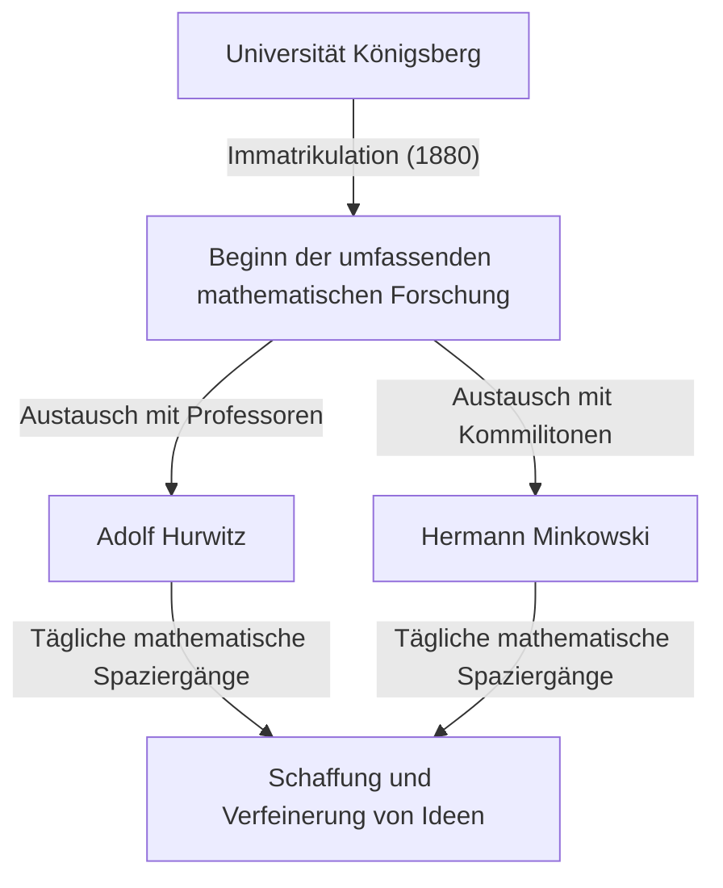
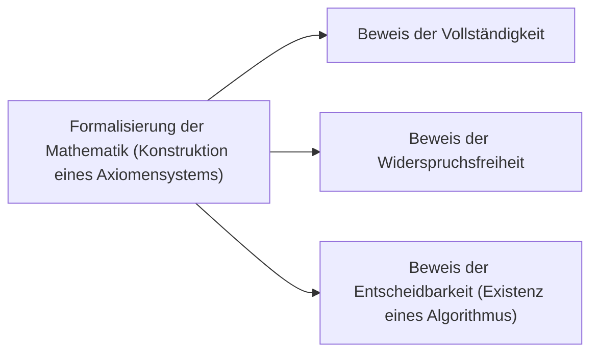

## 1. Einleitung: Der Vater der modernen Mathematik

[David Hilbert](https://kenji.blog/de/p/hilbert/) (23. Januar 1862 – 14. Februar 1943) war ein deutscher Mathematiker und gilt weithin als einer der einflussreichsten und bedeutendsten Mathematiker des späten 19. und frühen 20. Jahrhunderts. Oft mit seinem brillanten französischen Zeitgenossen [Henri Poincaré](https://kenji.blog/de/p/poincare/) verglichen, betonte Hilbert im Gegensatz zu Poincarés Verlass auf die Intuition die strenge Logik und den Formalismus. Hilbert beeinflusste fast jeden Bereich der modernen Mathematik zutiefst und verdiente sich den Beinamen **"Der König der Mathematik"**.

Seine Beiträge umfassen die Invariantentheorie, die algebraische Zahlentheorie, die Axiomatisierung der Geometrie, Integralgleichungen, die Funktionalanalysis (Hilberträume) und die theoretische Physik (die mathematischen Grundlagen der allgemeinen Relativitätstheorie). Sein größtes Vermächtnis liegt nicht nur in der Lösung isolierter offener Probleme, sondern in der grundlegenden Neugestaltung der Struktur und Natur der Mathematik selbst, wodurch die neuen Paradigmen des Axiomatismus und Formalismus etabliert wurden. In diesem Artikel werfen wir einen tiefen und detaillierten Blick auf die dramatischen Lebensepisoden Hilberts und seine brillanten Errungenschaften.

## 2. Geburt und frühe Tage in Königsberg: Erwachen in der Stadt der Gelehrsamkeit

Hilbert wurde am 23. Januar 1862 in Wehlau in der Nähe von Königsberg (heute Kaliningrad, Russland), der Hauptstadt der Provinz Ostpreußen im Königreich Preußen, geboren. Sein Vater, Otto Hilbert, war ein strenger Amtsrichter. Seine Mutter, Maria Therese, war eine gebildete Frau mit großem Interesse an Philosophie und Astronomie. Man sagt, Hilbert habe sein logisches Denken und seinen Wissensdurst von seinen Eltern geerbt.

Königsberg war eine Stadt mit tiefen akademischen Wurzeln; es war der Geburtsort des großen Philosophen Immanuel Kant und war berühmt für das von [Leonhard Euler](https://kenji.blog/de/p/euler/) gelöste Problem der "Sieben Brücken von Königsberg". In seiner Schulzeit waren Hilberts Noten unauffällig, aber er besaß eine besondere Intuition und Leidenschaft für Mathematik. Er verabscheute das Auswendiglernen und zog es vor, Probleme zu lösen, indem er die Logik in seinem eigenen Kopf von Grund auf neu aufbaute. Dieser Ansatz – das Aufbauen auf logischen Grundlagen anstatt sich auf das Auswendiglernen zu verlassen – wurde zum Kern seines späteren mathematischen Stils.

### "Mathematische Spaziergänge" und lebenslange Freunde

1880 trat Hilbert in die Universität Königsberg ein, wo er zwei Menschen traf, die sein Leben verändern sollten. Der eine war das Genie Hermann Minkowski, der im Alter von nur 18 Jahren den Mathematikpreis der Pariser Akademie der Wissenschaften gewonnen hatte. Der andere war Adolf Hurwitz, ein brillanter junger Professor.

Die drei machten es sich zur täglichen Routine, zu einer bestimmten Zeit unter einem Apfelbaum in der Nähe der Universität spazieren zu gehen und leidenschaftlich über die neuesten mathematischen Probleme zu diskutieren. Diese täglichen **"mathematischen Spaziergänge"** ließen das mathematische Talent des jungen Hilbert voll erblühen. Indem er Ideen mit zwei Köpfen austauschte, die über völlig unterschiedliche mathematische Intuitionen verfügten, verfeinerte Hilbert seine eigenen Konzepte und drang in die Tiefen der Mathematik vor.

## 3. Durchbruch in der Invariantentheorie: Ein Sprung über Gordans Kritik hinaus

Weltruhm erlangte Hilbert zunächst auf dem Gebiet der Invariantentheorie. Die Invariantentheorie untersucht die Eigenschaften von Polynomen, die bei Koordinatentransformationen unverändert bleiben. Zu dieser Zeit hatte Paul Gordan, der führende Experte auf diesem Gebiet, bewiesen, dass Invarianten von zwei Variablen eine endliche Basis haben (Gordanscher Satz), aber der Fall für drei oder mehr Variablen erforderte äußerst komplexe Berechnungen und blieb jahrelang ein ungelöstes Problem.

1888 ging Hilbert diese Herausforderung mit einem völlig neuen Ansatz an. Er verwarf die traditionelle Methode der expliziten Berechnung und Konstruktion der Basisformeln und nutzte stattdessen einen Widerspruchsbeweis, um einen Existenzbeweis vorzulegen, dass **"eine endliche Basis existieren muss"**. Dieser mächtige Satz ist heute als **Hilbertscher Basissatz** bekannt.

Die Legende besagt, dass Gordan, als er diesen abstrakten Beweis sah, der völlig ohne Berechnungen auskam, wütend ausrief: **"Das ist nicht Mathematik. Das ist Theologie!"** Später musste jedoch auch Gordan die logische Richtigkeit und Stärke dieser Methode anerkennen. Hilberts Leistung markierte einen historischen Wendepunkt, an dem sich der Schwerpunkt der Mathematik von der "Konstruktion durch konkrete Berechnung" zum "Existenzbeweis abstrakter Strukturen" verlagerte.

## 4. Algebraische Zahlentheorie und der monumentale "Zahlbericht"

Nach seinem Erfolg in der Invariantentheorie wandte sich Hilbert der algebraischen Zahlentheorie zu. Im Auftrag der Deutschen Mathematiker-Vereinigung verfasste er 1897 den "Zahlbericht", ein monumentales Werk, das das vorhandene Wissen der algebraischen Zahlentheorie zusammenfasste und aus einer völlig neuen Perspektive rekonstruierte.

In diesem Bericht wandte er die Galoistheorie auf die Zahlentheorie an und legte den Grundstein für Hilberts Klassenkörpertheorie. Die Klassenkörpertheorie, die später von Teiji Takagi und Emil Artin perfektioniert wurde, gilt als eine der schönsten Theorien der Zahlentheorie des 20. Jahrhunderts. Hilbert gelang es, scheinbar unzusammenhängende Ergebnisse in der Zahlentheorie unter höheren, schönen Gesetzen zu vereinen.

## 5. Axiomatisierung der Geometrie: Die Philosophie von "Tischen, Stühlen und Bierseideln"

1899 veröffentlichte Hilbert das Buch "Grundlagen der Geometrie". Es rekonstruierte das Axiomensystem der euklidischen Geometrie, das über 2000 Jahre lang das absolute Fundament der Geometrie gewesen war, vollständig aus einer modernen Perspektive.

[Euklid](https://kenji.blog/de/p/euclid/)s "Elemente" enthielten mehrere implizite Annahmen und Elemente, die auf visueller Intuition beruhten. Hilbert beseitigte diese konsequent und präsentierte ein streng definiertes Axiomensystem, das aus fünf Gruppen bestand: Axiome der Verknüpfung (Inzidenz), der Anordnung, der Kongruenz, der Parallelen und der Stetigkeit.

Er erklärte berühmt: **"Man muss jederzeit an Stelle von 'Punkte, Geraden, Ebenen' 'Tische, Stühle, Bierseidel' sagen können."** Dies war eine durchschlagende Erklärung des **Formalismus**, die die Geometrie von jeder intuitiven oder physikalischen Realität bezüglich der Natur der Objekte befreite und lediglich die logischen Beziehungen zwischen den Objekten als Grundlage der Mathematik festlegte. Dieser bahnbrechende Ansatz wurde zum Standardstil der axiomatischen Methode in der modernen Mathematik.

## 6. Einladung an die Universität Göttingen und der Beginn eines Goldenen Zeitalters

1895 wurde Hilbert auf nachdrückliche Empfehlung von Felix Klein, einem Schwergewicht der deutschen Mathematik, zum Professor an der Universität Göttingen ernannt. Göttingen war bereits als heiliger Boden der Mathematik bekannt, da hier einst [Carl Friedrich Gauss](https://kenji.blog/de/p/gauss/) und [Bernhard Riemann](https://kenji.blog/de/p/riemann/) wirkten.

Mit Hilberts Ankunft etablierte sich Göttingen wieder fest als das weltweit führende mathematische Zentrum. Seine Vorlesungen waren stets klar und voller Leidenschaft für neue mathematische Ideen und zogen brillante Studenten und Forscher aus der ganzen Welt an. Viele Superstars, die später die Mathematik des 20. Jahrhunderts prägen sollten, wie [Emmy Noether](https://kenji.blog/de/p/noether/), Hermann Weyl, Richard Courant und John von Neumann, wurden von Hilbert betreut.

Besonders berühmt ist die Anekdote um [Emmy Noether](https://kenji.blog/de/p/noether/). Zu dieser Zeit verboten die Universitätsregeln Frauen, akademische Positionen innezuhaben. Hilbert, der ihr außergewöhnliches Talent in der Algebra hoch schätzte, protestierte vehement in der Fakultätssitzung und erklärte: **"Die Fakultät ist doch keine Badeanstalt, daher spielt das Geschlecht keine Rolle!"** Diese Aussage veranschaulicht anschaulich seinen fortschrittlichen, leistungsorientierten und unvoreingenommenen Charakter.

## 7. Der Internationale Mathematikerkongress in Paris 1900: Hilberts 23 Probleme

Im Jahr 1900 hielt Hilbert auf dem zweiten Internationalen Mathematikerkongress (ICM) in Paris eine historische und monumentale Rede. Er fragte: "Was sind die Probleme, die den Fortschritt der Mathematik im kommenden Jahrhundert leiten werden?" und präsentierte **"23 ungelöste Probleme"**, die die Mathematiker des 20. Jahrhunderts zu lösen versuchen sollten.

Diese Probleme umfassten alle Bereiche der damaligen Mathematik und dienten als massiver Motor für die weitere mathematische Entwicklung. Hier sind einige der berühmtesten:

1. **Die Kontinuumshypothese** (1. Problem): Gibt es eine Menge, deren Mächtigkeit streng zwischen der der ganzen Zahlen und der reellen Zahlen liegt? Später bewiesen Gödel und Cohen, dass dies unabhängig von den Standard-ZFC-Axiomen ist.
2. **Die Widerspruchsfreiheit der arithmetischen Axiome** (2. Problem): Beweisen Sie, dass die Axiome der Arithmetik konsistent sind, wobei nur finite Methoden verwendet werden.
3. **Die Volumengleichheit zweier Tetraeder mit gleichen Grundflächen und gleichen Höhen** (3. Problem): Können zwei solche Polyeder immer in endlich viele Stücke zerlegt und wieder zusammengesetzt werden? Dies wurde von seinem Studenten Max Dehn negativ gelöst.
6. **Axiomatisierung der Physik** (6. Problem): Axiomatisieren Sie Zweige der Physik, in denen die Mathematik eine entscheidende Rolle spielt, wie etwa die Wahrscheinlichkeitstheorie und die Mechanik.
8. **Probleme bezüglich der Primzahlverteilung** (8. Problem): Die berüchtigte Riemannsche Vermutung und die Goldbachsche Vermutung. Diese sind bis heute ungelöst.
10. **Entscheidung über die Lösbarkeit einer diophantischen Gleichung** (10. Problem): Finden Sie einen allgemeinen Algorithmus, um zu bestimmen, ob eine gegebene Polynomgleichung mit ganzzahligen Koeffizienten eine ganzzahlige Lösung hat. 1970 bewies Matijassewitsch, dass ein solcher Algorithmus nicht existiert.

Hilberts Probleme bleiben auch heute noch entscheidende Wegweiser für moderne Mathematiker.

## 8. Integralgleichungen und der Hilbertraum: Eine Brücke zur Quantenmechanik

Zu Beginn der 1900er Jahre verlagerte sich Hilberts Interesse von der Algebra und Geometrie zur Analysis. Er studierte intensiv die Integralgleichungstheorie des schwedischen Mathematikers Ivar Fredholm und konstruierte eine Spektraltheorie in unendlichdimensionalen Räumen.

In diesem Prozess führte er das Konzept des **Hilbertraums** ein, eine Verallgemeinerung des endlichdimensionalen euklidischen Raums auf unendliche Dimensionen. Das innere Produkt $\langle x, y \rangle$ in einem Prähilbertraum $\mathcal{H}$ ist streng definiert als ein Raum, der Linearität und hermitesche Symmetrie besitzt und die Vollständigkeit erfüllt (alle Cauchy-Folgen konvergieren). Mathematisch ausgedrückt erfüllt das innere Produkt:

$$
\langle a x_1 + b x_2, y \rangle = a \langle x_1, y \rangle + b \langle x_2, y \rangle
$$
$$
\langle x, y \rangle = \overline{\langle y, x \rangle}
$$

Hierbei sind $x, y, x_1, x_2 \in \mathcal{H}$ und $a, b \in \mathbb{C}$ (komplexe Zahlen), und $\overline{\langle y, x \rangle}$ bezeichnet die komplex Konjugierte. Die Norm wird durch $\|x\| = \sqrt{\langle x, x \rangle}$ induziert.

Erstaunlicherweise stellte sich diese abstrakte Theorie, die Hilbert aus reiner mathematischer Neugier konstruiert hatte, Jahrzehnte später als die perfekte mathematische Sprache heraus, um die Zustände physikalischer Systeme in der neu geborenen Quantenmechanik zu beschreiben. Als Werner Heisenberg die Matrizenmechanik und Erwin Schrödinger die Wellenmechanik formulierten, wurde die Theorie der Hilberträume, vor allem durch die Arbeit von John von Neumann, zu einem unverzichtbaren Werkzeug. Es ist ein atemberaubendes Beispiel dafür, dass die Mathematik der Physik vorausging.

## 9. Ausflug in die Physik und die Einstein-Hilbert-Wirkung

Hilbert scherzte oft, dass "die Physik für die Physiker zu schwer ist", und er zielte darauf ab, die Grundlagen der Physik mithilfe strenger mathematischer axiomatischer Methoden (im Zusammenhang mit seinem 6. Problem) zu rekonstruieren.

1915, während der Zeit, in der Albert Einstein darum kämpfte, die Gravitationsfeldgleichungen der allgemeinen Relativitätstheorie fertigzustellen, arbeitete auch Hilbert an diesem Problem. Mit der mathematisch eleganten Technik des Variationsprinzips leitete Hilbert fast zeitgleich mit Einstein die korrekten Gravitationsfeldgleichungen ab. Heute ist das dieser Theorie zugrunde liegende Wirkungs-Integral als **Einstein-Hilbert-Wirkung** bekannt.

$$
S = \int \left( \frac{R}{16 \pi G} + \mathcal{L}_M \right) \sqrt{-g} \, d^4x
$$

Bedeutung der Formel: Hierbei ist $R$ die Skalarkrümmung, die die Krümmung der Raumzeit darstellt, $G$ ist die Newtonsche Gravitationskonstante, $g$ ist die Determinante des metrischen Tensors, $\mathcal{L}_M$ ist die Lagrange-Dichte der Materiefelder und $\text{die Integration erfolgt über die gesamte Raumzeit}$.

Obwohl es zu einem Prioritätsstreit zwischen Einstein und Hilbert hätte kommen können, respektierte Hilbert Einsteins großartige physikalische Intuition zutiefst und erklärte öffentlich, dass "es Einstein war, der diese Gleichung entdeckte", ohne jemals selbst Prioritätsansprüche geltend zu machen.

## 10. Das Hilbertprogramm: Die Suche nach absoluter Widerspruchsfreiheit in der Mathematik

Nach dem Ersten Weltkrieg, als Reaktion auf die "Grundlagenkrise der Mathematik", die durch Paradoxien in der Mengenlehre (wie die Russellsche Antinomie) ausgelöst wurde, schlug Hilbert das ehrgeizigste Projekt seines Lebens vor: **Das Hilbertprogramm**.

Er versuchte, die gesamte Mathematik als "formales System" zu rekonstruieren, indem er alle mathematischen Aussagen als bedeutungslose Zeichenketten behandelte und sie gemäß mechanischer Schlussregeln manipulierte. Sein Ziel war es, mathematisch zu beweisen – und zwar nur mit sicheren, finiten Überlegungen –, dass Widersprüche wie " $0 = 1$ " in diesem System niemals abgeleitet werden könnten (Konsistenz).

Dieses Programm löste heftige Debatten (den Grundlagenstreit) mit Intuitionisten wie L. E. J. Brouwer aus. Hilbert trieb sein Programm jedoch kühn voran und erklärte: "Aus dem Paradies, das Cantor uns geschaffen hat, soll uns niemand vertreiben können."

## 11. Der Schock der Gödelschen Unvollständigkeitssätze und die Transformation des Programms

Im Jahr 1931 veröffentlichte jedoch der junge österreichische Logiker [Kurt Gödel](https://kenji.blog/de/p/godel/) seine **Unvollständigkeitssätze**, die dem Hilbertprogramm einen vernichtenden Schlag versetzten.

Gödel bewies mathematisch und perfekt, dass es in jedem hinreichend mächtigen formalen System, das die Axiome der Arithmetik enthält, immer Aussagen geben wird, die "innerhalb des Systems wahr sind, aber nicht bewiesen oder widerlegt werden können" (Erster Unvollständigkeitssatz), und dass "es unmöglich ist, die Konsistenz des Systems innerhalb des Systems selbst zu beweisen" (Zweiter Unvollständigkeitssatz).

Dies zeigte, dass die Konstruktion des "perfekten mathematischen Systems, in dem alles bewiesen werden kann, einschließlich seiner eigenen Konsistenz", wovon Hilbert geträumt hatte, unmöglich war. Obwohl Hilbert Berichten zufolge anfangs zutiefst enttäuscht und verärgert über dieses Ergebnis war, führten die strengen Methoden der Metamathematik und der formalen Logik, die während der Verfolgung des Hilbertprogramms entwickelt wurden, letztendlich direkt zur Gründung der Informatik und der theoretischen Informatik durch [Alan Turing](https://kenji.blog/de/p/turing/).

## 12. Späte Jahre in Göttingen: Der Aufstieg der Nazis und das Ende eines mathematischen Heiligtums

In den 1930er Jahren ergriff die NSDAP unter der Führung von Adolf Hitler die Macht in Deutschland. 1933 wurde das "Gesetz zur Wiederherstellung des Berufsbeamtentums" erlassen, was zur rücksichtslosen Vertreibung vieler herausragender jüdischer Mathematiker und regimekritischer Wissenschaftler an der Universität Göttingen führte, darunter [Emmy Noether](https://kenji.blog/de/p/noether/), Hermann Weyl, Richard Courant und Max Born.

Göttingen, einst ein pulsierendes mathematisches Heiligtum, in dem sich Talente aus der ganzen Welt versammelten, brach fast über Nacht zusammen. Einmal fragte der NS-Erziehungsminister Bernhard Rust Hilbert auf einem Bankett: "Wie ist die Mathematik in Ihrem Institut, nachdem sie von dem jüdischen Einfluss befreit worden ist?" Hilbert antwortete voller Wut und Trauer: "Mathematisches Institut? Das gibt es ja gar nicht mehr."

Am 14. Februar 1943, mitten im Zweiten Weltkrieg, verstarb Hilbert einsam im Alter von 81 Jahren in Göttingen, nachdem die meisten seiner ehemaligen Studenten nach Amerika und anderswohin geflohen waren. Nur sehr wenige Menschen besuchten sein Begräbnis.

## 13. Fazit: "Wir müssen wissen, wir werden wissen"

Auch nach [David Hilbert](https://kenji.blog/de/p/hilbert/)s Tod ist sein mathematisches Vermächtnis nie verblasst. Die Entwicklung seiner Gedanken ist in jeder Ecke der modernen Mathematik eingeschrieben.

Auf seinem Grabstein sind die berühmten Worte eingraviert, die seine Abschiedsrede in seiner Heimatstadt Königsberg im Jahr 1930 abschlossen und seinen unerschütterlichen, absoluten Glauben an die menschliche Vernunft und wissenschaftliche Forschung demonstrierten. Dies war eine kraftvolle Widerlegung des pessimistischen Agnostizismus der damaligen Zeit, der in dem Satz "ignoramus et ignorabimus" (wir wissen nicht und werden nicht wissen) zusammengefasst war.

> **Wir müssen wissen.**
> **Wir werden wissen.**

[David Hilbert](https://kenji.blog/de/p/hilbert/) glaubte zutiefst an die unendlichen Möglichkeiten der Mathematik und war zeitlebens ein Pionier ihrer Grenzen. Sein widerstandsfähiger Geist, seine Philosophie und seine brillanten Leistungen sind Fleisch und Blut der modernen Mathematiker geworden, hauchen heute jedem Winkel der Mathematik Leben ein und inspirieren weiterhin zukünftige Entdecker.

## Chronologie

* **1862**: Geboren in Wehlau bei Königsberg, Ostpreußen.
* **1880**: Eintritt in die Universität Königsberg. Trifft Minkowski und Hurwitz.
* **1885**: Promotion an der Universität Königsberg.
* **1888**: Beweist den "Hilbertschen Basissatz" in der Invariantentheorie.
* **1895**: Berufung als Professor an die Universität Göttingen auf Einladung von Klein.
* **1897**: Veröffentlicht den "Zahlbericht" zur algebraischen Zahlentheorie.
* **1899**: Veröffentlicht die "Grundlagen der Geometrie" und axiomatisiert die Geometrie.
* **1900**: Präsentiert seine "23 Probleme" auf dem Internationalen Mathematikerkongress in Paris.
* **1909**: Löst das Waringsche Problem positiv.
* **1915**: Formuliert die "Einstein-Hilbert-Wirkung" in der allgemeinen Relativitätstheorie.
* **1920er**: Schlägt "Das Hilbertprogramm" vor.
* **1930**: Geht in den Ruhestand an der Universität Göttingen. Hält die Rede "Wir müssen wissen, wir werden wissen".
* **1943**: Stirbt im Alter von 81 Jahren in Göttingen.
