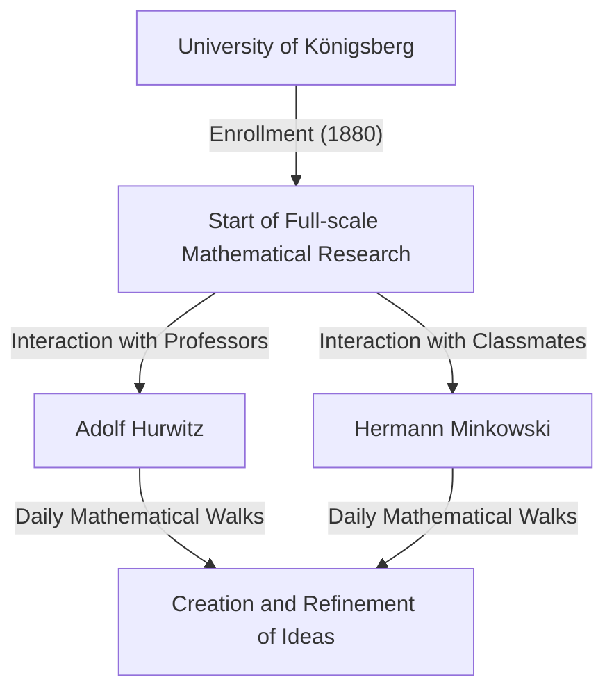
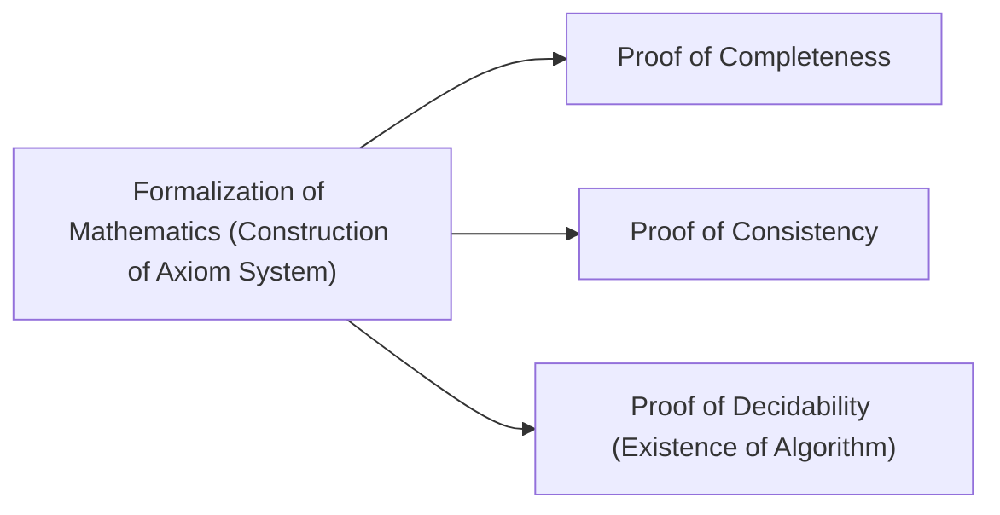

## 1. Introduction: The Father of Modern Mathematics

David Hilbert (January 23, 1862 – February 14, 1943) was a German mathematician, widely recognized as one of the most influential and greatest mathematicians of the late 19th and early 20th centuries. Often compared to his brilliant French contemporary Henri Poincaré, Hilbert emphasized strict logic and formalism, in contrast to Poincaré's reliance on intuition. Hilbert profoundly influenced almost every field of modern mathematics, earning him the moniker **"The King of Mathematics"**.

His contributions span invariant theory, algebraic number theory, the axiomatization of geometry, integral equations, functional analysis (Hilbert spaces), and theoretical physics (the mathematical foundations of general relativity). His greatest legacy lies not merely in solving isolated open problems, but in fundamentally reimagining the structure and nature of mathematics itself, establishing the new paradigms of axiomatism and formalism. In this article, we take a deep and detailed look back at the dramatic life episodes of Hilbert and his brilliant achievements.

## 2. Birth and Early Days in Königsberg: Awakening in the City of Learning

Hilbert was born on January 23, 1862, in Wehlau, near Königsberg (now Kaliningrad, Russia), the capital of the Province of East Prussia in the Kingdom of Prussia. His father, Otto Hilbert, was a strict district judge. His mother, Maria Therese, was a well-educated woman with a deep interest in philosophy and astronomy. It is said that Hilbert inherited his logical thinking and thirst for knowledge from his parents.

Königsberg was a city with deep academic roots; it was the birthplace of the great philosopher Immanuel Kant and was famous for the "Seven Bridges of Königsberg" problem solved by Leonhard Euler. During his school days, Hilbert's grades were unremarkable, but he possessed a special intuition and passion for mathematics. He loathed rote memorization, preferring to solve problems by constructing logic from scratch in his own mind. This approach—building from logical foundations rather than relying on memorization—became the core of his later mathematical style.

### "Mathematical Walks" and Lifelong Friends

In 1880, Hilbert entered the University of Königsberg, where he met two individuals who would change his life. One was the genius Hermann Minkowski, who had won the mathematics prize of the Paris Academy of Sciences at just 18 years old. The other was Adolf Hurwitz, a brilliant young professor.

The three of them made it a daily routine to take a walk under an apple tree near the university at a set time, passionately discussing the latest mathematical problems. These daily **"mathematical walks"** allowed the young Hilbert's mathematical talents to fully blossom. By clashing ideas with two minds possessing entirely different mathematical intuitions, Hilbert refined his own concepts and stepped into the depths of mathematics.

## 3. Breakthrough in Invariant Theory: Leaping Beyond Gordan's Criticism

Hilbert first gained worldwide fame in the field of invariant theory. Invariant theory studies the properties of polynomials that remain unchanged under coordinate transformations. At the time, Paul Gordan, the leading expert in this field, had proven that invariants of two variables have a finite basis (Gordan's theorem), but the case for three or more variables required exceedingly complex calculations and remained an unsolved problem for years.

In 1888, Hilbert tackled this challenge with an entirely new approach. Abandoning the traditional method of explicitly calculating and constructing the basis formulas, he used proof by contradiction to present an existence proof that **"a finite basis must exist"**. This powerful theorem is known today as **Hilbert's basis theorem**.

Legend has it that upon seeing this abstract proof completely devoid of calculation, Gordan angrily exclaimed, **"This is not mathematics. This is theology!"** (Das ist nicht Mathematik. Das ist Theologie!). Later, however, even Gordan had to admit the logical correctness and power of this method. Hilbert's achievement marked a historic turning point where the center of mathematics shifted from "construction via specific calculation" to "existence proof of abstract structures."

## 4. Algebraic Number Theory and the Monumental "Zahlbericht"

Following his success in invariant theory, Hilbert turned to algebraic number theory. Commissioned by the German Mathematical Society in 1897, he authored the "Zahlbericht" (Report on Numbers), a monumental work that synthesized existing knowledge of algebraic number theory and reconstructed it from an entirely new perspective.

In this report, he applied [Galois theory](https://kenji.blog/p/galois-theory/) to number theory, laying the foundations for Hilbert's class field theory. Class field theory, later perfected by Teiji Takagi and Emil Artin, is considered one of the most beautiful theories in 20th-century number theory. Hilbert managed to unify seemingly disparate results in number theory under higher, beautiful laws.

## 5. Axiomatization of Geometry: The Philosophy of "Tables, Chairs, and Beer Mugs"

In 1899, Hilbert published the book "Grundlagen der Geometrie" (Foundations of Geometry). It completely reconstructed the axiom system of Euclidean geometry, which had been the absolute foundation of geometry for over 2000 years, from a modern perspective.

Euclid's "Elements" contained several implicit assumptions and elements reliant on visual intuition. Hilbert rigorously eliminated these, presenting a strictly defined axiom system consisting of five groups: axioms of incidence, order, congruence, parallels, and continuity.

He famously stated, **"One must be able to say at all times—instead of points, straight lines, and planes—tables, chairs, and beer mugs."** This was a resounding declaration of **formalism**, stripping geometry of any intuitive or physical reality regarding what the objects are, and establishing only the logical relationships between the objects as the foundation of mathematics. This groundbreaking approach became the standard style of the axiomatic method in modern mathematics.

## 6. Invitation to the University of Göttingen and the Dawn of a Golden Age

In 1895, thanks to the strong recommendation of Felix Klein, a heavyweight in German mathematics, Hilbert was appointed professor at the University of Göttingen. Göttingen was already renowned as a sacred ground for mathematics, having once been home to Carl Friedrich Gauss and Bernhard Riemann.

With Hilbert's arrival, Göttingen firmly reestablished itself as the world's premier mathematical center. His lectures were always clear and brimming with passion for new mathematical ideas, attracting brilliant students and researchers from around the globe. Many superstars who would later lead 20th-century mathematics, such as Emmy Noether, Hermann Weyl, Richard Courant, and John von Neumann, were mentored by Hilbert.

The anecdote regarding Emmy Noether is particularly famous. At the time, university rules prohibited women from holding academic positions. Hilbert, highly valuing her exceptional talent in algebra, fiercely protested at the faculty meeting, declaring, **"The university senate is not a bathhouse, so gender does not matter!"** This statement vividly illustrates his progressive, meritocratic, and unprejudiced character.

## 7. The 1900 Paris International Congress of Mathematicians: Hilbert's 23 Problems

In 1900, at the second International Congress of Mathematicians (ICM) held in Paris, Hilbert delivered a historic and monumental address. Asking "What are the problems that will guide the progress of mathematics in the coming century?", he presented **"23 unsolved problems"** that 20th-century mathematicians should strive to solve.

These problems encompassed all fields of mathematics at the time and served as a massive driving force for subsequent mathematical development. Here are a few of the most famous ones:

1. **The Continuum Hypothesis** (1st Problem): Is there a set whose cardinality is strictly between that of the integers and the real numbers? Later, Gödel and Cohen proved that this is independent of the standard ZFC axioms.
2. **The Consistency of the Axioms of Arithmetic** (2nd Problem): Prove that the axioms of arithmetic are consistent using only finitistic methods.
3. **The Equality of Volumes of Two Tetrahedra of Equal Bases and Equal Altitudes** (3rd Problem): Can two such polyhedra always be partitioned into finitely many pieces and reassembled into each other? This was resolved negatively by his student Max Dehn.
6. **Axiomatization of Physics** (6th Problem): Axiomatize branches of physics where mathematics plays a crucial role, such as probability theory and mechanics.
8. **Problems Concerning Prime Number Distribution** (8th Problem): The infamous Riemann Hypothesis and Goldbach's Conjecture. These remain unsolved today.
10. **Determination of the Solvability of a Diophantine Equation** (10th Problem): Find a general algorithm to determine whether a given polynomial equation with integer coefficients has an integer solution. In 1970, Matiyasevich proved that no such algorithm exists.

Hilbert's problems remain crucial signposts for modern mathematicians even today.

## 8. Integral Equations and Hilbert Space: A Bridge to Quantum Mechanics

Entering the 1900s, Hilbert's interest shifted from algebra and geometry to analysis. He deeply studied the integral equation theory of the Swedish mathematician Ivar Fredholm and constructed a spectral theory in infinite-dimensional spaces.

Through this process, he introduced the concept of **Hilbert space**, a generalization of finite-dimensional Euclidean space into infinite dimensions. The inner product $\langle x, y \rangle$ in an inner product space $\mathcal{H}$ is strictly defined as a space that possesses linearity and Hermitian symmetry, and satisfies completeness (all Cauchy sequences converge). Expressed mathematically, the inner product satisfies:

$$
\langle a x_1 + b x_2, y \rangle = a \langle x_1, y \rangle + b \langle x_2, y \rangle
$$
$$
\langle x, y \rangle = \overline{\langle y, x \rangle}
$$

Here, $x, y, x_1, x_2 \in \mathcal{H}$ and $a, b \in \mathbb{C}$ (complex numbers), and $\overline{\langle y, x \rangle}$ denotes the complex conjugate. The norm is induced by $\|x\| = \sqrt{\langle x, x \rangle}$.

Astonishingly, this abstract theory, which Hilbert constructed out of pure mathematical curiosity, turned out decades later to be the perfect mathematical language for describing the states of physical systems in the newly born quantum mechanics. When Werner Heisenberg formulated matrix mechanics and Erwin Schrödinger formulated wave mechanics, the theory of Hilbert spaces became an indispensable tool, primarily through the work of John von Neumann. It is a stunning example of mathematics anticipating physics.

## 9. Foray into Physics and the Einstein-Hilbert Action

Hilbert often joked that "physics is too difficult for physicists," and he aimed to reconstruct the foundations of physics using rigorous mathematical axiomatic methods (related to his 6th problem).

In 1915, during the period when Albert Einstein was struggling to complete the gravitational field equations for general relativity, Hilbert was also working on the problem. Using the mathematically elegant technique of the variational principle, Hilbert derived the correct gravitational field equations almost simultaneously with Einstein. Today, the action integral underlying this theory is known as the **Einstein-Hilbert action**.

$$
S = \int \left( \frac{R}{16 \pi G} + \mathcal{L}_M \right) \sqrt{-g} \, d^4x
$$

Meaning of the formula: Here, $R$ is the scalar curvature representing the curvature of spacetime, $G$ is Newton's gravitational constant, $g$ is the determinant of the metric tensor, $\mathcal{L}_M$ is the Lagrangian density of the matter fields, and $\text{the integration is performed over the entire spacetime}$.

While a priority dispute between Einstein and Hilbert could have arisen, Hilbert deeply respected Einstein's magnificent physical intuition and publicly stated that "it was Einstein who discovered this equation," never asserting priority himself.

## 10. Hilbert's Program: The Quest for Absolute Consistency in Mathematics

Following World War I, in response to the "crisis in the foundations of mathematics" sparked by paradoxes in set theory (such as Russell's paradox), Hilbert proposed the most ambitious project of his life: **Hilbert's Program**.

He sought to reconstruct all of mathematics as a "formal system," treating all mathematical propositions as meaningless strings of symbols and manipulating them according to mechanical rules of inference. His goal was to mathematically prove—using only secure, finitistic reasoning—that contradictions such as " $0 = 1$ " could absolutely never be derived within that system (consistency).

This program triggered fierce debates (the foundational crisis) with intuitionists like L. E. J. Brouwer. However, Hilbert boldly pushed his program forward, declaring, "No one shall expel us from the paradise that Cantor has created for us."

## 11. The Shock of Gödel's Incompleteness Theorems and the Program's Transformation

However, in 1931, the young Austrian logician Kurt Gödel published his **incompleteness theorems**, delivering a decisive blow to Hilbert's Program.

Gödel mathematically and perfectly proved that in any sufficiently powerful formal system containing the axioms of arithmetic, there will always exist propositions that are "true within the system but cannot be proven or disproven" (First Incompleteness Theorem), and that "it is impossible to prove the consistency of the system within the system itself" (Second Incompleteness Theorem).

This demonstrated that the construction of the "perfect mathematical system where everything can be proven, including its own consistency," which Hilbert had dreamed of, was impossible. Although Hilbert was reportedly initially deeply disappointed and angered by this result, the rigorous methods of metamathematics and formal logic developed during the pursuit of Hilbert's Program ultimately led directly to the founding of computer science and theoretical computer science by Alan Turing.

## 12. Late Years in Göttingen: The Rise of the Nazis and the End of a Mathematical Sanctuary

In the 1930s, the Nazi Party, led by Adolf Hitler, seized power in Germany. The "Law for the Restoration of the Professional Civil Service" was enacted in 1933, resulting in the ruthless expulsion of many outstanding Jewish mathematicians and dissident scholars at the University of Göttingen, including Emmy Noether, Hermann Weyl, Richard Courant, and Max Born.

Göttingen, once a vibrant mathematical sanctuary where talent from all over the world gathered, collapsed almost overnight. Once, at a banquet, the Nazi Minister of Education Bernhard Rust asked Hilbert, "How is mathematics at your institution now that it has been freed from the Jewish influence?" Hilbert replied with anger and sorrow: "Mathematical Institute? There is really none any more."

On February 14, 1943, in the midst of World War II, Hilbert passed away in solitude at the age of 81 in Göttingen, after most of his former students had fled to America and elsewhere. Very few people attended his funeral.

## 13. Conclusion: "We Must Know, We Will Know"

Even after David Hilbert's passing, the mathematical legacy he left behind has never faded. The trajectory of his thoughts is inscribed in every corner of modern mathematics.

On his tombstone are engraved the famous words that concluded his retirement speech in his hometown of Königsberg in 1930, demonstrating his unwavering, absolute faith in human reason and scientific inquiry. This was a powerful rebuttal to the pessimistic agnosticism of the time, summarized by the phrase "ignoramus et ignorabimus" (we do not know and will not know).

> **Wir müssen wissen.**
> **Wir werden wissen.**
> (We must know. We will know.)

David Hilbert deeply believed in the infinite possibilities of mathematics and continued to pioneer its frontiers throughout his life. His resilient spirit, philosophy, and brilliant achievements have become the very flesh and blood of modern mathematicians, breathing life into every corner of mathematics today and continuing to inspire future explorers.

## Chronology

* **1862**: Born in Wehlau, near Königsberg, East Prussia.
* **1880**: Enters the University of Königsberg. Meets Minkowski and Hurwitz.
* **1885**: Obtains his Ph.D. from the University of Königsberg.
* **1888**: Proves "Hilbert's basis theorem" in invariant theory.
* **1895**: Appointed professor at the University of Göttingen at Klein's invitation.
* **1897**: Publishes the "Zahlbericht" on algebraic number theory.
* **1899**: Publishes "Foundations of Geometry", axiomatizing geometry.
* **1900**: Presents his "23 problems" at the International Congress of Mathematicians in Paris.
* **1909**: Positively resolves Waring's problem.
* **1915**: Formulates the "Einstein-Hilbert action" in general relativity.
* **1920s**: Proposes "Hilbert's Program."
* **1930**: Retires from the University of Göttingen. Delivers the "We must know, we will know" speech.
* **1943**: Dies at the age of 81 in Göttingen.
