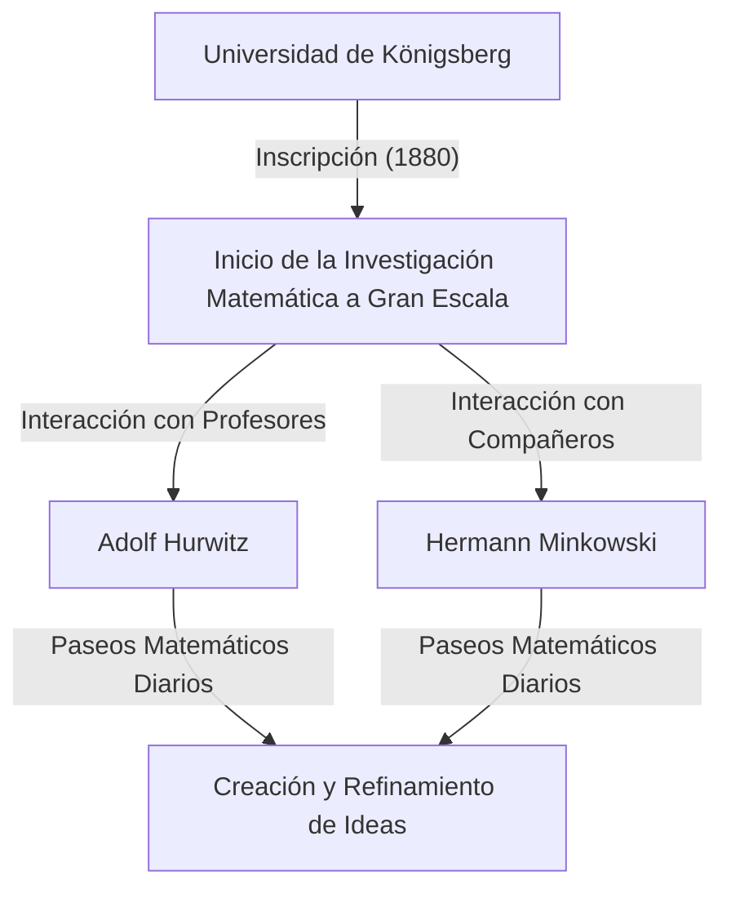
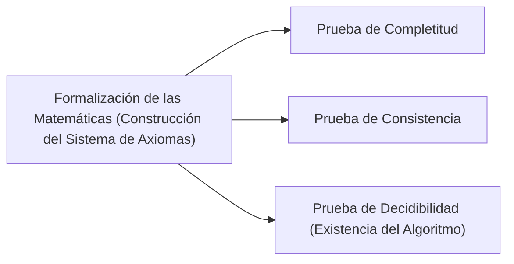

## 1. Introducción: El Padre de la Matemática Moderna

[David Hilbert](https://kenji.blog/es/p/hilbert/) (23 de enero de 1862 – 14 de febrero de 1943) fue un matemático alemán, ampliamente reconocido como uno de los matemáticos más influyentes y grandes de finales del siglo XIX y principios del siglo XX. A menudo comparado con su brillante contemporáneo francés [Henri Poincaré](https://kenji.blog/es/p/poincare/), Hilbert enfatizó la lógica estricta y el formalismo, en contraste con la dependencia de Poincaré en la intuición. Hilbert influyó profundamente en casi todos los campos de la matemática moderna, ganándose el apodo de **"El Rey de las Matemáticas"**.

Sus contribuciones abarcan la teoría de invariantes, la teoría de números algebraicos, la axiomatización de la geometría, las ecuaciones integrales, el análisis funcional (espacios de Hilbert) y la física teórica (los fundamentos matemáticos de la relatividad general). Su mayor legado no radica simplemente en resolver problemas abiertos aislados, sino en reimaginar fundamentalmente la estructura y la naturaleza de las matemáticas en sí, estableciendo los nuevos paradigmas del axiomatismo y el formalismo. En este artículo, echamos un vistazo profundo y detallado a los dramáticos episodios de la vida de Hilbert y sus brillantes logros.

## 2. Nacimiento y Primeros Días en Königsberg: Despertar en la Ciudad del Aprendizaje

Hilbert nació el 23 de enero de 1862, en Wehlau, cerca de Königsberg (ahora Kaliningrado, Rusia), la capital de la Provincia de Prusia Oriental en el Reino de Prusia. Su padre, Otto Hilbert, era un juez de distrito estricto. Su madre, Maria Therese, era una mujer bien educada con un profundo interés en la filosofía y la astronomía. Se dice que Hilbert heredó su pensamiento lógico y su sed de conocimiento de sus padres.

Königsberg era una ciudad con profundas raíces académicas; fue el lugar de nacimiento del gran filósofo Immanuel Kant y era famosa por el problema de los "Siete puentes de Königsberg" resuelto por [Leonhard Euler](https://kenji.blog/es/p/euler/). Durante sus días de escuela, las calificaciones de Hilbert no fueron notables, pero poseía una intuición y pasión especiales por las matemáticas. Odiaba la memorización, prefiriendo resolver problemas construyendo la lógica desde cero en su propia mente. Este enfoque—construir a partir de fundamentos lógicos en lugar de depender de la memorización—se convirtió en el núcleo de su posterior estilo matemático.

### "Paseos Matemáticos" y Amigos de Toda la Vida

En 1880, Hilbert ingresó a la Universidad de Königsberg, donde conoció a dos personas que cambiarían su vida. Uno era el genio Hermann Minkowski, quien había ganado el premio de matemáticas de la Academia de Ciencias de París con solo 18 años. El otro era Adolf Hurwitz, un brillante y joven profesor.

Los tres convirtieron en una rutina diaria dar un paseo bajo un manzano cerca de la universidad a una hora fija, discutiendo apasionadamente los últimos problemas matemáticos. Estos **"paseos matemáticos"** diarios permitieron que los talentos matemáticos del joven Hilbert florecieran por completo. Al confrontar ideas con dos mentes que poseían intuiciones matemáticas completamente diferentes, Hilbert refinó sus propios conceptos y se adentró en las profundidades de las matemáticas.

## 3. Avance en la Teoría de Invariantes: Saltando más allá de la Crítica de Gordan

Hilbert ganó fama mundial por primera vez en el campo de la teoría de invariantes. La teoría de invariantes estudia las propiedades de los polinomios que permanecen sin cambios bajo transformaciones de coordenadas. En ese momento, Paul Gordan, el principal experto en este campo, había demostrado que los invariantes de dos variables tienen una base finita (teorema de Gordan), pero el caso de tres o más variables requería cálculos extremadamente complejos y permaneció como un problema sin resolver durante años.

En 1888, Hilbert abordó este desafío con un enfoque completamente nuevo. Abandonando el método tradicional de calcular y construir explícitamente las fórmulas de base, utilizó la prueba por contradicción para presentar una prueba de existencia de que **"debe existir una base finita"**. Este poderoso teorema se conoce hoy como el **teorema de la base de Hilbert**.

Cuenta la leyenda que al ver esta prueba abstracta completamente desprovista de cálculo, Gordan exclamó enojado: **"¡Esto no son matemáticas. ¡Esto es teología!"** (Das ist nicht Mathematik. Das ist Theologie!). Más tarde, sin embargo, incluso Gordan tuvo que admitir la exactitud lógica y el poder de este método. El logro de Hilbert marcó un punto de inflexión histórico donde el centro de las matemáticas pasó de "la construcción a través del cálculo específico" a "la prueba de la existencia de estructuras abstractas".

## 4. Teoría de Números Algebraicos y el Monumental "Zahlbericht"

Tras su éxito en la teoría de invariantes, Hilbert se dedicó a la teoría de números algebraicos. Encargado por la Sociedad Matemática Alemana en 1897, fue autor del "Zahlbericht" (Informe sobre los Números), una obra monumental que sintetizó el conocimiento existente sobre la teoría de números algebraicos y lo reconstruyó desde una perspectiva completamente nueva.

En este informe, aplicó la teoría de Galois a la teoría de números, sentando las bases de la teoría de cuerpos de clases de Hilbert. La teoría de cuerpos de clases, perfeccionada más tarde por Teiji Takagi y Emil Artin, se considera una de las teorías más bellas de la teoría de números del siglo XX. Hilbert logró unificar resultados aparentemente dispares en la teoría de números bajo leyes superiores y hermosas.

## 5. Axiomatización de la Geometría: La Filosofía de "Mesas, Sillas y Jarras de Cerveza"

En 1899, Hilbert publicó el libro "Grundlagen der Geometrie" (Fundamentos de la Geometría). Reconstruyó por completo el sistema axiomático de la geometría euclidiana, que había sido el fundamento absoluto de la geometría durante más de 2000 años, desde una perspectiva moderna.

Los "Elementos" de [[[Euclid](https://kenji.blog/es/p/euclid/)e](https://kenji.blog/p/euclid/)s](https://kenji.blog/p/euclid/) contenían varias suposiciones implícitas y elementos dependientes de la intuición visual. Hilbert los eliminó rigurosamente, presentando un sistema de axiomas estrictamente definido que constaba de cinco grupos: axiomas de incidencia, orden, congruencia, paralelismo y continuidad.

Declaró célebremente: **"Uno debe poder decir en todo momento, en lugar de puntos, líneas rectas y planos, mesas, sillas y jarras de cerveza"**. Esta fue una declaración rotunda de **formalismo**, despojando a la geometría de cualquier realidad intuitiva o física con respecto a lo que son los objetos, y estableciendo solo las relaciones lógicas entre los objetos como el fundamento de las matemáticas. Este enfoque innovador se convirtió en el estilo estándar del método axiomático en las matemáticas modernas.

## 6. Invitación a la Universidad de Gotinga y el Amanecer de una Edad de Oro

En 1895, gracias a la fuerte recomendación de Felix Klein, un peso pesado en la matemática alemana, Hilbert fue nombrado profesor en la Universidad de Gotinga. Gotinga ya era famosa como tierra sagrada para las matemáticas, habiendo sido el hogar de [Carl Friedrich Gauss](https://kenji.blog/es/p/gauss/) y [Bernhard Riemann](https://kenji.blog/es/p/riemann/).

Con la llegada de Hilbert, Gotinga se restableció firmemente como el principal centro matemático del mundo. Sus conferencias siempre fueron claras y rebosantes de pasión por las nuevas ideas matemáticas, atrayendo a estudiantes e investigadores brillantes de todo el mundo. Muchas superestrellas que luego liderarían las matemáticas del siglo XX, como [Emmy Noether](https://kenji.blog/es/p/noether/), Hermann Weyl, Richard Courant y John von Neumann, fueron guiados por Hilbert.

La anécdota sobre [Emmy Noether](https://kenji.blog/es/p/noether/) es particularmente famosa. En ese momento, las reglas de la universidad prohibían a las mujeres ocupar puestos académicos. Hilbert, valorando mucho su talento excepcional en el álgebra, protestó ferozmente en la reunión de la facultad, declarando: **"¡El senado de la universidad no es una casa de baños, por lo que el género no importa!"** Esta declaración ilustra vívidamente su carácter progresista, meritocrático y sin prejuicios.

## 7. El Congreso Internacional de Matemáticos de París de 1900: Los 23 Problemas de Hilbert

En 1900, en el Segundo Congreso Internacional de Matemáticos (ICM) celebrado en París, Hilbert pronunció un discurso histórico y monumental. Al preguntar "¿Cuáles son los problemas que guiarán el progreso de las matemáticas en el próximo siglo?", presentó **"23 problemas sin resolver"** que los matemáticos del siglo XX deberían esforzarse por resolver.

Estos problemas abarcaban todos los campos de las matemáticas en ese momento y sirvieron como una fuerza impulsora masiva para el desarrollo matemático posterior. Estos son algunos de los más famosos:

1. **La Hipótesis del Continuo** (1er Problema): ¿Existe un conjunto cuya cardinalidad esté estrictamente entre la de los enteros y la de los números reales? Más tarde, Gödel y Cohen demostraron que esto es independiente de los axiomas estándar ZFC.
2. **La Consistencia de los Axiomas de la Aritmética** (2º Problema): Demostrar que los axiomas de la aritmética son consistentes utilizando únicamente métodos finitistas.
3. **La Igualdad de Volúmenes de Dos Tetraedros de Bases Iguales y Alturas Iguales** (3er Problema): ¿Se pueden dividir siempre dos de estos poliedros en un número finito de piezas y volver a ensamblarlos entre sí? Esto fue resuelto negativamente por su alumno Max Dehn.
6. **Axiomatización de la Física** (6º Problema): Axiomatizar ramas de la física en las que las matemáticas juegan un papel crucial, como la teoría de la probabilidad y la mecánica.
8. **Problemas sobre la Distribución de los Números Primos** (8º Problema): La infame Hipótesis de Riemann y la Conjetura de Goldbach. Estos siguen sin resolverse hoy en día.
10. **Determinación de la Resolubilidad de una Ecuación Diofántica** (10º Problema): Encontrar un algoritmo general para determinar si una ecuación polinómica dada con coeficientes enteros tiene una solución entera. En 1970, Matiyasevich demostró que tal algoritmo no existe.

Los problemas de Hilbert siguen siendo hitos cruciales para los matemáticos modernos incluso hoy en día.

## 8. Ecuaciones Integrales y Espacio de Hilbert: Un Puente hacia la Mecánica Cuántica

Al entrar en la década de 1900, el interés de Hilbert se desplazó del álgebra y la geometría al análisis. Estudió profundamente la teoría de ecuaciones integrales del matemático sueco Ivar Fredholm y construyó una teoría espectral en espacios de dimensión infinita.

A través de este proceso, introdujo el concepto del **espacio de Hilbert**, una generalización del espacio euclidiano de dimensión finita a dimensiones infinitas. El producto interno $\langle x, y \rangle$ en un espacio de producto interno $\mathcal{H}$ está estrictamente definido como un espacio que posee linealidad y simetría hermítica, y satisface la completitud (todas las sucesiones de Cauchy convergen). Expresado matemáticamente, el producto interno satisface:

$$
\langle a x_1 + b x_2, y \rangle = a \langle x_1, y \rangle + b \langle x_2, y \rangle
$$
$$
\langle x, y \rangle = \overline{\langle y, x \rangle}
$$

Aquí, $x, y, x_1, x_2 \in \mathcal{H}$ y $a, b \in \mathbb{C}$ (números complejos), y $\overline{\langle y, x \rangle}$ denota el conjugado complejo. La norma es inducida por $\|x\| = \sqrt{\langle x, x \rangle}$.

Sorprendentemente, esta teoría abstracta, que Hilbert construyó por pura curiosidad matemática, resultó décadas más tarde ser el lenguaje matemático perfecto para describir los estados de los sistemas físicos en la recién nacida mecánica cuántica. Cuando Werner Heisenberg formuló la mecánica matricial y Erwin Schrödinger formuló la mecánica ondulatoria, la teoría de los espacios de Hilbert se convirtió en una herramienta indispensable, principalmente a través del trabajo de John von Neumann. Es un ejemplo sorprendente de las matemáticas anticipándose a la física.

## 9. Incursión en la Física y la Acción de Einstein-Hilbert

Hilbert a menudo bromeaba diciendo que "la física es demasiado difícil para los físicos", y su objetivo era reconstruir los fundamentos de la física utilizando métodos axiomáticos matemáticos rigurosos (relacionado con su sexto problema).

En 1915, durante el período en que Albert Einstein luchaba por completar las ecuaciones del campo gravitatorio de la relatividad general, Hilbert también estaba trabajando en el problema. Utilizando la técnica matemáticamente elegante del principio variacional, Hilbert derivó las ecuaciones correctas del campo gravitatorio casi simultáneamente con Einstein. En la actualidad, la integral de acción en la que se basa esta teoría se conoce como la **acción de Einstein-Hilbert**.

$$
S = \int \left( \frac{R}{16 \pi G} + \mathcal{L}_M \right) \sqrt{-g} \, d^4x
$$

Significado de la fórmula: Aquí, $R$ es la curvatura escalar que representa la curvatura del espaciotiempo, $G$ es la constante gravitacional de Newton, $g$ es el determinante del tensor métrico, $\mathcal{L}_M$ es la densidad lagrangiana de los campos de materia, y $\text{la integración se realiza sobre todo el espaciotiempo}$.

Si bien podría haber surgido una disputa de prioridad entre Einstein y Hilbert, Hilbert respetaba profundamente la magnífica intuición física de Einstein y declaró públicamente que "fue Einstein quien descubrió esta ecuación", sin afirmar nunca la prioridad él mismo.

## 10. El Programa de Hilbert: La Búsqueda de la Consistencia Absoluta en las Matemáticas

Después de la Primera Guerra Mundial, en respuesta a la "crisis de los fundamentos de las matemáticas" provocada por las paradojas en la teoría de conjuntos (como la paradoja de Russell), Hilbert propuso el proyecto más ambicioso de su vida: **El Programa de Hilbert**.

Buscó reconstruir todas las matemáticas como un "sistema formal", tratando todas las proposiciones matemáticas como cadenas de símbolos sin sentido y manipulándolas de acuerdo con reglas mecánicas de inferencia. Su objetivo era demostrar matemáticamente, utilizando solo razonamiento seguro y finitista, que las contradicciones como " $0 = 1$ " nunca podrían derivarse dentro de ese sistema (consistencia).

Este programa desencadenó feroces debates (la crisis de los fundamentos) con intuicionistas como L. E. J. Brouwer. Sin embargo, Hilbert impulsó audazmente su programa, declarando: "Nadie nos expulsará del paraíso que Cantor ha creado para nosotros".

## 11. El Impacto de los Teoremas de Incompletitud de Gödel y la Transformación del Programa

Sin embargo, en 1931, el joven lógico austriaco [Kurt Gödel](https://kenji.blog/es/p/godel/) publicó sus **teoremas de incompletitud**, asestando un golpe decisivo al Programa de Hilbert.

Gödel demostró matemática y perfectamente que en cualquier sistema formal lo suficientemente poderoso que contenga los axiomas de la aritmética, siempre existirán proposiciones que son "verdaderas dentro del sistema pero no se pueden probar ni refutar" (Primer Teorema de Incompletitud), y que "es imposible demostrar la consistencia del sistema dentro del propio sistema" (Segundo Teorema de Incompletitud).

Esto demostró que la construcción del "sistema matemático perfecto donde todo se puede probar, incluida su propia consistencia", con el que Hilbert había soñado, era imposible. Aunque se dice que Hilbert se sintió inicialmente profundamente decepcionado y enojado por este resultado, los métodos rigurosos de la metamatemática y la lógica formal desarrollados durante la búsqueda del Programa de Hilbert llevaron finalmente directamente a la fundación de la informática y la informática teórica por [Alan Turing](https://kenji.blog/es/p/turing/).

## 12. Los Últimos Años en Gotinga: El Ascenso de los Nazis y el Fin de un Santuario Matemático

En la década de 1930, el Partido Nazi, dirigido por Adolf Hitler, tomó el poder en Alemania. La "Ley para la Restauración del Servicio Civil Profesional" se promulgó en 1933, lo que resultó en la expulsión despiadada de muchos destacados matemáticos judíos y académicos disidentes en la Universidad de Gotinga, incluidos [Emmy Noether](https://kenji.blog/es/p/noether/), Hermann Weyl, Richard Courant y Max Born.

Gotinga, una vez un vibrante santuario matemático donde se reunía el talento de todo el mundo, colapsó casi de la noche a la mañana. Una vez, en un banquete, el Ministro de Educación nazi, Bernhard Rust, le preguntó a Hilbert: "¿Cómo son las matemáticas en su instituto ahora que ha sido liberado de la influencia judía?" Hilbert respondió con ira y tristeza: "¿Instituto de Matemáticas? En realidad ya no hay ninguno".

El 14 de febrero de 1943, en medio de la Segunda Guerra Mundial, Hilbert falleció en soledad a la edad de 81 años en Gotinga, después de que la mayoría de sus antiguos alumnos hubieran huido a Estados Unidos y otros lugares. Muy pocas personas asistieron a su funeral.

## 13. Conclusión: "Debemos Saber, Sabremos"

Incluso después de la muerte de [David Hilbert](https://kenji.blog/es/p/hilbert/), el legado matemático que dejó nunca se ha desvanecido. La trayectoria de sus pensamientos está inscrita en cada rincón de la matemática moderna.

En su lápida están grabadas las famosas palabras que concluyeron su discurso de jubilación en su ciudad natal de Königsberg en 1930, demostrando su fe inquebrantable y absoluta en la razón humana y la investigación científica. Esta fue una poderosa refutación al agnosticismo pesimista de la época, resumido por la frase "ignoramus et ignorabimus" (no sabemos y no sabremos).

> **Wir müssen wissen.**
> **Wir werden wissen.**
> (Debemos saber. Sabremos.)

[David Hilbert](https://kenji.blog/es/p/hilbert/) creía profundamente en las infinitas posibilidades de las matemáticas y continuó siendo pionero en sus fronteras a lo largo de su vida. Su espíritu resistente, su filosofía y sus brillantes logros se han convertido en la propia carne y hueso de los matemáticos modernos, dando vida a todos los rincones de las matemáticas en la actualidad y continuando inspirando a los futuros exploradores.

## Cronología

* **1862**: Nace en Wehlau, cerca de Königsberg, Prusia Oriental.
* **1880**: Ingresa a la Universidad de Königsberg. Conoce a Minkowski y Hurwitz.
* **1885**: Obtiene su doctorado en la Universidad de Königsberg.
* **1888**: Demuestra el "teorema de la base de Hilbert" en la teoría de invariantes.
* **1895**: Nombrado profesor en la Universidad de Gotinga por invitación de Klein.
* **1897**: Publica el "Zahlbericht" sobre la teoría de números algebraicos.
* **1899**: Publica "Fundamentos de la Geometría", axiomatizando la geometría.
* **1900**: Presenta sus "23 problemas" en el Congreso Internacional de Matemáticos en París.
* **1909**: Resuelve positivamente el problema de Waring.
* **1915**: Formula la "acción de Einstein-Hilbert" en relatividad general.
* **Década de 1920**: Propone "El Programa de Hilbert".
* **1930**: Se jubila de la Universidad de Gotinga. Pronuncia el discurso "Debemos saber, sabremos".
* **1943**: Muere a la edad de 81 años en Gotinga.
