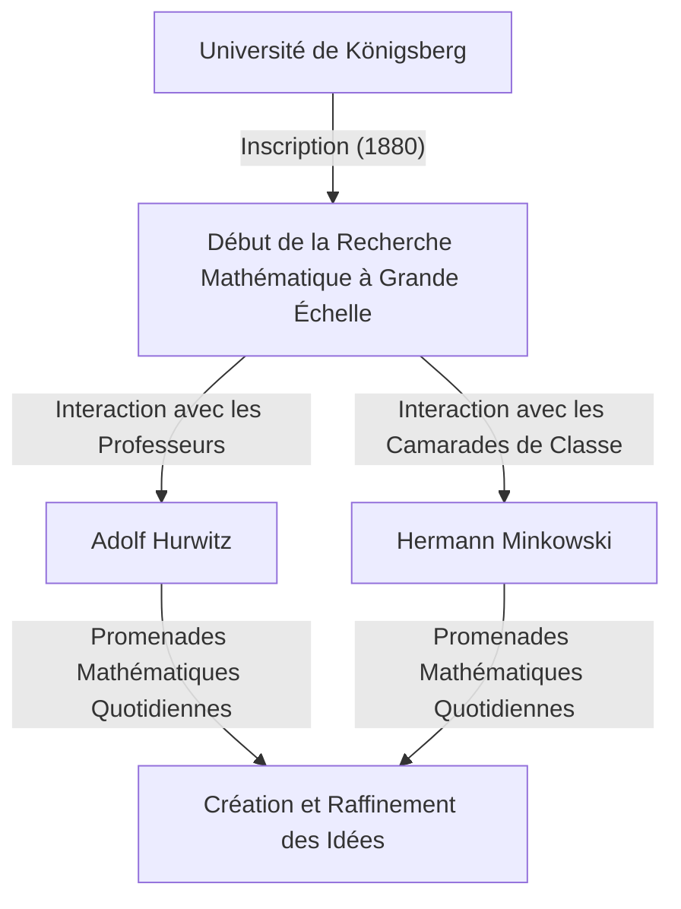
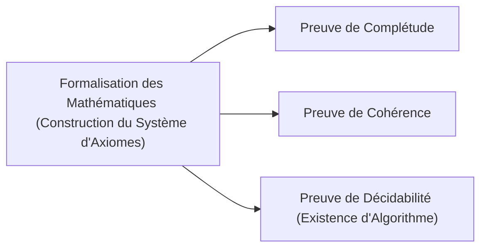

## 1. Introduction : Le Père des Mathématiques Modernes

David Hilbert (23 janvier 1862 – 14 février 1943) était un mathématicien allemand, largement reconnu comme l'un des mathématiciens les plus influents et les plus grands de la fin du XIXe et du début du XXe siècle. Souvent comparé à son brillant contemporain français Henri Poincaré, Hilbert mettait l'accent sur la logique stricte et le formalisme, contrairement à Poincaré qui s'appuyait sur l'intuition. Hilbert a profondément influencé presque tous les domaines des mathématiques modernes, ce qui lui a valu le surnom de **"Le Roi des Mathématiques"**.

Ses contributions couvrent la théorie des invariants, la théorie algébrique des nombres, l'axiomatisation de la géométrie, les équations intégrales, l'analyse fonctionnelle (espaces de Hilbert) et la physique théorique (les fondements mathématiques de la relativité générale). Son plus grand héritage ne réside pas simplement dans la résolution de problèmes ouverts isolés, mais dans la réinvention fondamentale de la structure et de la nature des mathématiques elles-mêmes, en établissant les nouveaux paradigmes de l'axiomatisme et du formalisme. Dans cet article, nous jetons un regard profond et détaillé sur les épisodes dramatiques de la vie de Hilbert et sur ses brillantes réalisations.

## 2. Naissance et Premiers Jours à Königsberg : L'Éveil dans la Cité du Savoir

Hilbert est né le 23 janvier 1862 à Wehlau, près de Königsberg (aujourd'hui Kaliningrad, Russie), la capitale de la province de Prusse-Orientale dans le Royaume de Prusse. Son père, Otto Hilbert, était un juge de district strict. Sa mère, Maria Therese, était une femme bien instruite, profondément intéressée par la philosophie et l'astronomie. On dit qu'Hilbert a hérité de la pensée logique et de la soif de connaissances de ses parents.

Königsberg était une ville aux racines académiques profondes ; c'était le lieu de naissance du grand philosophe Emmanuel Kant et elle était célèbre pour le problème des "Sept ponts de Königsberg" résolu par Leonhard Euler. Pendant ses années d'école, les notes d'Hilbert étaient ordinaires, mais il possédait une intuition et une passion particulières pour les mathématiques. Il détestait l'apprentissage par cœur, préférant résoudre les problèmes en construisant la logique de toutes pièces dans son propre esprit. Cette approche — construire à partir de fondations logiques plutôt que de s'appuyer sur la mémorisation — est devenue le cœur de son style mathématique ultérieur.

### "Promenades Mathématiques" et Amis de Toujours

En 1880, Hilbert est entré à l'Université de Königsberg, où il a rencontré deux personnes qui allaient changer sa vie. L'un était le génie Hermann Minkowski, qui avait remporté le prix de mathématiques de l'Académie des Sciences de Paris à seulement 18 ans. L'autre était Adolf Hurwitz, un jeune professeur brillant.

Tous les trois ont pris pour habitude quotidienne de se promener sous un pommier près de l'université à une heure précise, discutant passionnément des derniers problèmes mathématiques. Ces **"promenades mathématiques"** quotidiennes ont permis aux jeunes talents mathématiques d'Hilbert de s'épanouir pleinement. En confrontant ses idées avec deux esprits possédant des intuitions mathématiques complètement différentes, Hilbert a affiné ses propres concepts et s'est enfoncé dans les profondeurs des mathématiques.

## 3. Percée dans la Théorie des Invariants : Au-delà de la Critique de Gordan

Hilbert a d'abord acquis une renommée mondiale dans le domaine de la théorie des invariants. La théorie des invariants étudie les propriétés des polynômes qui restent inchangées sous les transformations de coordonnées. À l'époque, Paul Gordan, le principal expert dans ce domaine, avait prouvé que les invariants à deux variables ont une base finie (théorème de Gordan), mais le cas pour trois variables ou plus nécessitait des calculs extrêmement complexes et est resté un problème non résolu pendant des années.

En 1888, Hilbert a relevé ce défi avec une approche entièrement nouvelle. Abandonnant la méthode traditionnelle consistant à calculer et à construire explicitement les formules de base, il a utilisé le raisonnement par l'absurde pour présenter une preuve d'existence selon laquelle **"une base finie doit exister"**. Ce puissant théorème est connu aujourd'hui sous le nom de **théorème de la base de Hilbert**.

La légende raconte qu'en voyant cette preuve abstraite complètement dépourvue de calcul, Gordan s'est exclamé avec colère : **"Ce ne sont pas des mathématiques. C'est de la théologie !"** (Das ist nicht Mathematik. Das ist Theologie!). Plus tard, cependant, même Gordan dut admettre l'exactitude logique et la puissance de cette méthode. La réalisation d'Hilbert a marqué un tournant historique où le centre des mathématiques est passé de "la construction par calcul spécifique" à "la preuve d'existence de structures abstraites".

## 4. Théorie Algébrique des Nombres et le Monumental "Zahlbericht"

Suite à son succès dans la théorie des invariants, Hilbert s'est tourné vers la théorie algébrique des nombres. Commandé par la Société Mathématique Allemande en 1897, il fut l'auteur du "Zahlbericht" (Rapport sur les Nombres), une œuvre monumentale qui synthétisa les connaissances existantes de la théorie algébrique des nombres et les reconstruisit d'un point de vue entièrement nouveau.

Dans ce rapport, il a appliqué la théorie de Galois à la théorie des nombres, jetant les bases de la théorie des corps de classes de Hilbert. La théorie des corps de classes, perfectionnée plus tard par Teiji Takagi et Emil Artin, est considérée comme l'une des plus belles théories de la théorie des nombres du XXe siècle. Hilbert a réussi à unifier des résultats apparemment disparates en théorie des nombres sous des lois supérieures et magnifiques.

## 5. Axiomatisation de la Géométrie : La Philosophie des "Tables, Chaises et Chopes de Bière"

En 1899, Hilbert a publié le livre "Grundlagen der Geometrie" (Les Fondements de la Géométrie). Il a complètement reconstruit le système d'axiomes de la géométrie euclidienne, qui avait été le fondement absolu de la géométrie pendant plus de 2000 ans, d'un point de vue moderne.

Les "Éléments" d'Euclide contenaient plusieurs hypothèses implicites et des éléments dépendant de l'intuition visuelle. Hilbert les a rigoureusement éliminés, présentant un système d'axiomes strictement défini composé de cinq groupes : axiomes d'incidence, d'ordre, de congruence, de parallèles et de continuité.

Il a déclaré de manière célèbre : **"On doit pouvoir dire à tout moment — au lieu de points, de lignes droites et de plans — tables, chaises et chopes de bière."** C'était une déclaration retentissante de **formalisme**, dépouillant la géométrie de toute réalité intuitive ou physique concernant la nature des objets, et n'établissant que les relations logiques entre les objets comme fondement des mathématiques. Cette approche révolutionnaire est devenue le style standard de la méthode axiomatique dans les mathématiques modernes.

## 6. Invitation à l'Université de Göttingen et l'Aube d'un Âge d'Or

En 1895, grâce à la forte recommandation de Felix Klein, un poids lourd des mathématiques allemandes, Hilbert est nommé professeur à l'Université de Göttingen. Göttingen était déjà réputée comme une terre sacrée pour les mathématiques, ayant autrefois abrité Carl Friedrich Gauss et Bernhard Riemann.

Avec l'arrivée d'Hilbert, Göttingen s'est fermement rétablie comme le premier centre mathématique du monde. Ses conférences étaient toujours claires et débordantes de passion pour les nouvelles idées mathématiques, attirant des étudiants et des chercheurs brillants du monde entier. De nombreuses superstars qui allaient plus tard diriger les mathématiques du XXe siècle, comme Emmy Noether, Hermann Weyl, Richard Courant et John von Neumann, ont été encadrées par Hilbert.

L'anecdote concernant Emmy Noether est particulièrement célèbre. À l'époque, les règles de l'université interdisaient aux femmes d'occuper des postes universitaires. Hilbert, appréciant hautement son talent exceptionnel en algèbre, a vivement protesté lors de la réunion du corps professoral, déclarant : **"Le sénat de l'université n'est pas un établissement de bains, donc le sexe n'a pas d'importance !"** Cette déclaration illustre de manière vivante son caractère progressiste, méritocratique et sans préjugés.

## 7. Le Congrès International des Mathématiciens de Paris en 1900 : Les 23 Problèmes de Hilbert

En 1900, lors du deuxième Congrès International des Mathématiciens (ICM) tenu à Paris, Hilbert a prononcé un discours historique et monumental. Demandant "Quels sont les problèmes qui guideront les progrès des mathématiques au siècle prochain ?", il a présenté **"23 problèmes non résolus"** que les mathématiciens du XXe siècle devraient s'efforcer de résoudre.

Ces problèmes englobaient tous les domaines des mathématiques de l'époque et ont servi de force motrice massive pour le développement mathématique ultérieur. Voici quelques-uns des plus célèbres :

1. **L'Hypothèse du Continu** (1er Problème) : Existe-t-il un ensemble dont la cardinalité se situe strictement entre celle des entiers et celle des nombres réels ? Plus tard, Gödel et Cohen ont prouvé que cela est indépendant des axiomes ZFC standard.
2. **La Cohérence des Axiomes de l'Arithmétique** (2e Problème) : Prouver que les axiomes de l'arithmétique sont cohérents en utilisant uniquement des méthodes finitistes.
3. **L'Égalité des Volumes de Deux Tétraèdres de Bases Égales et de Hauteurs Égales** (3e Problème) : Deux tels polyèdres peuvent-ils toujours être partitionnés en un nombre fini de morceaux et réassemblés l'un dans l'autre ? Cela a été résolu négativement par son étudiant Max Dehn.
6. **Axiomatisation de la Physique** (6e Problème) : Axiomatiser les branches de la physique où les mathématiques jouent un rôle crucial, comme la théorie des probabilités et la mécanique.
8. **Problèmes Concernant la Distribution des Nombres Premiers** (8e Problème) : La fameuse Hypothèse de Riemann et la Conjecture de Goldbach. Ceux-ci restent non résolus aujourd'hui.
10. **Détermination de la Résolubilité d'une Équation Diophantienne** (10e Problème) : Trouver un algorithme général pour déterminer si une équation polynomiale donnée avec des coefficients entiers a une solution entière. En 1970, Matiyasevich a prouvé qu'un tel algorithme n'existe pas.

Les problèmes d'Hilbert restent des repères cruciaux pour les mathématiciens modernes, même aujourd'hui.

## 8. Équations Intégrales et Espace de Hilbert : Un Pont vers la Mécanique Quantique

Entrant dans les années 1900, l'intérêt d'Hilbert est passé de l'algèbre et la géométrie à l'analyse. Il a étudié en profondeur la théorie des équations intégrales du mathématicien suédois Ivar Fredholm et a construit une théorie spectrale dans des espaces de dimension infinie.

Grâce à ce processus, il a introduit le concept d'**espace de Hilbert**, une généralisation de l'espace euclidien de dimension finie à des dimensions infinies. Le produit scalaire $\langle x, y \rangle$ dans un espace préhilbertien $\mathcal{H}$ est strictement défini comme un espace qui possède la linéarité et la symétrie hermitienne, et satisfait la complétude (toutes les suites de Cauchy convergent). Exprimé mathématiquement, le produit scalaire satisfait :

$$
\langle a x_1 + b x_2, y \rangle = a \langle x_1, y \rangle + b \langle x_2, y \rangle
$$
$$
\langle x, y \rangle = \overline{\langle y, x \rangle}
$$

Ici, $x, y, x_1, x_2 \in \mathcal{H}$ et $a, b \in \mathbb{C}$ (nombres complexes), et $\overline{\langle y, x \rangle}$ désigne le conjugué complexe. La norme est induite par $\|x\| = \sqrt{\langle x, x \rangle}$.

Étonnamment, cette théorie abstraite, qu'Hilbert a construite par pure curiosité mathématique, s'est avérée des décennies plus tard être le langage mathématique parfait pour décrire les états des systèmes physiques dans la mécanique quantique naissante. Lorsque Werner Heisenberg a formulé la mécanique matricielle et Erwin Schrödinger a formulé la mécanique ondulatoire, la théorie des espaces de Hilbert est devenue un outil indispensable, principalement grâce aux travaux de John von Neumann. C'est un exemple frappant des mathématiques anticipant la physique.

## 9. Incursion dans la Physique et l'Action d'Einstein-Hilbert

Hilbert plaisantait souvent en disant que "la physique est trop difficile pour les physiciens", et il visait à reconstruire les fondements de la physique en utilisant des méthodes axiomatiques mathématiques rigoureuses (en lien avec son 6ème problème).

En 1915, pendant la période où Albert Einstein luttait pour achever les équations du champ gravitationnel pour la relativité générale, Hilbert travaillait également sur le problème. Utilisant la technique mathématiquement élégante du principe variationnel, Hilbert a dérivé les équations correctes du champ gravitationnel presque simultanément avec Einstein. Aujourd'hui, l'intégrale d'action sous-jacente à cette théorie est connue sous le nom d'**action d'Einstein-Hilbert**.

$$
S = \int \left( \frac{R}{16 \pi G} + \mathcal{L}_M \right) \sqrt{-g} \, d^4x
$$

Signification de la formule : Ici, $R$ est la courbure scalaire représentant la courbure de l'espace-temps, $G$ est la constante gravitationnelle de Newton, $g$ est le déterminant du tenseur métrique, $\mathcal{L}_M$ est la densité lagrangienne des champs de matière, et $\text{l'intégration est effectuée sur l'ensemble de l'espace-temps}$.

Bien qu'un différend de priorité entre Einstein et Hilbert ait pu surgir, Hilbert respectait profondément la magnifique intuition physique d'Einstein et a déclaré publiquement que "c'est Einstein qui a découvert cette équation", ne revendiquant jamais la priorité lui-même.

## 10. Le Programme de Hilbert : La Quête de la Cohérence Absolue en Mathématiques

Après la Première Guerre mondiale, en réponse à la "crise des fondements des mathématiques" déclenchée par des paradoxes dans la théorie des ensembles (tels que le paradoxe de Russell), Hilbert a proposé le projet le plus ambitieux de sa vie : **Le Programme de Hilbert**.

Il cherchait à reconstruire toutes les mathématiques comme un "système formel", traitant toutes les propositions mathématiques comme des chaînes de symboles dénuées de sens et les manipulant selon des règles mécaniques d'inférence. Son but était de prouver mathématiquement — en n'utilisant qu'un raisonnement sûr et finitiste — que des contradictions telles que " $0 = 1$ " ne pourraient absolument jamais être dérivées au sein de ce système (cohérence).

Ce programme a déclenché de féroces débats (la crise des fondements) avec des intuitionnistes comme L. E. J. Brouwer. Cependant, Hilbert a audacieusement poussé son programme en avant, déclarant : "Personne ne nous chassera du paradis que Cantor a créé pour nous."

## 11. Le Choc des Théorèmes d'Incomplétude de Gödel et la Transformation du Programme

Cependant, en 1931, le jeune logicien autrichien Kurt Gödel a publié ses **théorèmes d'incomplétude**, portant un coup décisif au Programme de Hilbert.

Gödel a prouvé mathématiquement et parfaitement que dans tout système formel suffisamment puissant contenant les axiomes de l'arithmétique, il existera toujours des propositions qui sont "vraies au sein du système mais qui ne peuvent être ni prouvées ni réfutées" (Premier Théorème d'Incomplétude), et qu' "il est impossible de prouver la cohérence du système au sein du système lui-même" (Second Théorème d'Incomplétude).

Cela a démontré que la construction du "système mathématique parfait où tout peut être prouvé, y compris sa propre cohérence", dont Hilbert avait rêvé, était impossible. Bien qu'Hilbert ait été initialement profondément déçu et en colère face à ce résultat, les méthodes rigoureuses de la métamathématique et de la logique formelle développées lors de la poursuite du Programme de Hilbert ont finalement conduit directement à la fondation de l'informatique et de l'informatique théorique par Alan Turing.

## 12. Les Dernières Années à Göttingen : La Montée des Nazis et la Fin d'un Sanctuaire Mathématique

Dans les années 1930, le parti nazi, dirigé par Adolf Hitler, a pris le pouvoir en Allemagne. La "Loi sur la restauration de la fonction publique professionnelle" a été promulguée en 1933, entraînant l'expulsion impitoyable de nombreux mathématiciens juifs exceptionnels et de chercheurs dissidents de l'Université de Göttingen, dont Emmy Noether, Hermann Weyl, Richard Courant et Max Born.

Göttingen, autrefois un sanctuaire mathématique vibrant où se rassemblaient des talents du monde entier, s'est effondré presque du jour au lendemain. Une fois, lors d'un banquet, le ministre nazi de l'Éducation Bernhard Rust a demandé à Hilbert : "Comment vont les mathématiques dans votre institut maintenant qu'il a été libéré de l'influence juive ?" Hilbert a répondu avec colère et tristesse : "L'Institut de mathématiques ? Il n'y en a vraiment plus."

Le 14 février 1943, en pleine Seconde Guerre mondiale, Hilbert décéda dans la solitude à l'âge de 81 ans à Göttingen, après que la plupart de ses anciens étudiants aient fui en Amérique et ailleurs. Très peu de personnes ont assisté à ses funérailles.

## 13. Conclusion : "Nous Devons Savoir, Nous Saurons"

Même après le décès de David Hilbert, l'héritage mathématique qu'il a laissé ne s'est jamais estompé. La trajectoire de ses pensées est inscrite dans chaque recoin des mathématiques modernes.

Sur sa pierre tombale sont gravés les célèbres mots qui ont conclu son discours de retraite dans sa ville natale de Königsberg en 1930, démontrant sa foi inébranlable et absolue en la raison humaine et la recherche scientifique. C'était une puissante réfutation de l'agnosticisme pessimiste de l'époque, résumé par l'expression "ignoramus et ignorabimus" (nous ne savons pas et nous ne saurons pas).

> **Wir müssen wissen.**
> **Wir werden wissen.**
> (Nous devons savoir. Nous saurons.)

David Hilbert croyait profondément aux possibilités infinies des mathématiques et a continué à en repousser les frontières tout au long de sa vie. Son esprit résilient, sa philosophie et ses brillantes réalisations sont devenus la chair et le sang des mathématiciens modernes, insufflant la vie dans chaque recoin des mathématiques aujourd'hui et continuant d'inspirer les futurs explorateurs.

## Chronologie

* **1862** : Naissance à Wehlau, près de Königsberg, Prusse-Orientale.
* **1880** : Entre à l'Université de Königsberg. Rencontre Minkowski et Hurwitz.
* **1885** : Obtient son doctorat de l'Université de Königsberg.
* **1888** : Prouve le "théorème de la base de Hilbert" dans la théorie des invariants.
* **1895** : Nommé professeur à l'Université de Göttingen à l'invitation de Klein.
* **1897** : Publie le "Zahlbericht" sur la théorie algébrique des nombres.
* **1899** : Publie les "Fondements de la Géométrie", axiomatisant la géométrie.
* **1900** : Présente ses "23 problèmes" au Congrès International des Mathématiciens à Paris.
* **1909** : Résout positivement le problème de Waring.
* **1915** : Formule l'"action d'Einstein-Hilbert" en relativité générale.
* **Années 1920** : Propose "Le Programme de Hilbert".
* **1930** : Prend sa retraite de l'Université de Göttingen. Prononce le discours "Nous devons savoir, nous saurons".
* **1943** : Décède à l'âge de 81 ans à Göttingen.
