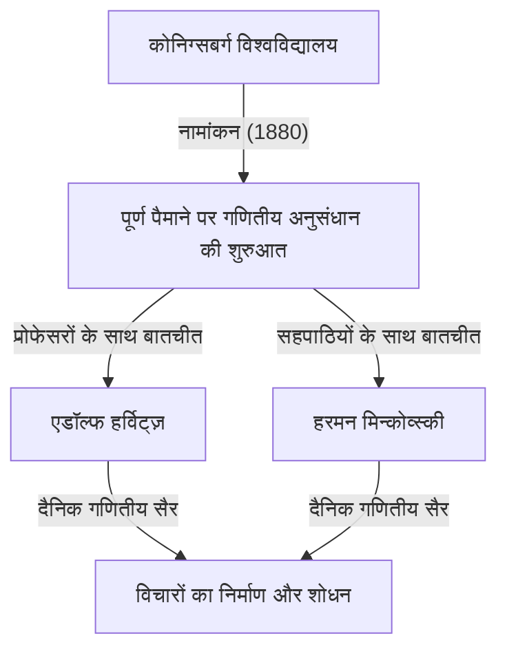
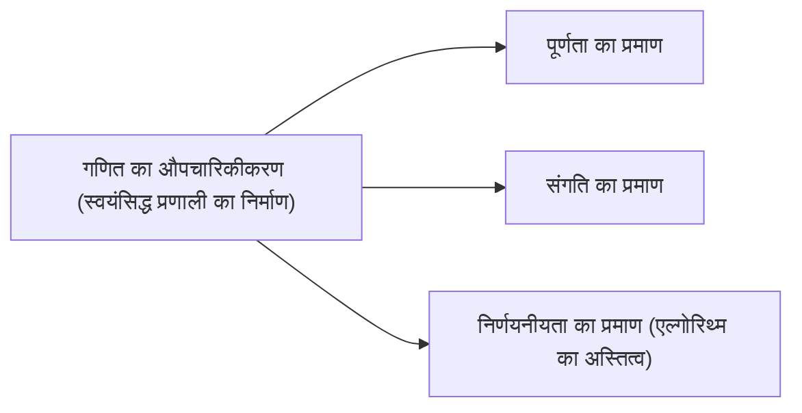

## 1. परिचय: आधुनिक गणित के जनक

डेविड हिल्बर्ट (23 जनवरी 1862 - 14 फरवरी 1943) एक जर्मन गणितज्ञ थे, जिन्हें 19वीं सदी के अंत और 20वीं सदी की शुरुआत के सबसे प्रभावशाली और महान गणितज्ञों में से एक के रूप में व्यापक रूप से मान्यता प्राप्त है। अक्सर उनके शानदार फ्रांसीसी समकालीन हेनरी पोंकारे से तुलना की जाती है, हिल्बर्ट ने पोंकारे के अंतर्ज्ञान पर निर्भरता के विपरीत, सख्त तर्क और औपचारिकता पर जोर दिया। हिल्बर्ट ने आधुनिक गणित के लगभग हर क्षेत्र को गहराई से प्रभावित किया, जिससे उन्हें **"गणित का राजा"** उपनाम मिला।

उनके योगदान में इनवेरिएंट सिद्धांत, बीजीय संख्या सिद्धांत, ज्यामिति का स्वयंसिद्धीकरण, अभिन्न समीकरण, कार्यात्मक विश्लेषण (हिल्बर्ट रिक्त स्थान), और सैद्धांतिक भौतिकी (सामान्य सापेक्षता की गणितीय नींव) शामिल हैं। उनकी सबसे बड़ी विरासत केवल अलग-थलग खुली समस्याओं को हल करने में नहीं है, बल्कि गणित की संरचना और प्रकृति को मौलिक रूप से फिर से तैयार करने में है, जिसने स्वयंसिद्धता और औपचारिकता के नए प्रतिमान स्थापित किए। इस लेख में, हम हिल्बर्ट के जीवन के नाटकीय प्रसंगों और उनकी शानदार उपलब्धियों पर गहराई से और विस्तार से नज़र डालते हैं।

## 2. कोनिग्सबर्ग में जन्म और शुरुआती दिन: शिक्षा के शहर में जागृति

हिल्बर्ट का जन्म 23 जनवरी 1862 को प्रुशिया साम्राज्य में पूर्वी प्रुशिया प्रांत की राजधानी कोनिग्सबर्ग (अब कलिनिनग्राद, रूस) के पास वेहलाउ में हुआ था। उनके पिता, ओटो हिल्बर्ट, एक सख्त जिला न्यायाधीश थे। उनकी माँ, मारिया थेरेसी, एक सुशिक्षित महिला थीं, जिनकी दर्शन और खगोल विज्ञान में गहरी रुचि थी। कहा जाता है कि हिल्बर्ट ने अपनी तार्किक सोच और ज्ञान की प्यास अपने माता-पिता से विरासत में पाई थी।

कोनिग्सबर्ग गहरी शैक्षणिक जड़ों वाला शहर था; यह महान दार्शनिक इमैनुएल कांट का जन्मस्थान था और लियोनहार्ड यूलर द्वारा हल की गई "कोनिग्सबर्ग के सात पुलों" की समस्या के लिए प्रसिद्ध था। अपने स्कूली दिनों के दौरान, हिल्बर्ट के ग्रेड उल्लेखनीय नहीं थे, लेकिन उनके पास गणित के लिए एक विशेष अंतर्ज्ञान और जुनून था। उन्हें रटकर याद करने से नफरत थी, वे अपने दिमाग में खरोंच से तर्क का निर्माण करके समस्याओं को हल करना पसंद करते थे। यह दृष्टिकोण - याद करने पर भरोसा करने के बजाय तार्किक नींव से निर्माण करना - उनकी बाद की गणितीय शैली का मूल बन गया।

### "गणितीय सैर" और जीवन भर के मित्र

1880 में, हिल्बर्ट ने कोनिग्सबर्ग विश्वविद्यालय में प्रवेश लिया, जहाँ उनकी मुलाकात दो ऐसे व्यक्तियों से हुई जो उनका जीवन बदल देंगे। एक थे प्रतिभाशाली हरमन मिन्कोव्स्की, जिन्होंने केवल 18 साल की उम्र में पेरिस एकेडमी ऑफ साइंसेज का गणित पुरस्कार जीता था। दूसरे थे एडॉल्फ हर्विट्ज़, एक शानदार युवा प्रोफेसर।

उन तीनों ने एक निर्धारित समय पर विश्वविद्यालय के पास एक सेब के पेड़ के नीचे टहलने को अपनी दैनिक दिनचर्या बना लिया, जहाँ वे नवीनतम गणितीय समस्याओं पर जोश से चर्चा करते थे। इन दैनिक **"गणितीय सैर"** ने युवा हिल्बर्ट की गणितीय प्रतिभाओं को पूरी तरह से खिलने की अनुमति दी। पूरी तरह से अलग गणितीय अंतर्ज्ञान रखने वाले दो दिमागों के साथ विचारों के टकराव से, हिल्बर्ट ने अपनी अवधारणाओं को परिष्कृत किया और गणित की गहराइयों में कदम रखा।

## 3. इनवेरिएंट थ्योरी में सफलता: गॉर्डन की आलोचना से परे एक छलांग

हिल्बर्ट ने पहली बार इनवेरिएंट सिद्धांत के क्षेत्र में दुनिया भर में प्रसिद्धि प्राप्त की। इनवेरिएंट सिद्धांत उन बहुपदों के गुणों का अध्ययन करता है जो समन्वय परिवर्तनों के तहत अपरिवर्तित रहते हैं। उस समय, इस क्षेत्र के प्रमुख विशेषज्ञ पॉल गॉर्डन ने यह साबित कर दिया था कि दो चर के इनवेरिएंट का एक परिमित आधार (गॉर्डन का प्रमेय) होता है, लेकिन तीन या अधिक चर के मामले में बेहद जटिल गणनाओं की आवश्यकता होती थी और यह वर्षों तक एक अनसुलझी समस्या बनी रही।

1888 में, हिल्बर्ट ने इस चुनौती को पूरी तरह से नए दृष्टिकोण के साथ निपटाया। आधार सूत्रों की स्पष्ट रूप से गणना करने और निर्माण करने की पारंपरिक पद्धति को छोड़ते हुए, उन्होंने एक अस्तित्व प्रमाण प्रस्तुत करने के लिए विरोधाभास द्वारा प्रमाण का उपयोग किया कि **"एक परिमित आधार मौजूद होना चाहिए"**। इस शक्तिशाली प्रमेय को आज **हिल्बर्ट के आधार प्रमेय** के रूप में जाना जाता है।

किंवदंती है कि गणना से पूरी तरह रहित इस अमूर्त प्रमाण को देखकर गॉर्डन ने गुस्से में चिल्लाया, **"यह गणित नहीं है। यह धर्मशास्त्र है!"** (Das ist nicht Mathematik. Das ist Theologie!)। हालाँकि, बाद में गॉर्डन को भी इस पद्धति की तार्किक शुद्धता और शक्ति को स्वीकार करना पड़ा। हिल्बर्ट की उपलब्धि ने एक ऐतिहासिक मोड़ को चिह्नित किया जहाँ गणित का केंद्र "विशिष्ट गणना के माध्यम से निर्माण" से "अमूर्त संरचनाओं के अस्तित्व प्रमाण" में स्थानांतरित हो गया।

## 4. बीजीय संख्या सिद्धांत और स्मारकीय "ज़हलबेरिच"

इनवेरिएंट सिद्धांत में अपनी सफलता के बाद, हिल्बर्ट ने बीजीय संख्या सिद्धांत की ओर रुख किया। 1897 में जर्मन गणितीय सोसायटी द्वारा कमीशन किए गए, उन्होंने "ज़हलबेरिच" (संख्याओं पर रिपोर्ट) लिखा, जो एक स्मारकीय कार्य है जिसने बीजीय संख्या सिद्धांत के मौजूदा ज्ञान को संश्लेषित किया और इसे पूरी तरह से नए दृष्टिकोण से फिर से बनाया।

इस रिपोर्ट में, उन्होंने संख्या सिद्धांत पर गैलोइस सिद्धांत को लागू किया, जिससे हिल्बर्ट के वर्ग क्षेत्र सिद्धांत की नींव पड़ी। वर्ग क्षेत्र सिद्धांत, जिसे बाद में टीजी ताकागी और एमिल अर्टिन द्वारा सिद्ध किया गया, 20वीं सदी के संख्या सिद्धांत में सबसे सुंदर सिद्धांतों में से एक माना जाता है। हिल्बर्ट उच्च, सुंदर नियमों के तहत संख्या सिद्धांत में प्रतीत होने वाले असमान परिणामों को एकजुट करने में सफल रहे।

## 5. ज्यामिति का स्वयंसिद्धीकरण: "मेज, कुर्सियों और बीयर मग" का दर्शन

1899 में, हिल्बर्ट ने "Grundlagen der Geometrie" (ज्यामिति की नींव) पुस्तक प्रकाशित की। इसने यूक्लिडियन ज्यामिति की स्वयंसिद्ध प्रणाली को पूरी तरह से फिर से संगठित किया, जो 2000 से अधिक वर्षों से आधुनिक दृष्टिकोण से ज्यामिति की पूर्ण नींव रही थी।

यूक्लिड के "एलिमेंट्स" में कई निहित मान्यताएं और दृश्य अंतर्ज्ञान पर निर्भर तत्व शामिल थे। हिल्बर्ट ने इन्हें सख्ती से समाप्त कर दिया, पांच समूहों से युक्त एक सख्ती से परिभाषित स्वयंसिद्ध प्रणाली प्रस्तुत की: घटना, क्रम, सर्वांगसमता, समानताएं और निरंतरता के स्वयंसिद्ध।

उन्होंने प्रसिद्ध रूप से कहा, **"किसी को हर समय यह कहने में सक्षम होना चाहिए - बिंदु, सीधी रेखाएं और विमानों के बजाय - मेज, कुर्सियां, और बीयर मग।"** यह **औपचारिकता** की एक शानदार घोषणा थी, जिसने ज्यामिति को किसी भी सहज या भौतिक वास्तविकता से अलग कर दिया कि वस्तुएं क्या हैं, और गणित की नींव के रूप में केवल वस्तुओं के बीच तार्किक संबंधों को स्थापित किया। यह अभूतपूर्व दृष्टिकोण आधुनिक गणित में स्वयंसिद्ध पद्धति की मानक शैली बन गया।

## 6. गौटिंगेन विश्वविद्यालय का निमंत्रण और स्वर्ण युग की सुबह

1895 में, जर्मन गणित में एक भारी हस्ती फेलिक्स क्लेन की मजबूत सिफारिश के लिए धन्यवाद, हिल्बर्ट को गौटिंगेन विश्वविद्यालय में प्रोफेसर नियुक्त किया गया था। गौटिंगेन पहले से ही गणित के लिए एक पवित्र भूमि के रूप में प्रसिद्ध था, जो कभी कार्ल फ्रेडरिक गॉस और बर्नहार्ड रीमैन का घर रहा था।

हिल्बर्ट के आगमन के साथ, गौटिंगेन ने दुनिया के प्रमुख गणितीय केंद्र के रूप में खुद को मजबूती से स्थापित किया। उनके व्याख्यान हमेशा स्पष्ट और नए गणितीय विचारों के जुनून से भरे होते थे, जो दुनिया भर के प्रतिभाशाली छात्रों और शोधकर्ताओं को आकर्षित करते थे। 20वीं सदी के गणित का नेतृत्व करने वाले कई सुपरस्टार, जैसे एमी नोथेर, हरमन वील, रिचर्ड कूरैंट और जॉन वॉन न्यूमैन, हिल्बर्ट द्वारा निर्देशित किए गए थे।

एमी नोथेर के बारे में किस्सा विशेष रूप से प्रसिद्ध है। उस समय, विश्वविद्यालय के नियमों ने महिलाओं को शैक्षणिक पदों पर रहने से रोक दिया था। हिल्बर्ट, बीजगणित में उनकी असाधारण प्रतिभा को बहुत महत्व देते हुए, संकाय की बैठक में भयंकर विरोध किया, यह घोषणा करते हुए: **"विश्वविद्यालय की सीनेट कोई स्नानघर नहीं है, इसलिए लिंग कोई मायने नहीं रखता!"** यह कथन उनके प्रगतिशील, योग्यता के आधार पर और पूर्वाग्रह रहित चरित्र को स्पष्ट रूप से दर्शाता है।

## 7. 1900 पेरिस अंतर्राष्ट्रीय गणितज्ञ कांग्रेस: हिल्बर्ट की 23 समस्याएँ

1900 में, पेरिस में आयोजित दूसरे अंतर्राष्ट्रीय गणितज्ञ कांग्रेस (ICM) में, हिल्बर्ट ने एक ऐतिहासिक और स्मारकीय भाषण दिया। यह पूछते हुए कि "वे कौन सी समस्याएँ हैं जो आने वाली सदी में गणित की प्रगति का मार्गदर्शन करेंगी?", उन्होंने **"23 अनसुलझी समस्याएँ"** प्रस्तुत कीं जिन्हें 20वीं सदी के गणितज्ञों को हल करने का प्रयास करना चाहिए।

इन समस्याओं ने उस समय गणित के सभी क्षेत्रों को घेर लिया और बाद के गणितीय विकास के लिए एक बड़े प्रेरक बल के रूप में कार्य किया। यहाँ कुछ सबसे प्रसिद्ध हैं:

1. **कंटिनम हाइपोथिसिस** (पहली समस्या): क्या कोई ऐसा सेट है जिसकी कार्डिनलिटी पूर्णांक और वास्तविक संख्याओं के बीच कड़ाई से है? बाद में, गोडेल और कोहेन ने साबित किया कि यह मानक ZFC स्वयंसिद्धों से स्वतंत्र है।
2. **अंकगणित के स्वयंसिद्धों की संगति** (दूसरी समस्या): साबित करें कि अंकगणित के स्वयंसिद्ध केवल परिमित विधियों का उपयोग करके सुसंगत हैं।
3. **समान आधारों और समान ऊंचाई के दो टेट्राहेड्रा के वॉल्यूम की समानता** (तीसरी समस्या): क्या ऐसे दो पॉलीहेड्रा को हमेशा सीमित संख्या में टुकड़ों में विभाजित किया जा सकता है और एक दूसरे में फिर से जोड़ा जा सकता है? इसे उनके छात्र मैक्स डेन द्वारा नकारात्मक रूप से हल किया गया था।
6. **भौतिकी का स्वयंसिद्धीकरण** (छठी समस्या): भौतिकी की स्वयंसिद्ध शाखाएँ जहाँ गणित एक महत्वपूर्ण भूमिका निभाता है, जैसे कि संभाव्यता सिद्धांत और यांत्रिकी।
8. **अभाज्य संख्या वितरण से संबंधित समस्याएँ** (आठवीं समस्या): कुख्यात रीमैन परिकल्पना और गोल्डबैक का अनुमान। ये आज भी अनसुलझी हैं।
10. **डायोफैंटाइन समीकरण के समाधान का निर्धारण** (10वीं समस्या): यह निर्धारित करने के लिए एक सामान्य एल्गोरिथ्म खोजें कि क्या पूर्णांक गुणांक वाले किसी दिए गए बहुपद समीकरण का पूर्णांक समाधान है। 1970 में, मटियासेविच ने साबित किया कि ऐसा कोई एल्गोरिथ्म मौजूद नहीं है।

हिल्बर्ट की समस्याएं आज भी आधुनिक गणितज्ञों के लिए महत्वपूर्ण साइनपोस्ट बनी हुई हैं।

## 8. इंटीग्रल समीकरण और हिल्बर्ट स्पेस: क्वांटम यांत्रिकी के लिए एक पुल

1900 के दशक में प्रवेश करते हुए, हिल्बर्ट की रुचि बीजगणित और ज्यामिति से विश्लेषण में स्थानांतरित हो गई। उन्होंने स्वीडिश गणितज्ञ इवर फ्रेडहोम के अभिन्न समीकरण सिद्धांत का गहराई से अध्ययन किया और अनंत-आयामी स्थानों में एक वर्णक्रमीय सिद्धांत का निर्माण किया।

इस प्रक्रिया के माध्यम से, उन्होंने **हिल्बर्ट स्पेस** की अवधारणा पेश की, जो परिमित-आयामी यूक्लिडियन अंतरिक्ष का अनंत आयामों में एक सामान्यीकरण है। एक आंतरिक उत्पाद स्थान $\mathcal{H}$ में आंतरिक उत्पाद $\langle x, y \rangle$ को कड़ाई से एक ऐसे स्थान के रूप में परिभाषित किया गया है जिसमें रैखिकता और हर्मिटियन समरूपता है, और पूर्णता को संतुष्ट करता है (सभी कॉची अनुक्रम अभिसरण करते हैं)। गणितीय रूप से व्यक्त, आंतरिक उत्पाद संतुष्ट करता है:

$$
\langle a x_1 + b x_2, y \rangle = a \langle x_1, y \rangle + b \langle x_2, y \rangle
$$
$$
\langle x, y \rangle = \overline{\langle y, x \rangle}
$$

यहाँ, $x, y, x_1, x_2 \in \mathcal{H}$ और $a, b \in \mathbb{C}$ (सम्मिश्र संख्याएँ), और $\overline{\langle y, x \rangle}$ सम्मिश्र संयुग्मी को दर्शाता है। मानदंड $\|x\| = \sqrt{\langle x, x \rangle}$ द्वारा प्रेरित है।

हैरानी की बात यह है कि यह अमूर्त सिद्धांत, जिसे हिल्बर्ट ने शुद्ध गणितीय जिज्ञासा से बनाया था, दशकों बाद नवजात क्वांटम यांत्रिकी में भौतिक प्रणालियों की स्थिति का वर्णन करने के लिए एकदम सही गणितीय भाषा बन गया। जब वर्नर हाइजेनबर्ग ने मैट्रिक्स यांत्रिकी तैयार की और इरविन श्रोडिंगर ने तरंग यांत्रिकी तैयार की, तो हिल्बर्ट रिक्त स्थान का सिद्धांत मुख्य रूप से जॉन वॉन न्यूमैन के काम के माध्यम से एक अनिवार्य उपकरण बन गया। यह भौतिकी की आशा करने वाले गणित का एक आश्चर्यजनक उदाहरण है।

## 9. भौतिकी में प्रवेश और आइंस्टीन-हिल्बर्ट एक्शन

हिल्बर्ट अक्सर मजाक करते थे कि "भौतिकविदों के लिए भौतिकी बहुत मुश्किल है", और उन्होंने कठोर गणितीय स्वयंसिद्ध विधियों (अपनी 6वीं समस्या से संबंधित) का उपयोग करके भौतिकी की नींव का पुनर्निर्माण करने का लक्ष्य रखा।

1915 में, उस अवधि के दौरान जब अल्बर्ट आइंस्टीन सामान्य सापेक्षता के लिए गुरुत्वाकर्षण क्षेत्र समीकरणों को पूरा करने के लिए संघर्ष कर रहे थे, हिल्बर्ट भी इस समस्या पर काम कर रहे थे। वैविध्यपूर्ण सिद्धांत की गणितीय रूप से सुरुचिपूर्ण तकनीक का उपयोग करते हुए, हिल्बर्ट ने लगभग उसी समय आइंस्टीन के रूप में सही गुरुत्वाकर्षण क्षेत्र समीकरण प्राप्त किए। आज, इस सिद्धांत के अंतर्निहित एक्शन इंटीग्रल को **आइंस्टीन-हिल्बर्ट एक्शन** के रूप में जाना जाता है।

$$
S = \int \left( \frac{R}{16 \pi G} + \mathcal{L}_M \right) \sqrt{-g} \, d^4x
$$

सूत्र का अर्थ: यहाँ, $R$ अदिश वक्रता है जो अंतरिक्ष-समय की वक्रता का प्रतिनिधित्व करता है, $G$ न्यूटन का गुरुत्वाकर्षण स्थिरांक है, $g$ मीट्रिक टेंसर का निर्धारक है, $\mathcal{L}_M$ पदार्थ क्षेत्रों का लैग्रेंजियन घनत्व है, और $\text{एकीकरण संपूर्ण अंतरिक्ष-समय पर किया जाता है}$।

यद्यपि आइंस्टीन और हिल्बर्ट के बीच प्राथमिकता का विवाद उत्पन्न हो सकता था, हिल्बर्ट ने आइंस्टीन के शानदार भौतिक अंतर्ज्ञान का गहरा सम्मान किया और सार्वजनिक रूप से कहा कि "यह आइंस्टीन थे जिन्होंने इस समीकरण की खोज की", कभी भी स्वयं प्राथमिकता का दावा नहीं किया।

## 10. हिल्बर्ट का कार्यक्रम: गणित में पूर्ण संगति की खोज

प्रथम विश्व युद्ध के बाद, सेट सिद्धांत (जैसे रसेल के विरोधाभास) में विरोधाभासों से उत्पन्न "गणित की नींव में संकट" के जवाब में, हिल्बर्ट ने अपने जीवन की सबसे महत्वाकांक्षी परियोजना प्रस्तावित की: **हिल्बर्ट का कार्यक्रम**।

उन्होंने सभी गणितीय प्रस्तावों को प्रतीकों के अर्थहीन तार के रूप में मानते हुए और यांत्रिक नियमों के अनुसार उन्हें हेरफेर करते हुए, गणित को "औपचारिक प्रणाली" के रूप में फिर से बनाने की मांग की। उनका लक्ष्य गणितीय रूप से साबित करना था - केवल सुरक्षित, परिमित तर्क का उपयोग करके - कि " $0 = 1$ " जैसे विरोधाभास उस प्रणाली (संगति) के भीतर कभी नहीं प्राप्त किए जा सकते हैं।

इस कार्यक्रम ने एल. ई. जे. ब्राउर जैसे अंतर्ज्ञानवादियों के साथ भयंकर बहस (नींव का संकट) शुरू कर दी। हालाँकि, हिल्बर्ट ने साहसपूर्वक अपने कार्यक्रम को आगे बढ़ाया, यह घोषणा करते हुए, "कांटोर ने हमारे लिए जो स्वर्ग बनाया है, उससे हमें कोई नहीं निकाल पाएगा।"

## 11. गोडेल के अपूर्णता प्रमेयों का आघात और कार्यक्रम का परिवर्तन

हालाँकि, 1931 में, युवा ऑस्ट्रियाई तर्कशास्त्री कर्ट गोडेल ने अपने **अपूर्णता प्रमेयों** को प्रकाशित किया, जिसने हिल्बर्ट के कार्यक्रम को एक निर्णायक झटका दिया।

गोडेल ने गणितीय और पूरी तरह से साबित कर दिया कि अंकगणित के स्वयंसिद्धों वाले किसी भी शक्तिशाली औपचारिक प्रणाली में, हमेशा ऐसे प्रस्ताव होंगे जो "सिस्टम के भीतर सत्य हैं लेकिन साबित या अस्वीकृत नहीं किए जा सकते हैं" (पहला अपूर्णता प्रमेय), और कि "सिस्टम के भीतर ही सिस्टम की स्थिरता को साबित करना असंभव है" (दूसरा अपूर्णता प्रमेय)।

इससे यह प्रदर्शित हुआ कि "सही गणितीय प्रणाली जहाँ अपनी संगति सहित सब कुछ सिद्ध किया जा सकता है", जिसका हिल्बर्ट ने सपना देखा था, का निर्माण असंभव था। हालाँकि हिल्बर्ट कथित तौर पर इस परिणाम से शुरू में गहराई से निराश और क्रोधित थे, हिल्बर्ट के कार्यक्रम की खोज के दौरान विकसित मेटामैथमैटिक्स और औपचारिक तर्क के कठोर तरीकों ने अंततः एलन ट्यूरिंग द्वारा कंप्यूटर विज्ञान और सैद्धांतिक कंप्यूटर विज्ञान की स्थापना का मार्ग प्रशस्त किया।

## 12. गौटिंगेन में अंतिम वर्ष: नाजियों का उदय और गणितीय अभयारण्य का अंत

1930 के दशक में, एडॉल्फ हिटलर के नेतृत्व में नाज़ी पार्टी ने जर्मनी में सत्ता पर कब्ज़ा कर लिया। 1933 में "व्यावसायिक सिविल सेवा की बहाली के लिए कानून" लागू किया गया था, जिसके परिणामस्वरूप एमी नोथेर, हरमन वील, रिचर्ड कूरैंट और मैक्स बोर्न सहित गौटिंगेन विश्वविद्यालय में कई उत्कृष्ट यहूदी गणितज्ञों और असंतुष्ट विद्वानों का निर्मम निष्कासन हुआ।

गौटिंगेन, एक बार एक जीवंत गणितीय अभयारण्य जहाँ दुनिया भर से प्रतिभाएँ एकत्र होती थीं, लगभग रातोंरात ढह गया। एक बार, एक भोज में, नाज़ी शिक्षा मंत्री बर्नहार्ड रस्ट ने हिल्बर्ट से पूछा, "अब यहूदी प्रभाव से मुक्त होने के बाद आपके संस्थान में गणित कैसा है?" हिल्बर्ट ने क्रोध और दुख के साथ उत्तर दिया: "गणितीय संस्थान? वास्तव में अब कोई भी नहीं है।"

14 फरवरी 1943 को, द्वितीय विश्व युद्ध के बीच, अधिकांश पूर्व छात्रों के अमेरिका और अन्य स्थानों पर भाग जाने के बाद, गौटिंगेन में 81 वर्ष की आयु में एकांत में हिल्बर्ट का निधन हो गया। उनके अंतिम संस्कार में बहुत कम लोग शामिल हुए थे।

## 13. निष्कर्ष: "हमें जानना होगा, हम जानेंगे"

डेविड हिल्बर्ट के निधन के बाद भी, उनकी छोड़ी गई गणितीय विरासत कभी कम नहीं हुई। उनके विचारों का प्रक्षेपवक्र आधुनिक गणित के हर कोने में खुदा हुआ है।

उनके मकबरे पर वे प्रसिद्ध शब्द उकेरे गए हैं जो 1930 में उनके गृहनगर कोनिग्सबर्ग में उनके सेवानिवृत्ति भाषण के समापन पर थे, जो मानवीय कारण और वैज्ञानिक जांच में उनके अटूट, पूर्ण विश्वास को प्रदर्शित करते हैं। यह उस समय के निराशावादी अज्ञेयवाद का एक शक्तिशाली खंडन था, जिसे वाक्यांश "ignoramus et ignorabimus" (हम नहीं जानते हैं और नहीं जानेंगे) द्वारा संक्षेपित किया गया था।

> **Wir müssen wissen.**
> **Wir werden wissen.**
> (हमें जानना होगा। हम जानेंगे।)

डेविड हिल्बर्ट गणित की असीम संभावनाओं में गहराई से विश्वास करते थे और जीवन भर इसकी सीमाओं में अग्रणी रहे। उनकी लचीली भावना, दर्शन और शानदार उपलब्धियां आधुनिक गणितज्ञों का मांस और खून बन गई हैं, जो आज गणित के हर कोने में जीवन फूंक रही हैं और भविष्य के खोजकर्ताओं को प्रेरित करती रहेंगी।

## कालक्रम

* **1862**: पूर्वी प्रुशिया के कोनिग्सबर्ग के पास वेहलाउ में जन्म।
* **1880**: कोनिग्सबर्ग विश्वविद्यालय में प्रवेश। मिन्कोव्स्की और हर्विट्ज़ से मुलाकात।
* **1885**: कोनिग्सबर्ग विश्वविद्यालय से पीएच.डी. प्राप्त की।
* **1888**: इनवेरिएंट सिद्धांत में "हिल्बर्ट के आधार प्रमेय" को साबित किया।
* **1895**: क्लेन के निमंत्रण पर गौटिंगेन विश्वविद्यालय में प्रोफेसर नियुक्त।
* **1897**: बीजीय संख्या सिद्धांत पर "ज़हलबेरिच" प्रकाशित किया।
* **1899**: "ज्यामिति की नींव" प्रकाशित की, ज्यामिति का स्वयंसिद्धीकरण किया।
* **1900**: पेरिस में अंतर्राष्ट्रीय गणितज्ञ कांग्रेस में "23 समस्याएं" प्रस्तुत कीं।
* **1909**: वारिंग की समस्या को सकारात्मक रूप से हल किया।
* **1915**: सामान्य सापेक्षता में "आइंस्टीन-हिल्बर्ट एक्शन" तैयार किया।
* **1920 का दशक**: "हिल्बर्ट का कार्यक्रम" प्रस्तावित किया।
* **1930**: गौटिंगेन विश्वविद्यालय से सेवानिवृत्त। "हमें जानना होगा, हम जानेंगे" भाषण दिया।
* **1943**: गौटिंगेन में 81 वर्ष की आयु में निधन।
