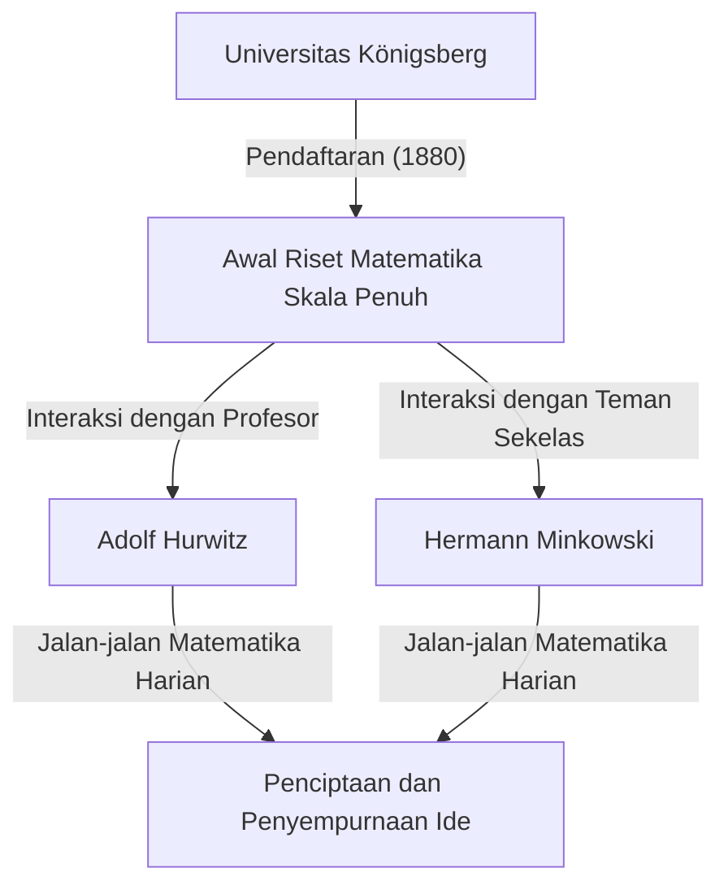
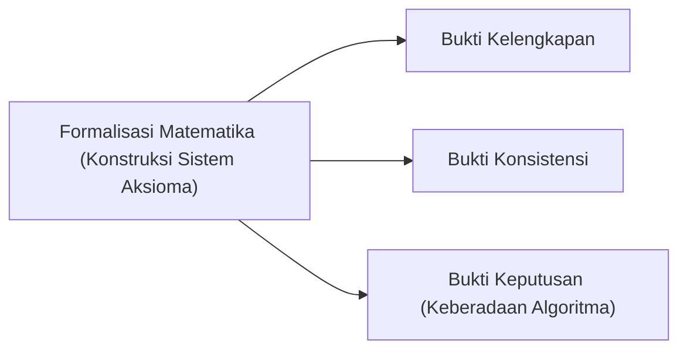

## 1. Pendahuluan: Bapak Matematika Modern

[David Hilbert](https://kenji.blog/id/p/hilbert/) (23 Januari 1862 – 14 Februari 1943) adalah seorang matematikawan Jerman, diakui secara luas sebagai salah satu matematikawan paling berpengaruh dan terhebat pada akhir abad ke-19 dan awal abad ke-20. Sering dibandingkan dengan rekannya yang brilian dari Prancis, [Henri Poincaré](https://kenji.blog/id/p/poincare/), [Hilbert](https://kenji.blog/id/p/hilbert/) menekankan logika dan formalisme yang ketat, berbeda dengan ketergantungan [Poincaré](https://kenji.blog/id/p/poincare/) pada intuisi. [Hilbert](https://kenji.blog/id/p/hilbert/) sangat memengaruhi hampir setiap bidang matematika modern, membuatnya mendapat julukan **"Raja Matematika"**.

Kontribusinya membentang di seluruh teori invarian, teori bilangan aljabar, aksiomatisasi geometri, persamaan integral, analisis fungsional (ruang [Hilbert](https://kenji.blog/id/p/hilbert/)), dan fisika teoretis (dasar-dasar matematika relativitas umum). Warisan terbesarnya tidak hanya terletak pada pemecahan masalah terbuka yang terisolasi, tetapi dalam membayangkan kembali struktur dan sifat matematika itu sendiri secara mendasar, membangun paradigma baru aksiomatisme dan formalisme. Dalam artikel ini, kita akan melihat lebih dalam dan mendetail pada episode kehidupan dramatis [Hilbert](https://kenji.blog/id/p/hilbert/) dan pencapaiannya yang cemerlang.

## 2. Kelahiran dan Hari-hari Awal di Königsberg: Kebangkitan di Kota Pendidikan

[Hilbert](https://kenji.blog/id/p/hilbert/) lahir pada tanggal 23 Januari 1862, di Wehlau, dekat Königsberg (sekarang Kaliningrad, Rusia), ibu kota Provinsi Prusia Timur di Kerajaan Prusia. Ayahnya, Otto [Hilbert](https://kenji.blog/id/p/hilbert/), adalah seorang hakim distrik yang tegas. Ibunya, Maria Therese, adalah wanita berpendidikan baik dengan minat mendalam pada filsafat dan astronomi. Dikatakan bahwa [Hilbert](https://kenji.blog/id/p/hilbert/) mewarisi pemikiran logis dan kehausannya akan pengetahuan dari orang tuanya.

Königsberg adalah kota dengan akar akademik yang dalam; itu adalah tempat kelahiran filsuf besar Immanuel Kant dan terkenal dengan masalah "[Tujuh Jembatan Königsberg](https://kenji.blog/id/p/seven-bridges-of-konigsberg/)" yang diselesaikan oleh [Leonhard Euler](https://kenji.blog/id/p/euler/). Selama masa sekolahnya, nilai [Hilbert](https://kenji.blog/id/p/hilbert/) tidak luar biasa, tetapi ia memiliki intuisi dan hasrat khusus pada matematika. Dia membenci hafalan, lebih suka memecahkan masalah dengan membangun logika dari awal dalam pikirannya sendiri. Pendekatan ini—membangun dari fondasi logis daripada mengandalkan hafalan—menjadi inti gaya matematikanya di kemudian hari.

### "Jalan-jalan Matematika" dan Teman Seumur Hidup

Pada tahun 1880, [Hilbert](https://kenji.blog/id/p/hilbert/) masuk ke Universitas Königsberg, di mana ia bertemu dua orang yang akan mengubah hidupnya. Salah satunya adalah si jenius Hermann Minkowski, yang telah memenangkan hadiah matematika dari Akademi Ilmu Pengetahuan Paris pada usia 18 tahun. Yang lainnya adalah Adolf Hurwitz, seorang profesor muda yang brilian.

Mereka bertiga menjadikan rutinitas sehari-hari untuk berjalan-jalan di bawah pohon apel dekat universitas pada waktu yang ditentukan, mendiskusikan masalah matematika terbaru dengan penuh semangat. **"Jalan-jalan matematika"** harian ini memungkinkan bakat matematika [Hilbert](https://kenji.blog/id/p/hilbert/) muda untuk berkembang sepenuhnya. Dengan mempertemukan ide dengan dua pikiran yang memiliki intuisi matematika yang sama sekali berbeda, [Hilbert](https://kenji.blog/id/p/hilbert/) menyempurnakan konsepnya sendiri dan melangkah ke kedalaman matematika.

## 3. Terobosan dalam Teori Invarian: Melompati Kritik Gordan

[Hilbert](https://kenji.blog/id/p/hilbert/) pertama kali memperoleh ketenaran di seluruh dunia dalam bidang teori invarian. Teori invarian mempelajari sifat-sifat polinomial yang tetap tidak berubah di bawah transformasi koordinat. Pada saat itu, Paul Gordan, pakar terkemuka di bidang ini, telah membuktikan bahwa invarian dari dua variabel memiliki basis yang terbatas (teorema Gordan), tetapi kasus untuk tiga atau lebih variabel membutuhkan perhitungan yang sangat rumit dan tetap menjadi masalah yang belum terpecahkan selama bertahun-tahun.

Pada tahun 1888, [Hilbert](https://kenji.blog/id/p/hilbert/) mengatasi tantangan ini dengan pendekatan yang sama sekali baru. Meninggalkan metode tradisional menghitung dan membangun rumus basis secara eksplisit, ia menggunakan pembuktian dengan kontradiksi untuk menyajikan bukti keberadaan bahwa **"basis yang terbatas pasti ada"**. Teorema kuat ini dikenal saat ini sebagai **teorema basis [Hilbert](https://kenji.blog/id/p/hilbert/)**.

Legenda mengatakan bahwa setelah melihat bukti abstrak yang sama sekali tanpa perhitungan ini, Gordan dengan marah berseru: **"Ini bukan matematika. Ini teologi!"** (Das ist nicht Mathematik. Das ist Theologie!). Belakangan, bagaimanapun, bahkan Gordan harus mengakui kebenaran logis dan kekuatan metode ini. Pencapaian [Hilbert](https://kenji.blog/id/p/hilbert/) menandai titik balik bersejarah di mana pusat matematika bergeser dari "konstruksi melalui perhitungan spesifik" ke "bukti keberadaan struktur abstrak".

## 4. Teori Bilangan Aljabar dan "Zahlbericht" yang Monumental

Menyusul kesuksesannya dalam teori invarian, [Hilbert](https://kenji.blog/id/p/hilbert/) beralih ke teori bilangan aljabar. Ditugaskan oleh Masyarakat Matematika Jerman pada tahun 1897, ia menulis "Zahlbericht" (Laporan tentang Bilangan), sebuah karya monumental yang menyintesis pengetahuan yang ada tentang teori bilangan aljabar dan merekonstruksinya dari perspektif yang sama sekali baru.

Dalam laporan ini, ia menerapkan teori [Galois](https://kenji.blog/id/p/galois/) pada teori bilangan, meletakkan dasar untuk teori medan kelas [Hilbert](https://kenji.blog/id/p/hilbert/). Teori medan kelas, yang kemudian disempurnakan oleh Teiji [Takagi](https://kenji.blog/id/p/takagi-teiji/) dan Emil Artin, dianggap sebagai salah satu teori paling indah dalam teori bilangan abad ke-20. [Hilbert](https://kenji.blog/id/p/hilbert/) berhasil menyatukan hasil-hasil yang tampaknya berbeda dalam teori bilangan di bawah hukum-hukum yang lebih tinggi dan indah.

## 5. Aksiomatisasi Geometri: Filosofi "Meja, Kursi, dan Gelas Bir"

Pada tahun 1899, [Hilbert](https://kenji.blog/id/p/hilbert/) menerbitkan buku "Grundlagen der Geometrie" (Dasar-dasar Geometri). Buku itu sepenuhnya merekonstruksi sistem aksioma geometri [[Euklid](https://kenji.blog/id/p/euclid/)es](https://kenji.blog/p/euclid/), yang telah menjadi fondasi absolut geometri selama lebih dari 2000 tahun, dari sudut pandang modern.

"Elemen" [[Euklid](https://kenji.blog/id/p/euclid/)es](https://kenji.blog/p/euclid/) berisi beberapa asumsi dan elemen implisit yang bergantung pada intuisi visual. [Hilbert](https://kenji.blog/id/p/hilbert/) menyingkirkan hal-hal ini dengan cermat, menghadirkan sistem aksioma yang didefinisikan secara ketat yang terdiri dari lima kelompok: aksioma insiden, urutan, kekongruenan, kesejajaran, dan kontinuitas.

Ia terkenal menyatakan: **"Seseorang harus selalu bisa mengatakan — alih-alih titik, garis lurus, dan bidang — meja, kursi, dan gelas bir."** Ini adalah deklarasi **formalisme** yang bergema, melucuti geometri dari realitas intuitif atau fisik apa pun mengenai apa benda itu, dan menetapkan hanya hubungan logis antar benda sebagai fondasi matematika. Pendekatan inovatif ini menjadi gaya standar metode aksiomatik dalam matematika modern.

## 6. Undangan ke Universitas Göttingen dan Fajar Zaman Keemasan

Pada tahun 1895, berkat rekomendasi kuat dari Felix Klein, tokoh kelas berat dalam matematika Jerman, [Hilbert](https://kenji.blog/id/p/hilbert/) diangkat menjadi profesor di Universitas Göttingen. Göttingen sudah terkenal sebagai tanah suci bagi matematika, pernah menjadi rumah bagi [Carl Friedrich Gauss](https://kenji.blog/id/p/gauss/) dan [Bernhard Riemann](https://kenji.blog/id/p/riemann/).

Dengan kedatangan [Hilbert](https://kenji.blog/id/p/hilbert/), Göttingen dengan mantap membangun kembali dirinya sebagai pusat matematika utama dunia. Kuliahnya selalu jelas dan penuh gairah akan ide-ide matematika baru, menarik para mahasiswa dan peneliti brilian dari seluruh dunia. Banyak superstar yang nantinya akan memimpin matematika abad ke-20, seperti [Emmy Noether](https://kenji.blog/id/p/noether/), Hermann Weyl, Richard Courant, dan John von Neumann, dibimbing oleh [Hilbert](https://kenji.blog/id/p/hilbert/).

Anekdot mengenai [Emmy Noether](https://kenji.blog/id/p/noether/) sangat terkenal. Pada saat itu, peraturan universitas melarang wanita memegang posisi akademis. [Hilbert](https://kenji.blog/id/p/hilbert/), yang sangat menghargai bakat luar biasanya dalam aljabar, memprotes keras pada rapat fakultas, menyatakan: **"Senat universitas bukanlah pemandian, jadi gender tidak masalah!"** Pernyataan ini dengan jelas menggambarkan karakternya yang progresif, meritokratis, dan tanpa prasangka.

## 7. Kongres Internasional Matematikawan Paris 1900: 23 Masalah [Hilbert](https://kenji.blog/id/p/hilbert/)

Pada tahun 1900, di Kongres Internasional Matematikawan (ICM) kedua yang diadakan di Paris, [Hilbert](https://kenji.blog/id/p/hilbert/) menyampaikan pidato bersejarah dan monumental. Menanyakan "Apa saja masalah yang akan memandu kemajuan matematika di abad mendatang?", ia menyajikan **"23 masalah yang belum terpecahkan"** yang harus dipecahkan oleh matematikawan abad ke-20.

Masalah-masalah ini mencakup semua bidang matematika pada saat itu dan berfungsi sebagai kekuatan pendorong besar bagi perkembangan matematika selanjutnya. Berikut adalah beberapa yang paling terkenal:

1. **Hipotesis Kontinum** (Masalah ke-1): Apakah ada himpunan yang kardinalitasnya benar-benar berada di antara bilangan bulat dan bilangan real? Belakangan, Gödel dan Cohen membuktikan bahwa ini independen dari aksioma ZFC standar.
2. **Konsistensi Aksioma Aritmatika** (Masalah ke-2): Buktikan bahwa aksioma aritmatika konsisten dengan hanya menggunakan metode finitis.
3. **Kesamaan Volume Dua Tetrahedron dengan Basis dan Ketinggian yang Sama** (Masalah ke-3): Bisakah dua polihedron semacam itu selalu dipartisi menjadi potongan-potongan yang jumlahnya terbatas dan dipasang kembali satu sama lain? Ini diselesaikan secara negatif oleh muridnya Max Dehn.
6. **Aksiomatisasi Fisika** (Masalah ke-6): Aksiomatisasi cabang-cabang fisika di mana matematika memainkan peran penting, seperti teori probabilitas dan mekanika.
8. **Masalah Mengenai Distribusi Bilangan Prima** (Masalah ke-8): Hipotesis [Riemann](https://kenji.blog/id/p/riemann/) yang terkenal dan Dugaan Goldbach. Ini tetap tidak terpecahkan hari ini.
10. **Penentuan Keterpecahan Persamaan Diophantine** (Masalah ke-10): Temukan algoritma umum untuk menentukan apakah persamaan polinomial yang diberikan dengan koefisien bilangan bulat memiliki solusi bilangan bulat. Pada tahun 1970, Matiyasevich membuktikan bahwa algoritma semacam itu tidak ada.

Masalah-masalah [Hilbert](https://kenji.blog/id/p/hilbert/) tetap menjadi penunjuk jalan penting bagi matematikawan modern bahkan hingga hari ini.

## 8. Persamaan Integral dan Ruang [Hilbert](https://kenji.blog/id/p/hilbert/): Jembatan Menuju Mekanika Kuantum

Memasuki tahun 1900-an, minat [Hilbert](https://kenji.blog/id/p/hilbert/) bergeser dari aljabar dan geometri ke analisis. Ia mempelajari secara mendalam teori persamaan integral dari matematikawan Swedia Ivar Fredholm dan membangun teori spektral dalam ruang berdimensi tak terhingga.

Melalui proses ini, ia memperkenalkan konsep **ruang [Hilbert](https://kenji.blog/id/p/hilbert/)**, generalisasi ruang [[Euklid](https://kenji.blog/id/p/euclid/)es](https://kenji.blog/p/euclid/) berdimensi terhingga ke dalam dimensi tak terhingga. Hasil kali dalam $\langle x, y \rangle$ dalam ruang hasil kali dalam $\mathcal{H}$ didefinisikan secara ketat sebagai ruang yang memiliki linearitas dan simetri Hermitian, serta memenuhi kelengkapan (semua barisan [Cauchy](https://kenji.blog/id/p/cauchy/) konvergen). Diungkapkan secara matematis, hasil kali dalam memenuhi:

$$
\langle a x_1 + b x_2, y \rangle = a \langle x_1, y \rangle + b \langle x_2, y \rangle
$$
$$
\langle x, y \rangle = \overline{\langle y, x \rangle}
$$

Di sini, $x, y, x_1, x_2 \in \mathcal{H}$ dan $a, b \in \mathbb{C}$ (bilangan kompleks), dan $\overline{\langle y, x \rangle}$ menunjukkan konjugat kompleks. Norma diinduksi oleh $\|x\| = \sqrt{\langle x, x \rangle}$.

Hebatnya, teori abstrak yang dibangun [Hilbert](https://kenji.blog/id/p/hilbert/) dari rasa keingintahuan matematika murni ini, beberapa dekade kemudian ternyata menjadi bahasa matematika yang sempurna untuk menggambarkan keadaan sistem fisik dalam mekanika kuantum yang baru lahir. Ketika Werner Heisenberg merumuskan mekanika matriks dan Erwin Schrödinger merumuskan mekanika gelombang, teori ruang [Hilbert](https://kenji.blog/id/p/hilbert/) menjadi alat yang sangat diperlukan, terutama melalui karya John von Neumann. Ini adalah contoh luar biasa dari matematika yang mengantisipasi fisika.

## 9. Penjelajahan ke Fisika dan Aksi Einstein-[Hilbert](https://kenji.blog/id/p/hilbert/)

[Hilbert](https://kenji.blog/id/p/hilbert/) sering bercanda bahwa "fisika terlalu sulit bagi fisikawan", dan ia bertujuan untuk merekonstruksi dasar-dasar fisika menggunakan metode aksiomatik matematika yang ketat (terkait dengan masalah ke-6 miliknya).

Pada tahun 1915, selama periode ketika Albert Einstein berjuang untuk menyelesaikan persamaan medan gravitasi untuk relativitas umum, [Hilbert](https://kenji.blog/id/p/hilbert/) juga sedang mengerjakan masalah tersebut. Menggunakan teknik prinsip variasional yang elegan secara matematis, [Hilbert](https://kenji.blog/id/p/hilbert/) menurunkan persamaan medan gravitasi yang benar hampir bersamaan dengan Einstein. Saat ini, integral aksi yang mendasari teori ini dikenal sebagai **aksi Einstein-[Hilbert](https://kenji.blog/id/p/hilbert/)**.

$$
S = \int \left( \frac{R}{16 \pi G} + \mathcal{L}_M \right) \sqrt{-g} \, d^4x
$$

Arti rumus: Di sini, $R$ adalah kelengkungan skalar yang mewakili kelengkungan ruang-waktu, $G$ adalah konstanta gravitasi Newton, $g$ adalah determinan tensor metrik, $\mathcal{L}_M$ adalah rapat Lagrangian dari medan materi, dan $\text{integrasi dilakukan pada seluruh ruang-waktu}$.

Sementara perselisihan prioritas antara Einstein dan [Hilbert](https://kenji.blog/id/p/hilbert/) bisa saja muncul, [Hilbert](https://kenji.blog/id/p/hilbert/) sangat menghormati intuisi fisik Einstein yang luar biasa dan secara terbuka menyatakan bahwa "Einstein-lah yang menemukan persamaan ini", tidak pernah menegaskan prioritas untuk dirinya sendiri.

## 10. Program [Hilbert](https://kenji.blog/id/p/hilbert/): Pencarian Konsistensi Mutlak dalam Matematika

Setelah Perang Dunia I, menanggapi "krisis dasar-dasar matematika" yang dipicu oleh paradoks dalam teori himpunan (seperti paradoks Russell), [Hilbert](https://kenji.blog/id/p/hilbert/) mengusulkan proyek paling ambisius dalam hidupnya: **Program [Hilbert](https://kenji.blog/id/p/hilbert/)**.

Ia berusaha untuk merekonstruksi seluruh matematika sebagai "sistem formal", memperlakukan semua proposisi matematika sebagai untaian simbol yang tidak berarti dan memanipulasinya menurut aturan inferensi mekanis. Tujuannya adalah untuk membuktikan secara matematis—hanya menggunakan penalaran finitis yang aman—bahwa kontradiksi seperti " $0 = 1$ " mutlak tidak akan pernah dapat diturunkan di dalam sistem itu (konsistensi).

Program ini memicu perdebatan sengit (krisis fondasional) dengan para intuisionis seperti L. E. J. Brouwer. Namun, [Hilbert](https://kenji.blog/id/p/hilbert/) dengan berani mendorong programnya maju, menyatakan, "Tidak ada yang akan mengusir kita dari surga yang telah diciptakan Cantor untuk kita."

## 11. Guncangan [Teorema Ketidaklengkapan Gödel](https://kenji.blog/id/p/godels-incompleteness-theorems/) dan Transformasi Program

Namun, pada tahun 1931, ahli logika muda Austria [Kurt Gödel](https://kenji.blog/id/p/godel/) menerbitkan **teorema ketidaklengkapan** miliknya, memberikan pukulan telak pada Program [Hilbert](https://kenji.blog/id/p/hilbert/).

Gödel secara matematis dan sempurna membuktikan bahwa dalam sistem formal apa pun yang cukup kuat yang mengandung aksioma aritmatika, akan selalu ada proposisi yang "benar di dalam sistem tetapi tidak dapat dibuktikan atau disangkal" (Teorema Ketidaklengkapan Pertama), dan bahwa "mustahil untuk membuktikan konsistensi sistem di dalam sistem itu sendiri" (Teorema Ketidaklengkapan Kedua).

Hal ini menunjukkan bahwa pembangunan "sistem matematika sempurna di mana semuanya dapat dibuktikan, termasuk konsistensinya sendiri", yang telah diimpikan [Hilbert](https://kenji.blog/id/p/hilbert/), adalah mustahil. Meskipun [Hilbert](https://kenji.blog/id/p/hilbert/) dilaporkan awalnya sangat kecewa dan marah dengan hasil ini, metode metamatematika dan logika formal yang ketat yang dikembangkan selama pencarian Program [Hilbert](https://kenji.blog/id/p/hilbert/) pada akhirnya mengarah langsung ke pendirian ilmu komputer dan ilmu komputer teoretis oleh [Alan Turing](https://kenji.blog/id/p/turing/).

## 12. Tahun-tahun Terakhir di Göttingen: Bangkitnya Nazi dan Berakhirnya Tempat Suci Matematika

Pada tahun 1930-an, Partai Nazi, yang dipimpin oleh Adolf Hitler, merebut kekuasaan di Jerman. "Undang-Undang Pemulihan Layanan Sipil Profesional" diberlakukan pada tahun 1933, yang mengakibatkan pengusiran kejam terhadap banyak matematikawan Yahudi terkemuka dan cendekiawan pembangkang di Universitas Göttingen, termasuk [Emmy Noether](https://kenji.blog/id/p/noether/), Hermann Weyl, Richard Courant, dan Max Born.

Göttingen, yang pernah menjadi tempat suci matematika yang semarak di mana bakat-bakat dari seluruh dunia berkumpul, runtuh hampir dalam semalam. Suatu kali, di sebuah jamuan makan, Menteri Pendidikan Nazi Bernhard Rust bertanya kepada [Hilbert](https://kenji.blog/id/p/hilbert/), "Bagaimana matematika di institut Anda sekarang karena telah dibebaskan dari pengaruh Yahudi?" [Hilbert](https://kenji.blog/id/p/hilbert/) menjawab dengan marah dan sedih: "Institut Matematika? Benar-benar tidak ada lagi."

Pada 14 Februari 1943, di tengah-tengah Perang Dunia II, [Hilbert](https://kenji.blog/id/p/hilbert/) meninggal dalam kesendirian pada usia 81 tahun di Göttingen, setelah sebagian besar mantan muridnya melarikan diri ke Amerika dan tempat lain. Sangat sedikit orang yang menghadiri pemakamannya.

## 13. Kesimpulan: "Kita Harus Tahu, Kita Akan Tahu"

Bahkan setelah [David Hilbert](https://kenji.blog/id/p/hilbert/) meninggal dunia, warisan matematika yang ditinggalkannya tidak pernah pudar. Lintasan pemikirannya tertulis di setiap sudut matematika modern.

Di batu nisannya terukir kata-kata terkenal yang mengakhiri pidato pensiunnya di kampung halamannya di Königsberg pada tahun 1930, menunjukkan keyakinannya yang mutlak dan tak tergoyahkan pada nalar manusia dan penyelidikan ilmiah. Ini adalah sanggahan kuat terhadap agnostisisme pesimis pada masa itu, yang diringkas dengan frasa "ignoramus et ignorabimus" (kita tidak tahu dan kita tidak akan tahu).

> **Wir müssen wissen.**
> **Wir werden wissen.**
> (Kita harus tahu. Kita akan tahu.)

[David Hilbert](https://kenji.blog/id/p/hilbert/) sangat percaya pada kemungkinan tak terbatas dari matematika dan terus memelopori batas-batasnya sepanjang hidupnya. Semangatnya yang tangguh, filosofinya, dan pencapaiannya yang cemerlang telah menjadi darah daging ahli matematika modern, menghembuskan kehidupan ke setiap sudut matematika hari ini dan terus menginspirasi penjelajah masa depan.

## Kronologi

* **1862**: Lahir di Wehlau, dekat Königsberg, Prusia Timur.
* **1880**: Masuk ke Universitas Königsberg. Bertemu Minkowski dan Hurwitz.
* **1885**: Memperoleh gelar Ph.D. dari Universitas Königsberg.
* **1888**: Membuktikan "teorema basis [Hilbert](https://kenji.blog/id/p/hilbert/)" dalam teori invarian.
* **1895**: Diangkat menjadi profesor di Universitas Göttingen atas undangan Klein.
* **1897**: Menerbitkan "Zahlbericht" tentang teori bilangan aljabar.
* **1899**: Menerbitkan "Dasar-dasar Geometri", mengaksiomatisasi geometri.
* **1900**: Mempresentasikan "23 masalah" miliknya di Kongres Internasional Matematikawan di Paris.
* **1909**: Menyelesaikan masalah Waring secara positif.
* **1915**: Merumuskan "aksi Einstein-[Hilbert](https://kenji.blog/id/p/hilbert/)" dalam relativitas umum.
* **Tahun 1920-an**: Mengusulkan "Program [Hilbert](https://kenji.blog/id/p/hilbert/)."
* **1930**: Pensiun dari Universitas Göttingen. Menyampaikan pidato "Kita harus tahu, kita akan tahu".
* **1943**: Meninggal pada usia 81 tahun di Göttingen.
