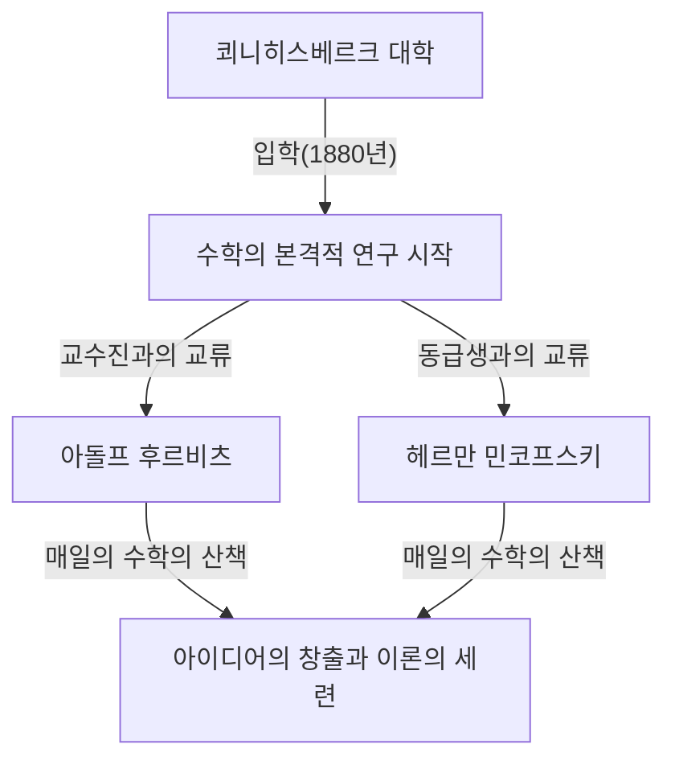
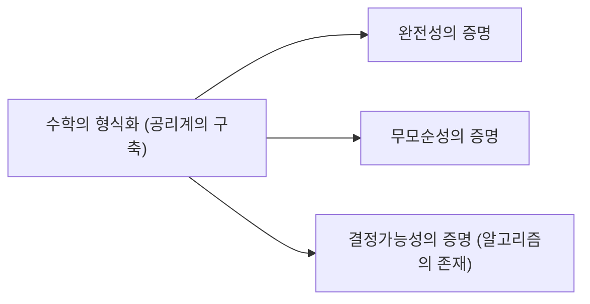

## 1. 서론: 현대 수학의 아버지로 불리는 이유

[다비트 힐베르트](https://kenji.blog/ko/p/hilbert/)(David Hilbert, 1862년 1월 23일 – 1943년 2월 14일)는 독일이 낳은 19세기 말부터 20세기 초에 걸친 가장 위대하고 영향력 있는 수학자 중 한 명입니다. 동시대의 프랑스 천재 [앙리 푸앵카레](https://kenji.blog/ko/p/poincare/)와 종종 병칭되는 힐베르트이지만, 푸앵카레가 직관을 중시한 반면 힐베르트는 철저한 논리와 형식을 중시했습니다. 힐베르트는 현대 수학의 거의 모든 분야에 결정적인 영향을 미쳤으며, **"수학의 왕"** 이라는 이명을 얻기까지 했습니다.

그의 업적은 불변식론, 대수적 정수론, 기하학의 공리화, 적분방정식론, 함수해석학(힐베르트 공간), 그리고 이론 물리학(일반 상대성 이론의 수학적 기초)에까지 이릅니다. 단순히 개별적인 미해결 문제를 풀었다는 것뿐만 아니라, 수학이라는 학문 그 자체의 존재 방식이나 구조를 근본적으로 재검토하고 공리주의와 형식주의라는 새로운 패러다임을 확립한 점에 그의 가장 큰 공적이 있습니다. 이 글에서는 힐베르트의 파란만장한 생애의 에피소드와 그가 남긴 빛나는 업적들을 깊고 상세하게 되돌아봅니다.

## 2. 탄생과 젊은 날의 쾨니히스베르크: 학문의 도시에서의 각성

힐베르트는 1862년 1월 23일, 프로이센 왕국 동프로이센 주의 주도인 쾨니히스베르크(현재 러시아 연방 칼리닌그라드) 근교의 벨라우에서 태어났습니다. 아버지 오토 힐베르트는 지방 법원의 판사였으며 엄격한 인물이었습니다. 어머니 마리아 테레제는 철학과 천문학에 깊은 관심을 가진 교양 있는 여성이었으며, 힐베르트의 논리적 사고력과 학문에 대한 탐구심은 이 부모로부터 깊이 물려받았다고 합니다.

쾨니히스베르크는 위대한 철학자 임마누엘 칸트의 고향이자, [레온하르트 오일러](https://kenji.blog/ko/p/euler/)가 해결한 '[쾨니히스베르크의 7개의 다리](https://kenji.blog/ko/p/seven-bridges-of-konigsberg/)' 문제로도 알려진, 학문과 연고가 깊은 거리였습니다. 소년 시절의 힐베르트는 학교 성적은 평범했지만, 수학에 대해서는 특별한 직관과 열정을 가지고 있었습니다. 그는 암기를 극단적으로 싫어했고, 자신의 머리로 논리를 처음부터 조립하여 문제를 해결하는 것을 좋아했습니다. 이 '암기에 의존하지 않고 논리의 기초부터 구축한다'는 태도는 이후 그의 수학적 스타일의 근간을 이루게 됩니다.

### "수학의 산책" 과 평생의 벗과의 만남

1880년, 쾨니히스베르크 대학에 입학한 힐베르트는 그곳에서 그의 인생을 크게 바꿀 두 인물을 만납니다. 한 명은 불과 18세에 파리 과학 아카데미 수학 대상을 수상한 압도적인 천재성을 지닌 헤르만 민코프스키(Hermann Minkowski)였고, 다른 한 명은 신진 기예의 젊은 교수였던 아돌프 후르비츠(Adolf Hurwitz)였습니다.

그들 세 명은 매일 정해진 시간에 대학 근처에 있는 사과나무 아래를 산책하며 최신 수학 문제에 대해 열띤 토론을 벌였습니다. 이 **"수학의 산책"** 이라고 불리는 일과는 젊은 힐베르트의 수학적 재능을 크게 꽃피우게 됩니다. 서로 전혀 다른 수학적 직관을 가진 세 사람이 사양하지 않고 의견을 부딪침으로써, 힐베르트는 자신의 아이디어를 세련되게 가다듬고 수학의 심연으로 발을 들여놓았습니다.

## 3. 불변식론에서의 돌파구: 고르단의 비판으로부터의 도약

힐베르트가 처음으로 세계적인 명성을 얻은 것은 불변식론(Invariant theory) 분야였습니다. 불변식론이란 좌표 변환 등의 변환을 수행해도 변하지 않는 다항식의 성질을 연구하는 분야입니다. 당시 이 분야의 1인자였던 파울 고르단(Paul Gordan)은 2변수의 불변식이 유한 개의 기저를 가진다는 것(고르단의 정리)을 증명했지만, 3변수 이상의 경우에 대해서는 매우 복잡한 계산이 필요하여 오랜 세월 동안 미해결로 남아 있었습니다.

1888년, 힐베르트는 전혀 새로운 접근 방식으로 이 난제에 도전했습니다. 그는 구체적인 기저의 식을 계산하여 구성한다는 전통적인 수법을 포기하고, 귀류법을 이용하여 **"유한 개의 기저가 존재해야 한다"** 는 존재 증명을 제시했습니다. 이것이 오늘날 **힐베르트의 기저 정리** 로 알려진 강력한 정리입니다.

고르단은 이 추상적이고 계산을 전혀 수반하지 않는 증명을 보고 **"이것은 수학이 아니다. 신학이다!"** (Das ist nicht Mathematik. Das ist Theologie!)라고 외치며 격노했다는 유명한 일화가 남아 있습니다. 그러나 나중에 고르단 역시 이 기법의 논리적 올바름과 강력함을 인정할 수밖에 없었습니다. 힐베르트의 이 업적은 수학의 중심이 '구체적인 계산에 의한 구성'에서 '추상적인 구조의 존재 증명'으로 이행하는 역사적인 대전환점이 되었습니다.

## 4. 대수적 정수론과 "수론 보고서" 의 금자탑

불변식론에서의 성공 이후, 힐베르트는 대수적 정수론 분야로 눈을 돌렸습니다. 1897년 독일 수학회의 의뢰를 받아 집필한 『수론 보고서』(Zahlbericht)는 당시의 대수적 정수론의 지식을 통합하고 전혀 새로운 시각에서 재구축한 기념비적인 저작입니다.

이 보고서 속에서 그는 갈루아 이론을 수론에 응용하여 힐베르트 유체론(Class field theory)의 기초를 다졌습니다. 유체론은 그 후 다카기 데이지나 에밀 아르틴 등에 의해 완성되어, 20세기 수론에서 가장 아름다운 이론 중 하나로 여겨지고 있습니다. 힐베르트는 언뜻 보기에 뿔뿔이 흩어져 있던 수론의 여러 결과들을 고차원의 아름다운 법칙 속에 통합해 보인 것입니다.

## 5. 기하학의 공리화: "테이블, 의자, 맥주잔" 의 철학

1899년, 힐베르트는 저서 『기하학 기초론』(Grundlagen der Geometrie)을 출판했습니다. 이것은 2000년 이상에 걸쳐 기하학의 절대적인 기초로 여겨져 온 [유클리드](https://kenji.blog/ko/p/euclid/) 기하학의 공리계를 현대적인 시각에서 완전히 재구축한 것입니다.

[유클리드](https://kenji.blog/ko/p/euclid/)의 『원론』에는 그림을 보고 판단하는 것과 같은 암묵적인 가정이나 직관에 의존한 부분이 몇 가지 존재했습니다. 힐베르트는 이것들을 철저히 배제하고 결합의 공리, 순서의 공리, 합동의 공리, 평행선의 공리, 연속성의 공리라는 5개의 그룹으로 이루어진 극히 엄밀한 공리계를 제시했습니다.

그는 **"점, 직선, 평면 대신에 테이블, 의자, 맥주잔이라고 말해도 성립하는 공리계여야 한다"** 고 말했습니다. 이것은 기하학의 대상이 현실 세계의 무엇인가 하는 직관적인 의미나 물리적인 실체를 완전히 벗겨내고, 대상 간의 논리적인 관계성만을 수학의 기초로 삼는 **형식주의** (Formalism)의 드높은 선언이었습니다. 이 획기적인 접근은 그 후 현대 수학에 있어서 공리적 접근의 표준적인 스타일이 되었습니다.

## 6. 괴팅겐 대학으로의 초빙과 황금시대의 막을 올리다

1895년, 독일 수학계의 중진이었던 펠릭스 클라인(Felix Klein)의 강력한 추천에 의해 힐베르트는 괴팅겐 대학의 교수로 취임했습니다. 괴팅겐 대학은 일찍이 [카를 프리드리히 가우스](https://kenji.blog/ko/p/gauss/)나 [베른하르트 리만](https://kenji.blog/ko/p/riemann/)이 재적했던, 말할 필요도 없는 수학의 성지였습니다.

힐베르트의 부임으로 괴팅겐은 다시 세계 최고의 수학 중심지로서의 지위를 확고히 했습니다. 그의 강의는 항상 명쾌하고 새로운 수학적 아이디어에 대한 열정으로 넘쳤으며, 전 세계에서 우수한 학생이나 연구자들이 그에게 모여들었습니다. [에미 뇌터](https://kenji.blog/ko/p/noether/)([Emmy Noether](https://kenji.blog/ko/p/noether/)), 헤르만 바일(Hermann Weyl), 리하르트 쿠란트(Richard Courant), 존 폰 노이만(John von Neumann) 등 훗날 20세기 수학을 견인하게 될 많은 거성들이 힐베르트의 훈도를 받았습니다.

특히 [에미 뇌터](https://kenji.blog/ko/p/noether/)에 관한 에피소드는 유명합니다. 당시 여성이 대학의 교수직이나 강사직에 취임하는 것은 규정으로 인정되지 않았지만, 힐베르트는 그녀의 유례없는 대수학의 재능을 높이 평가하고 교수회에서 격렬하게 항의했습니다. **"대학의 교수회는 목욕탕이 아니기 때문에 성별은 관계없다!"** 라는 그의 말은 그의 진보적이고 실력주의적이며 편견 없는 인품을 여실히 말해주고 있습니다.

## 7. 1900년 파리 국제 수학자 회의: 힐베르트의 23가지 문제

1900년, 파리에서 개최된 제2회 국제 수학자 회의(ICM)에서 힐베르트는 역사에 남을 기념비적인 강연을 실시했습니다. 그는 "앞으로의 세기에 수학의 진보를 이끌 문제는 무엇인가"라고 묻고, 20세기의 수학자가 해결을 목표로 해야 할 **"23가지 미해결 문제"** 를 제시했습니다.

이 문제들은 당시 수학의 모든 분야를 망라하고 있었으며, 그 후 수학 발전의 큰 원동력이 되었습니다. 다음은 특히 유명한 몇 가지입니다.

1. **연속체 가설** (제1문제): 가산 무한(자연수의 개수)과 연속체(실수의 개수) 사이에 중간 농도를 가진 집합이 존재하는가. 나중에 괴델과 코언에 의해 현재의 공리계(ZFC)에서는 증명도 반증도 할 수 없음이 밝혀졌습니다.
2. **산술의 공리의 무모순성** (제2문제): 자연수의 공리계가 모순을 포함하지 않음을 순수하게 유한적인 입장에서 증명하라.
3. **밑면과 높이가 같은 다면체의 부피** (제3문제): 밑넓이와 높이가 같은 두 다면체는 유한 번 절단하여 재조합함으로써 서로 변환할 수 있는가. 이것은 제자인 막스 덴에 의해 부정적으로 해결되었습니다.
6. **물리학의 공리화** (제6문제): 확률론이나 역학 등 수학이 중요한 역할을 하는 물리학의 분야를 기하학처럼 공리화하라.
8. **소수 분포에 관한 문제** (제8문제): 악명 높은 리만 가설과 [골드바흐의 추측](https://kenji.blog/ko/p/goldbachs-conjecture/). 이들은 현재도 미해결로 남아 있습니다.
10. **[디오판토스](https://kenji.blog/ko/p/diophantus/) 방정식의 가해성 결정** (제10문제): 임의의 다항식 방정식이 정수해를 가지는지 여부를 판정하는 일반적인 알고리즘을 찾아라. 1970년에 마티야세비치에 의해 그런 알고리즘은 존재하지 않는다는 것이 증명되었습니다.

힐베르트의 이러한 문제들은 현대의 수학자들에게도 여전히 중요한 이정표가 되고 있습니다.

## 8. 적분 방정식과 힐베르트 공간: 양자역학으로의 가교

1900년대에 들어서자 힐베르트의 관심은 대수학이나 기하학에서 해석학으로 옮겨갔습니다. 그는 스웨덴의 수학자 이바르 프레드홀름의 적분 방정식론을 깊이 연구하여 무한 차원 공간에서의 스펙트럼 이론을 구축했습니다.

이 과정에서 그가 도입한 것이 유한 차원의 [유클리드](https://kenji.blog/ko/p/euclid/) 공간을 무한 차원으로 일반화한 **힐베르트 공간** ([Hilbert](https://kenji.blog/ko/p/hilbert/) space)의 개념입니다. 내적 공간 $\mathcal{H}$ 에서의 내적 $\langle x, y \rangle$ 은 선형성과 에르미트 대칭성을 가지며 완비성(모든 코시 수열이 수렴하는 것)을 만족하는 공간으로서 엄밀하게 정의됩니다. 수식으로 나타내면 내적은 다음과 같은 성질을 만족합니다.

$$
\langle a x_1 + b x_2, y \rangle = a \langle x_1, y \rangle + b \langle x_2, y \rangle
$$
$$
\langle x, y \rangle = \overline{\langle y, x \rangle}
$$

여기서 $x, y, x_1, x_2 \in \mathcal{H}$ 이고 $a, b \in \mathbb{C}$ (복소수)이며, $\overline{\langle y, x \rangle}$ 은 복소 켤레를 나타냅니다. 또한 노름은 $\|x\| = \sqrt{\langle x, x \rangle}$ 에 의해 유도됩니다.

놀랍게도 힐베르트가 순수한 수학적 흥미에서 구축한 이 추상적인 이론은 수십 년 후에 탄생할 양자역학에서 물리계의 상태를 기술하기 위한 완벽한 수학적 언어임이 판명되었습니다. 베르너 하이젠베르크가 행렬역학을, 에르빈 슈뢰딩거가 파동역학을 정식화할 때 폰 노이만 등을 통해 힐베르트 공간 이론은 불가결한 도구가 되었습니다. 수학이 물리학을 앞질러 갔던 훌륭한 예입니다.

## 9. 물리학으로의 경도와 아인슈타인-힐베르트 작용

힐베르트는 항상 "물리학은 물리학자에게 너무 어렵다"라고 농담 반 진담 반으로 말했으며, 수학의 엄밀한 공리적 수법을 이용하여 물리학의 기초를 재구축하는 것을 목표로 했습니다(제6문제와도 관련되어 있습니다).

1915년, 알베르트 아인슈타인이 일반 상대성 이론의 중력장 방정식을 완성하기 위해 고투하고 있던 시기에 힐베르트 역시 이 문제에 몰두하고 있었습니다. 힐베르트는 변분 원리라는 수학적으로 세련된 수법을 이용하여 아인슈타인과 거의 동시에 올바른 중력장 방정식을 도출해 냈습니다. 현재 이 이론의 기초가 되는 작용 적분은 **아인슈타인-힐베르트 작용** (Einstein-[Hilbert](https://kenji.blog/ko/p/hilbert/) action)이라고 불립니다.

$$
S = \int \left( \frac{R}{16 \pi G} + \mathcal{L}_M \right) \sqrt{-g} \, d^4x
$$

수식의 의미: 여기서 $R$ 은 시공간의 휘어짐 정도를 나타내는 스칼라 곡률, $G$ 는 뉴턴의 중력 상수, $g$ 는 계량 텐서의 행렬식, $\mathcal{L}_M$ 은 물질장의 라그랑지안 밀도, 그리고 $\text{적분은 시공간 전체에 걸쳐 수행됩니다}$ .

아인슈타인과 힐베르트 사이에서 우선권을 둘러싼 다툼이 일어날까 우려되었지만, 힐베르트는 아인슈타인의 물리적 통찰의 위대함을 깊이 존경하고 있었으며, "이 방정식을 발견한 것은 아인슈타인이다"라고 공언하여 결코 우선권을 주장하지 않았습니다.

## 10. 힐베르트 프로그램: 수학의 절대적인 무모순성을 찾아서

제1차 세계 대전 후 집합론의 패러독스(러셀의 패러독스 등)에서 비롯된 '수학 기초의 위기'에 대응하기 위해 힐베르트는 그의 생애에서 가장 야심찬 계획인 **힐베르트 프로그램** 을 제창했습니다.

그는 모든 수학적 명제를 의미를 가지지 않는 기호의 열로 취급하고, 일정한 기계적인 추론 규칙에 따라 기호를 조작하는 '형식적 체계'로서 수학 전체를 재구축하려고 했습니다. 그리고 그 체계 안에서 " $0 = 1$ "과 같은 모순이 절대 도출되지 않는 것(무모순성)을 유한적이고 확실한 추론만을 이용하여 수학적으로 증명하는 것을 목표로 했습니다.

이 프로그램은 직관주의자인 라위천 에흐베르튀스 얀 브라우어 등과의 격렬한 논쟁(기초론 논쟁)을 불러일으켰지만, 힐베르트는 "아무도 우리를 칸토어가 만들어 준 낙원에서 추방할 수 없다"고 말하며 자신의 프로그램을 밀고 나갔습니다.

## 11. [괴델의 불완전성 정리](https://kenji.blog/ko/p/godels-incompleteness-theorems/)에 의한 충격과 프로그램의 변용

그러나 1931년 오스트리아의 젊은 논리학자 [쿠르트 괴델](https://kenji.blog/ko/p/godel/)([Kurt Gödel](https://kenji.blog/ko/p/godel/))이 발표한 **불완전성 정리** 에 의해 힐베르트 프로그램은 결정적인 타격을 입었습니다.

괴델은 자연수의 공리를 포함하는 충분히 강력한 형식적 체계에 있어서는 "그 체계 안에서는 참임에도 불구하고 증명도 반증도 할 수 없는 명제"가 반드시 존재한다는 것(제1불완전성 정리), 그리고 "그 체계 자신 속에서 자기 자신의 무모순성을 증명하는 것은 불가능하다"는 것(제2불완전성 정리)을 수학적으로 완전히 증명한 것입니다.

이로써 힐베르트가 꿈꿨던 "모든 것을 증명할 수 있고 자신의 무모순성을 증명할 수 있는 완벽한 수학 체계"의 구축은 불가능하다는 것이 나타났습니다. 힐베르트 자신은 이 결과에 처음에는 깊이 낙담하고 분노를 느꼈다고 전해지지만, 힐베르트 프로그램의 과정에서 발전한 메타 수학이나 형식 논리학의 엄밀한 수법은 훗날 [앨런 튜링](https://kenji.blog/ko/p/turing/)에 의한 컴퓨터 과학의 창설이나 이론 컴퓨터 과학의 발전으로 결정적으로 이어지게 됩니다.

## 12. 만년의 괴팅겐: 나치의 대두와 수학의 성지의 종언

1930년대에 들어서자 아돌프 히틀러가 이끄는 나치당이 독일에서 권력을 장악했습니다. 1933년에는 '직업 관료 재건법'이 제정되어 [에미 뇌터](https://kenji.blog/ko/p/noether/)나 헤르만 바일, 리하르트 쿠란트, 막스 보른 등 괴팅겐 대학에 재적하고 있던 많은 뛰어난 유대계 수학자나 반체제적인 학자가 가차 없이 대학에서 추방되었습니다.

한때 전 세계의 재능이 모여들어 활기로 가득 찼던 수학의 성지 괴팅겐은 순식간에 붕괴하고 말았습니다. 어느 날 나치의 교육부 장관 베른하르트 루스트가 연회에서 "유대인의 영향을 제거함으로써 연구소의 수학은 어떤 영향을 받았습니까"라고 묻자, 힐베르트는 분노와 비애를 담아 이렇게 대답했습니다. "영향을 받았냐고요? 장관님, 이제 괴팅겐에 수학은 존재하지 않아요."

1943년 2월 14일, 힐베르트는 제2차 세계 대전의 와중에 과거의 제자들 대부분이 미국 등으로 망명하여 떠나버린 괴팅겐에서 고독 속에 81세의 생애를 마감했습니다. 그의 장례식에 참석한 사람은 극소수였습니다.

## 13. 결론: "우리는 알아야만 한다, 우리는 알게 될 것이다"

[다비트 힐베르트](https://kenji.blog/ko/p/hilbert/)가 세상을 떠난 후에도 그가 남긴 수학적 유산은 빛이 바래지 않았습니다. 그의 사고의 궤적은 현대 수학의 모든 곳에 새겨져 있습니다.

그의 묘비에는 1930년에 그가 고향 쾨니히스베르크에서 행한 은퇴 기념 강연의 마지막을 장식했던, 인간의 이성과 과학적 탐구에 대한 흔들림 없는 절대적인 신뢰를 나타내는 유명한 말이 새겨져 있습니다. 이것은 "ignoramus et ignorabimus (우리는 모른다, 앞으로도 알 수 없을 것이다)"라는 당시의 비관적인 불가지론에 대한 강력한 반론이었습니다.

> **Wir müssen wissen.**
> **Wir werden wissen.**
> (우리는 알아야만 한다, 우리는 알게 될 것이다)

[다비트 힐베르트](https://kenji.blog/ko/p/hilbert/)는 수학이라는 학문이 가진 무한한 가능성을 깊이 믿고, 그 프론티어를 평생에 걸쳐 계속 개척해 나갔습니다. 그의 강인한 정신과 사상, 그리고 빛나는 업적은 현대 수학자들의 피와 살이 되어 오늘날에도 수학의 모든 곳에서 숨 쉬며 미래의 탐구자들을 계속 고무하고 있습니다.

## 연표

* **1862년**: 동프로이센의 쾨니히스베르크 근교 벨라우에서 탄생.
* **1880년**: 쾨니히스베르크 대학에 입학. 민코프스키, 후르비츠와 만남.
* **1885년**: 쾨니히스베르크 대학에서 박사 학위 취득.
* **1888년**: 불변식론에서의 "힐베르트의 기저 정리" 증명.
* **1895년**: 클라인의 초빙으로 괴팅겐 대학 교수 취임.
* **1897년**: 대수적 정수론에 관한 『수론 보고서』 발표.
* **1899년**: 『기하학 기초론』 출판, 기하학 공리화.
* **1900년**: 파리 국제 수학자 회의에서 "23가지 문제" 제시.
* **1909년**: 웨어링의 문제를 긍정적으로 해결.
* **1915년**: 일반 상대성 이론에서의 "아인슈타인-힐베르트 작용" 정식화.
* **1920년대**: "힐베르트 프로그램" 제창.
* **1930년**: 괴팅겐 대학 퇴직. "우리는 알아야만 한다, 우리는 알게 될 것이다" 강연.
* **1943년**: 괴팅겐에서 81세로 서거.
