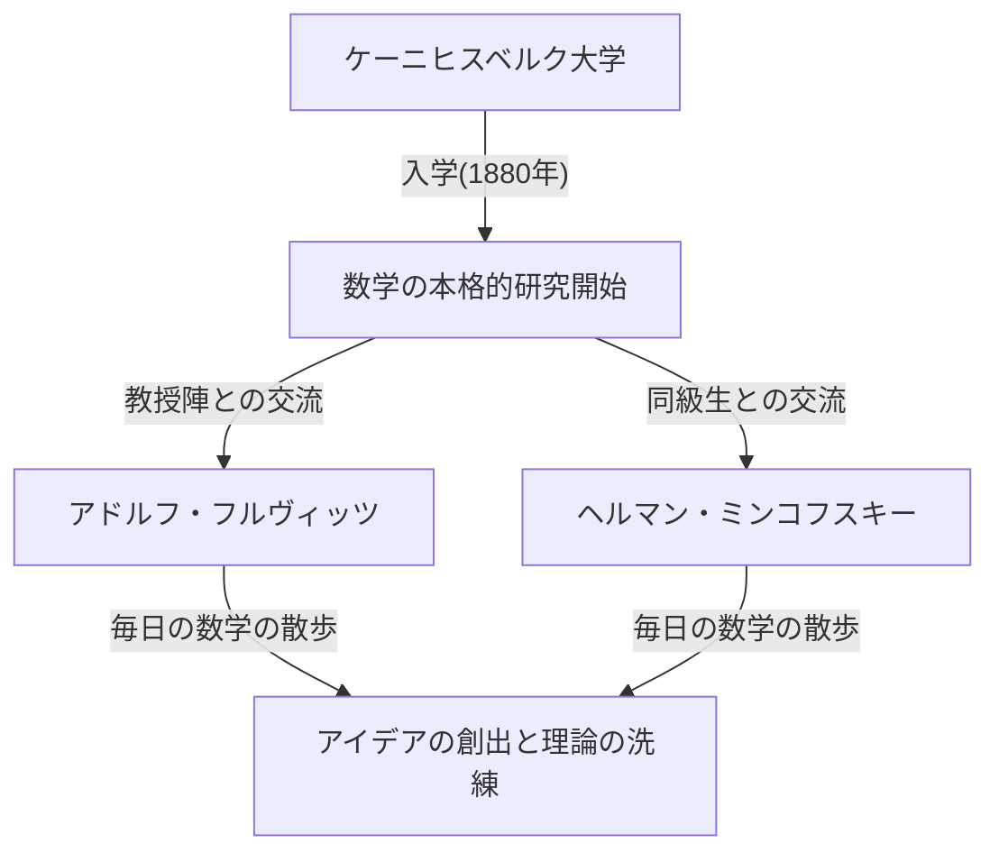
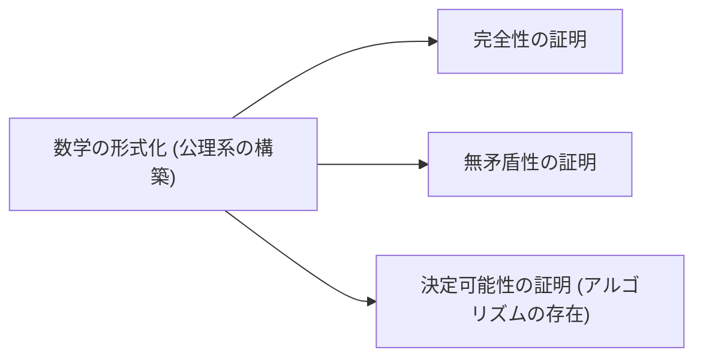

## 1. はじめに：現代数学の父と呼ばれる所以

[ダフィット・ヒルベルト](https://kenji.blog/p/hilbert/) (David Hilbert, 1862年1月23日 – 1943年2月14日) は、ドイツが生み出した、19世紀末から20世紀初頭にかけての最も偉大で影響力のある数学者の一人です。同時代のフランスの天才、アンリ・ポアンカレとしばしば並び称されるヒルベルトですが、ポアンカレが直観を重んじたのに対し、ヒルベルトは徹底した論理と形式を重んじました。[ヒルベルト](https://kenji.blog/p/hilbert/)は現代数学のほぼすべての分野に対して決定的な影響を与え、 **「数学の王」** という異名をとるまでに至りました。

彼の業績は、不変式論、代数的整数論、幾何学の公理化、積分方程式論、関数解析学 ([ヒルベルト](https://kenji.blog/p/hilbert/)空間) 、そして理論物理学 (一般相対性理論の数学的基礎) にまで及びます。単に個々の未解決問題を解いたというだけでなく、数学という学問そのもののあり方や構造を根底から見直し、公理主義や形式主義という新しいパラダイムを確立した点に彼の最大の功績があります。この記事では、[ヒルベルト](https://kenji.blog/p/hilbert/)の波乱に満ちた生涯のエピソードと、彼が残した輝かしい業績の数々を深く、そして詳細に振り返っていきます。

## 2. 誕生と若き日のケーニヒスベルク：学問の都での目覚め

[ヒルベルト](https://kenji.blog/p/hilbert/)は1862年1月23日、プロイセン王国の東プロイセン州の州都であるケーニヒスベルク (現在のロシア連邦カリーニングラード) 郊外のヴェーラウで生まれました。父のオットー・ヒルベルトは地方裁判所の判事であり、厳格な人物でした。母のマリア・テレーゼは哲学や天文学に深い関心を持つ教養豊かな女性で、[ヒルベルト](https://kenji.blog/p/hilbert/)の論理的思考力と学問への探求心は、この両親から深く受け継がれたと言われています。

ケーニヒスベルクは、偉大なる哲学者イマヌエル・カントの故郷であり、レオンハルト・[オイラー](https://kenji.blog/p/euler/)が解決した「ケーニヒスベルクの七つの橋」の問題でも知られる、学問とゆかりの深い街でした。少年時代の[ヒルベルト](https://kenji.blog/p/hilbert/)は、学校の成績こそ平凡でしたが、数学に対しては特別な直観と情熱を持っていました。彼は暗記を極端に嫌い、自らの頭で論理をゼロから組み立てて問題を解決することを好みました。この「暗記に頼らず、論理の基礎から構築する」という姿勢は、後の彼の数学的スタイルの根幹を成すことになります。

### 「数学の散歩」と生涯の友との出会い

1880年、ケーニヒスベルク大学に入学した[ヒルベルト](https://kenji.blog/p/hilbert/)は、そこで彼の人生を大きく変える二人の人物と出会います。一人は、わずか18歳でパリ科学アカデミーの数学大賞を受賞した圧倒的な天才肌のヘルマン・ミンコフスキー (Hermann Minkowski) であり、もう一人は新進気鋭の若き教授であったアドルフ・フルヴィッツ (Adolf Hurwitz) でした。

彼ら三人は毎日のように決まった時間に、大学の近くにあるリンゴの木の下を散歩しながら、最新の数学の問題について熱心に議論を交わしました。この **「数学の散歩」** と呼ばれる日課は、若き[ヒルベルト](https://kenji.blog/p/hilbert/)の数学的才能を大きく開花させることになります。互いに全く異なる数学的直観を持つ三人が、遠慮なく意見をぶつけ合うことで、[ヒルベルト](https://kenji.blog/p/hilbert/)は自らのアイデアを洗練させ、数学の深淵へと足を踏み入れていきました。

## 3. 不変式論におけるブレイクスルー：ゴルダンの批判からの飛躍

[ヒルベルト](https://kenji.blog/p/hilbert/)が最初に世界的な名声を獲得したのは、不変式論 (Invariant theory) の分野でした。不変式論とは、座標変換などの変換を行っても変化しない多項式の性質を研究する分野です。当時、この分野の第一人者であったパウル・ゴルダン (Paul Gordan) は、2変数の不変式が有限個の基底を持つこと (ゴルダンの定理) を証明していましたが、3変数以上の場合については非常に複雑な計算が必要であり、長年にわたり未解決のままでした。

1888年、[ヒルベルト](https://kenji.blog/p/hilbert/)は全く新しいアプローチでこの難問に取り組みました。彼は具体的な基底の式を計算して構成するという伝統的な手法を放棄し、背理法を用いて **「有限個の基底が存在しなければならない」** という存在証明を提示しました。これが今日、 **[ヒルベルト](https://kenji.blog/p/hilbert/)の基底定理** として知られる強力な定理です。

ゴルダンはこの抽象的で計算を全く伴わない証明を見て、 **「これは数学ではない。神学だ！」** (Das ist nicht Mathematik. Das ist Theologie!) と叫んで激怒したという有名な逸話が残されています。しかし、後にゴルダンもこの手法の論理的な正しさと強力さを認めざるを得ませんでした。[ヒルベルト](https://kenji.blog/p/hilbert/)のこの業績は、数学の中心が「具体的な計算による構成」から「抽象的な構造の存在証明」へと移行する、歴史的な大転換点となりました。

## 4. 代数的整数論と「数論報告」の金字塔

不変式論での成功の後、[ヒルベルト](https://kenji.blog/p/hilbert/)は代数的整数論の分野に目を向けました。1897年にドイツ数学会の依頼を受けて執筆した『数論報告』 (Zahlbericht) は、当時の代数的整数論の知識を統合し、全く新しい視点から再構築した記念碑的な著作です。

この報告書の中で、彼は[ガロア理論](https://kenji.blog/p/galois-theory/)を数論に応用し、ヒルベルトの類体論 (Class field theory) の基礎を築きました。類体論は、その後高木貞治やエミール・アルティンらによって完成され、20世紀の数論において最も美しい理論の一つとされています。[ヒルベルト](https://kenji.blog/p/hilbert/)は、一見バラバラに見えていた数論の諸結果を、高次の美しい法則の中に統合してみせたのです。

## 5. 幾何学の公理化：「テーブル、椅子、ビールジョッキ」の哲学

1899年、[ヒルベルト](https://kenji.blog/p/hilbert/)は著書『幾何学基礎論』 (Grundlagen der Geometrie) を出版しました。これは、2000年以上にわたって幾何学の絶対的な基礎とされてきた[ユークリッド](https://kenji.blog/p/euclid/)幾何学の公理系を、現代的な視点から完全に再構築したものです。

[ユークリッド](https://kenji.blog/p/euclid/)の『原論』には、図を見て判断するような暗黙の仮定や直観に依存した部分がいくつか存在していました。[ヒルベルト](https://kenji.blog/p/hilbert/)はこれらを徹底的に排除し、結合の公理、順序の公理、合同の公理、平行線の公理、連続性の公理という5つのグループからなる、極めて厳密な公理系を提示しました。

彼は **「点、直線、平面の代わりに、テーブル、椅子、ビールジョッキと言っても成り立つような公理系でなければならない」** と述べました。これは、幾何学の対象が現実世界の何であるかという直観的な意味や物理的な実体を完全に剥ぎ取り、対象間の論理的な関係性のみを数学の基礎とする **形式主義** (Formalism) の高らかな宣言でした。この画期的なアプローチは、その後の現代数学における公理的アプローチの標準的なスタイルとなりました。

## 6. ゲッティンゲン大学への招聘と黄金時代の幕開け

1895年、ドイツ数学界の重鎮であったフェリックス・クライン (Felix Klein) の強力な推薦により、[ヒルベルト](https://kenji.blog/p/hilbert/)はゲッティンゲン大学の教授に就任しました。ゲッティンゲン大学は、かつてカール・フリードリヒ・ガウスや[ベルンハルト・リーマン](https://kenji.blog/p/riemann/)が在籍した、言わずと知れた数学の聖地でした。

[ヒルベルト](https://kenji.blog/p/hilbert/)の着任により、ゲッティンゲンは再び世界最高の数学の中心地としての地位を確固たるものにしました。彼の講義は常に明快で、新しい数学的アイデアへの情熱に溢れており、世界中から優秀な学生や研究者が彼のもとに集まりました。エミー・ネーター (Emmy Noether) 、ヘルマン・ワイル (Hermann Weyl) 、リヒャルト・クーラント (Richard Courant) 、ジョン・フォン・ノイマン (John von Neumann) など、後に20世紀の数学を牽引することになる多くの巨星たちが[ヒルベルト](https://kenji.blog/p/hilbert/)の薫陶を受けました。

特に[エミー・ネーター](https://kenji.blog/p/noether/)に関するエピソードは有名です。当時、女性が大学の教授職や講師職に就くことは規則で認められていませんでしたが、[ヒルベルト](https://kenji.blog/p/hilbert/)は彼女の並外れた代数学の才能を高く評価し、教授会で激しく抗議しました。 **「大学の教授会は銭湯ではないのだから、性別は関係ない！」** という彼の言葉は、彼の進歩的で実力主義的な、そして偏見のない人柄を如実に物語っています。

## 7. 1900年パリ国際数学者会議：[ヒルベルト](https://kenji.blog/p/hilbert/)の23の問題

1900年、パリで開催された第2回国際数学者会議 (ICM) において、[ヒルベルト](https://kenji.blog/p/hilbert/)は歴史に残る記念碑的な講演を行いました。彼は「これからの世紀において、数学の進歩を導くであろう問題は何か」と問いかけ、20世紀の数学者が解決を目指すべき **「23の未解決問題」** を提示しました。

これらの問題は、当時の数学のあらゆる分野を網羅しており、その後の数学の発展の大きな原動力となりました。以下に、特に有名なものをいくつか紹介します。

1. **連続体仮説** (第1問題) ：可算無限 (自然数の数) と連続体 (実数の数) の間に、中間の濃度を持つ集合は存在するか。後に[ゲーデル](https://kenji.blog/p/godel/)とコーエンによって、現在の公理系 (ZFC) では証明も反証もできないことが示されました。
2. **算術の公理の無矛盾性** (第2問題) ：自然数の公理系が矛盾を含まないことを純粋に有限的な立場で証明せよ。
3. **等底・等高の多面体の体積** (第3問題) ：同じ底面積と高さを持つ2つの多面体は、有限回切断して組み替えることで互いに移り変われるか。これは弟子のマックス・デーンによって否定的に解決されました。
6. **物理学の公理化** (第6問題) ：確率論や力学など、数学が重要な役割を果たす物理学の分野を、幾何学のように公理化せよ。
8. **素数分布に関する問題** (第8問題) ：悪名高い[リーマン予想](https://kenji.blog/p/riemann-hypothesis/)とゴールドバッハの予想。これらは現在でも未解決のままです。
10. **[ディオファントス](https://kenji.blog/p/diophantus/)方程式の可解性の決定** (第10問題) ：任意の多項式方程式が整数解を持つかどうかを判定する一般的なアルゴリズムを見つけよ。1970年にマチヤセヴィッチによって、そのようなアルゴリズムは存在しないことが証明されました。

[ヒルベルト](https://kenji.blog/p/hilbert/)のこれらの問題は、現代の数学者たちにとっても依然として重要な道標であり続けています。

## 8. 積分方程式と[ヒルベルト](https://kenji.blog/p/hilbert/)空間：量子力学への架け橋

1900年代に入ると、[ヒルベルト](https://kenji.blog/p/hilbert/)の関心は代数学や幾何学から、解析学へと移りました。彼はスウェーデンの数学者イヴァル・フレドホルムの積分方程式論を深く研究し、無限次元の空間におけるスペクトル理論を構築しました。

この過程で彼が導入したのが、有限次元の[ユークリッド](https://kenji.blog/p/euclid/)空間を無限次元へと一般化した **ヒルベルト空間** (Hilbert space) の概念です。内積空間 $\mathcal{H}$ における内積 $\langle x, y \rangle$ は、線形性とエルミート対称性を持ち、完全性 (すべての[コーシー](https://kenji.blog/p/cauchy/)列が収束すること) を満たす空間として厳密に定義されます。数式で表すと、内積は以下の性質を満たします。

$$
\langle a x_1 + b x_2, y \rangle = a \langle x_1, y \rangle + b \langle x_2, y \rangle
$$
$$
\langle x, y \rangle = \overline{\langle y, x \rangle}
$$

ここで、$x, y, x_1, x_2 \in \mathcal{H}$ であり、$a, b \in \mathbb{C}$ (複素数) であり、 $\overline{\langle y, x \rangle}$ は複素共役を表します。また、ノルムは $\|x\| = \sqrt{\langle x, x \rangle}$ によって導かれます。

驚くべきことに、[ヒルベルト](https://kenji.blog/p/hilbert/)が純粋な数学的興味から構築したこの抽象的な理論は、数十年後に誕生する量子力学において、物理系の状態を記述するための完璧な数学的言語であることが判明しました。ヴェルナー・ハイゼンベルクが行列力学を、エルヴィン・シュレディンガーが波動力学を定式化する際、フォン・ノイマンらを通じて[ヒルベルト](https://kenji.blog/p/hilbert/)空間の理論は不可欠なツールとなりました。数学が物理学を先回りしていた見事な例です。

## 9. 物理学への傾倒とアインシュタイン・[ヒルベルト](https://kenji.blog/p/hilbert/)作用

[ヒルベルト](https://kenji.blog/p/hilbert/)は常々「物理学は物理学者には難しすぎる」と冗談交じりに語っており、数学の厳密な公理的手法を用いて物理学の基礎を再構築することを目指していました (第6問題にも関連しています) 。

1915年、アルベルト・アインシュタインが一般相対性理論の重力場方程式を完成させるべく苦闘していた時期、[ヒルベルト](https://kenji.blog/p/hilbert/)もまたこの問題に取り組んでいました。ヒルベルトは変分原理という数学的に洗練された手法を用いて、アインシュタインとほぼ同時に正しい重力場の方程式を導き出しました。現在、この理論の基礎となる作用積分は **アインシュタイン・ヒルベルト作用** (Einstein-[Hilbert](https://kenji.blog/p/hilbert/) action) と呼ばれています。

$$
S = \int \left( \frac{R}{16 \pi G} + \mathcal{L}_M \right) \sqrt{-g} \, d^4x
$$

数式の意味：ここで、$R$ は時空の曲がり具合を表すスカラー曲率、$G$ は[ニュートン](https://kenji.blog/p/newton/)の重力定数、$g$ は計量テンソルの行列式、$\mathcal{L}_M$ は物質場のラグランジアン密度、そして $\text{積分は時空全体にわたって行われます}$。

アインシュタインと[ヒルベルト](https://kenji.blog/p/hilbert/)の間で優先権を巡る争いが生じるかと思われましたが、[ヒルベルト](https://kenji.blog/p/hilbert/)はアインシュタインの物理的洞察の偉大さを深く尊敬しており、「この方程式を発見したのはアインシュタインである」と公言して、決して優先権を主張することはありませんでした。

## 10. [ヒルベルト](https://kenji.blog/p/hilbert/)・プログラム：数学の絶対的な無矛盾性を求めて

第一次世界大戦後、集合論のパラドックス (ラッセルのパラドックスなど) に端を発する「数学の基礎の危機」に対応するため、[ヒルベルト](https://kenji.blog/p/hilbert/)は彼の生涯で最も野心的な計画である **[ヒルベルト](https://kenji.blog/p/hilbert/)・プログラム** を提唱しました。

彼は、すべての数学的命題を意味を持たない記号の列として扱い、一定の機械的な推論規則に従って記号を操作する「形式的体系」として数学全体を再構築しようとしました。そして、その体系の中で「 $0 = 1$ 」のような矛盾が絶対に導かれないこと (無矛盾性) を、有限的で確実な推論のみを用いて数学的に証明することを目標としました。

このプログラムは、直観主義者であるライツェン・エヒベルトゥス・ヤン・ブラウワーらとの激しい論争 (基礎論争) を引き起こしましたが、[ヒルベルト](https://kenji.blog/p/hilbert/)は「誰も我々をカントールが作ってくれた楽園から追放することはできない」と述べ、自らのプログラムを推し進めました。

## 11. [ゲーデルの不完全性定理](https://kenji.blog/p/godels-incompleteness-theorems/)による衝撃とプログラムの変容

しかし、1931年、オーストリアの若き論理学者[クルト・ゲーデル](https://kenji.blog/p/godel/) (Kurt Gödel) が発表した **不完全性定理** によって、[ヒルベルト](https://kenji.blog/p/hilbert/)・プログラムは決定的な打撃を受けました。

[ゲーデル](https://kenji.blog/p/godel/)は、自然数の公理を含む十分に強力な形式的体系においては、「その体系の中では真であるにもかかわらず、証明も反証もできない命題」が必ず存在すること (第一不完全性定理) 、そして「その体系自身の中で、自分自身の無矛盾性を証明することは不可能である」こと (第二[不完全性定理](https://kenji.blog/p/godels-incompleteness-theorems/)) を数学的に完全に証明したのです。

これにより、[ヒルベルト](https://kenji.blog/p/hilbert/)が夢見た「すべてを証明でき、自らの無矛盾性を証明できる完璧な数学体系」の構築は不可能であることが示されました。ヒルベルト自身はこの結果に当初深く落胆し怒りを覚えたと言われていますが、ヒルベルト・プログラムの過程で発展したメタ数学や形式論理学の厳密な手法は、後の[アラン・チューリング](https://kenji.blog/p/turing/)による計算機科学の創設や理論計算機科学の発展へと決定的に繋がっていくことになります。

## 12. 晩年のゲッティンゲン：ナチスの台頭と数学の聖地の終焉

1930年代に入ると、アドルフ・ヒトラー率いるナチス党がドイツで権力を掌握しました。1933年には「職業官吏再建法」が制定され、[エミー・ネーター](https://kenji.blog/p/noether/)やヘルマン・ワイル、リヒャルト・クーラント、マックス・ボルンなど、ゲッティンゲン大学に在籍していた多くの優れたユダヤ系数学者や反体制的な学者が容赦なく大学から追放されました。

かつて世界中の才能が集まり、活気に満ちていた数学の聖地ゲッティンゲンは、あっという間に崩壊してしまいました。ある時、ナチスの教育大臣ベルンハルト・ルストから宴席で「ユダヤ人の影響を取り除いたことで、研究所の数学はどのような影響を受けたか」と問われた[ヒルベルト](https://kenji.blog/p/hilbert/)は、怒りと悲哀を込めてこう答えました。「影響を受けたですって？ 大臣、もうゲッティンゲンに数学は存在しませんよ。」

1943年2月14日、[ヒルベルト](https://kenji.blog/p/hilbert/)は第二次世界大戦のさなか、かつての教え子たちの大半がアメリカなどへ亡命し去ったゲッティンゲンで、孤独のうちに81歳の生涯を閉じました。彼の葬儀に参列した人はごくわずかでした。

## 13. 結論：「我々は知らねばならない、我々は知るであろう」

[ダフィット・ヒルベルト](https://kenji.blog/p/hilbert/)が亡くなった後も、彼の残した数学的遺産は色褪せることはありませんでした。彼の思考の軌跡は、現代数学のあらゆるところに刻み込まれています。

彼の墓石には、1930年に彼が故郷ケーニヒスベルクで行った引退記念講演の最後を締めくくった、人間の理性と科学的探求への揺るぎない絶対的な信頼を示す有名な言葉が刻まれています。これは「 ignoramus et ignorabimus (我々は知らない、今後も知ることはないであろう) 」という当時の悲観的な不可知論に対する、力強い反論でした。

> **Wir müssen wissen.**
> **Wir werden wissen.**
> (我々は知らねばならない、我々は知るであろう)

[ダフィット・ヒルベルト](https://kenji.blog/p/hilbert/)は、数学という学問の持つ無限の可能性を深く信じ、そのフロンティアを生涯にわたって切り拓き続けました。彼の強靭な精神と思想、そして輝かしい業績は、現代の数学者たちの血肉となり、今日でも数学のあらゆる場所に息づき、未来の探求者たちを鼓舞し続けています。

## 年表

* **1862年**：東プロイセンのケーニヒスベルク近郊ヴェーラウで誕生。
* **1880年**：ケーニヒスベルク大学に入学。ミンコフスキー、フルヴィッツと出会う。
* **1885年**：ケーニヒスベルク大学で博士号を取得。
* **1888年**：不変式論における「[ヒルベルト](https://kenji.blog/p/hilbert/)の基底定理」を証明。
* **1895年**：クラインの招きにより、ゲッティンゲン大学教授に就任。
* **1897年**：代数的整数論に関する『数論報告』を発表。
* **1899年**：『幾何学基礎論』を出版し、幾何学を公理化。
* **1900年**：パリ国際数学者会議で「23の問題」を提示。
* **1909年**：ウェアリングの問題を肯定的に解決。
* **1915年**：一般相対性理論における「アインシュタイン・[ヒルベルト](https://kenji.blog/p/hilbert/)作用」を定式化。
* **1920年代**：「[ヒルベルト](https://kenji.blog/p/hilbert/)・プログラム」を提唱。
* **1930年**：ゲッティンゲン大学を退職。「我々は知らねばならない、我々は知るであろう」の講演。
* **1943年**：ゲッティンゲンにて81歳で死去。
