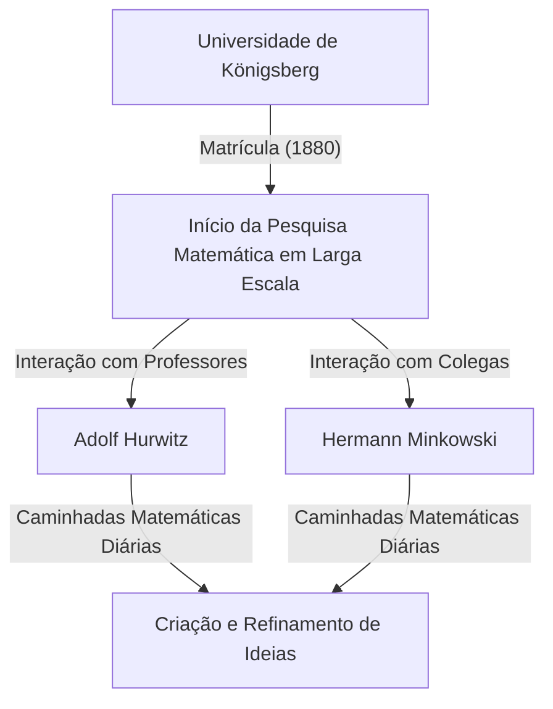
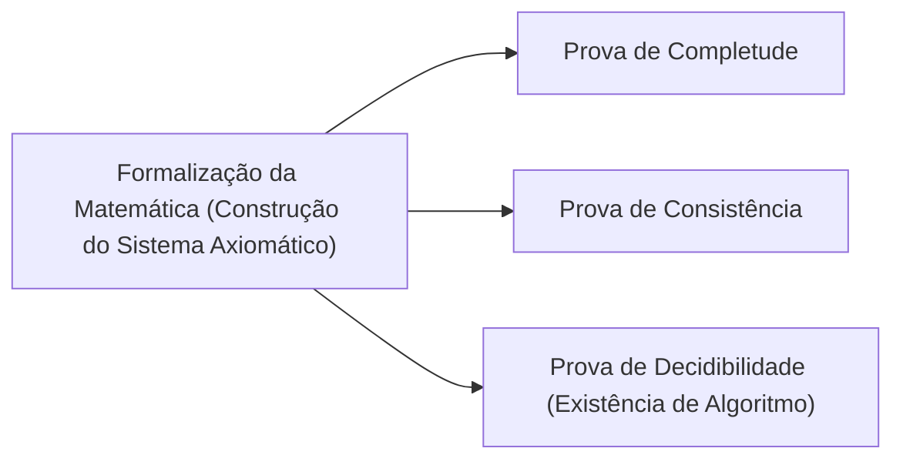

## 1. Introdução: O Pai da Matemática Moderna

David Hilbert (23 de janeiro de 1862 – 14 de fevereiro de 1943) foi um matemático alemão, amplamente reconhecido como um dos mais influentes e brilhantes matemáticos do final do século XIX e início do século XX. Frequentemente comparado ao seu brilhante contemporâneo francês Henri Poincaré, Hilbert enfatizava a lógica estrita e o formalismo, em contraste com a dependência de Poincaré da intuição. Hilbert influenciou profundamente quase todos os campos da matemática moderna, ganhando o apelido de **"O Rei da Matemática"**.

Suas contribuições abrangem a teoria dos invariantes, teoria dos números algébricos, axiomatização da geometria, equações integrais, análise funcional (espaços de Hilbert) e física teórica (os fundamentos matemáticos da relatividade geral). Seu maior legado reside não apenas na resolução de problemas em aberto isolados, mas em reimaginar fundamentalmente a estrutura e a natureza da própria matemática, estabelecendo os novos paradigmas do axiomatismo e formalismo. Neste artigo, damos uma olhada profunda e detalhada nos episódios dramáticos da vida de Hilbert e em suas brilhantes realizações.

## 2. Nascimento e Primeiros Dias em Königsberg: O Despertar na Cidade do Aprendizado

Hilbert nasceu em 23 de janeiro de 1862, em Wehlau, perto de Königsberg (agora Kaliningrado, Rússia), a capital da Província da Prússia Oriental no Reino da Prússia. Seu pai, Otto Hilbert, era um rígido juiz distrital. Sua mãe, Maria Therese, era uma mulher bem-educada com um profundo interesse em filosofia e astronomia. Diz-se que Hilbert herdou seu pensamento lógico e sede de conhecimento de seus pais.

Königsberg era uma cidade com raízes acadêmicas profundas; foi o local de nascimento do grande filósofo Immanuel Kant e famosa pelo problema das "Sete Pontes de Königsberg" resolvido por Leonhard Euler. Durante seus dias de escola, as notas de Hilbert não eram notáveis, mas ele possuía uma intuição e paixão especiais pela matemática. Ele detestava a memorização mecânica, preferindo resolver problemas construindo a lógica do zero em sua própria mente. Essa abordagem — construir a partir de fundamentos lógicos em vez de depender da memorização — tornou-se o núcleo de seu estilo matemático posterior.

### "Caminhadas Matemáticas" e Amigos Para a Vida Toda

Em 1880, Hilbert ingressou na Universidade de Königsberg, onde conheceu duas pessoas que mudariam sua vida. Um deles era o gênio Hermann Minkowski, que havia ganhado o prêmio de matemática da Academia de Ciências de Paris com apenas 18 anos. O outro era Adolf Hurwitz, um jovem e brilhante professor.

Os três criaram o hábito diário de caminhar sob uma macieira perto da universidade em um horário definido, discutindo apaixonadamente os últimos problemas matemáticos. Essas **"caminhadas matemáticas"** diárias permitiram que o jovem talento matemático de Hilbert florescesse totalmente. Ao confrontar ideias com duas mentes que possuíam intuições matemáticas completamente diferentes, Hilbert refinou seus próprios conceitos e mergulhou nas profundezas da matemática.

## 3. Avanço na Teoria dos Invariantes: Saltando Além da Crítica de Gordan

Hilbert ganhou fama mundial pela primeira vez no campo da teoria dos invariantes. A teoria dos invariantes estuda as propriedades dos polinômios que permanecem inalterados sob transformações de coordenadas. Na época, Paul Gordan, o principal especialista neste campo, havia provado que invariantes de duas variáveis têm uma base finita (teorema de Gordan), mas o caso para três ou mais variáveis exigia cálculos extremamente complexos e permaneceu um problema não resolvido por anos.

Em 1888, Hilbert enfrentou esse desafio com uma abordagem totalmente nova. Abandonando o método tradicional de calcular e construir explicitamente as fórmulas da base, ele usou a prova por contradição para apresentar uma prova de existência de que **"deve existir uma base finita"**. Este poderoso teorema é conhecido hoje como o **teorema da base de Hilbert**.

Reza a lenda que, ao ver essa prova abstrata completamente desprovida de cálculo, Gordan exclamou furioso: **"Isso não é matemática. É teologia!"** (Das ist nicht Mathematik. Das ist Theologie!). Mais tarde, no entanto, até mesmo Gordan teve que admitir a correção lógica e o poder desse método. A conquista de Hilbert marcou um ponto de virada histórico onde o centro da matemática mudou de "construção através de cálculo específico" para "prova de existência de estruturas abstratas".

## 4. Teoria dos Números Algébricos e o Monumental "Zahlbericht"

Seguindo seu sucesso na teoria dos invariantes, Hilbert voltou-se para a teoria dos números algébricos. Encarregado pela Sociedade Matemática Alemã em 1897, ele foi o autor do "Zahlbericht" (Relatório sobre os Números), uma obra monumental que sintetizou o conhecimento existente da teoria dos números algébricos e a reconstruiu a partir de uma perspectiva totalmente nova.

Neste relatório, ele aplicou a teoria de Galois à teoria dos números, estabelecendo as bases para a teoria dos corpos de classes de Hilbert. A teoria dos corpos de classes, mais tarde aperfeiçoada por Teiji Takagi e Emil Artin, é considerada uma das mais belas teorias da teoria dos números do século XX. Hilbert conseguiu unificar resultados aparentemente díspares na teoria dos números sob leis superiores e belas.

## 5. Axiomatização da Geometria: A Filosofia de "Mesas, Cadeiras e Canecas de Cerveja"

Em 1899, Hilbert publicou o livro "Grundlagen der Geometrie" (Fundamentos da Geometria). Ele reconstruiu completamente o sistema axiomático da geometria euclidiana, que tinha sido o alicerce absoluto da geometria por mais de 2000 anos, de uma perspectiva moderna.

Os "Elementos" de Euclides continham várias suposições implícitas e elementos que dependiam da intuição visual. Hilbert os eliminou rigorosamente, apresentando um sistema axiomático estritamente definido composto por cinco grupos: axiomas de incidência, ordem, congruência, paralelismo e continuidade.

Ele declarou famosamente: **"Deve-se sempre poder dizer — em vez de pontos, linhas retas e planos — mesas, cadeiras e canecas de cerveja."** Esta foi uma declaração retumbante do **formalismo**, despojando a geometria de qualquer realidade intuitiva ou física sobre o que são os objetos, e estabelecendo apenas as relações lógicas entre os objetos como a base da matemática. Esta abordagem inovadora tornou-se o estilo padrão do método axiomático na matemática moderna.

## 6. Convite para a Universidade de Göttingen e o Amanhecer de uma Era de Ouro

Em 1895, graças à forte recomendação de Felix Klein, um peso-pesado da matemática alemã, Hilbert foi nomeado professor na Universidade de Göttingen. Göttingen já era conhecida como um solo sagrado para a matemática, tendo abrigado Carl Friedrich Gauss e Bernhard Riemann no passado.

Com a chegada de Hilbert, Göttingen se restabeleceu firmemente como o principal centro matemático do mundo. Suas palestras eram sempre claras e transbordantes de paixão por novas ideias matemáticas, atraindo estudantes brilhantes e pesquisadores de todo o globo. Muitas superestrelas que mais tarde liderariam a matemática do século XX, como Emmy Noether, Hermann Weyl, Richard Courant e John von Neumann, foram orientados por Hilbert.

A anedota sobre Emmy Noether é particularmente famosa. Na época, as regras da universidade proibiam mulheres de ocupar cargos acadêmicos. Hilbert, valorizando muito o seu excepcional talento em álgebra, protestou ferozmente na reunião do conselho de professores, declarando: **"O senado da universidade não é uma casa de banhos, portanto o sexo não importa!"** Esta declaração ilustra vividamente o seu caráter progressista, meritocrático e sem preconceitos.

## 7. O Congresso Internacional de Matemáticos de Paris de 1900: Os 23 Problemas de Hilbert

Em 1900, no segundo Congresso Internacional de Matemáticos (ICM) realizado em Paris, Hilbert proferiu um discurso histórico e monumental. Perguntando "Quais são os problemas que guiarão o progresso da matemática no século vindouro?", ele apresentou **"23 problemas não resolvidos"** que os matemáticos do século XX deveriam se esforçar para solucionar.

Estes problemas englobavam todos os campos da matemática na época e serviram como uma enorme força motriz para o desenvolvimento matemático subsequente. Aqui estão alguns dos mais famosos:

1. **A Hipótese do Contínuo** (1º Problema): Existe um conjunto cuja cardinalidade está estritamente entre a dos inteiros e a dos números reais? Mais tarde, Gödel e Cohen provaram que isto é independente dos axiomas padrão ZFC.
2. **A Consistência dos Axiomas da Aritmética** (2º Problema): Prove que os axiomas da aritmética são consistentes usando apenas métodos finitistas.
3. **A Igualdade de Volumes de Dois Tetraedros com Bases e Alturas Iguais** (3º Problema): Podem dois desses poliedros sempre ser particionados em um número finito de peças e remontados um no outro? Isso foi resolvido negativamente por seu aluno Max Dehn.
6. **Axiomatização da Física** (6º Problema): Axiomatizar ramos da física onde a matemática desempenha um papel crucial, como a teoria das probabilidades e a mecânica.
8. **Problemas Relacionados à Distribuição de Números Primos** (8º Problema): A infame Hipótese de Riemann e a Conjectura de Goldbach. Eles continuam sem solução até hoje.
10. **Determinação da Solubilidade de uma Equação Diofantina** (10º Problema): Encontrar um algoritmo geral para determinar se uma dada equação polinomial com coeficientes inteiros tem uma solução inteira. Em 1970, Matiyasevich provou que tal algoritmo não existe.

Os problemas de Hilbert continuam a ser sinais vitais para os matemáticos modernos ainda hoje.

## 8. Equações Integrais e o Espaço de Hilbert: Uma Ponte para a Mecânica Quântica

Entrando nos anos 1900, o interesse de Hilbert mudou da álgebra e geometria para a análise. Ele estudou profundamente a teoria das equações integrais do matemático sueco Ivar Fredholm e construiu uma teoria espectral em espaços de dimensão infinita.

Através desse processo, ele introduziu o conceito de **espaço de Hilbert**, uma generalização do espaço euclidiano de dimensão finita para infinitas dimensões. O produto interno $\langle x, y \rangle$ em um espaço de produto interno $\mathcal{H}$ é estritamente definido como um espaço que possui linearidade e simetria hermitiana, e satisfaz a completude (todas as sequências de Cauchy convergem). Expresso matematicamente, o produto interno satisfaz:

$$
\langle a x_1 + b x_2, y \rangle = a \langle x_1, y \rangle + b \langle x_2, y \rangle
$$
$$
\langle x, y \rangle = \overline{\langle y, x \rangle}
$$

Aqui, $x, y, x_1, x_2 \in \mathcal{H}$ e $a, b \in \mathbb{C}$ (números complexos), e $\overline{\langle y, x \rangle}$ denota o complexo conjugado. A norma é induzida por $\|x\| = \sqrt{\langle x, x \rangle}$.

Surpreendentemente, essa teoria abstrata, que Hilbert construiu por pura curiosidade matemática, provou-se, décadas depois, ser a linguagem matemática perfeita para descrever os estados dos sistemas físicos na nascente mecânica quântica. Quando Werner Heisenberg formulou a mecânica matricial e Erwin Schrödinger formulou a mecânica ondulatória, a teoria dos espaços de Hilbert tornou-se uma ferramenta indispensável, principalmente através do trabalho de John von Neumann. É um exemplo impressionante da matemática antecipando a física.

## 9. Incursão na Física e a Ação de Einstein-Hilbert

Hilbert costumava brincar que "a física é muito difícil para os físicos", e ele pretendia reconstruir os fundamentos da física usando rigorosos métodos axiomáticos matemáticos (relacionado ao seu 6º problema).

Em 1915, durante o período em que Albert Einstein lutava para completar as equações do campo gravitacional da relatividade geral, Hilbert também trabalhava no problema. Usando a técnica matematicamente elegante do princípio variacional, Hilbert derivou as equações corretas do campo gravitacional quase simultaneamente com Einstein. Hoje, a integral de ação subjacente a essa teoria é conhecida como a **ação de Einstein-Hilbert**.

$$
S = \int \left( \frac{R}{16 \pi G} + \mathcal{L}_M \right) \sqrt{-g} \, d^4x
$$

Significado da fórmula: Aqui, $R$ é a curvatura escalar representando a curvatura do espaço-tempo, $G$ é a constante gravitacional de Newton, $g$ é o determinante do tensor métrico, $\mathcal{L}_M$ é a densidade lagrangiana dos campos de matéria e $\text{a integração é realizada sobre todo o espaço-tempo}$.

Embora uma disputa de prioridade pudesse ter surgido entre Einstein e Hilbert, Hilbert respeitava profundamente a magnífica intuição física de Einstein e declarou publicamente que "foi Einstein quem descobriu essa equação", nunca afirmando a prioridade para si mesmo.

## 10. O Programa de Hilbert: A Busca Pela Consistência Absoluta na Matemática

Após a Primeira Guerra Mundial, em resposta à "crise dos fundamentos da matemática" desencadeada por paradoxos na teoria dos conjuntos (como o paradoxo de Russell), Hilbert propôs o projeto mais ambicioso de sua vida: **O Programa de Hilbert**.

Ele procurou reconstruir toda a matemática como um "sistema formal", tratando todas as proposições matemáticas como cadeias de símbolos sem sentido e manipulando-as de acordo com regras mecânicas de inferência. O seu objetivo era provar matematicamente — usando apenas o raciocínio finitista e seguro — que contradições como " $0 = 1$ " absolutamente nunca poderiam ser derivadas dentro daquele sistema (consistência).

Este programa desencadeou debates ferozes (a crise fundacional) com intuicionistas como L. E. J. Brouwer. No entanto, Hilbert empurrou com ousadia o seu programa para a frente, declarando: "Ninguém nos expulsará do paraíso que Cantor criou para nós."

## 11. O Choque dos Teoremas da Incompletude de Gödel e a Transformação do Programa

Porém, em 1931, o jovem lógico austríaco Kurt Gödel publicou os seus **teoremas da incompletude**, desferindo um golpe decisivo no Programa de Hilbert.

Gödel provou de forma matemática e perfeita que em qualquer sistema formal suficientemente poderoso e que contenha os axiomas da aritmética, existirão sempre proposições que são "verdadeiras dentro do sistema, mas não podem ser provadas nem refutadas" (Primeiro Teorema da Incompletude), e que "é impossível provar a consistência do sistema dentro do próprio sistema" (Segundo Teorema da Incompletude).

Isso demonstrou que a construção do "sistema matemático perfeito onde tudo pode ser provado, incluindo a sua própria consistência", com a qual Hilbert sonhara, era impossível. Embora Hilbert tenha ficado inicialmente, segundo relatos, profundamente decepcionado e irritado com esse resultado, os métodos rigorosos da metamatemática e da lógica formal desenvolvidos durante a busca do Programa de Hilbert acabaram conduzindo diretamente à fundação da ciência da computação e da ciência da computação teórica por Alan Turing.

## 12. Anos Finais em Göttingen: A Ascensão dos Nazistas e o Fim de um Santuário Matemático

Na década de 1930, o Partido Nazista, liderado por Adolf Hitler, tomou o poder na Alemanha. A "Lei para a Restauração do Serviço Público Profissional" foi promulgada em 1933, resultando na expulsão cruel de muitos matemáticos judeus de destaque e estudiosos dissidentes na Universidade de Göttingen, incluindo Emmy Noether, Hermann Weyl, Richard Courant e Max Born.

Göttingen, outrora um santuário matemático vibrante onde talentos de todo o mundo se reuniam, entrou em colapso quase da noite para o dia. Certa vez, num banquete, o Ministro da Educação nazista, Bernhard Rust, perguntou a Hilbert: "Como está a matemática no seu instituto agora que ele foi liberto da influência judaica?" Hilbert respondeu com raiva e tristeza: "Instituto de Matemática? Não existe mais nenhum."

Em 14 de fevereiro de 1943, em plena Segunda Guerra Mundial, Hilbert faleceu na solidão, aos 81 anos, em Göttingen, depois que a maioria de seus ex-alunos havia fugido para a América e outros lugares. Muito poucas pessoas compareceram ao seu funeral.

## 13. Conclusão: "Devemos Saber, Saberemos"

Mesmo depois da morte de David Hilbert, o legado matemático que ele deixou nunca desapareceu. A trajetória dos seus pensamentos está inscrita em todos os cantos da matemática moderna.

Na sua lápide estão gravadas as famosas palavras que encerraram o seu discurso de aposentadoria em Königsberg, sua cidade natal, em 1930, demonstrando a sua fé inabalável e absoluta na razão humana e na investigação científica. Esta foi uma forte refutação ao agnosticismo pessimista da época, resumido pela frase "ignoramus et ignorabimus" (não sabemos e não saberemos).

> **Wir müssen wissen.**
> **Wir werden wissen.**
> (Devemos saber. Saberemos.)

David Hilbert acreditava profundamente nas infinitas possibilidades da matemática e continuou a ser pioneiro nas suas fronteiras ao longo de sua vida. Seu espírito resiliente, sua filosofia e suas brilhantes realizações tornaram-se carne e osso dos matemáticos modernos, dando vida a todos os cantos da matemática de hoje e continuando a inspirar os exploradores do futuro.

## Cronologia

* **1862**: Nasce em Wehlau, perto de Königsberg, Prússia Oriental.
* **1880**: Ingressa na Universidade de Königsberg. Conhece Minkowski e Hurwitz.
* **1885**: Obtém o seu Doutorado pela Universidade de Königsberg.
* **1888**: Prova o "teorema da base de Hilbert" na teoria dos invariantes.
* **1895**: Nomeado professor na Universidade de Göttingen a convite de Klein.
* **1897**: Publica o "Zahlbericht" sobre a teoria dos números algébricos.
* **1899**: Publica os "Fundamentos da Geometria", axiomatizando a geometria.
* **1900**: Apresenta os seus "23 problemas" no Congresso Internacional de Matemáticos em Paris.
* **1909**: Resolve positivamente o problema de Waring.
* **1915**: Formula a "ação de Einstein-Hilbert" na relatividade geral.
* **Década de 1920**: Propõe "O Programa de Hilbert".
* **1930**: Aposenta-se da Universidade de Göttingen. Profere o discurso "Devemos saber, saberemos".
* **1943**: Falece aos 81 anos em Göttingen.
