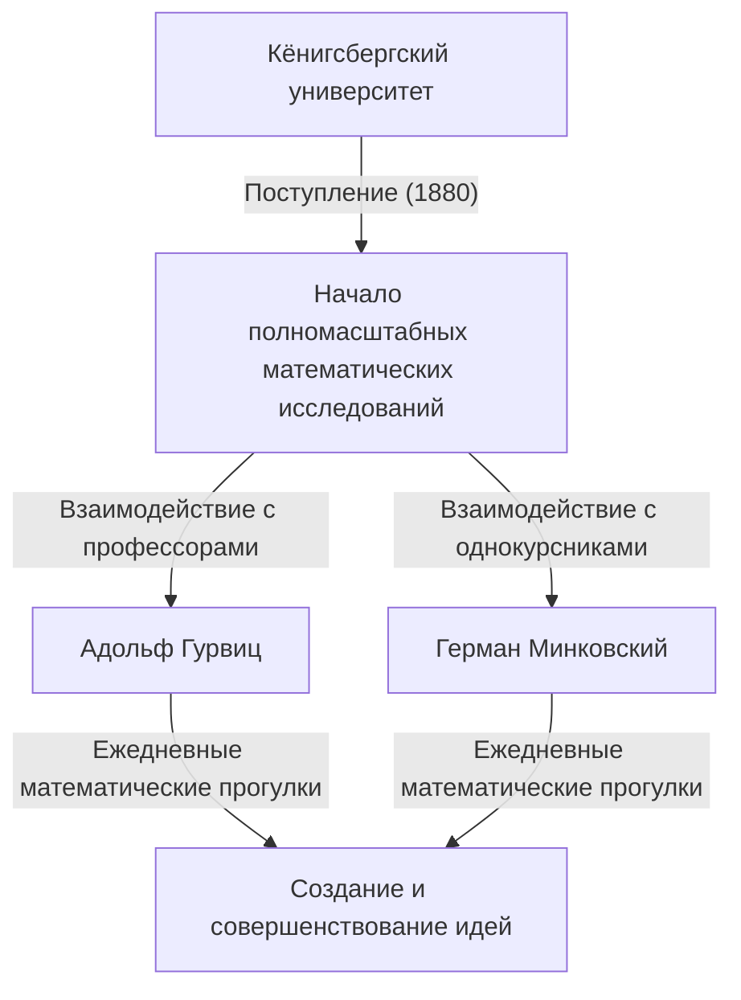
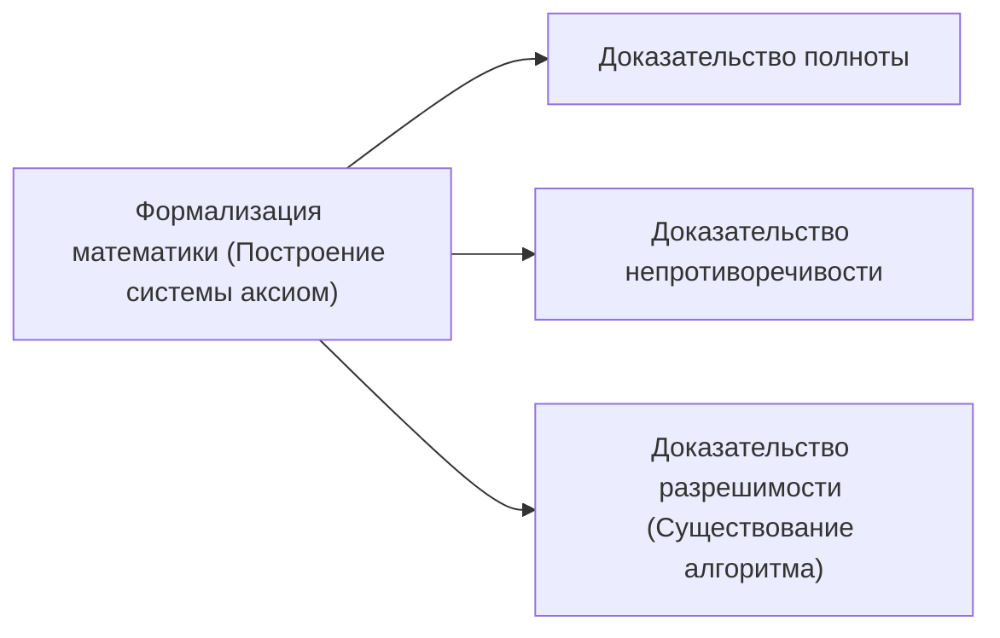

## 1. Введение: Отец современной математики

[Давид Гильберт](https://kenji.blog/ru/p/hilbert/) (23 января 1862 г. – 14 февраля 1943 г.) был немецким математиком, получившим широкое признание как один из самых влиятельных и великих математиков конца XIX и начала XX веков. Часто сравниваемый со своим блестящим французским современником [Анри Пуанкаре](https://kenji.blog/ru/p/poincare/), Гильберт подчеркивал строгую логику и формализм, в отличие от опоры Пуанкаре на интуицию. Гильберт глубоко повлиял почти на каждую область современной математики, заработав прозвище **«Король математики»**.

Его вклад охватывает теорию инвариантов, алгебраическую теорию чисел, аксиоматизацию геометрии, интегральные уравнения, функциональный анализ (гильбертовы пространства) и теоретическую физику (математические основы общей теории относительности). Его величайшее наследие заключается не просто в решении изолированных открытых проблем, а в фундаментальном переосмыслении структуры и природы самой математики, установлении новых парадигм аксиоматизма и формализма. В этой статье мы подробно и глубоко рассмотрим драматические эпизоды жизни Гильберта и его блестящие достижения.

## 2. Рождение и ранние годы в Кёнигсберге: Пробуждение в городе знаний

Гильберт родился 23 января 1862 года в Велау, недалеко от Кёнигсберга (ныне Калининград, Россия), столицы провинции Восточная Пруссия в Королевстве Пруссия. Его отец, Отто Гильберт, был строгим окружным судьей. Его мать, Мария Тереза, была хорошо образованной женщиной с глубоким интересом к философии и астрономии. Говорят, что Гильберт унаследовал свое логическое мышление и жажду знаний от родителей.

Кёнигсберг был городом с глубокими академическими корнями; он был родиной великого философа Иммануила Канта и славился проблемой «Семи мостов Кёнигсберга», решенной Леонардом Эйлером. В школьные годы оценки Гильберта не были выдающимися, но он обладал особой интуицией и страстью к математике. Он ненавидел зубрежку, предпочитая решать проблемы, выстраивая логику с нуля в собственном уме. Этот подход — построение на логическом фундаменте, а не опора на запоминание — стал основой его более позднего математического стиля.

### «Математические прогулки» и друзья на всю жизнь

В 1880 году Гильберт поступил в Кёнигсбергский университет, где встретил двух людей, которые изменили его жизнь. Одним был гений Герман Минковский, выигравший математическую премию Парижской академии наук всего в 18 лет. Другим был Адольф Гурвиц, блестящий молодой профессор.

Трое из них взяли за правило каждый день в определенное время гулять под яблоней возле университета, страстно обсуждая новейшие математические проблемы. Эти ежедневные **«математические прогулки»** позволили математическим талантам молодого Гильберта полностью раскрыться. Сталкивая идеи с двумя умами, обладавшими совершенно разной математической интуицией, Гильберт совершенствовал свои собственные концепции и погружался в глубины математики.

## 3. Прорыв в теории инвариантов: Прыжок за пределы критики Гордана

Гильберт впервые приобрел мировую известность в области теории инвариантов. Теория инвариантов изучает свойства полиномов, которые остаются неизменными при преобразованиях координат. В то время Пауль Гордан, ведущий эксперт в этой области, доказал, что инварианты двух переменных имеют конечный базис (теорема Гордана), но случай для трех или более переменных требовал чрезвычайно сложных вычислений и оставался нерешенной проблемой в течение многих лет.

В 1888 году Гильберт взялся за эту задачу с совершенно новым подходом. Отказавшись от традиционного метода явного вычисления и построения базисных формул, он использовал доказательство от противного, чтобы представить доказательство существования того, что **«конечный базис должен существовать»**. Эта мощная теорема известна сегодня как **теорема Гильберта о базисе**.

Легенда гласит, что, увидев это абстрактное доказательство, полностью лишенное вычислений, Гордан в гневе воскликнул: **«Это не математика. Это теология!»** (Das ist nicht Mathematik. Das ist Theologie!). Позже, однако, даже Гордану пришлось признать логическую правильность и силу этого метода. Достижение Гильберта ознаменовало исторический поворотный момент, когда центр математики сместился от «построения через конкретные вычисления» к «доказательству существования абстрактных структур».

## 4. Алгебраическая теория чисел и монументальный «Zahlbericht»

После успеха в теории инвариантов Гильберт обратился к алгебраической теории чисел. По поручению Немецкого математического общества в 1897 году он написал «Zahlbericht» (Отчет о числах), монументальный труд, который синтезировал существующие знания алгебраической теории чисел и реконструировал их с совершенно новой точки зрения.

В этом отчете он применил теорию Галуа к теории чисел, заложив основы теории полей классов Гильберта. Теория полей классов, позже усовершенствованная Тейдзи Такаги и Эмилем Артином, считается одной из самых красивых теорий в теории чисел 20-го века. Гильберту удалось объединить, казалось бы, разрозненные результаты в теории чисел в рамках высших, прекрасных законов.

## 5. Аксиоматизация геометрии: Философия «Столов, стульев и пивных кружек»

В 1899 году Гильберт опубликовал книгу «Grundlagen der Geometrie» (Основания геометрии). В ней была полностью реконструирована система аксиом евклидовой геометрии, которая была абсолютным фундаментом геометрии более 2000 лет, с современной точки зрения.

«Начала» [Евклид](https://kenji.blog/ru/p/euclid/)а содержали несколько неявных предположений и элементов, зависящих от визуальной интуиции. Гильберт строго исключил их, представив строго определенную систему аксиом, состоящую из пяти групп: аксиомы инцидентности, порядка, конгруэнтности, параллельности и непрерывности.

Он знаменито заявил: **«В любой момент вместо точек, прямых и плоскостей можно сказать — столы, стулья и пивные кружки»**. Это было громкое заявление о **формализме**, лишающее геометрию любой интуитивной или физической реальности в отношении того, чем являются объекты, и устанавливающее только логические отношения между объектами в качестве основы математики. Этот новаторский подход стал стандартным стилем аксиоматического метода в современной математике.

## 6. Приглашение в Геттингенский университет и начало Золотого века

В 1895 году, благодаря решительной рекомендации Феликса Клейна, тяжеловеса в немецкой математике, Гильберт был назначен профессором Геттингенского университета. Геттинген уже славился как священная земля для математики, когда-то будучи домом Карла Фридриха Гаусса и Бернхарда Римана.

С прибытием Гильберта Геттинген прочно восстановил свои позиции как главный математический центр мира. Его лекции всегда были ясными и полными страсти к новым математическим идеям, привлекая блестящих студентов и исследователей со всего мира. Многие суперзвезды, которые позже возглавят математику 20-го века, такие как [Эмми Нётер](https://kenji.blog/ru/p/noether/), Герман Вейль, Рихард Курант и Джон фон Нейман, были учениками Гильберта.

Особенно известен анекдот об [Эмми Нётер](https://kenji.blog/ru/p/noether/). В то время правила университета запрещали женщинам занимать академические должности. Гильберт, высоко ценя ее исключительный талант в алгебре, яростно протестовал на собрании факультета, заявляя: **«Сенат университета — это не баня, поэтому пол не имеет значения!»** Это заявление ярко иллюстрирует его прогрессивный, основанный на заслугах и свободный от предрассудков характер.

## 7. Парижский Международный конгресс математиков 1900 года: 23 проблемы Гильберта

В 1900 году на втором Международном конгрессе математиков (ICM), состоявшемся в Париже, Гильберт произнес историческую и монументальную речь. Задавшись вопросом: «Каковы проблемы, которые будут определять прогресс математики в наступающем веке?», он представил **«23 нерешенные проблемы»**, которые должны были стремиться решить математики 20-го века.

Эти проблемы охватывали все области математики того времени и послужили огромной движущей силой для последующего математического развития. Вот некоторые из самых известных:

1. **Континуум-гипотеза** (Проблема 1): Существует ли множество, мощность которого строго находится между мощностью целых и действительных чисел? Позже Гёдель и Коэн доказали, что это не зависит от стандартных аксиом ZFC.
2. **Непротиворечивость аксиом арифметики** (Проблема 2): Докажите, что аксиомы арифметики непротиворечивы, используя только финитные методы.
3. **Равенство объемов двух тетраэдров с равными основаниями и равными высотами** (Проблема 3): Всегда ли можно разбить два таких многогранника на конечное число кусков и собрать один из другого? Эту задачу отрицательно решил его ученик Макс Ден.
6. **Аксиоматизация физики** (Проблема 6): Аксиоматизировать разделы физики, где математика играет решающую роль, такие как теория вероятностей и механика.
8. **Проблемы, касающиеся распределения простых чисел** (Проблема 8): Печально известная гипотеза Римана и проблема Гольдбаха. Они остаются нерешенными по сей день.
10. **Разрешимость диофантова уравнения** (Проблема 10): Найти общий алгоритм для определения того, имеет ли заданное полиномиальное уравнение с целыми коэффициентами целое решение. В 1970 году Матиясевич доказал, что такого алгоритма не существует.

Проблемы Гильберта остаются важнейшими указателями для современных математиков даже сегодня.

## 8. Интегральные уравнения и гильбертово пространство: Мост к квантовой механике

Войдя в 1900-е годы, интерес Гильберта сместился с алгебры и геометрии к анализу. Он глубоко изучал теорию интегральных уравнений шведского математика Ивара Фредгольма и построил спектральную теорию в бесконечномерных пространствах.

В этом процессе он ввел концепцию **гильбертова пространства**, обобщение конечномерного евклидова пространства на бесконечные размерности. Внутреннее произведение $\langle x, y \rangle$ в пространстве с внутренним произведением $\mathcal{H}$ строго определяется как пространство, которое обладает линейностью и эрмитовой симметрией и удовлетворяет полноте (все последовательности Коши сходятся). Выраженное математически, внутреннее произведение удовлетворяет условиям:

$$
\langle a x_1 + b x_2, y \rangle = a \langle x_1, y \rangle + b \langle x_2, y \rangle
$$
$$
\langle x, y \rangle = \overline{\langle y, x \rangle}
$$

Здесь $x, y, x_1, x_2 \in \mathcal{H}$ и $a, b \in \mathbb{C}$ (комплексные числа), а $\overline{\langle y, x \rangle}$ обозначает комплексно сопряженное значение. Норма индуцируется формулой $\|x\| = \sqrt{\langle x, x \rangle}$.

Удивительно, но эта абстрактная теория, которую Гильберт построил из чисто математического любопытства, десятилетия спустя оказалась идеальным математическим языком для описания состояний физических систем в новорожденной квантовой механике. Когда Вернер Гейзенберг сформулировал матричную механику, а Эрвин Шрёдингер — волновую механику, теория гильбертовых пространств стала незаменимым инструментом, в первую очередь благодаря работам Джона фон Неймана. Это потрясающий пример того, как математика предвосхищает физику.

## 9. Набег в физику и действие Эйнштейна-Гильберта

Гильберт часто шутил, что «физика слишком сложна для физиков», и он стремился реконструировать основы физики, используя строгие математические аксиоматические методы (связанные с его 6-й проблемой).

В 1915 году, в период, когда Альберт Эйнштейн изо всех сил пытался завершить уравнения гравитационного поля для общей теории относительности, Гильберт также работал над этой проблемой. Используя математически элегантный метод вариационного принципа, Гильберт вывел правильные уравнения гравитационного поля почти одновременно с Эйнштейном. Сегодня интеграл действия, лежащий в основе этой теории, известен как **действие Эйнштейна-Гильберта**.

$$
S = \int \left( \frac{R}{16 \pi G} + \mathcal{L}_M \right) \sqrt{-g} \, d^4x
$$

Значение формулы: здесь $R$ — скалярная кривизна, представляющая искривление пространства-времени, $G$ — гравитационная постоянная Ньютона, $g$ — определитель метрического тензора, $\mathcal{L}_M$ — плотность лагранжиана полей материи, а $\text{интегрирование выполняется по всему пространству-времени}$.

Хотя между Эйнштейном и Гильбертом мог возникнуть спор о приоритете, Гильберт глубоко уважал великолепную физическую интуицию Эйнштейна и публично заявил, что «именно Эйнштейн открыл это уравнение», никогда не претендуя на приоритет для себя.

## 10. Программа Гильберта: Поиск абсолютной непротиворечивости в математике

После Первой мировой войны в ответ на «кризис оснований математики», вызванный парадоксами в теории множеств (такими как парадокс Рассела), Гильберт предложил самый амбициозный проект в своей жизни: **Программу Гильберта**.

Он стремился реконструировать всю математику как «формальную систему», рассматривая все математические предложения как бессмысленные строки символов и манипулируя ими в соответствии с механическими правилами вывода. Его целью было математически доказать — используя только безопасные, финитные рассуждения — что противоречия, такие как « $0 = 1$ », абсолютно никогда не могут быть выведены в рамках этой системы (непротиворечивость).

Эта программа вызвала ожесточенные дебаты (кризис оснований) с интуиционистами, такими как Л. Э. Я. Брауэр. Тем не менее Гильберт смело продвигал свою программу, заявляя: «Никто не изгонит нас из рая, который создал для нас Кантор».

## 11. Шок от теорем о неполноте Гёделя и трансформация программы

Однако в 1931 году молодой австрийский логик [Курт Гёдель](https://kenji.blog/ru/p/godel/) опубликовал свои **теоремы о неполноте**, нанеся решающий удар по программе Гильберта.

Гёдель математически и безупречно доказал, что в любой достаточно мощной формальной системе, содержащей аксиомы арифметики, всегда будут существовать предложения, которые «истинны в рамках системы, но не могут быть ни доказаны, ни опровергнуты» (Первая теорема о неполноте), и что «невозможно доказать непротиворечивость системы внутри самой системы» (Вторая теорема о неполноте).

Это продемонстрировало, что построение «идеальной математической системы, в которой все может быть доказано, включая ее собственную непротиворечивость», о которой мечтал Гильберт, было невозможным. Хотя Гильберт, как сообщается, поначалу был глубоко разочарован и разгневан этим результатом, строгие методы метаматематики и формальной логики, разработанные в ходе реализации Программы Гильберта, в конечном итоге привели непосредственно к созданию информатики и теоретической информатики Аланом Тьюрингом.

## 12. Последние годы в Геттингене: Возвышение нацистов и конец математического святилища

В 1930-х годах нацистская партия во главе с Адольфом Гитлером захватила власть в Германии. В 1933 году был принят «Закон о восстановлении профессионального чиновничества», что привело к безжалостному изгнанию многих выдающихся еврейских математиков и инакомыслящих ученых в Геттингенском университете, включая [Эмми Нётер](https://kenji.blog/ru/p/noether/), Германа Вейля, Рихарда Куранта и Макса Борна.

Геттинген, некогда яркое математическое святилище, где собирались таланты со всего мира, рухнул почти в одночасье. Однажды на банкете нацистский министр образования Бернхард Руст спросил Гильберта: «Как обстоят дела с математикой в вашем институте теперь, когда он освобожден от еврейского влияния?» Гильберт ответил с гневом и печалью: «Математический институт? Его больше нет».

14 февраля 1943 года, в разгар Второй мировой войны, Гильберт скончался в одиночестве в возрасте 81 года в Геттингене, после того как большинство его бывших учеников бежали в Америку и другие страны. На его похоронах присутствовало очень мало людей.

## 13. Заключение: «Мы должны знать, мы будем знать»

Даже после того, как [Давид Гильберт](https://kenji.blog/ru/p/hilbert/) ушел из жизни, оставленное им математическое наследие никогда не угасало. Траектория его мыслей вписана в каждый уголок современной математики.

На его надгробии выгравированы знаменитые слова, завершившие его речь по случаю выхода на пенсию в его родном городе Кёнигсберге в 1930 году, демонстрирующие его непоколебимую, абсолютную веру в человеческий разум и научные исследования. Это было мощное опровержение пессимистического агностицизма того времени, резюмируемого фразой «ignoramus et ignorabimus» (мы не знаем и не будем знать).

> **Wir müssen wissen.**
> **Wir werden wissen.**
> (Мы должны знать. Мы будем знать.)

[Давид Гильберт](https://kenji.blog/ru/p/hilbert/) глубоко верил в бесконечные возможности математики и продолжал осваивать ее границы на протяжении всей своей жизни. Его стойкий дух, философия и блестящие достижения стали плотью и кровью современных математиков, вдыхая жизнь в каждый уголок математики сегодня и продолжая вдохновлять будущих исследователей.

## Хронология

* **1862**: Родился в Велау, недалеко от Кёнигсберга, Восточная Пруссия.
* **1880**: Поступает в Кёнигсбергский университет. Встречает Минковского и Гурвица.
* **1885**: Получает степень доктора философии в Кёнигсберге.
* **1888**: Доказывает «теорему Гильберта о базисе» в теории инвариантов.
* **1895**: Назначен профессором Геттингенского университета по приглашению Клейна.
* **1897**: Публикует «Zahlbericht» по алгебраической теории чисел.
* **1899**: Публикует «Основания геометрии», аксиоматизируя геометрию.
* **1900**: Представляет свои «23 проблемы» на Международном конгрессе математиков в Париже.
* **1909**: Положительно решает проблему Варинга.
* **1915**: Формулирует «действие Эйнштейна-Гильберта» в общей теории относительности.
* **1920-е**: Предлагает «Программу Гильберта».
* **1930**: Выходит на пенсию в Геттингенском университете. Произносит речь «Мы должны знать, мы будем знать».
* **1943**: Умирает в возрасте 81 года в Геттингене.
