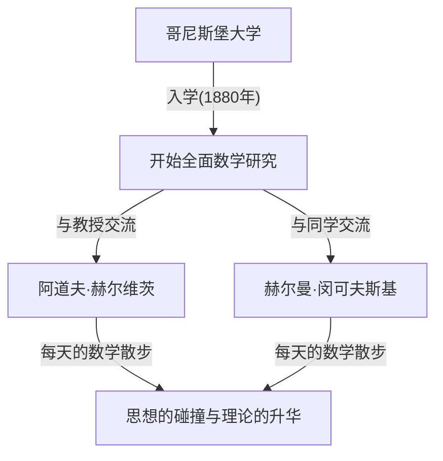
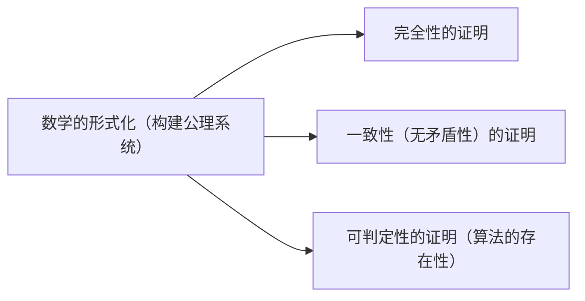

## 1. 引言：被誉为现代数学之父的缘由

[大卫·希尔伯特](https://kenji.blog/zh-cn/p/hilbert/)（David Hilbert，1862年1月23日 – 1943年2月14日）是德国诞生的一位在19世纪末至20世纪初最伟大且最具影响力的数学家之一。他经常与同时代的法国天才[亨利·庞加莱](https://kenji.blog/zh-cn/p/poincare/)相提并论，但庞加莱重视直觉，而希尔伯特则强调严格的逻辑与形式主义。希尔伯特深刻地影响了几乎所有现代数学的领域，甚至获得了 **“数学之王”** 的美誉。

他的成就涵盖了不变量理论、代数数论、几何学公理化、积分方程论、泛函分析（希尔伯特空间）以及理论物理学（广义相对论的数学基础）。他最大的功绩不仅仅在于解决了个别的未解之谜，更在于从根本上重新审视了数学这门学科的存在方式与结构，确立了公理主义与形式主义的新范式。在这篇文章中，我们将深入且详细地回顾希尔伯特波澜壮阔的生平事迹以及他留下的辉煌成就。

## 2. 诞生与青年时代的哥尼斯堡：在学术之城的觉醒

希尔伯特于1862年1月23日出生在普鲁士王国东普鲁士省首府哥尼斯堡（现俄罗斯联邦加里宁格勒）郊外的韦劳。父亲奥托·希尔伯特是一位地方法院的法官，为人严厉。母亲玛丽亚·特蕾泽是一位受过良好教育、对哲学和天文学有浓厚兴趣的女性。据说，希尔伯特的逻辑思维能力和对学问的探求心正是深受父母的影响。

哥尼斯堡是一座有着深厚学术渊源的城市；它是伟大哲学家伊曼努尔·康德的故乡，也因[莱昂哈德·欧拉](https://kenji.blog/zh-cn/p/euler/)解决的“哥尼斯堡七桥问题”而闻名。少年时代的希尔伯特在学校的成绩平平，但他对数学却有着特殊的直觉与热情。他极度讨厌死记硬背，喜欢在自己的脑海中从零开始构建逻辑来解决问题。这种“不依赖背诵，从逻辑的基础开始构建”的态度，成为了他后来数学风格的核心。

### “数学散步”与一生的挚友

1880年，考入哥尼斯堡大学的希尔伯特，在那里遇到了彻底改变他一生的两位人物。一位是年仅18岁就获得巴黎科学院数学大奖的绝对天才赫尔曼·闵可夫斯基（Hermann Minkowski），另一位是崭露头角的年轻教授阿道夫·赫尔维茨（Adolf Hurwitz）。

他们三人养成了一个习惯：每天在规定的时间，在大学附近的一棵苹果树下散步，并热烈讨论最新的数学问题。这个被称为 **“数学散步”** 的日常活动，让年轻希尔伯特的数学才华得以完全绽放。拥有完全不同数学直觉的三人毫不客气地碰撞思想，使得希尔伯特能够不断提炼自己的想法，并踏入了数学的深渊。

## 3. 不变量理论的突破：跨越哥尔丹批评的飞跃

希尔伯特最初获得世界性声誉是在不变量理论（Invariant theory）领域。不变量理论研究的是多项式在坐标变换等操作下保持不变的性质。当时，该领域的权威保罗·哥尔丹（Paul Gordan）已经证明了双变量的不变量具有有限个基（哥尔丹定理），但对于三个或更多变量的情况，由于需要极其复杂的计算，多年来一直悬而未决。

1888年，希尔伯特以一种全新的方法挑战了这一难题。他放弃了通过具体计算来构造基底表达式的传统方法，而是运用反证法提出了一个存在性证明： **“有限个基必须存在”** 。这就是今天著名的 **希尔伯特基定理** 。

传说中，当哥尔丹看到这个完全没有计算的抽象证明时，愤怒地大喊： **“这不是数学。这是神学！”** （Das ist nicht Mathematik. Das ist Theologie!）。然而，后来连哥尔丹也不得不承认这种方法的逻辑正确性和强大力量。希尔伯特的这一成就标志着一个历史性的转折点，数学的中心从“通过具体计算进行构造”转向了“抽象结构的存在性证明”。

## 4. 代数数论与里程碑式的《数论报告》

在不变量理论取得成功之后，希尔伯特将目光转向了代数数论。1897年，受德国数学家协会的委托，他撰写了《数论报告》（Zahlbericht）。这是一部里程碑式的著作，综合了当时代数数论的知识，并从一个全新的视角对其进行了重构。

在这份报告中，他将伽罗瓦理论应用于数论，奠定了希尔伯特类域论（Class field theory）的基础。类域论后来由高木贞治和埃米尔·阿廷等人完善，被认为是20世纪数论中最美的理论之一。希尔伯特成功地将数论中看似互不相关的结果统一在了更高层次的优美法则之下。

## 5. 几何学公理化：“桌子、椅子和啤酒杯”的哲学

1899年，希尔伯特出版了《几何基础》（Grundlagen der Geometrie）一书。这使得2000多年来一直被视为几何学绝对基础的[欧几里得](https://kenji.blog/zh-cn/p/euclid/)几何公理系统，从现代的视角得到了彻底的重构。

[欧几里得](https://kenji.blog/zh-cn/p/euclid/)的《几何原本》中存在一些依赖于视觉直觉的隐含假设。希尔伯特严格排除了这些因素，提出了一个由五组构成的严格定义的公理系统：关联公理、顺序公理、合同公理、平行公理和连续公理。

他有一句名言： **“我们必须能够用桌子、椅子和啤酒杯来代替点、直线和平面。”** 这是对 **形式主义** （Formalism）的响亮宣言，剥离了几何学对象在现实世界中的直觉意义或物理实体，仅将对象之间的逻辑关系作为数学的基础。这种开创性的方法成为了现代数学中公理化方法的标准范式。

## 6. 受邀至哥廷根大学与黄金时代的黎明

1895年，在德国数学界重量级人物费利克斯·克莱因（Felix Klein）的强烈推荐下，希尔伯特被任命为哥廷根大学教授。哥廷根大学曾是[卡尔·弗里德里希·高斯](https://kenji.blog/zh-cn/p/gauss/)和伯恩哈德·黎曼的所在地，是名副其实的数学圣地。

随着希尔伯特的到来，哥廷根再次确立了其作为世界首屈一指的数学中心的地位。他的讲座总是清晰明了，充满了对新数学思想的热情，吸引了来自世界各地的优秀学生和研究人员。许多后来引领20世纪数学的巨星，如[埃米·诺特](https://kenji.blog/zh-cn/p/noether/)（[Emmy Noether](https://kenji.blog/zh-cn/p/noether/)）、赫尔曼·外尔（Hermann Weyl）、理查德·库朗（Richard Courant）和约翰·冯·诺伊曼（John von Neumann），都曾受过希尔伯特的教导。

关于[埃米·诺特](https://kenji.blog/zh-cn/p/noether/)的轶事尤为著名。当时，大学规定禁止女性担任教职。但希尔伯特高度评价她在代数方面非凡的才华，在教授会议上激烈抗议，宣称： **“大学的参议院不是澡堂，所以性别无关紧要！”** 这句话生动地体现了他进步、唯才是举且没有偏见的品格。

## 7. 1900年巴黎国际数学家大会：希尔伯特的23个问题

1900年，在巴黎举行的第二届国际数学家大会（ICM）上，希尔伯特发表了具有历史意义的里程碑式的演讲。他问道：“在即将到来的世纪，哪些问题将指引数学的进步？”，并提出了20世纪数学家应努力解决的 **“23个未解问题”** 。

这些问题涵盖了当时数学的所有领域，成为了后来数学发展的巨大驱动力。以下是其中最著名的几个：

1. **连续统假设** （第1问题）：是否存在一个集合，其基数严格介于自然数和实数之间？后来哥德尔和科恩证明，这独立于标准的ZFC公理。
2. **算术公理的一致性** （第2问题）：仅使用有穷方法证明算术公理是一致的。
3. **等底等高两个四面体体积的相等性** （第3问题）：这两个多面体是否总是可以被分割成有限块并重新拼凑成另一个？他的学生马克斯·德恩给出了否定的解答。
6. **物理学的公理化** （第6问题）：将数学在其中发挥关键作用的物理学分支（如概率论和力学）公理化。
8. **素数分布问题** （第8问题）：著名的黎曼猜想和[哥德巴赫猜想](https://kenji.blog/zh-cn/p/goldbachs-conjecture/)。至今仍未解决。
10. **[丢番图](https://kenji.blog/zh-cn/p/diophantus/)方程可解性的判定** （第10问题）：寻找一个通用算法，以判定给定的整系数多项式方程是否有整数解。1970年，马季亚谢维奇证明了这种算法不存在。

希尔伯特的问题至今仍然是现代数学家的重要路标。

## 8. 积分方程与希尔伯特空间：通向量子力学的桥梁

进入20世纪初，希尔伯特的兴趣从代数和几何转向了分析学。他深入研究了瑞典数学家伊瓦尔·弗雷德霍姆的积分方程理论，并在无限维空间中构建了谱理论。

在这个过程中，他引入了 **希尔伯特空间** （[Hilbert](https://kenji.blog/zh-cn/p/hilbert/) space）的概念，这是将有限维[欧几里得](https://kenji.blog/zh-cn/p/euclid/)空间推广到无限维。内积空间 $\mathcal{H}$ 中的内积 $\langle x, y \rangle$ 被严格定义为具有线性、埃尔米特对称性，并满足完备性（所有柯西列都收敛）的空间。用数学公式表示，内积满足：

$$
\langle a x_1 + b x_2, y \rangle = a \langle x_1, y \rangle + b \langle x_2, y \rangle
$$
$$
\langle x, y \rangle = \overline{\langle y, x \rangle}
$$

其中，$x, y, x_1, x_2 \in \mathcal{H}$ 且 $a, b \in \mathbb{C}$ （复数），$\overline{\langle y, x \rangle}$ 表示复共轭。范数由 $\|x\| = \sqrt{\langle x, x \rangle}$ 导出。

令人惊叹的是，希尔伯特出于纯粹的数学好奇心而构建的这个抽象理论，在几十年后被证明是描述新生的量子力学中物理系统状态的完美数学语言。当维尔纳·海森堡创立矩阵力学、埃尔温·薛定谔创立波动力学时，希尔伯特空间的理论通过约翰·冯·诺伊曼等人的工作成为了不可或缺的工具。这是数学领先于物理学的绝佳范例。

## 9. 涉足物理学与爱因斯坦-希尔伯特作用量

希尔伯特常开玩笑说“物理学对物理学家来说太难了”，他旨在利用严谨的数学公理化方法来重建物理学的基础（与他的第6个问题相关）。

1915年，当阿尔伯特·爱因斯坦正在为完成广义相对论的引力场方程而苦苦挣扎时，希尔伯特也在研究这个问题。利用数学上优雅的变分原理技术，希尔伯特几乎与爱因斯坦同时推导出了正确的引力场方程。今天，该理论基础的作用量积分被称为 **爱因斯坦-希尔伯特作用量** （Einstein-[Hilbert](https://kenji.blog/zh-cn/p/hilbert/) action）。

$$
S = \int \left( \frac{R}{16 \pi G} + \mathcal{L}_M \right) \sqrt{-g} \, d^4x
$$

公式含义：在这里，$R$ 是表示时空弯曲程度的标量曲率，$G$ 是牛顿万有引力常数，$g$ 是度规张量的行列式，$\mathcal{L}_M$ 是物质场的拉格朗日密度，并且 $\text{积分是在整个时空范围内进行的}$ 。

尽管爱因斯坦和希尔伯特之间可能会发生优先权之争，但希尔伯特深深敬佩爱因斯坦卓越的物理直觉，并公开声明“是爱因斯坦发现了这个方程”，从未主张过自己的优先权。

## 10. 希尔伯特纲领：探求数学的绝对无矛盾性

第一次世界大战后，为了应对由集合论悖论（如罗素悖论）引发的“数学基础危机”，希尔伯特提出了他一生中最雄心勃勃的计划： **希尔伯特纲领** 。

他试图将所有数学重构为一个“形式系统”，将所有数学命题视为无意义的符号串，并根据机械的推理规则对其进行操作。他的目标是，仅利用安全、有穷的推理，在数学上证明像“ $0 = 1$ ”这样的矛盾绝对不可能在该系统中被推导出来（一致性）。

这一纲领引发了与直觉主义者如L.E.J.布劳威尔的激烈辩论（基础之争）。然而，希尔伯特大胆地推进了他的纲领，宣称：“没有人能把我们从康托尔为我们创造的乐园中驱逐出去。”

## 11. [哥德尔不完备定理](https://kenji.blog/zh-cn/p/godels-incompleteness-theorems/)的冲击与纲领的演变

然而，在1931年，年轻的奥地利逻辑学家[库尔特·哥德尔](https://kenji.blog/zh-cn/p/godel/)（[Kurt Gödel](https://kenji.blog/zh-cn/p/godel/)）发表了他的 **不完备定理** ，给了希尔伯特纲领致命的一击。

哥德尔在数学上完美地证明了，在任何包含算术公理的足够强大的形式系统中，总会存在“在系统内为真，但既不能被证明也不能被证伪”的命题（第一不完备定理），并且“不可能在系统内部证明系统本身的一致性”（第二不完备定理）。

这表明，希尔伯特梦想构建的“可以证明一切，包括其自身一致性的完美数学系统”是不可能的。尽管据说希尔伯特最初对这个结果深感失望和愤怒，但在追求希尔伯特纲领的过程中发展起来的元数学和形式逻辑的严谨方法，最终直接促成了阿兰·图灵创立计算机科学和理论计算机科学。

## 12. 哥廷根的晚年：纳粹的崛起与数学圣地的终结

到了20世纪30年代，以阿道夫·希特勒为首的纳粹党在德国夺取了政权。1933年颁布了《重设公职人员法》，导致哥廷根大学许多杰出的犹太裔数学家和持不同政见的学者被无情地驱逐，包括[埃米·诺特](https://kenji.blog/zh-cn/p/noether/)、赫尔曼·外尔、理查德·库朗和马克斯·玻恩。

哥廷根，这个曾经聚集了世界各地人才、充满活力的数学圣地，几乎在一夜之间崩溃。有一次，在一次宴会上，纳粹教育部长伯恩哈德·鲁斯特问希尔伯特：“既然你的研究所已经清除了犹太人的影响，现在数学方面怎么样了？”希尔伯特愤怒而悲伤地回答：“数学研究所？那里已经什么都没有了。”

1943年2月14日，在第二次世界大战期间，希尔伯特在哥廷根孤独地去世，享年81岁，而他过去的大部分学生都已逃往美国等地。参加他葬礼的人寥寥无几。

## 13. 结论：“我们必须知道，我们必将知道”

即使在[大卫·希尔伯特](https://kenji.blog/zh-cn/p/hilbert/)逝世之后，他留下的数学遗产也从未褪色。他思想的轨迹铭刻在现代数学的每一个角落。

在他的墓碑上，刻着他1930年在故乡哥尼斯堡发表的退休演讲结尾时的名言，这展现了他对人类理性和科学探索不可动摇的绝对信念。这是对当时以“ignoramus et ignorabimus”（我们不知道，我们将永远不知道）为代表的悲观不可知论的有力反驳。

> **Wir müssen wissen.**
> **Wir werden wissen.**
> （我们必须知道。我们必将知道。）

[大卫·希尔伯特](https://kenji.blog/zh-cn/p/hilbert/)深信数学的无限可能，并终其一生都在开拓它的边界。他坚韧的精神、哲学和辉煌的成就已经成为现代数学家的血肉，为今天数学的每一个角落注入生命，并继续激励着未来的探索者。

## 年表

* **1862年**：出生于东普鲁士哥尼斯堡附近的韦劳。
* **1880年**：进入哥尼斯堡大学。结识闵可夫斯基和赫尔维茨。
* **1885年**：获得哥尼斯堡大学博士学位。
* **1888年**：证明不变量理论中的“希尔伯特基定理”。
* **1895年**：应克莱因之邀被任命为哥廷根大学教授。
* **1897年**：发表关于代数数论的《数论报告》。
* **1899年**：出版《几何基础》，实现几何学的公理化。
* **1900年**：在巴黎国际数学家大会上提出“23个问题”。
* **1909年**：肯定地解决了华林问题。
* **1915年**：提出广义相对论中的“爱因斯坦-希尔伯特作用量”。
* **20世纪20年代**：提出“希尔伯特纲领”。
* **1930年**：从哥廷根大学退休。发表“我们必须知道，我们必将知道”的演讲。
* **1943年**：在哥廷根逝世，享年81岁。
